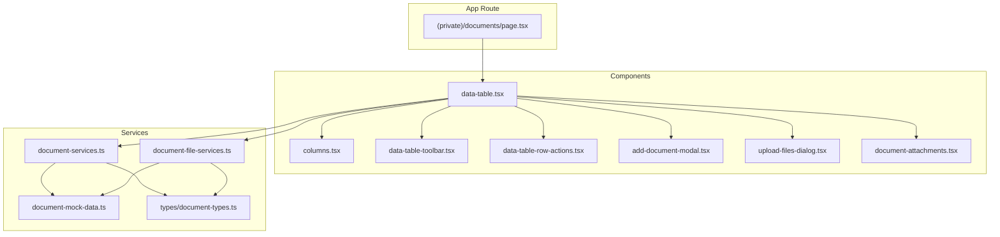
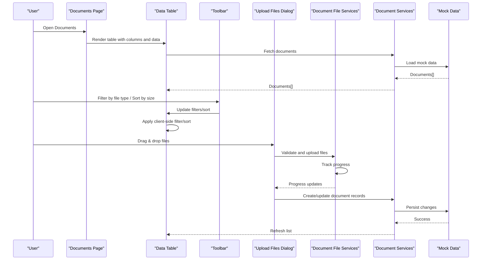
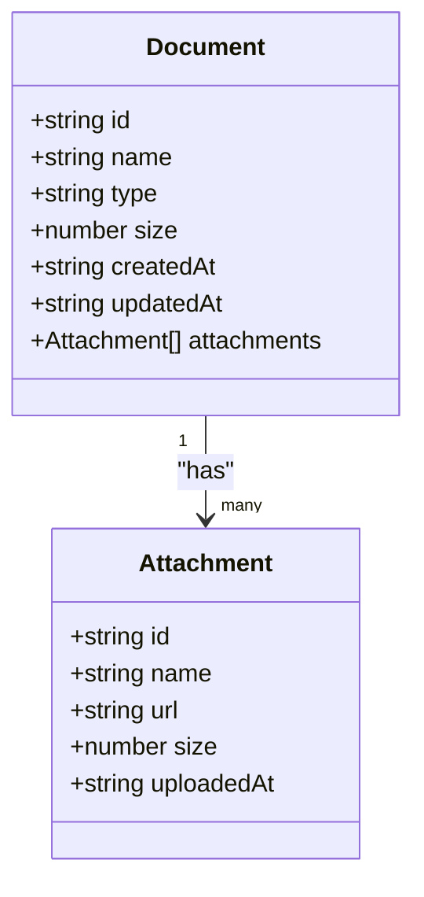
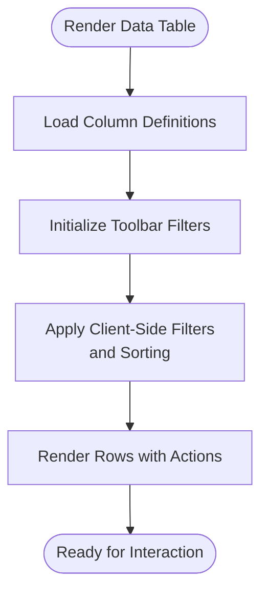
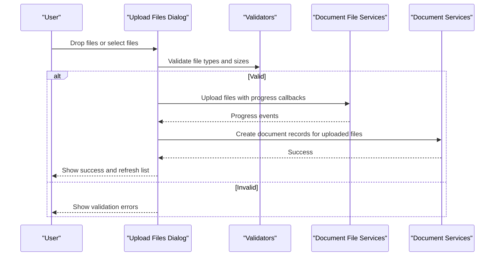
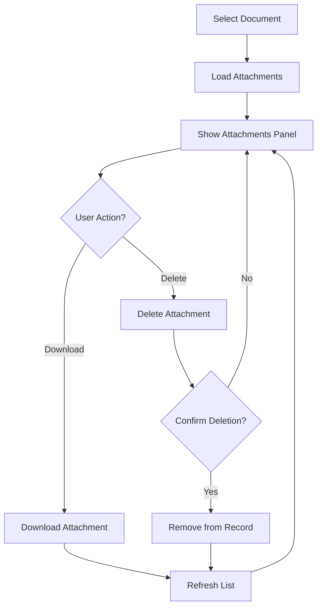
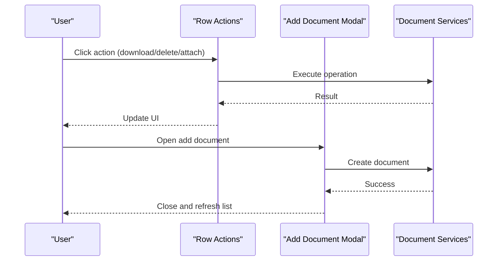
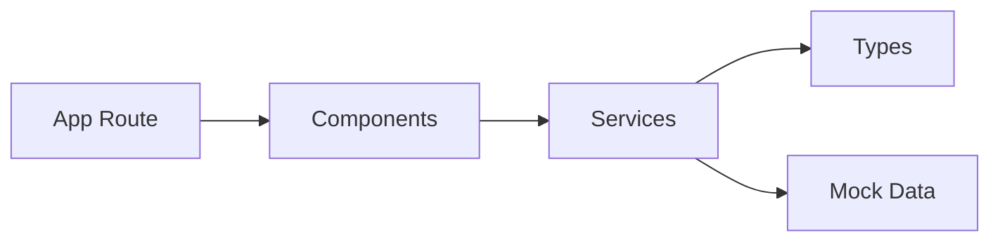

# Document Management

<cite>
**Referenced Files in This Document**
- [page.tsx](file://src/app/(private)/documents/page.tsx)
- [components/data-table.tsx](file://src/modules/documents/components/data-table.tsx)
- [components/columns.tsx](file://src/modules/documents/components/columns.tsx)
- [components/data-table-toolbar.tsx](file://src/modules/documents/components/data-table-toolbar.tsx)
- [components/data-table-row-actions.tsx](file://src/modules/documents/components/data-table-row-actions.tsx)
- [components/add-document-modal.tsx](file://src/modules/documents/components/add-document-modal.tsx)
- [components/upload-files-dialog.tsx](file://src/modules/documents/components/upload-files-dialog.tsx)
- [components/document-attachments.tsx](file://src/modules/documents/components/document-attachments.tsx)
- [services/document-services.ts](file://src/modules/documents/services/document-services.ts)
- [services/document-file-services.ts](file://src/modules/documents/services/document-file-services.ts)
- [services/document-mock-data.ts](file://src/modules/documents/services/document-mock-data.ts)
- [services/types/document-types.ts](file://src/modules/documents/services/types/document-types.ts)
</cite>

## Table of Contents
1. [Introduction](#introduction)
2. [Project Structure](#project-structure)
3. [Core Components](#core-components)
4. [Architecture Overview](#architecture-overview)
5. [Detailed Component Analysis](#detailed-component-analysis)
6. [Dependency Analysis](#dependency-analysis)
7. [Performance Considerations](#performance-considerations)
8. [Troubleshooting Guide](#troubleshooting-guide)
9. [Conclusion](#conclusion)
10. [Appendices](#appendices)

## Introduction
This document provides comprehensive documentation for the Document Management module. It covers the data model, file upload functionality, attachment management, and the document-specific data table features such as filtering by file type, sorting by size, and preview capabilities. It also explains the upload dialog with drag-and-drop support and progress tracking, and outlines patterns for custom validators, storage integrations, and versioning. Finally, it details service layer patterns and security considerations for file handling.

## Project Structure
The Document Management module is organized under src/modules/documents with a clear separation between UI components and services:
- components: Data table, toolbar, row actions, modals, and attachments UI
- services: Types, mock data, and service functions for documents and files
- app route: The page that renders the document management interface

**Diagram sources**
- [page.tsx](file://src/app/(private)/documents/page.tsx)
- [components/data-table.tsx](file://src/modules/documents/components/data-table.tsx)
- [components/columns.tsx](file://src/modules/documents/components/columns.tsx)
- [components/data-table-toolbar.tsx](file://src/modules/documents/components/data-table-toolbar.tsx)
- [components/data-table-row-actions.tsx](file://src/modules/documents/components/data-table-row-actions.tsx)
- [components/add-document-modal.tsx](file://src/modules/documents/components/add-document-modal.tsx)
- [components/upload-files-dialog.tsx](file://src/modules/documents/components/upload-files-dialog.tsx)
- [components/document-attachments.tsx](file://src/modules/documents/components/document-attachments.tsx)
- [services/document-services.ts](file://src/modules/documents/services/document-services.ts)
- [services/document-file-services.ts](file://src/modules/documents/services/document-file-services.ts)
- [services/document-mock-data.ts](file://src/modules/documents/services/document-mock-data.ts)
- [services/types/document-types.ts](file://src/modules/documents/services/types/document-types.ts)

**Section sources**
- [page.tsx](file://src/app/(private)/documents/page.tsx)
- [components/data-table.tsx](file://src/modules/documents/components/data-table.tsx)
- [services/document-services.ts](file://src/modules/documents/services/document-services.ts)

## Core Components
- Document data table: Provides pagination, sorting, filtering, and selection for documents.
- Columns definition: Defines columns including name, type, size, date, and actions.
- Toolbar: Offers search, filters (including file type), and view options.
- Row actions: Actions like download, delete, and manage attachments.
- Add document modal: Creates new document entries.
- Upload files dialog: Handles multi-file uploads with drag-and-drop and progress.
- Attachments panel: Displays and manages attachments per document.
- Services: Encapsulate data operations and file-related logic.

Key responsibilities:
- Data table orchestrates state and delegates to columns, toolbar, and row actions.
- Services abstract data access and file operations, using types for contracts.
- Dialogs and modals encapsulate user workflows for adding and uploading files.

**Section sources**
- [components/data-table.tsx](file://src/modules/documents/components/data-table.tsx)
- [components/columns.tsx](file://src/modules/documents/components/columns.tsx)
- [components/data-table-toolbar.tsx](file://src/modules/documents/components/data-table-toolbar.tsx)
- [components/data-table-row-actions.tsx](file://src/modules/documents/components/data-table-row-actions.tsx)
- [components/add-document-modal.tsx](file://src/modules/documents/components/add-document-modal.tsx)
- [components/upload-files-dialog.tsx](file://src/modules/documents/components/upload-files-dialog.tsx)
- [components/document-attachments.tsx](file://src/modules/documents/components/document-attachments.tsx)
- [services/document-services.ts](file://src/modules/documents/services/document-services.ts)
- [services/document-file-services.ts](file://src/modules/documents/services/document-file-services.ts)
- [services/document-mock-data.ts](file://src/modules/documents/services/document-mock-data.ts)
- [services/types/document-types.ts](file://src/modules/documents/services/types/document-types.ts)

## Architecture Overview
The module follows a layered architecture:
- Presentation layer: React components render the UI and handle user interactions.
- Service layer: Functions implement business logic and data access, using typed models.
- Data source: Mock data or external APIs are consumed via services.

**Diagram sources**
- [page.tsx](file://src/app/(private)/documents/page.tsx)
- [components/data-table.tsx](file://src/modules/documents/components/data-table.tsx)
- [components/data-table-toolbar.tsx](file://src/modules/documents/components/data-table-toolbar.tsx)
- [components/upload-files-dialog.tsx](file://src/modules/documents/components/upload-files-dialog.tsx)
- [services/document-services.ts](file://src/modules/documents/services/document-services.ts)
- [services/document-file-services.ts](file://src/modules/documents/services/document-file-services.ts)
- [services/document-mock-data.ts](file://src/modules/documents/services/document-mock-data.ts)

## Detailed Component Analysis

### Document Data Model
The data model defines the shape of documents and related entities used across the module. It includes fields for identifiers, metadata (name, type, size, dates), and relationships (e.g., attachments).

- Types are centralized in the types directory to ensure consistency across components and services.
- Services consume these types to enforce contracts when reading/writing data.

**Diagram sources**
- [services/types/document-types.ts](file://src/modules/documents/services/types/document-types.ts)

**Section sources**
- [services/types/document-types.ts](file://src/modules/documents/services/types/document-types.ts)

### Data Table Implementation
The data table component integrates:
- Column definitions for rendering and sorting
- Toolbar for search, faceted filters (file type), and view options
- Pagination and selection controls
- Row actions for operations like download and delete

Features:
- File type filtering: Faceted filter allows selecting allowed extensions.
- Size sorting: Numeric sort on file size column.
- Preview capability: Column action can open previews based on file type.

**Diagram sources**
- [components/data-table.tsx](file://src/modules/documents/components/data-table.tsx)
- [components/columns.tsx](file://src/modules/documents/components/columns.tsx)
- [components/data-table-toolbar.tsx](file://src/modules/documents/components/data-table-toolbar.tsx)

**Section sources**
- [components/data-table.tsx](file://src/modules/documents/components/data-table.tsx)
- [components/columns.tsx](file://src/modules/documents/components/columns.tsx)
- [components/data-table-toolbar.tsx](file://src/modules/documents/components/data-table-toolbar.tsx)

### File Upload Dialog
The upload dialog supports:
- Multi-file selection
- Drag-and-drop zone
- Real-time progress tracking
- Validation before upload
- Integration with file services for persistence

**Diagram sources**
- [components/upload-files-dialog.tsx](file://src/modules/documents/components/upload-files-dialog.tsx)
- [services/document-file-services.ts](file://src/modules/documents/services/document-file-services.ts)
- [services/document-services.ts](file://src/modules/documents/services/document-services.ts)

**Section sources**
- [components/upload-files-dialog.tsx](file://src/modules/documents/components/upload-files-dialog.tsx)
- [services/document-file-services.ts](file://src/modules/documents/services/document-file-services.ts)

### Attachment Management
Attachments are managed per document:
- Displayed in a dedicated panel
- Support listing, downloading, and deletion
- Linked to document records

**Diagram sources**
- [components/document-attachments.tsx](file://src/modules/documents/components/document-attachments.tsx)
- [services/document-services.ts](file://src/modules/documents/services/document-services.ts)

**Section sources**
- [components/document-attachments.tsx](file://src/modules/documents/components/document-attachments.tsx)
- [services/document-services.ts](file://src/modules/documents/services/document-services.ts)

### Row Actions and Modals
Row actions provide quick operations:
- Download, delete, and manage attachments
- Add document modal creates new entries
- These integrate with services to update state

**Diagram sources**
- [components/data-table-row-actions.tsx](file://src/modules/documents/components/data-table-row-actions.tsx)
- [components/add-document-modal.tsx](file://src/modules/documents/components/add-document-modal.tsx)
- [services/document-services.ts](file://src/modules/documents/services/document-services.ts)

**Section sources**
- [components/data-table-row-actions.tsx](file://src/modules/documents/components/data-table-row-actions.tsx)
- [components/add-document-modal.tsx](file://src/modules/documents/components/add-document-modal.tsx)
- [services/document-services.ts](file://src/modules/documents/services/document-services.ts)

## Dependency Analysis
The module exhibits low coupling between components and services:
- Components depend on services through function calls rather than direct imports of data stores.
- Types define contracts, reducing ambiguity and improving maintainability.
- Mock data serves as a placeholder for backend integration.

**Diagram sources**
- [components/data-table.tsx](file://src/modules/documents/components/data-table.tsx)
- [services/document-services.ts](file://src/modules/documents/services/document-services.ts)
- [services/document-file-services.ts](file://src/modules/documents/services/document-file-services.ts)
- [services/document-mock-data.ts](file://src/modules/documents/services/document-mock-data.ts)
- [services/types/document-types.ts](file://src/modules/documents/services/types/document-types.ts)

**Section sources**
- [services/document-services.ts](file://src/modules/documents/services/document-services.ts)
- [services/document-file-services.ts](file://src/modules/documents/services/document-file-services.ts)
- [services/document-mock-data.ts](file://src/modules/documents/services/document-mock-data.ts)
- [services/types/document-types.ts](file://src/modules/documents/services/types/document-types.ts)

## Performance Considerations
- Client-side filtering and sorting: Keep datasets manageable; consider server-side pagination for large lists.
- Debounce search input to reduce re-renders.
- Lazy-load attachments and previews to avoid heavy initial loads.
- Use virtualization for long lists if needed.
- Optimize image previews with thumbnails and compression.

[No sources needed since this section provides general guidance]

## Troubleshooting Guide
Common issues and resolutions:
- Upload failures: Check network requests and error responses from file services. Ensure progress callbacks are wired correctly.
- Validation errors: Verify file type and size constraints in validators.
- Filtering not working: Confirm filter values match column data types and formats.
- Sorting anomalies: Ensure numeric sorting for size and consistent date formats.
- Attachment operations failing: Validate permissions and record IDs passed to services.

**Section sources**
- [components/upload-files-dialog.tsx](file://src/modules/documents/components/upload-files-dialog.tsx)
- [services/document-file-services.ts](file://src/modules/documents/services/document-file-services.ts)
- [components/data-table-toolbar.tsx](file://src/modules/documents/components/data-table-toolbar.tsx)

## Conclusion
The Document Management module provides a robust foundation for managing documents and attachments with a clean separation of concerns. Its data table offers powerful filtering and sorting, while the upload dialog supports modern UX patterns like drag-and-drop and progress feedback. By following the service layer patterns and security guidelines outlined here, teams can extend the module with custom validators, storage backends, and versioning strategies safely and efficiently.

[No sources needed since this section summarizes without analyzing specific files]

## Appendices

### Implementing Custom File Validators
- Define validation rules for file type and size in the upload flow.
- Integrate validators into the upload dialog before invoking file services.
- Surface user-friendly error messages for invalid inputs.

**Section sources**
- [components/upload-files-dialog.tsx](file://src/modules/documents/components/upload-files-dialog.tsx)
- [services/document-file-services.ts](file://src/modules/documents/services/document-file-services.ts)

### Storage Integrations
- Replace mock persistence in services with real API calls.
- Handle authentication tokens and error retries at the service layer.
- Normalize responses to match the typed data model.

**Section sources**
- [services/document-services.ts](file://src/modules/documents/services/document-services.ts)
- [services/document-file-services.ts](file://src/modules/documents/services/document-file-services.ts)

### Document Versioning
- Extend the data model to include version fields and history.
- Implement create-version operations in services.
- Provide UI to switch versions and compare changes.

**Section sources**
- [services/types/document-types.ts](file://src/modules/documents/services/types/document-types.ts)
- [services/document-services.ts](file://src/modules/documents/services/document-services.ts)

### Security Considerations for File Handling
- Enforce allowlists for file types and maximum sizes.
- Sanitize filenames and validate content types server-side.
- Use secure URLs and signed links for downloads.
- Apply access controls per document and attachment.
- Log and monitor suspicious upload attempts.

**Section sources**
- [components/upload-files-dialog.tsx](file://src/modules/documents/components/upload-files-dialog.tsx)
- [services/document-file-services.ts](file://src/modules/documents/services/document-file-services.ts)