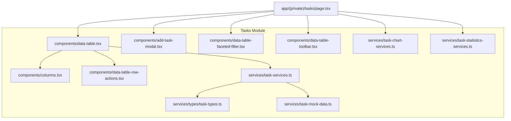
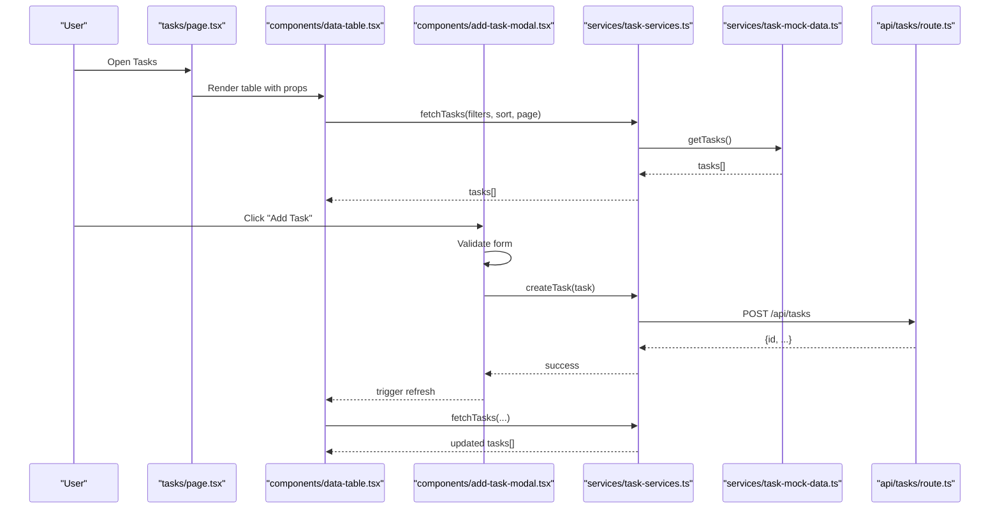
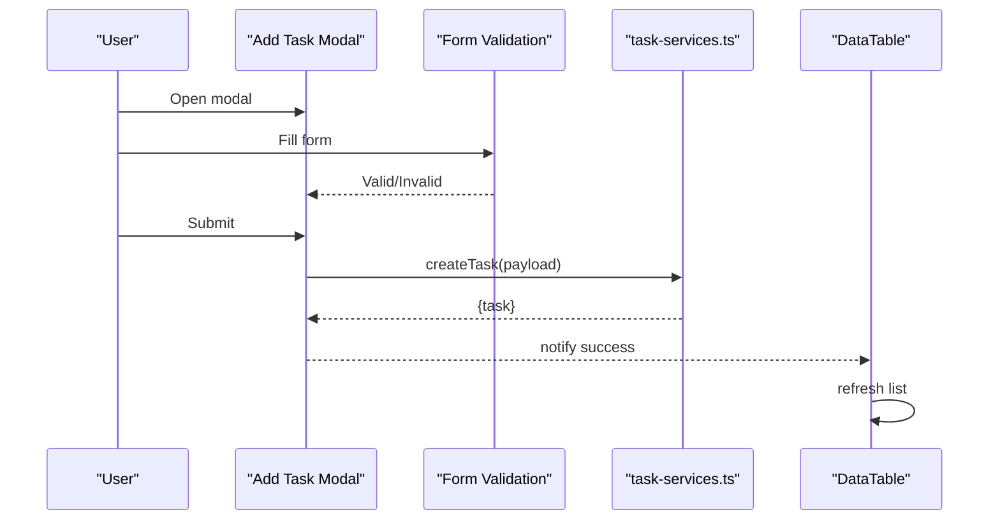
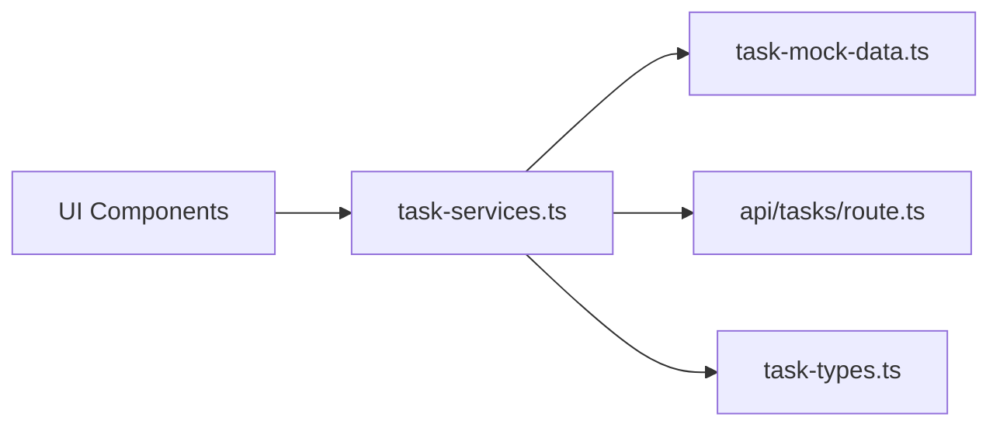
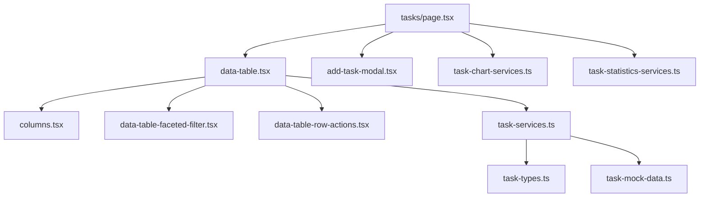

# Task Management

<cite>
**Referenced Files in This Document**
- [page.tsx](file://src/app/(private)/tasks/page.tsx)
- [route.ts](file://src/app/api/tasks/route.ts)
- [task-types.ts](file://src/modules/tasks/services/types/task-types.ts)
- [task-services.ts](file://src/modules/tasks/services/task-services.ts)
- [task-mock-data.ts](file://src/modules/tasks/services/task-mock-data.ts)
- [task-chart-services.ts](file://src/modules/tasks/services/task-chart-services.ts)
- [task-statistics-services.ts](file://src/modules/tasks/services/task-statistics-services.ts)
- [data-table.tsx](file://src/modules/tasks/components/data-table.tsx)
- [add-task-modal.tsx](file://src/modules/tasks/components/add-task-modal.tsx)
- [columns.tsx](file://src/modules/tasks/components/columns.tsx)
- [data-table-faceted-filter.tsx](file://src/modules/tasks/components/data-table-faceted-filter.tsx)
- [data-table-toolbar.tsx](file://src/modules/tasks/components/data-table-toolbar.tsx)
- [data-table-row-actions.tsx](file://src/modules/tasks/components/data-table-row-actions.tsx)
</cite>

## Table of Contents
1. [Introduction](#introduction)
2. [Project Structure](#project-structure)
3. [Core Components](#core-components)
4. [Architecture Overview](#architecture-overview)
5. [Detailed Component Analysis](#detailed-component-analysis)
6. [Dependency Analysis](#dependency-analysis)
7. [Performance Considerations](#performance-considerations)
8. [Troubleshooting Guide](#troubleshooting-guide)
9. [Conclusion](#conclusion)

## Introduction
The Task Management module provides a full-featured interface for creating, viewing, filtering, and managing tasks within the application. It includes a data table with faceted filters, status tracking, priority management, deadline handling, an add-task modal with form validation, and service layer integrations for mock data and analytics.

## Project Structure
The module follows a feature-based layout under src/modules/tasks with clear separation between UI components, services, types, and page integration.



**Diagram sources**
- [page.tsx](file://src/app/(private)/tasks/page.tsx)
- [data-table.tsx](file://src/modules/tasks/components/data-table.tsx)
- [add-task-modal.tsx](file://src/modules/tasks/components/add-task-modal.tsx)
- [columns.tsx](file://src/modules/tasks/components/columns.tsx)
- [data-table-faceted-filter.tsx](file://src/modules/tasks/components/data-table-faceted-filter.tsx)
- [data-table-toolbar.tsx](file://src/modules/tasks/components/data-table-toolbar.tsx)
- [data-table-row-actions.tsx](file://src/modules/tasks/components/data-table-row-actions.tsx)
- [task-types.ts](file://src/modules/tasks/services/types/task-types.ts)
- [task-services.ts](file://src/modules/tasks/services/task-services.ts)
- [task-mock-data.ts](file://src/modules/tasks/services/task-mock-data.ts)
- [task-chart-services.ts](file://src/modules/tasks/services/task-chart-services.ts)
- [task-statistics-services.ts](file://src/modules/tasks/services/task-statistics-services.ts)

**Section sources**
- [page.tsx](file://src/app/(private)/tasks/page.tsx)
- [data-table.tsx](file://src/modules/tasks/components/data-table.tsx)
- [add-task-modal.tsx](file://src/modules/tasks/components/add-task-modal.tsx)
- [columns.tsx](file://src/modules/tasks/components/columns.tsx)
- [data-table-faceted-filter.tsx](file://src/modules/tasks/components/data-table-faceted-filter.tsx)
- [data-table-toolbar.tsx](file://src/modules/tasks/components/data-table-toolbar.tsx)
- [data-table-row-actions.tsx](file://src/modules/tasks/components/data-table-row-actions.tsx)
- [task-types.ts](file://src/modules/tasks/services/types/task-types.ts)
- [task-services.ts](file://src/modules/tasks/services/task-services.ts)
- [task-mock-data.ts](file://src/modules/tasks/services/task-mock-data.ts)
- [task-chart-services.ts](file://src/modules/tasks/services/task-chart-services.ts)
- [task-statistics-services.ts](file://src/modules/tasks/services/task-statistics-services.ts)

## Core Components
- Data table: Central UI for listing, sorting, paging, and filtering tasks; integrates column definitions, row actions, toolbar, and faceted filters.
- Add task modal: Dialog for creating new tasks with form fields such as title, description, assignee, status, priority, and deadline; includes validation and submission flow.
- Columns: Column definitions for rendering task properties (e.g., title, status, priority, due date, assignee).
- Faceted filter: Multi-select filters for attributes like status and priority.
- Toolbar: Search input and controls to open the add-task modal and manage view options.
- Row actions: Contextual actions per task row (edit, delete, change status).

Key responsibilities:
- Maintain local state for pagination, sorting, and filters.
- Coordinate with the service layer for CRUD operations.
- Render status indicators and progress visuals.
- Provide user feedback via modals and inline notifications.

**Section sources**
- [data-table.tsx](file://src/modules/tasks/components/data-table.tsx)
- [add-task-modal.tsx](file://src/modules/tasks/components/add-task-modal.tsx)
- [columns.tsx](file://src/modules/tasks/components/columns.tsx)
- [data-table-faceted-filter.tsx](file://src/modules/tasks/components/data-table-faceted-filter.tsx)
- [data-table-toolbar.tsx](file://src/modules/tasks/components/data-table-toolbar.tsx)
- [data-table-row-actions.tsx](file://src/modules/tasks/components/data-table-row-actions.tsx)

## Architecture Overview
The module uses a layered architecture:
- Presentation layer: React components for table, modal, filters, and toolbar.
- Service layer: Encapsulates data fetching, mutations, and derived computations (charts/statistics).
- Type layer: Shared TypeScript types for tasks and related enums.
- API route: Server-side endpoint for persistence and optional real-time triggers.



**Diagram sources**
- [page.tsx](file://src/app/(private)/tasks/page.tsx)
- [data-table.tsx](file://src/modules/tasks/components/data-table.tsx)
- [add-task-modal.tsx](file://src/modules/tasks/components/add-task-modal.tsx)
- [task-services.ts](file://src/modules/tasks/services/task-services.ts)
- [task-mock-data.ts](file://src/modules/tasks/services/task-mock-data.ts)
- [route.ts](file://src/app/api/tasks/route.ts)

## Detailed Component Analysis

### Data Model
The task model defines core entities and enumerations used across the module.

```mermaid
classDiagram
class Task {
+string id
+string title
+string? description
+Assignee? assignee
+Status status
+Priority priority
+Date? dueDate
+boolean completed
+string createdAt
+string updatedAt
}
enum Status {
"todo"
"in_progress"
"review"
"done"
}
enum Priority {
"low"
"medium"
"high"
}
class Assignee {
+string id
+string name
+string avatarUrl
}
Task --> Assignee : "has one"
```

Typical usage:
- Status drives workflow stages and visual badges.
- Priority influences ordering and highlighting.
- Due date supports overdue detection and deadline formatting.
- Completed flag indicates completion state.

**Diagram sources**
- [task-types.ts](file://src/modules/tasks/services/types/task-types.ts)

**Section sources**
- [task-types.ts](file://src/modules/tasks/services/types/task-types.ts)

### Data Table Implementation
Responsibilities:
- Display paginated, sortable, and filterable task lists.
- Render status columns with color-coded badges and progress indicators.
- Integrate faceted filters for status and priority.
- Provide row actions for quick edits or deletions.
- Support view options (column visibility).

Key behaviors:
- Local state for filters, sorting, and pagination.
- Debounced search input.
- Controlled re-fetching when filters/sort/page change.
- Inline progress visualization for multi-stage workflows.


**Diagram sources**
- [data-table.tsx](file://src/modules/tasks/components/data-table.tsx)
- [data-table-faceted-filter.tsx](file://src/modules/tasks/components/data-table-faceted-filter.tsx)
- [columns.tsx](file://src/modules/tasks/components/columns.tsx)
- [data-table-row-actions.tsx](file://src/modules/tasks/components/data-table-row-actions.tsx)

**Section sources**
- [data-table.tsx](file://src/modules/tasks/components/data-table.tsx)
- [data-table-faceted-filter.tsx](file://src/modules/tasks/components/data-table-faceted-filter.tsx)
- [columns.tsx](file://src/modules/tasks/components/columns.tsx)
- [data-table-row-actions.tsx](file://src/modules/tasks/components/data-table-row-actions.tsx)

### Add Task Modal
Responsibilities:
- Collect task details via a validated form.
- Allow assignment to users and selection of status/priority/due date.
- Submit to the service layer and update the table.

Validation highlights:
- Required fields: title, assignee, status, priority, due date.
- Date constraints: due date must be valid and optionally not in the past.
- Duplicate prevention: optional check against existing titles.

Submission flow:
- On submit, call service.createTask, then refresh the table.



**Diagram sources**
- [add-task-modal.tsx](file://src/modules/tasks/components/add-task-modal.tsx)
- [task-services.ts](file://src/modules/tasks/services/task-services.ts)
- [data-table.tsx](file://src/modules/tasks/components/data-table.tsx)

**Section sources**
- [add-task-modal.tsx](file://src/modules/tasks/components/add-task-modal.tsx)

### Advanced Features
- Status tracking: Visual badges and workflow progression; supports custom statuses by extending the type.
- Priority management: Sorting and highlighting by priority; configurable order.
- Deadline handling: Overdue detection and relative time formatting; optional reminders.
- Progress indicators: Aggregate completion percentage across subtasks or stages.

Implementation tips:
- Centralize status/priority labels and colors in shared constants or computed helpers.
- Normalize dates to UTC before display and comparison.
- Use memoized selectors for derived metrics to avoid recomputation.

**Section sources**
- [task-types.ts](file://src/modules/tasks/services/types/task-types.ts)
- [columns.tsx](file://src/modules/tasks/components/columns.tsx)

### Custom Workflows
To implement custom workflows:
- Extend the Status enum and add corresponding UI mappings.
- Update column renderers to reflect stage-specific actions.
- Add transition rules in the service layer to enforce allowed transitions.
- Persist workflow metadata if needed (e.g., stage history).

Example pattern:
- Define a function that validates next-state transitions based on current state and user role.
- Emit events or logs for auditability.

**Section sources**
- [task-types.ts](file://src/modules/tasks/services/types/task-types.ts)
- [task-services.ts](file://src/modules/tasks/services/task-services.ts)

### Chart Visualizations
Use chart services to compute and present insights:
- Tasks by status distribution.
- Tasks by priority breakdown.
- Trend over time (created vs. completed).

Integration points:
- Call chart services from the page component and pass results to chart components.
- Cache results and invalidate on data changes.

**Section sources**
- [task-chart-services.ts](file://src/modules/tasks/services/task-chart-services.ts)
- [page.tsx](file://src/app/(private)/tasks/page.tsx)

### Statistics Calculations
Statistics services provide:
- Total tasks count.
- Completion rate.
- Average time to complete.
- Overdue counts.

Usage:
- Compute statistics after loading tasks.
- Display summary cards above the table.

**Section sources**
- [task-statistics-services.ts](file://src/modules/tasks/services/task-statistics-services.ts)
- [page.tsx](file://src/app/(private)/tasks/page.tsx)

### Service Layer Architecture
Responsibilities:
- Encapsulate data access (mock or API).
- Normalize responses and map to domain types.
- Provide CRUD functions: fetchTasks, createTask, updateTask, deleteTask.
- Expose helper methods for filtering, sorting, and pagination.

Real-time updates:
- Integrate WebSocket or server-sent events to push updates.
- Invalidate local cache and refetch when necessary.
- Optimistic updates with rollback on failure.



**Diagram sources**
- [task-services.ts](file://src/modules/tasks/services/task-services.ts)
- [task-mock-data.ts](file://src/modules/tasks/services/task-mock-data.ts)
- [route.ts](file://src/app/api/tasks/route.ts)
- [task-types.ts](file://src/modules/tasks/services/types/task-types.ts)

**Section sources**
- [task-services.ts](file://src/modules/tasks/services/task-services.ts)
- [task-mock-data.ts](file://src/modules/tasks/services/task-mock-data.ts)
- [route.ts](file://src/app/api/tasks/route.ts)
- [task-types.ts](file://src/modules/tasks/services/types/task-types.ts)

## Dependency Analysis
Internal dependencies:
- Components depend on services for data and mutations.
- Services depend on types and either mock data or API routes.
- Page orchestrates components and services.

External dependencies:
- UI primitives (buttons, dialogs, tables) from the shared UI library.
- Optional charting libraries for visualizations.

Potential coupling:
- Tight coupling between columns and task types; mitigate by using typed column builders.
- Service-to-API contract should be versioned and documented.



**Diagram sources**
- [page.tsx](file://src/app/(private)/tasks/page.tsx)
- [data-table.tsx](file://src/modules/tasks/components/data-table.tsx)
- [add-task-modal.tsx](file://src/modules/tasks/components/add-task-modal.tsx)
- [columns.tsx](file://src/modules/tasks/components/columns.tsx)
- [data-table-faceted-filter.tsx](file://src/modules/tasks/components/data-table-faceted-filter.tsx)
- [data-table-row-actions.tsx](file://src/modules/tasks/components/data-table-row-actions.tsx)
- [task-services.ts](file://src/modules/tasks/services/task-services.ts)
- [task-mock-data.ts](file://src/modules/tasks/services/task-mock-data.ts)
- [task-chart-services.ts](file://src/modules/tasks/services/task-chart-services.ts)
- [task-statistics-services.ts](file://src/modules/tasks/services/task-statistics-services.ts)

**Section sources**
- [page.tsx](file://src/app/(private)/tasks/page.tsx)
- [data-table.tsx](file://src/modules/tasks/components/data-table.tsx)
- [add-task-modal.tsx](file://src/modules/tasks/components/add-task-modal.tsx)
- [columns.tsx](file://src/modules/tasks/components/columns.tsx)
- [data-table-faceted-filter.tsx](file://src/modules/tasks/components/data-table-faceted-filter.tsx)
- [data-table-row-actions.tsx](file://src/modules/tasks/components/data-table-row-actions.tsx)
- [task-services.ts](file://src/modules/tasks/services/task-services.ts)
- [task-mock-data.ts](file://src/modules/tasks/services/task-mock-data.ts)
- [task-chart-services.ts](file://src/modules/tasks/services/task-chart-services.ts)
- [task-statistics-services.ts](file://src/modules/tasks/services/task-statistics-services.ts)

## Performance Considerations
- Memoize expensive computations (filters, sorting, statistics).
- Use virtualization for large task lists.
- Debounce search input and filter changes.
- Implement optimistic UI updates with rollback on error.
- Prefer server-side pagination and filtering for scalability.
- Cache chart and statistics results with invalidation strategies.

## Troubleshooting Guide
Common issues and resolutions:
- Form validation errors: Ensure required fields are set and dates are valid; review validation rules in the modal.
- Filters not applying: Verify filter state propagation and normalization of values.
- Sorting inconsistencies: Confirm stable sort keys and consistent locale/date formats.
- Real-time not updating: Check event subscription setup and cache invalidation logic.
- API failures: Inspect route handlers and network requests; handle retries and user feedback.

Operational checks:
- Confirm service-layer contracts match API response shapes.
- Validate enum values align with UI label mappings.
- Review error boundaries and toast notifications for user clarity.

**Section sources**
- [add-task-modal.tsx](file://src/modules/tasks/components/add-task-modal.tsx)
- [task-services.ts](file://src/modules/tasks/services/task-services.ts)
- [route.ts](file://src/app/api/tasks/route.ts)

## Conclusion
The Task Management module offers a robust foundation for building task-centric features. Its layered design separates concerns cleanly, enabling easy extension for custom workflows, charts, and statistics. With faceted filtering, status tracking, priority management, and deadline handling, it provides a rich user experience while remaining maintainable and testable.