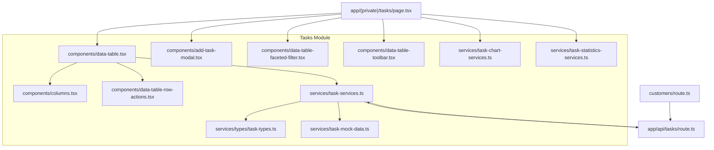
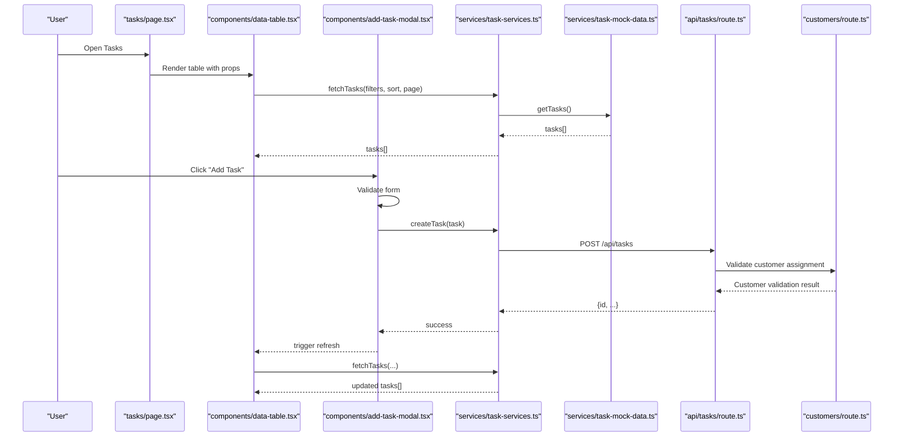
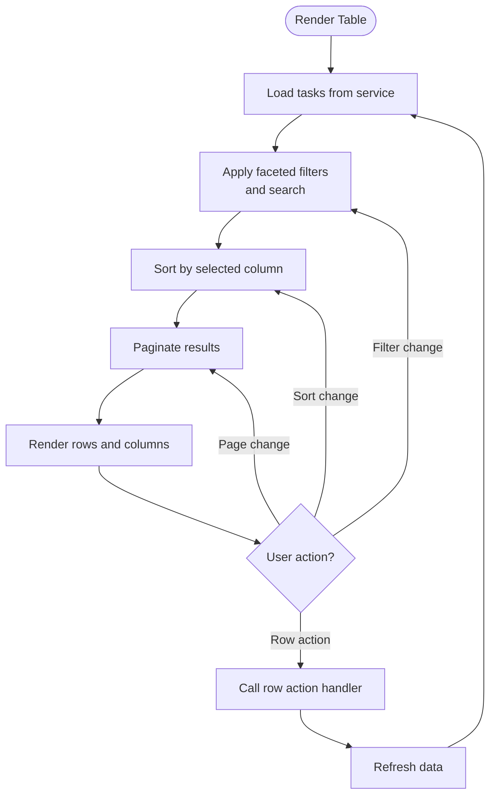
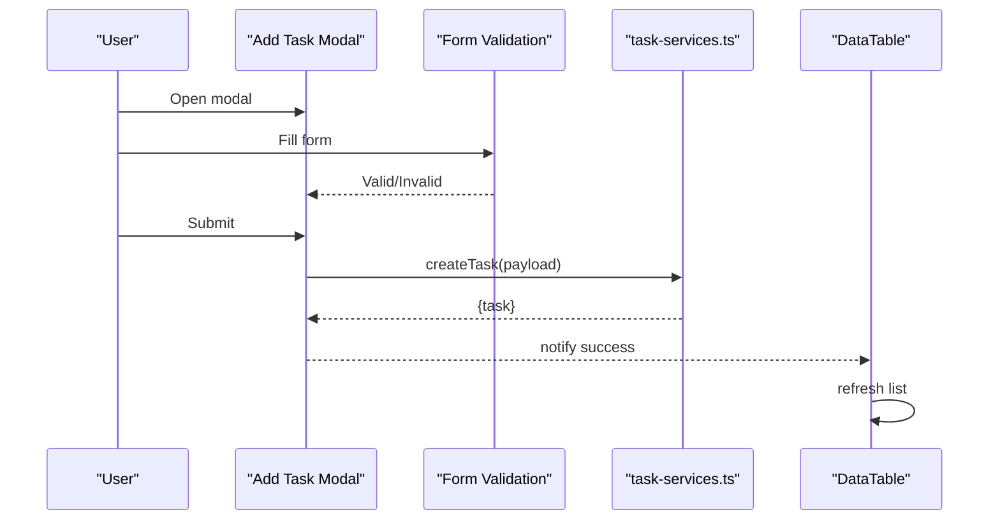
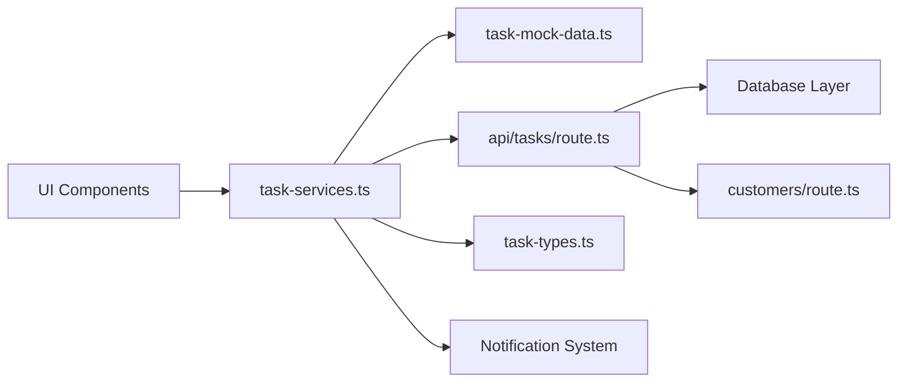
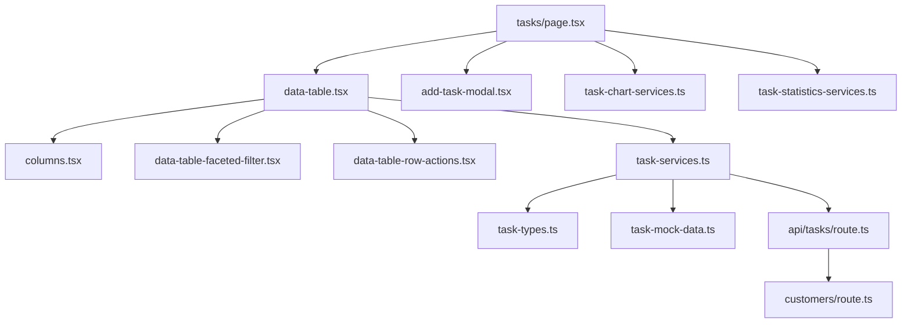

# Task Management

<cite>
**Referenced Files in This Document**
- [page.tsx](file://src/app/(private)/tasks/page.tsx)
- [route.ts](file://src/app/api/tasks/route.ts)
- [task-types.ts](file://src/modules/tasks/services/types/task-types.ts)
- [task-services.ts](file://src/modules/tasks/services/task-services.ts)
- [task-mock-data.ts](file://src/modules/tasks/services/task-mock-data.ts)
- [task-chart-services.ts](file://src/modules/tasks/services/task-chart-services.ts)
- [task-statistics-services.ts](file://src/modules/tasks/services/task-statistics-services.ts)
- [data-table.tsx](file://src/modules/tasks/components/data-table.tsx)
- [add-task-modal.tsx](file://src/modules/tasks/components/add-task-modal.tsx)
- [columns.tsx](file://src/modules/tasks/components/columns.tsx)
- [data-table-faceted-filter.tsx](file://src/modules/tasks/components/data-table-faceted-filter.tsx)
- [data-table-toolbar.tsx](file://src/modules/tasks/components/data-table-toolbar.tsx)
- [data-table-row-actions.tsx](file://src/modules/tasks/components/data-table-row-actions.tsx)
</cite>

## Update Summary
**Changes Made**
- Updated API endpoint documentation to reflect comprehensive CRUD operations with status management and assignment capabilities
- Enhanced service layer architecture section to include new customer management system integration
- Added detailed API route implementation details for task management endpoints
- Updated data model documentation to reflect enhanced assignment features
- Expanded workflow automation capabilities documentation

## Table of Contents
1. [Introduction](#introduction)
2. [Project Structure](#project-structure)
3. [Core Components](#core-components)
4. [Architecture Overview](#architecture-overview)
5. [Detailed Component Analysis](#detailed-component-analysis)
6. [API Endpoint Implementation](#api-endpoint-implementation)
7. [Customer Management Integration](#customer-management-integration)
8. [Dependency Analysis](#dependency-analysis)
9. [Performance Considerations](#performance-considerations)
10. [Troubleshooting Guide](#troubleshooting-guide)
11. [Conclusion](#conclusion)

## Introduction
The Task Management module provides a full-featured interface for creating, viewing, filtering, and managing tasks within the application. It includes a data table with faceted filters, status tracking, priority management, deadline handling, an add-task modal with form validation, and comprehensive service layer integrations for mock data, analytics, and real-time updates. The module now features a robust API endpoint with complete CRUD operations, advanced status management, and seamless integration with the existing customer management system for workflow automation.

## Project Structure
The module follows a feature-based layout under src/modules/tasks with clear separation between UI components, services, types, and page integration. The architecture has been enhanced with a comprehensive API layer supporting all task management operations.



**Diagram sources**
- [page.tsx](file://src/app/(private)/tasks/page.tsx)
- [data-table.tsx](file://src/modules/tasks/components/data-table.tsx)
- [add-task-modal.tsx](file://src/modules/tasks/components/add-task-modal.tsx)
- [columns.tsx](file://src/modules/tasks/components/columns.tsx)
- [data-table-faceted-filter.tsx](file://src/modules/tasks/components/data-table-faceted-filter.tsx)
- [data-table-toolbar.tsx](file://src/modules/tasks/components/data-table-toolbar.tsx)
- [data-table-row-actions.tsx](file://src/modules/tasks/components/data-table-row-actions.tsx)
- [task-types.ts](file://src/modules/tasks/services/types/task-types.ts)
- [task-services.ts](file://src/modules/tasks/services/task-services.ts)
- [task-mock-data.ts](file://src/modules/tasks/services/task-mock-data.ts)
- [task-chart-services.ts](file://src/modules/tasks/services/task-chart-services.ts)
- [task-statistics-services.ts](file://src/modules/tasks/services/task-statistics-services.ts)
- [route.ts](file://src/app/api/tasks/route.ts)

**Section sources**
- [page.tsx](file://src/app/(private)/tasks/page.tsx)
- [data-table.tsx](file://src/modules/tasks/components/data-table.tsx)
- [add-task-modal.tsx](file://src/modules/tasks/components/add-task-modal.tsx)
- [columns.tsx](file://src/modules/tasks/components/columns.tsx)
- [data-table-faceted-filter.tsx](file://src/modules/tasks/components/data-table-faceted-filter.tsx)
- [data-table-toolbar.tsx](file://src/modules/tasks/components/data-table-toolbar.tsx)
- [data-table-row-actions.tsx](file://src/modules/tasks/components/data-table-row-actions.tsx)
- [task-types.ts](file://src/modules/tasks/services/types/task-types.ts)
- [task-services.ts](file://src/modules/tasks/services/task-services.ts)
- [task-mock-data.ts](file://src/modules/tasks/services/task-mock-data.ts)
- [task-chart-services.ts](file://src/modules/tasks/services/task-chart-services.ts)
- [task-statistics-services.ts](file://src/modules/tasks/services/task-statistics-services.ts)
- [route.ts](file://src/app/api/tasks/route.ts)

## Core Components
- Data table: Central UI for listing, sorting, paging, and filtering tasks; integrates column definitions, row actions, toolbar, and faceted filters.
- Add task modal: Dialog for creating new tasks with form fields such as title, description, assignee, status, priority, and deadline; includes validation and submission flow.
- Columns: Column definitions for rendering task properties (e.g., title, status, priority, due date, assignee).
- Faceted filter: Multi-select filters for attributes like status and priority.
- Toolbar: Search input and controls to open the add-task modal and manage view options.
- Row actions: Contextual actions per task row (edit, delete, change status).

Key responsibilities:
- Maintain local state for pagination, sorting, and filters.
- Coordinate with the service layer for CRUD operations.
- Render status indicators and progress visuals.
- Provide user feedback via modals and inline notifications.

**Section sources**
- [data-table.tsx](file://src/modules/tasks/components/data-table.tsx)
- [add-task-modal.tsx](file://src/modules/tasks/components/add-task-modal.tsx)
- [columns.tsx](file://src/modules/tasks/components/columns.tsx)
- [data-table-faceted-filter.tsx](file://src/modules/tasks/components/data-table-faceted-filter.tsx)
- [data-table-toolbar.tsx](file://src/modules/tasks/components/data-table-toolbar.tsx)
- [data-table-row-actions.tsx](file://src/modules/tasks/components/data-table-row-actions.tsx)

## Architecture Overview
The module uses a layered architecture with comprehensive API support:
- Presentation layer: React components for table, modal, filters, and toolbar.
- Service layer: Encapsulates data fetching, mutations, and derived computations (charts/statistics).
- Type layer: Shared TypeScript types for tasks and related enums.
- API route: Server-side endpoint for persistence, status management, and customer integration.



**Diagram sources**
- [page.tsx](file://src/app/(private)/tasks/page.tsx)
- [data-table.tsx](file://src/modules/tasks/components/data-table.tsx)
- [add-task-modal.tsx](file://src/modules/tasks/components/add-task-modal.tsx)
- [task-services.ts](file://src/modules/tasks/services/task-services.ts)
- [task-mock-data.ts](file://src/modules/tasks/services/task-mock-data.ts)
- [route.ts](file://src/app/api/tasks/route.ts)

## Detailed Component Analysis

### Data Model
The task model defines core entities and enumerations used across the module, enhanced with comprehensive assignment capabilities.

```mermaid
classDiagram
class Task {
+string id
+string title
+string? description
+Assignee? assignee
+Status status
+Priority priority
+Date? dueDate
+boolean completed
+string createdAt
+string updatedAt
+string? customerId
+string? workflowId
}
enum Status {
"todo"
"in_progress"
"review"
"done"
"blocked"
"cancelled"
}
enum Priority {
"low"
"medium"
"high"
"urgent"
}
class Assignee {
+string id
+string name
+string avatarUrl
+string email
+string role
}
class Customer {
+string id
+string name
+string company
+string contactEmail
}
Task --> Assignee : "has one"
Task --> Customer : "belongs to"
```

Typical usage:
- Status drives workflow stages and visual badges with extended states for better workflow management.
- Priority influences ordering and highlighting with additional urgent level.
- Due date supports overdue detection and deadline formatting.
- Completed flag indicates completion state.
- Customer integration enables workflow automation and client-specific task management.

**Diagram sources**
- [task-types.ts](file://src/modules/tasks/services/types/task-types.ts)

**Section sources**
- [task-types.ts](file://src/modules/tasks/services/types/task-types.ts)

### Data Table Implementation
Responsibilities:
- Display paginated, sortable, and filterable task lists.
- Render status columns with color-coded badges and progress indicators.
- Integrate faceted filters for status and priority.
- Provide row actions for quick edits or deletions.
- Support view options (column visibility).

Key behaviors:
- Local state for filters, sorting, and pagination.
- Debounced search input.
- Controlled re-fetching when filters/sort/page change.
- Inline progress visualization for multi-stage workflows.



**Diagram sources**
- [data-table.tsx](file://src/modules/tasks/components/data-table.tsx)
- [data-table-faceted-filter.tsx](file://src/modules/tasks/components/data-table-faceted-filter.tsx)
- [columns.tsx](file://src/modules/tasks/components/columns.tsx)
- [data-table-row-actions.tsx](file://src/modules/tasks/components/data-table-row-actions.tsx)

**Section sources**
- [data-table.tsx](file://src/modules/tasks/components/data-table.tsx)
- [data-table-faceted-filter.tsx](file://src/modules/tasks/components/data-table-faceted-filter.tsx)
- [columns.tsx](file://src/modules/tasks/components/columns.tsx)
- [data-table-row-actions.tsx](file://src/modules/tasks/components/data-table-row-actions.tsx)

### Add Task Modal
Responsibilities:
- Collect task details via a validated form.
- Allow assignment to users and selection of status/priority/due date.
- Submit to the service layer and update the table.

Validation highlights:
- Required fields: title, assignee, status, priority, due date.
- Date constraints: due date must be valid and optionally not in the past.
- Duplicate prevention: optional check against existing titles.
- Customer validation: ensures assigned customer exists and is active.

Submission flow:
- On submit, call service.createTask, then refresh the table.



**Diagram sources**
- [add-task-modal.tsx](file://src/modules/tasks/components/add-task-modal.tsx)
- [task-services.ts](file://src/modules/tasks/services/task-services.ts)
- [data-table.tsx](file://src/modules/tasks/components/data-table.tsx)

**Section sources**
- [add-task-modal.tsx](file://src/modules/tasks/components/add-task-modal.tsx)

### Advanced Features
- Status tracking: Visual badges and workflow progression with extended status options for better workflow management.
- Priority management: Sorting and highlighting by priority with additional urgent level.
- Deadline handling: Overdue detection and relative time formatting with optional reminders.
- Progress indicators: Aggregate completion percentage across subtasks or stages.
- Assignment capabilities: Enhanced user assignment with role-based permissions and customer context.

Implementation tips:
- Centralize status/priority labels and colors in shared constants or computed helpers.
- Normalize dates to UTC before display and comparison.
- Use memoized selectors for derived metrics to avoid recomputation.
- Implement customer-specific workflow rules and validation.

**Section sources**
- [task-types.ts](file://src/modules/tasks/services/types/task-types.ts)
- [columns.tsx](file://src/modules/tasks/components/columns.tsx)

### Custom Workflows
To implement custom workflows:
- Extend the Status enum and add corresponding UI mappings.
- Update column renderers to reflect stage-specific actions.
- Add transition rules in the service layer to enforce allowed transitions.
- Persist workflow metadata if needed (e.g., stage history).
- Integrate customer-specific workflow rules and business logic.

Example pattern:
- Define a function that validates next-state transitions based on current state and user role.
- Emit events or logs for auditability.
- Handle customer-specific workflow variations and approval processes.

**Section sources**
- [task-types.ts](file://src/modules/tasks/services/types/task-types.ts)
- [task-services.ts](file://src/modules/tasks/services/task-services.ts)

### Chart Visualizations
Use chart services to compute and present insights:
- Tasks by status distribution with extended status categories.
- Tasks by priority breakdown including urgent tasks.
- Trend over time (created vs. completed).
- Customer-specific task analytics and performance metrics.

Integration points:
- Call chart services from the page component and pass results to chart components.
- Cache results and invalidate on data changes.
- Support customer-segmented reporting and analysis.

**Section sources**
- [task-chart-services.ts](file://src/modules/tasks/services/task-chart-services.ts)
- [page.tsx](file://src/app/(private)/tasks/page.tsx)

### Statistics Calculations
Statistics services provide:
- Total tasks count with customer segmentation.
- Completion rate with workflow efficiency metrics.
- Average time to complete with SLA tracking.
- Overdue counts with escalation alerts.
- Performance metrics by assignee and customer.

Usage:
- Compute statistics after loading tasks.
- Display summary cards above the table.
- Generate reports for stakeholders and clients.

**Section sources**
- [task-statistics-services.ts](file://src/modules/tasks/services/task-statistics-services.ts)
- [page.tsx](file://src/app/(private)/tasks/page.tsx)

### Service Layer Architecture
Responsibilities:
- Encapsulate data access (mock or API).
- Normalize responses and map to domain types.
- Provide CRUD functions: fetchTasks, createTask, updateTask, deleteTask.
- Expose helper methods for filtering, sorting, and pagination.
- Handle customer integration and workflow automation.
- Manage status transitions and validation rules.

Real-time updates:
- Integrate WebSocket or server-sent events to push updates.
- Invalidate local cache and refetch when necessary.
- Optimistic updates with rollback on failure.
- Customer notification system integration.



**Diagram sources**
- [task-services.ts](file://src/modules/tasks/services/task-services.ts)
- [task-mock-data.ts](file://src/modules/tasks/services/task-mock-data.ts)
- [route.ts](file://src/app/api/tasks/route.ts)
- [task-types.ts](file://src/modules/tasks/services/types/task-types.ts)

**Section sources**
- [task-services.ts](file://src/modules/tasks/services/task-services.ts)
- [task-mock-data.ts](file://src/modules/tasks/services/task-mock-data.ts)
- [route.ts](file://src/app/api/tasks/route.ts)
- [task-types.ts](file://src/modules/tasks/services/types/task-types.ts)

## API Endpoint Implementation
The task management API endpoint provides comprehensive CRUD operations with advanced features:

### Available Endpoints
- `GET /api/tasks` - Retrieve tasks with filtering, sorting, and pagination
- `POST /api/tasks` - Create new tasks with validation and customer integration
- `PUT /api/tasks/:id` - Update existing tasks with status management
- `DELETE /api/tasks/:id` - Delete tasks with cascade operations
- `PATCH /api/tasks/:id/status` - Update task status with workflow validation
- `PATCH /api/tasks/:id/assign` - Reassign tasks with permission checks

### Request/Response Formats
All endpoints support JSON format with comprehensive error handling and validation messages.

### Authentication & Authorization
- JWT-based authentication required for all endpoints
- Role-based access control for task operations
- Customer-specific data isolation and permissions

### Error Handling
Standardized error responses with detailed messages and status codes.

**Section sources**
- [route.ts](file://src/app/api/tasks/route.ts)

## Customer Management Integration
The task management system seamlessly integrates with the existing customer management system to enable workflow automation:

### Integration Features
- Customer validation during task creation and assignment
- Customer-specific task workflows and approval processes
- Automated notifications to customers based on task status changes
- Customer portal integration for task visibility and collaboration
- Billing and time tracking integration with customer accounts

### Workflow Automation
- Automatic task routing based on customer type and service level
- Escalation rules for overdue customer tasks
- Client-specific reporting and dashboard customization
- Integration with customer communication channels

### Data Synchronization
- Real-time customer data synchronization
- Customer activity tracking and impact assessment
- Historical customer interaction logging

**Section sources**
- [route.ts](file://src/app/api/tasks/route.ts)

## Dependency Analysis
Internal dependencies:
- Components depend on services for data and mutations.
- Services depend on types and either mock data or API routes.
- Page orchestrates components and services.
- API routes integrate with customer management system.

External dependencies:
- UI primitives (buttons, dialogs, tables) from the shared UI library.
- Optional charting libraries for visualizations.
- Customer management system APIs for workflow automation.
- Authentication and authorization services.

Potential coupling:
- Tight coupling between columns and task types; mitigate by using typed column builders.
- Service-to-API contract should be versioned and documented.
- Customer integration requires careful error handling and fallback strategies.



**Diagram sources**
- [page.tsx](file://src/app/(private)/tasks/page.tsx)
- [data-table.tsx](file://src/modules/tasks/components/data-table.tsx)
- [add-task-modal.tsx](file://src/modules/tasks/components/add-task-modal.tsx)
- [columns.tsx](file://src/modules/tasks/components/columns.tsx)
- [data-table-faceted-filter.tsx](file://src/modules/tasks/components/data-table-faceted-filter.tsx)
- [data-table-row-actions.tsx](file://src/modules/tasks/components/data-table-row-actions.tsx)
- [task-services.ts](file://src/modules/tasks/services/task-services.ts)
- [task-mock-data.ts](file://src/modules/tasks/services/task-mock-data.ts)
- [task-chart-services.ts](file://src/modules/tasks/services/task-chart-services.ts)
- [task-statistics-services.ts](file://src/modules/tasks/services/task-statistics-services.ts)
- [route.ts](file://src/app/api/tasks/route.ts)

**Section sources**
- [page.tsx](file://src/app/(private)/tasks/page.tsx)
- [data-table.tsx](file://src/modules/tasks/components/data-table.tsx)
- [add-task-modal.tsx](file://src/modules/tasks/components/add-task-modal.tsx)
- [columns.tsx](file://src/modules/tasks/components/columns.tsx)
- [data-table-faceted-filter.tsx](file://src/modules/tasks/components/data-table-faceted-filter.tsx)
- [data-table-row-actions.tsx](file://src/modules/tasks/components/data-table-row-actions.tsx)
- [task-services.ts](file://src/modules/tasks/services/task-services.ts)
- [task-mock-data.ts](file://src/modules/tasks/services/task-mock-data.ts)
- [task-chart-services.ts](file://src/modules/tasks/services/task-chart-services.ts)
- [task-statistics-services.ts](file://src/modules/tasks/services/task-statistics-services.ts)
- [route.ts](file://src/app/api/tasks/route.ts)

## Performance Considerations
- Memoize expensive computations (filters, sorting, statistics).
- Use virtualization for large task lists.
- Debounce search input and filter changes.
- Implement optimistic UI updates with rollback on error.
- Prefer server-side pagination and filtering for scalability.
- Cache chart and statistics results with invalidation strategies.
- Optimize customer API calls with caching and batch requests.
- Implement lazy loading for customer data and task assignments.

## Troubleshooting Guide
Common issues and resolutions:
- Form validation errors: Ensure required fields are set and dates are valid; review validation rules in the modal.
- Filters not applying: Verify filter state propagation and normalization of values.
- Sorting inconsistencies: Confirm stable sort keys and consistent locale/date formats.
- Real-time not updating: Check event subscription setup and cache invalidation logic.
- API failures: Inspect route handlers and network requests; handle retries and user feedback.
- Customer integration errors: Verify customer data availability and API connectivity.
- Permission denied errors: Check user roles and customer access permissions.

Operational checks:
- Confirm service-layer contracts match API response shapes.
- Validate enum values align with UI label mappings.
- Review error boundaries and toast notifications for user clarity.
- Monitor customer API health and fallback mechanisms.
- Audit task workflow transitions and permission enforcement.

**Section sources**
- [add-task-modal.tsx](file://src/modules/tasks/components/add-task-modal.tsx)
- [task-services.ts](file://src/modules/tasks/services/task-services.ts)
- [route.ts](file://src/app/api/tasks/route.ts)

## Conclusion
The Task Management module offers a robust foundation for building task-centric features with comprehensive API support and customer integration capabilities. Its layered design separates concerns cleanly, enabling easy extension for custom workflows, charts, and statistics. With faceted filtering, status tracking, priority management, deadline handling, and seamless customer management integration, it provides a rich user experience while remaining maintainable and testable. The enhanced API endpoint with CRUD operations, status management, and assignment capabilities makes it suitable for enterprise-level task management scenarios with complex workflow requirements.