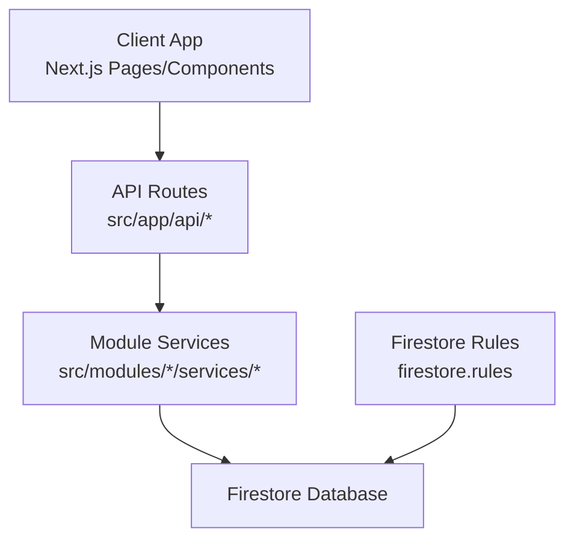
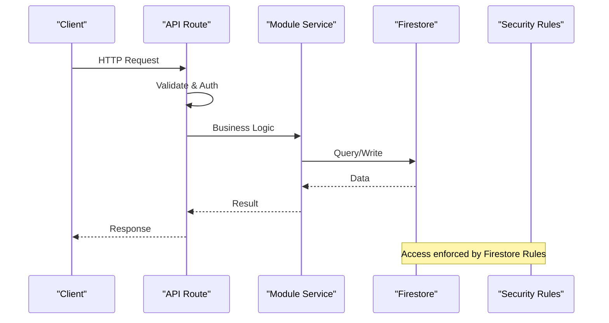
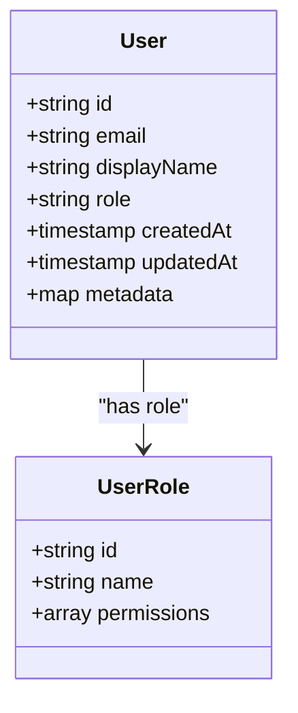
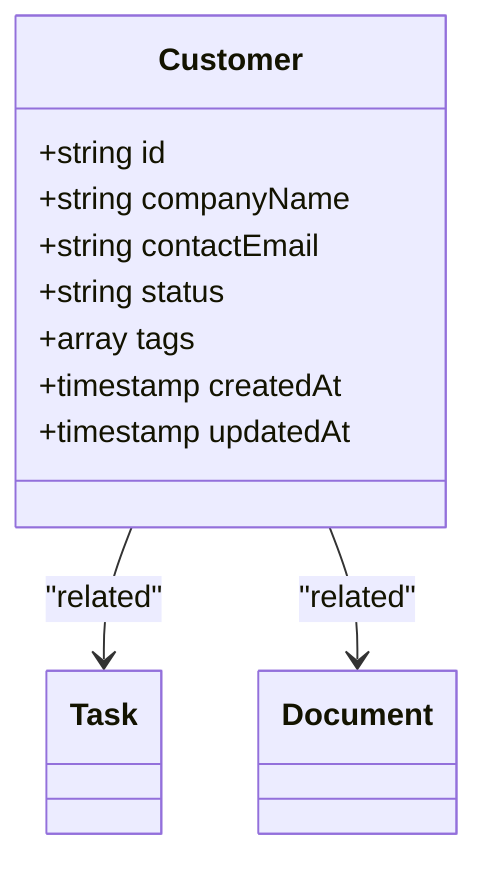
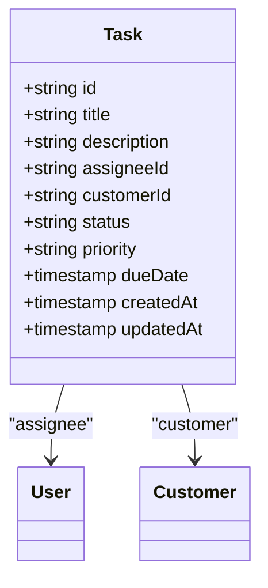
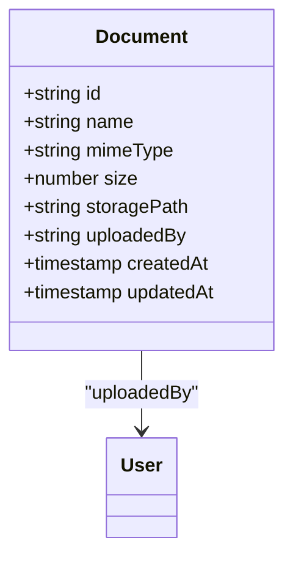
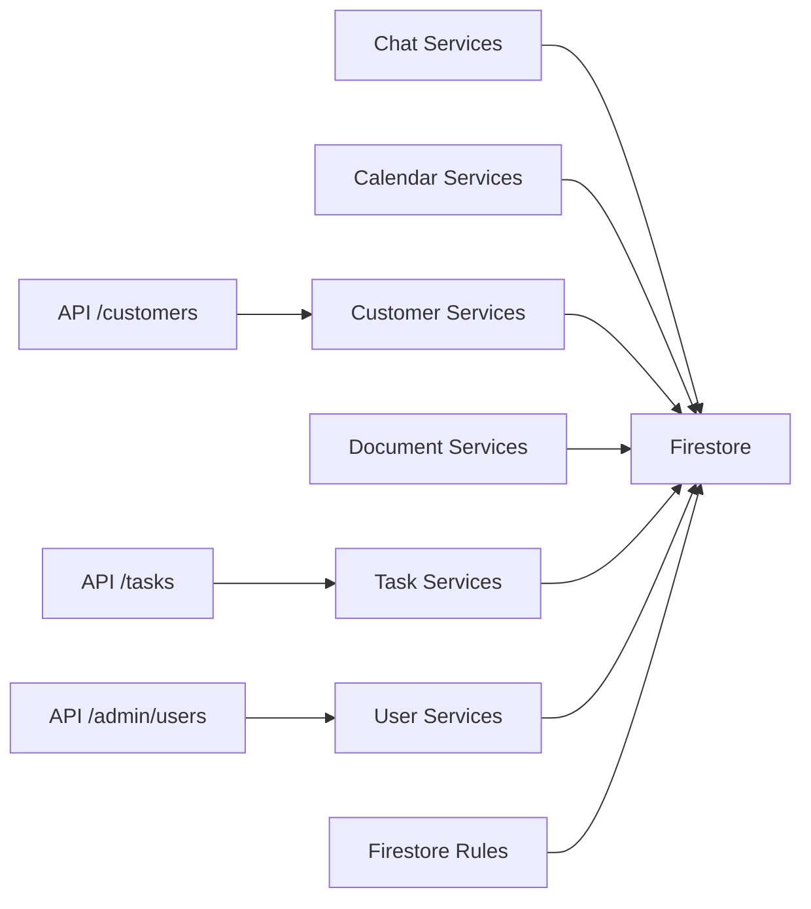

# Database Schema

<cite>
**Referenced Files in This Document**
- [firestore.rules](file://firestore.rules)
- [auth.ts](file://auth.ts)
- [auth.config.ts](file://auth.config.ts)
- [api/admin/users/route.ts](file://src/app/api/admin/users/route.ts)
- [api/admin/users/[uid]/route.ts](file://src/app/api/admin/users/[uid]/route.ts)
- [api/customers/route.ts](file://src/app/api/customers/route.ts)
- [api/tasks/route.ts](file://src/app/api/tasks/route.ts)
- [modules/chat/services/chat-services.ts](file://src/modules/chat/services/chat-services.ts)
- [modules/calendar/services/calendar-services.ts](file://src/modules/calendar/services/calendar-services.ts)
- [modules/customers/services/customer-services.ts](file://src/modules/customers/services/customer-services.ts)
- [modules/documents/services/document-file-services.ts](file://src/modules/documents/services/document-file-services.ts)
- [modules/tasks/services/task-services.ts](file://src/modules/tasks/services/task-services.ts)
- [modules/users/services/user-services.ts](file://src/modules/users/services/user-services.ts)
</cite>

## Table of Contents
1. [Introduction](#introduction)
2. [Project Structure](#project-structure)
3. [Core Components](#core-components)
4. [Architecture Overview](#architecture-overview)
5. [Detailed Component Analysis](#detailed-component-analysis)
6. [Dependency Analysis](#dependency-analysis)
7. [Performance Considerations](#performance-considerations)
8. [Troubleshooting Guide](#troubleshooting-guide)
9. [Conclusion](#conclusion)
10. [Appendices](#appendices)

## Introduction
This document provides a comprehensive Firebase Firestore schema and operational guide for the project. It covers entity relationships, field definitions, data types, indexing strategies, security rules, validation constraints, query optimization patterns, migration procedures, backup strategies, data integrity measures, performance considerations, caching strategies, and offline synchronization approaches. The guidance is derived from the repository’s API routes, module services, and Firestore security rules to ensure alignment with actual implementation patterns.

## Project Structure
The application follows a Next.js App Router structure with feature modules under src/modules and server-side API routes under src/app/api. Data access is primarily performed through API routes that interact with backend services (e.g., Firebase Admin SDK), while client-side modules encapsulate domain-specific logic and UI components. Firestore security rules are defined at the root level to enforce access control at the database layer.



**Diagram sources**
- [firestore.rules](file://firestore.rules)
- [api/admin/users/route.ts](file://src/app/api/admin/users/route.ts)
- [api/customers/route.ts](file://src/app/api/customers/route.ts)
- [api/tasks/route.ts](file://src/app/api/tasks/route.ts)
- [modules/chat/services/chat-services.ts](file://src/modules/chat/services/chat-services.ts)
- [modules/calendar/services/calendar-services.ts](file://src/modules/calendar/services/calendar-services.ts)
- [modules/customers/services/customer-services.ts](file://src/modules/customers/services/customer-services.ts)
- [modules/documents/services/document-file-services.ts](file://src/modules/documents/services/document-file-services.ts)
- [modules/tasks/services/task-services.ts](file://src/modules/tasks/services/task-services.ts)
- [modules/users/services/user-services.ts](file://src/modules/users/services/user-services.ts)

**Section sources**
- [firestore.rules](file://firestore.rules)
- [api/admin/users/route.ts](file://src/app/api/admin/users/route.ts)
- [api/customers/route.ts](file://src/app/api/customers/route.ts)
- [api/tasks/route.ts](file://src/app/api/tasks/route.ts)

## Core Components
- API Routes: Central entry points for CRUD operations on entities such as users, customers, tasks, and chat data. They validate requests, enforce authentication/authorization, and delegate persistence to service layers or direct Firestore calls.
- Module Services: Domain-specific services encapsulating business logic, data transformations, and Firestore interactions for features like chat, calendar, customers, documents, tasks, and users.
- Security Rules: Firestore rules define read/write permissions based on authenticated user context and resource ownership.

Key responsibilities:
- Request validation and sanitization within API routes.
- Authorization checks using session tokens and role-based access.
- Data normalization and type enforcement in service layers.
- Efficient querying and batching where applicable.

**Section sources**
- [api/admin/users/route.ts](file://src/app/api/admin/users/route.ts)
- [api/admin/users/[uid]/route.ts](file://src/app/api/admin/users/[uid]/route.ts)
- [api/customers/route.ts](file://src/app/api/customers/route.ts)
- [api/tasks/route.ts](file://src/app/api/tasks/route.ts)
- [modules/chat/services/chat-services.ts](file://src/modules/chat/services/chat-services.ts)
- [modules/calendar/services/calendar-services.ts](file://src/modules/calendar/services/calendar-services.ts)
- [modules/customers/services/customer-services.ts](file://src/modules/customers/services/customer-services.ts)
- [modules/documents/services/document-file-services.ts](file://src/modules/documents/services/document-file-services.ts)
- [modules/tasks/services/task-services.ts](file://src/modules/tasks/services/task-services.ts)
- [modules/users/services/user-services.ts](file://src/modules/users/services/user-services.ts)

## Architecture Overview
The system uses a layered architecture:
- Presentation Layer: Next.js pages and components.
- API Layer: Route handlers orchestrating request/response flows.
- Service Layer: Feature-specific logic and data operations.
- Persistence Layer: Firestore via Admin SDK or client SDK depending on context.
- Security Layer: Firestore rules enforcing fine-grained access control.



**Diagram sources**
- [api/admin/users/route.ts](file://src/app/api/admin/users/route.ts)
- [api/customers/route.ts](file://src/app/api/customers/route.ts)
- [api/tasks/route.ts](file://src/app/api/tasks/route.ts)
- [modules/users/services/user-services.ts](file://src/modules/users/services/user-services.ts)
- [modules/customers/services/customer-services.ts](file://src/modules/customers/services/customer-services.ts)
- [modules/tasks/services/task-services.ts](file://src/modules/tasks/services/task-services.ts)
- [firestore.rules](file://firestore.rules)

## Detailed Component Analysis

### Users Entity
- Purpose: Represents system users and roles; supports admin management endpoints.
- Typical fields: id (string), email (string), displayName (string), role (enum), createdAt (timestamp), updatedAt (timestamp), metadata (map).
- Relationships: Users may be linked to tasks, customers, and chat conversations via references or IDs.
- Indexing strategy: Composite indexes on email and role for filtering; timestamp fields for sorting and pagination.
- Validation constraints: Email format, required fields, role enum values.
- Security rules: Read/write restricted to authenticated users; admins can manage all users; users can update own profile.



**Diagram sources**
- [modules/users/services/user-services.ts](file://src/modules/users/services/user-services.ts)
- [api/admin/users/route.ts](file://src/app/api/admin/users/route.ts)
- [api/admin/users/[uid]/route.ts](file://src/app/api/admin/users/[uid]/route.ts)

**Section sources**
- [modules/users/services/user-services.ts](file://src/modules/users/services/user-services.ts)
- [api/admin/users/route.ts](file://src/app/api/admin/users/route.ts)
- [api/admin/users/[uid]/route.ts](file://src/app/api/admin/users/[uid]/route.ts)

### Customers Entity
- Purpose: Stores customer records for CRM-like functionality.
- Typical fields: id (string), companyName (string), contactEmail (string), status (enum), tags (array), createdAt (timestamp), updatedAt (timestamp).
- Relationships: Linked to tasks and documents via IDs.
- Indexing strategy: Composite indexes on status and tags for filtering; email for lookups.
- Validation constraints: Required company name and email; status enum validation.
- Security rules: Authenticated users can read/write their owned customers; admins have full access.



**Diagram sources**
- [modules/customers/services/customer-services.ts](file://src/modules/customers/services/customer-services.ts)
- [api/customers/route.ts](file://src/app/api/customers/route.ts)

**Section sources**
- [modules/customers/services/customer-services.ts](file://src/modules/customers/services/customer-services.ts)
- [api/customers/route.ts](file://src/app/api/customers/route.ts)

### Tasks Entity
- Purpose: Manages task items with assignments and statuses.
- Typical fields: id (string), title (string), description (string), assigneeId (string), customerId (string), status (enum), priority (enum), dueDate (timestamp), createdAt (timestamp), updatedAt (timestamp).
- Relationships: Assignee links to User; optional link to Customer.
- Indexing strategy: Composite indexes on assigneeId and status; dueDate for time-based queries.
- Validation constraints: Required title and status; valid assigneeId reference.
- Security rules: Assignees and owners can modify; others read-only; admins full access.



**Diagram sources**
- [modules/tasks/services/task-services.ts](file://src/modules/tasks/services/task-services.ts)
- [api/tasks/route.ts](file://src/app/api/tasks/route.ts)

**Section sources**
- [modules/tasks/services/task-services.ts](file://src/modules/tasks/services/task-services.ts)
- [api/tasks/route.ts](file://src/app/api/tasks/route.ts)

### Chat Entities
- Conversations: Group messages between participants.
- Messages: Individual chat entries with sender, content, timestamps.
- Typical fields:
  - Conversation: id, participants (array), lastMessageAt (timestamp), createdAt (timestamp).
  - Message: id, conversationId (string), senderId (string), content (string), sentAt (timestamp).
- Relationships: Messages belong to a Conversation; sender links to User.
- Indexing strategy: Composite indexes on conversationId and sentAt for ordering; participants array for membership queries.
- Validation constraints: Required senderId and content; conversationId must exist.
- Security rules: Participants can read/write messages; non-participants denied.

```mermaid
classDiagram
class Conversation {
+string id
+array participants
+timestamp lastMessageAt
+timestamp createdAt
}
class Message {
+string id
+string conversationId
+string senderId
+string content
+timestamp sentAt
}
Conversation ||--o{ Message : "contains"
Message --> User : "sender"
```

**Diagram sources**
- [modules/chat/services/chat-services.ts](file://src/modules/chat/services/chat-services.ts)

**Section sources**
- [modules/chat/services/chat-services.ts](file://src/modules/chat/services/chat-services.ts)

### Calendar Entities
- Calendars: Collections of events per user or team.
- Events: Scheduled items with start/end times and attendees.
- Typical fields:
  - Calendar: id, ownerId (string), name (string), createdAt (timestamp).
  - Event: id, calendarId (string), title (string), startTime (timestamp), endTime (timestamp), attendees (array), createdAt (timestamp).
- Relationships: Events belong to a Calendar; attendees link to Users.
- Indexing strategy: Composite indexes on calendarId and startTime for range queries; attendees for availability checks.
- Validation constraints: Required title and valid time range; calendarId must exist.
- Security rules: Owners and attendees can read/write; others read-only.

```mermaid
classDiagram
class Calendar {
+string id
+string ownerId
+string name
+timestamp createdAt
}
class Event {
+string id
+string calendarId
+string title
+timestamp startTime
+timestamp endTime
+array attendees
+timestamp createdAt
}
Calendar ||--o{ Event : "contains"
Event --> User : "attendee"
```

**Diagram sources**
- [modules/calendar/services/calendar-services.ts](file://src/modules/calendar/services/calendar-services.ts)

**Section sources**
- [modules/calendar/services/calendar-services.ts](file://src/modules/calendar/services/calendar-services.ts)

### Documents Entity
- Purpose: Stores file metadata and references for uploaded documents.
- Typical fields: id (string), name (string), mimeType (string), size (number), storagePath (string), uploadedBy (string), createdAt (timestamp), updatedAt (timestamp).
- Relationships: UploadedBy links to User; optional association to Customer or Task.
- Indexing strategy: Indexes on uploadedBy and createdAt for listing; mimeType for filtering.
- Validation constraints: Required name and storagePath; size within limits.
- Security rules: Uploaders can manage their files; admins full access; read access controlled by sharing settings.



**Diagram sources**
- [modules/documents/services/document-file-services.ts](file://src/modules/documents/services/document-file-services.ts)

**Section sources**
- [modules/documents/services/document-file-services.ts](file://src/modules/documents/services/document-file-services.ts)

## Dependency Analysis
The following diagram illustrates dependencies among API routes, module services, and Firestore rules:



**Diagram sources**
- [api/admin/users/route.ts](file://src/app/api/admin/users/route.ts)
- [api/customers/route.ts](file://src/app/api/customers/route.ts)
- [api/tasks/route.ts](file://src/app/api/tasks/route.ts)
- [modules/chat/services/chat-services.ts](file://src/modules/chat/services/chat-services.ts)
- [modules/calendar/services/calendar-services.ts](file://src/modules/calendar/services/calendar-services.ts)
- [modules/customers/services/customer-services.ts](file://src/modules/customers/services/customer-services.ts)
- [modules/documents/services/document-file-services.ts](file://src/modules/documents/services/document-file-services.ts)
- [modules/tasks/services/task-services.ts](file://src/modules/tasks/services/task-services.ts)
- [modules/users/services/user-services.ts](file://src/modules/users/services/user-services.ts)
- [firestore.rules](file://firestore.rules)

**Section sources**
- [api/admin/users/route.ts](file://src/app/api/admin/users/route.ts)
- [api/customers/route.ts](file://src/app/api/customers/route.ts)
- [api/tasks/route.ts](file://src/app/api/tasks/route.ts)
- [modules/chat/services/chat-services.ts](file://src/modules/chat/services/chat-services.ts)
- [modules/calendar/services/calendar-services.ts](file://src/modules/calendar/services/calendar-services.ts)
- [modules/customers/services/customer-services.ts](file://src/modules/customers/services/customer-services.ts)
- [modules/documents/services/document-file-services.ts](file://src/modules/documents/services/document-file-services.ts)
- [modules/tasks/services/task-services.ts](file://src/modules/tasks/services/task-services.ts)
- [modules/users/services/user-services.ts](file://src/modules/users/services/user-services.ts)
- [firestore.rules](file://firestore.rules)

## Performance Considerations
- Indexing Strategy:
  - Use composite indexes for common filter/sort combinations (e.g., status + dueDate, assigneeId + status).
  - Avoid wildcard queries on arrays; precompute counts where necessary.
- Query Optimization:
  - Prefer specific field selections to reduce payload size.
  - Paginate results using cursor-based pagination for large collections.
  - Batch writes to minimize round trips and improve throughput.
- Caching Strategies:
  - Implement client-side caching for static or infrequently changing data (e.g., roles, configurations).
  - Use optimistic updates for responsive UI during write operations.
- Offline Synchronization:
  - Leverage Firestore offline persistence for mobile/web clients to cache data locally.
  - Handle conflict resolution with versioned fields and merge strategies.
- Security Rule Efficiency:
  - Keep rules simple and avoid expensive computations; use indexed fields for conditions.
  - Deny-by-default and explicitly allow necessary operations.

[No sources needed since this section provides general guidance]

## Troubleshooting Guide
Common issues and resolutions:
- Authentication Failures:
  - Verify token validity and expiration; ensure proper session handling in API routes.
  - Check NextAuth configuration and environment variables.
- Permission Denied Errors:
  - Review Firestore rules for targeted collections and fields.
  - Confirm user roles and ownership claims in tokens.
- Query Timeouts:
  - Inspect missing or incorrect indexes; add composite indexes as needed.
  - Optimize queries to limit result sets and avoid deep nesting.
- Data Integrity Violations:
  - Enforce validation at API and service layers; use consistent schemas.
  - Implement transactions for multi-document updates to maintain consistency.

**Section sources**
- [auth.ts](file://auth.ts)
- [auth.config.ts](file://auth.config.ts)
- [firestore.rules](file://firestore.rules)

## Conclusion
This documentation outlines the Firestore schema, relationships, and operational practices aligned with the project’s codebase. By adhering to the recommended indexing, validation, and security patterns, the system can achieve reliable performance, strong data integrity, and scalable access control. Continuous monitoring and iterative refinement of rules and queries will further enhance reliability and efficiency.

[No sources needed since this section summarizes without analyzing specific files]

## Appendices

### Security Rules Summary
- Default deny all reads/writes unless explicitly allowed.
- Role-based access for admin endpoints (/admin/*).
- Ownership checks for user-specific resources (users, documents, tasks).
- Participant-based access for chat conversations and messages.
- Owner/attendee checks for calendars and events.

**Section sources**
- [firestore.rules](file://firestore.rules)

### Migration Procedures
- Versioned Schema Changes:
  - Introduce new fields with default values; deprecate old fields gradually.
  - Use migration scripts to backfill data and update indices.
- Rollback Strategy:
  - Maintain backward-compatible versions until migration completes.
  - Preserve old collections temporarily during transition periods.
- Testing:
  - Validate migrations against staging environments.
  - Ensure index creation does not block deployments.

[No sources needed since this section provides general guidance]

### Backup Strategies
- Automated Backups:
  - Schedule regular exports to cloud storage (e.g., GCS).
  - Use Firestore-native export/import features for point-in-time snapshots.
- Restore Procedures:
  - Test restore processes regularly to ensure data recoverability.
  - Document rollback steps and verify integrity post-restore.

[No sources needed since this section provides general guidance]

### Data Integrity Measures
- Validation Layers:
  - API route-level input validation.
  - Service-layer schema enforcement.
  - Firestore rules for runtime authorization and basic shape checks.
- Transactions and Bulk Operations:
  - Use transactions for atomic multi-document updates.
  - Employ batched writes for efficient bulk operations.

[No sources needed since this section provides general guidance]