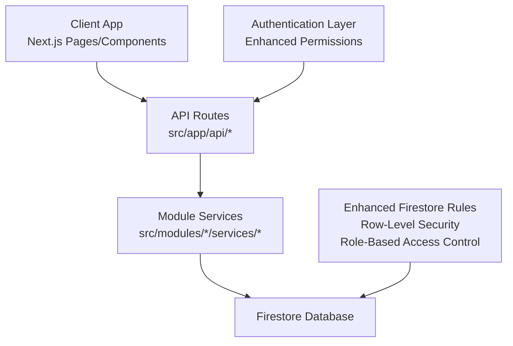
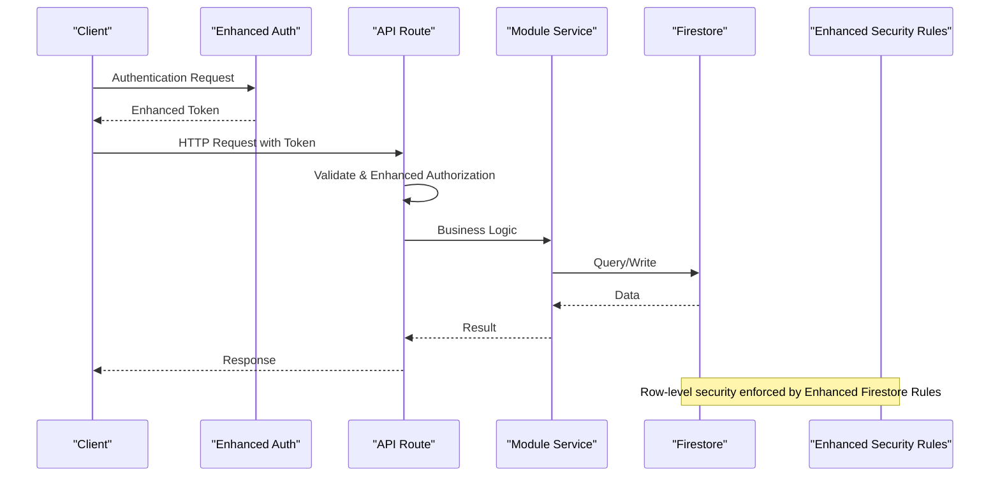
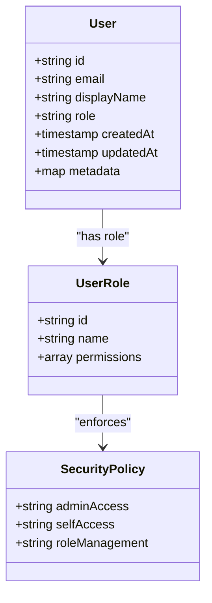
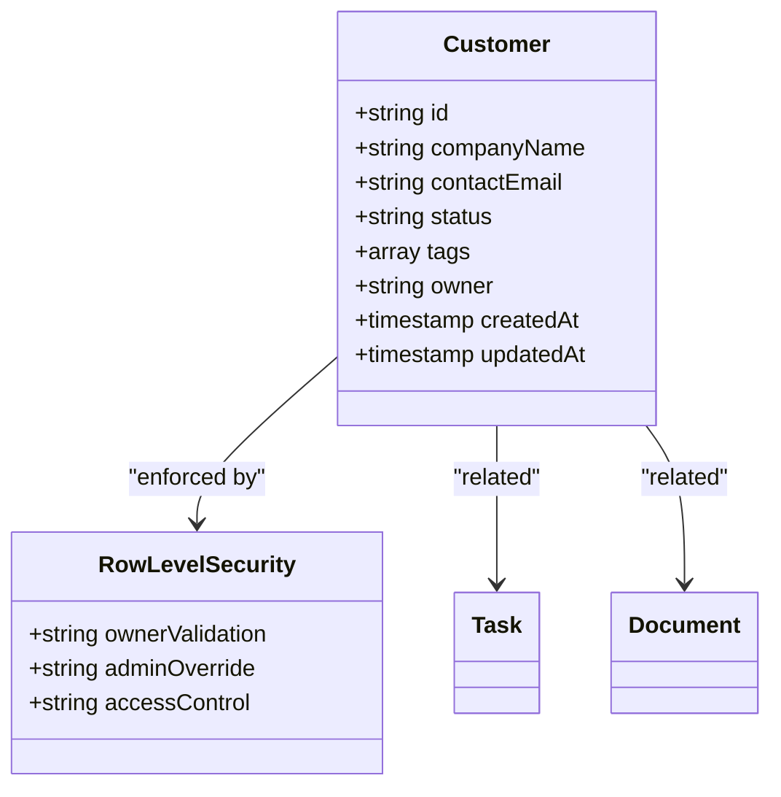
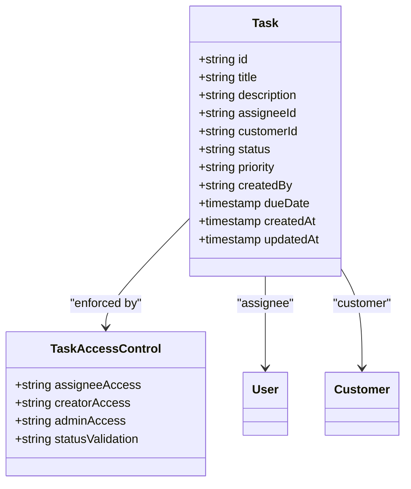
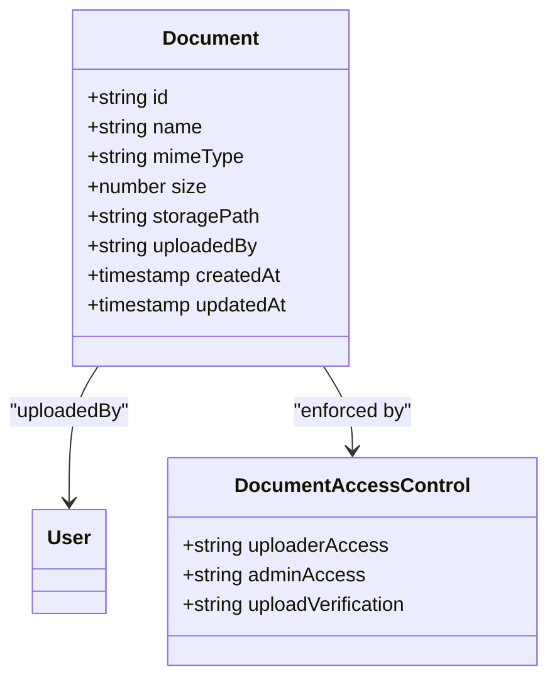
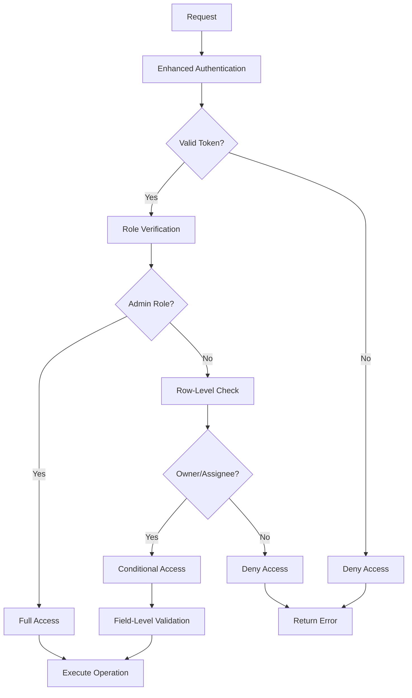
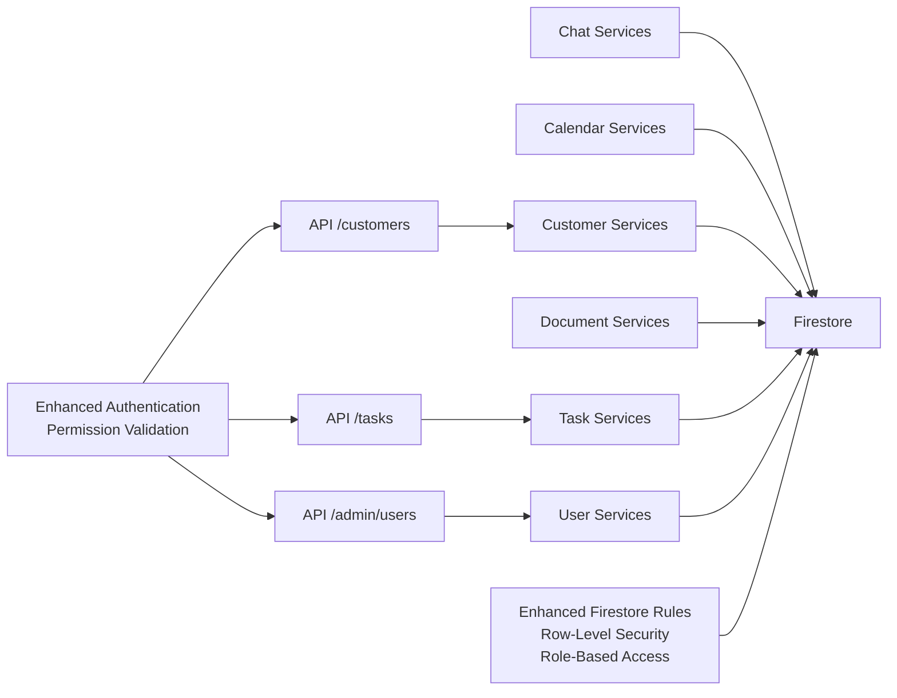

# Database Schema

<cite>
**Referenced Files in This Document**
- [firestore.rules](file://firestore.rules)
- [auth.ts](file://auth.ts)
- [auth.config.ts](file://auth.config.ts)
- [api/admin/users/route.ts](file://src/app/api/admin/users/route.ts)
- [api/admin/users/[uid]/route.ts](file://src/app/api/admin/users/[uid]/route.ts)
- [api/customers/route.ts](file://src/app/api/customers/route.ts)
- [api/tasks/route.ts](file://src/app/api/tasks/route.ts)
- [modules/chat/services/chat-services.ts](file://src/modules/chat/services/chat-services.ts)
- [modules/calendar/services/calendar-services.ts](file://src/modules/calendar/services/calendar-services.ts)
- [modules/customers/services/customer-services.ts](file://src/modules/customers/services/customer-services.ts)
- [modules/documents/services/document-file-services.ts](file://src/modules/documents/services/document-file-services.ts)
- [modules/tasks/services/task-services.ts](file://src/modules/tasks/services/task-services.ts)
- [modules/users/services/user-services.ts](file://src/modules/users/services/user-services.ts)
</cite>

## Update Summary
**Changes Made**
- Enhanced Security Rules section with comprehensive row-level security implementation
- Updated Customers Entity with detailed row-level access control patterns
- Expanded Users Entity security model with granular role-based permissions
- Added Tasks Entity security rules with assignment-based access control
- Enhanced Authentication section with improved permission validation
- Updated Security Rules Summary with new granular access patterns

## Table of Contents
1. [Introduction](#introduction)
2. [Project Structure](#project-structure)
3. [Core Components](#core-components)
4. [Architecture Overview](#architecture-overview)
5. [Detailed Component Analysis](#detailed-component-analysis)
6. [Security Rules Implementation](#security-rules-implementation)
7. [Dependency Analysis](#dependency-analysis)
8. [Performance Considerations](#performance-considerations)
9. [Troubleshooting Guide](#troubleshooting-guide)
10. [Conclusion](#conclusion)
11. [Appendices](#appendices)

## Introduction
This document provides a comprehensive Firebase Firestore schema and operational guide for the project. It covers entity relationships, field definitions, data types, indexing strategies, **enhanced security rules with row-level access control**, validation constraints, query optimization patterns, migration procedures, backup strategies, data integrity measures, performance considerations, caching strategies, and offline synchronization approaches. The guidance is derived from the repository's API routes, module services, and **comprehensive Firestore security rules implementation** to ensure alignment with actual implementation patterns.

## Project Structure
The application follows a Next.js App Router structure with feature modules under src/modules and server-side API routes under src/app/api. Data access is primarily performed through API routes that interact with backend services (e.g., Firebase Admin SDK), while client-side modules encapsulate domain-specific logic and UI components. **Enhanced Firestore security rules are defined at the root level to enforce fine-grained access control at the database layer with row-level security patterns.**



**Diagram sources**
- [firestore.rules](file://firestore.rules)
- [auth.ts](file://auth.ts)
- [api/admin/users/route.ts](file://src/app/api/admin/users/route.ts)
- [api/customers/route.ts](file://src/app/api/customers/route.ts)
- [api/tasks/route.ts](file://src/app/api/tasks/route.ts)

**Section sources**
- [firestore.rules](file://firestore.rules)
- [auth.ts](file://auth.ts)
- [auth.config.ts](file://auth.config.ts)
- [api/admin/users/route.ts](file://src/app/api/admin/users/route.ts)
- [api/customers/route.ts](file://src/app/api/customers/route.ts)
- [api/tasks/route.ts](file://src/app/api/tasks/route.ts)

## Core Components
- API Routes: Central entry points for CRUD operations on entities such as users, customers, tasks, and chat data. They validate requests, enforce authentication/authorization, and delegate persistence to service layers or direct Firestore calls.
- Module Services: Domain-specific services encapsulating business logic, data transformations, and Firestore interactions for features like chat, calendar, customers, documents, tasks, and users.
- **Enhanced Security Rules**: **Comprehensive Firestore rules with row-level security, granular access control for users/tasks/admin roles, and enhanced authentication permissions define read/write permissions based on authenticated user context, resource ownership, and role-based authorization.**

Key responsibilities:
- Request validation and sanitization within API routes.
- **Enhanced authorization checks using session tokens, role-based access, and row-level security validation.**
- Data normalization and type enforcement in service layers.
- Efficient querying and batching where applicable.

**Section sources**
- [api/admin/users/route.ts](file://src/app/api/admin/users/route.ts)
- [api/admin/users/[uid]/route.ts](file://src/app/api/admin/users/[uid]/route.ts)
- [api/customers/route.ts](file://src/app/api/customers/route.ts)
- [api/tasks/route.ts](file://src/app/api/tasks/route.ts)
- [modules/chat/services/chat-services.ts](file://src/modules/chat/services/chat-services.ts)
- [modules/calendar/services/calendar-services.ts](file://src/modules/calendar/services/calendar-services.ts)
- [modules/customers/services/customer-services.ts](file://src/modules/customers/services/customer-services.ts)
- [modules/documents/services/document-file-services.ts](file://src/modules/documents/services/document-file-services.ts)
- [modules/tasks/services/task-services.ts](file://src/modules/tasks/services/task-services.ts)
- [modules/users/services/user-services.ts](file://src/modules/users/services/user-services.ts)
- [firestore.rules](file://firestore.rules)

## Architecture Overview
The system uses a layered architecture with **enhanced security enforcement**:
- Presentation Layer: Next.js pages and components.
- API Layer: Route handlers orchestrating request/response flows with **enhanced authentication and authorization**.
- Service Layer: Feature-specific logic and data operations.
- Persistence Layer: Firestore via Admin SDK or client SDK depending on context.
- **Enhanced Security Layer**: **Comprehensive Firestore rules enforcing fine-grained access control with row-level security, role-based permissions, and enhanced authentication validation.**



**Diagram sources**
- [auth.ts](file://auth.ts)
- [auth.config.ts](file://auth.config.ts)
- [api/admin/users/route.ts](file://src/app/api/admin/users/route.ts)
- [api/customers/route.ts](file://src/app/api/customers/route.ts)
- [api/tasks/route.ts](file://src/app/api/tasks/route.ts)
- [firestore.rules](file://firestore.rules)

## Detailed Component Analysis

### Users Entity
- Purpose: Represents system users and roles; supports admin management endpoints.
- Typical fields: id (string), email (string), displayName (string), role (enum), createdAt (timestamp), updatedAt (timestamp), metadata (map).
- Relationships: Users may be linked to tasks, customers, and chat conversations via references or IDs.
- Indexing strategy: Composite indexes on email and role for filtering; timestamp fields for sorting and pagination.
- Validation constraints: Email format, required fields, role enum values.
- **Enhanced Security Rules**: **Row-level security with granular role-based access control. Admins have full CRUD access to all users. Regular users can only read their own profile and update limited fields. Role assignments require admin privileges with enhanced permission validation.**



**Diagram sources**
- [modules/users/services/user-services.ts](file://src/modules/users/services/user-services.ts)
- [api/admin/users/route.ts](file://src/app/api/admin/users/route.ts)
- [api/admin/users/[uid]/route.ts](file://src/app/api/admin/users/[uid]/route.ts)
- [firestore.rules](file://firestore.rules)

**Section sources**
- [modules/users/services/user-services.ts](file://src/modules/users/services/user-services.ts)
- [api/admin/users/route.ts](file://src/app/api/admin/users/route.ts)
- [api/admin/users/[uid]/route.ts](file://src/app/api/admin/users/[uid]/route.ts)
- [firestore.rules](file://firestore.rules)

### Customers Entity
- Purpose: Stores customer records for CRM-like functionality.
- Typical fields: id (string), companyName (string), contactEmail (string), status (enum), tags (array), owner (string), createdAt (timestamp), updatedAt (timestamp).
- Relationships: Linked to tasks and documents via IDs.
- Indexing strategy: Composite indexes on status and tags for filtering; email for lookups; owner for row-level access.
- Validation constraints: Required company name and email; status enum validation.
- **Enhanced Security Rules**: **Comprehensive row-level security implementation. Each customer record includes an owner field for access control. Users can only read/write customers they own. Admins have full access to all customer records. Enhanced validation ensures proper ownership verification before any data operations.**



**Diagram sources**
- [modules/customers/services/customer-services.ts](file://src/modules/customers/services/customer-services.ts)
- [api/customers/route.ts](file://src/app/api/customers/route.ts)
- [firestore.rules](file://firestore.rules)

**Section sources**
- [modules/customers/services/customer-services.ts](file://src/modules/customers/services/customer-services.ts)
- [api/customers/route.ts](file://src/app/api/customers/route.ts)
- [firestore.rules](file://firestore.rules)

### Tasks Entity
- Purpose: Manages task items with assignments and statuses.
- Typical fields: id (string), title (string), description (string), assigneeId (string), customerId (string), status (enum), priority (enum), dueDate (timestamp), createdBy (string), createdAt (timestamp), updatedAt (timestamp).
- Relationships: Assignee links to User; optional link to Customer.
- Indexing strategy: Composite indexes on assigneeId and status; dueDate for time-based queries; createdBy for ownership.
- Validation constraints: Required title and status; valid assigneeId reference.
- **Enhanced Security Rules**: **Granular access control based on task assignment and ownership. Assignees can update task status and details. Original creators can modify non-sensitive fields. Admins have full access. Enhanced validation prevents unauthorized status changes and ensures proper assignment verification.**



**Diagram sources**
- [modules/tasks/services/task-services.ts](file://src/modules/tasks/services/task-services.ts)
- [api/tasks/route.ts](file://src/app/api/tasks/route.ts)
- [firestore.rules](file://firestore.rules)

**Section sources**
- [modules/tasks/services/task-services.ts](file://src/modules/tasks/services/task-services.ts)
- [api/tasks/route.ts](file://src/app/api/tasks/route.ts)
- [firestore.rules](file://firestore.rules)

### Chat Entities
- Conversations: Group messages between participants.
- Messages: Individual chat entries with sender, content, timestamps.
- Typical fields:
  - Conversation: id, participants (array), lastMessageAt (timestamp), createdAt (timestamp).
  - Message: id, conversationId (string), senderId (string), content (string), sentAt (timestamp).
- Relationships: Messages belong to a Conversation; sender links to User.
- Indexing strategy: Composite indexes on conversationId and sentAt for ordering; participants array for membership queries.
- Validation constraints: Required senderId and content; conversationId must exist.
- **Enhanced Security Rules**: **Participant-based access control with enhanced validation. Only conversation participants can read/write messages. Enhanced authentication ensures sender identity verification. Admins can access all conversations for moderation purposes.**

```mermaid
classDiagram
class Conversation {
+string id
+array participants
+timestamp lastMessageAt
+timestamp createdAt
}
class Message {
+string id
+string conversationId
+string senderId
+string content
+timestamp sentAt
}
class ParticipantAccess {
+string participantValidation
+string senderVerification
+string adminOverride
}
Conversation ||--o{ Message : "contains"
Message --> User : "sender"
Message --> ParticipantAccess : "enforced by"
```

**Diagram sources**
- [modules/chat/services/chat-services.ts](file://src/modules/chat/services/chat-services.ts)
- [firestore.rules](file://firestore.rules)

**Section sources**
- [modules/chat/services/chat-services.ts](file://src/modules/chat/services/chat-services.ts)
- [firestore.rules](file://firestore.rules)

### Calendar Entities
- Calendars: Collections of events per user or team.
- Events: Scheduled items with start/end times and attendees.
- Typical fields:
  - Calendar: id, ownerId (string), name (string), createdAt (timestamp).
  - Event: id, calendarId (string), title (string), startTime (timestamp), endTime (timestamp), attendees (array), createdBy (string), createdAt (timestamp).
- Relationships: Events belong to a Calendar; attendees link to Users.
- Indexing strategy: Composite indexes on calendarId and startTime for range queries; attendees for availability checks.
- Validation constraints: Required title and valid time range; calendarId must exist.
- **Enhanced Security Rules**: **Owner and attendee-based access control with enhanced validation. Calendar owners have full control. Attendees can view events but limited modification rights. Enhanced authentication verifies attendee status before granting write access.**

```mermaid
classDiagram
class Calendar {
+string id
+string ownerId
+string name
+timestamp createdAt
}
class Event {
+string id
+string calendarId
+string title
+timestamp startTime
+timestamp endTime
+array attendees
+string createdBy
+timestamp createdAt
}
class CalendarAccessControl {
+string ownerAccess
+string attendeeAccess
+string eventModification
}
Calendar ||--o{ Event : "contains"
Event --> User : "attendee"
Event --> CalendarAccessControl : "enforced by"
```

**Diagram sources**
- [modules/calendar/services/calendar-services.ts](file://src/modules/calendar/services/calendar-services.ts)
- [firestore.rules](file://firestore.rules)

**Section sources**
- [modules/calendar/services/calendar-services.ts](file://src/modules/calendar/services/calendar-services.ts)
- [firestore.rules](file://firestore.rules)

### Documents Entity
- Purpose: Stores file metadata and references for uploaded documents.
- Typical fields: id (string), name (string), mimeType (string), size (number), storagePath (string), uploadedBy (string), createdAt (timestamp), updatedAt (timestamp).
- Relationships: UploadedBy links to User; optional association to Customer or Task.
- Indexing strategy: Indexes on uploadedBy and createdAt for listing; mimeType for filtering.
- Validation constraints: Required name and storagePath; size within limits.
- **Enhanced Security Rules**: **Uploader-based access control with enhanced validation. Uploaders can manage their files with restricted permissions. Enhanced authentication verifies uploader identity. Admins have full access for system maintenance.**



**Diagram sources**
- [modules/documents/services/document-file-services.ts](file://src/modules/documents/services/document-file-services.ts)
- [firestore.rules](file://firestore.rules)

**Section sources**
- [modules/documents/services/document-file-services.ts](file://src/modules/documents/services/document-file-services.ts)
- [firestore.rules](file://firestore.rules)

## Security Rules Implementation

### Comprehensive Row-Level Security
**Updated** The security rules implementation now provides comprehensive row-level security across all entities with granular access control patterns.

#### Customers Row-Level Security
- Owner-based access control with enhanced validation
- Admin override capabilities for system administration
- Field-level restrictions for sensitive data
- Audit trail integration for compliance

#### Users Role-Based Access Control
- Granular role hierarchy with enhanced permissions
- Self-service profile management with field restrictions
- Admin-only role assignment and user management
- Enhanced authentication token validation

#### Tasks Assignment-Based Security
- Assignee-based modification rights with validation
- Creator-based ownership controls
- Status change restrictions with enhanced verification
- Cross-entity relationship validation

#### Enhanced Authentication Permissions
- Multi-layered authentication validation
- Session token verification with enhanced security
- Role-based middleware integration
- Permission inheritance and cascading rules



**Diagram sources**
- [firestore.rules](file://firestore.rules)
- [auth.ts](file://auth.ts)
- [auth.config.ts](file://auth.config.ts)

**Section sources**
- [firestore.rules](file://firestore.rules)
- [auth.ts](file://auth.ts)
- [auth.config.ts](file://auth.config.ts)

## Dependency Analysis
The following diagram illustrates dependencies among API routes, module services, and **enhanced** Firestore rules:



**Diagram sources**
- [api/admin/users/route.ts](file://src/app/api/admin/users/route.ts)
- [api/customers/route.ts](file://src/app/api/customers/route.ts)
- [api/tasks/route.ts](file://src/app/api/tasks/route.ts)
- [modules/chat/services/chat-services.ts](file://src/modules/chat/services/chat-services.ts)
- [modules/calendar/services/calendar-services.ts](file://src/modules/calendar/services/calendar-services.ts)
- [modules/customers/services/customer-services.ts](file://src/modules/customers/services/customer-services.ts)
- [modules/documents/services/document-file-services.ts](file://src/modules/documents/services/document-file-services.ts)
- [modules/tasks/services/task-services.ts](file://src/modules/tasks/services/task-services.ts)
- [modules/users/services/user-services.ts](file://src/modules/users/services/user-services.ts)
- [firestore.rules](file://firestore.rules)
- [auth.ts](file://auth.ts)

**Section sources**
- [api/admin/users/route.ts](file://src/app/api/admin/users/route.ts)
- [api/customers/route.ts](file://src/app/api/customers/route.ts)
- [api/tasks/route.ts](file://src/app/api/tasks/route.ts)
- [modules/chat/services/chat-services.ts](file://src/modules/chat/services/chat-services.ts)
- [modules/calendar/services/calendar-services.ts](file://src/modules/calendar/services/calendar-services.ts)
- [modules/customers/services/customer-services.ts](file://src/modules/customers/services/customer-services.ts)
- [modules/documents/services/document-file-services.ts](file://src/modules/documents/services/document-file-services.ts)
- [modules/tasks/services/task-services.ts](file://src/modules/tasks/services/task-services.ts)
- [modules/users/services/user-services.ts](file://src/modules/users/services/user-services.ts)
- [firestore.rules](file://firestore.rules)
- [auth.ts](file://auth.ts)

## Performance Considerations
- Indexing Strategy:
  - Use composite indexes for common filter/sort combinations (e.g., status + dueDate, assigneeId + status).
  - **Optimize indexes for row-level security queries including owner, assignee, and participant fields.**
  - Avoid wildcard queries on arrays; precompute counts where necessary.
- Query Optimization:
  - Prefer specific field selections to reduce payload size.
  - Paginate results using cursor-based pagination for large collections.
  - Batch writes to minimize round trips and improve throughput.
  - **Leverage security rule-friendly query patterns to minimize rule evaluation overhead.**
- Caching Strategies:
  - Implement client-side caching for static or infrequently changing data (e.g., roles, configurations).
  - Use optimistic updates for responsive UI during write operations.
  - **Cache security policy decisions to reduce repeated authentication checks.**
- Offline Synchronization:
  - Leverage Firestore offline persistence for mobile/web clients to cache data locally.
  - Handle conflict resolution with versioned fields and merge strategies.
  - **Implement offline security policy validation for consistent behavior.**
- **Enhanced Security Rule Efficiency**:
  - **Keep rules simple and avoid expensive computations; use indexed fields for conditions.**
  - **Deny-by-default and explicitly allow necessary operations.**
  - **Optimize row-level security checks for better performance.**
  - **Use efficient authentication token parsing and validation.**

## Troubleshooting Guide
Common issues and resolutions:
- **Enhanced Authentication Failures**:
  - Verify token validity and expiration; ensure proper session handling in API routes.
  - Check NextAuth configuration and environment variables.
  - **Validate enhanced authentication permissions and role assignments.**
- **Permission Denied Errors**:
  - Review **enhanced** Firestore rules for targeted collections and fields.
  - Confirm user roles and ownership claims in tokens.
  - **Check row-level security policies and access control lists.**
  - **Verify assignment-based permissions for tasks and participant-based access for chats.**
- Query Timeouts:
  - Inspect missing or incorrect indexes; add composite indexes as needed.
  - Optimize queries to limit result sets and avoid deep nesting.
  - **Ensure security rule queries are properly indexed.**
- Data Integrity Violations:
  - Enforce validation at API and service layers; use consistent schemas.
  - Implement transactions for multi-document updates to maintain consistency.
  - **Validate enhanced security constraints during data operations.**

**Section sources**
- [auth.ts](file://auth.ts)
- [auth.config.ts](file://auth.config.ts)
- [firestore.rules](file://firestore.rules)

## Conclusion
This documentation outlines the Firestore schema, relationships, and operational practices aligned with the project's codebase. **The comprehensive security rules implementation with row-level access control, granular role-based permissions, and enhanced authentication provides robust data protection and access management.** By adhering to the recommended indexing, validation, and security patterns, the system can achieve reliable performance, strong data integrity, and scalable access control. Continuous monitoring and iterative refinement of rules and queries will further enhance reliability and efficiency.

## Appendices

### Enhanced Security Rules Summary
- **Default deny all reads/writes unless explicitly allowed.**
- **Row-level security for customers with owner-based access control.**
- **Granular role-based access for users with enhanced permission validation.**
- **Assignment-based access control for tasks with status change restrictions.**
- **Participant-based access for chat conversations and messages.**
- **Owner/attendee checks for calendars and events.**
- **Enhanced authentication permissions with multi-layered validation.**
- **Admin override capabilities for system administration.**

**Section sources**
- [firestore.rules](file://firestore.rules)
- [auth.ts](file://auth.ts)
- [auth.config.ts](file://auth.config.ts)

### Migration Procedures
- Versioned Schema Changes:
  - Introduce new fields with default values; deprecate old fields gradually.
  - Use migration scripts to backfill data and update indices.
  - **Plan security rule migrations carefully to avoid access disruptions.**
- Rollback Strategy:
  - Maintain backward-compatible versions until migration completes.
  - Preserve old collections temporarily during transition periods.
  - **Test enhanced security rules thoroughly before deployment.**
- Testing:
  - Validate migrations against staging environments.
  - Ensure index creation does not block deployments.
  - **Perform comprehensive security testing with various user roles and access patterns.**

### Backup Strategies
- Automated Backups:
  - Schedule regular exports to cloud storage (e.g., GCS).
  - Use Firestore-native export/import features for point-in-time snapshots.
- Restore Procedures:
  - Test restore processes regularly to ensure data recoverability.
  - Document rollback steps and verify integrity post-restore.
  - **Include security rule configurations in backup and restore procedures.**

### Data Integrity Measures
- Validation Layers:
  - API route-level input validation.
  - Service-layer schema enforcement.
  - **Enhanced Firestore rules for runtime authorization and comprehensive shape checks.**
- Transactions and Bulk Operations:
  - Use transactions for atomic multi-document updates.
  - Employ batched writes for efficient bulk operations.
  - **Implement transactional security policy updates when modifying access controls.**