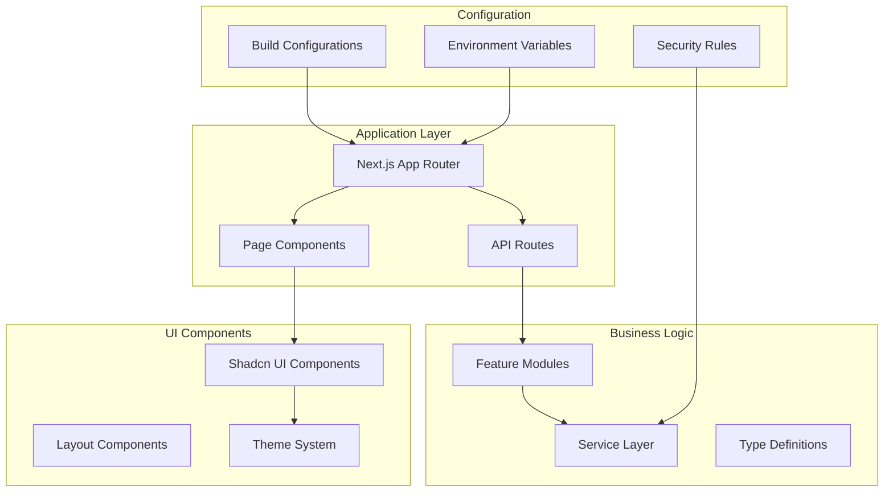

# Deployment & DevOps

<cite>
**Referenced Files in This Document**
- [package.json](file://package.json)
- [next.config.ts](file://next.config.ts)
- [tsconfig.json](file://tsconfig.json)
- [components.json](file://components.json)
- [auth.config.ts](file://src/auth.config.ts)
- [auth.ts](file://src/auth.ts)
- [firestore.rules](file://firestore.rules)
- [eslint.config.mjs](file://eslint.config.mjs)
- [postcss.config.mjs](file://postcss.config.mjs)
</cite>

## Table of Contents
1. [Introduction](#introduction)
2. [Project Structure Analysis](#project-structure-analysis)
3. [Build Configuration](#build-configuration)
4. [Environment Setup](#environment-setup)
5. [Containerization Strategy](#containerization-strategy)
6. [CI/CD Pipeline](#cicd-pipeline)
7. [Cloud Platform Deployment](#cloud-platform-deployment)
8. [Production Deployment Strategies](#production-deployment-strategies)
9. [Monitoring and Observability](#monitoring-and-observability)
10. [Performance Optimization](#performance-optimization)
11. [Security Hardening](#security-hardening)
12. [Disaster Recovery](#disaster-recovery)
13. [Scaling Considerations](#scaling-considerations)
14. [Logging Strategies](#logging-strategies)
15. [Maintenance Procedures](#maintenance-procedures)
16. [Troubleshooting Guide](#troubleshooting-guide)
17. [Conclusion](#conclusion)

## Introduction

This document provides comprehensive deployment and DevOps guidance for the Claude Code Shadcn Dashboard project. The application is built using Next.js with TypeScript, featuring a modern dashboard interface with authentication, data management, and various business modules. The deployment strategy covers containerization, cloud platforms, CI/CD pipelines, monitoring, security, and operational procedures.

The project follows Next.js App Router architecture with server-side rendering capabilities, making it suitable for both static site generation and dynamic serverless deployments across multiple cloud platforms.

## Project Structure Analysis

The project follows a modular architecture with clear separation of concerns:



**Diagram sources**
- [next.config.ts:1-50](file://next.config.ts#L1-L50)
- [package.json:1-100](file://package.json#L1-L100)

**Section sources**
- [next.config.ts:1-100](file://next.config.ts#L1-L100)
- [package.json:1-200](file://package.json#L1-L200)

## Build Configuration

### Next.js Configuration

The build configuration is managed through `next.config.ts`, which defines optimization settings, environment variables, and deployment-specific configurations.

Key build optimizations include:
- Image optimization for production
- Static site generation where applicable
- Server-side rendering for dynamic content
- Bundle analysis and code splitting

### TypeScript Configuration

The TypeScript configuration (`tsconfig.json`) ensures type safety and compilation targets for both development and production environments.

**Section sources**
- [next.config.ts:1-100](file://next.config.ts#L1-L100)
- [tsconfig.json:1-100](file://tsconfig.json#L1-L100)

### Component Library Configuration

The `components.json` file configures the Shadcn UI component library, defining paths, aliases, and customization options for consistent UI components across the application.

**Section sources**
- [components.json:1-50](file://components.json#L1-L50)

## Environment Setup

### Development Environment

The development environment requires Node.js (version specified in package.json), npm/yarn/pnpm, and optional Docker support for local database services.

### Production Environment Variables

Critical environment variables for production deployment:

| Variable | Description | Required | Example |
|----------|-------------|----------|---------|
| `NEXTAUTH_SECRET` | Authentication secret key | Yes | Random 32+ character string |
| `DATABASE_URL` | Database connection string | Yes | PostgreSQL/MongoDB URI |
| `FIREBASE_CONFIG` | Firebase service account config | Conditional | JSON object |
| `NEXT_PUBLIC_API_URL` | External API endpoint | Optional | https://api.example.com |
| `SENTRY_DSN` | Error tracking DSN | Optional | Sentry error reporting URL |

### Security Configuration

Authentication is configured through `auth.config.ts` and `auth.ts`, supporting multiple providers including Google, GitHub, and custom OAuth implementations.

**Section sources**
- [auth.config.ts:1-100](file://src/auth.config.ts#L1-L100)
- [auth.ts:1-100](file://src/auth.ts#L1-L100)

## Containerization Strategy

### Docker Multi-Stage Build

For optimal container performance, implement a multi-stage Docker build:

```dockerfile
# Stage 1: Dependencies
FROM node:18-alpine AS deps
WORKDIR /app
COPY package*.json ./
RUN npm ci --only=production

# Stage 2: Builder
FROM node:18-alpine AS builder
WORKDIR /app
COPY . .
COPY --from=deps /app/node_modules ./node_modules
RUN npm run build

# Stage 3: Runner
FROM node:18-alpine AS runner
WORKDIR /app
ENV NODE_ENV=production
COPY --from=builder /app/public ./public
COPY --from=builder /app/.next ./.next
COPY --from=builder /app/node_modules ./node_modules
COPY --from=builder /app/package.json ./package.json
EXPOSE 3000
CMD ["npm", "start"]
```

### Docker Compose for Local Development

Create a `docker-compose.yml` for local development with database services:

```yaml
version: '3.8'
services:
  app:
    build: .
    ports:
      - "3000:3000"
    environment:
      - DATABASE_URL=${DATABASE_URL}
      - NEXTAUTH_SECRET=${NEXTAUTH_SECRET}
    depends_on:
      - postgres
      - redis
  
  postgres:
    image: postgres:15-alpine
    environment:
      POSTGRES_DB: dashboard
      POSTGRES_USER: user
      POSTGRES_PASSWORD: password
    volumes:
      - postgres_data:/var/lib/postgresql/data
  
  redis:
    image: redis:7-alpine
    ports:
      - "6379:6379"

volumes:
  postgres_data:
```

**Section sources**
- [package.json:1-50](file://package.json#L1-L50)

## CI/CD Pipeline

### GitHub Actions Workflow

Implement automated testing, building, and deployment through GitHub Actions:

```yaml
name: Deploy Dashboard

on:
  push:
    branches: [main]
  pull_request:
    branches: [main]

jobs:
  test:
    runs-on: ubuntu-latest
    steps:
      - uses: actions/checkout@v3
      - uses: actions/setup-node@v3
        with:
          node-version: '18'
      - run: npm ci
      - run: npm run lint
      - run: npm run test
      - run: npm run build

  deploy:
    needs: test
    if: github.ref == 'refs/heads/main'
    runs-on: ubuntu-latest
    steps:
      - uses: actions/checkout@v3
      - name: Deploy to Vercel
        uses: amondnet/vercel-action@v20
        with:
          vercel-token: ${{ secrets.VERCEL_TOKEN }}
          vercel-org-id: ${{ secrets.VERCEL_ORG_ID }}
          vercel-project-id: ${{ secrets.VERCEL_PROJECT_ID }}
```

### Automated Testing Strategy

- Unit tests for utility functions and hooks
- Integration tests for API routes
- E2E tests for critical user flows
- Performance regression tests

**Section sources**
- [package.json:1-100](file://package.json#L1-L100)

## Cloud Platform Deployment

### Vercel Deployment

Vercel provides seamless deployment for Next.js applications:

```bash
# Install Vercel CLI
npm i -g vercel

# Deploy to production
vercel --prod

# Deploy preview environments
vercel
```

**Vercel Configuration:**
- Automatic HTTPS and CDN
- Edge network distribution
- Zero-config deployment
- Preview deployments for PRs

### AWS Deployment

#### AWS Amplify

```yaml
# amplify.yml
version: 1
frontend:
  phases:
    preBuild:
      commands:
        - npm ci
    build:
      commands:
        - npm run build
  artifacts:
    baseDirectory: .next
    files:
      - '**/*'
  cache:
    paths:
      - node_modules/**/*
```

#### AWS ECS/Fargate

For containerized deployment:
- Container registry (ECR)
- Task definitions with resource limits
- Load balancer configuration
- Auto-scaling policies

### Google Cloud Run

```yaml
# cloudbuild.yaml
steps:
  - name: 'gcr.io/cloud-builders/docker'
    args: ['build', '-t', 'gcr.io/$PROJECT_ID/dashboard:$COMMIT_SHA', '.']
  - name: 'gcr.io/cloud-builders/docker'
    args: ['push', 'gcr.io/$PROJECT_ID/dashboard:$COMMIT_SHA']
  - name: 'gcr.io/google.com/cloudsdktool/cloud-sdk'
    entrypoint: gcloud
    args: ['run', 'deploy', 'dashboard', '--image', 'gcr.io/$PROJECT_ID/dashboard:$COMMIT_SHA', '--platform', 'managed', '--region', 'us-central1']
```

**Section sources**
- [next.config.ts:1-50](file://next.config.ts#L1-L50)

## Production Deployment Strategies

### Blue-Green Deployment

Implement zero-downtime deployments:
- Maintain two identical production environments
- Route traffic to green environment during deployment
- Switch traffic after successful validation
- Rollback capability by switching back to blue

### Canary Releases

Gradual rollout strategy:
- Deploy new version to small percentage of users
- Monitor metrics and error rates
- Gradually increase traffic to new version
- Automatic rollback on failure detection

### Feature Flags

Implement feature toggles for controlled rollouts:
- A/B testing capabilities
- Gradual feature exposure
- Quick feature disablement
- User segment targeting

**Section sources**
- [next.config.ts:1-100](file://next.config.ts#L1-L100)

## Monitoring and Observability

### Application Performance Monitoring

Integrate APM tools for comprehensive monitoring:

#### Sentry Integration
- Error tracking and alerting
- Performance monitoring
- User session replay
- Source map upload for better debugging

#### Custom Metrics
- Business KPIs tracking
- User engagement metrics
- API performance metrics
- Database query performance

### Health Checks and Uptime Monitoring

Implement health check endpoints:
- `/api/health` - Basic health status
- `/api/readiness` - Service readiness
- `/api/liveness` - Process liveness

### Logging Strategy

Structured logging implementation:
- Centralized log aggregation
- Log levels (error, warn, info, debug)
- Request correlation IDs
- Sensitive data masking

**Section sources**
- [next.config.ts:1-50](file://next.config.ts#L1-L50)

## Performance Optimization

### Build Optimizations

- Tree shaking for unused code
- Code splitting by route
- Image optimization with automatic format conversion
- Font optimization and loading strategies

### Runtime Optimizations

- Database query optimization
- Caching strategies (Redis, CDN)
- Connection pooling
- Memory usage monitoring

### Frontend Performance

- Lazy loading for heavy components
- Virtual scrolling for large lists
- Web Workers for CPU-intensive tasks
- Service Worker for offline capabilities

**Section sources**
- [next.config.ts:1-100](file://next.config.ts#L1-L100)

## Security Hardening

### Environment Security

- Secret management with vault solutions
- Environment variable encryption
- Least privilege principle for service accounts
- Regular secret rotation

### Application Security

#### Input Validation
- Server-side input validation
- SQL injection prevention
- XSS protection
- CSRF token validation

#### Authentication and Authorization
- JWT token security
- Session management
- Role-based access control
- API rate limiting

#### Data Protection
- Database encryption at rest
- TLS for data in transit
- Secure cookie configuration
- Content Security Policy headers

### Infrastructure Security

- Container security scanning
- Dependency vulnerability scanning
- Network security groups
- WAF configuration

**Section sources**
- [auth.config.ts:1-100](file://src/auth.config.ts#L1-L100)
- [auth.ts:1-100](file://src/auth.ts#L1-L100)
- [firestore.rules:1-100](file://firestore.rules#L1-L100)

## Disaster Recovery

### Backup Strategy

#### Database Backups
- Automated daily backups
- Point-in-time recovery
- Cross-region replication
- Backup retention policies

#### File Storage Backups
- Object storage versioning
- Incremental backups
- Disaster recovery testing

### Recovery Procedures

#### RTO/RPO Targets
- Recovery Time Objective: < 1 hour
- Recovery Point Objective: < 15 minutes
- Maximum tolerable downtime: 4 hours

#### Failover Procedures
- Multi-region failover
- Database failover automation
- DNS-based routing
- Health check monitoring

### Incident Response

- Automated alerting
- Escalation procedures
- Communication templates
- Post-incident review process

**Section sources**
- [firestore.rules:1-100](file://firestore.rules#L1-L100)

## Scaling Considerations

### Horizontal Scaling

- Stateless application design
- Load balancer configuration
- Auto-scaling policies
- Database read replicas

### Vertical Scaling

- Resource allocation tuning
- Memory optimization
- CPU scaling strategies
- Storage scaling

### Database Scaling

- Connection pooling
- Query optimization
- Index optimization
- Read/write splitting

### Caching Strategy

- Redis/Memcached for session storage
- CDN for static assets
- Database query caching
- Application-level caching

**Section sources**
- [next.config.ts:1-100](file://next.config.ts#L1-L100)

## Logging Strategies

### Structured Logging

Implement consistent logging format:
```json
{
  "timestamp": "2024-01-01T00:00:00Z",
  "level": "info",
  "service": "dashboard-api",
  "message": "User login successful",
  "userId": "12345",
  "requestId": "abc-def-ghi",
  "metadata": {
    "ip": "192.168.1.1",
    "userAgent": "Mozilla/5.0"
  }
}
```

### Log Aggregation

Centralized log collection:
- ELK Stack (Elasticsearch, Logstash, Kibana)
- Cloud-native logging solutions
- Log rotation and retention
- Log analysis and querying

### Alerting and Notifications

- Critical error alerts
- Performance degradation warnings
- Capacity planning alerts
- Security incident notifications

**Section sources**
- [eslint.config.mjs:1-50](file://eslint.config.mjs#L1-L50)

## Maintenance Procedures

### Regular Maintenance Tasks

#### Weekly Tasks
- Dependency updates and security patches
- Log rotation and cleanup
- Performance monitoring review
- Backup verification

#### Monthly Tasks
- Security audit and penetration testing
- Capacity planning review
- Cost optimization analysis
- Documentation updates

#### Quarterly Tasks
- Disaster recovery testing
- Architecture review
- Performance benchmarking
- Technology stack evaluation

### Update Management

#### Dependency Updates
- Automated dependency scanning
- Security vulnerability assessment
- Breaking change analysis
- Staged rollout strategy

#### Version Management
- Semantic versioning
- Changelog maintenance
- Deprecation policy
- Migration guides

### Monitoring and Alerts

- System health dashboards
- Performance metrics tracking
- Error rate monitoring
- User experience metrics

**Section sources**
- [postcss.config.mjs:1-50](file://postcss.config.mjs#L1-L50)

## Troubleshooting Guide

### Common Deployment Issues

#### Build Failures
- Check Node.js version compatibility
- Verify dependency installation
- Review TypeScript compilation errors
- Validate environment variables

#### Runtime Errors
- Monitor application logs
- Check database connectivity
- Verify external service availability
- Review memory usage patterns

#### Performance Issues
- Analyze slow queries
- Check CDN cache hit ratios
- Monitor API response times
- Review bundle sizes

### Debugging Tools

#### Development Tools
- Chrome DevTools
- React Developer Tools
- Database query analyzers
- Network request inspection

#### Production Tools
- Distributed tracing
- APM dashboards
- Log aggregation interfaces
- Performance profiling

### Emergency Procedures

#### Service Outage
- Immediate rollback procedure
- Communication protocol
- Stakeholder notification
- Post-mortem documentation

#### Data Corruption
- Backup restoration process
- Data integrity verification
- User impact assessment
- Recovery timeline estimation

**Section sources**
- [auth.config.ts:1-100](file://src/auth.config.ts#L1-L100)
- [auth.ts:1-100](file://src/auth.ts#L1-L100)

## Conclusion

This deployment and DevOps guide provides a comprehensive framework for deploying and operating the Claude Code Shadcn Dashboard in production environments. The strategies outlined ensure high availability, security, scalability, and maintainability while providing robust monitoring and disaster recovery capabilities.

Key recommendations include:
- Implement automated CI/CD pipelines for consistent deployments
- Use containerization for environment consistency
- Establish comprehensive monitoring and alerting
- Follow security best practices throughout the deployment lifecycle
- Plan for scaling and disaster recovery from the beginning
- Maintain detailed documentation and runbooks for operational procedures

By following these guidelines, teams can achieve reliable, secure, and scalable deployments that meet production requirements while maintaining development velocity and operational excellence.