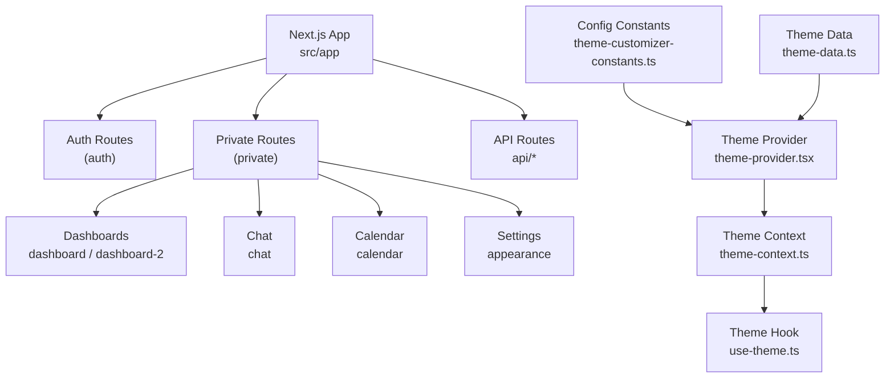
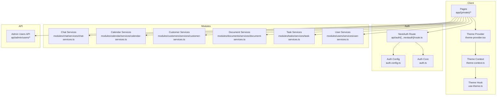
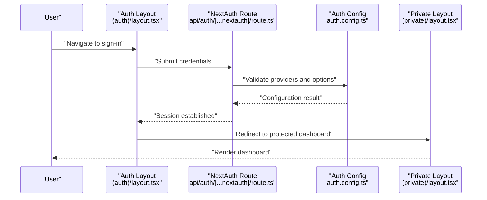
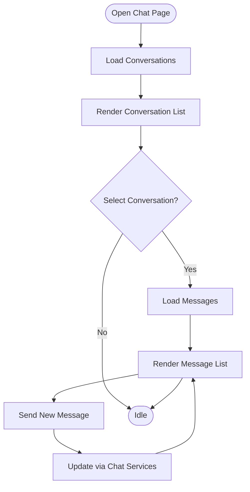
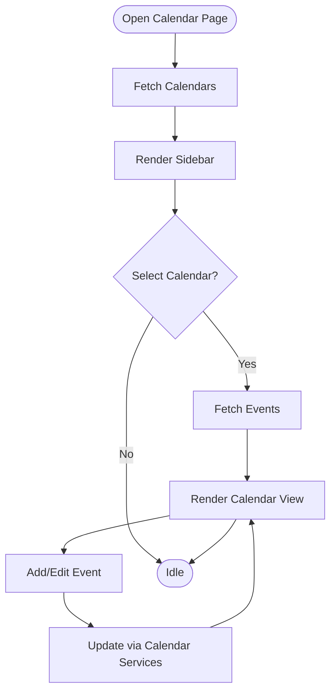
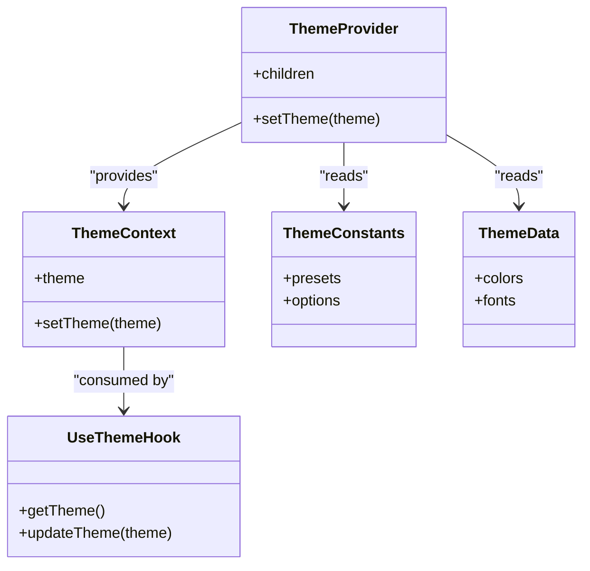
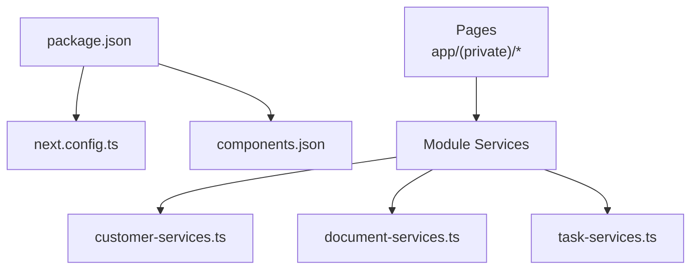

# Getting Started

<cite>
**Referenced Files in This Document**
- [package.json](file://package.json)
- [next.config.ts](file://next.config.ts)
- [components.json](file://components.json)
- [src/app/(auth)/layout.tsx](file://src/app/(auth)/layout.tsx)
- [src/app/(private)/layout.tsx](file://src/app/(private)/layout.tsx)
- [src/app/layout.tsx](file://src/app/layout.tsx)
- [src/app/page.tsx](file://src/app/page.tsx)
- [src/auth.config.ts](file://src/auth.config.ts)
- [src/auth.ts](file://src/auth.ts)
- [src/app/api/auth/[...nextauth]/route.ts](file://src/app/api/auth/[...nextauth]/route.ts)
- [src/app/api/admin/users/route.ts](file://src/app/api/admin/users/route.ts)
- [src/app/api/admin/users/[uid]/route.ts](file://src/app/api/admin/users/[uid]/route.ts)
- [src/app/(private)/dashboard/page.tsx](file://src/app/(private)/dashboard/page.tsx)
- [src/app/(private)/dashboard-2/page.tsx](file://src/app/(private)/dashboard-2/page.tsx)
- [src/app/(private)/chat/page.tsx](file://src/app/(private)/chat/page.tsx)
- [src/app/(private)/calendar/page.tsx](file://src/app/(private)/calendar/page.tsx)
- [src/app/(private)/settings/appearance/page.tsx](file://src/app/(private)/settings/appearance/page.tsx)
- [src/components/theme-provider.tsx](file://src/components/theme-provider.tsx)
- [src/contexts/theme-context.ts](file://src/contexts/theme-context.ts)
- [src/hooks/use-theme.ts](file://src/hooks/use-theme.ts)
- [src/config/theme-customizer-constants.ts](file://src/config/theme-customizer-constants.ts)
- [src/config/theme-data.ts](file://src/config/theme-data.ts)
- [src/modules/chat/services/chat-services.ts](file://src/modules/chat/services/chat-services.ts)
- [src/modules/calendar/services/calendar-services.ts](file://src/modules/calendar/services/calendar-services.ts)
- [src/modules/customers/services/customer-services.ts](file://src/modules/customers/services/customer-services.ts)
- [src/modules/documents/services/document-services.ts](file://src/modules/documents/services/document-services.ts)
- [src/modules/tasks/services/task-services.ts](file://src/modules/tasks/services/task-services.ts)
- [src/modules/users/services/user-services.ts](file://src/modules/users/services/user-services.ts)
</cite>

## Table of Contents
1. Introduction
2. Project Structure
3. Core Components
4. Architecture Overview
5. Detailed Component Analysis
6. Dependency Analysis
7. Performance Considerations
8. Troubleshooting Guide
9. Conclusion

## Introduction
This guide helps you set up and run the Claude Code ShadCN Dashboard quickly, then shows how to explore its key features: multi-dashboard interface, authentication system, real-time chat, calendar management, and theme customization. You will learn installation requirements, step-by-step setup, environment configuration, first-run instructions, basic usage examples, and troubleshooting tips.

## Project Structure
The project is a Next.js application with App Router, organized by feature modules under src/modules and shared UI components under src/components/ui. Authentication routes are grouped under (auth), protected pages under (private), and API endpoints under app/api. Theme-related code lives in src/components/theme-provider.tsx, src/contexts/theme-context.ts, src/hooks/use-theme.ts, and configuration files under src/config.

**Diagram sources**
- [src/app/layout.tsx](file://src/app/layout.tsx)
- [src/app/(auth)/layout.tsx](file://src/app/(auth)/layout.tsx)
- [src/app/(private)/layout.tsx](file://src/app/(private)/layout.tsx)
- [src/components/theme-provider.tsx](file://src/components/theme-provider.tsx)
- [src/contexts/theme-context.ts](file://src/contexts/theme-context.ts)
- [src/hooks/use-theme.ts](file://src/hooks/use-theme.ts)
- [src/config/theme-customizer-constants.ts](file://src/config/theme-customizer-constants.ts)
- [src/config/theme-data.ts](file://src/config/theme-data.ts)

**Section sources**
- [package.json](file://package.json)
- [next.config.ts](file://next.config.ts)
- [components.json](file://components.json)
- [src/app/layout.tsx](file://src/app/layout.tsx)
- [src/app/(auth)/layout.tsx](file://src/app/(auth)/layout.tsx)
- [src/app/(private)/layout.tsx](file://src/app/(private)/layout.tsx)

## Core Components
- Multi-dashboard interface: Two distinct dashboards under private routes for different views and metrics.
- Authentication system: NextAuth-based auth routes and providers for sign-in/sign-up flows.
- Real-time chat: Chat module with mock data services and UI components.
- Calendar management: Calendar module with event handling and date utilities.
- Theme customization: Theme provider, context, hooks, and configuration for appearance settings.

Key entry points and pages:
- Dashboards: [src/app/(private)/dashboard/page.tsx](file://src/app/(private)/dashboard/page.tsx), [src/app/(private)/dashboard-2/page.tsx](file://src/app/(private)/dashboard-2/page.tsx)
- Chat: [src/app/(private)/chat/page.tsx](file://src/app/(private)/chat/page.tsx)
- Calendar: [src/app/(private)/calendar/page.tsx](file://src/app/(private)/calendar/page.tsx)
- Settings Appearance: [src/app/(private)/settings/appearance/page.tsx](file://src/app/(private)/settings/appearance/page.tsx)
- Auth layout: [src/app/(auth)/layout.tsx](file://src/app/(auth)/layout.tsx)
- Private layout: [src/app/(private)/layout.tsx](file://src/app/(private)/layout.tsx)
- Root layout: [src/app/layout.tsx](file://src/app/layout.tsx)

**Section sources**
- [src/app/(private)/dashboard/page.tsx](file://src/app/(private)/dashboard/page.tsx)
- [src/app/(private)/dashboard-2/page.tsx](file://src/app/(private)/dashboard-2/page.tsx)
- [src/app/(private)/chat/page.tsx](file://src/app/(private)/chat/page.tsx)
- [src/app/(private)/calendar/page.tsx](file://src/app/(private)/calendar/page.tsx)
- [src/app/(private)/settings/appearance/page.tsx](file://src/app/(private)/settings/appearance/page.tsx)
- [src/app/(auth)/layout.tsx](file://src/app/(auth)/layout.tsx)
- [src/app/(private)/layout.tsx](file://src/app/(private)/layout.tsx)
- [src/app/layout.tsx](file://src/app/layout.tsx)

## Architecture Overview
High-level architecture:
- Client-side: Next.js App Router renders pages and layouts; theme provider wraps the app to manage appearance.
- Authentication: NextAuth route handler at api/auth/[...nextauth] manages sessions and credentials.
- Modules: Feature modules encapsulate UI and service layers for chat, calendar, customers, documents, tasks, users.
- APIs: Server routes under api handle admin operations and module-specific endpoints.

**Diagram sources**
- [src/app/(private)/layout.tsx](file://src/app/(private)/layout.tsx)
- [src/components/theme-provider.tsx](file://src/components/theme-provider.tsx)
- [src/contexts/theme-context.ts](file://src/contexts/theme-context.ts)
- [src/hooks/use-theme.ts](file://src/hooks/use-theme.ts)
- [src/app/api/auth/[...nextauth]/route.ts](file://src/app/api/auth/[...nextauth]/route.ts)
- [src/auth.config.ts](file://src/auth.config.ts)
- [src/auth.ts](file://src/auth.ts)
- [src/modules/chat/services/chat-services.ts](file://src/modules/chat/services/chat-services.ts)
- [src/modules/calendar/services/calendar-services.ts](file://src/modules/calendar/services/calendar-services.ts)
- [src/modules/customers/services/customer-services.ts](file://src/modules/customers/services/customer-services.ts)
- [src/modules/documents/services/document-services.ts](file://src/modules/documents/services/document-services.ts)
- [src/modules/tasks/services/task-services.ts](file://src/modules/tasks/services/task-services.ts)
- [src/modules/users/services/user-services.ts](file://src/modules/users/services/user-services.ts)
- [src/app/api/admin/users/route.ts](file://src/app/api/admin/users/route.ts)
- [src/app/api/admin/users/[uid]/route.ts](file://src/app/api/admin/users/[uid]/route.ts)

## Detailed Component Analysis

### Installation and Setup
- Requirements:
  - Node.js version as specified in package.json engines or .nvmrc if present.
  - Package manager: npm (or your preferred equivalent).
- Steps:
  1. Clone the repository.
  2. Install dependencies using your package manager.
  3. Configure environment variables required by NextAuth and any integrations.
  4. Run the development server.
  5. Open the app in your browser.

Environment configuration:
- NextAuth requires secrets and provider configurations. See:
  - [src/auth.config.ts](file://src/auth.config.ts)
  - [src/auth.ts](file://src/auth.ts)
  - [src/app/api/auth/[...nextauth]/route.ts](file://src/app/api/auth/[...nextauth]/route.ts)
- Next.js configuration:
  - [next.config.ts](file://next.config.ts)
- ShadCN UI configuration:
  - [components.json](file://components.json)

First run:
- Start dev server and navigate to root page:
  - [src/app/page.tsx](file://src/app/page.tsx)

**Section sources**
- [package.json](file://package.json)
- [next.config.ts](file://next.config.ts)
- [components.json](file://components.json)
- [src/auth.config.ts](file://src/auth.config.ts)
- [src/auth.ts](file://src/auth.ts)
- [src/app/api/auth/[...nextauth]/route.ts](file://src/app/api/auth/[...nextauth]/route.ts)
- [src/app/page.tsx](file://src/app/page.tsx)

### Authentication System
- Entry point: NextAuth route handler at api/auth/[...nextauth].
- Configuration:
  - Providers and callbacks defined in auth config and core auth files.
- Protected routes:
  - Private layout enforces access control for dashboard and other pages.

Basic usage:
- Sign in/out via the auth layout pages.
- Access protected dashboards after successful authentication.

**Diagram sources**
- [src/app/(auth)/layout.tsx](file://src/app/(auth)/layout.tsx)
- [src/app/api/auth/[...nextauth]/route.ts](file://src/app/api/auth/[...nextauth]/route.ts)
- [src/auth.config.ts](file://src/auth.config.ts)
- [src/app/(private)/layout.tsx](file://src/app/(private)/layout.tsx)

**Section sources**
- [src/app/(auth)/layout.tsx](file://src/app/(auth)/layout.tsx)
- [src/app/(private)/layout.tsx](file://src/app/(private)/layout.tsx)
- [src/app/api/auth/[...nextauth]/route.ts](file://src/app/api/auth/[...nextauth]/route.ts)
- [src/auth.config.ts](file://src/auth.config.ts)
- [src/auth.ts](file://src/auth.ts)

### Multi-Dashboard Interface
- Dashboard 1:
  - Page: [src/app/(private)/dashboard/page.tsx](file://src/app/(private)/dashboard/page.tsx)
- Dashboard 2:
  - Page: [src/app/(private)/dashboard-2/page.tsx](file://src/app/(private)/dashboard-2/page.tsx)

Usage example:
- After signing in, navigate to either dashboard from the sidebar or direct URL.

**Section sources**
- [src/app/(private)/dashboard/page.tsx](file://src/app/(private)/dashboard/page.tsx)
- [src/app/(private)/dashboard-2/page.tsx](file://src/app/(private)/dashboard-2/page.tsx)

### Real-Time Chat
- Chat page:
  - [src/app/(private)/chat/page.tsx](file://src/app/(private)/chat/page.tsx)
- Service layer:
  - [src/modules/chat/services/chat-services.ts](file://src/modules/chat/services/chat-services.ts)

Usage example:
- Open the chat page to view conversations and messages. Interactions are handled through the chat services.

**Diagram sources**
- [src/app/(private)/chat/page.tsx](file://src/app/(private)/chat/page.tsx)
- [src/modules/chat/services/chat-services.ts](file://src/modules/chat/services/chat-services.ts)

**Section sources**
- [src/app/(private)/chat/page.tsx](file://src/app/(private)/chat/page.tsx)
- [src/modules/chat/services/chat-services.ts](file://src/modules/chat/services/chat-services.ts)

### Calendar Management
- Calendar page:
  - [src/app/(private)/calendar/page.tsx](file://src/app/(private)/calendar/page.tsx)
- Service layer:
  - [src/modules/calendar/services/calendar-services.ts](file://src/modules/calendar/services/calendar-services.ts)

Usage example:
- Navigate to the calendar page to view events and manage dates.

**Diagram sources**
- [src/app/(private)/calendar/page.tsx](file://src/app/(private)/calendar/page.tsx)
- [src/modules/calendar/services/calendar-services.ts](file://src/modules/calendar/services/calendar-services.ts)

**Section sources**
- [src/app/(private)/calendar/page.tsx](file://src/app/(private)/calendar/page.tsx)
- [src/modules/calendar/services/calendar-services.ts](file://src/modules/calendar/services/calendar-services.ts)

### Theme Customization
- Theme provider and context:
  - [src/components/theme-provider.tsx](file://src/components/theme-provider.tsx)
  - [src/contexts/theme-context.ts](file://src/contexts/theme-context.ts)
  - [src/hooks/use-theme.ts](file://src/hooks/use-theme.ts)
- Configuration constants and data:
  - [src/config/theme-customizer-constants.ts](file://src/config/theme-customizer-constants.ts)
  - [src/config/theme-data.ts](file://src/config/theme-data.ts)
- Appearance settings page:
  - [src/app/(private)/settings/appearance/page.tsx](file://src/app/(private)/settings/appearance/page.tsx)

Usage example:
- Visit the appearance settings to customize themes and layout options. Changes are applied globally via the theme provider.

**Diagram sources**
- [src/components/theme-provider.tsx](file://src/components/theme-provider.tsx)
- [src/contexts/theme-context.ts](file://src/contexts/theme-context.ts)
- [src/hooks/use-theme.ts](file://src/hooks/use-theme.ts)
- [src/config/theme-customizer-constants.ts](file://src/config/theme-customizer-constants.ts)
- [src/config/theme-data.ts](file://src/config/theme-data.ts)

**Section sources**
- [src/components/theme-provider.tsx](file://src/components/theme-provider.tsx)
- [src/contexts/theme-context.ts](file://src/contexts/theme-context.ts)
- [src/hooks/use-theme.ts](file://src/hooks/use-theme.ts)
- [src/config/theme-customizer-constants.ts](file://src/config/theme-customizer-constants.ts)
- [src/config/theme-data.ts](file://src/config/theme-data.ts)
- [src/app/(private)/settings/appearance/page.tsx](file://src/app/(private)/settings/appearance/page.tsx)

### Basic Usage Examples
- Navigate the dashboard:
  - Go to [src/app/(private)/dashboard/page.tsx](file://src/app/(private)/dashboard/page.tsx) and [src/app/(private)/dashboard-2/page.tsx](file://src/app/(private)/dashboard-2/page.tsx).
- Create users:
  - Use the admin users API endpoints:
    - [src/app/api/admin/users/route.ts](file://src/app/api/admin/users/route.ts)
    - [src/app/api/admin/users/[uid]/route.ts](file://src/app/api/admin/users/[uid]/route.ts)
  - Or use the user services:
    - [src/modules/users/services/user-services.ts](file://src/modules/users/services/user-services.ts)
- Customize themes:
  - Open [src/app/(private)/settings/appearance/page.tsx](file://src/app/(private)/settings/appearance/page.tsx) and adjust options managed by the theme provider and context.

**Section sources**
- [src/app/(private)/dashboard/page.tsx](file://src/app/(private)/dashboard/page.tsx)
- [src/app/(private)/dashboard-2/page.tsx](file://src/app/(private)/dashboard-2/page.tsx)
- [src/app/api/admin/users/route.ts](file://src/app/api/admin/users/route.ts)
- [src/app/api/admin/users/[uid]/route.ts](file://src/app/api/admin/users/[uid]/route.ts)
- [src/modules/users/services/user-services.ts](file://src/modules/users/services/user-services.ts)
- [src/app/(private)/settings/appearance/page.tsx](file://src/app/(private)/settings/appearance/page.tsx)

## Dependency Analysis
External dependencies and configuration:
- Next.js runtime and build configuration:
  - [next.config.ts](file://next.config.ts)
- ShadCN UI component registry:
  - [components.json](file://components.json)
- Package metadata and scripts:
  - [package.json](file://package.json)

Module services used across pages:
- Customers: [src/modules/customers/services/customer-services.ts](file://src/modules/customers/services/customer-services.ts)
- Documents: [src/modules/documents/services/document-services.ts](file://src/modules/documents/services/document-services.ts)
- Tasks: [src/modules/tasks/services/task-services.ts](file://src/modules/tasks/services/task-services.ts)

**Diagram sources**
- [package.json](file://package.json)
- [next.config.ts](file://next.config.ts)
- [components.json](file://components.json)
- [src/modules/customers/services/customer-services.ts](file://src/modules/customers/services/customer-services.ts)
- [src/modules/documents/services/document-services.ts](file://src/modules/documents/services/document-services.ts)
- [src/modules/tasks/services/task-services.ts](file://src/modules/tasks/services/task-services.ts)

**Section sources**
- [package.json](file://package.json)
- [next.config.ts](file://next.config.ts)
- [components.json](file://components.json)
- [src/modules/customers/services/customer-services.ts](file://src/modules/customers/services/customer-services.ts)
- [src/modules/documents/services/document-services.ts](file://src/modules/documents/services/document-services.ts)
- [src/modules/tasks/services/task-services.ts](file://src/modules/tasks/services/task-services.ts)

## Performance Considerations
- Prefer client-side rendering for interactive dashboards where appropriate.
- Use memoization and lightweight state updates in theme switching.
- Avoid heavy synchronous operations in API routes; paginate large datasets.
- Leverage static assets and caching strategies configured in next.config.ts.

[No sources needed since this section provides general guidance]

## Troubleshooting Guide
Common issues and resolutions:
- Missing environment variables for NextAuth:
  - Ensure all required secrets and provider configs are set. Check:
    - [src/auth.config.ts](file://src/auth.config.ts)
    - [src/auth.ts](file://src/auth.ts)
    - [src/app/api/auth/[...nextauth]/route.ts](file://src/app/api/auth/[...nextauth]/route.ts)
- Incorrect Node.js version:
  - Verify the version matches the engines field in package.json.
- ShadCN UI not loading:
  - Confirm components.json is correctly configured and dependencies are installed.
- API errors when creating users:
  - Validate request payloads and check admin users API routes:
    - [src/app/api/admin/users/route.ts](file://src/app/api/admin/users/route.ts)
    - [src/app/api/admin/users/[uid]/route.ts](file://src/app/api/admin/users/[uid]/route.ts)

**Section sources**
- [src/auth.config.ts](file://src/auth.config.ts)
- [src/auth.ts](file://src/auth.ts)
- [src/app/api/auth/[...nextauth]/route.ts](file://src/app/api/auth/[...nextauth]/route.ts)
- [package.json](file://package.json)
- [components.json](file://components.json)
- [src/app/api/admin/users/route.ts](file://src/app/api/admin/users/route.ts)
- [src/app/api/admin/users/[uid]/route.ts](file://src/app/api/admin/users/[uid]/route.ts)

## Conclusion
You now have the essentials to install, configure, and run the Claude Code ShadCN Dashboard. Explore the multi-dashboard interface, authenticate users, interact with chat and calendar modules, and customize themes. Refer back to the relevant sections for detailed paths and diagrams when extending or troubleshooting the application.