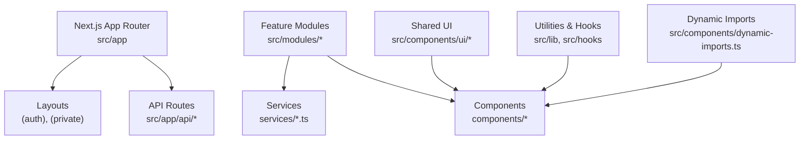
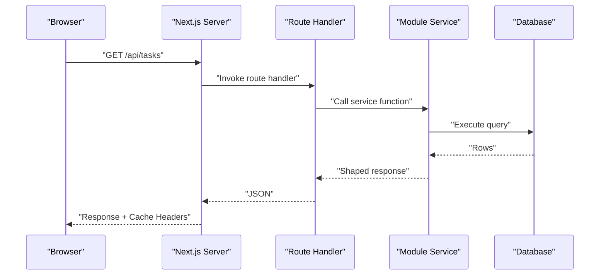
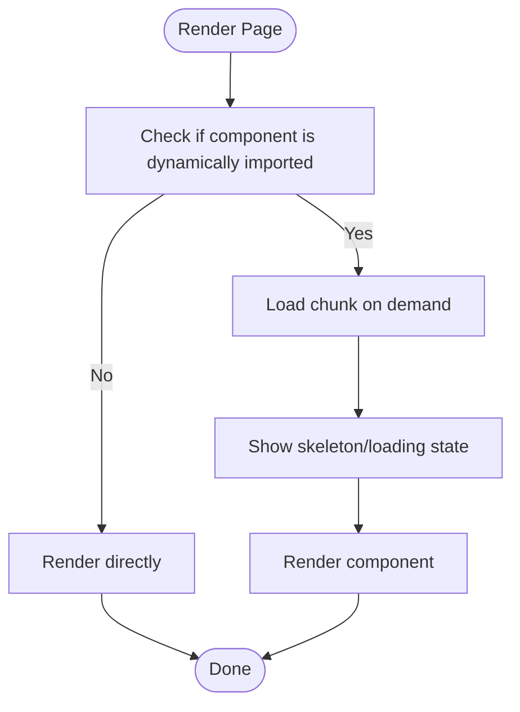
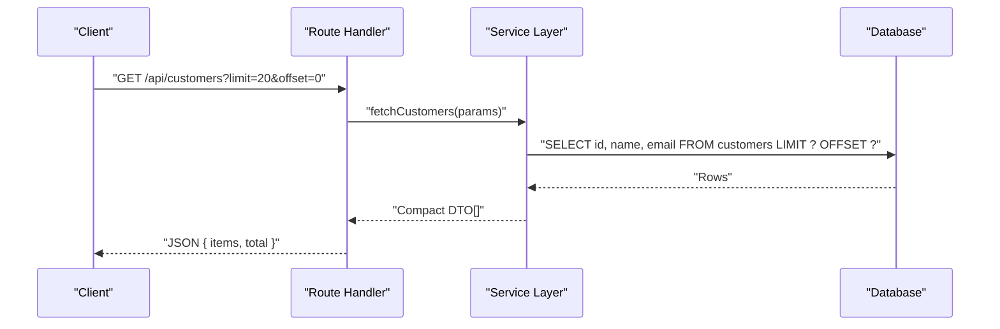
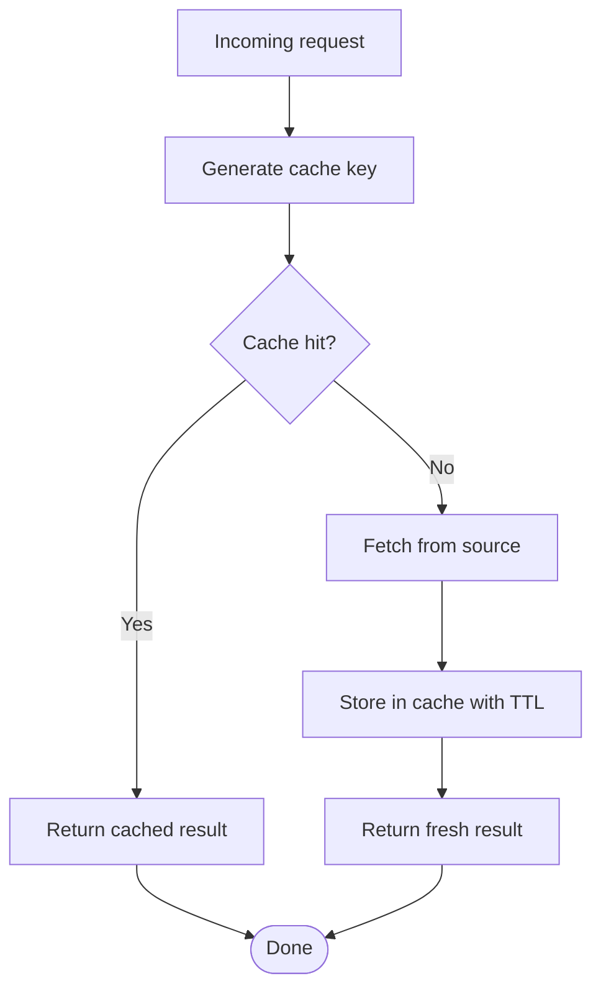
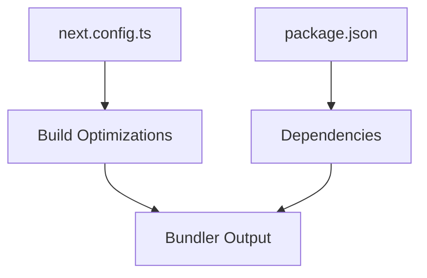

# Performance Optimization

<cite>
**Referenced Files in This Document**
- [next.config.ts](file://next.config.ts)
- [package.json](file://package.json)
- [src/app/layout.tsx](file://src/app/layout.tsx)
- [src/app/loading.tsx](file://src/app/loading.tsx)
- [src/components/dynamic-imports.ts](file://src/components/dynamic-imports.ts)
- [src/app/(private)/layout.tsx](file://src/app/(private)/layout.tsx)
- [src/app/(auth)/layout.tsx](file://src/app/(auth)/layout.tsx)
- [src/app/api/tasks/route.ts](file://src/app/api/tasks/route.ts)
- [src/app/api/customers/route.ts](file://src/app/api/customers/route.ts)
- [src/app/api/admin/users/route.ts](file://src/app/api/admin/users/route.ts)
- [src/modules/calendar/services/calendar-services.ts](file://src/modules/calendar/services/calendar-services.ts)
- [src/modules/chat/services/chat-services.ts](file://src/modules/chat/services/chat-services.ts)
- [src/modules/customers/services/customer-services.ts](file://src/modules/customers/services/customer-services.ts)
- [src/modules/documents/services/document-services.ts](file://src/modules/documents/services/document-services.ts)
- [src/modules/tasks/services/task-services.ts](file://src/modules/tasks/services/task-services.ts)
- [src/modules/users/services/user-services.ts](file://src/modules/users/services/user-services.ts)
- [src/lib/utils.ts](file://src/lib/utils.ts)
</cite>

## Table of Contents
1. [Introduction](#introduction)
2. [Project Structure](#project-structure)
3. [Core Components](#core-components)
4. [Architecture Overview](#architecture-overview)
5. [Detailed Component Analysis](#detailed-component-analysis)
6. [Dependency Analysis](#dependency-analysis)
7. [Performance Considerations](#performance-considerations)
8. [Troubleshooting Guide](#troubleshooting-guide)
9. [Conclusion](#conclusion)
10. [Appendices](#appendices)

## Introduction
This document provides a comprehensive performance optimization guide for the project, focusing on:
- Bundle size optimization and code splitting
- Lazy loading strategies for routes and components
- Caching strategies at client and server levels
- Database query optimization and API response tuning
- Frontend techniques including image optimization and memory management
- Backend optimization strategies, indexing, and response shaping
- Performance monitoring, profiling tools, and bottleneck identification

The guidance is grounded in the existing Next.js App Router structure, modular services, and API route patterns present in the repository.

## Project Structure
The application follows a feature-based organization under src/modules with shared UI components, hooks, contexts, and utilities. API endpoints are implemented using Next.js Route Handlers under src/app/api. Layouts are grouped by route segments such as (auth) and (private).

[No sources needed since this diagram shows conceptual workflow, not actual code structure]

## Core Components
Key areas that influence performance:
- Dynamic imports for lazy-loading heavy features
- Route-level layouts to isolate shared logic and assets
- API routes that serve data to modules
- Services layer that encapsulates data fetching and transformations
- Shared UI components used across features

Practical levers:
- Use dynamic imports for large third-party libraries and rarely-used features
- Prefer route-level layouts to avoid unnecessary global state or heavy dependencies
- Shape API responses to minimize payload sizes
- Implement caching headers and client-side memoization where appropriate

**Section sources**
- [src/components/dynamic-imports.ts](file://src/components/dynamic-imports.ts)
- [src/app/(private)/layout.tsx](file://src/app/(private)/layout.tsx)
- [src/app/(auth)/layout.tsx](file://src/app/(auth)/layout.tsx)
- [src/app/api/tasks/route.ts](file://src/app/api/tasks/route.ts)
- [src/app/api/customers/route.ts](file://src/app/api/customers/route.ts)
- [src/app/api/admin/users/route.ts](file://src/app/api/admin/users/route.ts)

## Architecture Overview
High-level flow from browser to API and back:

[No sources needed since this diagram shows conceptual workflow, not actual code structure]

## Detailed Component Analysis

### Dynamic Imports and Code Splitting
- Purpose: Reduce initial bundle size by deferring non-critical code until needed.
- Where to apply:
  - Heavy charts, calendars, or chat components
  - Feature-specific modals or dialogs
  - Third-party integrations loaded only when required
- Implementation pattern:
  - Centralize dynamic import helpers to standardize behavior and error handling
  - Combine with Suspense boundaries for graceful loading states
  - Avoid importing large libraries at module top-level in frequently rendered pages

[No sources needed since this diagram shows conceptual workflow, not actual code structure]

**Section sources**
- [src/components/dynamic-imports.ts](file://src/components/dynamic-imports.ts)

### Route-Level Layouts and Asset Isolation
- Purpose: Keep shared layout logic and assets scoped to relevant route groups.
- Benefits:
  - Prevents unnecessary CSS/JS from being loaded on unrelated routes
  - Reduces hydration overhead by limiting context providers and listeners
- Recommendations:
  - Place auth-only providers in (auth) layout
  - Place private-only providers in (private) layout
  - Avoid importing heavy modules in root layout unless globally required

**Section sources**
- [src/app/(private)/layout.tsx](file://src/app/(private)/layout.tsx)
- [src/app/(auth)/layout.tsx](file://src/app/(auth)/layout.tsx)

### API Response Shaping and Payload Minimization
- Purpose: Return only necessary fields and reduce payload size.
- Techniques:
  - Select specific columns/fields at the database level
  - Transform data into compact DTOs before sending JSON
  - Avoid embedding large nested objects; use references and fetch-on-demand
- Example targets:
  - Task listing endpoint
  - Customer listing endpoint
  - Admin user listing endpoint

**Section sources**
- [src/app/api/customers/route.ts](file://src/app/api/customers/route.ts)
- [src/modules/customers/services/customer-services.ts](file://src/modules/customers/services/customer-services.ts)
- [src/app/api/tasks/route.ts](file://src/app/api/tasks/route.ts)
- [src/modules/tasks/services/task-services.ts](file://src/modules/tasks/services/task-services.ts)
- [src/app/api/admin/users/route.ts](file://src/app/api/admin/users/route.ts)
- [src/modules/users/services/user-services.ts](file://src/modules/users/services/user-services.ts)

### Data Fetching Patterns and Memoization
- Purpose: Avoid redundant network requests and expensive recomputations.
- Strategies:
  - Deduplicate identical requests within short time windows
  - Cache results in memory for repeated reads
  - Invalidate caches on mutations or after TTL
- Targets:
  - Calendar events and calendars
  - Chat conversations and messages
  - Documents metadata and lists

**Section sources**
- [src/modules/calendar/services/calendar-services.ts](file://src/modules/calendar/services/calendar-services.ts)
- [src/modules/chat/services/chat-services.ts](file://src/modules/chat/services/chat-services.ts)
- [src/modules/documents/services/document-services.ts](file://src/modules/documents/services/document-services.ts)

### Image Optimization
- Purpose: Reduce bandwidth and improve perceived performance.
- Recommendations:
  - Use optimized formats (WebP/AVIF) and responsive sizing
  - Defer offscreen images and use lazy loading attributes
  - Serve appropriately sized thumbnails for list views
  - Preload critical hero images and fonts

[No sources needed since this section provides general guidance]

### Memory Management
- Purpose: Prevent memory leaks and long-term slowdowns.
- Practices:
  - Clean up event listeners, timers, and subscriptions in effects
  - Avoid retaining large DOM nodes or arrays in state
  - Use virtualized lists for large datasets
  - Release references when navigating away from heavy pages

[No sources needed since this section provides general guidance]

## Dependency Analysis
External configuration and build-time settings impact bundle size and runtime performance.

**Section sources**
- [package.json](file://package.json)
- [next.config.ts](file://next.config.ts)

## Performance Considerations

### Bundle Size Optimization
- Tree-shaking and dead code elimination:
  - Ensure library usage aligns with ES modules
  - Avoid default imports of entire packages when only small parts are needed
- Remove unused dependencies and dev-only code from production builds
- Analyze bundle with built-in metrics and external analyzers
- Prefer lightweight alternatives for large libraries when feasible

**Section sources**
- [package.json](file://package.json)
- [next.config.ts](file://next.config.ts)

### Lazy Loading Implementation
- Route-level lazy loading:
  - Use dynamic imports for page-level heavy components
  - Wrap with Suspense and provide meaningful fallbacks
- Component-level lazy loading:
  - Defer charting libraries, rich editors, and complex widgets
- Network-level lazy loading:
  - Paginate and load more on scroll or explicit actions

**Section sources**
- [src/components/dynamic-imports.ts](file://src/components/dynamic-imports.ts)

### Caching Strategies
- HTTP caching:
  - Set appropriate Cache-Control headers for static assets and API responses
  - Use ETag/Last-Modified for conditional requests
- In-memory caching:
  - Cache frequent read operations with TTL and invalidation on writes
- Client-side caching:
  - Memoize derived data and avoid re-renders via stable references
- CDN caching:
  - Offload static assets to CDN with proper cache policies

**Section sources**
- [src/app/api/tasks/route.ts](file://src/app/api/tasks/route.ts)
- [src/app/api/customers/route.ts](file://src/app/api/customers/route.ts)
- [src/app/api/admin/users/route.ts](file://src/app/api/admin/users/route.ts)

### Database Query Optimization
- Indexing:
  - Add indexes on frequently filtered/sorted columns
  - Covering indexes for common queries to avoid table lookups
- Query shaping:
  - Select only required fields
  - Use pagination and limit clauses
  - Avoid N+1 queries by batching or joins
- Connection pooling:
  - Tune pool size based on workload and concurrency

[No sources needed since this section provides general guidance]

### API Response Optimization
- Payload minimization:
  - Strip internal fields and normalize structures
  - Provide separate endpoints for detail vs. list views
- Compression:
  - Enable gzip/brotli for text payloads
- Streaming:
  - Stream large responses when possible

**Section sources**
- [src/app/api/tasks/route.ts](file://src/app/api/tasks/route.ts)
- [src/app/api/customers/route.ts](file://src/app/api/customers/route.ts)
- [src/app/api/admin/users/route.ts](file://src/app/api/admin/users/route.ts)

### Frontend Performance Techniques
- Code splitting:
  - Split by route and feature
  - Prefetch critical chunks on hover or idle
- Image optimization:
  - Responsive images, modern formats, lazy loading
- Memory management:
  - Virtualization for large lists
  - Cleanup side effects and release references

[No sources needed since this section provides general guidance]

### Backend Optimization Strategies
- Request validation and early returns
- Batch operations and bulk writes
- Background jobs for heavy tasks
- Rate limiting and circuit breakers for external calls

[No sources needed since this section provides general guidance]

## Troubleshooting Guide
Common issues and diagnostics:
- Large bundles:
  - Inspect dependency tree and remove unused code
  - Verify dynamic imports are correctly applied
- Slow API responses:
  - Profile database queries and add missing indexes
  - Review response shape and remove unnecessary fields
- High memory usage:
  - Identify retained references and large in-memory caches
  - Ensure cleanup in effects and event handlers
- Excessive re-renders:
  - Stabilize props and state references
  - Memoize expensive computations and derived data

Useful checks:
- Network tab for payload sizes and waterfall
- Performance tab for CPU and memory profiles
- React DevTools Profiler for render costs
- Database query logs for slow queries

[No sources needed since this section provides general guidance]

## Conclusion
By combining code splitting, lazy loading, careful caching, and efficient data access patterns, the application can achieve significant improvements in both initial load and ongoing responsiveness. Focus on minimizing payloads, avoiding unnecessary work, and measuring continuously to identify and resolve bottlenecks.

[No sources needed since this section summarizes without analyzing specific files]

## Appendices

### Monitoring and Profiling Tools
- Web Vitals and RUM for real-user metrics
- APM solutions for backend tracing
- Database query profilers and slow query logs
- Static analysis and bundle analyzers

[No sources needed since this section provides general guidance]