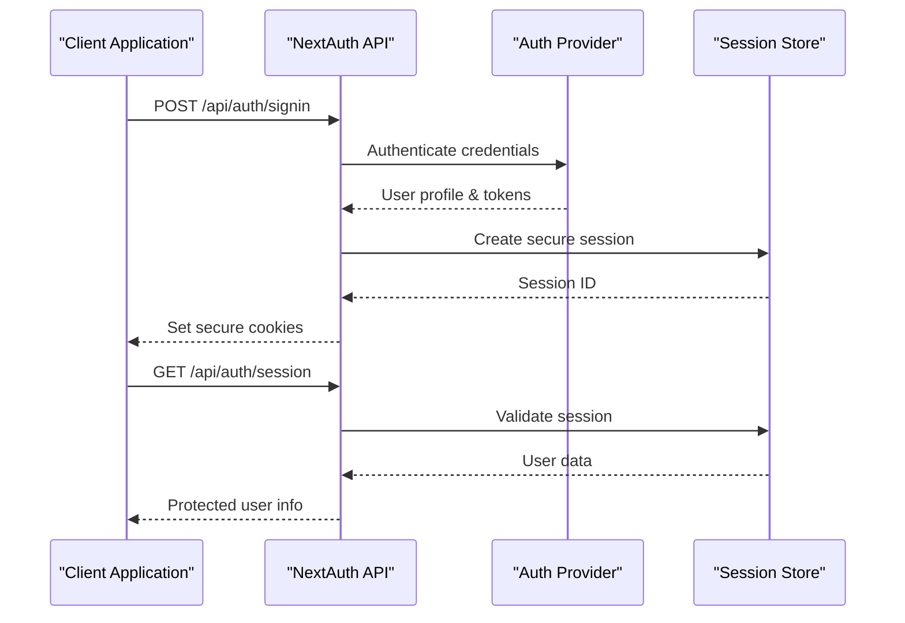
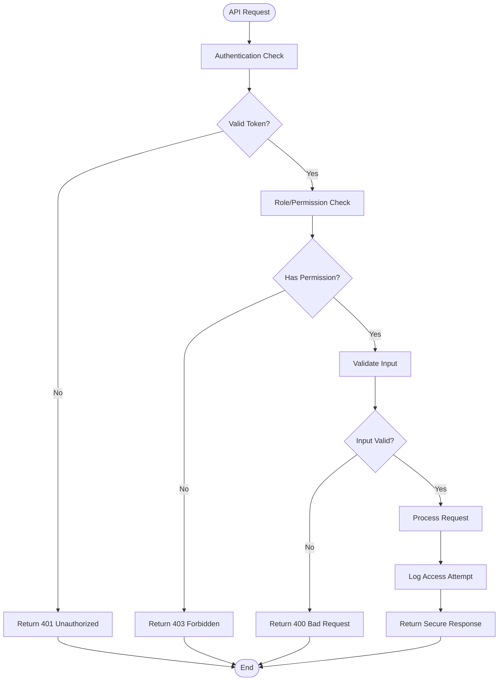

# Security Considerations

<cite>
**Referenced Files in This Document**
- [auth.config.ts](file://src/auth.config.ts)
- [auth.ts](file://src/auth.ts)
- [next.config.ts](file://next.config.ts)
- [firestore.rules](file://firestore.rules)
- [route.ts](file://src/app/api/auth/[...nextauth]/route.ts)
- [login-form.tsx](file://src/app/(auth)/sign-in/components/login-form.tsx)
- [signup-form.tsx](file://src/app/(auth)/sign-up/components/signup-form.tsx)
- [forgot-password-form.tsx](file://src/app/(auth)/forgot-password/components/forgot-password-form.tsx)
- [auth-provider.tsx](file://src/components/auth-provider.tsx)
- [layout.tsx](file://src/app/(auth)/layout.tsx)
- [layout.tsx](file://src/app/(private)/layout.tsx)
- [route.ts](file://src/app/api/admin/users/route.ts)
- [route.ts](file://src/app/api/admin/users/[uid]/route.ts)
- [route.ts](file://src/app/api/customers/route.ts)
- [route.ts](file://src/app/api/tasks/route.ts)
- [route.ts](file://src/app/api/telegram/route.ts)
</cite>

## Table of Contents
1. [Introduction](#introduction)
2. [Authentication Security](#authentication-security)
3. [Data Validation and Input Sanitization](#data-validation-and-input-sanitization)
4. [CORS Configuration](#cors-configuration)
5. [Security Headers](#security-headers)
6. [Secure API Endpoints](#secure-api-endpoints)
7. [Sensitive Data Protection](#sensitive-data-protection)
8. [Security Monitoring and Audit Logging](#security-monitoring-and-audit-logging)
9. [Vulnerability Prevention](#vulnerability-prevention)
10. [Compliance Requirements](#compliance-requirements)
11. [Production Deployment Security](#production-deployment-security)
12. [Security Incident Response](#security-incident-response)
13. [Best Practices Summary](#best-practices-summary)

## Introduction

This document provides comprehensive security guidance for the Claude Code Shadcn Dashboard application. The application is built using Next.js with authentication handled through NextAuth.js, Firebase integration, and various API endpoints. This security documentation covers authentication mechanisms, data validation, input sanitization, CORS configuration, security headers, secure coding practices, vulnerability prevention, and security monitoring strategies.

The application follows modern security best practices including proper authentication flows, role-based access control, input validation, and secure API design patterns.

## Authentication Security

### NextAuth.js Configuration

The application uses NextAuth.js for authentication management. Key security considerations include:

#### Provider Configuration
- **Provider Setup**: Authentication providers are configured in the authentication configuration file
- **Session Management**: Secure session handling with appropriate expiration policies
- **CSRF Protection**: Built-in CSRF protection mechanisms
- **Secure Cookies**: HTTP-only, secure cookie flags for session tokens

#### Authentication Flow

**Diagram sources**
- [route.ts](file://src/app/api/auth/[...nextauth]/route.ts)
- [auth.ts](file://src/auth.ts)
- [auth.config.ts](file://src/auth.config.ts)

#### Form-Based Authentication
- **Login Form Security**: Proper input validation and error handling
- **Password Handling**: Secure password processing without logging sensitive data
- **Account Lockout**: Rate limiting and account lockout mechanisms
- **Multi-Factor Authentication**: Support for additional security layers

**Section sources**
- [auth.config.ts](file://src/auth.config.ts)
- [auth.ts](file://src/auth.ts)
- [route.ts](file://src/app/api/auth/[...nextauth]/route.ts)
- [login-form.tsx](file://src/app/(auth)/sign-in/components/login-form.tsx)
- [signup-form.tsx](file://src/app/(auth)/sign-up/components/signup-form.tsx)
- [forgot-password-form.tsx](file://src/app/(auth)/forgot-password/components/forgot-password-form.tsx)
- [auth-provider.tsx](file://src/components/auth-provider.tsx)

## Data Validation and Input Sanitization

### Server-Side Validation
All API endpoints implement comprehensive server-side validation:

#### Request Validation Patterns
- **Type Checking**: Strict TypeScript interfaces for request/response validation
- **Input Sanitization**: Removal of potentially malicious content
- **Length Validation**: Maximum length constraints on all inputs
- **Format Validation**: Email, phone number, and other format-specific validation

#### Database Query Safety
- **Parameterized Queries**: Prevention of SQL injection attacks
- **Query Whitelisting**: Allowed fields and operations explicitly defined
- **Rate Limiting**: Protection against brute force and DoS attacks

### Client-Side Validation
- **Form Validation**: Real-time input validation with user feedback
- **Sanitization**: Client-side input cleaning before submission
- **Error Messages**: Clear, non-revealing error messages

**Section sources**
- [route.ts](file://src/app/api/admin/users/route.ts)
- [route.ts](file://src/app/api/customers/route.ts)
- [route.ts](file://src/app/api/tasks/route.ts)

## CORS Configuration

### Cross-Origin Resource Sharing
Proper CORS configuration prevents unauthorized cross-origin requests:

#### Configuration Strategy
- **Origin Whitelisting**: Only trusted domains allowed
- **Method Restrictions**: Specific HTTP methods permitted
- **Header Control**: Limited set of allowed headers
- **Credentials Handling**: Secure credential sharing policies

#### Environment-Based Configuration
- **Development vs Production**: Different CORS policies per environment
- **Dynamic Origins**: Configurable allowed origins based on deployment
- **Wildcard Prevention**: No wildcard (*) origins in production

**Section sources**
- [next.config.ts](file://next.config.ts)

## Security Headers

### HTTP Security Headers
Comprehensive security headers protect against common web vulnerabilities:

#### Essential Security Headers
- **Content Security Policy (CSP)**: Prevents XSS attacks
- **X-Frame-Options**: Clickjacking protection
- **X-Content-Type-Options**: MIME type sniffing prevention
- **Strict-Transport-Security**: HTTPS enforcement
- **Referrer-Policy**: Referrer information control
- **Permissions-Policy**: Browser feature restrictions

#### Implementation Strategy
- **Global Header Middleware**: Centralized header management
- **Environment-Specific Policies**: Different policies per environment
- **Audit Logging**: Header configuration changes logged

**Section sources**
- [next.config.ts](file://next.config.ts)
- [layout.tsx](file://src/app/layout.tsx)

## Secure API Endpoints

### API Security Architecture
All API endpoints follow security-first design principles:

#### Authentication Middleware
- **JWT Validation**: Token verification on every request
- **Role-Based Access Control**: Permission checks before resource access
- **Request Rate Limiting**: Protection against abuse
- **Input Validation**: Comprehensive parameter validation

#### Endpoint Security Patterns

**Diagram sources**
- [route.ts](file://src/app/api/admin/users/route.ts)
- [route.ts](file://src/app/api/admin/users/[uid]/route.ts)
- [route.ts](file://src/app/api/customers/route.ts)

### Admin API Security
Administrative endpoints have enhanced security measures:

#### Enhanced Protection
- **Super Admin Verification**: Additional privilege checks
- **Audit Logging**: Complete audit trail for administrative actions
- **IP Whitelisting**: Optional IP-based access restrictions
- **Session Validation**: Active session verification

**Section sources**
- [route.ts](file://src/app/api/admin/users/route.ts)
- [route.ts](file://src/app/api/admin/users/[uid]/route.ts)

## Sensitive Data Protection

### Data Encryption
- **At Rest Encryption**: Database encryption for sensitive fields
- **In Transit Encryption**: TLS/HTTPS for all communications
- **Field-Level Encryption**: Selective encryption of highly sensitive data
- **Key Management**: Secure key storage and rotation

### Data Masking and Redaction
- **Response Filtering**: Automatic removal of sensitive fields from responses
- **Log Sanitization**: Sensitive data redaction from logs
- **Debug Mode Controls**: Conditional sensitive data exposure

### Firebase Security Rules
Database-level security through Firestore rules:

#### Rule-Based Access Control
- **User Ownership**: Users can only access their own data
- **Role-Based Permissions**: Admin users have elevated privileges
- **Data Validation**: Schema validation at database level
- **Audit Trails**: Change tracking for compliance

**Section sources**
- [firestore.rules](file://firestore.rules)

## Security Monitoring and Audit Logging

### Comprehensive Logging
- **Authentication Events**: Login attempts, failures, and successes
- **Authorization Events**: Permission checks and violations
- **Data Access Logs**: Who accessed what data and when
- **Error Logging**: Structured error reporting without sensitive data

### Security Metrics and Alerts
- **Failed Login Attempts**: Brute force detection
- **Unusual Activity Patterns**: Anomaly detection
- **Performance Monitoring**: Security-related performance metrics
- **Real-Time Alerts**: Critical security events notification

### Compliance Reporting
- **Audit Reports**: Automated generation of compliance reports
- **Data Access Reports**: Who accessed sensitive data
- **Configuration Changes**: Tracking security configuration modifications

## Vulnerability Prevention

### Common Vulnerability Mitigations

#### XSS Prevention
- **Content Security Policy**: Strict CSP implementation
- **Input Sanitization**: All user inputs sanitized
- **Output Encoding**: Context-aware output encoding
- **Template Security**: Safe template rendering

#### SQL Injection Prevention
- **Parameterized Queries**: All database queries use parameters
- **ORM Usage**: Type-safe database interactions
- **Query Whitelisting**: Explicit field and operation lists

#### CSRF Protection
- **Token Validation**: CSRF tokens on state-changing requests
- **SameSite Cookies**: Cookie security attributes
- **Custom Headers**: Custom header validation

#### Insecure Direct Object References (IDOR)
- **Ownership Validation**: Verify resource ownership
- **UUID Usage**: Non-sequential identifiers
- **Access Control Lists**: Fine-grained permission checks

### Dependency Security
- **Regular Updates**: Automated dependency updates
- **Vulnerability Scanning**: Continuous security scanning
- **License Compliance**: Open source license auditing
- **Supply Chain Security**: Verified package sources

## Compliance Requirements

### Data Protection Regulations
- **GDPR Compliance**: Data subject rights and consent management
- **CCPA Compliance**: California consumer privacy protections
- **HIPAA Considerations**: Healthcare data protection (if applicable)
- **SOC 2 Controls**: Security, availability, and confidentiality controls

### Audit and Reporting
- **Audit Trail Maintenance**: Immutable audit logs
- **Data Retention Policies**: Automated data lifecycle management
- **Privacy Impact Assessments**: Regular security assessments
- **Incident Response Plans**: Documented security incident procedures

### Security Certifications
- **Penetration Testing**: Regular third-party security testing
- **Code Reviews**: Security-focused code review processes
- **Security Training**: Developer security awareness programs
- **Vulnerability Management**: Continuous vulnerability assessment

## Production Deployment Security

### Environment Security
- **Secrets Management**: Secure secret storage and rotation
- **Environment Isolation**: Separate environments for different stages
- **Network Security**: Firewall rules and network segmentation
- **Container Security**: Secure container configurations

### Infrastructure Security
- **TLS Configuration**: Modern TLS settings and certificate management
- **WAF Deployment**: Web Application Firewall protection
- **DDoS Protection**: Distributed denial-of-service mitigation
- **Backup Security**: Encrypted backups with access controls

### Monitoring and Alerting
- **Security Information and Event Management (SIEM)**: Centralized security monitoring
- **Automated Threat Detection**: Machine learning-based threat detection
- **Performance Monitoring**: Security-related performance metrics
- **Incident Response Automation**: Automated response to common threats

## Security Incident Response

### Incident Classification
- **Critical Incidents**: Immediate response required (data breaches, active exploits)
- **High Priority**: Response within hours (significant vulnerabilities)
- **Medium Priority**: Response within business day (moderate risks)
- **Low Priority**: Scheduled remediation (minor issues)

### Response Procedures
- **Containment**: Immediate isolation of affected systems
- **Eradication**: Removal of attack vectors and malware
- **Recovery**: System restoration and validation
- **Post-Incident Analysis**: Root cause analysis and lessons learned

### Communication Protocols
- **Internal Notification**: Stakeholder communication procedures
- **External Notification**: Regulatory and customer notification requirements
- **Media Relations**: Public communication guidelines
- **Legal Considerations**: Legal obligations and liability management

## Best Practices Summary

### Development Security
- **Secure Coding Standards**: Enforced coding standards and guidelines
- **Static Analysis**: Automated security code scanning
- **Dependency Scanning**: Regular vulnerability assessment
- **Security Testing**: Comprehensive security test suites

### Operational Security
- **Least Privilege Principle**: Minimal necessary permissions
- **Defense in Depth**: Multiple layers of security controls
- **Zero Trust Architecture**: Verify everything, trust nothing
- **Continuous Monitoring**: 24/7 security monitoring and alerting

### Documentation and Training
- **Security Documentation**: Comprehensive security guides
- **Developer Training**: Regular security awareness training
- **Incident Playbooks**: Detailed response procedures
- **Security Policies**: Well-defined security policies and procedures

---

**Section sources**
- [auth.config.ts](file://src/auth.config.ts)
- [auth.ts](file://src/auth.ts)
- [next.config.ts](file://next.config.ts)
- [firestore.rules](file://firestore.rules)
- [route.ts](file://src/app/api/auth/[...nextauth]/route.ts)
- [route.ts](file://src/app/api/admin/users/route.ts)
- [route.ts](file://src/app/api/admin/users/[uid]/route.ts)
- [route.ts](file://src/app/api/customers/route.ts)
- [route.ts](file://src/app/api/tasks/route.ts)
- [route.ts](file://src/app/api/telegram/route.ts)
- [login-form.tsx](file://src/app/(auth)/sign-in/components/login-form.tsx)
- [signup-form.tsx](file://src/app/(auth)/sign-up/components/signup-form.tsx)
- [forgot-password-form.tsx](file://src/app/(auth)/forgot-password/components/forgot-password-form.tsx)
- [auth-provider.tsx](file://src/components/auth-provider.tsx)
- [layout.tsx](file://src/app/(auth)/layout.tsx)
- [layout.tsx](file://src/app/(private)/layout.tsx)