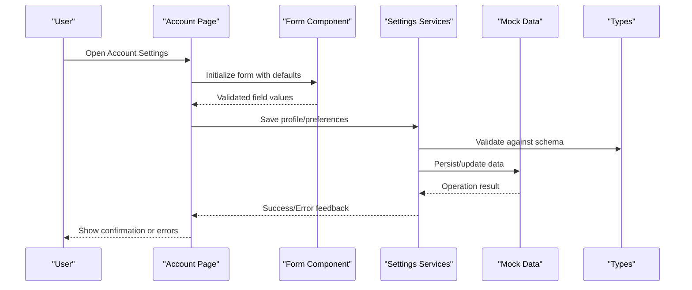
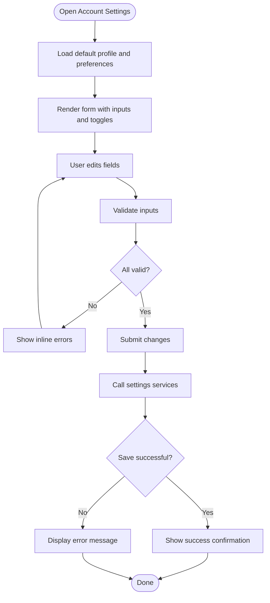
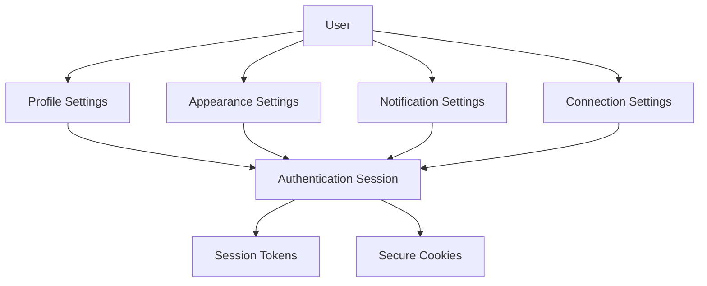
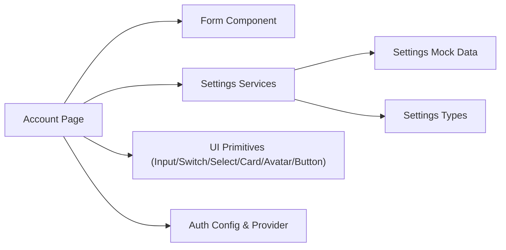
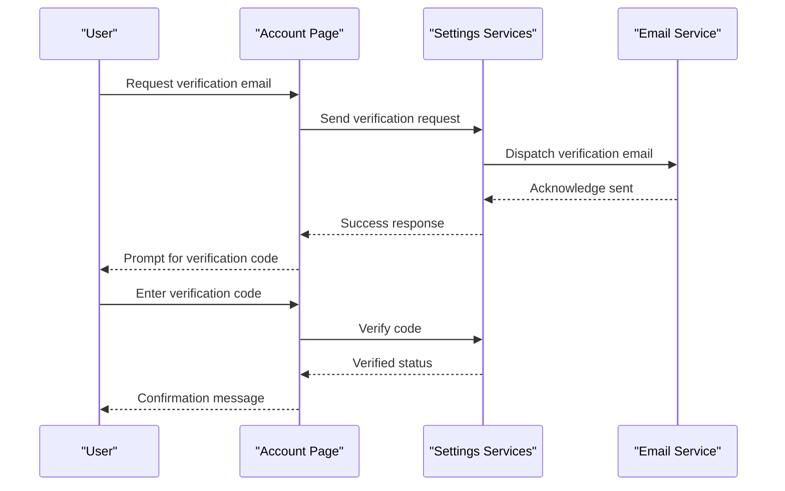

# Account Settings

<cite>
**Referenced Files in This Document**
- [src/app/(private)/settings/account/page.tsx](file://src/app/(private)/settings/account/page.tsx)
- [src/app/(private)/settings/user/page.tsx](file://src/app/(private)/settings/user/page.tsx)
- [src/app/(private)/settings/appearance/page.tsx](file://src/app/(private)/settings/appearance/page.tsx)
- [src/app/(private)/settings/notifications/page.tsx](file://src/app/(private)/settings/notifications/page.tsx)
- [src/app/(private)/settings/connections/page.tsx](file://src/app/(private)/settings/connections/page.tsx)
- [src/modules/settings/services/settings-services.ts](file://src/modules/settings/services/settings-services.ts)
- [src/modules/settings/services/settings-mock-data.ts](file://src/modules/settings/services/settings-mock-data.ts)
- [src/modules/settings/services/types/settings-types.ts](file://src/modules/settings/services/types/settings-types.ts)
- [src/components/ui/form.tsx](file://src/components/ui/form.tsx)
- [src/components/ui/input.tsx](file://src/components/ui/input.tsx)
- [src/components/ui/button.tsx](file://src/components/ui/button.tsx)
- [src/components/ui/switch.tsx](file://src/components/ui/switch.tsx)
- [src/components/ui/select.tsx](file://src/components/ui/select.tsx)
- [src/components/ui/card.tsx](file://src/components/ui/card.tsx)
- [src/components/ui/avatar.tsx](file://src/components/ui/avatar.tsx)
- [src/auth.config.ts](file://src/auth.config.ts)
- [src/auth.ts](file://src/auth.ts)
</cite>

## Table of Contents
1. [Introduction](#introduction)
2. [Project Structure](#project-structure)
3. [Core Components](#core-components)
4. [Architecture Overview](#architecture-overview)
5. [Detailed Component Analysis](#detailed-component-analysis)
6. [Dependency Analysis](#dependency-analysis)
7. [Performance Considerations](#performance-considerations)
8. [Troubleshooting Guide](#troubleshooting-guide)
9. [Conclusion](#conclusion)
10. [Appendices](#appendices)

## Introduction
This document explains the account settings functionality, focusing on user profile management, personal information editing, password changes, and account preferences. It covers form validation, data persistence patterns, and UX considerations. It also provides guidance for extending the system with custom fields, implementing email verification, and managing session security.

## Project Structure
The account settings feature is implemented under the private routes and uses a modular structure:
- Pages define the UI for each settings area (account, user, appearance, notifications, connections).
- A settings module encapsulates services, types, and mock data to support these pages.
- Shared UI components provide consistent forms, inputs, buttons, switches, selects, cards, and avatars.
- Authentication configuration and providers are used for session and identity context.

```mermaid
graph TB
subgraph "Private Routes"
A["Account Page<br/>src/app/(private)/settings/account/page.tsx"]
B["User Page<br/>src/app/(private)/settings/user/page.tsx"]
C["Appearance Page<br/>src/app/(private)/settings/appearance/page.tsx"]
D["Notifications Page<br/>src/app/(private)/settings/notifications/page.tsx"]
E["Connections Page<br/>src/app/(private)/settings/connections/page.tsx"]
end
subgraph "Settings Module"
Svc["Settings Services<br/>src/modules/settings/services/settings-services.ts"]
Mock["Mock Data<br/>src/modules/settings/services/settings-mock-data.ts"]
Types["Types<br/>src/modules/settings/services/types/settings-types.ts"]
end
subgraph "Shared UI"
F["Form<br/>src/components/ui/form.tsx"]
G["Input<br/>src/components/ui/input.tsx"]
H["Button<br/>src/components/ui/button.tsx"]
I["Switch<br/>src/components/ui/switch.tsx"]
J["Select<br/>src/components/ui/select.tsx"]
K["Card<br/>src/components/ui/card.tsx"]
L["Avatar<br/>src/components/ui/avatar.tsx"]
end
subgraph "Auth"
M["Auth Config<br/>src/auth.config.ts"]
N["Auth Provider<br/>src/auth.ts"]
end
A --> Svc
B --> Svc
C --> Svc
D --> Svc
E --> Svc
Svc --> Mock
Svc --> Types
A --> F
A --> G
A --> H
A --> I
A --> J
A --> K
A --> L
B --> F
B --> G
B --> H
B --> I
B --> J
B --> K
B --> L
C --> F
C --> G
C --> H
C --> I
C --> J
C --> K
C --> L
D --> F
D --> G
D --> H
D --> I
D --> J
D --> K
D --> L
E --> F
E --> G
E --> H
E --> I
E --> J
E --> K
E --> L
A --> M
A --> N
B --> M
B --> N
```

**Diagram sources**
- [src/app/(private)/settings/account/page.tsx](file://src/app/(private)/settings/account/page.tsx)
- [src/app/(private)/settings/user/page.tsx](file://src/app/(private)/settings/user/page.tsx)
- [src/app/(private)/settings/appearance/page.tsx](file://src/app/(private)/settings/appearance/page.tsx)
- [src/app/(private)/settings/notifications/page.tsx](file://src/app/(private)/settings/notifications/page.tsx)
- [src/app/(private)/settings/connections/page.tsx](file://src/app/(private)/settings/connections/page.tsx)
- [src/modules/settings/services/settings-services.ts](file://src/modules/settings/services/settings-services.ts)
- [src/modules/settings/services/settings-mock-data.ts](file://src/modules/settings/services/settings-mock-data.ts)
- [src/modules/settings/services/types/settings-types.ts](file://src/modules/settings/services/types/settings-types.ts)
- [src/components/ui/form.tsx](file://src/components/ui/form.tsx)
- [src/components/ui/input.tsx](file://src/components/ui/input.tsx)
- [src/components/ui/button.tsx](file://src/components/ui/button.tsx)
- [src/components/ui/switch.tsx](file://src/components/ui/switch.tsx)
- [src/components/ui/select.tsx](file://src/components/ui/select.tsx)
- [src/components/ui/card.tsx](file://src/components/ui/card.tsx)
- [src/components/ui/avatar.tsx](file://src/components/ui/avatar.tsx)
- [src/auth.config.ts](file://src/auth.config.ts)
- [src/auth.ts](file://src/auth.ts)

**Section sources**
- [src/app/(private)/settings/account/page.tsx](file://src/app/(private)/settings/account/page.tsx)
- [src/app/(private)/settings/user/page.tsx](file://src/app/(private)/settings/user/page.tsx)
- [src/app/(private)/settings/appearance/page.tsx](file://src/app/(private)/settings/appearance/page.tsx)
- [src/app/(private)/settings/notifications/page.tsx](file://src/app/(private)/settings/notifications/page.tsx)
- [src/app/(private)/settings/connections/page.tsx](file://src/app/(private)/settings/connections/page.tsx)
- [src/modules/settings/services/settings-services.ts](file://src/modules/settings/services/settings-services.ts)
- [src/modules/settings/services/settings-mock-data.ts](file://src/modules/settings/services/settings-mock-data.ts)
- [src/modules/settings/services/types/settings-types.ts](file://src/modules/settings/services/types/settings-types.ts)
- [src/components/ui/form.tsx](file://src/components/ui/form.tsx)
- [src/components/ui/input.tsx](file://src/components/ui/input.tsx)
- [src/components/ui/button.tsx](file://src/components/ui/button.tsx)
- [src/components/ui/switch.tsx](file://src/components/ui/switch.tsx)
- [src/components/ui/select.tsx](file://src/components/ui/select.tsx)
- [src/components/ui/card.tsx](file://src/components/ui/card.tsx)
- [src/components/ui/avatar.tsx](file://src/components/ui/avatar.tsx)
- [src/auth.config.ts](file://src/auth.config.ts)
- [src/auth.ts](file://src/auth.ts)

## Core Components
- Account page: Presents profile fields, avatar handling, and preference toggles. Uses shared form primitives and calls settings services to persist changes.
- User page: Focuses on personal information editing and may include role or metadata updates depending on implementation.
- Appearance page: Manages theme and layout preferences via switches and selects.
- Notifications page: Controls notification channels and frequency using toggles and select options.
- Connections page: Integrates external accounts or services; typically includes connect/disconnect flows.

Key responsibilities:
- Form state and validation through the shared form component.
- Input rendering and accessibility via input, switch, select, and card components.
- Avatar display and optional upload flow via avatar component.
- Service layer abstraction for data operations and mock data fallbacks.

**Section sources**
- [src/app/(private)/settings/account/page.tsx](file://src/app/(private)/settings/account/page.tsx)
- [src/app/(private)/settings/user/page.tsx](file://src/app/(private)/settings/user/page.tsx)
- [src/app/(private)/settings/appearance/page.tsx](file://src/app/(private)/settings/appearance/page.tsx)
- [src/app/(private)/settings/notifications/page.tsx](file://src/app/(private)/settings/notifications/page.tsx)
- [src/app/(private)/settings/connections/page.tsx](file://src/app/(private)/settings/connections/page.tsx)
- [src/modules/settings/services/settings-services.ts](file://src/modules/settings/services/settings-services.ts)
- [src/modules/settings/services/settings-mock-data.ts](file://src/modules/settings/services/settings-mock-data.ts)
- [src/modules/settings/services/types/settings-types.ts](file://src/modules/settings/services/types/settings-types.ts)
- [src/components/ui/form.tsx](file://src/components/ui/form.tsx)
- [src/components/ui/input.tsx](file://src/components/ui/input.tsx)
- [src/components/ui/button.tsx](file://src/components/ui/button.tsx)
- [src/components/ui/switch.tsx](file://src/components/ui/switch.tsx)
- [src/components/ui/select.tsx](file://src/components/ui/select.tsx)
- [src/components/ui/card.tsx](file://src/components/ui/card.tsx)
- [src/components/ui/avatar.tsx](file://src/components/ui/avatar.tsx)

## Architecture Overview
The account settings architecture separates concerns across pages, services, and UI primitives:
- Pages orchestrate user interactions and render forms.
- Services encapsulate data operations and abstract storage or API calls.
- UI components ensure consistency and accessibility.
- Auth modules provide session context and configuration.

**Diagram sources**
- [src/app/(private)/settings/account/page.tsx](file://src/app/(private)/settings/account/page.tsx)
- [src/components/ui/form.tsx](file://src/components/ui/form.tsx)
- [src/modules/settings/services/settings-services.ts](file://src/modules/settings/services/settings-services.ts)
- [src/modules/settings/services/settings-mock-data.ts](file://src/modules/settings/services/settings-mock-data.ts)
- [src/modules/settings/services/types/settings-types.ts](file://src/modules/settings/services/types/settings-types.ts)

## Detailed Component Analysis

### Account Page
Responsibilities:
- Display and edit core profile fields (e.g., name, email, avatar).
- Manage account preferences (e.g., language, timezone, visibility).
- Provide immediate feedback on save actions.

Implementation highlights:
- Uses the shared form component to manage state and validation.
- Renders inputs, switches, and selects for different preference types.
- Calls settings services to persist changes and handles success/error states.

UX patterns:
- Inline validation messages near fields.
- Clear success banners or toast-like confirmations after saving.
- Disabled submit while saving to prevent duplicate submissions.

**Diagram sources**
- [src/app/(private)/settings/account/page.tsx](file://src/app/(private)/settings/account/page.tsx)
- [src/components/ui/form.tsx](file://src/components/ui/form.tsx)
- [src/modules/settings/services/settings-services.ts](file://src/modules/settings/services/settings-services.ts)

**Section sources**
- [src/app/(private)/settings/account/page.tsx](file://src/app/(private)/settings/account/page.tsx)
- [src/components/ui/form.tsx](file://src/components/ui/form.tsx)
- [src/modules/settings/services/settings-services.ts](file://src/modules/settings/services/settings-services.ts)

### User Page
Responsibilities:
- Edit personal information beyond basic profile fields.
- Potentially manage roles or metadata if applicable.

Implementation highlights:
- Reuses shared form and input components for consistency.
- May integrate with user-specific services or endpoints.

UX patterns:
- Group related fields into sections.
- Provide contextual help text where needed.

**Section sources**
- [src/app/(private)/settings/user/page.tsx](file://src/app/(private)/settings/user/page.tsx)
- [src/components/ui/form.tsx](file://src/components/ui/form.tsx)
- [src/components/ui/input.tsx](file://src/components/ui/input.tsx)

### Appearance Page
Responsibilities:
- Control theme and layout preferences.
- Apply changes immediately or upon confirmation.

Implementation highlights:
- Uses switches and selects to toggle options.
- Persists preferences via settings services.

UX patterns:
- Live preview when possible.
- Clear labels and tooltips for complex options.

**Section sources**
- [src/app/(private)/settings/appearance/page.tsx](file://src/app/(private)/settings/appearance/page.tsx)
- [src/components/ui/switch.tsx](file://src/components/ui/switch.tsx)
- [src/components/ui/select.tsx](file://src/components/ui/select.tsx)
- [src/modules/settings/services/settings-services.ts](file://src/modules/settings/services/settings-services.ts)

### Notifications Page
Responsibilities:
- Configure notification channels and frequencies.
- Respect user privacy and consent.

Implementation highlights:
- Toggle-based controls for enabling/disabling channels.
- Select-based controls for frequency or digest settings.

UX patterns:
- Summarize impact of changes (e.g., “You will receive daily digests”).
- Provide quick reset to defaults.

**Section sources**
- [src/app/(private)/settings/notifications/page.tsx](file://src/app/(private)/settings/notifications/page.tsx)
- [src/components/ui/switch.tsx](file://src/components/ui/switch.tsx)
- [src/components/ui/select.tsx](file://src/components/ui/select.tsx)
- [src/modules/settings/services/settings-services.ts](file://src/modules/settings/services/settings-services.ts)

### Connections Page
Responsibilities:
- Manage third-party integrations and linked accounts.
- Support connect, disconnect, and re-authenticate flows.

Implementation highlights:
- Uses buttons and dialogs for connection actions.
- Handles success and error states for OAuth or API integrations.

UX patterns:
- Clear status indicators for connected/disconnected states.
- Warning prompts before disconnecting critical services.

**Section sources**
- [src/app/(private)/settings/connections/page.tsx](file://src/app/(private)/settings/connections/page.tsx)
- [src/components/ui/button.tsx](file://src/components/ui/button.tsx)
- [src/modules/settings/services/settings-services.ts](file://src/modules/settings/services/settings-services.ts)

### Conceptual Overview
The following conceptual diagram illustrates how account settings interact with authentication and session management without mapping to specific files.

[No sources needed since this diagram shows conceptual workflow, not actual code structure]

## Dependency Analysis
The account settings feature depends on shared UI components and the settings service layer. The service layer references types and mock data to support development and testing.

**Diagram sources**
- [src/app/(private)/settings/account/page.tsx](file://src/app/(private)/settings/account/page.tsx)
- [src/components/ui/form.tsx](file://src/components/ui/form.tsx)
- [src/modules/settings/services/settings-services.ts](file://src/modules/settings/services/settings-services.ts)
- [src/modules/settings/services/settings-mock-data.ts](file://src/modules/settings/services/settings-mock-data.ts)
- [src/modules/settings/services/types/settings-types.ts](file://src/modules/settings/services/types/settings-types.ts)
- [src/components/ui/input.tsx](file://src/components/ui/input.tsx)
- [src/components/ui/switch.tsx](file://src/components/ui/switch.tsx)
- [src/components/ui/select.tsx](file://src/components/ui/select.tsx)
- [src/components/ui/card.tsx](file://src/components/ui/card.tsx)
- [src/components/ui/avatar.tsx](file://src/components/ui/avatar.tsx)
- [src/components/ui/button.tsx](file://src/components/ui/button.tsx)
- [src/auth.config.ts](file://src/auth.config.ts)
- [src/auth.ts](file://src/auth.ts)

**Section sources**
- [src/app/(private)/settings/account/page.tsx](file://src/app/(private)/settings/account/page.tsx)
- [src/components/ui/form.tsx](file://src/components/ui/form.tsx)
- [src/modules/settings/services/settings-services.ts](file://src/modules/settings/services/settings-services.ts)
- [src/modules/settings/services/settings-mock-data.ts](file://src/modules/settings/services/settings-mock-data.ts)
- [src/modules/settings/services/types/settings-types.ts](file://src/modules/settings/services/types/settings-types.ts)
- [src/components/ui/input.tsx](file://src/components/ui/input.tsx)
- [src/components/ui/switch.tsx](file://src/components/ui/switch.tsx)
- [src/components/ui/select.tsx](file://src/components/ui/select.tsx)
- [src/components/ui/card.tsx](file://src/components/ui/card.tsx)
- [src/components/ui/avatar.tsx](file://src/components/ui/avatar.tsx)
- [src/components/ui/button.tsx](file://src/components/ui/button.tsx)
- [src/auth.config.ts](file://src/auth.config.ts)
- [src/auth.ts](file://src/auth.ts)

## Performance Considerations
- Debounce heavy validations to avoid excessive re-renders.
- Use optimistic UI updates for non-critical preferences and roll back on failure.
- Cache frequently accessed preferences locally to reduce service calls.
- Avoid unnecessary re-renders by memoizing derived values and splitting large forms into smaller components.

[No sources needed since this section provides general guidance]

## Troubleshooting Guide
Common issues and resolutions:
- Validation errors not showing: Ensure form component is wired to inputs and that validation rules are defined.
- Save failures: Check service layer error handling and network responses; verify mock data availability during development.
- Session-related problems: Review auth configuration and provider setup; ensure tokens and cookies are correctly managed.

Operational tips:
- Log request payloads and responses in development to diagnose persistence issues.
- Use clear error messages and actionable steps for users.
- Test edge cases like empty fields, special characters, and long inputs.

**Section sources**
- [src/components/ui/form.tsx](file://src/components/ui/form.tsx)
- [src/modules/settings/services/settings-services.ts](file://src/modules/settings/services/settings-services.ts)
- [src/auth.config.ts](file://src/auth.config.ts)
- [src/auth.ts](file://src/auth.ts)

## Conclusion
The account settings feature provides a cohesive experience for managing profiles, personal information, preferences, and integrations. By leveraging shared UI components and a modular service layer, it ensures consistency, maintainability, and extensibility. Following the recommended UX patterns and performance practices will improve reliability and user satisfaction.

[No sources needed since this section summarizes without analyzing specific files]

## Appendices

### Extending Account Settings with Custom Fields
Steps:
- Define new fields in the settings types to enforce schema consistency.
- Add corresponding inputs in the relevant settings page(s).
- Update the form validation rules to handle new fields.
- Extend the settings services to persist new fields.
- Wire up UI feedback for success and error states.

**Section sources**
- [src/modules/settings/services/types/settings-types.ts](file://src/modules/settings/services/types/settings-types.ts)
- [src/app/(private)/settings/account/page.tsx](file://src/app/(private)/settings/account/page.tsx)
- [src/components/ui/form.tsx](file://src/components/ui/form.tsx)
- [src/modules/settings/services/settings-services.ts](file://src/modules/settings/services/settings-services.ts)

### Implementing Email Verification
Conceptual flow:
- Trigger send verification email action from account settings.
- Display progress indicator while sending.
- On success, prompt user to check inbox and enter verification code.
- Validate code and update email verified status.
- Provide retry and resend options with rate limiting.

[No sources needed since this diagram shows conceptual workflow, not actual code structure]

### Managing User Session Security
Recommendations:
- Enforce secure cookie flags and same-site policies.
- Rotate tokens on sensitive actions (e.g., password change).
- Invalidate sessions on logout and after extended inactivity.
- Require re-authentication for high-risk settings changes.

**Section sources**
- [src/auth.config.ts](file://src/auth.config.ts)
- [src/auth.ts](file://src/auth.ts)