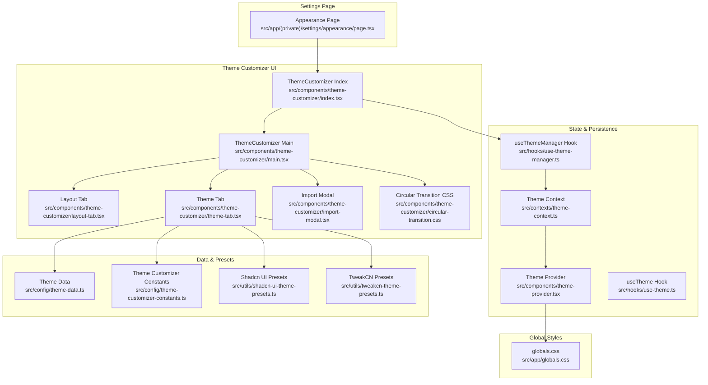
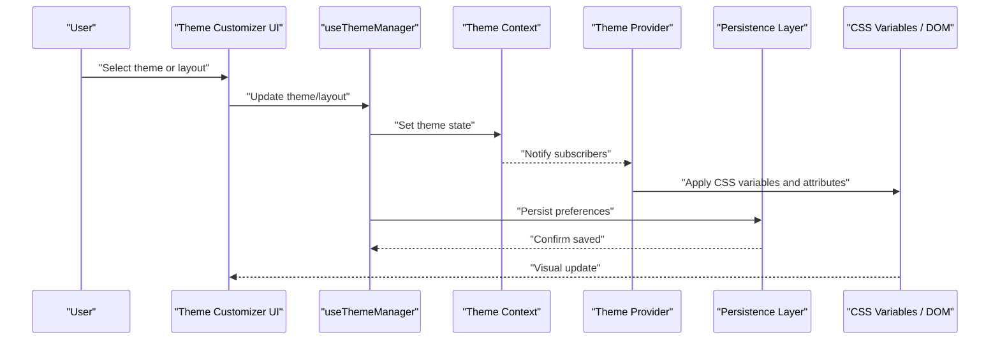
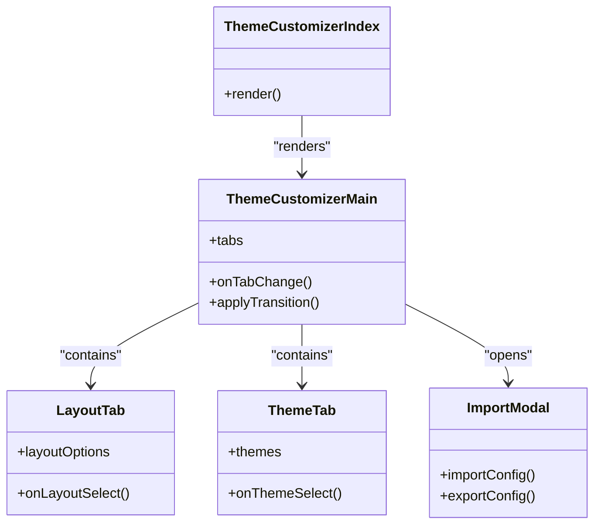
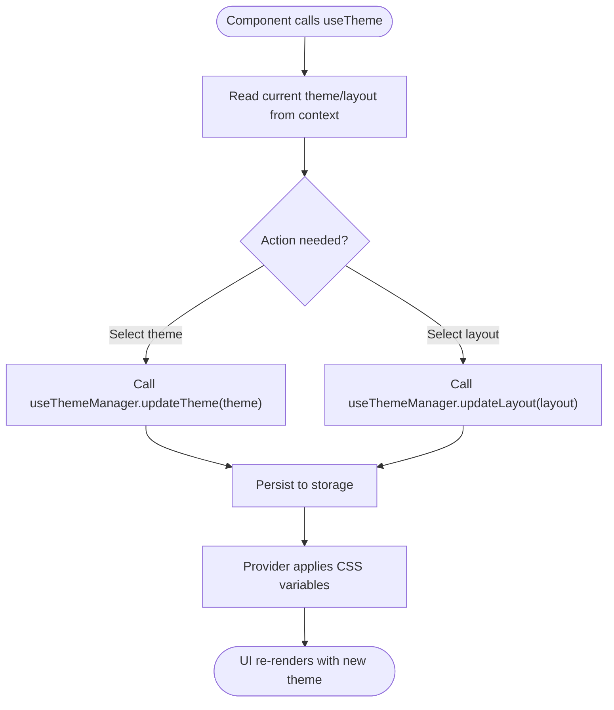
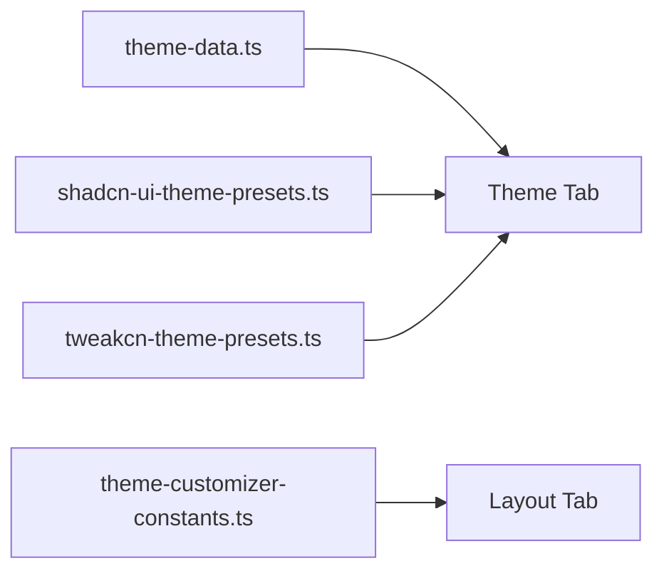
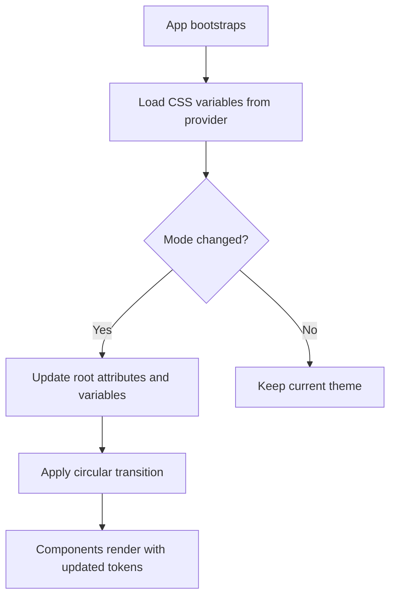
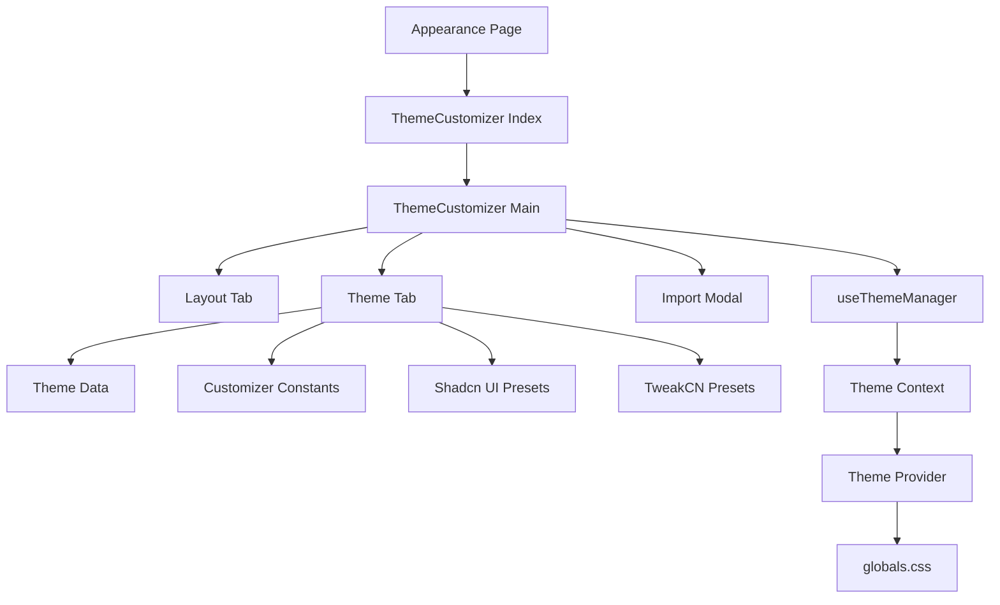

# Appearance Settings

<cite>
**Referenced Files in This Document**
- [src/app/(private)/settings/appearance/page.tsx](file://src/app/(private)/settings/appearance/page.tsx)
- [src/components/theme-customizer/index.tsx](file://src/components/theme-customizer/index.tsx)
- [src/components/theme-customizer/main.tsx](file://src/components/theme-customizer/main.tsx)
- [src/components/theme-customizer/layout-tab.tsx](file://src/components/theme-customizer/layout-tab.tsx)
- [src/components/theme-customizer/theme-tab.tsx](file://src/components/theme-customizer/theme-tab.tsx)
- [src/components/theme-customizer/import-modal.tsx](file://src/components/theme-customizer/import-modal.tsx)
- [src/components/theme-customizer/circular-transition.css](file://src/components/theme-customizer/circular-transition.css)
- [src/config/theme-data.ts](file://src/config/theme-data.ts)
- [src/config/theme-customizer-constants.ts](file://src/config/theme-customizer-constants.ts)
- [src/contexts/theme-context.ts](file://src/contexts/theme-context.ts)
- [src/hooks/use-theme-manager.ts](file://src/hooks/use-theme-manager.ts)
- [src/hooks/use-theme.ts](file://src/hooks/use-theme.ts)
- [src/types/theme-customizer.ts](file://src/types/theme-customizer.ts)
- [src/types/theme.ts](file://src/types/theme.ts)
- [src/utils/shadcn-ui-theme-presets.ts](file://src/utils/shadcn-ui-theme-presets.ts)
- [src/utils/tweakcn-theme-presets.ts](file://src/utils/tweakcn-theme-presets.ts)
- [src/components/mode-toggle.tsx](file://src/components/mode-toggle.tsx)
- [src/components/theme-provider.tsx](file://src/components/theme-provider.tsx)
- [src/app/globals.css](file://src/app/globals.css)
</cite>

## Table of Contents
1. [Introduction](#introduction)
2. [Project Structure](#project-structure)
3. [Core Components](#core-components)
4. [Architecture Overview](#architecture-overview)
5. [Detailed Component Analysis](#detailed-component-analysis)
6. [Dependency Analysis](#dependency-analysis)
7. [Performance Considerations](#performance-considerations)
8. [Troubleshooting Guide](#troubleshooting-guide)
9. [Conclusion](#conclusion)
10. [Appendices](#appendices)

## Introduction
This document explains the appearance and theme customization system, including how themes are defined, applied, persisted, and extended. It covers color palette management, layout options, visual preferences, responsive behavior, and accessibility considerations. You will learn how to add new themes, implement custom color schemes, and persist user appearance preferences across sessions.

## Project Structure
The appearance system is implemented as a combination of:
- A settings page that hosts the theme customizer UI
- A theme provider and context for global state
- Hooks for reading and updating theme state
- Theme data and constants for presets and configuration
- Utility presets for Shadcn UI and TweakCN integration
- CSS variables and transitions for smooth updates

**Diagram sources**
- [src/app/(private)/settings/appearance/page.tsx](file://src/app/(private)/settings/appearance/page.tsx)
- [src/components/theme-customizer/index.tsx](file://src/components/theme-customizer/index.tsx)
- [src/components/theme-customizer/main.tsx](file://src/components/theme-customizer/main.tsx)
- [src/components/theme-customizer/layout-tab.tsx](file://src/components/theme-customizer/layout-tab.tsx)
- [src/components/theme-customizer/theme-tab.tsx](file://src/components/theme-customizer/theme-tab.tsx)
- [src/components/theme-customizer/import-modal.tsx](file://src/components/theme-customizer/import-modal.tsx)
- [src/components/theme-customizer/circular-transition.css](file://src/components/theme-customizer/circular-transition.css)
- [src/contexts/theme-context.ts](file://src/contexts/theme-context.ts)
- [src/hooks/use-theme-manager.ts](file://src/hooks/use-theme-manager.ts)
- [src/hooks/use-theme.ts](file://src/hooks/use-theme.ts)
- [src/components/theme-provider.tsx](file://src/components/theme-provider.tsx)
- [src/config/theme-data.ts](file://src/config/theme-data.ts)
- [src/config/theme-customizer-constants.ts](file://src/config/theme-customizer-constants.ts)
- [src/utils/shadcn-ui-theme-presets.ts](file://src/utils/shadcn-ui-theme-presets.ts)
- [src/utils/tweakcn-theme-presets.ts](file://src/utils/tweakcn-theme-presets.ts)
- [src/app/globals.css](file://src/app/globals.css)

**Section sources**
- [src/app/(private)/settings/appearance/page.tsx](file://src/app/(private)/settings/appearance/page.tsx)
- [src/components/theme-customizer/index.tsx](file://src/components/theme-customizer/index.tsx)
- [src/components/theme-customizer/main.tsx](file://src/components/theme-customizer/main.tsx)
- [src/components/theme-customizer/layout-tab.tsx](file://src/components/theme-customizer/layout-tab.tsx)
- [src/components/theme-customizer/theme-tab.tsx](file://src/components/theme-customizer/theme-tab.tsx)
- [src/components/theme-customizer/import-modal.tsx](file://src/components/theme-customizer/import-modal.tsx)
- [src/components/theme-customizer/circular-transition.css](file://src/components/theme-customizer/circular-transition.css)
- [src/contexts/theme-context.ts](file://src/contexts/theme-context.ts)
- [src/hooks/use-theme-manager.ts](file://src/hooks/use-theme-manager.ts)
- [src/hooks/use-theme.ts](file://src/hooks/use-theme.ts)
- [src/components/theme-provider.tsx](file://src/components/theme-provider.tsx)
- [src/config/theme-data.ts](file://src/config/theme-data.ts)
- [src/config/theme-customizer-constants.ts](file://src/config/theme-customizer-constants.ts)
- [src/utils/shadcn-ui-theme-presets.ts](file://src/utils/shadcn-ui-theme-presets.ts)
- [src/utils/tweakcn-theme-presets.ts](file://src/utils/tweakcn-theme-presets.ts)
- [src/app/globals.css](file://src/app/globals.css)

## Core Components
- Appearance Page: Hosts the theme customizer within the private settings area.
- Theme Customizer: Provides tabs for layout and theme selection, import/export functionality, and transition effects.
- Theme Provider and Context: Supplies theme state and setters globally.
- Hooks: Encapsulate reading and writing theme state with persistence logic.
- Theme Data and Constants: Define available themes, colors, and layout options.
- Presets: Provide ready-to-use configurations for Shadcn UI and TweakCN.
- Global Styles: Apply CSS variables and transitions for consistent theming.

Key responsibilities:
- Centralized state via context and hooks
- Declarative UI for selecting themes and layouts
- Persisted preferences using local storage or equivalent
- Smooth transitions and responsive behavior
- Accessibility-friendly controls (keyboard navigation, contrast)

**Section sources**
- [src/app/(private)/settings/appearance/page.tsx](file://src/app/(private)/settings/appearance/page.tsx)
- [src/components/theme-customizer/index.tsx](file://src/components/theme-customizer/index.tsx)
- [src/components/theme-customizer/main.tsx](file://src/components/theme-customizer/main.tsx)
- [src/components/theme-customizer/layout-tab.tsx](file://src/components/theme-customizer/layout-tab.tsx)
- [src/components/theme-customizer/theme-tab.tsx](file://src/components/theme-customizer/theme-tab.tsx)
- [src/components/theme-customizer/import-modal.tsx](file://src/components/theme-customizer/import-modal.tsx)
- [src/contexts/theme-context.ts](file://src/contexts/theme-context.ts)
- [src/hooks/use-theme-manager.ts](file://src/hooks/use-theme-manager.ts)
- [src/hooks/use-theme.ts](file://src/hooks/use-theme.ts)
- [src/components/theme-provider.tsx](file://src/components/theme-provider.tsx)
- [src/config/theme-data.ts](file://src/config/theme-data.ts)
- [src/config/theme-customizer-constants.ts](file://src/config/theme-customizer-constants.ts)
- [src/utils/shadcn-ui-theme-presets.ts](file://src/utils/shadcn-ui-theme-presets.ts)
- [src/utils/tweakcn-theme-presets.ts](file://src/utils/tweakcn-theme-presets.ts)
- [src/app/globals.css](file://src/app/globals.css)

## Architecture Overview
The theme system follows a unidirectional data flow:
- UI components dispatch actions through the theme manager hook
- The hook updates the theme context
- The provider applies changes to CSS variables and DOM attributes
- Preferences are persisted to storage
- Global styles consume CSS variables for rendering

**Diagram sources**
- [src/components/theme-customizer/index.tsx](file://src/components/theme-customizer/index.tsx)
- [src/components/theme-customizer/main.tsx](file://src/components/theme-customizer/main.tsx)
- [src/hooks/use-theme-manager.ts](file://src/hooks/use-theme-manager.ts)
- [src/contexts/theme-context.ts](file://src/contexts/theme-context.ts)
- [src/components/theme-provider.tsx](file://src/components/theme-provider.tsx)
- [src/app/globals.css](file://src/app/globals.css)

## Detailed Component Analysis

### Theme Customizer UI
The customizer exposes:
- Layout tab for structural options
- Theme tab for color scheme selection
- Import modal for importing/exporting configurations
- Circular transition effect for smooth switching

**Diagram sources**
- [src/components/theme-customizer/index.tsx](file://src/components/theme-customizer/index.tsx)
- [src/components/theme-customizer/main.tsx](file://src/components/theme-customizer/main.tsx)
- [src/components/theme-customizer/layout-tab.tsx](file://src/components/theme-customizer/layout-tab.tsx)
- [src/components/theme-customizer/theme-tab.tsx](file://src/components/theme-customizer/theme-tab.tsx)
- [src/components/theme-customizer/import-modal.tsx](file://src/components/theme-customizer/import-modal.tsx)

**Section sources**
- [src/components/theme-customizer/index.tsx](file://src/components/theme-customizer/index.tsx)
- [src/components/theme-customizer/main.tsx](file://src/components/theme-customizer/main.tsx)
- [src/components/theme-customizer/layout-tab.tsx](file://src/components/theme-customizer/layout-tab.tsx)
- [src/components/theme-customizer/theme-tab.tsx](file://src/components/theme-customizer/theme-tab.tsx)
- [src/components/theme-customizer/import-modal.tsx](file://src/components/theme-customizer/import-modal.tsx)
- [src/components/theme-customizer/circular-transition.css](file://src/components/theme-customizer/circular-transition.css)

### Theme State Management
The state layer provides:
- Current theme and layout values
- Setters to update theme and layout
- Persistence integration
- Accessor hooks for components

**Diagram sources**
- [src/hooks/use-theme.ts](file://src/hooks/use-theme.ts)
- [src/hooks/use-theme-manager.ts](file://src/hooks/use-theme-manager.ts)
- [src/contexts/theme-context.ts](file://src/contexts/theme-context.ts)
- [src/components/theme-provider.tsx](file://src/components/theme-provider.tsx)

**Section sources**
- [src/hooks/use-theme.ts](file://src/hooks/use-theme.ts)
- [src/hooks/use-theme-manager.ts](file://src/hooks/use-theme-manager.ts)
- [src/contexts/theme-context.ts](file://src/contexts/theme-context.ts)
- [src/components/theme-provider.tsx](file://src/components/theme-provider.tsx)

### Theme Data and Presets
- Theme Data: Defines available themes and their properties
- Constants: Configuration for the customizer UI (e.g., layout options)
- Presets: Ready-made configurations for Shadcn UI and TweakCN

**Diagram sources**
- [src/config/theme-data.ts](file://src/config/theme-data.ts)
- [src/config/theme-customizer-constants.ts](file://src/config/theme-customizer-constants.ts)
- [src/utils/shadcn-ui-theme-presets.ts](file://src/utils/shadcn-ui-theme-presets.ts)
- [src/utils/tweakcn-theme-presets.ts](file://src/utils/tweakcn-theme-presets.ts)
- [src/components/theme-customizer/theme-tab.tsx](file://src/components/theme-customizer/theme-tab.tsx)
- [src/components/theme-customizer/layout-tab.tsx](file://src/components/theme-customizer/layout-tab.tsx)

**Section sources**
- [src/config/theme-data.ts](file://src/config/theme-data.ts)
- [src/config/theme-customizer-constants.ts](file://src/config/theme-customizer-constants.ts)
- [src/utils/shadcn-ui-theme-presets.ts](file://src/utils/shadcn-ui-theme-presets.ts)
- [src/utils/tweakcn-theme-presets.ts](file://src/utils/tweakcn-theme-presets.ts)
- [src/components/theme-customizer/theme-tab.tsx](file://src/components/theme-customizer/theme-tab.tsx)
- [src/components/theme-customizer/layout-tab.tsx](file://src/components/theme-customizer/layout-tab.tsx)

### Global Styles and Transitions
- CSS variables define semantic tokens consumed by components
- Transitions ensure smooth theme switches
- Dark/light mode toggles update root attributes

**Diagram sources**
- [src/components/theme-provider.tsx](file://src/components/theme-provider.tsx)
- [src/app/globals.css](file://src/app/globals.css)
- [src/components/theme-customizer/circular-transition.css](file://src/components/theme-customizer/circular-transition.css)
- [src/components/mode-toggle.tsx](file://src/components/mode-toggle.tsx)

**Section sources**
- [src/components/theme-provider.tsx](file://src/components/theme-provider.tsx)
- [src/app/globals.css](file://src/app/globals.css)
- [src/components/theme-customizer/circular-transition.css](file://src/components/theme-customizer/circular-transition.css)
- [src/components/mode-toggle.tsx](file://src/components/mode-toggle.tsx)

## Dependency Analysis
The following diagram shows key dependencies among theme-related modules:

**Diagram sources**
- [src/app/(private)/settings/appearance/page.tsx](file://src/app/(private)/settings/appearance/page.tsx)
- [src/components/theme-customizer/index.tsx](file://src/components/theme-customizer/index.tsx)
- [src/components/theme-customizer/main.tsx](file://src/components/theme-customizer/main.tsx)
- [src/components/theme-customizer/layout-tab.tsx](file://src/components/theme-customizer/layout-tab.tsx)
- [src/components/theme-customizer/theme-tab.tsx](file://src/components/theme-customizer/theme-tab.tsx)
- [src/components/theme-customizer/import-modal.tsx](file://src/components/theme-customizer/import-modal.tsx)
- [src/config/theme-data.ts](file://src/config/theme-data.ts)
- [src/config/theme-customizer-constants.ts](file://src/config/theme-customizer-constants.ts)
- [src/utils/shadcn-ui-theme-presets.ts](file://src/utils/shadcn-ui-theme-presets.ts)
- [src/utils/tweakcn-theme-presets.ts](file://src/utils/tweakcn-theme-presets.ts)
- [src/hooks/use-theme-manager.ts](file://src/hooks/use-theme-manager.ts)
- [src/contexts/theme-context.ts](file://src/contexts/theme-context.ts)
- [src/components/theme-provider.tsx](file://src/components/theme-provider.tsx)
- [src/app/globals.css](file://src/app/globals.css)

**Section sources**
- [src/app/(private)/settings/appearance/page.tsx](file://src/app/(private)/settings/appearance/page.tsx)
- [src/components/theme-customizer/index.tsx](file://src/components/theme-customizer/index.tsx)
- [src/components/theme-customizer/main.tsx](file://src/components/theme-customizer/main.tsx)
- [src/components/theme-customizer/layout-tab.tsx](file://src/components/theme-customizer/layout-tab.tsx)
- [src/components/theme-customizer/theme-tab.tsx](file://src/components/theme-customizer/theme-tab.tsx)
- [src/components/theme-customizer/import-modal.tsx](file://src/components/theme-customizer/import-modal.tsx)
- [src/config/theme-data.ts](file://src/config/theme-data.ts)
- [src/config/theme-customizer-constants.ts](file://src/config/theme-customizer-constants.ts)
- [src/utils/shadcn-ui-theme-presets.ts](file://src/utils/shadcn-ui-theme-presets.ts)
- [src/utils/tweakcn-theme-presets.ts](file://src/utils/tweakcn-theme-presets.ts)
- [src/hooks/use-theme-manager.ts](file://src/hooks/use-theme-manager.ts)
- [src/contexts/theme-context.ts](file://src/contexts/theme-context.ts)
- [src/components/theme-provider.tsx](file://src/components/theme-provider.tsx)
- [src/app/globals.css](file://src/app/globals.css)

## Performance Considerations
- Prefer CSS variable updates over heavy reflows; apply minimal attribute changes at the root level.
- Debounce rapid theme changes if necessary to avoid excessive re-renders.
- Keep preset definitions lightweight and memoize derived values where appropriate.
- Use transitions sparingly on large pages to reduce jank.
- Ensure lazy loading of non-critical theme assets if applicable.

[No sources needed since this section provides general guidance]

## Troubleshooting Guide
Common issues and resolutions:
- Theme not applying immediately: Verify provider initialization order and that CSS variables are set before component renders.
- Persistence failures: Check storage availability and error handling in the theme manager hook.
- Inconsistent colors across components: Confirm all components consume semantic tokens rather than hardcoded values.
- Accessibility regressions: Validate contrast ratios after adding new themes; ensure keyboard navigation works in the customizer.

**Section sources**
- [src/hooks/use-theme-manager.ts](file://src/hooks/use-theme-manager.ts)
- [src/contexts/theme-context.ts](file://src/contexts/theme-context.ts)
- [src/components/theme-provider.tsx](file://src/components/theme-provider.tsx)
- [src/app/globals.css](file://src/app/globals.css)

## Conclusion
The appearance system offers a robust, extensible foundation for theme customization. By centralizing state, leveraging CSS variables, and providing clear extension points, it supports both built-in presets and custom schemes. With thoughtful attention to persistence, responsiveness, and accessibility, teams can deliver a polished and inclusive user experience.

[No sources needed since this section summarizes without analyzing specific files]

## Appendices

### How to Add a New Theme
Steps:
- Define the theme metadata and color tokens in the theme data file.
- If integrating with Shadcn UI or TweakCN, add corresponding entries in the respective presets files.
- Expose the theme in the theme tab so users can select it.
- Test contrast and accessibility across components.
- Persist and verify the theme survives reloads.

**Section sources**
- [src/config/theme-data.ts](file://src/config/theme-data.ts)
- [src/utils/shadcn-ui-theme-presets.ts](file://src/utils/shadcn-ui-theme-presets.ts)
- [src/utils/tweakcn-theme-presets.ts](file://src/utils/tweakcn-theme-presets.ts)
- [src/components/theme-customizer/theme-tab.tsx](file://src/components/theme-customizer/theme-tab.tsx)

### Implementing a Custom Color Scheme
Guidelines:
- Use semantic tokens mapped to CSS variables.
- Maintain sufficient contrast for text and interactive elements.
- Provide light and dark variants where applicable.
- Validate with automated contrast checks and manual review.

**Section sources**
- [src/app/globals.css](file://src/app/globals.css)
- [src/components/theme-provider.tsx](file://src/components/theme-provider.tsx)

### Persisting User Appearance Preferences
Approach:
- Save selected theme and layout to persistent storage via the theme manager hook.
- On app bootstrap, read stored preferences and apply them before first paint.
- Handle errors gracefully if storage is unavailable.

**Section sources**
- [src/hooks/use-theme-manager.ts](file://src/hooks/use-theme-manager.ts)
- [src/contexts/theme-context.ts](file://src/contexts/theme-context.ts)
- [src/components/theme-provider.tsx](file://src/components/theme-provider.tsx)

### Responsive Design Considerations
Recommendations:
- Ensure layout options adapt to mobile and desktop breakpoints.
- Avoid overly dense color palettes on small screens.
- Test customizer interactions on touch devices.

**Section sources**
- [src/components/theme-customizer/layout-tab.tsx](file://src/components/theme-customizer/layout-tab.tsx)
- [src/components/theme-customizer/main.tsx](file://src/components/theme-customizer/main.tsx)

### Accessibility Compliance
Best practices:
- Provide high-contrast themes and validate against WCAG guidelines.
- Ensure all customizer controls are keyboard accessible and have proper labels.
- Respect reduced motion preferences when applying transitions.

**Section sources**
- [src/components/theme-customizer/circular-transition.css](file://src/components/theme-customizer/circular-transition.css)
- [src/components/theme-customizer/theme-tab.tsx](file://src/components/theme-customizer/theme-tab.tsx)
- [src/components/theme-customizer/layout-tab.tsx](file://src/components/theme-customizer/layout-tab.tsx)