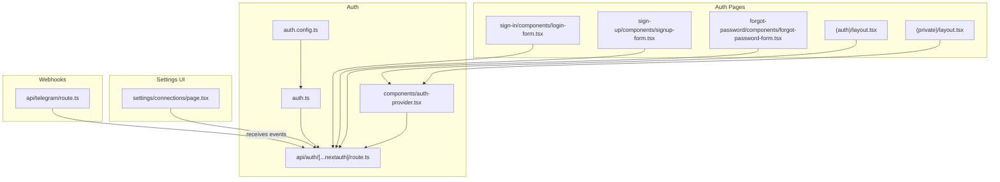
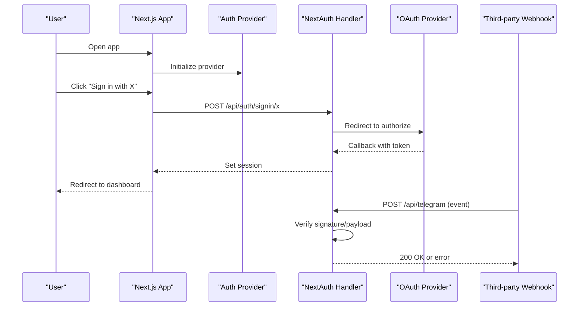
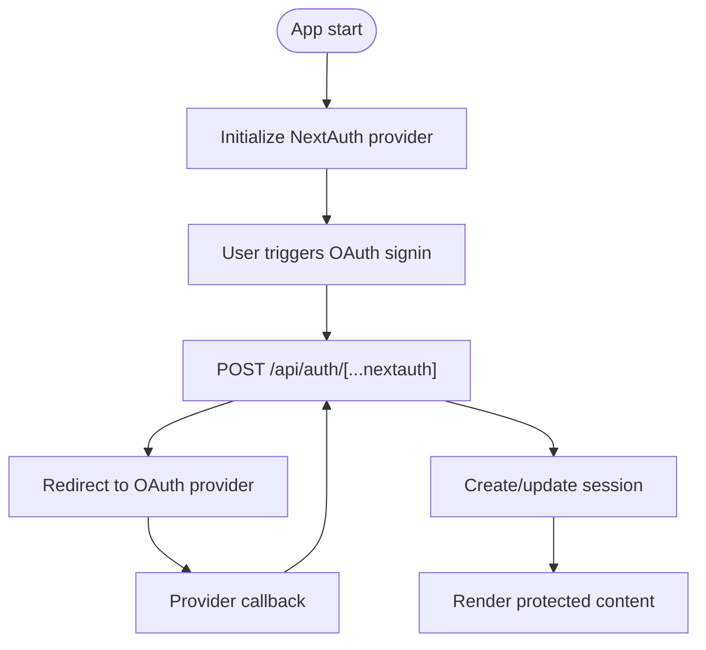
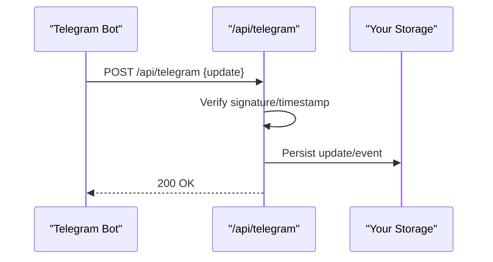
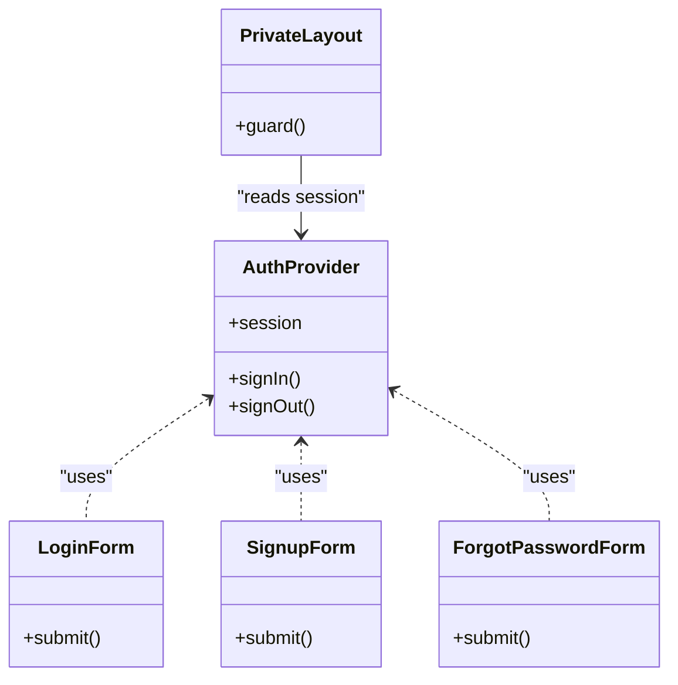
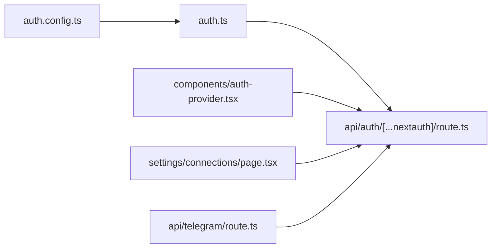

# Connections & Integrations

<cite>
**Referenced Files in This Document**
- [auth.config.ts](file://src/auth.config.ts)
- [auth.ts](file://src/auth.ts)
- [route.ts](file://src/app/api/auth/[...nextauth]/route.ts)
- [page.tsx](file://src/app/(private)/settings/connections/page.tsx)
- [route.ts](file://src/app/api/telegram/route.ts)
- [auth-provider.tsx](file://src/components/auth-provider.tsx)
- [login-form.tsx](file://src/app/(auth)/sign-in/components/login-form.tsx)
- [signup-form.tsx](file://src/app/(auth)/sign-up/components/signup-form.tsx)
- [forgot-password-form.tsx](file://src/app/(auth)/forgot-password/components/forgot-password-form.tsx)
- [layout.tsx](file://src/app/(auth)/layout.tsx)
- [layout.tsx](file://src/app/(private)/layout.tsx)
- [auth.d.ts](file://src/types/next-auth.d.ts)
</cite>

## Table of Contents
1. [Introduction](#introduction)
2. [Project Structure](#project-structure)
3. [Core Components](#core-components)
4. [Architecture Overview](#architecture-overview)
5. [Detailed Component Analysis](#detailed-component-analysis)
6. [Dependency Analysis](#dependency-analysis)
7. [Performance Considerations](#performance-considerations)
8. [Troubleshooting Guide](#troubleshooting-guide)
9. [Conclusion](#conclusion)
10. [Appendices](#appendices)

## Introduction
This document explains how external connections and third-party integrations are configured and used in the application, with a focus on:
- OAuth provider configuration and session handling
- API key management for service authorization
- Webhook setup and processing
- Service authorization flows
- Adding new integrations, testing connections, and managing connection lifecycle
- Security considerations for credential storage and validation

The goal is to provide both high-level guidance and code-level references so that developers can implement secure, maintainable integrations.

## Project Structure
External connections and integrations span authentication configuration, API routes, settings UI, and webhook endpoints. The following diagram maps these areas to actual files.

**Diagram sources**
- [auth.config.ts](file://src/auth.config.ts)
- [auth.ts](file://src/auth.ts)
- [route.ts](file://src/app/api/auth/[...nextauth]/route.ts)
- [auth-provider.tsx](file://src/components/auth-provider.tsx)
- [page.tsx](file://src/app/(private)/settings/connections/page.tsx)
- [route.ts](file://src/app/api/telegram/route.ts)
- [login-form.tsx](file://src/app/(auth)/sign-in/components/login-form.tsx)
- [signup-form.tsx](file://src/app/(auth)/sign-up/components/signup-form.tsx)
- [forgot-password-form.tsx](file://src/app/(auth)/forgot-password/components/forgot-password-form.tsx)
- [layout.tsx](file://src/app/(auth)/layout.tsx)
- [layout.tsx](file://src/app/(private)/layout.tsx)

**Section sources**
- [auth.config.ts](file://src/auth.config.ts)
- [auth.ts](file://src/auth.ts)
- [route.ts](file://src/app/api/auth/[...nextauth]/route.ts)
- [auth-provider.tsx](file://src/components/auth-provider.tsx)
- [page.tsx](file://src/app/(private)/settings/connections/page.tsx)
- [route.ts](file://src/app/api/telegram/route.ts)
- [login-form.tsx](file://src/app/(auth)/sign-in/components/login-form.tsx)
- [signup-form.tsx](file://src/app/(auth)/sign-up/components/signup-form.tsx)
- [forgot-password-form.tsx](file://src/app/(auth)/forgot-password/components/forgot-password-form.tsx)
- [layout.tsx](file://src/app/(auth)/layout.tsx)
- [layout.tsx](file://src/app/(private)/layout.tsx)

## Core Components
- Authentication configuration and providers are defined centrally and wired into NextAuth via an API route.
- The Settings page exposes a user-facing interface to manage connections (e.g., view status, add/remove).
- A sample webhook endpoint demonstrates receiving and validating incoming events from a third-party service.
- Client-side auth components integrate with the NextAuth provider to enforce protected routes and display authenticated state.

Key responsibilities:
- Centralize provider options and callbacks
- Expose NextAuth handler at a stable route
- Provide UI for connection management
- Validate and process webhooks securely

**Section sources**
- [auth.config.ts](file://src/auth.config.ts)
- [auth.ts](file://src/auth.ts)
- [route.ts](file://src/app/api/auth/[...nextauth]/route.ts)
- [page.tsx](file://src/app/(private)/settings/connections/page.tsx)
- [route.ts](file://src/app/api/telegram/route.ts)
- [auth-provider.tsx](file://src/components/auth-provider.tsx)

## Architecture Overview
The integration architecture follows a clear separation between configuration, runtime handlers, UI, and external services.

**Diagram sources**
- [auth-provider.tsx](file://src/components/auth-provider.tsx)
- [route.ts](file://src/app/api/auth/[...nextauth]/route.ts)
- [route.ts](file://src/app/api/telegram/route.ts)

## Detailed Component Analysis

### OAuth Configuration and Session Flow
- Providers and callbacks are configured in a central file and composed into the NextAuth instance.
- The NextAuth API route exports the handler used by all auth actions (signin, callback, signout, session).
- Client components wrap the app with the NextAuth provider to expose session data and helpers.

**Diagram sources**
- [auth.config.ts](file://src/auth.config.ts)
- [auth.ts](file://src/auth.ts)
- [route.ts](file://src/app/api/auth/[...nextauth]/route.ts)
- [auth-provider.tsx](file://src/components/auth-provider.tsx)

**Section sources**
- [auth.config.ts](file://src/auth.config.ts)
- [auth.ts](file://src/auth.ts)
- [route.ts](file://src/app/api/auth/[...nextauth]/route.ts)
- [auth-provider.tsx](file://src/components/auth-provider.tsx)

### Settings: Connections Page
The Connections settings page provides a UI for users to manage third-party connections. It typically:
- Lists existing connections and their status
- Offers actions to connect/disconnect
- Displays errors and loading states
- Persists connection metadata to your backend or environment

Implementation notes:
- Use server-side calls to validate credentials before marking a connection as active
- Surface actionable feedback for failures (invalid tokens, revoked permissions)
- Ensure only authenticated users can modify connections

**Section sources**
- [page.tsx](file://src/app/(private)/settings/connections/page.tsx)

### Webhook Endpoint: Telegram Example
A webhook route receives events from an external service. For security:
- Validate request origin and signatures
- Parse and normalize payload
- Acknowledge receipt promptly
- Handle idempotency and retries

**Diagram sources**
- [route.ts](file://src/app/api/telegram/route.ts)

**Section sources**
- [route.ts](file://src/app/api/telegram/route.ts)

### Client-Side Auth Integration
- The auth provider wraps the app to supply session context.
- Sign-in, sign-up, and password recovery forms trigger NextAuth flows through the shared API route.
- Layouts gate access to private pages based on session state.

**Diagram sources**
- [auth-provider.tsx](file://src/components/auth-provider.tsx)
- [login-form.tsx](file://src/app/(auth)/sign-in/components/login-form.tsx)
- [signup-form.tsx](file://src/app/(auth)/sign-up/components/signup-form.tsx)
- [forgot-password-form.tsx](file://src/app/(auth)/forgot-password/components/forgot-password-form.tsx)
- [layout.tsx](file://src/app/(private)/layout.tsx)

**Section sources**
- [auth-provider.tsx](file://src/components/auth-provider.tsx)
- [login-form.tsx](file://src/app/(auth)/sign-in/components/login-form.tsx)
- [signup-form.tsx](file://src/app/(auth)/sign-up/components/signup-form.tsx)
- [forgot-password-form.tsx](file://src/app/(auth)/forgot-password/components/forgot-password-form.tsx)
- [layout.tsx](file://src/app/(private)/layout.tsx)

## Dependency Analysis
The following diagram shows how core integration pieces depend on each other.

**Diagram sources**
- [auth.config.ts](file://src/auth.config.ts)
- [auth.ts](file://src/auth.ts)
- [route.ts](file://src/app/api/auth/[...nextauth]/route.ts)
- [auth-provider.tsx](file://src/components/auth-provider.tsx)
- [page.tsx](file://src/app/(private)/settings/connections/page.tsx)
- [route.ts](file://src/app/api/telegram/route.ts)

**Section sources**
- [auth.config.ts](file://src/auth.config.ts)
- [auth.ts](file://src/auth.ts)
- [route.ts](file://src/app/api/auth/[...nextauth]/route.ts)
- [auth-provider.tsx](file://src/components/auth-provider.tsx)
- [page.tsx](file://src/app/(private)/settings/connections/page.tsx)
- [route.ts](file://src/app/api/telegram/route.ts)

## Performance Considerations
- Cache provider metadata and client configurations where appropriate to avoid repeated network calls.
- Debounce connection tests and polling operations to reduce load.
- Keep webhook handlers fast; perform heavy work asynchronously when possible.
- Minimize sensitive data in logs and responses.

[No sources needed since this section provides general guidance]

## Troubleshooting Guide
Common issues and checks:
- OAuth callback mismatches: verify redirect URIs and environment variables match provider settings.
- Invalid sessions: ensure secrets and database/session store are correctly configured.
- Webhook rejections: confirm signature verification logic and allowed IP ranges.
- UI not reflecting connection state: check that the settings page refreshes session/connection data after actions.

Operational tips:
- Enable verbose logging during development for auth and webhook flows.
- Add health-check endpoints for critical integrations.
- Implement retry and backoff strategies for transient failures.

**Section sources**
- [auth.config.ts](file://src/auth.config.ts)
- [auth.ts](file://src/auth.ts)
- [route.ts](file://src/app/api/auth/[...nextauth]/route.ts)
- [route.ts](file://src/app/api/telegram/route.ts)

## Conclusion
This project centralizes integration configuration, exposes a robust NextAuth-based authentication flow, provides a settings surface for managing connections, and includes a webhook endpoint example. By following the patterns outlined here—centralized config, strict validation, and clear lifecycle management—you can safely extend the system with additional third-party services.

[No sources needed since this section summarizes without analyzing specific files]

## Appendices

### Adding a New Integration: Step-by-Step
- Define provider options and callbacks in the central configuration file.
- Wire the provider into the NextAuth instance and export the handler.
- Update the Connections settings page to include the new service entry and actions.
- If applicable, implement a webhook route to receive events and validate payloads.
- Add client-side hooks to trigger sign-in and handle success/error states.

Security checklist:
- Store secrets in environment variables; never hardcode.
- Validate and sanitize all inputs, especially webhooks.
- Enforce least privilege scopes for OAuth tokens.
- Rotate keys and tokens regularly; support revocation.

Connection lifecycle:
- Provision: validate credentials and scope before enabling.
- Monitor: track token expiry and permission changes.
- Revoke: allow users to disconnect and clean up stored tokens.
- Audit: log connection events without exposing secrets.

**Section sources**
- [auth.config.ts](file://src/auth.config.ts)
- [auth.ts](file://src/auth.ts)
- [route.ts](file://src/app/api/auth/[...nextauth]/route.ts)
- [page.tsx](file://src/app/(private)/settings/connections/page.tsx)
- [route.ts](file://src/app/api/telegram/route.ts)

### Type Augmentation for NextAuth
Extend NextAuth types to reflect custom session fields and profile shapes used by your providers.

**Section sources**
- [auth.d.ts](file://src/types/next-auth.d.ts)