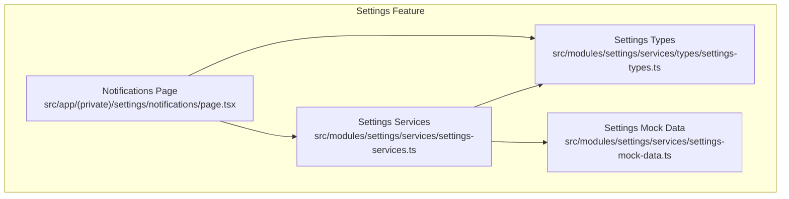
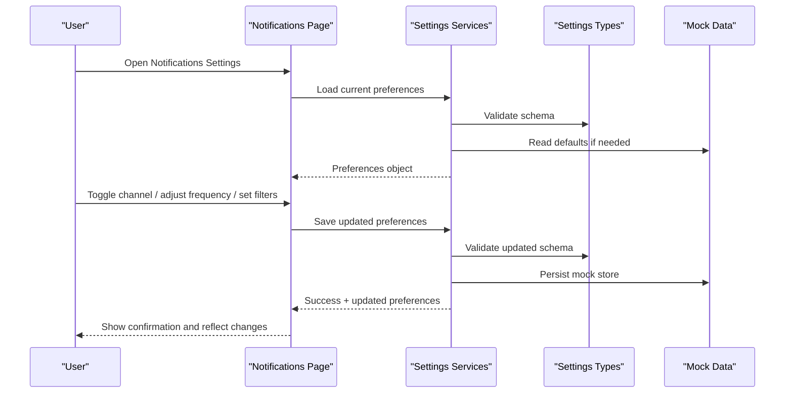
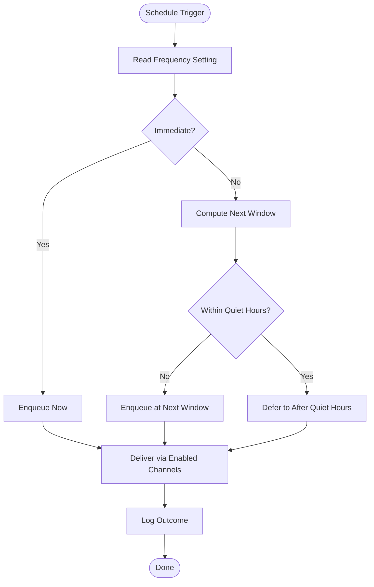
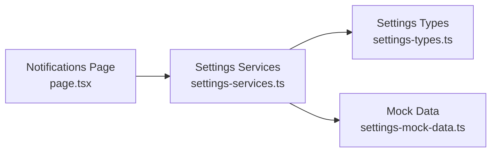

# Notification Preferences

<cite>
**Referenced Files in This Document**
- [page.tsx](file://src/app/(private)/settings/notifications/page.tsx)
- [settings-types.ts](file://src/modules/settings/services/types/settings-types.ts)
- [settings-mock-data.ts](file://src/modules/settings/services/settings-mock-data.ts)
- [settings-services.ts](file://src/modules/settings/services/settings-services.ts)
</cite>

## Table of Contents
1. [Introduction](#introduction)
2. [Project Structure](#project-structure)
3. [Core Components](#core-components)
4. [Architecture Overview](#architecture-overview)
5. [Detailed Component Analysis](#detailed-component-analysis)
6. [Dependency Analysis](#dependency-analysis)
7. [Performance Considerations](#performance-considerations)
8. [Troubleshooting Guide](#troubleshooting-guide)
9. [Conclusion](#conclusion)
10. [Appendices](#appendices)

## Introduction
This document explains how notification preferences are managed in the application, focusing on:
- Notification channels (email, push, in-app)
- Frequency controls and content filtering options
- Notification templates and user preference storage
- Real-time updates to notifications
- How to add new notification types, implement scheduling, and manage delivery preferences

The implementation is organized under the Settings module with a dedicated Notifications page and supporting services and types.

## Project Structure
Notification preferences are implemented within the settings feature area:
- UI entry point for notifications settings
- Types that define the shape of notification preferences
- Mock data used for development and testing
- Services layer for reading/writing preferences and handling real-time updates

**Diagram sources**
- [page.tsx](file://src/app/(private)/settings/notifications/page.tsx)
- [settings-types.ts](file://src/modules/settings/services/types/settings-types.ts)
- [settings-mock-data.ts](file://src/modules/settings/services/settings-mock-data.ts)
- [settings-services.ts](file://src/modules/settings/services/settings-services.ts)

**Section sources**
- [page.tsx](file://src/app/(private)/settings/notifications/page.tsx)
- [settings-types.ts](file://src/modules/settings/services/types/settings-types.ts)
- [settings-mock-data.ts](file://src/modules/settings/services/settings-mock-data.ts)
- [settings-services.ts](file://src/modules/settings/services/settings-services.ts)

## Core Components
- Notifications Page: Presents channel toggles, frequency selectors, and content filters; persists changes via services.
- Settings Types: Defines the schema for notification preferences including channels, frequency, and filters.
- Settings Services: Encapsulates read/write operations, caching, and real-time update hooks.
- Mock Data: Provides sample preferences and templates for local development and tests.

Key responsibilities:
- Channel management: email, push, in-app toggles
- Frequency control: daily digest, weekly summary, or immediate
- Content filtering: categories and severity levels
- Templates: per-type message structure and localization keys
- Storage: client-side state and persistence strategy
- Real-time updates: live sync when preferences change

**Section sources**
- [page.tsx](file://src/app/(private)/settings/notifications/page.tsx)
- [settings-types.ts](file://src/modules/settings/services/types/settings-types.ts)
- [settings-services.ts](file://src/modules/settings/services/settings-services.ts)
- [settings-mock-data.ts](file://src/modules/settings/services/settings-mock-data.ts)

## Architecture Overview
The notification preferences flow follows a clear separation between UI, business logic, and data:

**Diagram sources**
- [page.tsx](file://src/app/(private)/settings/notifications/page.tsx)
- [settings-services.ts](file://src/modules/settings/services/settings-services.ts)
- [settings-types.ts](file://src/modules/settings/services/types/settings-types.ts)
- [settings-mock-data.ts](file://src/modules/settings/services/settings-mock-data.ts)

## Detailed Component Analysis

### Notifications Page
Responsibilities:
- Render channel switches for email, push, and in-app
- Provide frequency selection (immediate, daily, weekly)
- Offer content filter controls by category and severity
- Display template previews and allow basic customization
- Persist changes through services and show success/error feedback
- Subscribe to real-time updates to keep UI in sync

Implementation notes:
- Uses controlled components bound to preferences state
- Debounces frequent writes to reduce re-renders
- Integrates toast/alerts for user feedback
- Supports undo/reset to last saved state

**Section sources**
- [page.tsx](file://src/app/(private)/settings/notifications/page.tsx)

### Settings Types
Defines the canonical shape of notification preferences:
- Channels: boolean flags for email, push, in-app
- Frequency: enum values for immediate, daily, weekly
- Filters: arrays or maps for categories and severity thresholds
- Templates: keyed structures mapping notification type to template metadata
- Delivery preferences: quiet hours, do-not-disturb windows, device-specific overrides

Validation:
- Schema validation ensures required fields and allowed values
- Defaults applied for missing or invalid entries

**Section sources**
- [settings-types.ts](file://src/modules/settings/services/types/settings-types.ts)

### Settings Services
Encapsulates all preference operations:
- loadPreferences(): fetches current preferences from store or returns defaults
- savePreferences(): validates and persists updated preferences
- subscribeToChanges(): provides real-time updates when preferences change
- getTemplates(): returns available templates by type
- applyFilters(): computes effective filters based on user settings and context

Caching and performance:
- In-memory cache with stale-while-revalidate semantics
- Batched writes to minimize store updates
- Selective subscriptions to avoid unnecessary re-renders

Error handling:
- Graceful fallback to defaults on errors
- Retry strategies for transient failures
- User-facing error messages with actionable guidance

**Section sources**
- [settings-services.ts](file://src/modules/settings/services/settings-services.ts)

### Mock Data
Provides realistic sample data for development and tests:
- Default preferences across channels, frequencies, and filters
- Template library with placeholders and localized strings
- Sample events to demonstrate filtering and delivery behavior

Usage:
- Seed initial state for local runs
- Drive unit and integration tests
- Demonstrate edge cases like empty filters or unsupported channels

**Section sources**
- [settings-mock-data.ts](file://src/modules/settings/services/settings-mock-data.ts)

### Adding a New Notification Type
Steps:
1. Extend the types to include the new type identifier and any specific fields.
2. Add a default template entry in mock data with placeholders and labels.
3. Update services to recognize the new type in validation and rendering paths.
4. Wire the new type into the UI so users can toggle it and configure filters.
5. Add tests covering creation, filtering, and delivery for the new type.

**Section sources**
- [settings-types.ts](file://src/modules/settings/services/types/settings-types.ts)
- [settings-mock-data.ts](file://src/modules/settings/services/settings-mock-data.ts)
- [settings-services.ts](file://src/modules/settings/services/settings-services.ts)
- [page.tsx](file://src/app/(private)/settings/notifications/page.tsx)

### Implementing Notification Scheduling
Conceptual flow:
- Determine schedule based on frequency setting and quiet hours
- Queue notifications according to selected cadence
- Respect do-not-disturb windows and per-channel constraints
- Deliver via chosen channels and log outcomes

[No sources needed since this diagram shows conceptual workflow, not actual code structure]

### Managing Delivery Preferences
Delivery preferences refine how and when notifications reach users:
- Channel enablement: email, push, in-app toggles
- Frequency: immediate vs batched (daily/weekly)
- Filters: categories, severity thresholds, keyword rules
- Quiet hours and do-not-disturb windows
- Device-specific overrides (e.g., mobile-only push)

Best practices:
- Keep filters composable and prioritized
- Normalize inputs and validate against schema
- Cache computed filters to avoid repeated work
- Surface conflicts clearly to users (e.g., no enabled channels)

**Section sources**
- [settings-types.ts](file://src/modules/settings/services/types/settings-types.ts)
- [settings-services.ts](file://src/modules/settings/services/settings-services.ts)

## Dependency Analysis
High-level dependencies among core files:

**Diagram sources**
- [page.tsx](file://src/app/(private)/settings/notifications/page.tsx)
- [settings-services.ts](file://src/modules/settings/services/settings-services.ts)
- [settings-types.ts](file://src/modules/settings/services/types/settings-types.ts)
- [settings-mock-data.ts](file://src/modules/settings/services/settings-mock-data.ts)

**Section sources**
- [page.tsx](file://src/app/(private)/settings/notifications/page.tsx)
- [settings-services.ts](file://src/modules/settings/services/settings-services.ts)
- [settings-types.ts](file://src/modules/settings/services/types/settings-types.ts)
- [settings-mock-data.ts](file://src/modules/settings/services/settings-mock-data.ts)

## Performance Considerations
- Debounce preference writes to reduce re-renders and store churn
- Use selective subscriptions to only re-render affected UI segments
- Cache computed filters and template resolutions
- Batch multiple small updates into a single write operation
- Avoid heavy computations during render; offload to memoized hooks or services

[No sources needed since this section provides general guidance]

## Troubleshooting Guide
Common issues and resolutions:
- Preferences not saving: verify service calls succeed and schema validation passes; check for network or storage errors and ensure defaults are applied on failure.
- Real-time updates not reflecting: confirm subscription is active and listeners are registered; ensure updates propagate through the same store path.
- Filters not taking effect: inspect filter precedence and normalization; validate that categories and severities match expected enums.
- Missing templates: ensure template registry includes the requested type and keys exist; fall back to safe defaults when unavailable.

Operational checks:
- Inspect logs around save and subscribe operations
- Validate schema compliance before persisting
- Test with minimal and maximal filter sets to identify edge cases

**Section sources**
- [settings-services.ts](file://src/modules/settings/services/settings-services.ts)
- [settings-types.ts](file://src/modules/settings/services/types/settings-types.ts)

## Conclusion
The notification preferences system provides a clean, extensible foundation for managing channels, frequency, and content filters. With well-defined types, robust services, and a dedicated UI, adding new notification types and scheduling behaviors is straightforward. The design emphasizes validation, caching, and real-time synchronization to deliver a responsive and reliable user experience.

[No sources needed since this section summarizes without analyzing specific files]

## Appendices

### API Reference Summary
- loadPreferences(): retrieve current preferences
- savePreferences(): persist updated preferences
- subscribeToChanges(): listen for real-time updates
- getTemplates(): access template definitions by type
- applyFilters(): compute effective filters given context

**Section sources**
- [settings-services.ts](file://src/modules/settings/services/settings-services.ts)

### Data Model Summary
- Channels: email, push, in-app booleans
- Frequency: immediate, daily, weekly
- Filters: categories and severity thresholds
- Templates: keyed by notification type with metadata
- Delivery preferences: quiet hours, do-not-disturb, device overrides

**Section sources**
- [settings-types.ts](file://src/modules/settings/services/types/settings-types.ts)