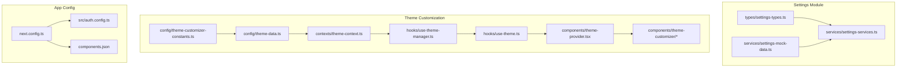
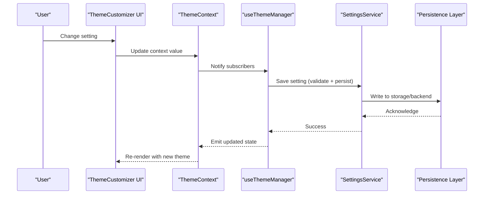
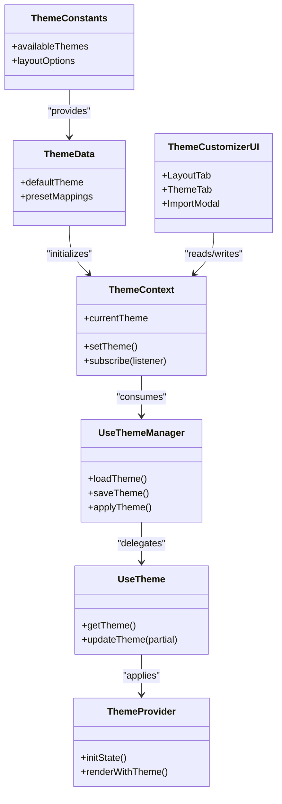
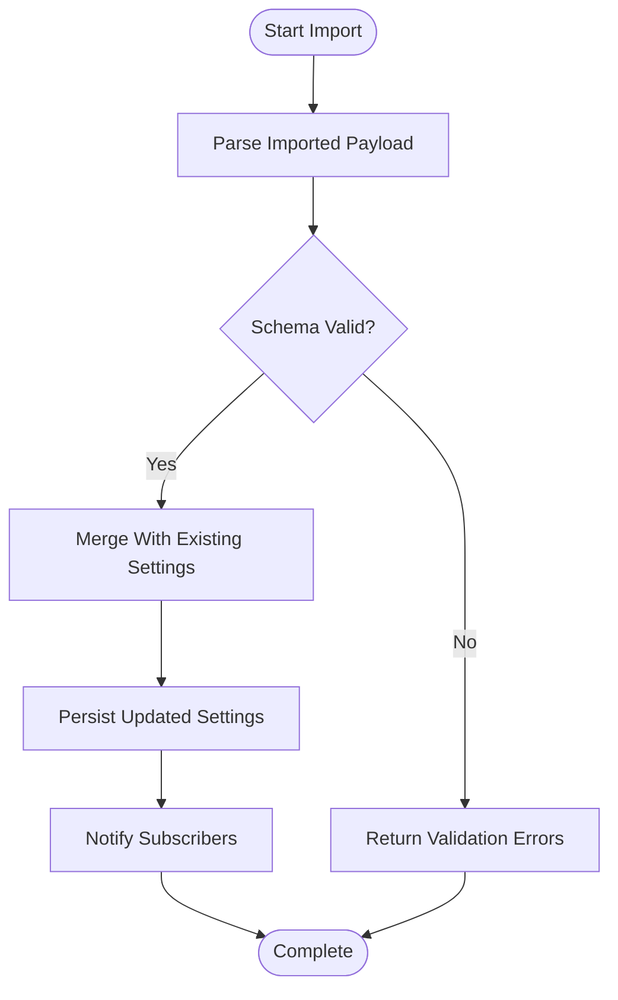
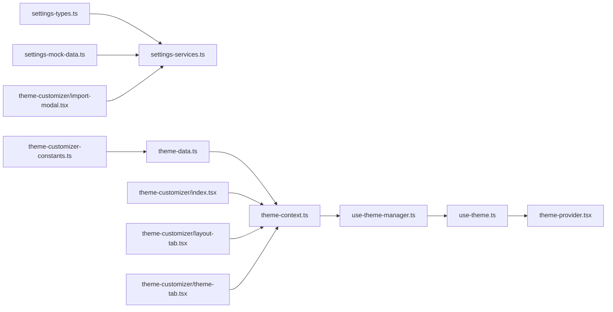

# Settings & Configuration

<cite>
**Referenced Files in This Document**
- [settings-types.ts](file://src/modules/settings/services/types/settings-types.ts)
- [settings-services.ts](file://src/modules/settings/services/settings-services.ts)
- [settings-mock-data.ts](file://src/modules/settings/services/settings-mock-data.ts)
- [theme-customizer-constants.ts](file://src/config/theme-customizer-constants.ts)
- [theme-data.ts](file://src/config/theme-data.ts)
- [theme-context.ts](file://src/contexts/theme-context.ts)
- [use-theme-manager.ts](file://src/hooks/use-theme-manager.ts)
- [use-theme.ts](file://src/hooks/use-theme.ts)
- [theme-provider.tsx](file://src/components/theme-provider.tsx)
- [theme-customizer/index.tsx](file://src/components/theme-customizer/index.tsx)
- [theme-customizer/import-modal.tsx](file://src/components/theme-customizer/import-modal.tsx)
- [theme-customizer/main.tsx](file://src/components/theme-customizer/main.tsx)
- [theme-customizer/layout-tab.tsx](file://src/components/theme-customizer/layout-tab.tsx)
- [theme-customizer/theme-tab.tsx](file://src/components/theme-customizer/theme-tab.tsx)
- [auth.config.ts](file://src/auth.config.ts)
- [next.config.ts](file://next.config.ts)
- [components.json](file://components.json)
</cite>

## Table of Contents
1. [Introduction](#introduction)
2. [Project Structure](#project-structure)
3. [Core Components](#core-components)
4. [Architecture Overview](#architecture-overview)
5. [Detailed Component Analysis](#detailed-component-analysis)
6. [Dependency Analysis](#dependency-analysis)
7. [Performance Considerations](#performance-considerations)
8. [Troubleshooting Guide](#troubleshooting-guide)
9. [Conclusion](#conclusion)
10. [Appendices](#appendices)

## Introduction
This document explains the settings and configuration system for the application, focusing on user preferences, application settings, and system configuration. It covers the data model for settings, persistence mechanisms, validation strategies, import/export workflows, environment-specific configurations, migration patterns, backup/restore procedures, and security considerations. The goal is to provide a clear guide for adding new settings categories, implementing robust import/export flows, and managing secure, maintainable configuration across environments.

## Project Structure
The settings and configuration features are organized into dedicated modules and shared configuration files:
- Settings module: types, services, and mock data for settings operations
- Theme customization: constants, data, context, hooks, provider, and UI components
- Application configuration: Next.js config, auth config, and component registry

**Diagram sources**
- [settings-types.ts](file://src/modules/settings/services/types/settings-types.ts)
- [settings-services.ts](file://src/modules/settings/services/settings-services.ts)
- [settings-mock-data.ts](file://src/modules/settings/services/settings-mock-data.ts)
- [theme-customizer-constants.ts](file://src/config/theme-customizer-constants.ts)
- [theme-data.ts](file://src/config/theme-data.ts)
- [theme-context.ts](file://src/contexts/theme-context.ts)
- [use-theme-manager.ts](file://src/hooks/use-theme-manager.ts)
- [use-theme.ts](file://src/hooks/use-theme.ts)
- [theme-provider.tsx](file://src/components/theme-provider.tsx)
- [theme-customizer/index.tsx](file://src/components/theme-customizer/index.tsx)
- [theme-customizer/import-modal.tsx](file://src/components/theme-customizer/import-modal.tsx)
- [theme-customizer/main.tsx](file://src/components/theme-customizer/main.tsx)
- [theme-customizer/layout-tab.tsx](file://src/components/theme-customizer/layout-tab.tsx)
- [theme-customizer/theme-tab.tsx](file://src/components/theme-customizer/theme-tab.tsx)
- [auth.config.ts](file://src/auth.config.ts)
- [next.config.ts](file://next.config.ts)
- [components.json](file://components.json)

**Section sources**
- [settings-types.ts](file://src/modules/settings/services/types/settings-types.ts)
- [settings-services.ts](file://src/modules/settings/services/settings-services.ts)
- [settings-mock-data.ts](file://src/modules/settings/services/settings-mock-data.ts)
- [theme-customizer-constants.ts](file://src/config/theme-customizer-constants.ts)
- [theme-data.ts](file://src/config/theme-data.ts)
- [theme-context.ts](file://src/contexts/theme-context.ts)
- [use-theme-manager.ts](file://src/hooks/use-theme-manager.ts)
- [use-theme.ts](file://src/hooks/use-theme.ts)
- [theme-provider.tsx](file://src/components/theme-provider.tsx)
- [theme-customizer/index.tsx](file://src/components/theme-customizer/index.tsx)
- [theme-customizer/import-modal.tsx](file://src/components/theme-customizer/import-modal.tsx)
- [theme-customizer/main.tsx](file://src/components/theme-customizer/main.tsx)
- [theme-customizer/layout-tab.tsx](file://src/components/theme-customizer/layout-tab.tsx)
- [theme-customizer/theme-tab.tsx](file://src/components/theme-customizer/theme-tab.tsx)
- [auth.config.ts](file://src/auth.config.ts)
- [next.config.ts](file://next.config.ts)
- [components.json](file://components.json)

## Core Components
- Settings data model: Centralized type definitions define the shape of user and application settings.
- Settings services: Encapsulate CRUD operations, validation, and persistence logic for settings.
- Mock data: Provides default and sample settings for development and testing.
- Theme customization: Constants and theme data drive appearance settings; context and hooks manage runtime state; provider applies them to the app.
- Import modal: Enables importing settings from external sources (e.g., JSON).
- App configuration: Next.js and auth configuration files control environment-specific behavior.

Key responsibilities:
- Define schema and constraints for settings
- Validate inputs before saving
- Persist changes to storage or backend
- Provide defaults and migrations
- Expose import/export APIs for portability

**Section sources**
- [settings-types.ts](file://src/modules/settings/services/types/settings-types.ts)
- [settings-services.ts](file://src/modules/settings/services/settings-services.ts)
- [settings-mock-data.ts](file://src/modules/settings/services/settings-mock-data.ts)
- [theme-customizer-constants.ts](file://src/config/theme-customizer-constants.ts)
- [theme-data.ts](file://src/config/theme-data.ts)
- [theme-context.ts](file://src/contexts/theme-context.ts)
- [use-theme-manager.ts](file://src/hooks/use-theme-manager.ts)
- [use-theme.ts](file://src/hooks/use-theme.ts)
- [theme-provider.tsx](file://src/components/theme-provider.tsx)
- [theme-customizer/import-modal.tsx](file://src/components/theme-customizer/import-modal.tsx)

## Architecture Overview
The settings architecture separates concerns between data modeling, service layer, UI, and configuration:
- Data model defines the canonical structure for all settings
- Services implement validation, persistence, and optional sync with server
- UI components consume settings via context and hooks
- Import/export flows allow users to move settings across devices or profiles
- Environment-specific configs override defaults per deployment

**Diagram sources**
- [theme-customizer/index.tsx](file://src/components/theme-customizer/index.tsx)
- [theme-context.ts](file://src/contexts/theme-context.ts)
- [use-theme-manager.ts](file://src/hooks/use-theme-manager.ts)
- [settings-services.ts](file://src/modules/settings/services/settings-services.ts)

## Detailed Component Analysis

### Settings Data Model
- Purpose: Define the canonical structure for all settings, including user preferences and application-level options.
- Responsibilities:
  - Enumerate all setting keys and their types
  - Provide default values where applicable
  - Serve as the source of truth for validation and serialization

Best practices:
- Keep the model immutable at the API boundary
- Use discriminated unions or tagged objects for versioned schemas
- Separate transient UI-only fields from persisted fields

**Section sources**
- [settings-types.ts](file://src/modules/settings/services/types/settings-types.ts)

### Settings Services
- Purpose: Implement business logic for settings operations, including validation, persistence, and optional synchronization.
- Key functions:
  - Load settings with fallbacks and migrations
  - Validate partial updates against the schema
  - Persist changes to local storage or remote backend
  - Export current settings to a portable format
  - Import settings from an external payload with validation and merge strategy

Validation strategy:
- Schema-based validation using the data model
- Defensive checks for missing or invalid fields
- Graceful degradation with defaults when imports are incomplete

Persistence strategy:
- Local-first storage for immediate responsiveness
- Optional background sync to server for cross-device consistency

Migration strategy:
- Versioned settings schema with upgraders applied on load
- Rollback-safe transformations with idempotent operations

Backup/restore:
- Export generates a complete snapshot of settings
- Import merges or replaces existing settings based on policy

Security considerations:
- Sanitize imported payloads
- Avoid storing secrets in plain text; use environment variables or secret managers
- Restrict write access to authenticated users

**Section sources**
- [settings-services.ts](file://src/modules/settings/services/settings-services.ts)
- [settings-mock-data.ts](file://src/modules/settings/services/settings-mock-data.ts)

### Theme Customization System
- Constants and theme data define available themes, layouts, and appearance options.
- Context provides global access to current theme state.
- Hooks encapsulate logic for reading and updating theme settings.
- Provider initializes theme state and applies it to the DOM.
- UI components expose controls for changing layout and theme.

**Diagram sources**
- [theme-customizer-constants.ts](file://src/config/theme-customizer-constants.ts)
- [theme-data.ts](file://src/config/theme-data.ts)
- [theme-context.ts](file://src/contexts/theme-context.ts)
- [use-theme-manager.ts](file://src/hooks/use-theme-manager.ts)
- [use-theme.ts](file://src/hooks/use-theme.ts)
- [theme-provider.tsx](file://src/components/theme-provider.tsx)
- [theme-customizer/index.tsx](file://src/components/theme-customizer/index.tsx)
- [theme-customizer/layout-tab.tsx](file://src/components/theme-customizer/layout-tab.tsx)
- [theme-customizer/theme-tab.tsx](file://src/components/theme-customizer/theme-tab.tsx)
- [theme-customizer/import-modal.tsx](file://src/components/theme-customizer/import-modal.tsx)

**Section sources**
- [theme-customizer-constants.ts](file://src/config/theme-customizer-constants.ts)
- [theme-data.ts](file://src/config/theme-data.ts)
- [theme-context.ts](file://src/contexts/theme-context.ts)
- [use-theme-manager.ts](file://src/hooks/use-theme-manager.ts)
- [use-theme.ts](file://src/hooks/use-theme.ts)
- [theme-provider.tsx](file://src/components/theme-provider.tsx)
- [theme-customizer/index.tsx](file://src/components/theme-customizer/index.tsx)
- [theme-customizer/layout-tab.tsx](file://src/components/theme-customizer/layout-tab.tsx)
- [theme-customizer/theme-tab.tsx](file://src/components/theme-customizer/theme-tab.tsx)
- [theme-customizer/import-modal.tsx](file://src/components/theme-customizer/import-modal.tsx)

### Import/Export Workflow
The import flow validates incoming settings, merges them according to policy, persists changes, and notifies subscribers.

**Diagram sources**
- [theme-customizer/import-modal.tsx](file://src/components/theme-customizer/import-modal.tsx)
- [settings-services.ts](file://src/modules/settings/services/settings-services.ts)

**Section sources**
- [theme-customizer/import-modal.tsx](file://src/components/theme-customizer/import-modal.tsx)
- [settings-services.ts](file://src/modules/settings/services/settings-services.ts)

### Environment-Specific Configuration
Environment-specific settings are managed through application configuration files:
- Next.js configuration controls build-time and runtime options
- Auth configuration manages authentication providers and callbacks
- Component registry defines UI primitives and their options

Guidelines:
- Use environment variables for sensitive or deployment-specific values
- Keep non-sensitive defaults in code and override via environment
- Centralize environment loading to avoid scattered conditionals

**Section sources**
- [next.config.ts](file://next.config.ts)
- [auth.config.ts](file://src/auth.config.ts)
- [components.json](file://components.json)

## Dependency Analysis
The following diagram shows key dependencies among settings and theme components:

**Diagram sources**
- [settings-types.ts](file://src/modules/settings/services/types/settings-types.ts)
- [settings-services.ts](file://src/modules/settings/services/settings-services.ts)
- [settings-mock-data.ts](file://src/modules/settings/services/settings-mock-data.ts)
- [theme-customizer-constants.ts](file://src/config/theme-customizer-constants.ts)
- [theme-data.ts](file://src/config/theme-data.ts)
- [theme-context.ts](file://src/contexts/theme-context.ts)
- [use-theme-manager.ts](file://src/hooks/use-theme-manager.ts)
- [use-theme.ts](file://src/hooks/use-theme.ts)
- [theme-provider.tsx](file://src/components/theme-provider.tsx)
- [theme-customizer/index.tsx](file://src/components/theme-customizer/index.tsx)
- [theme-customizer/layout-tab.tsx](file://src/components/theme-customizer/layout-tab.tsx)
- [theme-customizer/theme-tab.tsx](file://src/components/theme-customizer/theme-tab.tsx)
- [theme-customizer/import-modal.tsx](file://src/components/theme-customizer/import-modal.tsx)

**Section sources**
- [settings-types.ts](file://src/modules/settings/services/types/settings-types.ts)
- [settings-services.ts](file://src/modules/settings/services/settings-services.ts)
- [settings-mock-data.ts](file://src/modules/settings/services/settings-mock-data.ts)
- [theme-customizer-constants.ts](file://src/config/theme-customizer-constants.ts)
- [theme-data.ts](file://src/config/theme-data.ts)
- [theme-context.ts](file://src/contexts/theme-context.ts)
- [use-theme-manager.ts](file://src/hooks/use-theme-manager.ts)
- [use-theme.ts](file://src/hooks/use-theme.ts)
- [theme-provider.tsx](file://src/components/theme-provider.tsx)
- [theme-customizer/index.tsx](file://src/components/theme-customizer/index.tsx)
- [theme-customizer/layout-tab.tsx](file://src/components/theme-customizer/layout-tab.tsx)
- [theme-customizer/theme-tab.tsx](file://src/components/theme-customizer/theme-tab.tsx)
- [theme-customizer/import-modal.tsx](file://src/components/theme-customizer/import-modal.tsx)

## Performance Considerations
- Minimize re-renders by memoizing derived settings and batching updates
- Debounce frequent UI-driven changes before persisting
- Prefer shallow merges for partial updates to reduce diff overhead
- Cache frequently accessed settings in memory with lazy reloads
- Avoid heavy computations during import; offload validation to web workers if needed

[No sources needed since this section provides general guidance]

## Troubleshooting Guide
Common issues and resolutions:
- Invalid import payload: Ensure the imported file conforms to the settings schema; review validation errors returned by the service
- Missing defaults: Verify that fallback defaults are applied when keys are absent
- Persistence failures: Check storage availability and permissions; handle errors gracefully and notify users
- Theme not applying: Confirm that the provider wraps the app tree and that context consumers subscribe correctly
- Environment misconfiguration: Validate environment variables and ensure they are loaded before initialization

**Section sources**
- [settings-services.ts](file://src/modules/settings/services/settings-services.ts)
- [theme-provider.tsx](file://src/components/theme-provider.tsx)
- [theme-context.ts](file://src/contexts/theme-context.ts)

## Conclusion
The settings and configuration system is designed around a clear data model, robust service layer, and intuitive UI. By centralizing validation, persistence, and migration logic, the system ensures consistent behavior across environments and devices. The theme customization subsystem demonstrates how to integrate settings into the UI efficiently using context and hooks. Following the guidelines here will help you add new settings categories, implement secure import/export flows, and manage environment-specific configurations effectively.

[No sources needed since this section summarizes without analyzing specific files]

## Appendices

### Adding a New Settings Category
Steps:
- Extend the settings data model with new keys and types
- Add default values in mock data or defaults module
- Implement validation rules in the service layer
- Create UI controls under the appropriate settings page
- Wire up persistence and export/import support
- Add tests for validation, persistence, and import/export

**Section sources**
- [settings-types.ts](file://src/modules/settings/services/types/settings-types.ts)
- [settings-services.ts](file://src/modules/settings/services/settings-services.ts)
- [settings-mock-data.ts](file://src/modules/settings/services/settings-mock-data.ts)

### Implementing Settings Import/Export
Recommendations:
- Export should produce a complete, versioned snapshot of settings
- Import should validate, merge, and persist changes atomically
- Provide user feedback for success and failure cases
- Support incremental imports by allowing selective field replacement

**Section sources**
- [settings-services.ts](file://src/modules/settings/services/settings-services.ts)
- [theme-customizer/import-modal.tsx](file://src/components/theme-customizer/import-modal.tsx)

### Managing Environment-Specific Configurations
Guidelines:
- Store secrets in environment variables and never commit them
- Use configuration files for non-sensitive options
- Centralize environment loading and validation at startup
- Document required variables and their expected formats

**Section sources**
- [next.config.ts](file://next.config.ts)
- [auth.config.ts](file://src/auth.config.ts)
- [components.json](file://components.json)

### Settings Migration Strategy
Approach:
- Version the settings schema explicitly
- Apply upgraders on load to transform older versions to the latest
- Make migrations idempotent and reversible where possible
- Log migration steps for observability and debugging

**Section sources**
- [settings-services.ts](file://src/modules/settings/services/settings-services.ts)

### Backup and Restore Procedures
Procedures:
- Backup: Export full settings to a secure, timestamped file
- Restore: Import the backup with explicit confirmation and rollback plan
- Retention: Manage backups with lifecycle policies to avoid clutter

**Section sources**
- [settings-services.ts](file://src/modules/settings/services/settings-services.ts)
- [theme-customizer/import-modal.tsx](file://src/components/theme-customizer/import-modal.tsx)

### Configuration Security Best Practices
Practices:
- Never store secrets in user-accessible settings
- Validate and sanitize all imported data
- Restrict write access to authenticated users
- Encrypt sensitive settings at rest if required by policy
- Audit changes to critical configuration keys

**Section sources**
- [settings-services.ts](file://src/modules/settings/services/settings-services.ts)
- [auth.config.ts](file://src/auth.config.ts)