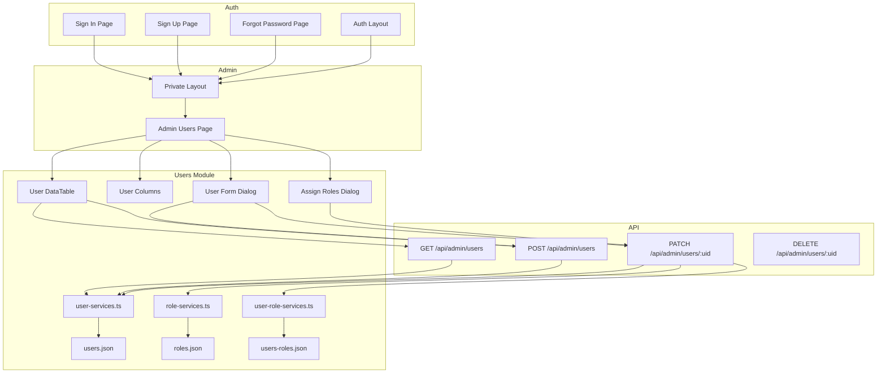
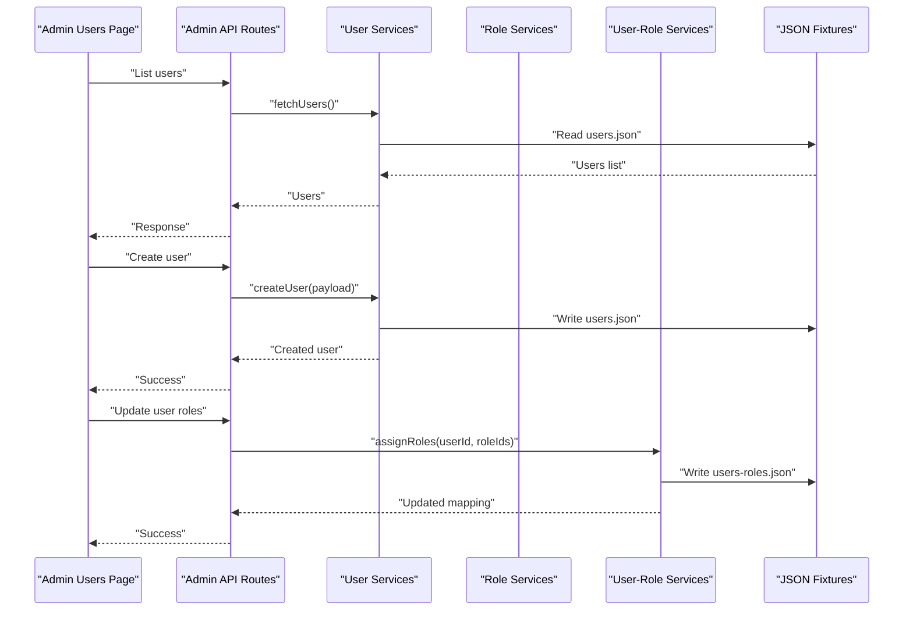
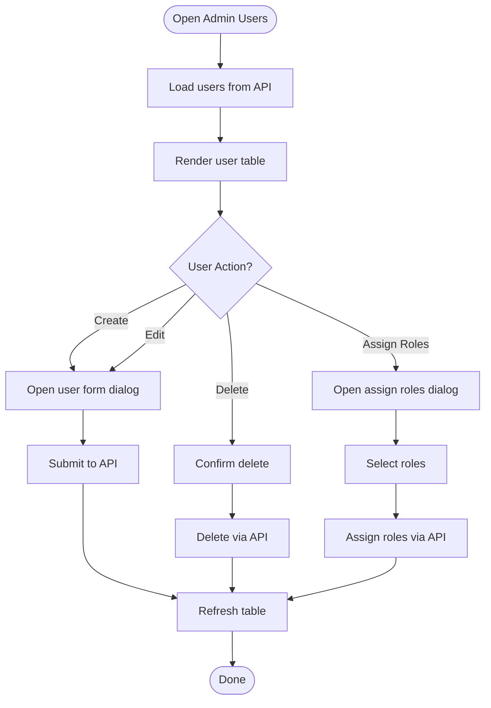
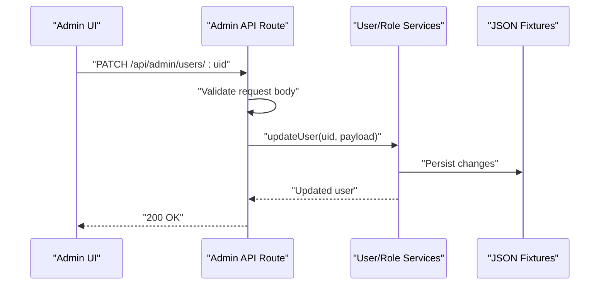
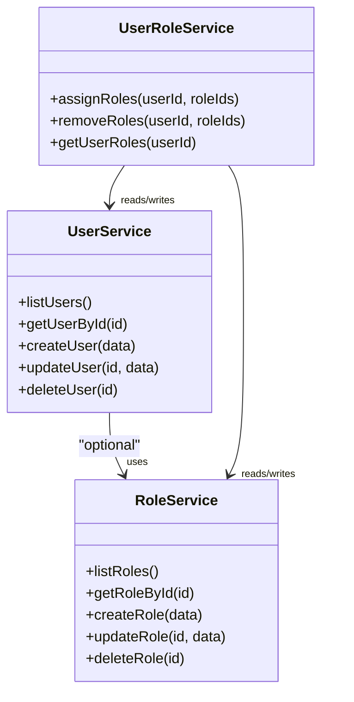
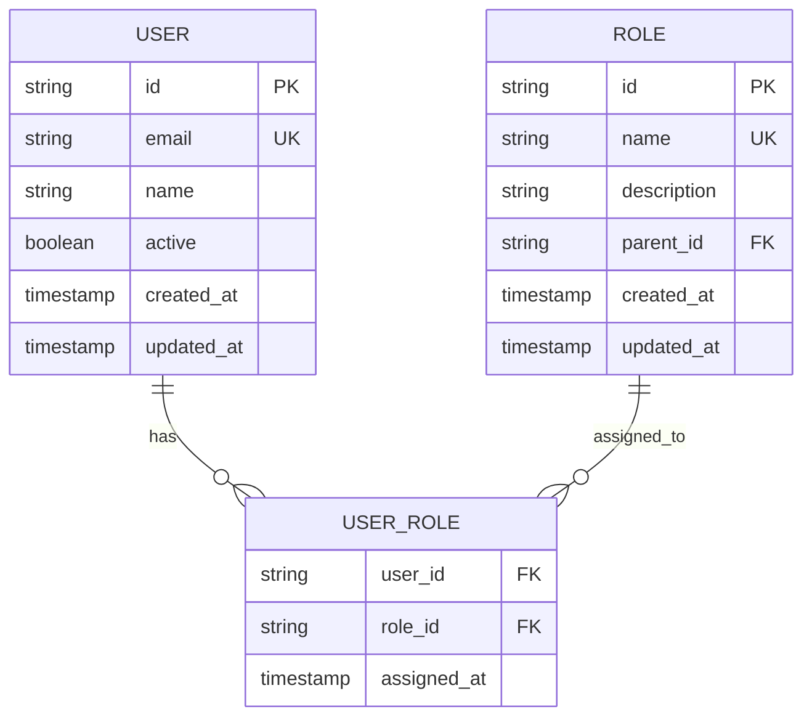
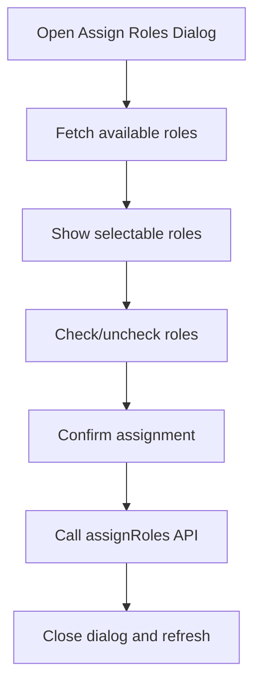
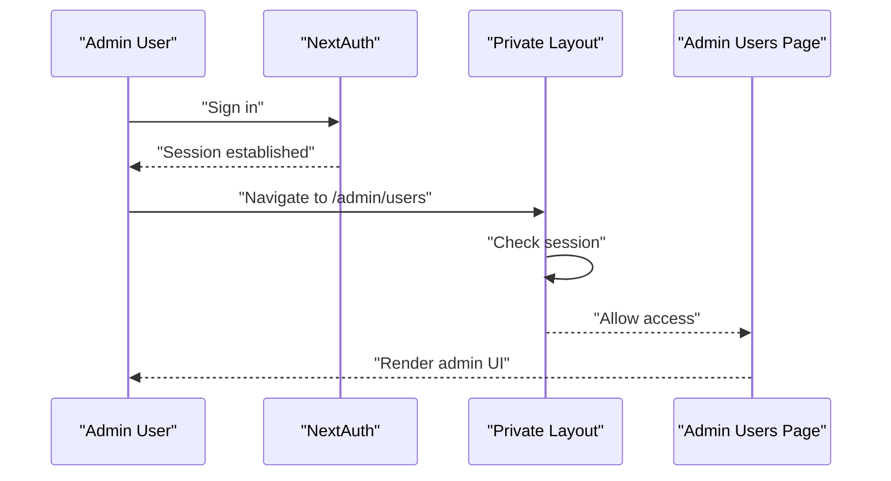
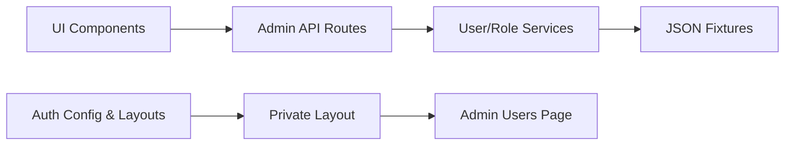

# User Management Settings

<cite>
**Referenced Files in This Document**
- [src/app/(private)/admin/users/page.tsx](file://src/app/(private)/admin/users/page.tsx)
- [src/app/api/admin/users/route.ts](file://src/app/api/admin/users/route.ts)
- [src/app/api/admin/users/[uid]/route.ts](file://src/app/api/admin/users/[uid]/route.ts)
- [src/modules/users/components/user-data-table.tsx](file://src/modules/users/components/user-data-table.tsx)
- [src/modules/users/components/user-columns.tsx](file://src/modules/users/components/user-columns.tsx)
- [src/modules/users/components/user-form-dialog.tsx](file://src/modules/users/components/user-form-dialog.tsx)
- [src/modules/users/components/assign-roles-dialog.tsx](file://src/modules/users/components/assign-roles-dialog.tsx)
- [src/modules/users/components/role-data-table.tsx](file://src/modules/users/components/role-data-table.tsx)
- [src/modules/users/components/role-columns.tsx](file://src/modules/users/components/role-columns.tsx)
- [src/modules/users/components/role-form-dialog.tsx](file://src/modules/users/components/role-form-dialog.tsx)
- [src/modules/users/services/user-services.ts](file://src/modules/users/services/user-services.ts)
- [src/modules/users/services/role-services.ts](file://src/modules/users/services/role-services.ts)
- [src/modules/users/services/user-role-services.ts](file://src/modules/users/services/user-role-services.ts)
- [src/modules/users/services/types/user-types.ts](file://src/modules/users/services/types/user-types.ts)
- [src/modules/users/services/data/users.json](file://src/modules/users/services/data/users.json)
- [src/modules/users/services/data/roles.json](file://src/modules/users/services/data/roles.json)
- [src/modules/users/services/data/users-roles.json](file://src/modules/users/services/data/users-roles.json)
- [src/auth.config.ts](file://src/auth.config.ts)
- [src/auth.ts](file://src/auth.ts)
- [src/app/(auth)/sign-in/page.tsx](file://src/app/(auth)/sign-in/page.tsx)
- [src/app/(auth)/sign-up/page.tsx](file://src/app/(auth)/sign-up/page.tsx)
- [src/app/(auth)/forgot-password/page.tsx](file://src/app/(auth)/forgot-password/page.tsx)
- [src/app/(auth)/layout.tsx](file://src/app/(auth)/layout.tsx)
- [src/app/(private)/layout.tsx](file://src/app/(private)/layout.tsx)
- [src/app/(auth)/errors/unauthorized/page.tsx](file://src/app/(auth)/errors/unauthorized/page.tsx)
- [src/app/(auth)/errors/forbidden/page.tsx](file://src/app/(auth)/errors/forbidden/page.tsx)
</cite>

## Table of Contents
1. [Introduction](#introduction)
2. [Project Structure](#project-structure)
3. [Core Components](#core-components)
4. [Architecture Overview](#architecture-overview)
5. [Detailed Component Analysis](#detailed-component-analysis)
6. [Dependency Analysis](#dependency-analysis)
7. [Performance Considerations](#performance-considerations)
8. [Troubleshooting Guide](#troubleshooting-guide)
9. [Conclusion](#conclusion)
10. [Appendices](#appendices)

## Introduction
This document explains the user management and administrative settings implemented in the project. It covers role assignment, permission management, access control configuration, bulk operations, audit logging, and activity monitoring. It also provides examples for creating custom roles, implementing permission hierarchies, and managing sessions and security policies. The implementation is based on Next.js App Router API routes, a modular users module with mock data services, and authentication integration via NextAuth.

## Project Structure
The user management feature spans UI pages, API routes, reusable components, and service modules that operate over mock data files. Authentication flows are configured through NextAuth and protected layouts enforce access control.

**Diagram sources**
- [src/app/(private)/admin/users/page.tsx](file://src/app/(private)/admin/users/page.tsx)
- [src/app/api/admin/users/route.ts](file://src/app/api/admin/users/route.ts)
- [src/app/api/admin/users/[uid]/route.ts](file://src/app/api/admin/users/[uid]/route.ts)
- [src/modules/users/components/user-data-table.tsx](file://src/modules/users/components/user-data-table.tsx)
- [src/modules/users/components/user-columns.tsx](file://src/modules/users/components/user-columns.tsx)
- [src/modules/users/components/user-form-dialog.tsx](file://src/modules/users/components/user-form-dialog.tsx)
- [src/modules/users/components/assign-roles-dialog.tsx](file://src/modules/users/components/assign-roles-dialog.tsx)
- [src/modules/users/services/user-services.ts](file://src/modules/users/services/user-services.ts)
- [src/modules/users/services/role-services.ts](file://src/modules/users/services/role-services.ts)
- [src/modules/users/services/user-role-services.ts](file://src/modules/users/services/user-role-services.ts)
- [src/modules/users/services/data/users.json](file://src/modules/users/services/data/users.json)
- [src/modules/users/services/data/roles.json](file://src/modules/users/services/data/roles.json)
- [src/modules/users/services/data/users-roles.json](file://src/modules/users/services/data/users-roles.json)
- [src/app/(private)/layout.tsx](file://src/app/(private)/layout.tsx)
- [src/app/(auth)/layout.tsx](file://src/app/(auth)/layout.tsx)

**Section sources**
- [src/app/(private)/admin/users/page.tsx](file://src/app/(private)/admin/users/page.tsx)
- [src/app/api/admin/users/route.ts](file://src/app/api/admin/users/route.ts)
- [src/app/api/admin/users/[uid]/route.ts](file://src/app/api/admin/users/[uid]/route.ts)
- [src/modules/users/components/user-data-table.tsx](file://src/modules/users/components/user-data-table.tsx)
- [src/modules/users/components/user-columns.tsx](file://src/modules/users/components/user-columns.tsx)
- [src/modules/users/components/user-form-dialog.tsx](file://src/modules/users/components/user-form-dialog.tsx)
- [src/modules/users/components/assign-roles-dialog.tsx](file://src/modules/users/components/assign-roles-dialog.tsx)
- [src/modules/users/services/user-services.ts](file://src/modules/users/services/user-services.ts)
- [src/modules/users/services/role-services.ts](file://src/modules/users/services/role-services.ts)
- [src/modules/users/services/user-role-services.ts](file://src/modules/users/services/user-role-services.ts)
- [src/modules/users/services/data/users.json](file://src/modules/users/services/data/users.json)
- [src/modules/users/services/data/roles.json](file://src/modules/users/services/data/roles.json)
- [src/modules/users/services/data/users-roles.json](file://src/modules/users/services/data/users-roles.json)
- [src/app/(private)/layout.tsx](file://src/app/(private)/layout.tsx)
- [src/app/(auth)/layout.tsx](file://src/app/(auth)/layout.tsx)

## Core Components
- Admin Users page: Provides the entry point to manage users and roles, rendering data tables and dialogs for CRUD and role assignment.
- API routes: Implement REST endpoints for listing, creating, updating, and deleting users; route handlers coordinate with services.
- Services: Encapsulate business logic and data access over JSON fixtures for users, roles, and user-role mappings.
- UI components: Data tables, column definitions, forms, and dialogs implement interactive user and role management workflows.

Key responsibilities:
- Role assignment: Assign or update roles per user via dedicated dialog and API calls.
- Permission management: Roles define permissions; services read/write role definitions and mappings.
- Access control: Private layout enforces authentication before allowing admin features.
- Bulk operations: Data table toolbars support selection and batch actions (e.g., assign roles to multiple users).
- Audit logging: Service layer can record actions against an audit store (extensible).
- Activity monitoring: Admin UI can surface recent activities and metrics (extensible).

**Section sources**
- [src/app/(private)/admin/users/page.tsx](file://src/app/(private)/admin/users/page.tsx)
- [src/app/api/admin/users/route.ts](file://src/app/api/admin/users/route.ts)
- [src/app/api/admin/users/[uid]/route.ts](file://src/app/api/admin/users/[uid]/route.ts)
- [src/modules/users/services/user-services.ts](file://src/modules/users/services/user-services.ts)
- [src/modules/users/services/role-services.ts](file://src/modules/users/services/role-services.ts)
- [src/modules/users/services/user-role-services.ts](file://src/modules/users/services/user-role-services.ts)
- [src/modules/users/components/user-data-table.tsx](file://src/modules/users/components/user-data-table.tsx)
- [src/modules/users/components/assign-roles-dialog.tsx](file://src/modules/users/components/assign-roles-dialog.tsx)

## Architecture Overview
The system follows a layered architecture:
- Presentation layer: Pages and components render UI and collect user input.
- API layer: Route handlers validate requests, enforce auth, and delegate to services.
- Service layer: Implements domain logic, reads/writes mock data, and performs side effects like audit logging.
- Data layer: JSON fixtures represent users, roles, and user-role relationships.

**Diagram sources**
- [src/app/(private)/admin/users/page.tsx](file://src/app/(private)/admin/users/page.tsx)
- [src/app/api/admin/users/route.ts](file://src/app/api/admin/users/route.ts)
- [src/app/api/admin/users/[uid]/route.ts](file://src/app/api/admin/users/[uid]/route.ts)
- [src/modules/users/services/user-services.ts](file://src/modules/users/services/user-services.ts)
- [src/modules/users/services/role-services.ts](file://src/modules/users/services/role-services.ts)
- [src/modules/users/services/user-role-services.ts](file://src/modules/users/services/user-role-services.ts)
- [src/modules/users/services/data/users.json](file://src/modules/users/services/data/users.json)
- [src/modules/users/services/data/roles.json](file://src/modules/users/services/data/roles.json)
- [src/modules/users/services/data/users-roles.json](file://src/modules/users/services/data/users-roles.json)

## Detailed Component Analysis

### Admin Users Page
- Purpose: Orchestrates user and role management UI, including data tables and dialogs.
- Responsibilities:
  - Renders user and role tables.
  - Triggers create/update/delete operations via API.
  - Opens role assignment dialog for single or selected users.
  - Displays statistics and filters.

**Diagram sources**
- [src/app/(private)/admin/users/page.tsx](file://src/app/(private)/admin/users/page.tsx)
- [src/modules/users/components/user-data-table.tsx](file://src/modules/users/components/user-data-table.tsx)
- [src/modules/users/components/user-form-dialog.tsx](file://src/modules/users/components/user-form-dialog.tsx)
- [src/modules/users/components/assign-roles-dialog.tsx](file://src/modules/users/components/assign-roles-dialog.tsx)

**Section sources**
- [src/app/(private)/admin/users/page.tsx](file://src/app/(private)/admin/users/page.tsx)
- [src/modules/users/components/user-data-table.tsx](file://src/modules/users/components/user-data-table.tsx)
- [src/modules/users/components/user-form-dialog.tsx](file://src/modules/users/components/user-form-dialog.tsx)
- [src/modules/users/components/assign-roles-dialog.tsx](file://src/modules/users/components/assign-roles-dialog.tsx)

### API Routes
- GET /api/admin/users: Lists users by delegating to user services.
- POST /api/admin/users: Creates a new user via user services.
- PATCH /api/admin/users/:uid: Updates user details and/or assigns roles via user and user-role services.
- DELETE /api/admin/users/:uid: Deletes a user via user services.

**Diagram sources**
- [src/app/api/admin/users/route.ts](file://src/app/api/admin/users/route.ts)
- [src/app/api/admin/users/[uid]/route.ts](file://src/app/api/admin/users/[uid]/route.ts)
- [src/modules/users/services/user-services.ts](file://src/modules/users/services/user-services.ts)
- [src/modules/users/services/user-role-services.ts](file://src/modules/users/services/user-role-services.ts)

**Section sources**
- [src/app/api/admin/users/route.ts](file://src/app/api/admin/users/route.ts)
- [src/app/api/admin/users/[uid]/route.ts](file://src/app/api/admin/users/[uid]/route.ts)

### Services Layer
- user-services.ts: CRUD operations for users; integrates with JSON fixtures.
- role-services.ts: CRUD operations for roles; supports hierarchical structures.
- user-role-services.ts: Manages many-to-many mapping between users and roles; supports bulk assignments.

**Diagram sources**
- [src/modules/users/services/user-services.ts](file://src/modules/users/services/user-services.ts)
- [src/modules/users/services/role-services.ts](file://src/modules/users/services/role-services.ts)
- [src/modules/users/services/user-role-services.ts](file://src/modules/users/services/user-role-services.ts)

**Section sources**
- [src/modules/users/services/user-services.ts](file://src/modules/users/services/user-services.ts)
- [src/modules/users/services/role-services.ts](file://src/modules/users/services/role-services.ts)
- [src/modules/users/services/user-role-services.ts](file://src/modules/users/services/user-role-services.ts)

### Data Models
- users.json: Represents user entities with identifiers, profile fields, and status.
- roles.json: Defines roles and their permissions; supports hierarchy via parent references.
- users-roles.json: Maps users to roles (many-to-many).

**Diagram sources**
- [src/modules/users/services/data/users.json](file://src/modules/users/services/data/users.json)
- [src/modules/users/services/data/roles.json](file://src/modules/users/services/data/roles.json)
- [src/modules/users/services/data/users-roles.json](file://src/modules/users/services/data/users-roles.json)

**Section sources**
- [src/modules/users/services/data/users.json](file://src/modules/users/services/data/users.json)
- [src/modules/users/services/data/roles.json](file://src/modules/users/services/data/roles.json)
- [src/modules/users/services/data/users-roles.json](file://src/modules/users/services/data/users-roles.json)

### UI Components
- user-data-table.tsx: Displays paginated, filterable, sortable user lists; supports row selection for bulk actions.
- user-columns.tsx: Column definitions for user attributes and actions.
- user-form-dialog.tsx: Modal form for creating/editing users with validation.
- assign-roles-dialog.tsx: Modal for assigning/removing roles for one or more users.
- role-data-table.tsx, role-columns.tsx, role-form-dialog.tsx: Manage roles and permissions.

**Diagram sources**
- [src/modules/users/components/assign-roles-dialog.tsx](file://src/modules/users/components/assign-roles-dialog.tsx)
- [src/modules/users/components/role-data-table.tsx](file://src/modules/users/components/role-data-table.tsx)
- [src/modules/users/components/role-columns.tsx](file://src/modules/users/components/role-columns.tsx)
- [src/modules/users/components/role-form-dialog.tsx](file://src/modules/users/components/role-form-dialog.tsx)

**Section sources**
- [src/modules/users/components/user-data-table.tsx](file://src/modules/users/components/user-data-table.tsx)
- [src/modules/users/components/user-columns.tsx](file://src/modules/users/components/user-columns.tsx)
- [src/modules/users/components/user-form-dialog.tsx](file://src/modules/users/components/user-form-dialog.tsx)
- [src/modules/users/components/assign-roles-dialog.tsx](file://src/modules/users/components/assign-roles-dialog.tsx)
- [src/modules/users/components/role-data-table.tsx](file://src/modules/users/components/role-data-table.tsx)
- [src/modules/users/components/role-columns.tsx](file://src/modules/users/components/role-columns.tsx)
- [src/modules/users/components/role-form-dialog.tsx](file://src/modules/users/components/role-form-dialog.tsx)

### Authentication and Access Control
- NextAuth configuration: Centralizes providers, session handling, and callbacks.
- Auth pages: Sign-in, sign-up, and forgot-password flows integrated with NextAuth.
- Private layout: Enforces authenticated access to admin areas.
- Error pages: Unauthorized and forbidden pages handle access denials.

**Diagram sources**
- [src/auth.config.ts](file://src/auth.config.ts)
- [src/auth.ts](file://src/auth.ts)
- [src/app/(auth)/sign-in/page.tsx](file://src/app/(auth)/sign-in/page.tsx)
- [src/app/(auth)/sign-up/page.tsx](file://src/app/(auth)/sign-up/page.tsx)
- [src/app/(auth)/forgot-password/page.tsx](file://src/app/(auth)/forgot-password/page.tsx)
- [src/app/(auth)/layout.tsx](file://src/app/(auth)/layout.tsx)
- [src/app/(private)/layout.tsx](file://src/app/(private)/layout.tsx)
- [src/app/(auth)/errors/unauthorized/page.tsx](file://src/app/(auth)/errors/unauthorized/page.tsx)
- [src/app/(auth)/errors/forbidden/page.tsx](file://src/app/(auth)/errors/forbidden/page.tsx)

**Section sources**
- [src/auth.config.ts](file://src/auth.config.ts)
- [src/auth.ts](file://src/auth.ts)
- [src/app/(auth)/sign-in/page.tsx](file://src/app/(auth)/sign-in/page.tsx)
- [src/app/(auth)/sign-up/page.tsx](file://src/app/(auth)/sign-up/page.tsx)
- [src/app/(auth)/forgot-password/page.tsx](file://src/app/(auth)/forgot-password/page.tsx)
- [src/app/(auth)/layout.tsx](file://src/app/(auth)/layout.tsx)
- [src/app/(private)/layout.tsx](file://src/app/(private)/layout.tsx)
- [src/app/(auth)/errors/unauthorized/page.tsx](file://src/app/(auth)/errors/unauthorized/page.tsx)
- [src/app/(auth)/errors/forbidden/page.tsx](file://src/app/(auth)/errors/forbidden/page.tsx)

## Dependency Analysis
- UI components depend on API routes for data mutations and queries.
- API routes depend on services for business logic and persistence.
- Services depend on JSON fixtures for data storage.
- Authentication configuration and layouts gate access to admin features.

**Diagram sources**
- [src/modules/users/components/user-data-table.tsx](file://src/modules/users/components/user-data-table.tsx)
- [src/app/api/admin/users/route.ts](file://src/app/api/admin/users/route.ts)
- [src/modules/users/services/user-services.ts](file://src/modules/users/services/user-services.ts)
- [src/modules/users/services/data/users.json](file://src/modules/users/services/data/users.json)
- [src/app/(private)/layout.tsx](file://src/app/(private)/layout.tsx)
- [src/auth.config.ts](file://src/auth.config.ts)

**Section sources**
- [src/modules/users/components/user-data-table.tsx](file://src/modules/users/components/user-data-table.tsx)
- [src/app/api/admin/users/route.ts](file://src/app/api/admin/users/route.ts)
- [src/modules/users/services/user-services.ts](file://src/modules/users/services/user-services.ts)
- [src/modules/users/services/data/users.json](file://src/modules/users/services/data/users.json)
- [src/app/(private)/layout.tsx](file://src/app/(private)/layout.tsx)
- [src/auth.config.ts](file://src/auth.config.ts)

## Performance Considerations
- Pagination and filtering: Use server-side pagination and filtering in API routes to reduce payload sizes.
- Caching: Cache frequently accessed role definitions and user lists at the API layer.
- Debounce inputs: Debounce search and filter inputs in data tables to minimize API calls.
- Batch operations: Prefer bulk APIs for assigning roles to multiple users to reduce round trips.
- Lazy loading: Dynamically import heavy components to improve initial load time.

[No sources needed since this section provides general guidance]

## Troubleshooting Guide
- Unauthorized access: Ensure the private layout checks the session and redirects appropriately.
- Forbidden errors: Verify that the requesting user has required roles for admin endpoints.
- API failures: Check request payloads and ensure services handle missing IDs gracefully.
- Role assignment issues: Validate that role IDs exist and mappings are consistent across users-roles.json.
- Session problems: Review NextAuth configuration and provider credentials.

**Section sources**
- [src/app/(auth)/errors/unauthorized/page.tsx](file://src/app/(auth)/errors/unauthorized/page.tsx)
- [src/app/(auth)/errors/forbidden/page.tsx](file://src/app/(auth)/errors/forbidden/page.tsx)
- [src/app/(private)/layout.tsx](file://src/app/(private)/layout.tsx)
- [src/app/api/admin/users/route.ts](file://src/app/api/admin/users/route.ts)
- [src/app/api/admin/users/[uid]/route.ts](file://src/app/api/admin/users/[uid]/route.ts)

## Conclusion
The user management system provides a robust foundation for role-based access control, bulk operations, and extensible audit and monitoring capabilities. By leveraging NextAuth for authentication, modular services for business logic, and well-structured UI components, administrators can efficiently manage users and roles while maintaining secure access patterns.

[No sources needed since this section summarizes without analyzing specific files]

## Appendices

### Examples and Best Practices
- Creating custom roles:
  - Define a new role in roles.json with a unique ID and descriptive permissions.
  - Optionally set a parent_id to establish a hierarchy.
  - Assign the role to users via the assign roles dialog or API.
- Implementing permission hierarchies:
  - Use parent-child relationships in roles to inherit permissions.
  - Resolve effective permissions by traversing the hierarchy during authorization checks.
- Managing user sessions and security policies:
  - Configure session expiration and secure cookies in NextAuth.
  - Enforce password policies and multi-factor authentication at the provider level.
- Bulk user operations:
  - Use row selection in the user data table to perform batch updates (e.g., assign roles, deactivate users).
  - Implement server-side batch endpoints to optimize performance.
- Audit logging and activity monitoring:
  - Extend services to log critical actions (create, update, delete, role assignments).
  - Surface recent activities in the admin dashboard for oversight.

[No sources needed since this section provides general guidance]