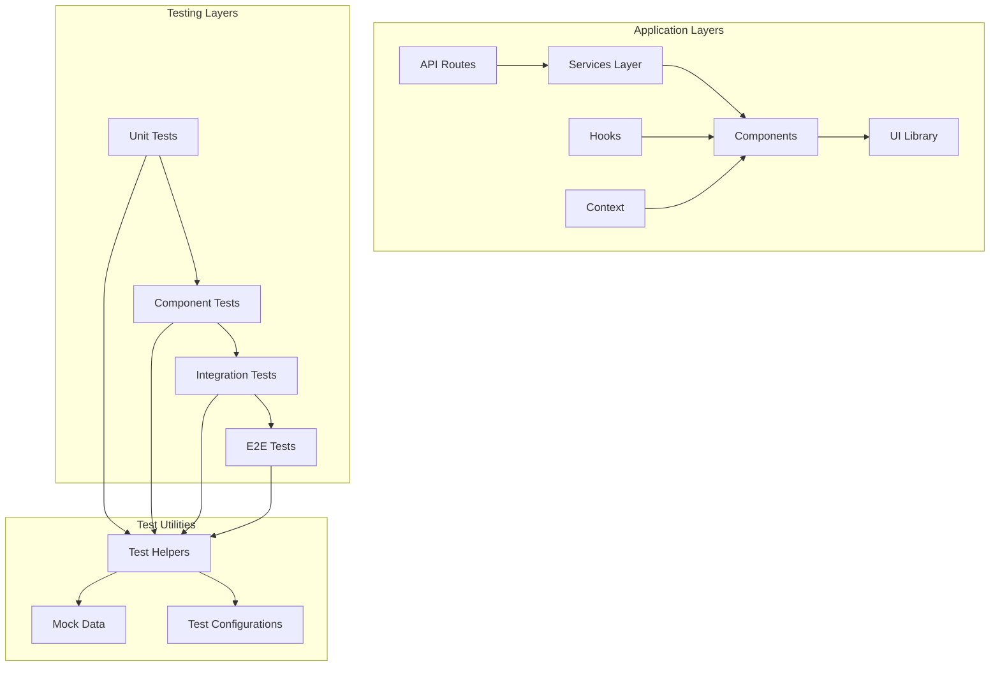
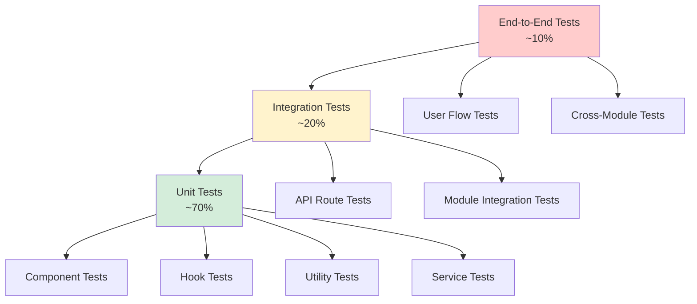
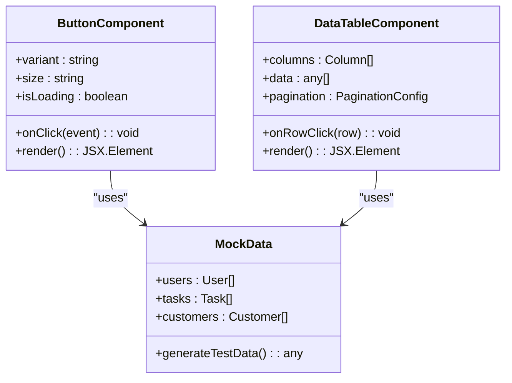
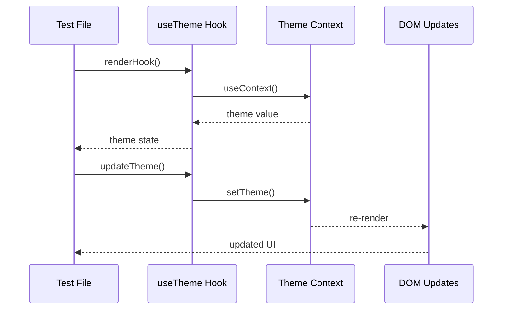
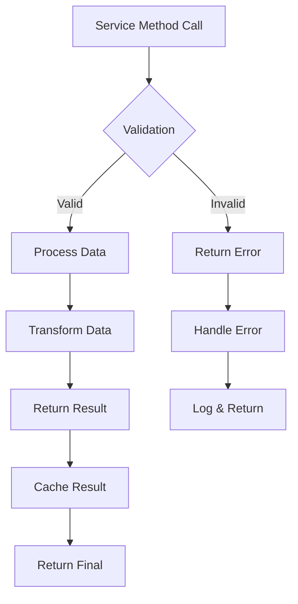
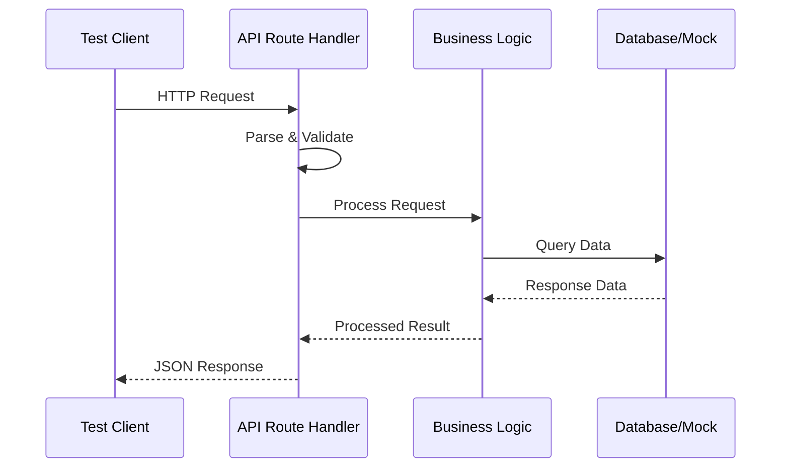
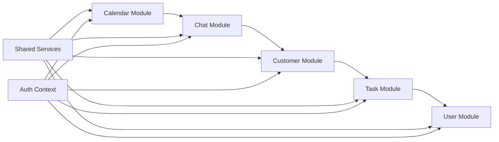
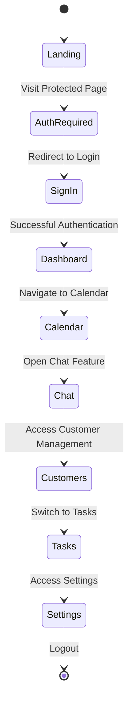
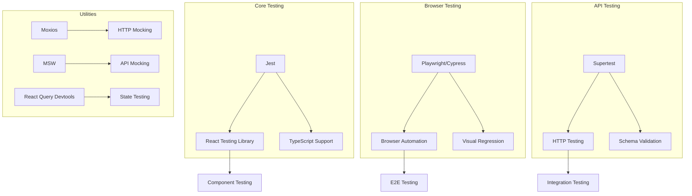

# Testing Strategy

<cite>
**Referenced Files in This Document**
- [package.json](file://package.json)
- [next.config.ts](file://next.config.ts)
- [tsconfig.json](file://tsconfig.json)
- [src/app/api/auth/[...nextauth]/route.ts](file://src/app/api/auth/[...nextauth]/route.ts)
- [src/app/api/customers/route.ts](file://src/app/api/customers/route.ts)
- [src/app/api/tasks/route.ts](file://src/app/api/tasks/route.ts)
- [src/components/ui/button.tsx](file://src/components/ui/button.tsx)
- [src/components/ui/data-table.tsx](file://src/components/ui/data-table.tsx)
- [src/hooks/use-theme.ts](file://src/hooks/use-theme.ts)
- [src/modules/calendar/services/calendar-services.ts](file://src/modules/calendar/services/calendar-services.ts)
- [src/modules/chat/services/chat-services.ts](file://src/modules/chat/services/chat-services.ts)
- [src/modules/customers/services/customer-services.ts](file://src/modules/customers/services/customer-services.ts)
- [src/modules/tasks/services/task-services.ts](file://src/modules/tasks/services/task-services.ts)
- [src/modules/users/services/user-services.ts](file://src/modules/users/services/user-services.ts)
- [src/lib/utils.ts](file://src/lib/utils.ts)
</cite>

## Table of Contents
1. [Introduction](#introduction)
2. [Project Structure](#project-structure)
3. [Core Components](#core-components)
4. [Architecture Overview](#architecture-overview)
5. [Detailed Component Analysis](#detailed-component-analysis)
6. [Dependency Analysis](#dependency-analysis)
7. [Performance Considerations](#performance-considerations)
8. [Troubleshooting Guide](#troubleshooting-guide)
9. [Conclusion](#conclusion)
10. [Appendices](#appendices)

## Introduction

This document outlines a comprehensive testing strategy for the Claude Code Shadcn Dashboard, a Next.js-based admin dashboard application. The testing approach covers unit testing, component testing, integration testing, and end-to-end testing methodologies tailored to the application's architecture and technology stack.

The dashboard features multiple modules including calendar management, chat functionality, customer management, task tracking, and user administration. Each module contains components, services, hooks, and API routes that require thorough testing coverage.

## Project Structure

The application follows a modular architecture with clear separation of concerns:



**Diagram sources**
- [package.json](file://package.json)
- [next.config.ts](file://next.config.ts)

The testing infrastructure should be organized to mirror the application structure, ensuring maintainability and clarity.

## Core Components

### Testing Framework Selection

Based on the Next.js 14+ architecture and React 18 usage, the recommended testing stack includes:

- **Unit Testing**: Jest with TypeScript support
- **Component Testing**: React Testing Library with Jest
- **Integration Testing**: Jest with custom test utilities
- **End-to-End Testing**: Playwright or Cypress
- **API Testing**: Jest with Supertest or native fetch mocking

### Test Organization Structure

```
tests/
├── unit/
│   ├── components/
│   ├── hooks/
│   ├── utils/
│   └── lib/
├── integration/
│   ├── api/
│   ├── services/
│   └── modules/
├── e2e/
│   ├── auth.spec.ts
│   ├── dashboard.spec.ts
│   └── features/
├── fixtures/
│   ├── mock-data/
│   └── test-helpers/
└── setup/
    ├── jest.setup.ts
    └── test-utils.ts
```

**Section sources**
- [package.json](file://package.json)
- [next.config.ts](file://next.config.ts)

## Architecture Overview

The testing architecture follows a pyramid approach with emphasis on unit tests:



**Diagram sources**
- [src/app/api/auth/[...nextauth]/route.ts](file://src/app/api/auth/[...nextauth]/route.ts)
- [src/app/api/customers/route.ts](file://src/app/api/customers/route.ts)

## Detailed Component Analysis

### Unit Testing Strategy

#### Component Testing

For UI components, focus on behavior rather than implementation details:



**Diagram sources**
- [src/components/ui/button.tsx](file://src/components/ui/button.tsx)
- [src/components/ui/data-table.tsx](file://src/components/ui/data-table.tsx)

Key testing patterns for components:
- Render components with different props combinations
- Test user interactions (clicks, input changes)
- Verify conditional rendering based on state
- Test accessibility attributes
- Validate styling classes based on variants

#### Hook Testing

Custom hooks require specialized testing approaches:



**Diagram sources**
- [src/hooks/use-theme.ts](file://src/hooks/use-theme.ts)

Hook testing considerations:
- Mock context providers when necessary
- Test state updates and side effects
- Verify cleanup functions
- Test async operations with proper waiting

#### Service Layer Testing

Service modules handle business logic and data operations:



**Diagram sources**
- [src/modules/calendar/services/calendar-services.ts](file://src/modules/calendar/services/calendar-services.ts)
- [src/modules/chat/services/chat-services.ts](file://src/modules/chat/services/chat-services.ts)

Service testing patterns:
- Mock external dependencies (API calls, database)
- Test error handling scenarios
- Verify data transformation logic
- Test caching mechanisms
- Validate input/output schemas

### Integration Testing Strategy

#### API Route Testing

Next.js API routes require specific testing approaches:



**Diagram sources**
- [src/app/api/auth/[...nextauth]/route.ts](file://src/app/api/auth/[...nextauth]/route.ts)
- [src/app/api/customers/route.ts](file://src/app/api/customers/route.ts)
- [src/app/api/tasks/route.ts](file://src/app/api/tasks/route.ts)

API testing considerations:
- Test all HTTP methods (GET, POST, PUT, DELETE)
- Validate request/response schemas
- Test authentication and authorization
- Handle async operations properly
- Mock database and external services

#### Module Integration Testing

Test interactions between different modules:



**Diagram sources**
- [src/modules/calendar/services/calendar-services.ts](file://src/modules/calendar/services/calendar-services.ts)
- [src/modules/chat/services/chat-services.ts](file://src/modules/chat/services/chat-services.ts)
- [src/modules/customers/services/customer-services.ts](file://src/modules/customers/services/customer-services.ts)
- [src/modules/tasks/services/task-services.ts](file://src/modules/tasks/services/task-services.ts)
- [src/modules/users/services/user-services.ts](file://src/modules/users/services/user-services.ts)

### End-to-End Testing Strategy

#### User Flow Testing

Critical user journeys should be tested end-to-end:



**Diagram sources**
- [src/app/(auth)/sign-in/page.tsx](file://src/app/(auth)/sign-in/page.tsx)
- [src/app/(private)/dashboard/page.tsx](file://src/app/(private)/dashboard/page.tsx)
- [src/app/(private)/calendar/page.tsx](file://src/app/(private)/calendar/page.tsx)

E2E testing priorities:
- Authentication flows
- Navigation between major features
- Data persistence across sessions
- Cross-browser compatibility
- Performance benchmarks

## Dependency Analysis

### External Dependencies for Testing



**Diagram sources**
- [package.json](file://package.json)
- [tsconfig.json](file://tsconfig.json)

### Test Configuration Setup

Key configuration files needed:

1. **Jest Configuration**: TypeScript support, module resolution, test environment
2. **React Testing Library**: Custom queries, screen utilities
3. **Playwright/Cypress**: Browser configurations, test runners
4. **Mock Data**: Centralized test fixtures and helpers

**Section sources**
- [package.json](file://package.json)
- [tsconfig.json](file://tsconfig.json)

## Performance Considerations

### Test Performance Optimization

- **Parallel Test Execution**: Configure Jest to run tests in parallel
- **Test Isolation**: Ensure tests don't share state
- **Mock Efficiency**: Use efficient mocking strategies
- **Database Mocking**: Implement fast in-memory databases for integration tests
- **Snapshot Testing**: Use judiciously to avoid performance degradation

### Continuous Integration Setup

Recommended CI/CD pipeline stages:

1. **Linting & Type Checking**: Fast feedback on code quality
2. **Unit Tests**: Parallel execution for quick results
3. **Integration Tests**: Sequential execution for reliability
4. **E2E Tests**: Run on specific branches or schedules
5. **Performance Tests**: Baseline comparisons

## Troubleshooting Guide

### Common Testing Issues

#### Async Operations
- Use proper waiting mechanisms (waitFor, findBy*)
- Handle promises correctly in tests
- Mock setTimeout and setInterval appropriately

#### Component Rendering
- Ensure proper wrapper components are provided
- Handle context providers correctly
- Mock third-party libraries effectively

#### API Testing
- Mock network requests consistently
- Handle authentication tokens in tests
- Test error scenarios comprehensively

#### State Management
- Reset state between tests
- Mock context providers properly
- Test async state updates

**Section sources**
- [src/lib/utils.ts](file://src/lib/utils.ts)
- [src/modules/calendar/services/calendar-services.ts](file://src/modules/calendar/services/calendar-services.ts)

## Conclusion

This testing strategy provides a comprehensive approach to ensuring the quality and reliability of the Claude Code Shadcn Dashboard. By implementing the recommended testing layers, frameworks, and practices, the team can maintain high code quality while enabling rapid development and confident deployments.

The key principles emphasized include:
- Comprehensive test coverage across all layers
- Clear separation of concerns in test organization
- Efficient mocking strategies for external dependencies
- Performance-conscious testing approaches
- Automated testing in continuous integration pipelines

## Appendices

### Recommended Testing Libraries

- **Unit Testing**: Jest, React Testing Library
- **Component Testing**: Storybook with testing addons
- **API Testing**: Supertest, MSW (Mock Service Worker)
- **E2E Testing**: Playwright (recommended for modern web apps)
- **Performance Testing**: Lighthouse CI, WebPageTest
- **Visual Testing**: Percy, Chromatic

### Test Coverage Goals

- **Unit Tests**: 80%+ coverage
- **Component Tests**: 70%+ coverage
- **Integration Tests**: Critical paths covered
- **E2E Tests**: All user journeys validated