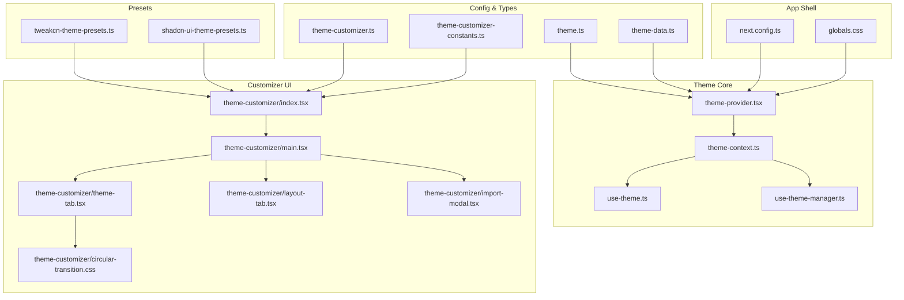
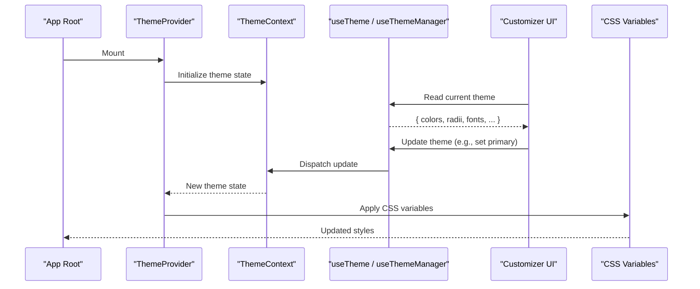
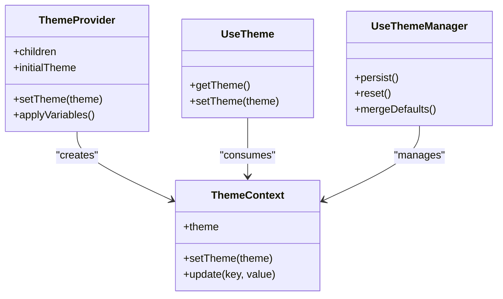
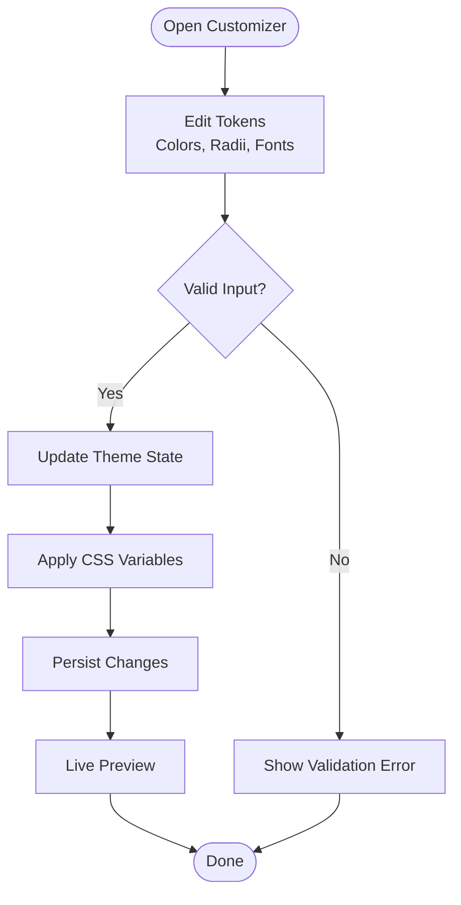
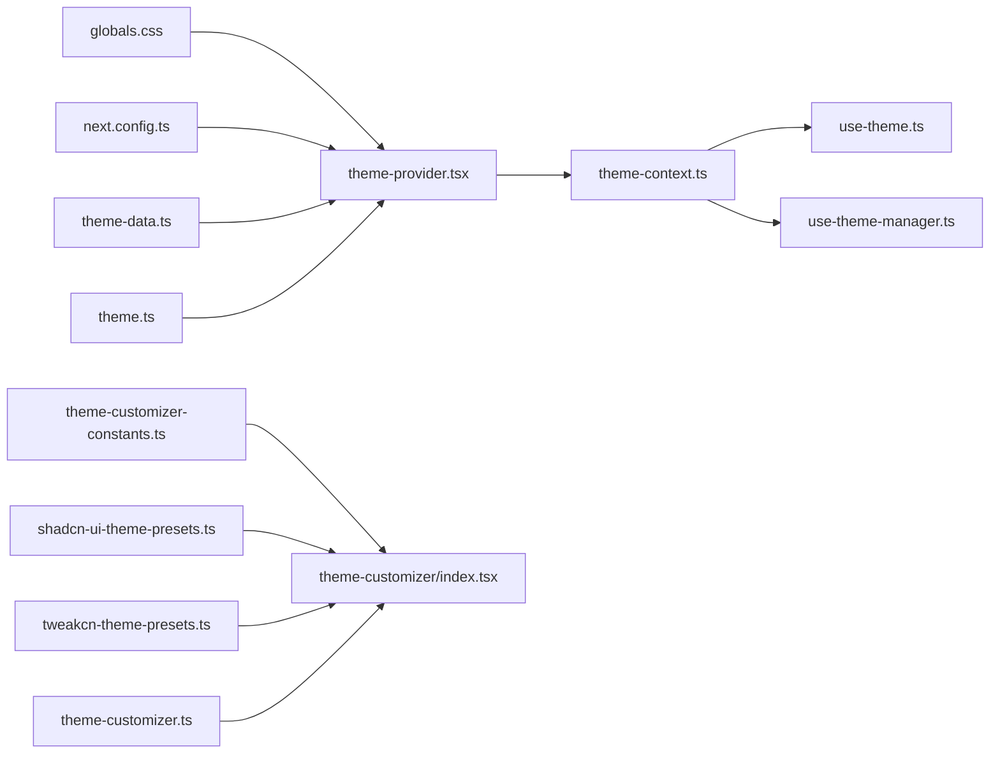

# Custom Themes Development

<cite>
**Referenced Files in This Document**
- [theme-provider.tsx](file://src/components/theme-provider.tsx)
- [theme-context.ts](file://src/contexts/theme-context.ts)
- [use-theme.ts](file://src/hooks/use-theme.ts)
- [use-theme-manager.ts](file://src/hooks/use-theme-manager.ts)
- [theme-data.ts](file://src/config/theme-data.ts)
- [theme-customizer-constants.ts](file://src/config/theme-customizer-constants.ts)
- [shadcn-ui-theme-presets.ts](file://src/utils/shadcn-ui-theme-presets.ts)
- [tweakcn-theme-presets.ts](file://src/utils/tweakcn-theme-presets.ts)
- [theme.ts](file://src/types/theme.ts)
- [theme-customizer.ts](file://src/types/theme-customizer.ts)
- [index.tsx](file://src/components/theme-customizer/index.tsx)
- [main.tsx](file://src/components/theme-customizer/main.tsx)
- [theme-tab.tsx](file://src/components/theme-customizer/theme-tab.tsx)
- [layout-tab.tsx](file://src/components/theme-customizer/layout-tab.tsx)
- [import-modal.tsx](file://src/components/theme-customizer/import-modal.tsx)
- [circular-transition.css](file://src/components/theme-customizer/circular-transition.css)
- [globals.css](file://src/app/globals.css)
- [components.json](file://components.json)
- [next.config.ts](file://next.config.ts)
</cite>

## Table of Contents
1. [Introduction](#introduction)
2. [Project Structure](#project-structure)
3. [Core Components](#core-components)
4. [Architecture Overview](#architecture-overview)
5. [Detailed Component Analysis](#detailed-component-analysis)
6. [Dependency Analysis](#dependency-analysis)
7. [Performance Considerations](#performance-considerations)
8. [Troubleshooting Guide](#troubleshooting-guide)
9. [Conclusion](#conclusion)
10. [Appendices](#appendices)

## Introduction
This document explains how to develop custom themes from scratch for a Next.js application built with ShadCN UI. It covers the theme creation process, color palette design principles, component-specific styling overrides, creating theme presets, integrating with ShadCN components, and maintaining consistency across the app. It also includes step-by-step guides for building complete theme packages, testing themes across different components, distributing custom themes, and best practices for naming and versioning.

## Project Structure
The theme system is centered around:
- A theme provider and context for runtime state
- Hooks to read and update theme settings
- Configuration files that define tokens and constants
- Utility modules for preset generation and transformation
- Type definitions ensuring type safety
- A theme customizer UI for live preview and import/export

**Diagram sources**
- [globals.css](file://src/app/globals.css)
- [next.config.ts](file://next.config.ts)
- [theme-provider.tsx](file://src/components/theme-provider.tsx)
- [theme-context.ts](file://src/contexts/theme-context.ts)
- [use-theme.ts](file://src/hooks/use-theme.ts)
- [use-theme-manager.ts](file://src/hooks/use-theme-manager.ts)
- [theme-data.ts](file://src/config/theme-data.ts)
- [theme-customizer-constants.ts](file://src/config/theme-customizer-constants.ts)
- [theme.ts](file://src/types/theme.ts)
- [theme-customizer.ts](file://src/types/theme-customizer.ts)
- [shadcn-ui-theme-presets.ts](file://src/utils/shadcn-ui-theme-presets.ts)
- [tweakcn-theme-presets.ts](file://src/utils/tweakcn-theme-presets.ts)
- [index.tsx](file://src/components/theme-customizer/index.tsx)
- [main.tsx](file://src/components/theme-customizer/main.tsx)
- [theme-tab.tsx](file://src/components/theme-customizer/theme-tab.tsx)
- [layout-tab.tsx](file://src/components/theme-customizer/layout-tab.tsx)
- [import-modal.tsx](file://src/components/theme-customizer/import-modal.tsx)
- [circular-transition.css](file://src/components/theme-customizer/circular-transition.css)

**Section sources**
- [theme-provider.tsx](file://src/components/theme-provider.tsx)
- [theme-context.ts](file://src/contexts/theme-context.ts)
- [use-theme.ts](file://src/hooks/use-theme.ts)
- [use-theme-manager.ts](file://src/hooks/use-theme-manager.ts)
- [theme-data.ts](file://src/config/theme-data.ts)
- [theme-customizer-constants.ts](file://src/config/theme-customizer-constants.ts)
- [shadcn-ui-theme-presets.ts](file://src/utils/shadcn-ui-theme-presets.ts)
- [tweakcn-theme-presets.ts](file://src/utils/tweakcn-theme-presets.ts)
- [theme.ts](file://src/types/theme.ts)
- [theme-customizer.ts](file://src/types/theme-customizer.ts)
- [index.tsx](file://src/components/theme-customizer/index.tsx)
- [main.tsx](file://src/components/theme-customizer/main.tsx)
- [theme-tab.tsx](file://src/components/theme-customizer/theme-tab.tsx)
- [layout-tab.tsx](file://src/components/theme-customizer/layout-tab.tsx)
- [import-modal.tsx](file://src/components/theme-customizer/import-modal.tsx)
- [circular-transition.css](file://src/components/theme-customizer/circular-transition.css)
- [globals.css](file://src/app/globals.css)
- [components.json](file://components.json)
- [next.config.ts](file://next.config.ts)

## Core Components
- Theme Provider: Supplies theme state and setters to the React tree and applies CSS variables to the root element.
- Theme Context: Holds current theme values (colors, radii, fonts, layout options) and exposes actions to update them.
- useTheme Hook: Provides convenient access to theme values and setters within components.
- useThemeManager Hook: Encapsulates persistence, defaults, and safe updates for theme state.
- Theme Data and Constants: Centralized tokens and configuration used by the customizer and presets.
- Preset Utilities: Generate or transform theme objects for ShadCN and other UI systems.
- Types: Strongly typed models for theme structure and customizer state.
- Customizer UI: Live editor for colors, typography, spacing, and layout; supports import/export and transitions.

Key responsibilities:
- Apply CSS variables at runtime based on theme state.
- Keep theme state consistent across components via context.
- Provide hooks for reading/updating theme without direct DOM manipulation.
- Offer presets and utilities to bootstrap new themes quickly.
- Ensure type safety across theme mutations.

**Section sources**
- [theme-provider.tsx](file://src/components/theme-provider.tsx)
- [theme-context.ts](file://src/contexts/theme-context.ts)
- [use-theme.ts](file://src/hooks/use-theme.ts)
- [use-theme-manager.ts](file://src/hooks/use-theme-manager.ts)
- [theme-data.ts](file://src/config/theme-data.ts)
- [theme-customizer-constants.ts](file://src/config/theme-customizer-constants.ts)
- [shadcn-ui-theme-presets.ts](file://src/utils/shadcn-ui-theme-presets.ts)
- [tweakcn-theme-presets.ts](file://src/utils/tweakcn-theme-presets.ts)
- [theme.ts](file://src/types/theme.ts)
- [theme-customizer.ts](file://src/types/theme-customizer.ts)

## Architecture Overview
The theme architecture follows a unidirectional data flow:
- The Theme Provider initializes theme state and injects it into the React tree.
- Consumers call useTheme or useThemeManager to read or update theme values.
- Updates trigger re-renders and apply CSS variables to the document root.
- Presets and constants provide baseline configurations and transformations.
- The Customizer UI edits theme state and persists changes.

**Diagram sources**
- [theme-provider.tsx](file://src/components/theme-provider.tsx)
- [theme-context.ts](file://src/contexts/theme-context.ts)
- [use-theme.ts](file://src/hooks/use-theme.ts)
- [use-theme-manager.ts](file://src/hooks/use-theme-manager.ts)
- [index.tsx](file://src/components/theme-customizer/index.tsx)

## Detailed Component Analysis

### Theme Provider and Context
- Provider wraps the app and supplies theme state and setters.
- Context holds the current theme object and exposes actions.
- On mount, Provider sets initial values from defaults or persisted storage.
- Updates propagate through context and are applied as CSS variables.

**Diagram sources**
- [theme-provider.tsx](file://src/components/theme-provider.tsx)
- [theme-context.ts](file://src/contexts/theme-context.ts)
- [use-theme.ts](file://src/hooks/use-theme.ts)
- [use-theme-manager.ts](file://src/hooks/use-theme-manager.ts)

**Section sources**
- [theme-provider.tsx](file://src/components/theme-provider.tsx)
- [theme-context.ts](file://src/contexts/theme-context.ts)
- [use-theme.ts](file://src/hooks/use-theme.ts)
- [use-theme-manager.ts](file://src/hooks/use-theme-manager.ts)

### Theme Data and Constants
- Centralizes token names, default values, and mapping rules.
- Ensures consistency between UI controls and underlying CSS variables.
- Used by presets and customizer to validate and normalize inputs.

Best practices:
- Define semantic tokens (primary, secondary, background, foreground).
- Separate light/dark variants where applicable.
- Keep token names stable to avoid breaking changes.

**Section sources**
- [theme-data.ts](file://src/config/theme-data.ts)
- [theme-customizer-constants.ts](file://src/config/theme-customizer-constants.ts)

### Preset Utilities
- shadcn-ui-theme-presets.ts: Generates theme objects compatible with ShadCN’s variable-based theming.
- tweakcn-theme-presets.ts: Applies transformations or enhancements to existing presets.

Usage patterns:
- Start from a base preset and override specific tokens.
- Validate outputs against type definitions before applying.
- Export presets for distribution as standalone packages.

**Section sources**
- [shadcn-ui-theme-presets.ts](file://src/utils/shadcn-ui-theme-presets.ts)
- [tweakcn-theme-presets.ts](file://src/utils/tweakcn-theme-presets.ts)

### Types
- theme.ts: Defines the shape of the theme object (colors, radii, fonts, layout flags).
- theme-customizer.ts: Models customizer state, UI interactions, and import/export payloads.

Benefits:
- Enforces correct keys and value types.
- Prevents runtime errors when updating theme state.
- Enables IDE autocomplete and refactoring safety.

**Section sources**
- [theme.ts](file://src/types/theme.ts)
- [theme-customizer.ts](file://src/types/theme-customizer.ts)

### Theme Customizer UI
- index.tsx: Entry point for the customizer panel.
- main.tsx: Orchestrates tabs and state binding.
- theme-tab.tsx: Controls for colors, typography, and spacing.
- layout-tab.tsx: Controls for layout options (sidebar, header, etc.).
- import-modal.tsx: Import/export JSON for sharing themes.
- circular-transition.css: Smooth transition effects during theme changes.

Workflow:
- User edits controls -> hook updates context -> provider applies CSS variables -> UI reflects changes.

**Diagram sources**
- [index.tsx](file://src/components/theme-customizer/index.tsx)
- [main.tsx](file://src/components/theme-customizer/main.tsx)
- [theme-tab.tsx](file://src/components/theme-customizer/theme-tab.tsx)
- [layout-tab.tsx](file://src/components/theme-customizer/layout-tab.tsx)
- [import-modal.tsx](file://src/components/theme-customizer/import-modal.tsx)
- [circular-transition.css](file://src/components/theme-customizer/circular-transition.css)

**Section sources**
- [index.tsx](file://src/components/theme-customizer/index.tsx)
- [main.tsx](file://src/components/theme-customizer/main.tsx)
- [theme-tab.tsx](file://src/components/theme-customizer/theme-tab.tsx)
- [layout-tab.tsx](file://src/components/theme-customizer/layout-tab.tsx)
- [import-modal.tsx](file://src/components/theme-customizer/import-modal.tsx)
- [circular-transition.css](file://src/components/theme-customizer/circular-transition.css)

## Dependency Analysis
The theme system has clear boundaries:
- Providers and hooks depend on context and config.
- Customizer UI depends on hooks and presets.
- Globals and Next config influence how variables are loaded and processed.

**Diagram sources**
- [globals.css](file://src/app/globals.css)
- [next.config.ts](file://next.config.ts)
- [theme-provider.tsx](file://src/components/theme-provider.tsx)
- [theme-context.ts](file://src/contexts/theme-context.ts)
- [use-theme.ts](file://src/hooks/use-theme.ts)
- [use-theme-manager.ts](file://src/hooks/use-theme-manager.ts)
- [theme-data.ts](file://src/config/theme-data.ts)
- [theme-customizer-constants.ts](file://src/config/theme-customizer-constants.ts)
- [shadcn-ui-theme-presets.ts](file://src/utils/shadcn-ui-theme-presets.ts)
- [tweakcn-theme-presets.ts](file://src/utils/tweakcn-theme-presets.ts)
- [theme.ts](file://src/types/theme.ts)
- [theme-customizer.ts](file://src/types/theme-customizer.ts)
- [index.tsx](file://src/components/theme-customizer/index.tsx)

**Section sources**
- [globals.css](file://src/app/globals.css)
- [next.config.ts](file://next.config.ts)
- [theme-provider.tsx](file://src/components/theme-provider.tsx)
- [theme-context.ts](file://src/contexts/theme-context.ts)
- [use-theme.ts](file://src/hooks/use-theme.ts)
- [use-theme-manager.ts](file://src/hooks/use-theme-manager.ts)
- [theme-data.ts](file://src/config/theme-data.ts)
- [theme-customizer-constants.ts](file://src/config/theme-customizer-constants.ts)
- [shadcn-ui-theme-presets.ts](file://src/utils/shadcn-ui-theme-presets.ts)
- [tweakcn-theme-presets.ts](file://src/utils/tweakcn-theme-presets.ts)
- [theme.ts](file://src/types/theme.ts)
- [theme-customizer.ts](file://src/types/theme-customizer.ts)
- [index.tsx](file://src/components/theme-customizer/index.tsx)

## Performance Considerations
- Minimize re-renders by batching theme updates and avoiding unnecessary context consumers.
- Prefer CSS variables over inline styles for better performance and caching.
- Debounce heavy operations in the customizer (e.g., export/import parsing).
- Keep preset transformations pure and memoized where possible.
- Avoid large CSS bundles; split variables and only include necessary tokens.

[No sources needed since this section provides general guidance]

## Troubleshooting Guide
Common issues and resolutions:
- Variables not applied: Ensure the provider mounts early and applies variables to the root element.
- Persistence failures: Check storage permissions and fallback to defaults on parse errors.
- Type mismatches: Validate theme objects against type definitions before applying.
- Customizer lag: Debounce input handlers and limit expensive recalculations.
- ShadCN mismatch: Confirm preset output matches expected variable names and structure.

**Section sources**
- [theme-provider.tsx](file://src/components/theme-provider.tsx)
- [use-theme-manager.ts](file://src/hooks/use-theme-manager.ts)
- [theme.ts](file://src/types/theme.ts)
- [shadcn-ui-theme-presets.ts](file://src/utils/shadcn-ui-theme-presets.ts)

## Conclusion
A robust theme system combines a clear provider/context model, strong typing, centralized configuration, and a user-friendly customizer. By following the steps outlined here—defining tokens, generating presets, integrating with ShadCN, and testing across components—you can build maintainable, distributable theme packages that keep your application visually consistent and easy to evolve.

[No sources needed since this section summarizes without analyzing specific files]

## Appendices

### Step-by-Step: Building a Complete Theme Package
1. Define tokens in theme-data.ts and theme-customizer-constants.ts.
2. Create a preset generator in shadcn-ui-theme-presets.ts or tweakcn-theme-presets.ts.
3. Wrap your app with the ThemeProvider and ensure globals.css loads variables.
4. Expose useTheme/useThemeManager in your components.
5. Build a minimal customizer UI using theme-tab.tsx and layout-tab.tsx patterns.
6. Add import/export via import-modal.tsx for sharing themes.
7. Test across components and pages; verify dark/light modes if supported.
8. Publish as a package with README, types, and example usage.

**Section sources**
- [theme-data.ts](file://src/config/theme-data.ts)
- [theme-customizer-constants.ts](file://src/config/theme-customizer-constants.ts)
- [shadcn-ui-theme-presets.ts](file://src/utils/shadcn-ui-theme-presets.ts)
- [tweakcn-theme-presets.ts](file://src/utils/tweakcn-theme-presets.ts)
- [theme-provider.tsx](file://src/components/theme-provider.tsx)
- [globals.css](file://src/app/globals.css)
- [use-theme.ts](file://src/hooks/use-theme.ts)
- [use-theme-manager.ts](file://src/hooks/use-theme-manager.ts)
- [theme-tab.tsx](file://src/components/theme-customizer/theme-tab.tsx)
- [layout-tab.tsx](file://src/components/theme-customizer/layout-tab.tsx)
- [import-modal.tsx](file://src/components/theme-customizer/import-modal.tsx)

### Color Palette Design Principles
- Semantic tokens: primary, secondary, accent, success, warning, error, background, foreground.
- Contrast ratios: Ensure WCAG AA compliance for text and interactive elements.
- Light/Dark variants: Maintain consistent luminance relationships across modes.
- Accessibility: Avoid relying solely on color; add icons or labels.
- Consistency: Reuse tokens across components; avoid ad-hoc colors.

[No sources needed since this section provides general guidance]

### Component-Specific Styling Overrides
- Prefer overriding CSS variables rather than component classes.
- Scope overrides to specific pages or sections using container classes.
- Validate overrides against ShadCN expectations to prevent breakage.
- Document overrides in a style guide for team alignment.

[No sources needed since this section provides general guidance]

### Integrating with ShadCN UI Components
- Use preset generators to map tokens to ShadCN variables.
- Ensure variable names match ShadCN’s expected schema.
- Test common components (buttons, inputs, dialogs) after applying a theme.
- Keep presets versioned alongside ShadCN updates.

**Section sources**
- [shadcn-ui-theme-presets.ts](file://src/utils/shadcn-ui-theme-presets.ts)
- [components.json](file://components.json)

### Testing Themes Across Components
- Create a test page that renders all major components.
- Toggle theme modes and inspect contrast and readability.
- Automate visual regression tests if possible.
- Record known issues and workarounds.

[No sources needed since this section provides general guidance]

### Distributing Custom Themes
- Package structure: src, types, presets, README, examples.
- Include a CLI or script to install and apply the theme.
- Provide migration notes for version upgrades.
- Version semantically and tag releases.

[No sources needed since this section provides general guidance]

### Naming Conventions and Versioning
- Names: kebab-case for tokens and presets (e.g., primary-color, ocean-blue).
- Versions: follow SemVer (major.minor.patch) for breaking changes.
- Deprecation: mark deprecated tokens with comments and migration paths.
- Documentation: maintain a changelog and compatibility matrix.

[No sources needed since this section provides general guidance]