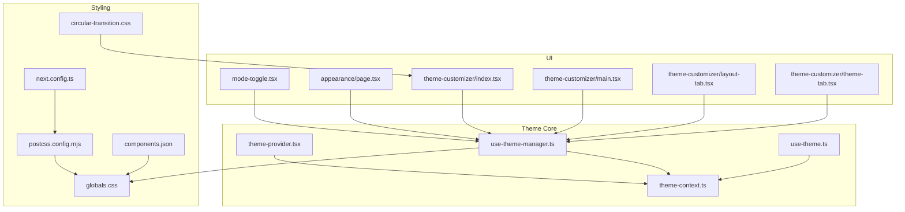
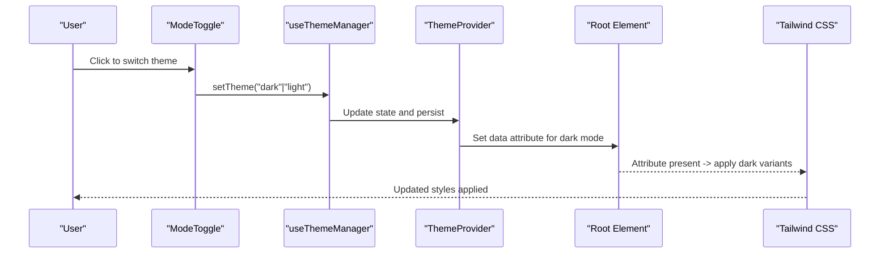
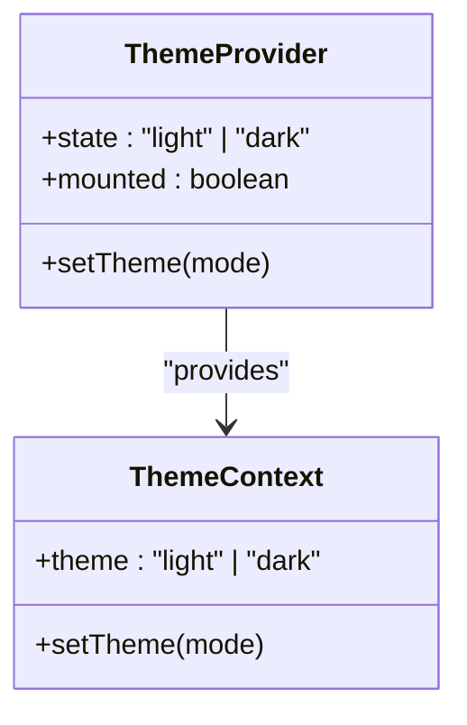
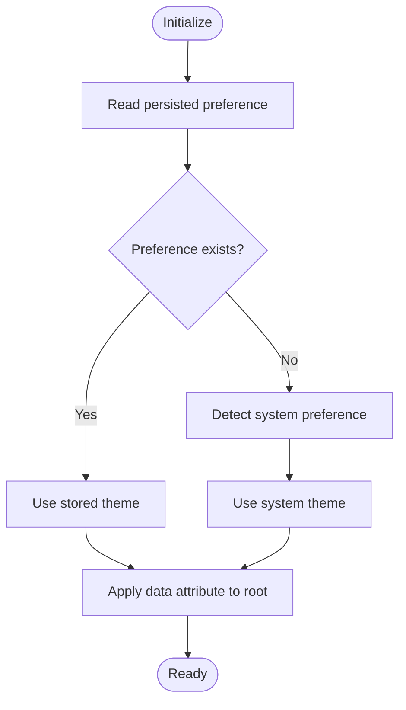
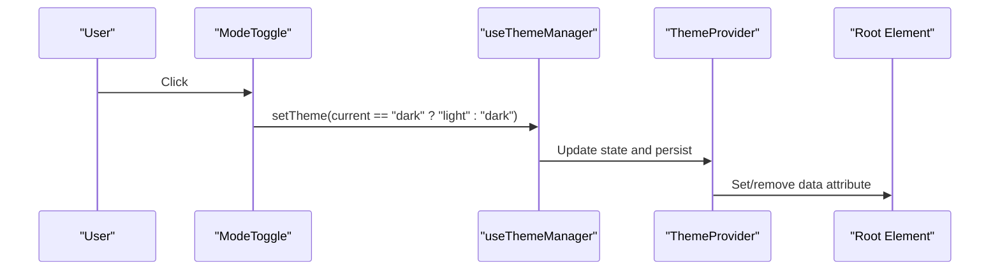
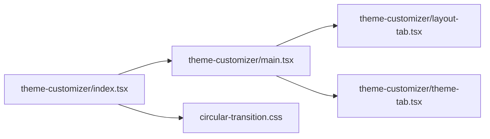
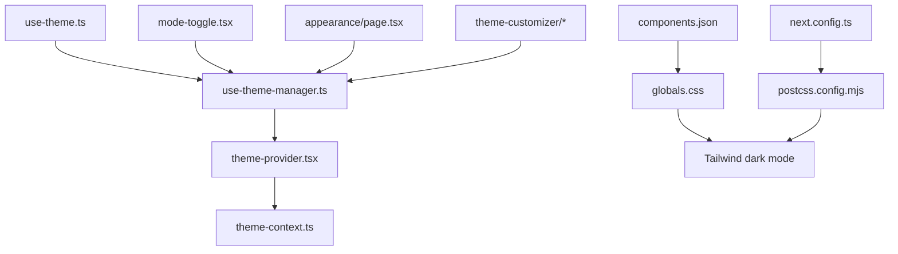

# Dark/Light Mode Implementation

<cite>
**Referenced Files in This Document**
- [mode-toggle.tsx](file://src/components/mode-toggle.tsx)
- [theme-provider.tsx](file://src/components/theme-provider.tsx)
- [use-theme-manager.ts](file://src/hooks/use-theme-manager.ts)
- [use-theme.ts](file://src/hooks/use-theme.ts)
- [theme-context.ts](file://src/contexts/theme-context.ts)
- [globals.css](file://src/app/globals.css)
- [postcss.config.mjs](file://postcss.config.mjs)
- [next.config.ts](file://next.config.ts)
- [components.json](file://components.json)
- [appearance/page.tsx](file://src/app/(private)/settings/appearance/page.tsx)
- [theme-customizer/index.tsx](file://src/components/theme-customizer/index.tsx)
- [theme-customizer/main.tsx](file://src/components/theme-customizer/main.tsx)
- [theme-customizer/layout-tab.tsx](file://src/components/theme-customizer/layout-tab.tsx)
- [theme-customizer/theme-tab.tsx](file://src/components/theme-customizer/theme-tab.tsx)
- [circular-transition.css](file://src/components/theme-customizer/circular-transition.css)
- [shadcn-ui-theme-presets.ts](file://src/utils/shadcn-ui-theme-presets.ts)
- [tweakcn-theme-presets.ts](file://src/utils/tweakcn-theme-presets.ts)
</cite>

## Table of Contents
1. [Introduction](#introduction)
2. [Project Structure](#project-structure)
3. [Core Components](#core-components)
4. [Architecture Overview](#architecture-overview)
5. [Detailed Component Analysis](#detailed-component-analysis)
6. [Dependency Analysis](#dependency-analysis)
7. [Performance Considerations](#performance-considerations)
8. [Troubleshooting Guide](#troubleshooting-guide)
9. [Conclusion](#conclusion)
10. [Appendices](#appendices)

## Introduction
This document explains the dark/light mode implementation across the application, focusing on:
- The mode toggle component and how it triggers theme changes
- CSS class switching mechanism using Tailwind’s dark mode strategy
- Tailwind configuration for dark mode
- How colors adapt between modes and component styling strategies
- Persistence of user preferences across sessions
- Adding new color variables and handling third-party components with dark mode support
- Performance optimizations for mode switching
- Browser compatibility and fallback strategies

## Project Structure
The dark/light mode system is implemented through a combination of React context, hooks, UI components, and Tailwind CSS utilities. Key areas include:
- Theme provider and context for global state
- Hooks to read and update theme state
- A toggle component used in headers and settings
- Global CSS variables and Tailwind integration
- Appearance settings page and theme customizer

**Diagram sources**
- [theme-provider.tsx](file://src/components/theme-provider.tsx)
- [theme-context.ts](file://src/contexts/theme-context.ts)
- [use-theme-manager.ts](file://src/hooks/use-theme-manager.ts)
- [use-theme.ts](file://src/hooks/use-theme.ts)
- [mode-toggle.tsx](file://src/components/mode-toggle.tsx)
- [appearance/page.tsx](file://src/app/(private)/settings/appearance/page.tsx)
- [theme-customizer/index.tsx](file://src/components/theme-customizer/index.tsx)
- [theme-customizer/main.tsx](file://src/components/theme-customizer/main.tsx)
- [theme-customizer/layout-tab.tsx](file://src/components/theme-customizer/layout-tab.tsx)
- [theme-customizer/theme-tab.tsx](file://src/components/theme-customizer/theme-tab.tsx)
- [globals.css](file://src/app/globals.css)
- [postcss.config.mjs](file://postcss.config.mjs)
- [next.config.ts](file://next.config.ts)
- [components.json](file://components.json)
- [circular-transition.css](file://src/components/theme-customizer/circular-transition.css)

**Section sources**
- [theme-provider.tsx](file://src/components/theme-provider.tsx)
- [theme-context.ts](file://src/contexts/theme-context.ts)
- [use-theme-manager.ts](file://src/hooks/use-theme-manager.ts)
- [use-theme.ts](file://src/hooks/use-theme.ts)
- [mode-toggle.tsx](file://src/components/mode-toggle.tsx)
- [appearance/page.tsx](file://src/app/(private)/settings/appearance/page.tsx)
- [theme-customizer/index.tsx](file://src/components/theme-customizer/index.tsx)
- [theme-customizer/main.tsx](file://src/components/theme-customizer/main.tsx)
- [theme-customizer/layout-tab.tsx](file://src/components/theme-customizer/layout-tab.tsx)
- [theme-customizer/theme-tab.tsx](file://src/components/theme-customizer/theme-tab.tsx)
- [globals.css](file://src/app/globals.css)
- [postcss.config.mjs](file://postcss.config.mjs)
- [next.config.ts](file://next.config.ts)
- [components.json](file://components.json)
- [circular-transition.css](file://src/components/theme-customizer/circular-transition.css)

## Core Components
- Theme Provider: Initializes theme state, persists user preference, and exposes methods to change theme. It ensures the root element has the correct data attribute for Tailwind to detect dark mode.
- Theme Context: Provides the current theme value and setter to consumers.
- useThemeManager hook: Encapsulates logic for reading/writing theme, including persistence and initial detection from system preferences.
- useTheme hook: A convenience hook to access theme state and setters within components.
- Mode Toggle: A UI control that switches between light and dark modes by invoking the theme manager.

Key responsibilities:
- Persisting user preference (e.g., via localStorage)
- Detecting system preference at first load
- Applying the appropriate data attribute to the root element
- Triggering re-renders when theme changes

**Section sources**
- [theme-provider.tsx](file://src/components/theme-provider.tsx)
- [theme-context.ts](file://src/contexts/theme-context.ts)
- [use-theme-manager.ts](file://src/hooks/use-theme-manager.ts)
- [use-theme.ts](file://src/hooks/use-theme.ts)
- [mode-toggle.tsx](file://src/components/mode-toggle.tsx)

## Architecture Overview
The theme system follows a unidirectional data flow:
- User interaction with the toggle or appearance settings updates theme state via the manager hook.
- The provider applies the theme to the DOM by setting a data attribute on the root element.
- Tailwind uses this attribute to apply dark variants to utility classes.
- Global CSS variables define semantic tokens that adapt per mode.

**Diagram sources**
- [mode-toggle.tsx](file://src/components/mode-toggle.tsx)
- [use-theme-manager.ts](file://src/hooks/use-theme-manager.ts)
- [theme-provider.tsx](file://src/components/theme-provider.tsx)
- [globals.css](file://src/app/globals.css)
- [postcss.config.mjs](file://postcss.config.mjs)

## Detailed Component Analysis

### Theme Provider and Context
- Purpose: Provide global theme state and setter; ensure the root element reflects the active theme.
- Behavior:
  - On mount, reads persisted preference or falls back to system preference.
  - Applies the corresponding data attribute to the root element.
  - Exposes a setter to update theme and persist changes.
- Integration:
  - Consumed by all components via context or hooks.
  - Ensures consistent theme across the app.

**Diagram sources**
- [theme-provider.tsx](file://src/components/theme-provider.tsx)
- [theme-context.ts](file://src/contexts/theme-context.ts)

**Section sources**
- [theme-provider.tsx](file://src/components/theme-provider.tsx)
- [theme-context.ts](file://src/contexts/theme-context.ts)

### Theme Manager Hook
- Responsibilities:
  - Initialize theme from storage or system preference.
  - Persist theme to storage on change.
  - Apply data attribute to root element.
  - Handle SSR-safe initialization.
- Usage:
  - Used by the provider and exposed to components via a convenience hook.

**Diagram sources**
- [use-theme-manager.ts](file://src/hooks/use-theme-manager.ts)

**Section sources**
- [use-theme-manager.ts](file://src/hooks/use-theme-manager.ts)

### Convenience Hook (useTheme)
- Purpose: Simplify access to theme state and setter in components.
- Typical usage:
  - Read current theme.
  - Call setter to switch modes.

**Section sources**
- [use-theme.ts](file://src/hooks/use-theme.ts)

### Mode Toggle Component
- Functionality:
  - Renders a button or icon to toggle between light and dark modes.
  - Invokes the theme setter from the manager hook.
  - May reflect current mode visually (e.g., sun/moon icons).
- Placement:
  - Commonly placed in header or settings panel.

**Diagram sources**
- [mode-toggle.tsx](file://src/components/mode-toggle.tsx)
- [use-theme-manager.ts](file://src/hooks/use-theme-manager.ts)
- [theme-provider.tsx](file://src/components/theme-provider.tsx)

**Section sources**
- [mode-toggle.tsx](file://src/components/mode-toggle.tsx)

### Appearance Settings Page
- Purpose: Central place for users to adjust theme-related options.
- Features:
  - Switch between light/dark modes.
  - Potentially integrate with theme customizer for advanced options.

**Section sources**
- [appearance/page.tsx](file://src/app/(private)/settings/appearance/page.tsx)

### Theme Customizer
- Components:
  - Main orchestrator for theme customization UI.
  - Tabs for layout and theme-specific options.
  - Optional circular transition effect during theme changes.
- Integration:
  - Uses the same theme manager to apply changes consistently.

**Diagram sources**
- [theme-customizer/index.tsx](file://src/components/theme-customizer/index.tsx)
- [theme-customizer/main.tsx](file://src/components/theme-customizer/main.tsx)
- [theme-customizer/layout-tab.tsx](file://src/components/theme-customizer/layout-tab.tsx)
- [theme-customizer/theme-tab.tsx](file://src/components/theme-customizer/theme-tab.tsx)
- [circular-transition.css](file://src/components/theme-customizer/circular-transition.css)

**Section sources**
- [theme-customizer/index.tsx](file://src/components/theme-customizer/index.tsx)
- [theme-customizer/main.tsx](file://src/components/theme-customizer/main.tsx)
- [theme-customizer/layout-tab.tsx](file://src/components/theme-customizer/layout-tab.tsx)
- [theme-customizer/theme-tab.tsx](file://src/components/theme-customizer/theme-tab.tsx)
- [circular-transition.css](file://src/components/theme-customizer/circular-transition.css)

## Dependency Analysis
- Theme core depends on:
  - React context for state distribution.
  - Local storage for persistence.
  - DOM APIs to set attributes on the root element.
- UI components depend on:
  - Theme hooks/context for reading and updating theme.
- Styling depends on:
  - Tailwind’s dark mode strategy (attribute-based).
  - Global CSS variables for semantic tokens.

**Diagram sources**
- [theme-provider.tsx](file://src/components/theme-provider.tsx)
- [theme-context.ts](file://src/contexts/theme-context.ts)
- [use-theme-manager.ts](file://src/hooks/use-theme-manager.ts)
- [use-theme.ts](file://src/hooks/use-theme.ts)
- [mode-toggle.tsx](file://src/components/mode-toggle.tsx)
- [appearance/page.tsx](file://src/app/(private)/settings/appearance/page.tsx)
- [theme-customizer/index.tsx](file://src/components/theme-customizer/index.tsx)
- [theme-customizer/main.tsx](file://src/components/theme-customizer/main.tsx)
- [theme-customizer/layout-tab.tsx](file://src/components/theme-customizer/layout-tab.tsx)
- [theme-customizer/theme-tab.tsx](file://src/components/theme-customizer/theme-tab.tsx)
- [globals.css](file://src/app/globals.css)
- [postcss.config.mjs](file://postcss.config.mjs)
- [next.config.ts](file://next.config.ts)
- [components.json](file://components.json)

**Section sources**
- [theme-provider.tsx](file://src/components/theme-provider.tsx)
- [theme-context.ts](file://src/contexts/theme-context.ts)
- [use-theme-manager.ts](file://src/hooks/use-theme-manager.ts)
- [use-theme.ts](file://src/hooks/use-theme.ts)
- [mode-toggle.tsx](file://src/components/mode-toggle.tsx)
- [appearance/page.tsx](file://src/app/(private)/settings/appearance/page.tsx)
- [theme-customizer/index.tsx](file://src/components/theme-customizer/index.tsx)
- [theme-customizer/main.tsx](file://src/components/theme-customizer/main.tsx)
- [theme-customizer/layout-tab.tsx](file://src/components/theme-customizer/layout-tab.tsx)
- [theme-customizer/theme-tab.tsx](file://src/components/theme-customizer/theme-tab.tsx)
- [globals.css](file://src/app/globals.css)
- [postcss.config.mjs](file://postcss.config.mjs)
- [next.config.ts](file://next.config.ts)
- [components.json](file://components.json)

## Performance Considerations
- Minimize re-renders:
  - Keep theme state centralized and avoid unnecessary subscriptions.
  - Use memoization where appropriate in components that consume theme.
- Efficient DOM updates:
  - Apply a single data attribute to the root element rather than toggling multiple classes.
- Avoid layout thrashing:
  - Batch style changes; avoid synchronous reads/writes to layout properties during theme transitions.
- Optimize transitions:
  - Use CSS transitions sparingly and prefer GPU-accelerated properties.
  - Consider disabling heavy animations during initial theme application.
- Third-party libraries:
  - Prefer libraries that respect CSS variables or Tailwind dark mode.
  - If necessary, wrap them in containers scoped to theme changes.

[No sources needed since this section provides general guidance]

## Troubleshooting Guide
Common issues and resolutions:
- Theme not applying on first load:
  - Ensure the provider initializes before rendering UI and sets the root data attribute early.
  - Verify SSR hydration does not mismatch the expected attribute.
- Tailwind dark variants not working:
  - Confirm Tailwind is configured to use attribute-based dark mode and that the root element has the correct data attribute.
  - Check that global CSS variables are defined under both light and dark contexts if used.
- Flash of incorrect theme:
  - Inline script to apply theme synchronously before paint can prevent FOUC.
  - Ensure persistence reads occur quickly and do not block rendering.
- Third-party components ignoring dark mode:
  - Inspect computed styles to see if Tailwind dark variants are being applied.
  - Override with CSS variables or component-specific props if supported.

**Section sources**
- [theme-provider.tsx](file://src/components/theme-provider.tsx)
- [use-theme-manager.ts](file://src/hooks/use-theme-manager.ts)
- [globals.css](file://src/app/globals.css)
- [postcss.config.mjs](file://postcss.config.mjs)

## Conclusion
The dark/light mode system is built around a robust provider/hook architecture that centralizes theme state, persists user preferences, and integrates seamlessly with Tailwind’s attribute-based dark mode. By leveraging semantic CSS variables and consistent component patterns, the application achieves predictable and performant theme switching. The provided guidelines help extend themes safely, handle third-party integrations, and maintain compatibility across browsers.

[No sources needed since this section summarizes without analyzing specific files]

## Appendices

### Tailwind Dark Mode Configuration
- Strategy: Attribute-based dark mode using a data attribute on the root element.
- Configuration points:
  - Tailwind setup in PostCSS configuration.
  - Next.js configuration may influence build-time processing.
  - Shadcn UI configuration file defines default tokens and behaviors.

**Section sources**
- [postcss.config.mjs](file://postcss.config.mjs)
- [next.config.ts](file://next.config.ts)
- [components.json](file://components.json)

### Color Variables and Theming Tokens
- Semantic tokens:
  - Define base tokens for backgrounds, text, borders, and accents.
  - Provide separate values for light and dark modes.
- Presets:
  - Utility presets encapsulate common palettes for quick adoption.

**Section sources**
- [globals.css](file://src/app/globals.css)
- [shadcn-ui-theme-presets.ts](file://src/utils/shadcn-ui-theme-presets.ts)
- [tweakcn-theme-presets.ts](file://src/utils/tweakcn-theme-presets.ts)

### Adding New Color Variables
Steps:
- Add new semantic tokens in global CSS under both light and dark contexts.
- Reference tokens in components via Tailwind utilities or CSS variables.
- Validate contrast and accessibility in both modes.
- Test with existing components and third-party libraries.

**Section sources**
- [globals.css](file://src/app/globals.css)

### Handling Third-Party Components with Dark Mode Support
Strategies:
- Prefer components that accept theme-aware props or respect CSS variables.
- Wrap components in containers that inherit theme attributes.
- Use overrides sparingly and scope them to avoid global side effects.
- Monitor library updates for improved dark mode support.

[No sources needed since this section provides general guidance]

### Optimizing Performance for Mode Switching
Recommendations:
- Use CSS transitions only where necessary.
- Defer non-critical work until after theme is applied.
- Avoid expensive recalculations during theme changes.
- Profile with browser dev tools to identify bottlenecks.

[No sources needed since this section provides general guidance]

### Browser Compatibility and Fallbacks
- Modern browsers: Full support for CSS variables and attribute selectors.
- Older browsers:
  - Provide fallbacks in CSS for unsupported features.
  - Consider feature detection to gracefully degrade.
- System preference detection:
  - Use media queries to infer user preference when storage is unavailable.

[No sources needed since this section provides general guidance]