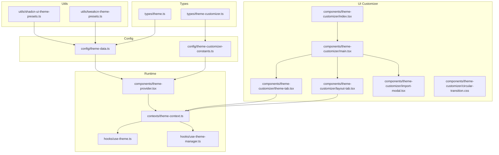
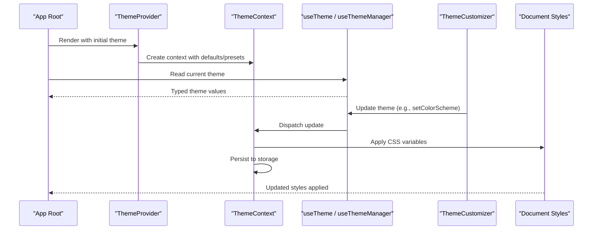
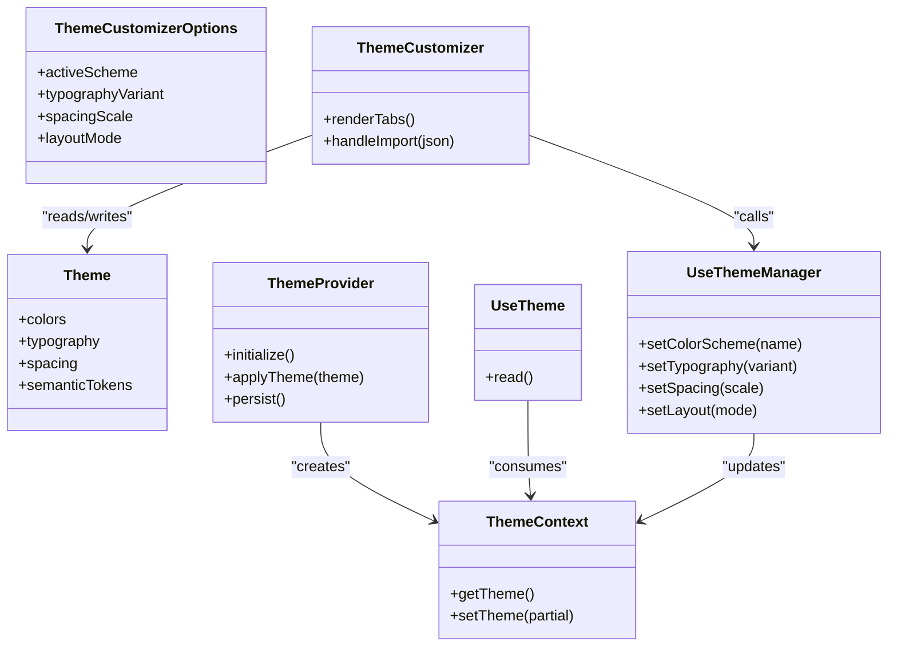
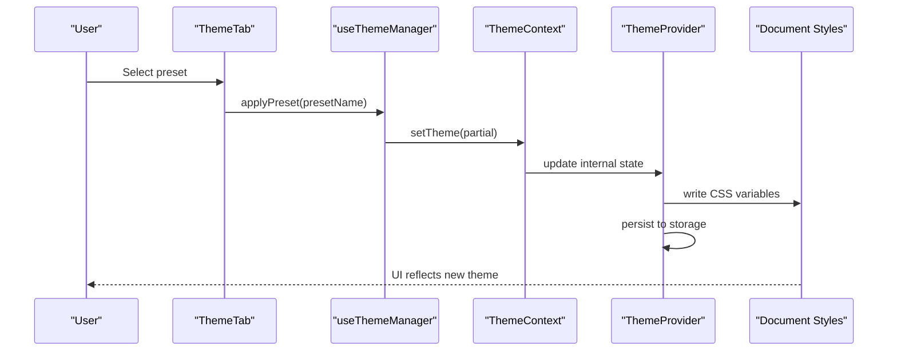
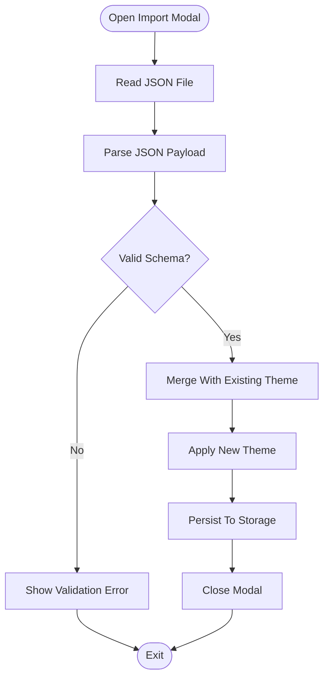
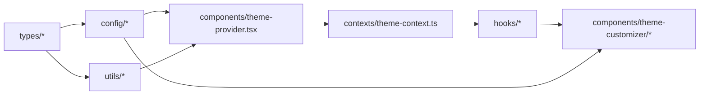

# Theme Configuration

<cite>
**Referenced Files in This Document**
- [theme-data.ts](file://src/config/theme-data.ts)
- [theme-customizer-constants.ts](file://src/config/theme-customizer-constants.ts)
- [theme.ts](file://src/types/theme.ts)
- [theme-customizer.ts](file://src/types/theme-customizer.ts)
- [shadcn-ui-theme-presets.ts](file://src/utils/shadcn-ui-theme-presets.ts)
- [tweakcn-theme-presets.ts](file://src/utils/tweakcn-theme-presets.ts)
- [theme-provider.tsx](file://src/components/theme-provider.tsx)
- [theme-context.ts](file://src/contexts/theme-context.ts)
- [use-theme.ts](file://src/hooks/use-theme.ts)
- [use-theme-manager.ts](file://src/hooks/use-theme-manager.ts)
- [theme-tab.tsx](file://src/components/theme-customizer/theme-tab.tsx)
- [layout-tab.tsx](file://src/components/theme-customizer/layout-tab.tsx)
- [index.tsx](file://src/components/theme-customizer/index.tsx)
- [main.tsx](file://src/components/theme-customizer/main.tsx)
- [import-modal.tsx](file://src/components/theme-customizer/import-modal.tsx)
- [circular-transition.css](file://src/components/theme-customizer/circular-transition.css)
</cite>

## Table of Contents
1. [Introduction](#introduction)
2. [Project Structure](#project-structure)
3. [Core Components](#core-components)
4. [Architecture Overview](#architecture-overview)
5. [Detailed Component Analysis](#detailed-component-analysis)
6. [Dependency Analysis](#dependency-analysis)
7. [Performance Considerations](#performance-considerations)
8. [Troubleshooting Guide](#troubleshooting-guide)
9. [Conclusion](#conclusion)
10. [Appendices](#appendices)

## Introduction
This document explains the theme configuration system used across the application. It covers the theme data structure, color palette definitions, typography settings, spacing configurations, and how themes are organized in configuration files. It also documents preset themes, custom theme structures, validation and type safety with TypeScript, and best practices for maintaining consistent theme definitions. Practical examples show how to modify existing themes, add new color schemes, and configure layout variations.

## Project Structure
The theme system is organized into clear layers:
- Types and contracts define the shape of themes and customization options.
- Configuration files provide default themes and constants.
- Utilities expose preset themes from UI libraries.
- Context and hooks manage runtime theme state and persistence.
- Provider injects theme values into the component tree.
- Customizer components allow users to adjust colors, typography, spacing, and layout at runtime.

**Diagram sources**
- [theme.ts](file://src/types/theme.ts)
- [theme-customizer.ts](file://src/types/theme-customizer.ts)
- [theme-data.ts](file://src/config/theme-data.ts)
- [theme-customizer-constants.ts](file://src/config/theme-customizer-constants.ts)
- [shadcn-ui-theme-presets.ts](file://src/utils/shadcn-ui-theme-presets.ts)
- [tweakcn-theme-presets.ts](file://src/utils/tweakcn-theme-presets.ts)
- [theme-context.ts](file://src/contexts/theme-context.ts)
- [theme-provider.tsx](file://src/components/theme-provider.tsx)
- [use-theme.ts](file://src/hooks/use-theme.ts)
- [use-theme-manager.ts](file://src/hooks/use-theme-manager.ts)
- [main.tsx](file://src/components/theme-customizer/main.tsx)
- [index.tsx](file://src/components/theme-customizer/index.tsx)
- [theme-tab.tsx](file://src/components/theme-customizer/theme-tab.tsx)
- [layout-tab.tsx](file://src/components/theme-customizer/layout-tab.tsx)
- [import-modal.tsx](file://src/components/theme-customizer/import-modal.tsx)
- [circular-transition.css](file://src/components/theme-customizer/circular-transition.css)

**Section sources**
- [theme.ts](file://src/types/theme.ts)
- [theme-customizer.ts](file://src/types/theme-customizer.ts)
- [theme-data.ts](file://src/config/theme-data.ts)
- [theme-customizer-constants.ts](file://src/config/theme-customizer-constants.ts)
- [shadcn-ui-theme-presets.ts](file://src/utils/shadcn-ui-theme-presets.ts)
- [tweakcn-theme-presets.ts](file://src/utils/tweakcn-theme-presets.ts)
- [theme-context.ts](file://src/contexts/theme-context.ts)
- [theme-provider.tsx](file://src/components/theme-provider.tsx)
- [use-theme.ts](file://src/hooks/use-theme.ts)
- [use-theme-manager.ts](file://src/hooks/use-theme-manager.ts)
- [main.tsx](file://src/components/theme-customizer/main.tsx)
- [index.tsx](file://src/components/theme-customizer/index.tsx)
- [theme-tab.tsx](file://src/components/theme-customizer/theme-tab.tsx)
- [layout-tab.tsx](file://src/components/theme-customizer/layout-tab.tsx)
- [import-modal.tsx](file://src/components/theme-customizer/import-modal.tsx)
- [circular-transition.css](file://src/components/theme-customizer/circular-transition.css)

## Core Components
- Type contracts: Define the canonical shape of a theme (colors, typography, spacing, semantic tokens) and the customizer’s runtime options.
- Configuration: Provide default theme objects and constants that drive the customizer UI.
- Presets: Utility modules export ready-to-use theme presets sourced from UI libraries.
- Runtime context and provider: Centralize theme state, apply CSS variables, and persist user preferences.
- Hooks: Expose typed accessors and setters for theme values.
- Customizer UI: Allow live editing of colors, typography, spacing, and layout variants.

Key responsibilities:
- Types enforce compile-time correctness and autocomplete.
- Config centralizes defaults and ensures consistency.
- Provider applies theme variables to the DOM and manages persistence.
- Hooks encapsulate reading/writing logic and side effects.
- Customizer components bind UI controls to theme state.

**Section sources**
- [theme.ts](file://src/types/theme.ts)
- [theme-customizer.ts](file://src/types/theme-customizer.ts)
- [theme-data.ts](file://src/config/theme-data.ts)
- [theme-customizer-constants.ts](file://src/config/theme-customizer-constants.ts)
- [shadcn-ui-theme-presets.ts](file://src/utils/shadcn-ui-theme-presets.ts)
- [tweakcn-theme-presets.ts](file://src/utils/tweakcn-theme-presets.ts)
- [theme-context.ts](file://src/contexts/theme-context.ts)
- [theme-provider.tsx](file://src/components/theme-provider.tsx)
- [use-theme.ts](file://src/hooks/use-theme.ts)
- [use-theme-manager.ts](file://src/hooks/use-theme-manager.ts)
- [theme-tab.tsx](file://src/components/theme-customizer/theme-tab.tsx)
- [layout-tab.tsx](file://src/components/theme-customizer/layout-tab.tsx)
- [index.tsx](file://src/components/theme-customizer/index.tsx)
- [main.tsx](file://src/components/theme-customizer/main.tsx)
- [import-modal.tsx](file://src/components/theme-customizer/import-modal.tsx)
- [circular-transition.css](file://src/components/theme-customizer/circular-transition.css)

## Architecture Overview
The theme system follows a unidirectional data flow:
- Defaults and presets are defined in configuration and utilities.
- The provider initializes the theme context with defaults or persisted values.
- Components consume theme via hooks and context.
- The customizer updates theme state, which re-applies CSS variables and persists changes.

**Diagram sources**
- [theme-provider.tsx](file://src/components/theme-provider.tsx)
- [theme-context.ts](file://src/contexts/theme-context.ts)
- [use-theme.ts](file://src/hooks/use-theme.ts)
- [use-theme-manager.ts](file://src/hooks/use-theme-manager.ts)
- [theme-tab.tsx](file://src/components/theme-customizer/theme-tab.tsx)
- [layout-tab.tsx](file://src/components/theme-customizer/layout-tab.tsx)

## Detailed Component Analysis

### Theme Data Model and Types
- The theme model defines:
  - Color palette: base, foreground, muted, accent, destructive, success, warning, info, borders, backgrounds, overlays.
  - Typography: font families, sizes, weights, line heights, letter spacing.
  - Spacing: scale for margins, paddings, gaps, radii, shadows.
  - Semantic tokens: mapped aliases for UI primitives (e.g., card, badge, input).
- Customizer types describe runtime options such as active color scheme, typography variant, spacing scale, and layout mode flags.

Type safety benefits:
- Compile-time checks prevent invalid keys or mismatched value types.
- Autocomplete improves developer experience when extending themes.
- Discriminated unions or enums can constrain allowed schemes and variants.

Best practices:
- Keep semantic tokens close to usage; avoid hardcoding raw colors in components.
- Use consistent naming conventions (kebab-case for CSS variables, camelCase for TS).
- Group related tokens by feature area to improve maintainability.

**Section sources**
- [theme.ts](file://src/types/theme.ts)
- [theme-customizer.ts](file://src/types/theme-customizer.ts)

### Configuration and Presets
- Default theme object(s) are centralized in configuration files to ensure consistency across the app.
- Preset modules export prebuilt themes derived from UI libraries, enabling quick switching between brand looks.
- Constants file provides labels, categories, and UI hints for the customizer.

How presets integrate:
- Presets conform to the same type contract as the default theme.
- They can be merged with overrides to create derived themes.

Examples:
- Switching to a preset theme involves selecting it in the customizer or programmatically applying it via the manager hook.
- Creating a new preset requires exporting an object matching the theme type.

**Section sources**
- [theme-data.ts](file://src/config/theme-data.ts)
- [theme-customizer-constants.ts](file://src/config/theme-customizer-constants.ts)
- [shadcn-ui-theme-presets.ts](file://src/utils/shadcn-ui-theme-presets.ts)
- [tweakcn-theme-presets.ts](file://src/utils/tweakcn-theme-presets.ts)

### Runtime Context and Provider
- The provider initializes the theme from defaults or persisted storage.
- It exposes a context with getters and setters for all theme aspects.
- On updates, it writes CSS custom properties to the document root and persists changes.

Persistence strategy:
- User preferences are saved to local storage or similar.
- On hydration, the provider restores the last known theme to avoid flashes.

Validation:
- The provider may validate incoming updates against the theme schema before applying.

**Section sources**
- [theme-provider.tsx](file://src/components/theme-provider.tsx)
- [theme-context.ts](file://src/contexts/theme-context.ts)

### Hooks
- useTheme: Provides read-only access to the current theme values.
- useThemeManager: Provides setters and helpers to update theme parts (colors, typography, spacing, layout).

Usage patterns:
- Components call useTheme to read values and avoid unnecessary re-renders by selecting only needed fields.
- Managers dispatch granular updates to minimize scope of re-application.

**Section sources**
- [use-theme.ts](file://src/hooks/use-theme.ts)
- [use-theme-manager.ts](file://src/hooks/use-theme-manager.ts)

### Theme Customizer UI
- Main entry orchestrates tabs and modal interactions.
- Theme tab allows adjusting color schemes, typography, and spacing.
- Layout tab toggles layout modes (e.g., sidebar position, density).
- Import modal supports importing/exporting theme configurations.
- Circular transition CSS enhances UX during theme switches.

User flows:
- Selecting a preset instantly applies its values.
- Live edits update CSS variables and persist automatically.
- Importing a JSON config validates and merges with existing theme.

**Section sources**
- [index.tsx](file://src/components/theme-customizer/index.tsx)
- [main.tsx](file://src/components/theme-customizer/main.tsx)
- [theme-tab.tsx](file://src/components/theme-customizer/theme-tab.tsx)
- [layout-tab.tsx](file://src/components/theme-customizer/layout-tab.tsx)
- [import-modal.tsx](file://src/components/theme-customizer/import-modal.tsx)
- [circular-transition.css](file://src/components/theme-customizer/circular-transition.css)

### Class Diagram: Theme System Entities

**Diagram sources**
- [theme.ts](file://src/types/theme.ts)
- [theme-customizer.ts](file://src/types/theme-customizer.ts)
- [theme-provider.tsx](file://src/components/theme-provider.tsx)
- [theme-context.ts](file://src/contexts/theme-context.ts)
- [use-theme.ts](file://src/hooks/use-theme.ts)
- [use-theme-manager.ts](file://src/hooks/use-theme-manager.ts)
- [theme-tab.tsx](file://src/components/theme-customizer/theme-tab.tsx)
- [layout-tab.tsx](file://src/components/theme-customizer/layout-tab.tsx)
- [index.tsx](file://src/components/theme-customizer/index.tsx)
- [main.tsx](file://src/components/theme-customizer/main.tsx)
- [import-modal.tsx](file://src/components/theme-customizer/import-modal.tsx)

### Sequence Diagram: Applying a Preset Theme

**Diagram sources**
- [theme-tab.tsx](file://src/components/theme-customizer/theme-tab.tsx)
- [use-theme-manager.ts](file://src/hooks/use-theme-manager.ts)
- [theme-context.ts](file://src/contexts/theme-context.ts)
- [theme-provider.tsx](file://src/components/theme-provider.tsx)

### Flowchart: Importing a Theme Configuration

**Diagram sources**
- [import-modal.tsx](file://src/components/theme-customizer/import-modal.tsx)
- [theme-context.ts](file://src/contexts/theme-context.ts)
- [theme-provider.tsx](file://src/components/theme-provider.tsx)

## Dependency Analysis
- Types depend on no runtime code; they are consumed everywhere.
- Configuration depends on types and optionally presets.
- Provider depends on context, configuration, and persistence.
- Hooks depend on context.
- Customizer UI depends on hooks and configuration constants.

**Diagram sources**
- [theme.ts](file://src/types/theme.ts)
- [theme-customizer.ts](file://src/types/theme-customizer.ts)
- [theme-data.ts](file://src/config/theme-data.ts)
- [theme-customizer-constants.ts](file://src/config/theme-customizer-constants.ts)
- [shadcn-ui-theme-presets.ts](file://src/utils/shadcn-ui-theme-presets.ts)
- [tweakcn-theme-presets.ts](file://src/utils/tweakcn-theme-presets.ts)
- [theme-provider.tsx](file://src/components/theme-provider.tsx)
- [theme-context.ts](file://src/contexts/theme-context.ts)
- [use-theme.ts](file://src/hooks/use-theme.ts)
- [use-theme-manager.ts](file://src/hooks/use-theme-manager.ts)
- [theme-tab.tsx](file://src/components/theme-customizer/theme-tab.tsx)
- [layout-tab.tsx](file://src/components/theme-customizer/layout-tab.tsx)
- [index.tsx](file://src/components/theme-customizer/index.tsx)
- [main.tsx](file://src/components/theme-customizer/main.tsx)
- [import-modal.tsx](file://src/components/theme-customizer/import-modal.tsx)

**Section sources**
- [theme.ts](file://src/types/theme.ts)
- [theme-customizer.ts](file://src/types/theme-customizer.ts)
- [theme-data.ts](file://src/config/theme-data.ts)
- [theme-customizer-constants.ts](file://src/config/theme-customizer-constants.ts)
- [shadcn-ui-theme-presets.ts](file://src/utils/shadcn-ui-theme-presets.ts)
- [tweakcn-theme-presets.ts](file://src/utils/tweakcn-theme-presets.ts)
- [theme-provider.tsx](file://src/components/theme-provider.tsx)
- [theme-context.ts](file://src/contexts/theme-context.ts)
- [use-theme.ts](file://src/hooks/use-theme.ts)
- [use-theme-manager.ts](file://src/hooks/use-theme-manager.ts)
- [theme-tab.tsx](file://src/components/theme-customizer/theme-tab.tsx)
- [layout-tab.tsx](file://src/components/theme-customizer/layout-tab.tsx)
- [index.tsx](file://src/components/theme-customizer/index.tsx)
- [main.tsx](file://src/components/theme-customizer/main.tsx)
- [import-modal.tsx](file://src/components/theme-customizer/import-modal.tsx)

## Performance Considerations
- Prefer partial updates: update only changed sections of the theme to reduce reflows.
- Debounce heavy operations like persistence if frequent updates occur.
- Memoize computed style maps where possible.
- Avoid deep re-renders by splitting context or using selectors in hooks.
- Batch CSS variable updates to minimize layout thrashing.

[No sources needed since this section provides general guidance]

## Troubleshooting Guide
Common issues and resolutions:
- Flash of incorrect theme on load: Ensure provider hydrates from storage before rendering UI.
- Invalid key errors: Verify imported configs match the theme type schema.
- Missing CSS variables: Confirm provider applies variables to the document root after updates.
- Persistence not working: Check storage permissions and error handling in the provider.
- Customizer not reflecting changes: Ensure hooks are subscribed to the correct context slice.

Operational tips:
- Log theme diffs during development to track unexpected mutations.
- Export current theme via the import modal to inspect effective values.
- Use TypeScript strict mode to catch mismatches early.

**Section sources**
- [theme-provider.tsx](file://src/components/theme-provider.tsx)
- [theme-context.ts](file://src/contexts/theme-context.ts)
- [import-modal.tsx](file://src/components/theme-customizer/import-modal.tsx)

## Conclusion
The theme configuration system provides a robust, type-safe foundation for theming across the application. By centralizing defaults and presets, enforcing types, and exposing a clean runtime API through context and hooks, it enables both developers and end-users to customize appearance consistently. Following the best practices outlined here will help maintain clarity, performance, and reliability as the theme surface grows.

[No sources needed since this section summarizes without analyzing specific files]

## Appendices

### Examples and Best Practices

- Modify an existing theme:
  - Load the current theme via the read hook.
  - Partially override desired fields (e.g., colors or typography).
  - Apply the updated theme via the manager hook.
  - Reference: [use-theme.ts](file://src/hooks/use-theme.ts), [use-theme-manager.ts](file://src/hooks/use-theme-manager.ts)

- Add a new color scheme:
  - Extend the theme type if necessary.
  - Add a new preset in the presets utility module.
  - Wire it into the customizer constants for labeling.
  - Reference: [shadcn-ui-theme-presets.ts](file://src/utils/shadcn-ui-theme-presets.ts), [tweakcn-theme-presets.ts](file://src/utils/tweakcn-theme-presets.ts), [theme-customizer-constants.ts](file://src/config/theme-customizer-constants.ts)

- Configure layout variations:
  - Toggle layout mode via the manager hook.
  - Bind UI controls in the layout tab to these toggles.
  - Reference: [layout-tab.tsx](file://src/components/theme-customizer/layout-tab.tsx), [use-theme-manager.ts](file://src/hooks/use-theme-manager.ts)

- Validate and import themes:
  - Implement schema validation before merging.
  - Provide user feedback on errors and successful imports.
  - Reference: [import-modal.tsx](file://src/components/theme-customizer/import-modal.tsx), [theme-context.ts](file://src/contexts/theme-context.ts)

- Maintain consistency:
  - Keep semantic tokens aligned with component usage.
  - Document naming conventions and token purposes.
  - Use TypeScript to enforce constraints and enable autocomplete.
  - Reference: [theme.ts](file://src/types/theme.ts), [theme-customizer.ts](file://src/types/theme-customizer.ts)