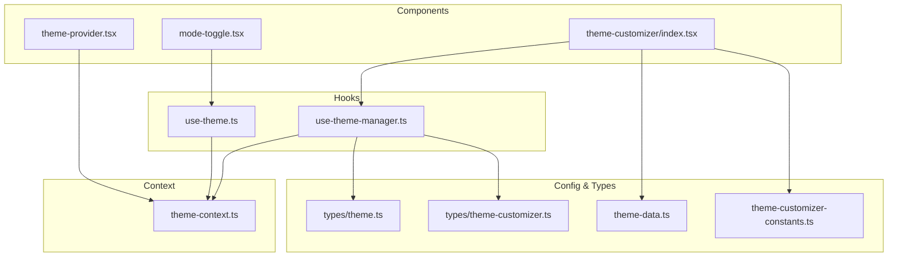
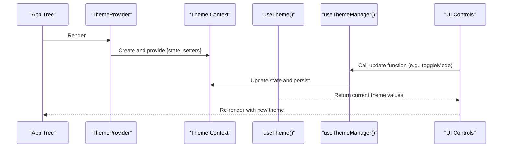
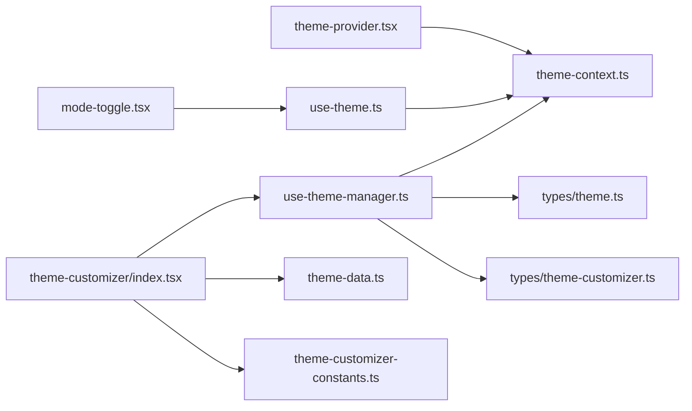

# Theme Context & Provider

<cite>
**Referenced Files in This Document**
- [theme-context.ts](file://src/contexts/theme-context.ts)
- [use-theme.ts](file://src/hooks/use-theme.ts)
- [theme-provider.tsx](file://src/components/theme-provider.tsx)
- [use-theme-manager.ts](file://src/hooks/use-theme-manager.ts)
- [mode-toggle.tsx](file://src/components/mode-toggle.tsx)
- [theme-customizer/index.tsx](file://src/components/theme-customizer/index.tsx)
- [theme-data.ts](file://src/config/theme-data.ts)
- [theme-customizer-constants.ts](file://src/config/theme-customizer-constants.ts)
- [theme.ts](file://src/types/theme.ts)
- [theme-customizer.ts](file://src/types/theme-customizer.ts)
</cite>

## Table of Contents
1. [Introduction](#introduction)
2. [Project Structure](#project-structure)
3. [Core Components](#core-components)
4. [Architecture Overview](#architecture-overview)
5. [Detailed Component Analysis](#detailed-component-analysis)
6. [Dependency Analysis](#dependency-analysis)
7. [Performance Considerations](#performance-considerations)
8. [Troubleshooting Guide](#troubleshooting-guide)
9. [Conclusion](#conclusion)
10. [Appendices](#appendices)

## Introduction
This document explains the theme context and provider implementation used to manage global theme state across the application. It covers how React Context is leveraged to provide theme values, how the useTheme hook exposes those values to components, and how the ThemeProvider component wraps the app to supply the context. It also documents theme state management patterns, consumption strategies, performance considerations, and practical examples for consuming and updating themes efficiently.

## Project Structure
The theme system is organized into focused modules:
- Context definition and types live under contexts and types.
- The provider component lives under components.
- Hooks for accessing and managing theme state live under hooks.
- UI controls that mutate theme state live under components and config.

**Diagram sources**
- [theme-context.ts](file://src/contexts/theme-context.ts)
- [use-theme.ts](file://src/hooks/use-theme.ts)
- [theme-provider.tsx](file://src/components/theme-provider.tsx)
- [use-theme-manager.ts](file://src/hooks/use-theme-manager.ts)
- [mode-toggle.tsx](file://src/components/mode-toggle.tsx)
- [theme-customizer/index.tsx](file://src/components/theme-customizer/index.tsx)
- [theme-data.ts](file://src/config/theme-data.ts)
- [theme-customizer-constants.ts](file://src/config/theme-customizer-constants.ts)
- [theme.ts](file://src/types/theme.ts)
- [theme-customizer.ts](file://src/types/theme-customizer.ts)

**Section sources**
- [theme-context.ts](file://src/contexts/theme-context.ts)
- [use-theme.ts](file://src/hooks/use-theme.ts)
- [theme-provider.tsx](file://src/components/theme-provider.tsx)
- [use-theme-manager.ts](file://src/hooks/use-theme-manager.ts)
- [mode-toggle.tsx](file://src/components/mode-toggle.tsx)
- [theme-customizer/index.tsx](file://src/components/theme-customizer/index.tsx)
- [theme-data.ts](file://src/config/theme-data.ts)
- [theme-customizer-constants.ts](file://src/config/theme-customizer-constants.ts)
- [theme.ts](file://src/types/theme.ts)
- [theme-customizer.ts](file://src/types/theme-customizer.ts)

## Core Components
- Theme Context: Defines the shape of the theme state and the setter functions exposed via React Context.
- useTheme Hook: A typed convenience hook that reads from the theme context and returns a stable interface for consumers.
- ThemeProvider Component: Creates the context, manages state (including persistence), and provides it to the tree.
- useThemeManager Hook: Encapsulates advanced theme operations such as applying presets, toggling modes, and persisting preferences.
- UI Controls: mode-toggle and theme-customizer integrate with the hooks to update theme state.

Key responsibilities:
- Centralize theme state and updates.
- Provide a simple API to read and write theme values.
- Persist user preferences across sessions.
- Apply CSS variables or class-based theming at runtime.

**Section sources**
- [theme-context.ts](file://src/contexts/theme-context.ts)
- [use-theme.ts](file://src/hooks/use-theme.ts)
- [theme-provider.tsx](file://src/components/theme-provider.tsx)
- [use-theme-manager.ts](file://src/hooks/use-theme-manager.ts)
- [mode-toggle.tsx](file://src/components/mode-toggle.tsx)
- [theme-customizer/index.tsx](file://src/components/theme-customizer/index.tsx)

## Architecture Overview
The theme system follows a classic provider/consumer pattern using React Context. The provider owns state and dispatchers; consumers access values through a typed hook.

**Diagram sources**
- [theme-provider.tsx](file://src/components/theme-provider.tsx)
- [theme-context.ts](file://src/contexts/theme-context.ts)
- [use-theme.ts](file://src/hooks/use-theme.ts)
- [use-theme-manager.ts](file://src/hooks/use-theme-manager.ts)
- [mode-toggle.tsx](file://src/components/mode-toggle.tsx)

## Detailed Component Analysis

### Theme Context
- Purpose: Holds the canonical theme state and mutation functions.
- Shape: Includes current theme mode, active preset, and any derived values needed by the UI.
- Consumption: Exposed via a React Context object and consumed by the provider and hooks.

Implementation highlights:
- Provides both state and updater functions to avoid prop drilling.
- Uses TypeScript types to ensure consistent shape across the app.

**Section sources**
- [theme-context.ts](file://src/contexts/theme-context.ts)
- [theme.ts](file://src/types/theme.ts)

### useTheme Hook
- Purpose: A thin wrapper around the context to return a strongly-typed value for consumers.
- Usage: Any component can call this hook to read current theme values without importing the context directly.

Best practices:
- Prefer reading only the fields you need to minimize re-renders when combined with memoization in the provider.
- Keep the hook small and pure to maximize reuse.

**Section sources**
- [use-theme.ts](file://src/hooks/use-theme.ts)
- [theme-context.ts](file://src/contexts/theme-context.ts)

### ThemeProvider Component
- Purpose: Owns theme state, applies changes, and persists preferences.
- Responsibilities:
  - Initialize theme from defaults or persisted storage.
  - Provide context value to descendants.
  - Apply theme changes to the DOM (e.g., classes or CSS variables).
  - Persist updates to local storage or other backends.

Lifecycle considerations:
- Hydration-safe initialization to avoid mismatches between server and client.
- Debounced or batched updates where appropriate to reduce writes.

**Section sources**
- [theme-provider.tsx](file://src/components/theme-provider.tsx)
- [theme-context.ts](file://src/contexts/theme-context.ts)

### useThemeManager Hook
- Purpose: Encapsulates higher-level theme operations such as switching modes, applying presets, and persisting configuration.
- Features:
  - Toggle light/dark mode.
  - Apply a preset from predefined configurations.
  - Merge partial updates safely.
  - Persist state to storage.

Integration points:
- Consumed by theme-customizer and other UI controls.
- Relies on types for safe configuration objects.

**Section sources**
- [use-theme-manager.ts](file://src/hooks/use-theme-manager.ts)
- [theme-customizer.ts](file://src/types/theme-customizer.ts)
- [theme.ts](file://src/types/theme.ts)

### UI Controls: Mode Toggle and Theme Customizer
- mode-toggle: A minimal control to switch between theme modes.
- theme-customizer: A richer panel to select presets, adjust layout options, and persist choices.

Flow:
- User interacts with UI control.
- Control calls an updater from useThemeManager.
- State updates propagate via context to all consumers.

**Section sources**
- [mode-toggle.tsx](file://src/components/mode-toggle.tsx)
- [theme-customizer/index.tsx](file://src/components/theme-customizer/index.tsx)
- [use-theme-manager.ts](file://src/hooks/use-theme-manager.ts)
- [theme-data.ts](file://src/config/theme-data.ts)
- [theme-customizer-constants.ts](file://src/config/theme-customizer-constants.ts)

### Example Patterns

#### Consuming theme values in a component
- Call the useTheme hook to get current theme values.
- Use values to conditionally render or style elements.
- Avoid subscribing to more than necessary to limit re-renders.

**Section sources**
- [use-theme.ts](file://src/hooks/use-theme.ts)
- [theme-context.ts](file://src/contexts/theme-context.ts)

#### Creating a custom hook for theme access
- Build a domain-specific hook that composes useTheme with additional logic (e.g., deriving colors based on mode).
- Memoize derived values to prevent unnecessary recalculations.

**Section sources**
- [use-theme.ts](file://src/hooks/use-theme.ts)
- [theme-context.ts](file://src/contexts/theme-context.ts)

#### Handling theme updates efficiently
- Batch related updates in a single state change.
- Persist asynchronously to avoid blocking UI.
- Apply CSS variable updates in a single pass.

**Section sources**
- [use-theme-manager.ts](file://src/hooks/use-theme-manager.ts)
- [theme-provider.tsx](file://src/components/theme-provider.tsx)

## Dependency Analysis
The following diagram shows how components and hooks depend on each other and on shared configuration and types.

**Diagram sources**
- [theme-provider.tsx](file://src/components/theme-provider.tsx)
- [theme-context.ts](file://src/contexts/theme-context.ts)
- [use-theme.ts](file://src/hooks/use-theme.ts)
- [use-theme-manager.ts](file://src/hooks/use-theme-manager.ts)
- [mode-toggle.tsx](file://src/components/mode-toggle.tsx)
- [theme-customizer/index.tsx](file://src/components/theme-customizer/index.tsx)
- [theme-data.ts](file://src/config/theme-data.ts)
- [theme-customizer-constants.ts](file://src/config/theme-customizer-constants.ts)
- [theme.ts](file://src/types/theme.ts)
- [theme-customizer.ts](file://src/types/theme-customizer.ts)

**Section sources**
- [theme-provider.tsx](file://src/components/theme-provider.tsx)
- [theme-context.ts](file://src/contexts/theme-context.ts)
- [use-theme.ts](file://src/hooks/use-theme.ts)
- [use-theme-manager.ts](file://src/hooks/use-theme-manager.ts)
- [mode-toggle.tsx](file://src/components/mode-toggle.tsx)
- [theme-customizer/index.tsx](file://src/components/theme-customizer/index.tsx)
- [theme-data.ts](file://src/config/theme-data.ts)
- [theme-customizer-constants.ts](file://src/config/theme-customizer-constants.ts)
- [theme.ts](file://src/types/theme.ts)
- [theme-customizer.ts](file://src/types/theme-customizer.ts)

## Performance Considerations
- Minimize context value churn:
  - Memoize the context value object to avoid unnecessary re-renders.
  - Split context if large unrelated slices are updated independently.
- Selective subscriptions:
  - Read only the fields you need in each component.
  - Consider creating specialized hooks that return smaller slices of state.
- Efficient updates:
  - Batch multiple theme changes into a single update.
  - Defer or debounce persistence writes.
- DOM updates:
  - Apply CSS variables in a single operation rather than per-property.
  - Avoid heavy computations during render; precompute derived values.

[No sources needed since this section provides general guidance]

## Troubleshooting Guide
Common issues and resolutions:
- Hydration mismatch:
  - Ensure initial theme is computed consistently on server and client.
  - Delay rendering theme-dependent UI until after hydration if needed.
- No updates applied:
  - Verify the provider wraps the correct part of the tree.
  - Confirm the consumer uses the correct hook and not the raw context directly.
- Excessive re-renders:
  - Check whether the context value object is recreated every render.
  - Memoize derived values and split contexts if necessary.
- Persistence not working:
  - Validate storage availability and error handling.
  - Ensure updates trigger persistence and that reads occur after initialization.

**Section sources**
- [theme-provider.tsx](file://src/components/theme-provider.tsx)
- [use-theme-manager.ts](file://src/hooks/use-theme-manager.ts)
- [theme-context.ts](file://src/contexts/theme-context.ts)

## Conclusion
The theme system centers around a clear separation of concerns: the provider owns state and side effects, the context exposes a stable contract, and hooks provide ergonomic access. By following the patterns outlined here—memoizing context values, selecting only what you consume, batching updates, and persisting efficiently—you can achieve a responsive and maintainable theming solution.

[No sources needed since this section summarizes without analyzing specific files]

## Appendices

### Quick Reference: Where to Look
- Context definition: [theme-context.ts](file://src/contexts/theme-context.ts)
- Consumer hook: [use-theme.ts](file://src/hooks/use-theme.ts)
- Provider implementation: [theme-provider.tsx](file://src/components/theme-provider.tsx)
- Advanced manager: [use-theme-manager.ts](file://src/hooks/use-theme-manager.ts)
- UI integrations: [mode-toggle.tsx](file://src/components/mode-toggle.tsx), [theme-customizer/index.tsx](file://src/components/theme-customizer/index.tsx)
- Presets and constants: [theme-data.ts](file://src/config/theme-data.ts), [theme-customizer-constants.ts](file://src/config/theme-customizer-constants.ts)
- Types: [theme.ts](file://src/types/theme.ts), [theme-customizer.ts](file://src/types/theme-customizer.ts)

[No sources needed since this section lists references without analysis]