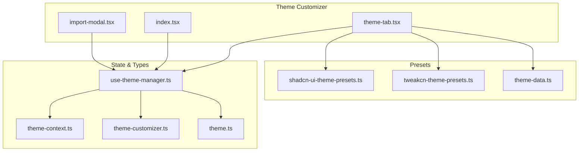
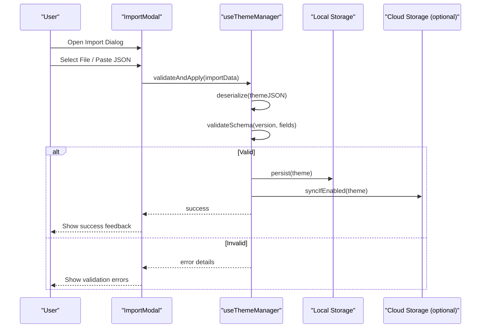
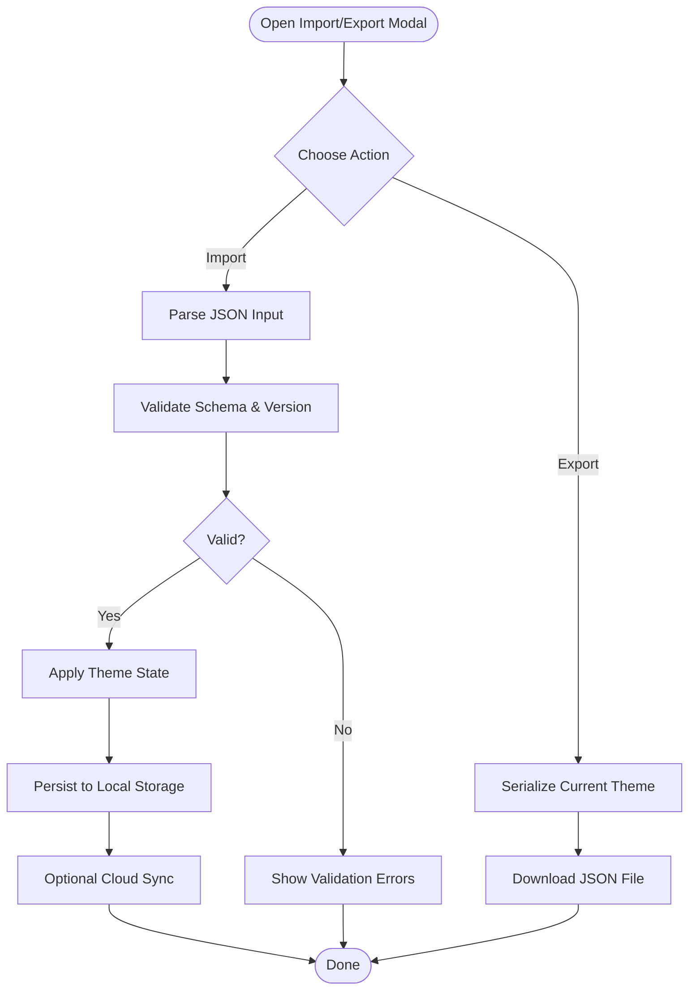
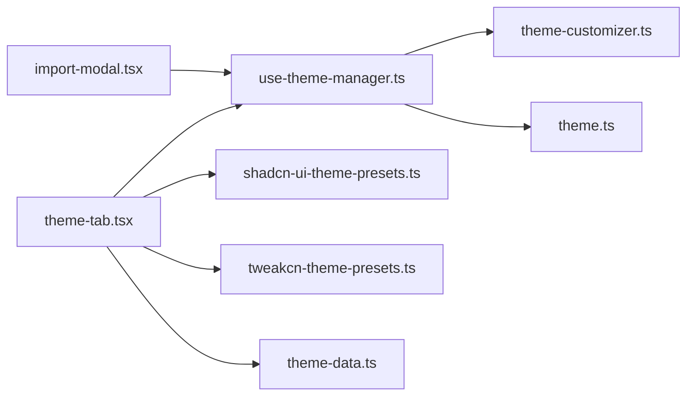

# Import/Export Theme Modal

<cite>
**Referenced Files in This Document**
- [import-modal.tsx](file://src/components/theme-customizer/import-modal.tsx)
- [index.tsx](file://src/components/theme-customizer/index.tsx)
- [theme-tab.tsx](file://src/components/theme-customizer/theme-tab.tsx)
- [use-theme-manager.ts](file://src/hooks/use-theme-manager.ts)
- [theme-context.ts](file://src/contexts/theme-context.ts)
- [theme-customizer.ts](file://src/types/theme-customizer.ts)
- [theme.ts](file://src/types/theme.ts)
- [theme-data.ts](file://src/config/theme-data.ts)
- [shadcn-ui-theme-presets.ts](file://src/utils/shadcn-ui-theme-presets.ts)
- [tweakcn-theme-presets.ts](file://src/utils/tweakcn-theme-presets.ts)
</cite>

## Table of Contents
1. [Introduction](#introduction)
2. [Project Structure](#project-structure)
3. [Core Components](#core-components)
4. [Architecture Overview](#architecture-overview)
5. [Detailed Component Analysis](#detailed-component-analysis)
6. [Dependency Analysis](#dependency-analysis)
7. [Performance Considerations](#performance-considerations)
8. [Troubleshooting Guide](#troubleshooting-guide)
9. [Conclusion](#conclusion)
10. [Appendices](#appendices)

## Introduction
This document explains the import/export theme modal functionality, focusing on how themes are serialized and deserialized, JSON schema validation, file upload handling, export format specification, import validation rules, error handling strategies, security considerations, size limits, backup/restore workflows, and integration with local storage and cloud sharing. It also provides concrete examples for programmatic export, importing shared configurations, and validating theme compatibility across versions.

## Project Structure
The import/export feature is implemented within the theme customizer module and integrates with theme management hooks and contexts. The key files include:
- UI components for the modal and tabs
- Hooks for theme state and persistence
- Type definitions for theme structures
- Preset utilities for built-in themes

**Diagram sources**
- [import-modal.tsx](file://src/components/theme-customizer/import-modal.tsx)
- [index.tsx](file://src/components/theme-customizer/index.tsx)
- [theme-tab.tsx](file://src/components/theme-customizer/theme-tab.tsx)
- [use-theme-manager.ts](file://src/hooks/use-theme-manager.ts)
- [theme-context.ts](file://src/contexts/theme-context.ts)
- [theme-customizer.ts](file://src/types/theme-customizer.ts)
- [theme.ts](file://src/types/theme.ts)
- [shadcn-ui-theme-presets.ts](file://src/utils/shadcn-ui-theme-presets.ts)
- [tweakcn-theme-presets.ts](file://src/utils/tweakcn-theme-presets.ts)
- [theme-data.ts](file://src/config/theme-data.ts)

**Section sources**
- [import-modal.tsx](file://src/components/theme-customizer/import-modal.tsx)
- [index.tsx](file://src/components/theme-customizer/index.tsx)
- [theme-tab.tsx](file://src/components/theme-customizer/theme-tab.tsx)
- [use-theme-manager.ts](file://src/hooks/use-theme-manager.ts)
- [theme-context.ts](file://src/contexts/theme-context.ts)
- [theme-customizer.ts](file://src/types/theme-customizer.ts)
- [theme.ts](file://src/types/theme.ts)
- [shadcn-ui-theme-presets.ts](file://src/utils/shadcn-ui-theme-presets.ts)
- [tweakcn-theme-presets.ts](file://src/utils/tweakcn-theme-presets.ts)
- [theme-data.ts](file://src/config/theme-data.ts)

## Core Components
- ImportModal: Provides a dialog to import themes from JSON files or paste JSON text. It validates input, applies the theme, and persists changes.
- ThemeTab: Offers controls to export current theme as JSON, select presets, and trigger import via the modal.
- useThemeManager: Central hook that manages theme state, serialization/deserialization, persistence (local storage), and version compatibility checks.
- Theme Context: Supplies theme state and actions to components.
- Type Definitions: Define the shape of theme objects and customizer options used during import/export.
- Presets: Provide built-in theme sets for quick application.

Key responsibilities:
- Serialize current theme to a stable JSON structure for export.
- Deserialize imported JSON into internal theme model with validation.
- Persist theme to local storage and optionally sync to cloud storage.
- Enforce security constraints and size limits on imports.
- Handle errors gracefully with user-friendly messages.

**Section sources**
- [import-modal.tsx](file://src/components/theme-customizer/import-modal.tsx)
- [theme-tab.tsx](file://src/components/theme-customizer/theme-tab.tsx)
- [use-theme-manager.ts](file://src/hooks/use-theme-manager.ts)
- [theme-context.ts](file://src/contexts/theme-context.ts)
- [theme-customizer.ts](file://src/types/theme-customizer.ts)
- [theme.ts](file://src/types/theme.ts)
- [shadcn-ui-theme-presets.ts](file://src/utils/shadcn-ui-theme-presets.ts)
- [tweakcn-theme-presets.ts](file://src/utils/tweakcn-theme-presets.ts)
- [theme-data.ts](file://src/config/theme-data.ts)

## Architecture Overview
The import/export flow centers around the modal component and theme manager hook. The modal handles user interactions and delegates validation and application to the theme manager. The theme manager coordinates serialization, validation, persistence, and optional cloud operations.

**Diagram sources**
- [import-modal.tsx](file://src/components/theme-customizer/import-modal.tsx)
- [use-theme-manager.ts](file://src/hooks/use-theme-manager.ts)
- [theme-context.ts](file://src/contexts/theme-context.ts)

## Detailed Component Analysis

### ImportModal Component
Responsibilities:
- Accepts file uploads (.json) and text input for pasting JSON.
- Parses and normalizes input before passing to the theme manager.
- Displays validation errors and success states.
- Supports keyboard accessibility and ARIA attributes.

Key behaviors:
- File size check before parsing.
- MIME type and extension validation.
- JSON parse error handling with clear messages.
- Schema validation using theme types and version checks.

Integration points:
- Calls theme manager methods to apply validated themes.
- Updates UI state based on manager responses.

**Section sources**
- [import-modal.tsx](file://src/components/theme-customizer/import-modal.tsx)

### ThemeTab Component
Responsibilities:
- Exposes export button to serialize current theme to JSON.
- Provides preset selection to quickly apply predefined themes.
- Opens the import modal for advanced import scenarios.

Key behaviors:
- Export triggers serialization through the theme manager.
- Preset application merges or replaces current theme fields.
- Delegates import logic to the modal.

**Section sources**
- [theme-tab.tsx](file://src/components/theme-customizer/theme-tab.tsx)
- [shadcn-ui-theme-presets.ts](file://src/utils/shadcn-ui-theme-presets.ts)
- [tweakcn-theme-presets.ts](file://src/utils/tweakcn-theme-presets.ts)
- [theme-data.ts](file://src/config/theme-data.ts)

### useThemeManager Hook
Responsibilities:
- Manages theme state and lifecycle.
- Serializes current theme to a stable JSON structure.
- Deserializes imported JSON into internal models.
- Validates against schema and version constraints.
- Persists theme to local storage.
- Optionally syncs to cloud storage.
- Emits events for UI updates.

Key behaviors:
- Version compatibility checks ensure forward/backward compatibility.
- Field-level validation enforces required keys and value ranges.
- Error aggregation returns structured messages for UI display.
- Debounced persistence avoids excessive writes.

**Section sources**
- [use-theme-manager.ts](file://src/hooks/use-theme-manager.ts)
- [theme-context.ts](file://src/contexts/theme-context.ts)
- [theme-customizer.ts](file://src/types/theme-customizer.ts)
- [theme.ts](file://src/types/theme.ts)

### Conceptual Overview
The following diagram illustrates the conceptual workflow without mapping to specific source files:

[No sources needed since this diagram shows conceptual workflow, not actual code structure]

## Dependency Analysis
The import/export feature depends on theme types, presets, and the theme manager hook. The modal and tab components rely on the hook for core logic, while presets provide ready-to-use theme data.

**Diagram sources**
- [import-modal.tsx](file://src/components/theme-customizer/import-modal.tsx)
- [theme-tab.tsx](file://src/components/theme-customizer/theme-tab.tsx)
- [use-theme-manager.ts](file://src/hooks/use-theme-manager.ts)
- [theme-customizer.ts](file://src/types/theme-customizer.ts)
- [theme.ts](file://src/types/theme.ts)
- [shadcn-ui-theme-presets.ts](file://src/utils/shadcn-ui-theme-presets.ts)
- [tweakcn-theme-presets.ts](file://src/utils/tweakcn-theme-presets.ts)
- [theme-data.ts](file://src/config/theme-data.ts)

**Section sources**
- [import-modal.tsx](file://src/components/theme-customizer/import-modal.tsx)
- [theme-tab.tsx](file://src/components/theme-customizer/theme-tab.tsx)
- [use-theme-manager.ts](file://src/hooks/use-theme-manager.ts)
- [theme-customizer.ts](file://src/types/theme-customizer.ts)
- [theme.ts](file://src/types/theme.ts)
- [shadcn-ui-theme-presets.ts](file://src/utils/shadcn-ui-theme-presets.ts)
- [tweakcn-theme-presets.ts](file://src/utils/tweakcn-theme-presets.ts)
- [theme-data.ts](file://src/config/theme-data.ts)

## Performance Considerations
- Avoid large JSON payloads by enforcing file size limits at the modal level.
- Use debounced persistence to reduce local storage write frequency.
- Prefer incremental updates when applying preset fields instead of full replacements where possible.
- Cache parsed theme objects to avoid repeated deserialization.
- Minimize re-renders by memoizing derived values in the theme manager.

[No sources needed since this section provides general guidance]

## Troubleshooting Guide
Common issues and resolutions:
- Invalid JSON: Ensure the file content is valid JSON; show precise parse error locations.
- Missing required fields: Validate against schema and list missing keys.
- Version mismatch: Display upgrade instructions or fallback behavior.
- File too large: Inform users of maximum allowed size and suggest compressing exports.
- Persistence failures: Check browser storage quotas and permissions.
- Cloud sync errors: Retry with backoff and surface actionable messages.

Operational tips:
- Log detailed validation errors internally while showing concise messages to users.
- Provide an “undo” action after applying an import to recover previous state.
- Offer a sample export template for users to reference.

**Section sources**
- [import-modal.tsx](file://src/components/theme-customizer/import-modal.tsx)
- [use-theme-manager.ts](file://src/hooks/use-theme-manager.ts)

## Conclusion
The import/export theme modal provides a robust mechanism for managing theme configurations. It ensures safe and validated imports, consistent exports, and reliable persistence. By adhering to schema validation, version checks, and security constraints, it supports both individual customization and team-wide sharing of theme settings.

[No sources needed since this section summarizes without analyzing specific files]

## Appendices

### Export Format Specification
- Root object includes theme metadata such as version, name, and description.
- Theme fields follow the type definitions in the theme types file.
- Optional sections include layout preferences, color tokens, typography settings, and component overrides.
- Stable ordering of keys is recommended for deterministic diffs and backups.

**Section sources**
- [theme-customizer.ts](file://src/types/theme-customizer.ts)
- [theme.ts](file://src/types/theme.ts)

### Import Validation Rules
- Required fields must be present and correctly typed.
- Enumerated values must match allowed options.
- Numeric ranges must fall within defined bounds.
- Version compatibility must be satisfied; otherwise, prompt for migration or reject.

**Section sources**
- [use-theme-manager.ts](file://src/hooks/use-theme-manager.ts)
- [theme-customizer.ts](file://src/types/theme-customizer.ts)
- [theme.ts](file://src/types/theme.ts)

### Security Considerations
- Reject non-JSON files and enforce strict MIME type checks.
- Limit file size to prevent memory exhaustion.
- Sanitize any dynamic evaluation paths; never eval() user-provided content.
- Isolate theme application to controlled fields only.
- Consider signing or checksum verification for shared themes if integrating with cloud services.

**Section sources**
- [import-modal.tsx](file://src/components/theme-customizer/import-modal.tsx)
- [use-theme-manager.ts](file://src/hooks/use-theme-manager.ts)

### Backup and Restore Workflows
- Periodically export current theme to a timestamped file for backup.
- Maintain multiple versions locally to enable rollback.
- Integrate with cloud storage for cross-device synchronization.
- Provide restore prompts with confirmation and undo capability.

**Section sources**
- [use-theme-manager.ts](file://src/hooks/use-theme-manager.ts)
- [theme-context.ts](file://src/contexts/theme-context.ts)

### Integration with Local Storage and Cloud Sharing
- Local storage: Persist theme state under a dedicated key; handle quota exceeded errors gracefully.
- Cloud sharing: Upload exported JSON to a secure endpoint; support download links for collaboration.
- Conflict resolution: Merge strategies should prioritize explicit user choices over remote defaults.

**Section sources**
- [use-theme-manager.ts](file://src/hooks/use-theme-manager.ts)
- [theme-context.ts](file://src/contexts/theme-context.ts)

### Concrete Examples

#### Programmatically Exporting Themes
- Trigger export via the theme manager’s serialization method.
- Generate a downloadable JSON blob with metadata and current theme fields.
- Include version information for future compatibility checks.

**Section sources**
- [use-theme-manager.ts](file://src/hooks/use-theme-manager.ts)
- [theme-tab.tsx](file://src/components/theme-customizer/theme-tab.tsx)

#### Importing Shared Configurations
- Load JSON from a URL or file picker.
- Validate schema and version before applying.
- Present a preview of changes and confirm before applying.

**Section sources**
- [import-modal.tsx](file://src/components/theme-customizer/import-modal.tsx)
- [use-theme-manager.ts](file://src/hooks/use-theme-manager.ts)

#### Validating Theme Compatibility Across Versions
- Compare exported version with supported range.
- Apply migration steps if available; otherwise, request update.
- Record compatibility status in logs for diagnostics.

**Section sources**
- [use-theme-manager.ts](file://src/hooks/use-theme-manager.ts)
- [theme-customizer.ts](file://src/types/theme-customizer.ts)