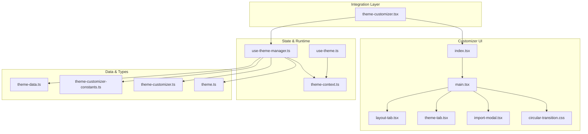
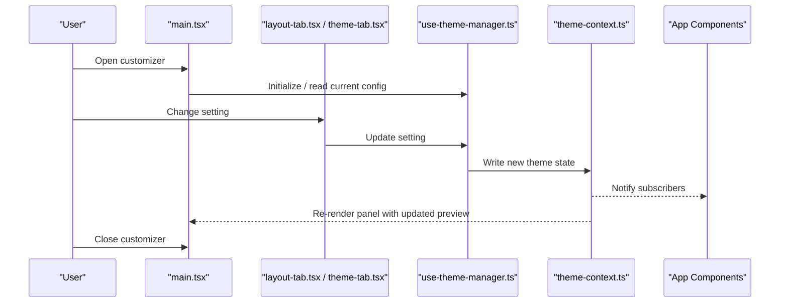
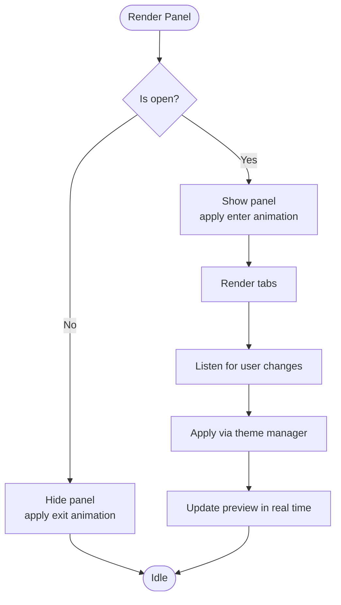
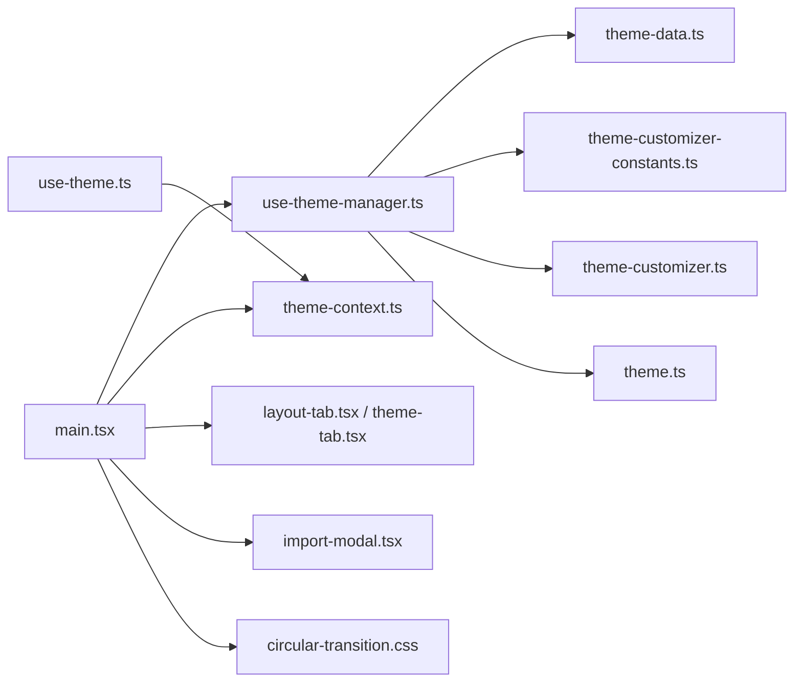

# Main Customizer Interface

<cite>
**Referenced Files in This Document**
- [index.tsx](file://src/components/theme-customizer/index.tsx)
- [main.tsx](file://src/components/theme-customizer/main.tsx)
- [layout-tab.tsx](file://src/components/theme-customizer/layout-tab.tsx)
- [theme-tab.tsx](file://src/components/theme-customizer/theme-tab.tsx)
- [import-modal.tsx](file://src/components/theme-customizer/import-modal.tsx)
- [circular-transition.css](file://src/components/theme-customizer/circular-transition.css)
- [theme-customizer.tsx](file://src/components/theme-customizer.tsx)
- [use-theme-manager.ts](file://src/hooks/use-theme-manager.ts)
- [use-theme.ts](file://src/hooks/use-theme.ts)
- [theme-context.ts](file://src/contexts/theme-context.ts)
- [theme-data.ts](file://src/config/theme-data.ts)
- [theme-customizer-constants.ts](file://src/config/theme-customizer-constants.ts)
- [theme-customizer.ts](file://src/types/theme-customizer.ts)
- [theme.ts](file://src/types/theme.ts)
</cite>

## Table of Contents
1. [Introduction](#introduction)
2. [Project Structure](#project-structure)
3. [Core Components](#core-components)
4. [Architecture Overview](#architecture-overview)
5. [Detailed Component Analysis](#detailed-component-analysis)
6. [Dependency Analysis](#dependency-analysis)
7. [Performance Considerations](#performance-considerations)
8. [Troubleshooting Guide](#troubleshooting-guide)
9. [Conclusion](#conclusion)

## Introduction
This document explains the main theme customizer interface components, focusing on how the customizer orchestrates tabs for layout and theme customization, manages state, handles open/close triggers, positioning, responsive behavior, event integration, visibility management, and performance considerations for real-time updates.

## Project Structure
The customizer is implemented as a cohesive set of components under src/components/theme-customizer, with supporting hooks, contexts, configuration, and types:

- Entry points and orchestration: index.tsx, main.tsx
- Tab implementations: layout-tab.tsx, theme-tab.tsx
- Import/export modal: import-modal.tsx
- Animation styles: circular-transition.css
- Integration layer: theme-customizer.tsx (consumes the customizer and wires it into app layouts)
- State and runtime: use-theme-manager.ts, use-theme.ts, theme-context.ts
- Data and constants: theme-data.ts, theme-customizer-constants.ts
- Types: theme-customizer.ts, theme.ts

**Diagram sources**
- [index.tsx](file://src/components/theme-customizer/index.tsx)
- [main.tsx](file://src/components/theme-customizer/main.tsx)
- [layout-tab.tsx](file://src/components/theme-customizer/layout-tab.tsx)
- [theme-tab.tsx](file://src/components/theme-customizer/theme-tab.tsx)
- [import-modal.tsx](file://src/components/theme-customizer/import-modal.tsx)
- [circular-transition.css](file://src/components/theme-customizer/circular-transition.css)
- [theme-customizer.tsx](file://src/components/theme-customizer.tsx)
- [use-theme-manager.ts](file://src/hooks/use-theme-manager.ts)
- [use-theme.ts](file://src/hooks/use-theme.ts)
- [theme-context.ts](file://src/contexts/theme-context.ts)
- [theme-data.ts](file://src/config/theme-data.ts)
- [theme-customizer-constants.ts](file://src/config/theme-customizer-constants.ts)
- [theme-customizer.ts](file://src/types/theme-customizer.ts)
- [theme.ts](file://src/types/theme.ts)

**Section sources**
- [index.tsx](file://src/components/theme-customizer/index.tsx)
- [main.tsx](file://src/components/theme-customizer/main.tsx)
- [layout-tab.tsx](file://src/components/theme-customizer/layout-tab.tsx)
- [theme-tab.tsx](file://src/components/theme-customizer/theme-tab.tsx)
- [import-modal.tsx](file://src/components/theme-customizer/import-modal.tsx)
- [circular-transition.css](file://src/components/theme-customizer/circular-transition.css)
- [theme-customizer.tsx](file://src/components/theme-customizer.tsx)
- [use-theme-manager.ts](file://src/hooks/use-theme-manager.ts)
- [use-theme.ts](file://src/hooks/use-theme.ts)
- [theme-context.ts](file://src/contexts/theme-context.ts)
- [theme-data.ts](file://src/config/theme-data.ts)
- [theme-customizer-constants.ts](file://src/config/theme-customizer-constants.ts)
- [theme-customizer.ts](file://src/types/theme-customizer.ts)
- [theme.ts](file://src/types/theme.ts)

## Core Components
- index.tsx: Exposes the public API surface for the customizer (e.g., default export, props contract). It typically composes the main panel and integrates with the application’s theme context.
- main.tsx: The core orchestrator that renders the panel, manages tab selection, open/close state, and coordinates with the theme manager hook to apply changes in real time.
- layout-tab.tsx: Provides controls for layout-related options (e.g., sidebar behavior, header style). Emits events or updates the theme manager when values change.
- theme-tab.tsx: Provides controls for color palette, typography, and other visual settings. Applies changes via the theme manager.
- import-modal.tsx: Handles importing/exporting configurations; interacts with the theme manager to persist or load presets.
- circular-transition.css: Defines transition animations used by the panel for smooth open/close effects.

Key responsibilities:
- Orchestration: main.tsx drives tab switching and overall panel lifecycle.
- State synchronization: All tabs read from and write to the theme manager, ensuring consistent state across the app.
- Event-driven updates: Changes propagate through the theme context so all consumers re-render reactively.

**Section sources**
- [index.tsx](file://src/components/theme-customizer/index.tsx)
- [main.tsx](file://src/components/theme-customizer/main.tsx)
- [layout-tab.tsx](file://src/components/theme-customizer/layout-tab.tsx)
- [theme-tab.tsx](file://src/components/theme-customizer/theme-tab.tsx)
- [import-modal.tsx](file://src/components/theme-customizer/import-modal.tsx)
- [circular-transition.css](file://src/components/theme-customizer/circular-transition.css)

## Architecture Overview
The customizer follows a unidirectional data flow pattern:
- UI components (tabs) dispatch actions to the theme manager.
- The theme manager updates the theme context.
- Consumers (including the customizer itself) subscribe to the context and reflect changes immediately.

**Diagram sources**
- [main.tsx](file://src/components/theme-customizer/main.tsx)
- [layout-tab.tsx](file://src/components/theme-customizer/layout-tab.tsx)
- [theme-tab.tsx](file://src/components/theme-customizer/theme-tab.tsx)
- [use-theme-manager.ts](file://src/hooks/use-theme-manager.ts)
- [theme-context.ts](file://src/contexts/theme-context.ts)

## Detailed Component Analysis

### Panel Orchestrator (main.tsx)
Responsibilities:
- Renders the floating panel and tab bar.
- Manages open/close state and positioning logic.
- Coordinates with the theme manager to apply live updates.
- Integrates with the import modal for preset operations.

Open/Close Trigger Mechanism:
- Typically toggled via a dedicated trigger component (e.g., a button in the header or sidebar).
- The wrapper component (theme-customizer.tsx) exposes an API to control visibility programmatically and/or via user interactions.

Positioning Logic:
- Anchors the panel near the trigger or at a fixed corner based on viewport size.
- Uses CSS transitions defined in circular-transition.css for smooth entrance/exit.

Responsive Behavior:
- Adapts panel width and placement on smaller screens (e.g., full-width drawer-like behavior).
- Delegates mobile detection to shared hooks if needed.

**Diagram sources**
- [main.tsx](file://src/components/theme-customizer/main.tsx)
- [circular-transition.css](file://src/components/theme-customizer/circular-transition.css)

**Section sources**
- [main.tsx](file://src/components/theme-customizer/main.tsx)
- [circular-transition.css](file://src/components/theme-customizer/circular-transition.css)

### Layout Tab (layout-tab.tsx)
Responsibilities:
- Presents layout-related options (e.g., sidebar mode, header style).
- Subscribes to current layout state and emits updates to the theme manager.
- Ensures immediate feedback by updating the preview without full page reloads.

Integration Points:
- Reads/writes layout configuration via the theme manager.
- May expose callbacks for external listeners (e.g., analytics or persistence).

**Section sources**
- [layout-tab.tsx](file://src/components/theme-customizer/layout-tab.tsx)
- [use-theme-manager.ts](file://src/hooks/use-theme-manager.ts)

### Theme Tab (theme-tab.tsx)
Responsibilities:
- Presents color palette, typography, and other visual settings.
- Applies changes in real time using the theme manager.
- Validates inputs against available presets and constraints.

Integration Points:
- Uses theme-data.ts and theme-customizer-constants.ts for available options.
- Persists selections via the theme manager where applicable.

**Section sources**
- [theme-tab.tsx](file://src/components/theme-customizer/theme-tab.tsx)
- [theme-data.ts](file://src/config/theme-data.ts)
- [theme-customizer-constants.ts](file://src/config/theme-customizer-constants.ts)
- [use-theme-manager.ts](file://src/hooks/use-theme-manager.ts)

### Import Modal (import-modal.tsx)
Responsibilities:
- Allows importing/exporting theme configurations.
- Interacts with the theme manager to load or save presets.
- Provides validation and error handling for malformed imports.

Integration Points:
- Uses the same theme manager API to ensure consistency with live edits.

**Section sources**
- [import-modal.tsx](file://src/components/theme-customizer/import-modal.tsx)
- [use-theme-manager.ts](file://src/hooks/use-theme-manager.ts)

### Public API Surface (index.tsx)
Responsibilities:
- Exposes the customizer’s public API (props, methods, events).
- Composes the main panel and ensures correct integration with the app’s theme context.

Typical Usage:
- Import the default export and render it within your layout.
- Optionally pass props to control initial visibility or behavior.

**Section sources**
- [index.tsx](file://src/components/theme-customizer/index.tsx)

### Integration Wrapper (theme-customizer.tsx)
Responsibilities:
- Wires the customizer into the application layout.
- Provides a convenient entry point to toggle visibility and handle events.
- Bridges between the customizer and the theme context.

Trigger and Visibility Management:
- Exposes functions to open/close the panel programmatically.
- Listens for global events (e.g., keyboard shortcuts) to toggle visibility.

**Section sources**
- [theme-customizer.tsx](file://src/components/theme-customizer.tsx)
- [use-theme-manager.ts](file://src/hooks/use-theme-manager.ts)
- [theme-context.ts](file://src/contexts/theme-context.ts)

## Dependency Analysis
The customizer depends on shared theme infrastructure and configuration:

**Diagram sources**
- [main.tsx](file://src/components/theme-customizer/main.tsx)
- [layout-tab.tsx](file://src/components/theme-customizer/layout-tab.tsx)
- [theme-tab.tsx](file://src/components/theme-customizer/theme-tab.tsx)
- [import-modal.tsx](file://src/components/theme-customizer/import-modal.tsx)
- [circular-transition.css](file://src/components/theme-customizer/circular-transition.css)
- [use-theme-manager.ts](file://src/hooks/use-theme-manager.ts)
- [use-theme.ts](file://src/hooks/use-theme.ts)
- [theme-context.ts](file://src/contexts/theme-context.ts)
- [theme-data.ts](file://src/config/theme-data.ts)
- [theme-customizer-constants.ts](file://src/config/theme-customizer-constants.ts)
- [theme-customizer.ts](file://src/types/theme-customizer.ts)
- [theme.ts](file://src/types/theme.ts)

**Section sources**
- [main.tsx](file://src/components/theme-customizer/main.tsx)
- [use-theme-manager.ts](file://src/hooks/use-theme-manager.ts)
- [theme-context.ts](file://src/contexts/theme-context.ts)
- [theme-data.ts](file://src/config/theme-data.ts)
- [theme-customizer-constants.ts](file://src/config/theme-customizer-constants.ts)
- [theme-customizer.ts](file://src/types/theme-customizer.ts)
- [theme.ts](file://src/types/theme.ts)

## Performance Considerations
- Real-time updates:
  - Prefer fine-grained state updates via the theme manager to avoid unnecessary re-renders.
  - Debounce expensive operations (e.g., heavy computations or I/O) when applying changes.
- Memory management:
  - Avoid retaining large objects in local state; prefer references to shared configuration.
  - Clean up event listeners and timers when the panel unmounts.
- Rendering optimization:
  - Memoize derived values and expensive computations in tabs.
  - Use React.memo or similar strategies for static parts of the panel.
- Animation performance:
  - Leverage CSS transitions (circular-transition.css) for smooth open/close effects without JavaScript overhead.
- Context usage:
  - Subscribe only to necessary slices of the theme context to minimize re-renders.

[No sources needed since this section provides general guidance]

## Troubleshooting Guide
Common issues and resolutions:
- Panel does not open/close:
  - Verify the trigger wiring in the integration wrapper and ensure visibility state is correctly managed.
- Changes not reflected in the app:
  - Confirm that the theme manager writes to the theme context and that consumers are subscribed.
- Import errors:
  - Validate imported payloads against the expected schema and provide clear error messages.
- Performance regressions:
  - Profile re-renders around the customizer; consider memoization and debouncing.

**Section sources**
- [theme-customizer.tsx](file://src/components/theme-customizer.tsx)
- [use-theme-manager.ts](file://src/hooks/use-theme-manager.ts)
- [theme-context.ts](file://src/contexts/theme-context.ts)

## Conclusion
The main customizer interface is a modular, event-driven system that orchestrates layout and theme customization through a central panel and focused tabs. It leverages a shared theme manager and context to deliver real-time updates while maintaining responsiveness and memory efficiency. By following the integration patterns outlined here, you can embed the customizer seamlessly into your application layouts, manage visibility states, and handle events effectively.