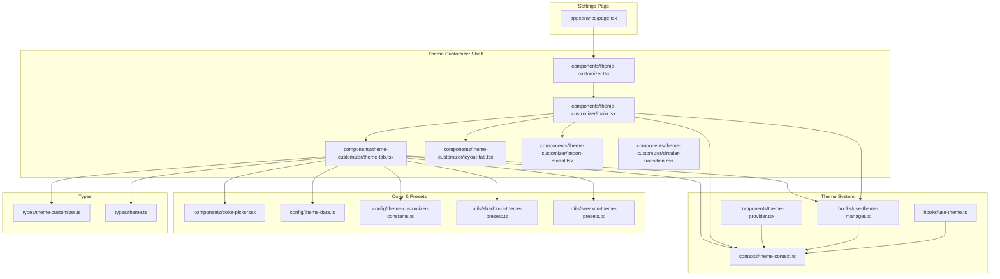
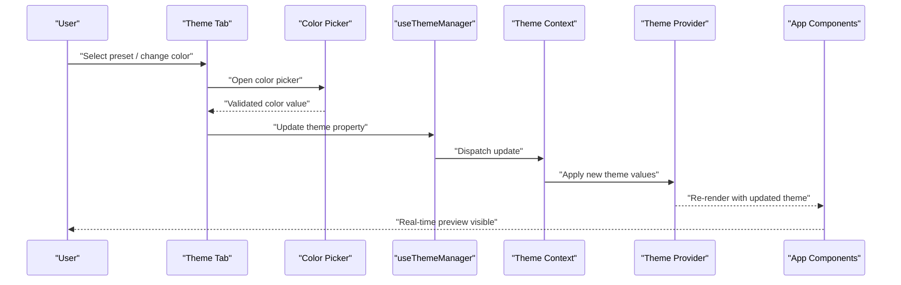
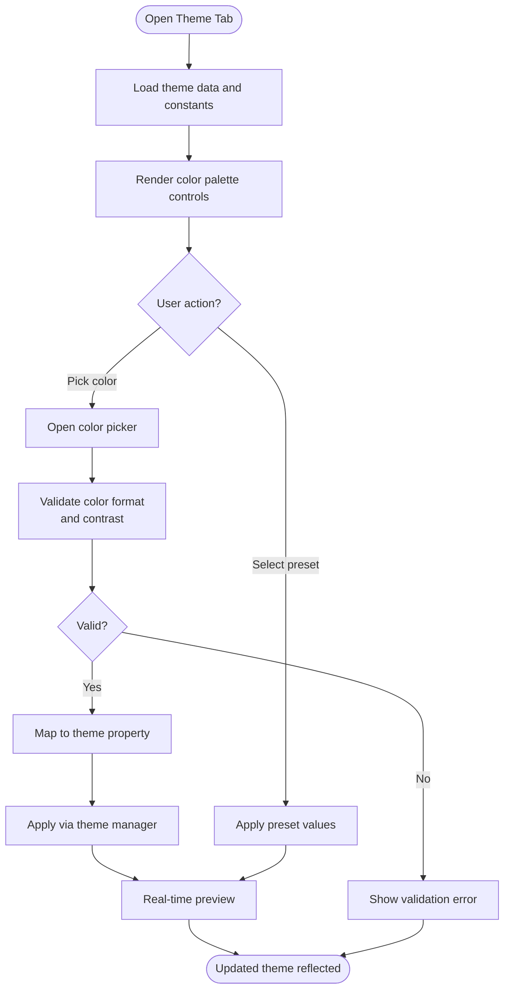
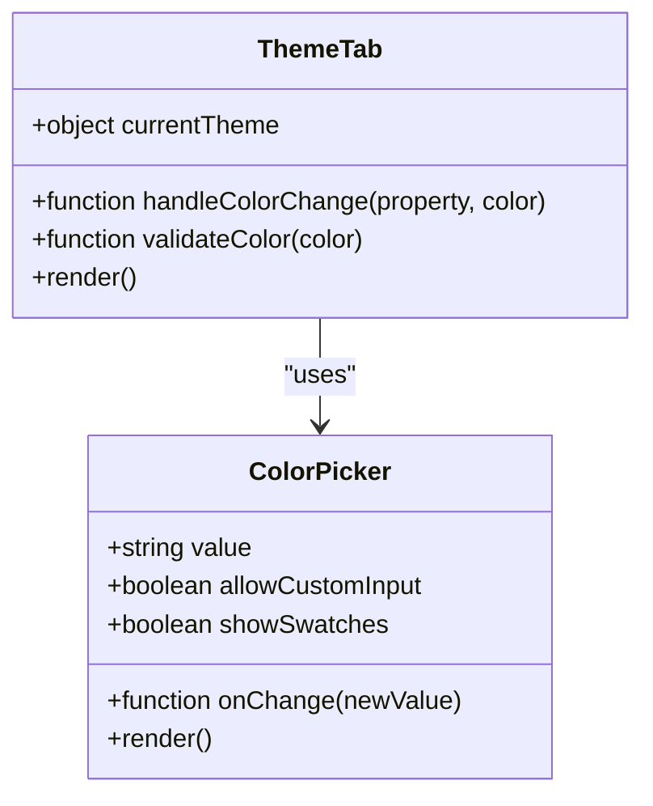
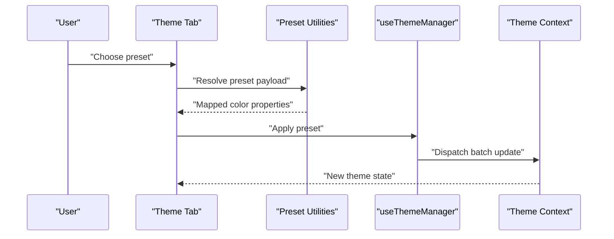
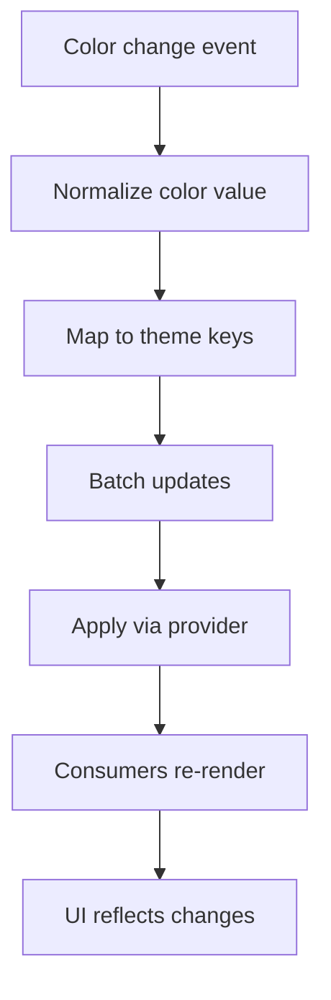
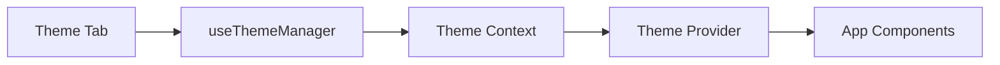
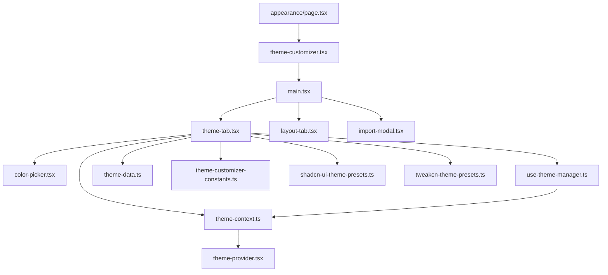

# Theme Customization Tab

<cite>
**Referenced Files in This Document**
- [theme-tab.tsx](file://src/components/theme-customizer/theme-tab.tsx)
- [main.tsx](file://src/components/theme-customizer/main.tsx)
- [index.tsx](file://src/components/theme-customizer/index.tsx)
- [layout-tab.tsx](file://src/components/theme-customizer/layout-tab.tsx)
- [import-modal.tsx](file://src/components/theme-customizer/import-modal.tsx)
- [circular-transition.css](file://src/components/theme-customizer/circular-transition.css)
- [theme-provider.tsx](file://src/components/theme-provider.tsx)
- [theme-context.ts](file://src/contexts/theme-context.ts)
- [use-theme-manager.ts](file://src/hooks/use-theme-manager.ts)
- [use-theme.ts](file://src/hooks/use-theme.ts)
- [color-picker.tsx](file://src/components/color-picker.tsx)
- [theme-data.ts](file://src/config/theme-data.ts)
- [theme-customizer-constants.ts](file://src/config/theme-customizer-constants.ts)
- [shadcn-ui-theme-presets.ts](file://src/utils/shadcn-ui-theme-presets.ts)
- [tweakcn-theme-presets.ts](file://src/utils/tweakcn-theme-presets.ts)
- [appearance/page.tsx](file://src/app/(private)/settings/appearance/page.tsx)
- [theme-customizer.tsx](file://src/components/theme-customizer.tsx)
- [theme-customizer.ts](file://src/types/theme-customizer.ts)
- [theme.ts](file://src/types/theme.ts)
</cite>

## Table of Contents
1. [Introduction](#introduction)
2. [Project Structure](#project-structure)
3. [Core Components](#core-components)
4. [Architecture Overview](#architecture-overview)
5. [Detailed Component Analysis](#detailed-component-analysis)
6. [Dependency Analysis](#dependency-analysis)
7. [Performance Considerations](#performance-considerations)
8. [Troubleshooting Guide](#troubleshooting-guide)
9. [Conclusion](#conclusion)
10. [Appendices](#appendices)

## Introduction
This document explains the Theme Customization tab interface, focusing on color palette management, preset theme selection, and real-time color preview. It covers color picker integration, custom color input validation, theme property mapping, accessibility considerations (contrast and keyboard navigation), and how changes propagate through the theme context provider to the application. Concrete examples are provided for adding new color properties, implementing validation rules, and creating custom presets.

## Project Structure
The theme customization feature is implemented as a cohesive set of components, hooks, contexts, configuration, and utilities:
- UI components for tabs, import modal, and layout controls live under src/components/theme-customizer.
- The global theme provider and context manage state and propagation.
- Hooks encapsulate theme manager logic and consumption patterns.
- Configuration files define theme data, constants, and presets.
- Types define contracts for theme and customizer structures.
- A dedicated settings page hosts the theme customizer entry point.

**Diagram sources**
- [appearance/page.tsx](file://src/app/(private)/settings/appearance/page.tsx)
- [theme-customizer.tsx](file://src/components/theme-customizer.tsx)
- [main.tsx](file://src/components/theme-customizer/main.tsx)
- [theme-tab.tsx](file://src/components/theme-customizer/theme-tab.tsx)
- [layout-tab.tsx](file://src/components/theme-customizer/layout-tab.tsx)
- [import-modal.tsx](file://src/components/theme-customizer/import-modal.tsx)
- [circular-transition.css](file://src/components/theme-customizer/circular-transition.css)
- [theme-provider.tsx](file://src/components/theme-provider.tsx)
- [theme-context.ts](file://src/contexts/theme-context.ts)
- [use-theme-manager.ts](file://src/hooks/use-theme-manager.ts)
- [use-theme.ts](file://src/hooks/use-theme.ts)
- [color-picker.tsx](file://src/components/color-picker.tsx)
- [theme-data.ts](file://src/config/theme-data.ts)
- [theme-customizer-constants.ts](file://src/config/theme-customizer-constants.ts)
- [shadcn-ui-theme-presets.ts](file://src/utils/shadcn-ui-theme-presets.ts)
- [tweakcn-theme-presets.ts](file://src/utils/tweakcn-theme-presets.ts)
- [theme-customizer.ts](file://src/types/theme-customizer.ts)
- [theme.ts](file://src/types/theme.ts)

**Section sources**
- [appearance/page.tsx](file://src/app/(private)/settings/appearance/page.tsx)
- [theme-customizer.tsx](file://src/components/theme-customizer.tsx)
- [main.tsx](file://src/components/theme-customizer/main.tsx)
- [theme-tab.tsx](file://src/components/theme-customizer/theme-tab.tsx)
- [layout-tab.tsx](file://src/components/theme-customizer/layout-tab.tsx)
- [import-modal.tsx](file://src/components/theme-customizer/import-modal.tsx)
- [circular-transition.css](file://src/components/theme-customizer/circular-transition.css)
- [theme-provider.tsx](file://src/components/theme-provider.tsx)
- [theme-context.ts](file://src/contexts/theme-context.ts)
- [use-theme-manager.ts](file://src/hooks/use-theme-manager.ts)
- [use-theme.ts](file://src/hooks/use-theme.ts)
- [color-picker.tsx](file://src/components/color-picker.tsx)
- [theme-data.ts](file://src/config/theme-data.ts)
- [theme-customizer-constants.ts](file://src/config/theme-customizer-constants.ts)
- [shadcn-ui-theme-presets.ts](file://src/utils/shadcn-ui-theme-presets.ts)
- [tweakcn-theme-presets.ts](file://src/utils/tweakcn-theme-presets.ts)
- [theme-customizer.ts](file://src/types/theme-customizer.ts)
- [theme.ts](file://src/types/theme.ts)

## Core Components
- Theme Customizer Shell: Orchestrates tabs and manages overall state interactions with the theme system.
- Theme Tab: Provides color palette management, preset selection, and real-time preview.
- Layout Tab: Controls layout-related theme properties (e.g., sidebar behavior).
- Import Modal: Allows importing/exporting themes or presets.
- Color Picker: Integrated component for selecting colors with validation and accessibility support.
- Theme Provider and Context: Centralized state and update mechanism that propagates changes across the app.
- Hooks: Encapsulate theme manager operations and consumption patterns.
- Configuration and Presets: Define base theme data, constants, and preset collections.
- Types: Enforce structure and contracts for theme and customizer payloads.

Key responsibilities:
- Real-time preview: Updates CSS variables or theme tokens immediately upon change.
- Validation: Ensures color inputs are valid and accessible before applying.
- Preset management: Applies predefined palettes and supports user-created presets.
- Propagation: Uses context to notify all consumers of theme updates.

**Section sources**
- [main.tsx](file://src/components/theme-customizer/main.tsx)
- [theme-tab.tsx](file://src/components/theme-customizer/theme-tab.tsx)
- [layout-tab.tsx](file://src/components/theme-customizer/layout-tab.tsx)
- [import-modal.tsx](file://src/components/theme-customizer/import-modal.tsx)
- [color-picker.tsx](file://src/components/color-picker.tsx)
- [theme-provider.tsx](file://src/components/theme-provider.tsx)
- [theme-context.ts](file://src/contexts/theme-context.ts)
- [use-theme-manager.ts](file://src/hooks/use-theme-manager.ts)
- [use-theme.ts](file://src/hooks/use-theme.ts)
- [theme-data.ts](file://src/config/theme-data.ts)
- [theme-customizer-constants.ts](file://src/config/theme-customizer-constants.ts)
- [shadcn-ui-theme-presets.ts](file://src/utils/shadcn-ui-theme-presets.ts)
- [tweakcn-theme-presets.ts](file://src/utils/tweakcn-theme-presets.ts)
- [theme-customizer.ts](file://src/types/theme-customizer.ts)
- [theme.ts](file://src/types/theme.ts)

## Architecture Overview
The theme customization flow centers around the Theme Tab interacting with the theme manager hook and context. Changes are validated, mapped to theme properties, applied via the provider, and consumed by the rest of the application.

**Diagram sources**
- [theme-tab.tsx](file://src/components/theme-customizer/theme-tab.tsx)
- [color-picker.tsx](file://src/components/color-picker.tsx)
- [use-theme-manager.ts](file://src/hooks/use-theme-manager.ts)
- [theme-context.ts](file://src/contexts/theme-context.ts)
- [theme-provider.tsx](file://src/components/theme-provider.tsx)

## Detailed Component Analysis

### Theme Tab: Color Palette Management, Presets, and Real-Time Preview
Responsibilities:
- Present color palette controls for each theme property.
- Provide preset theme selection and apply them atomically.
- Validate custom color inputs and enforce accessibility constraints.
- Map selected colors to theme properties and trigger real-time preview.

Implementation highlights:
- Integrates the color picker for interactive selection.
- Uses the theme manager hook to update properties and persist changes.
- Consumes theme data and constants to render available properties and defaults.
- Applies presets from utility modules and allows saving custom presets.

Validation and mapping:
- Validates hex/RGB formats and rejects invalid inputs.
- Optionally checks contrast ratios against background tokens to ensure WCAG compliance.
- Maps UI color names to internal theme keys defined in types and constants.

Accessibility:
- Ensures focus management when opening/closing the color picker.
- Provides keyboard shortcuts for common actions (e.g., Enter to confirm).
- Announces status changes via aria attributes where applicable.

**Diagram sources**
- [theme-tab.tsx](file://src/components/theme-customizer/theme-tab.tsx)
- [color-picker.tsx](file://src/components/color-picker.tsx)
- [use-theme-manager.ts](file://src/hooks/use-theme-manager.ts)
- [theme-data.ts](file://src/config/theme-data.ts)
- [theme-customizer-constants.ts](file://src/config/theme-customizer-constants.ts)
- [shadcn-ui-theme-presets.ts](file://src/utils/shadcn-ui-theme-presets.ts)
- [tweakcn-theme-presets.ts](file://src/utils/tweakcn-theme-presets.ts)

**Section sources**
- [theme-tab.tsx](file://src/components/theme-customizer/theme-tab.tsx)
- [color-picker.tsx](file://src/components/color-picker.tsx)
- [use-theme-manager.ts](file://src/hooks/use-theme-manager.ts)
- [theme-data.ts](file://src/config/theme-data.ts)
- [theme-customizer-constants.ts](file://src/config/theme-customizer-constants.ts)
- [shadcn-ui-theme-presets.ts](file://src/utils/shadcn-ui-theme-presets.ts)
- [tweakcn-theme-presets.ts](file://src/utils/tweakcn-theme-presets.ts)

### Color Picker Integration and Custom Color Input Validation
Integration points:
- Controlled by the theme tab; receives current color and onChange callback.
- Supports both palette swatches and manual text input.
- Emits validated color values back to the theme tab.

Validation rules:
- Accepts standard color formats (hex, rgb/rgba, hsl/hsla).
- Normalizes values to a canonical form before applying.
- Optional contrast check against related tokens to maintain readability.

Keyboard navigation:
- Focusable swatches and input fields.
- Arrow key navigation within swatch grids.
- Enter/Space to confirm selection.

**Diagram sources**
- [color-picker.tsx](file://src/components/color-picker.tsx)
- [theme-tab.tsx](file://src/components/theme-customizer/theme-tab.tsx)

**Section sources**
- [color-picker.tsx](file://src/components/color-picker.tsx)
- [theme-tab.tsx](file://src/components/theme-customizer/theme-tab.tsx)

### Preset Theme Selection and Custom Presets
Presets:
- Provided by utility modules for ShadCN and TweakCN ecosystems.
- Applied atomically to multiple theme properties.
- Can be extended with user-defined presets saved locally or exported.

Workflow:
- User selects a preset from the dropdown.
- Theme tab maps preset keys to theme properties.
- Manager applies changes and triggers re-render.

Creating custom presets:
- Capture current theme state.
- Assign a name and metadata.
- Persist to local storage or export as JSON.

**Diagram sources**
- [theme-tab.tsx](file://src/components/theme-customizer/theme-tab.tsx)
- [shadcn-ui-theme-presets.ts](file://src/utils/shadcn-ui-theme-presets.ts)
- [tweakcn-theme-presets.ts](file://src/utils/tweakcn-theme-presets.ts)
- [use-theme-manager.ts](file://src/hooks/use-theme-manager.ts)
- [theme-context.ts](file://src/contexts/theme-context.ts)

**Section sources**
- [theme-tab.tsx](file://src/components/theme-customizer/theme-tab.tsx)
- [shadcn-ui-theme-presets.ts](file://src/utils/shadcn-ui-theme-presets.ts)
- [tweakcn-theme-presets.ts](file://src/utils/tweakcn-theme-presets.ts)
- [use-theme-manager.ts](file://src/hooks/use-theme-manager.ts)
- [theme-context.ts](file://src/contexts/theme-context.ts)

### Theme Property Mapping and Real-Time Preview
Mapping:
- UI color names map to internal theme keys using constants and type definitions.
- The manager normalizes and batches updates to avoid excessive re-renders.

Real-time preview:
- Immediate application of CSS variables or token updates.
- Consumers subscribe to context changes and re-render accordingly.

**Diagram sources**
- [theme-tab.tsx](file://src/components/theme-customizer/theme-tab.tsx)
- [use-theme-manager.ts](file://src/hooks/use-theme-manager.ts)
- [theme-context.ts](file://src/contexts/theme-context.ts)
- [theme-provider.tsx](file://src/components/theme-provider.tsx)

**Section sources**
- [theme-tab.tsx](file://src/components/theme-customizer/theme-tab.tsx)
- [use-theme-manager.ts](file://src/hooks/use-theme-manager.ts)
- [theme-context.ts](file://src/contexts/theme-context.ts)
- [theme-provider.tsx](file://src/components/theme-provider.tsx)

### Relationships with Theme Context Provider and Propagation
Propagation model:
- Theme provider holds the authoritative theme state.
- Context exposes getters and setters for theme updates.
- Hooks abstract provider usage and add memoization/performance optimizations.

Flow:
- Theme tab calls manager.update(property, value).
- Manager dispatches to context.
- Provider updates state and notifies subscribers.
- All components consuming useTheme see the new values.

**Diagram sources**
- [theme-tab.tsx](file://src/components/theme-customizer/theme-tab.tsx)
- [use-theme-manager.ts](file://src/hooks/use-theme-manager.ts)
- [theme-context.ts](file://src/contexts/theme-context.ts)
- [theme-provider.tsx](file://src/components/theme-provider.tsx)
- [use-theme.ts](file://src/hooks/use-theme.ts)

**Section sources**
- [theme-tab.tsx](file://src/components/theme-customizer/theme-tab.tsx)
- [use-theme-manager.ts](file://src/hooks/use-theme-manager.ts)
- [theme-context.ts](file://src/contexts/theme-context.ts)
- [theme-provider.tsx](file://src/components/theme-provider.tsx)
- [use-theme.ts](file://src/hooks/use-theme.ts)

### Accessibility Considerations
Contrast:
- Implement contrast checks between foreground and background tokens.
- Warn users when chosen combinations fail minimum contrast thresholds.

Keyboard navigation:
- Ensure all interactive elements are reachable via Tab.
- Support arrow keys for swatch grids and Enter/Space for activation.
- Provide clear focus indicators and aria labels.

Screen reader support:
- Announce active preset and current color values.
- Use descriptive labels for color roles (e.g., primary, secondary).

**Section sources**
- [theme-tab.tsx](file://src/components/theme-customizer/theme-tab.tsx)
- [color-picker.tsx](file://src/components/color-picker.tsx)

### Examples and How-To Guides

#### Adding a New Color Property
Steps:
- Define the new property in the theme type definition.
- Add it to the theme data and constants with default values.
- Expose a control in the theme tab UI.
- Ensure mapping exists between UI label and internal key.
- Validate and test real-time preview.

References:
- Type definitions for theme structure.
- Constants defining available properties.
- Theme data providing defaults and metadata.

**Section sources**
- [theme.ts](file://src/types/theme.ts)
- [theme-customizer-constants.ts](file://src/config/theme-customizer-constants.ts)
- [theme-data.ts](file://src/config/theme-data.ts)
- [theme-tab.tsx](file://src/components/theme-customizer/theme-tab.tsx)

#### Implementing Theme Validation Rules
Guidelines:
- Validate color format at input time.
- Normalize values before applying.
- Optionally enforce contrast thresholds.
- Surface errors clearly to users.

References:
- Color picker validation logic.
- Theme tab validation handlers.

**Section sources**
- [color-picker.tsx](file://src/components/color-picker.tsx)
- [theme-tab.tsx](file://src/components/theme-customizer/theme-tab.tsx)

#### Creating Custom Color Presets
Process:
- Capture current theme state.
- Create a named preset object with color mappings.
- Save to local storage or export as JSON.
- Load and apply presets from storage or imported files.

References:
- Preset utilities for ShadCN/TweakCN.
- Import modal for file-based operations.

**Section sources**
- [shadcn-ui-theme-presets.ts](file://src/utils/shadcn-ui-theme-presets.ts)
- [tweakcn-theme-presets.ts](file://src/utils/tweakcn-theme-presets.ts)
- [import-modal.tsx](file://src/components/theme-customizer/import-modal.tsx)
- [theme-tab.tsx](file://src/components/theme-customizer/theme-tab.tsx)

## Dependency Analysis
The theme customization module depends on:
- UI primitives for rendering controls.
- Theme provider/context for state management.
- Hooks for encapsulated logic.
- Configuration and presets for data and defaults.
- Types for contract enforcement.

**Diagram sources**
- [theme-tab.tsx](file://src/components/theme-customizer/theme-tab.tsx)
- [color-picker.tsx](file://src/components/color-picker.tsx)
- [use-theme-manager.ts](file://src/hooks/use-theme-manager.ts)
- [theme-context.ts](file://src/contexts/theme-context.ts)
- [theme-data.ts](file://src/config/theme-data.ts)
- [theme-customizer-constants.ts](file://src/config/theme-customizer-constants.ts)
- [shadcn-ui-theme-presets.ts](file://src/utils/shadcn-ui-theme-presets.ts)
- [tweakcn-theme-presets.ts](file://src/utils/tweakcn-theme-presets.ts)
- [theme-provider.tsx](file://src/components/theme-provider.tsx)
- [appearance/page.tsx](file://src/app/(private)/settings/appearance/page.tsx)
- [theme-customizer.tsx](file://src/components/theme-customizer.tsx)
- [main.tsx](file://src/components/theme-customizer/main.tsx)
- [layout-tab.tsx](file://src/components/theme-customizer/layout-tab.tsx)
- [import-modal.tsx](file://src/components/theme-customizer/import-modal.tsx)

**Section sources**
- [theme-tab.tsx](file://src/components/theme-customizer/theme-tab.tsx)
- [color-picker.tsx](file://src/components/color-picker.tsx)
- [use-theme-manager.ts](file://src/hooks/use-theme-manager.ts)
- [theme-context.ts](file://src/contexts/theme-context.ts)
- [theme-data.ts](file://src/config/theme-data.ts)
- [theme-customizer-constants.ts](file://src/config/theme-customizer-constants.ts)
- [shadcn-ui-theme-presets.ts](file://src/utils/shadcn-ui-theme-presets.ts)
- [tweakcn-theme-presets.ts](file://src/utils/tweakcn-theme-presets.ts)
- [theme-provider.tsx](file://src/components/theme-provider.tsx)
- [appearance/page.tsx](file://src/app/(private)/settings/appearance/page.tsx)
- [theme-customizer.tsx](file://src/components/theme-customizer.tsx)
- [main.tsx](file://src/components/theme-customizer/main.tsx)
- [layout-tab.tsx](file://src/components/theme-customizer/layout-tab.tsx)
- [import-modal.tsx](file://src/components/theme-customizer/import-modal.tsx)

## Performance Considerations
- Batch updates: Group multiple color changes into a single context update to minimize re-renders.
- Memoization: Use memoized selectors in consumers to avoid unnecessary recalculations.
- Debounced input: For manual color text inputs, debounce parsing and validation to reduce churn.
- Lazy loading: Defer heavy preset computations until needed.
- CSS variable updates: Prefer direct CSS variable updates for instant visual feedback without full reflows.

[No sources needed since this section provides general guidance]

## Troubleshooting Guide
Common issues and resolutions:
- Invalid color input: Ensure normalization and reject unsupported formats early.
- No preview update: Verify context dispatch and provider subscription paths.
- Contrast warnings: Implement and display contrast checks; guide users to adjust colors.
- Keyboard navigation problems: Confirm focus order and aria attributes on interactive elements.
- Preset not applying: Check mapping between preset keys and theme properties.

**Section sources**
- [theme-tab.tsx](file://src/components/theme-customizer/theme-tab.tsx)
- [color-picker.tsx](file://src/components/color-picker.tsx)
- [use-theme-manager.ts](file://src/hooks/use-theme-manager.ts)
- [theme-context.ts](file://src/contexts/theme-context.ts)
- [theme-provider.tsx](file://src/components/theme-provider.tsx)

## Conclusion
The Theme Customization tab delivers a robust, accessible, and performant interface for managing color palettes, applying presets, and previewing changes in real time. By leveraging the theme context provider and well-structured hooks, updates propagate efficiently across the application. Following the guidelines for validation, mapping, and accessibility ensures a high-quality user experience and maintainable codebase.

[No sources needed since this section summarizes without analyzing specific files]

## Appendices

### Entry Points and Navigation
- Settings appearance page hosts the theme customizer shell.
- The shell renders tabs and orchestrates interactions.

**Section sources**
- [appearance/page.tsx](file://src/app/(private)/settings/appearance/page.tsx)
- [theme-customizer.tsx](file://src/components/theme-customizer.tsx)
- [main.tsx](file://src/components/theme-customizer/main.tsx)

### Animation and Transitions
- Circular transition styles enhance visual feedback during theme changes.

**Section sources**
- [circular-transition.css](file://src/components/theme-customizer/circular-transition.css)