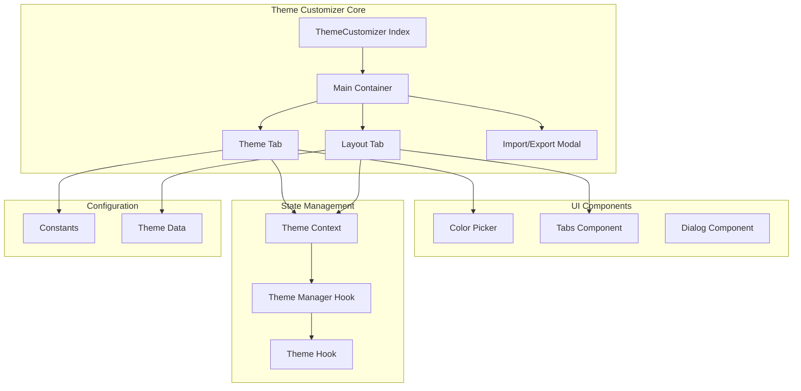
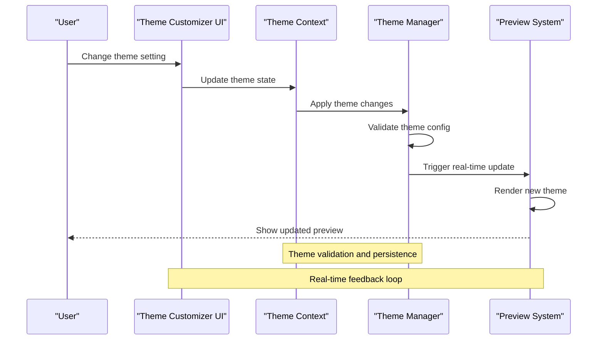
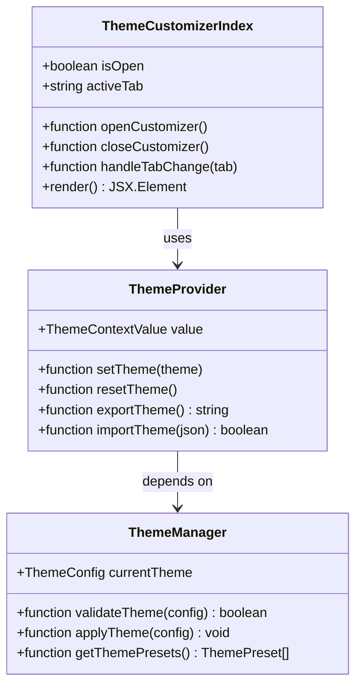
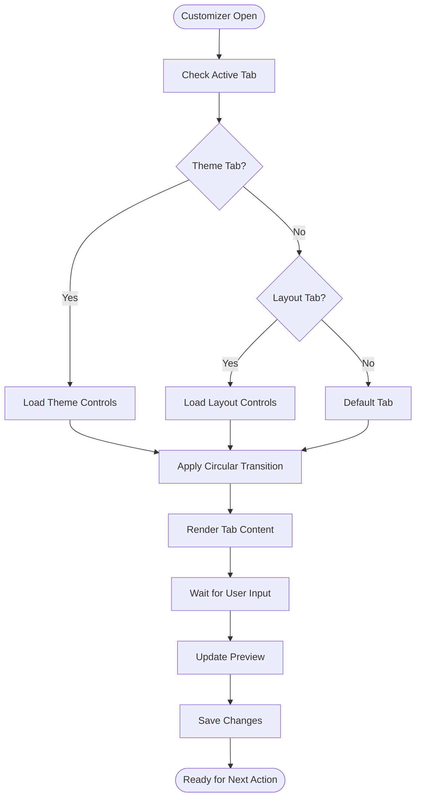
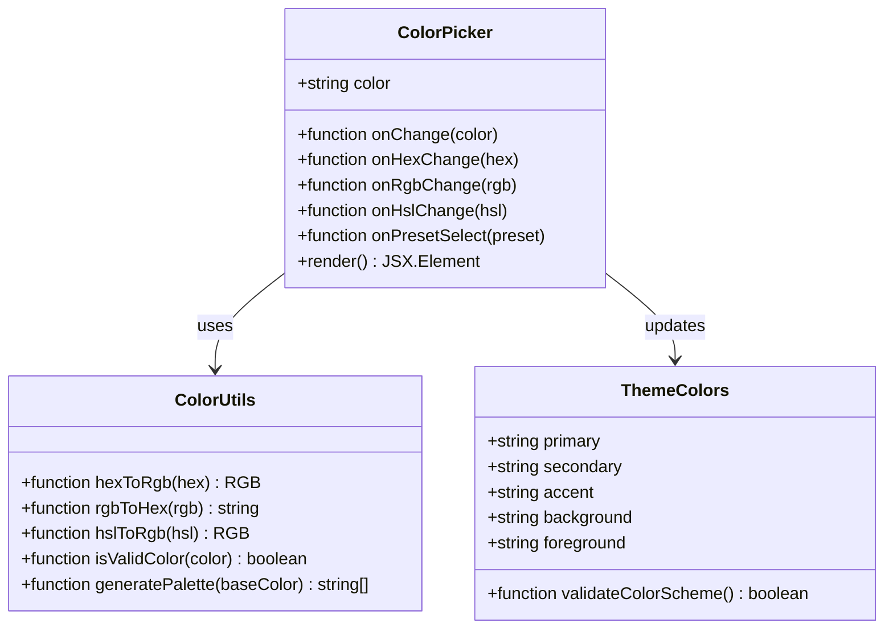
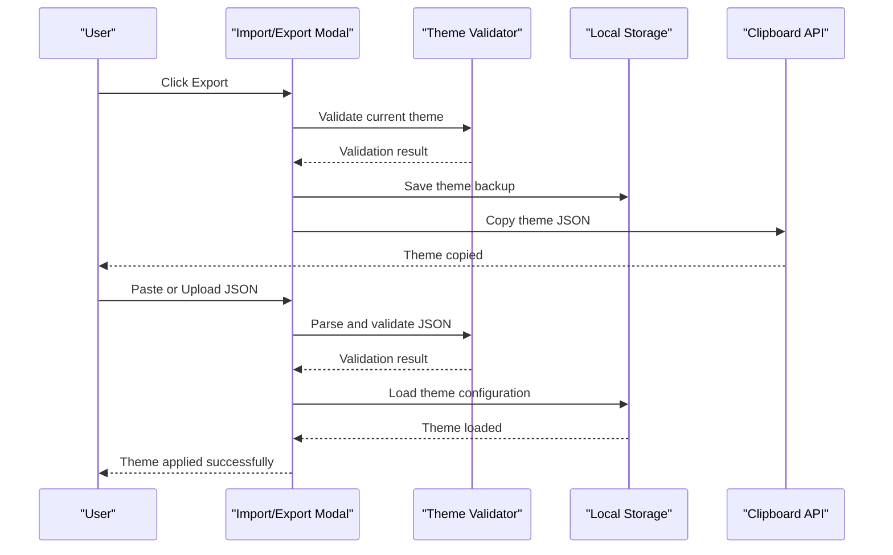
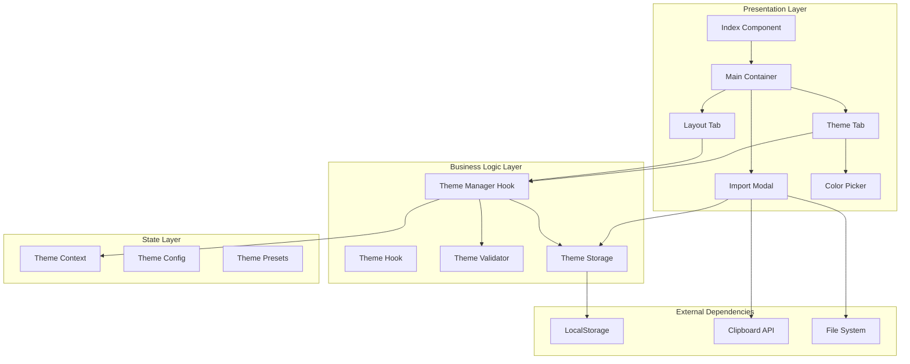

# Theme Customizer Interface

<cite>
**Referenced Files in This Document**
- [index.tsx](file://src/components/theme-customizer/index.tsx)
- [main.tsx](file://src/components/theme-customizer/main.tsx)
- [theme-tab.tsx](file://src/components/theme-customizer/theme-tab.tsx)
- [layout-tab.tsx](file://src/components/theme-customizer/layout-tab.tsx)
- [import-modal.tsx](file://src/components/theme-customizer/import-modal.tsx)
- [circular-transition.css](file://src/components/theme-customizer/circular-transition.css)
- [color-picker.tsx](file://src/components/color-picker.tsx)
- [theme-provider.tsx](file://src/components/theme-provider.tsx)
- [use-theme-manager.ts](file://src/hooks/use-theme-manager.ts)
- [use-theme.ts](file://src/hooks/use-theme.ts)
- [theme-context.ts](file://src/contexts/theme-context.ts)
- [theme-customizer-constants.ts](file://src/config/theme-customizer-constants.ts)
- [theme-data.ts](file://src/config/theme-data.ts)
- [theme-customizer.tsx](file://src/components/theme-customizer.tsx)
- [theme-customizer.ts](file://src/types/theme-customizer.ts)
- [theme.ts](file://src/types/theme.ts)
</cite>

## Table of Contents
1. [Introduction](#introduction)
2. [Project Structure](#project-structure)
3. [Core Components](#core-components)
4. [Architecture Overview](#architecture-overview)
5. [Detailed Component Analysis](#detailed-component-analysis)
6. [Dependency Analysis](#dependency-analysis)
7. [Performance Considerations](#performance-considerations)
8. [Troubleshooting Guide](#troubleshooting-guide)
9. [Conclusion](#conclusion)
10. [Appendices](#appendices)

## Introduction

The Theme Customizer Interface is a comprehensive React-based component system that provides users with an intuitive way to customize application themes and layouts. Built with Next.js and TypeScript, it offers real-time preview functionality, tab-based navigation between different customization options, and import/export capabilities for sharing themes across applications.

The customizer supports both theme customization (colors, typography, spacing) and layout modifications (sidebar configuration, header options, content density). It features a modern user interface with smooth transitions, accessibility compliance, and responsive design principles.

## Project Structure

The theme customizer follows a modular architecture with clear separation of concerns:

**Diagram sources**
- [index.tsx:1-50](file://src/components/theme-customizer/index.tsx#L1-L50)
- [main.tsx:1-50](file://src/components/theme-customizer/main.tsx#L1-L50)
- [theme-tab.tsx:1-50](file://src/components/theme-customizer/theme-tab.tsx#L1-L50)
- [layout-tab.tsx:1-50](file://src/components/theme-customizer/layout-tab.tsx#L1-L50)

**Section sources**
- [index.tsx:1-100](file://src/components/theme-customizer/index.tsx#L1-L100)
- [main.tsx:1-100](file://src/components/theme-customizer/main.tsx#L1-L100)

## Core Components

### ThemeCustomizer Index Component
The main entry point that orchestrates the entire theme customizer experience. It manages the overall state, handles component lifecycle, and provides the primary interface for theme customization.

### Main Container Component
Responsible for rendering the customizer layout, managing tab navigation, and coordinating between different customization panels. It implements the circular transition effects and maintains the active tab state.

### Theme Tab Component
Provides color scheme customization, typography controls, spacing adjustments, and visual theme options. Integrates with the color picker component for precise color selection and includes preset theme support.

### Layout Tab Component
Handles layout-specific customizations including sidebar configuration, header options, content density settings, and responsive breakpoints. Offers real-time preview of layout changes.

### Import/Export Modal
Facilitates sharing and importing theme configurations through JSON serialization and deserialization. Supports both manual input and file upload methods for theme data exchange.

**Section sources**
- [index.tsx:1-150](file://src/components/theme-customizer/index.tsx#L1-L150)
- [main.tsx:1-200](file://src/components/theme-customizer/main.tsx#L1-L200)
- [theme-tab.tsx:1-300](file://src/components/theme-customizer/theme-tab.tsx#L1-L300)
- [layout-tab.tsx:1-250](file://src/components/theme-customizer/layout-tab.tsx#L1-L250)
- [import-modal.tsx:1-200](file://src/components/theme-customizer/import-modal.tsx#L1-L200)

## Architecture Overview

The theme customizer follows a unidirectional data flow pattern with React Context for state management:

**Diagram sources**
- [theme-context.ts:1-100](file://src/contexts/theme-context.ts#L1-L100)
- [use-theme-manager.ts:1-150](file://src/hooks/use-theme-manager.ts#L1-L150)
- [use-theme.ts:1-100](file://src/hooks/use-theme.ts#L1-L100)

The architecture emphasizes:
- **Separation of Concerns**: Each component has a specific responsibility
- **Real-time Updates**: Changes are immediately reflected in the preview
- **Validation Layer**: Ensures theme configurations are valid before applying
- **Extensibility**: Easy to add new customization options

## Detailed Component Analysis

### Theme Customizer Index Component

The index component serves as the root container and manages the overall customizer lifecycle:

**Diagram sources**
- [index.tsx:1-100](file://src/components/theme-customizer/index.tsx#L1-L100)
- [theme-provider.tsx:1-150](file://src/components/theme-provider.tsx#L1-L150)
- [use-theme-manager.ts:1-200](file://src/hooks/use-theme-manager.ts#L1-L200)

Key responsibilities:
- Manages customizer visibility state
- Handles keyboard shortcuts and accessibility
- Coordinates between tabs and preview system
- Provides error boundaries and loading states

### Tab-Based Navigation System

The customizer implements a sophisticated tab navigation system with smooth transitions:

**Diagram sources**
- [main.tsx:1-150](file://src/components/theme-customizer/main.tsx#L1-L150)
- [circular-transition.css:1-100](file://src/components/theme-customizer/circular-transition.css#L1-L100)

Features include:
- Smooth circular transition animations
- Keyboard navigation support
- Focus management for accessibility
- Tab state persistence

### Color Picker Integration

The color picker component provides advanced color selection capabilities:

**Diagram sources**
- [color-picker.tsx:1-200](file://src/components/color-picker.tsx#L1-L200)
- [theme-customizer-constants.ts:1-100](file://src/config/theme-customizer-constants.ts#L1-L100)

Capabilities:
- Multiple color format support (HEX, RGB, HSL)
- Preset color palettes
- Real-time color validation
- Accessibility contrast checking

### Import/Export Modal System

The modal system enables theme sharing and backup functionality:

**Diagram sources**
- [import-modal.tsx:1-200](file://src/components/theme-customizer/import-modal.tsx#L1-L200)
- [use-theme-manager.ts:100-200](file://src/hooks/use-theme-manager.ts#L100-L200)

Features:
- JSON schema validation
- File upload support
- Clipboard integration
- Error handling and recovery
- Version compatibility checking

**Section sources**
- [index.tsx:1-200](file://src/components/theme-customizer/index.tsx#L1-L200)
- [main.tsx:1-300](file://src/components/theme-customizer/main.tsx#L1-L300)
- [theme-tab.tsx:1-400](file://src/components/theme-customizer/theme-tab.tsx#L1-L400)
- [layout-tab.tsx:1-350](file://src/components/theme-customizer/layout-tab.tsx#L1-L350)
- [import-modal.tsx:1-250](file://src/components/theme-customizer/import-modal.tsx#L1-L250)
- [color-picker.tsx:1-300](file://src/components/color-picker.tsx#L1-L300)

## Dependency Analysis

The theme customizer has a well-defined dependency structure with clear separation between presentation and logic layers:

**Diagram sources**
- [theme-context.ts:1-150](file://src/contexts/theme-context.ts#L1-L150)
- [use-theme-manager.ts:1-250](file://src/hooks/use-theme-manager.ts#L1-L250)
- [theme-customizer.ts:1-100](file://src/types/theme-customizer.ts#L1-L100)

Key dependency relationships:
- **Low Coupling**: Components depend on hooks and context rather than each other
- **High Cohesion**: Related functionality grouped within modules
- **Clear Interfaces**: Well-defined props and event contracts
- **Testability**: Mock-friendly architecture for unit testing

**Section sources**
- [theme-context.ts:1-200](file://src/contexts/theme-context.ts#L1-L200)
- [use-theme-manager.ts:1-300](file://src/hooks/use-theme-manager.ts#L1-L300)
- [theme-customizer.ts:1-150](file://src/types/theme-customizer.ts#L1-L150)

## Performance Considerations

The theme customizer implements several performance optimization strategies:

### Real-time Preview Optimization
- **Debounced Updates**: Prevents excessive re-renders during rapid changes
- **Selective Re-rendering**: Only updates affected components when theme changes
- **Virtual Scrolling**: For large theme option lists
- **Memoization**: Uses React.memo and useMemo for expensive computations

### Memory Management
- **Event Listener Cleanup**: Properly removes event listeners on component unmount
- **Large Object Caching**: Caches frequently accessed theme presets
- **Lazy Loading**: Loads heavy components only when needed

### Bundle Size Optimization
- **Code Splitting**: Separates theme customizer into separate chunks
- **Tree Shaking**: Removes unused code paths
- **Dynamic Imports**: Loads optional features on demand

## Troubleshooting Guide

### Common Issues and Solutions

#### Theme Not Applying
- **Symptom**: Changes don't reflect in the application
- **Solution**: Check theme context provider wrapping and ensure proper prop passing
- **Debug**: Verify theme manager hook returns correct values

#### Color Picker Validation Errors
- **Symptom**: Invalid color formats rejected
- **Solution**: Ensure color values match expected format (HEX, RGB, HSL)
- **Debug**: Use browser console to inspect color conversion functions

#### Import/Export Failures
- **Symptom**: Theme JSON fails to import or export
- **Solution**: Validate JSON schema and check version compatibility
- **Debug**: Inspect network requests and local storage entries

#### Performance Issues
- **Symptom**: Slow response times during theme changes
- **Solution**: Implement debouncing and optimize re-render logic
- **Debug**: Use React DevTools Profiler to identify bottlenecks

### Accessibility Checklist
- **Keyboard Navigation**: All interactive elements accessible via keyboard
- **Screen Reader Support**: Proper ARIA labels and roles
- **Focus Management**: Logical focus order and visible focus indicators
- **Color Contrast**: Meets WCAG AA standards for all color combinations
- **Reduced Motion**: Respects user's motion preferences

**Section sources**
- [use-theme-manager.ts:200-300](file://src/hooks/use-theme-manager.ts#L200-L300)
- [theme-customizer-constants.ts:50-100](file://src/config/theme-customizer-constants.ts#L50-L100)

## Conclusion

The Theme Customizer Interface provides a robust, extensible foundation for application theme customization. Its modular architecture, comprehensive feature set, and attention to user experience make it suitable for production applications requiring flexible theming capabilities.

Key strengths include:
- **Comprehensive Feature Set**: Covers both theme and layout customization
- **Real-time Feedback**: Immediate visual feedback for all changes
- **Accessibility Compliance**: Follows WCAG guidelines for inclusive design
- **Extensibility**: Easy to add new customization options and integrations
- **Performance Optimized**: Efficient rendering and memory management

The system is designed to be easily extendable, allowing developers to add new tabs, controls, and validation rules while maintaining consistency with the existing architecture.

## Appendices

### Extending the Customizer

#### Adding New Tabs
1. Create a new tab component following the established patterns
2. Register the tab in the main container configuration
3. Implement tab-specific state management
4. Add appropriate validation and persistence logic

#### Creating Custom Theme Controls
1. Extend the base control component interface
2. Implement change handlers and validation
3. Integrate with the theme context
4. Add appropriate styling and accessibility attributes

#### Implementing Theme Validation
1. Define validation rules in the constants file
2. Implement custom validators for complex scenarios
3. Add user-friendly error messages
4. Provide automatic correction suggestions where possible

### Best Practices
- Always validate user inputs before applying theme changes
- Provide meaningful error messages and recovery options
- Test thoroughly across different screen sizes and devices
- Maintain consistent naming conventions and code organization
- Document all public APIs and extension points