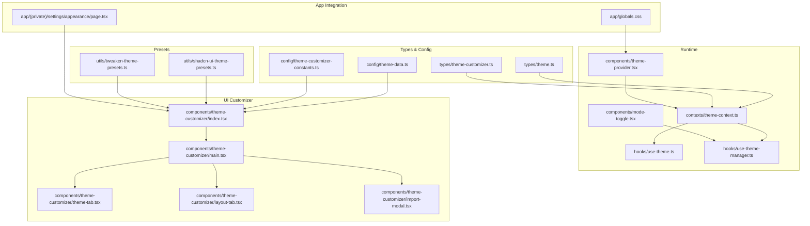
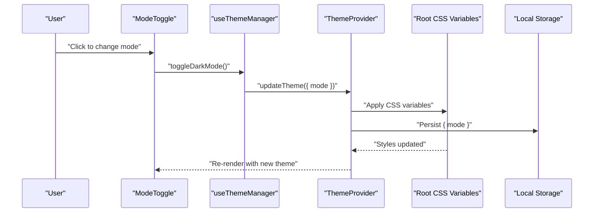
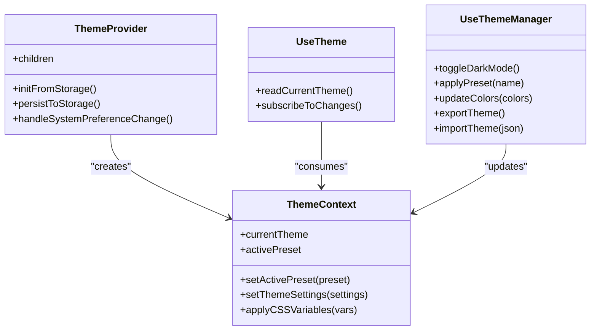
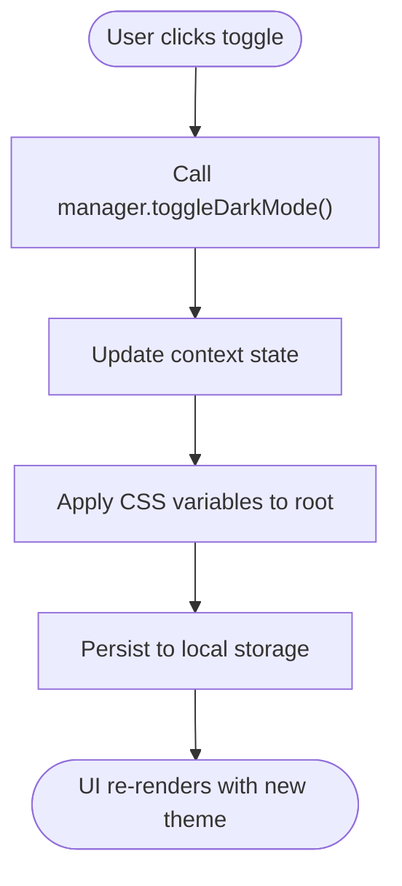
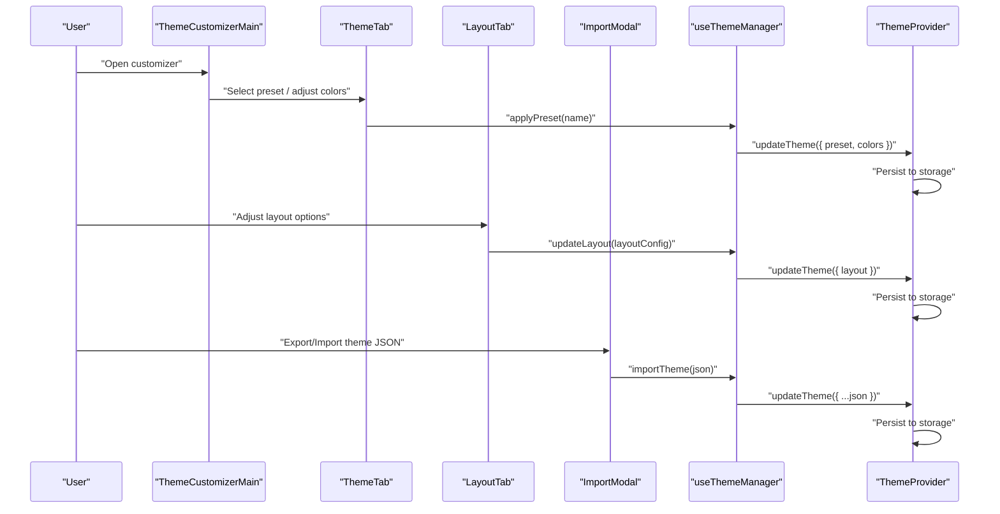
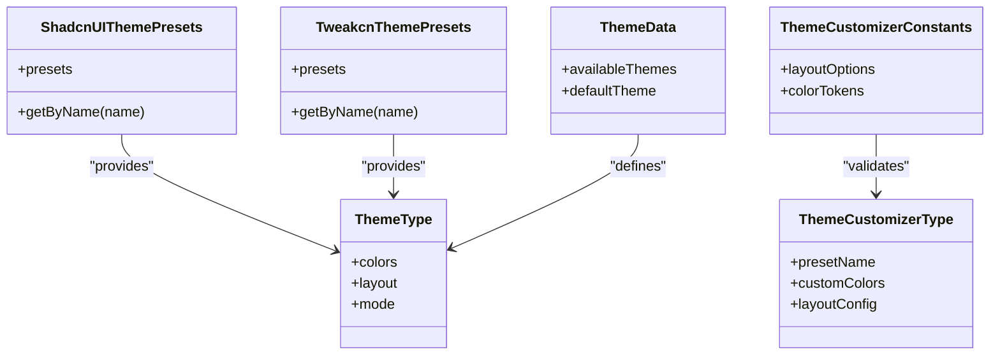
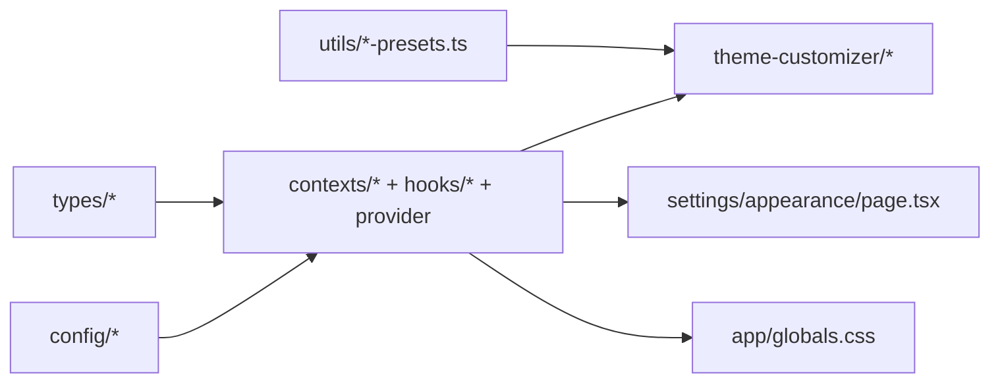

# Theme System

<cite>
**Referenced Files in This Document**
- [theme-provider.tsx](file://src/components/theme-provider.tsx)
- [use-theme.ts](file://src/hooks/use-theme.ts)
- [use-theme-manager.ts](file://src/hooks/use-theme-manager.ts)
- [theme-context.ts](file://src/contexts/theme-context.ts)
- [mode-toggle.tsx](file://src/components/mode-toggle.tsx)
- [theme-customizer/index.tsx](file://src/components/theme-customizer/index.tsx)
- [theme-customizer/main.tsx](file://src/components/theme-customizer/main.tsx)
- [theme-customizer/theme-tab.tsx](file://src/components/theme-customizer/theme-tab.tsx)
- [theme-customizer/layout-tab.tsx](file://src/components/theme-customizer/layout-tab.tsx)
- [theme-customizer/import-modal.tsx](file://src/components/theme-customizer/import-modal.tsx)
- [theme-data.ts](file://src/config/theme-data.ts)
- [theme-customizer-constants.ts](file://src/config/theme-customizer-constants.ts)
- [shadcn-ui-theme-presets.ts](file://src/utils/shadcn-ui-theme-presets.ts)
- [tweakcn-theme-presets.ts](file://src/utils/tweakcn-theme-presets.ts)
- [theme.ts](file://src/types/theme.ts)
- [theme-customizer.ts](file://src/types/theme-customizer.ts)
- [appearance/page.tsx](file://src/app/(private)/settings/appearance/page.tsx)
- [globals.css](file://src/app/globals.css)
</cite>

## Table of Contents
1. [Introduction](#introduction)
2. [Project Structure](#project-structure)
3. [Core Components](#core-components)
4. [Architecture Overview](#architecture-overview)
5. [Detailed Component Analysis](#detailed-component-analysis)
6. [Dependency Analysis](#dependency-analysis)
7. [Performance Considerations](#performance-considerations)
8. [Troubleshooting Guide](#troubleshooting-guide)
9. [Conclusion](#conclusion)
10. [Appendices](#appendices)

## Introduction
This document explains the complete theme system architecture, including configuration structure, color palette management, dark/light mode implementation, and dynamic theme switching. It also documents the theme customizer component, preset themes, and the process for creating and extending custom themes. Guidance is provided for implementing layout variations, persisting user preferences, optimizing performance, and ensuring accessibility across themes.

## Project Structure
The theme system spans several layers:
- Types and constants define the shape of theme configurations and presets.
- Context and hooks provide runtime access to theme state and utilities.
- Providers and toggles manage application-wide theme application and persistence.
- The theme customizer UI allows users to adjust colors, layouts, and import/export themes.
- Preset utilities supply built-in theme definitions.
- Global styles integrate CSS variables consumed by components.

**Diagram sources**
- [theme.ts](file://src/types/theme.ts)
- [theme-customizer.ts](file://src/types/theme-customizer.ts)
- [theme-data.ts](file://src/config/theme-data.ts)
- [theme-customizer-constants.ts](file://src/config/theme-customizer-constants.ts)
- [theme-context.ts](file://src/contexts/theme-context.ts)
- [use-theme.ts](file://src/hooks/use-theme.ts)
- [use-theme-manager.ts](file://src/hooks/use-theme-manager.ts)
- [theme-provider.tsx](file://src/components/theme-provider.tsx)
- [mode-toggle.tsx](file://src/components/mode-toggle.tsx)
- [theme-customizer/index.tsx](file://src/components/theme-customizer/index.tsx)
- [theme-customizer/main.tsx](file://src/components/theme-customizer/main.tsx)
- [theme-customizer/theme-tab.tsx](file://src/components/theme-customizer/theme-tab.tsx)
- [theme-customizer/layout-tab.tsx](file://src/components/theme-customizer/layout-tab.tsx)
- [theme-customizer/import-modal.tsx](file://src/components/theme-customizer/import-modal.tsx)
- [shadcn-ui-theme-presets.ts](file://src/utils/shadcn-ui-theme-presets.ts)
- [tweakcn-theme-presets.ts](file://src/utils/tweakcn-theme-presets.ts)
- [appearance/page.tsx](file://src/app/(private)/settings/appearance/page.tsx)
- [globals.css](file://src/app/globals.css)

**Section sources**
- [theme-provider.tsx](file://src/components/theme-provider.tsx)
- [use-theme.ts](file://src/hooks/use-theme.ts)
- [use-theme-manager.ts](file://src/hooks/use-theme-manager.ts)
- [theme-context.ts](file://src/contexts/theme-context.ts)
- [mode-toggle.tsx](file://src/components/mode-toggle.tsx)
- [theme-customizer/index.tsx](file://src/components/theme-customizer/index.tsx)
- [theme-customizer/main.tsx](file://src/components/theme-customizer/main.tsx)
- [theme-customizer/theme-tab.tsx](file://src/components/theme-customizer/theme-tab.tsx)
- [theme-customizer/layout-tab.tsx](file://src/components/theme-customizer/layout-tab.tsx)
- [theme-customizer/import-modal.tsx](file://src/components/theme-customizer/import-modal.tsx)
- [theme-data.ts](file://src/config/theme-data.ts)
- [theme-customizer-constants.ts](file://src/config/theme-customizer-constants.ts)
- [shadcn-ui-theme-presets.ts](file://src/utils/shadcn-ui-theme-presets.ts)
- [tweakcn-theme-presets.ts](file://src/utils/tweakcn-theme-presets.ts)
- [theme.ts](file://src/types/theme.ts)
- [theme-customizer.ts](file://src/types/theme-customizer.ts)
- [appearance/page.tsx](file://src/app/(private)/settings/appearance/page.tsx)
- [globals.css](file://src/app/globals.css)

## Core Components
- Theme Provider: Initializes and supplies theme context to the app, applies CSS variables, and persists user preference.
- Theme Context: Central state holder for current theme, active preset, and utility functions to update theme settings.
- Hooks:
  - useTheme: Consumes theme context to read current values and triggers re-renders on changes.
  - useThemeManager: Provides imperative methods to switch modes, apply presets, and persist changes.
- Mode Toggle: A UI control that switches between light and dark modes using the theme manager.
- Theme Customizer: A comprehensive UI for adjusting colors, applying presets, importing/exporting themes, and configuring layout options.

Key responsibilities:
- Apply CSS variables at the root level for consistent theming across components.
- Persist selected theme and layout preferences to local storage.
- Provide a reactive API for components to adapt to theme changes without manual subscriptions.

**Section sources**
- [theme-provider.tsx](file://src/components/theme-provider.tsx)
- [theme-context.ts](file://src/contexts/theme-context.ts)
- [use-theme.ts](file://src/hooks/use-theme.ts)
- [use-theme-manager.ts](file://src/hooks/use-theme-manager.ts)
- [mode-toggle.tsx](file://src/components/mode-toggle.tsx)
- [theme-customizer/index.tsx](file://src/components/theme-customizer/index.tsx)
- [theme-customizer/main.tsx](file://src/components/theme-customizer/main.tsx)

## Architecture Overview
The theme system follows a provider/context pattern with hooks for consumption and a dedicated customizer UI for user-driven updates. Presets are modular and can be extended or replaced. Global CSS variables ensure efficient style propagation.

**Diagram sources**
- [mode-toggle.tsx](file://src/components/mode-toggle.tsx)
- [use-theme-manager.ts](file://src/hooks/use-theme-manager.ts)
- [theme-provider.tsx](file://src/components/theme-provider.tsx)
- [globals.css](file://src/app/globals.css)

## Detailed Component Analysis

### Theme Provider and Context
- Provider initializes theme state from persisted storage or defaults, sets up event listeners for system preference changes, and exposes methods to update theme settings.
- Context distributes current theme values and setters to all consumers.
- Provider applies CSS variables to the document root for immediate visual updates.

**Diagram sources**
- [theme-context.ts](file://src/contexts/theme-context.ts)
- [theme-provider.tsx](file://src/components/theme-provider.tsx)
- [use-theme.ts](file://src/hooks/use-theme.ts)
- [use-theme-manager.ts](file://src/hooks/use-theme-manager.ts)

**Section sources**
- [theme-provider.tsx](file://src/components/theme-provider.tsx)
- [theme-context.ts](file://src/contexts/theme-context.ts)
- [use-theme.ts](file://src/hooks/use-theme.ts)
- [use-theme-manager.ts](file://src/hooks/use-theme-manager.ts)

### Mode Toggle
- A small UI control bound to the theme manager’s toggle function.
- Reflects current mode and triggers immediate updates via context.

**Diagram sources**
- [mode-toggle.tsx](file://src/components/mode-toggle.tsx)
- [use-theme-manager.ts](file://src/hooks/use-theme-manager.ts)
- [theme-provider.tsx](file://src/components/theme-provider.tsx)

**Section sources**
- [mode-toggle.tsx](file://src/components/mode-toggle.tsx)
- [use-theme-manager.ts](file://src/hooks/use-theme-manager.ts)

### Theme Customizer
The customizer provides a rich interface for theme adjustments:
- Main panel orchestrates tabs and actions.
- Theme tab manages color palettes, presets, and live previews.
- Layout tab controls structural aspects like sidebar behavior and spacing.
- Import modal supports exporting and importing JSON-based theme configurations.

**Diagram sources**
- [theme-customizer/main.tsx](file://src/components/theme-customizer/main.tsx)
- [theme-customizer/theme-tab.tsx](file://src/components/theme-customizer/theme-tab.tsx)
- [theme-customizer/layout-tab.tsx](file://src/components/theme-customizer/layout-tab.tsx)
- [theme-customizer/import-modal.tsx](file://src/components/theme-customizer/import-modal.tsx)
- [use-theme-manager.ts](file://src/hooks/use-theme-manager.ts)
- [theme-provider.tsx](file://src/components/theme-provider.tsx)

**Section sources**
- [theme-customizer/index.tsx](file://src/components/theme-customizer/index.tsx)
- [theme-customizer/main.tsx](file://src/components/theme-customizer/main.tsx)
- [theme-customizer/theme-tab.tsx](file://src/components/theme-customizer/theme-tab.tsx)
- [theme-customizer/layout-tab.tsx](file://src/components/theme-customizer/layout-tab.tsx)
- [theme-customizer/import-modal.tsx](file://src/components/theme-customizer/import-modal.tsx)
- [use-theme-manager.ts](file://src/hooks/use-theme-manager.ts)
- [theme-provider.tsx](file://src/components/theme-provider.tsx)

### Presets and Configuration
- Preset utilities define base color schemes and layout defaults for quick application.
- Theme data and constants centralize available options and validation rules.
- Types enforce structure for theme objects and customizer payloads.

**Diagram sources**
- [shadcn-ui-theme-presets.ts](file://src/utils/shadcn-ui-theme-presets.ts)
- [tweakcn-theme-presets.ts](file://src/utils/tweakcn-theme-presets.ts)
- [theme-data.ts](file://src/config/theme-data.ts)
- [theme-customizer-constants.ts](file://src/config/theme-customizer-constants.ts)
- [theme.ts](file://src/types/theme.ts)
- [theme-customizer.ts](file://src/types/theme-customizer.ts)

**Section sources**
- [shadcn-ui-theme-presets.ts](file://src/utils/shadcn-ui-theme-presets.ts)
- [tweakcn-theme-presets.ts](file://src/utils/tweakcn-theme-presets.ts)
- [theme-data.ts](file://src/config/theme-data.ts)
- [theme-customizer-constants.ts](file://src/config/theme-customizer-constants.ts)
- [theme.ts](file://src/types/theme.ts)
- [theme-customizer.ts](file://src/types/theme-customizer.ts)

### Appearance Settings Page
- Integrates the theme customizer into the application’s settings area.
- Exposes user-facing controls to modify and persist theme preferences.

**Section sources**
- [appearance/page.tsx](file://src/app/(private)/settings/appearance/page.tsx)
- [theme-customizer/index.tsx](file://src/components/theme-customizer/index.tsx)

## Dependency Analysis
The theme system exhibits clear separation of concerns:
- Types and config are leaf dependencies used by higher layers.
- Runtime (context, hooks, provider) depends on types and config.
- UI components depend on runtime and presets.
- Global styles consume CSS variables set by the provider.

**Diagram sources**
- [theme.ts](file://src/types/theme.ts)
- [theme-customizer.ts](file://src/types/theme-customizer.ts)
- [theme-data.ts](file://src/config/theme-data.ts)
- [theme-customizer-constants.ts](file://src/config/theme-customizer-constants.ts)
- [theme-context.ts](file://src/contexts/theme-context.ts)
- [use-theme.ts](file://src/hooks/use-theme.ts)
- [use-theme-manager.ts](file://src/hooks/use-theme-manager.ts)
- [theme-provider.tsx](file://src/components/theme-provider.tsx)
- [shadcn-ui-theme-presets.ts](file://src/utils/shadcn-ui-theme-presets.ts)
- [tweakcn-theme-presets.ts](file://src/utils/tweakcn-theme-presets.ts)
- [theme-customizer/index.tsx](file://src/components/theme-customizer/index.tsx)
- [theme-customizer/main.tsx](file://src/components/theme-customizer/main.tsx)
- [theme-customizer/theme-tab.tsx](file://src/components/theme-customizer/theme-tab.tsx)
- [theme-customizer/layout-tab.tsx](file://src/components/theme-customizer/layout-tab.tsx)
- [theme-customizer/import-modal.tsx](file://src/components/theme-customizer/import-modal.tsx)
- [appearance/page.tsx](file://src/app/(private)/settings/appearance/page.tsx)
- [globals.css](file://src/app/globals.css)

**Section sources**
- [theme-context.ts](file://src/contexts/theme-context.ts)
- [use-theme.ts](file://src/hooks/use-theme.ts)
- [use-theme-manager.ts](file://src/hooks/use-theme-manager.ts)
- [theme-provider.tsx](file://src/components/theme-provider.tsx)
- [theme-customizer/index.tsx](file://src/components/theme-customizer/index.tsx)
- [theme-customizer/main.tsx](file://src/components/theme-customizer/main.tsx)
- [theme-customizer/theme-tab.tsx](file://src/components/theme-customizer/theme-tab.tsx)
- [theme-customizer/layout-tab.tsx](file://src/components/theme-customizer/layout-tab.tsx)
- [theme-customizer/import-modal.tsx](file://src/components/theme-customizer/import-modal.tsx)
- [shadcn-ui-theme-presets.ts](file://src/utils/shadcn-ui-theme-presets.ts)
- [tweakcn-theme-presets.ts](file://src/utils/tweakcn-theme-presets.ts)
- [theme-data.ts](file://src/config/theme-data.ts)
- [theme-customizer-constants.ts](file://src/config/theme-customizer-constants.ts)
- [theme.ts](file://src/types/theme.ts)
- [theme-customizer.ts](file://src/types/theme-customizer.ts)
- [appearance/page.tsx](file://src/app/(private)/settings/appearance/page.tsx)
- [globals.css](file://src/app/globals.css)

## Performance Considerations
- Prefer CSS variable updates over heavy re-renders; the provider should batch updates when multiple tokens change.
- Debounce frequent color adjustments in the customizer to avoid excessive reflows.
- Avoid recalculating derived theme values on every render; memoize where appropriate.
- Keep preset definitions lightweight and lazy-load large theme assets if needed.
- Minimize DOM writes by grouping CSS variable assignments.

[No sources needed since this section provides general guidance]

## Troubleshooting Guide
Common issues and resolutions:
- Theme not persisting: Ensure local storage operations succeed and keys match expected names. Verify provider initialization reads persisted values correctly.
- Flash of incorrect theme on load: Initialize theme synchronously before first paint and defer non-critical UI until theme is applied.
- Colors not updating: Confirm CSS variables are applied to the correct root element and that components reference these variables consistently.
- Import fails: Validate imported JSON against the customizer type schema; reject malformed structures early and surface clear errors.

**Section sources**
- [theme-provider.tsx](file://src/components/theme-provider.tsx)
- [use-theme-manager.ts](file://src/hooks/use-theme-manager.ts)
- [theme-customizer/import-modal.tsx](file://src/components/theme-customizer/import-modal.tsx)
- [theme-customizer.ts](file://src/types/theme-customizer.ts)

## Conclusion
The theme system combines a robust provider/context foundation with a flexible customizer UI and well-defined presets. By leveraging CSS variables, centralized state, and persistent storage, it delivers responsive, accessible, and performant theming across the application. Extensibility is straightforward through typed presets and configuration, while the customizer enables both power users and casual users to tailor appearance and layout effectively.

[No sources needed since this section summarizes without analyzing specific files]

## Appendices

### Theme Configuration Structure
- Theme object includes:
  - Colors: semantic tokens mapped to CSS variables.
  - Layout: structural options such as sidebar width and density.
  - Mode: light/dark selection.
- Customizer payload mirrors the theme object with additional metadata for UI interactions.

**Section sources**
- [theme.ts](file://src/types/theme.ts)
- [theme-customizer.ts](file://src/types/theme-customizer.ts)

### Creating and Extending Themes
- To extend an existing preset:
  - Load the base preset from preset utilities.
  - Override specific color tokens or layout options.
  - Register the new theme via the customizer or programmatically through the theme manager.
- To create a new color scheme:
  - Define a full set of semantic color tokens.
  - Ensure contrast ratios meet accessibility guidelines.
  - Test across light and dark modes.

**Section sources**
- [shadcn-ui-theme-presets.ts](file://src/utils/shadcn-ui-theme-presets.ts)
- [tweakcn-theme-presets.ts](file://src/utils/tweakcn-theme-presets.ts)
- [theme-customizer/theme-tab.tsx](file://src/components/theme-customizer/theme-tab.tsx)
- [use-theme-manager.ts](file://src/hooks/use-theme-manager.ts)

### Implementing Layout Variations
- Use the layout tab to adjust sidebar behavior, content density, and spacing.
- Persist layout choices alongside theme preferences.
- Ensure layout changes do not break component alignment by relying on CSS variables and consistent spacing tokens.

**Section sources**
- [theme-customizer/layout-tab.tsx](file://src/components/theme-customizer/layout-tab.tsx)
- [theme-customizer/constants.ts](file://src/config/theme-customizer-constants.ts)

### Accessibility Considerations
- Maintain sufficient contrast for text and interactive elements in both light and dark modes.
- Provide keyboard-accessible controls in the customizer.
- Respect system preferences and allow easy overrides.
- Avoid relying solely on color to convey meaning; add icons or labels where necessary.

**Section sources**
- [mode-toggle.tsx](file://src/components/mode-toggle.tsx)
- [theme-customizer/theme-tab.tsx](file://src/components/theme-customizer/theme-tab.tsx)