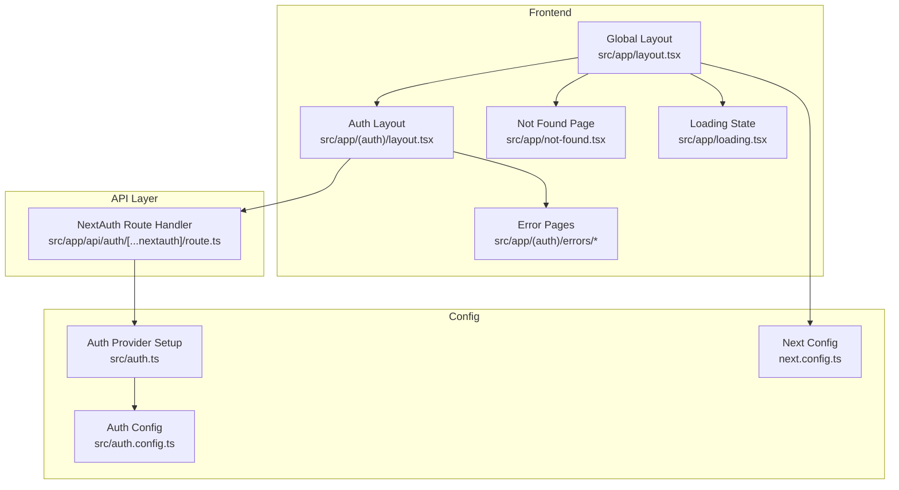
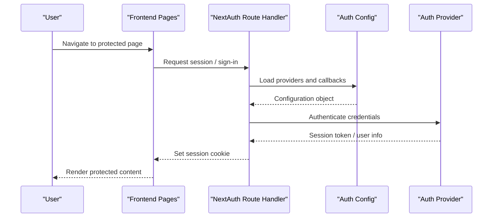
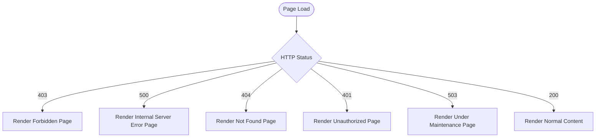
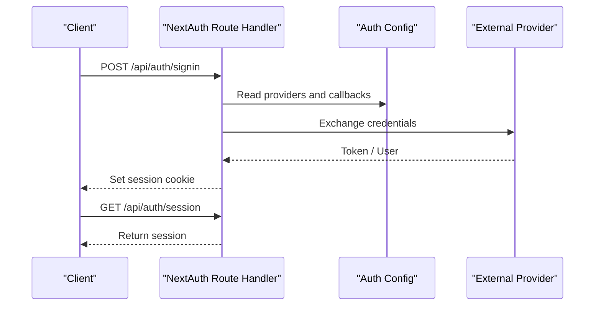
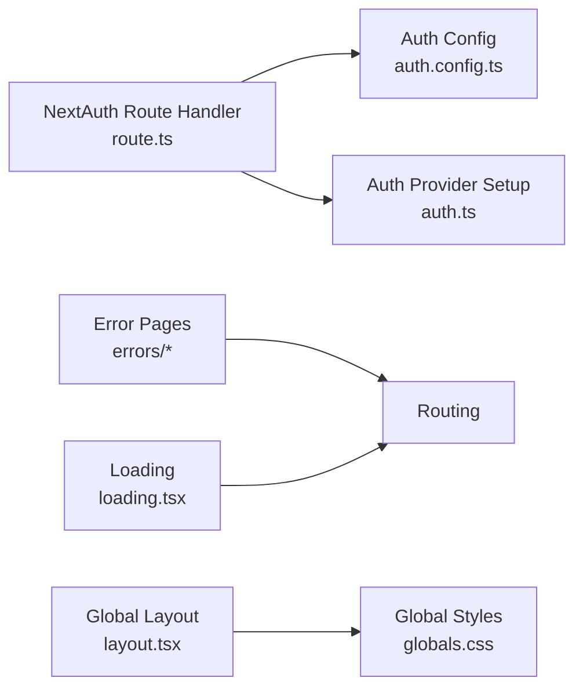

# Troubleshooting & FAQ

<cite>
**Referenced Files in This Document**
- [not-found.tsx](file://src/app/not-found.tsx)
- [layout.tsx](file://src/app/(auth)/layout.tsx)
- [page.tsx](file://src/app/(auth)/errors/forbidden/page.tsx)
- [page.tsx](file://src/app/(auth)/errors/internal-server-error/page.tsx)
- [page.tsx](file://src/app/(auth)/errors/not-found/page.tsx)
- [page.tsx](file://src/app/(auth)/errors/unauthorized/page.tsx)
- [page.tsx](file://src/app/(auth)/errors/under-maintenance/page.tsx)
- [route.ts](file://src/app/api/auth/[...nextauth]/route.ts)
- [auth.ts](file://src/auth.ts)
- [auth.config.ts](file://src/auth.config.ts)
- [loading.tsx](file://src/app/loading.tsx)
- [globals.css](file://src/app/globals.css)
- [next.config.ts](file://next.config.ts)
- [package.json](file://package.json)
</cite>

## Table of Contents
1. [Introduction](#introduction)
2. [Project Structure](#project-structure)
3. [Core Components](#core-components)
4. [Architecture Overview](#architecture-overview)
5. [Detailed Component Analysis](#detailed-component-analysis)
6. [Dependency Analysis](#dependency-analysis)
7. [Performance Considerations](#performance-considerations)
8. [Troubleshooting Guide](#troubleshooting-guide)
9. [Conclusion](#conclusion)
10. [Appendices](#appendices)

## Introduction
This document provides a comprehensive troubleshooting and FAQ guide for the project. It focuses on error pages, authentication flows, logging strategies, diagnostic tools, performance profiling, memory leak detection, and production debugging techniques. It also includes step-by-step solutions to frequently asked questions about setup, configuration, and feature usage.

## Project Structure
The application is a Next.js app with:
- App Router pages under src/app
- API routes under src/app/api
- Authentication via NextAuth (App Router route handler)
- Centralized error pages for common HTTP states
- Global styles and loading state components

**Diagram sources**
- [layout.tsx](file://src/app/(auth)/layout.tsx)
- [page.tsx](file://src/app/(auth)/errors/forbidden/page.tsx)
- [page.tsx](file://src/app/(auth)/errors/internal-server-error/page.tsx)
- [page.tsx](file://src/app/(auth)/errors/not-found/page.tsx)
- [page.tsx](file://src/app/(auth)/errors/unauthorized/page.tsx)
- [page.tsx](file://src/app/(auth)/errors/under-maintenance/page.tsx)
- [route.ts](file://src/app/api/auth/[...nextauth]/route.ts)
- [auth.ts](file://src/auth.ts)
- [auth.config.ts](file://src/auth.config.ts)
- [loading.tsx](file://src/app/loading.tsx)
- [next.config.ts](file://next.config.ts)

**Section sources**
- [layout.tsx](file://src/app/(auth)/layout.tsx)
- [route.ts](file://src/app/api/auth/[...nextauth]/route.ts)
- [auth.ts](file://src/auth.ts)
- [auth.config.ts](file://src/auth.config.ts)
- [loading.tsx](file://src/app/loading.tsx)
- [next.config.ts](file://next.config.ts)

## Core Components
- Error Pages: Dedicated pages for forbidden, internal server error, not found, unauthorized, and under maintenance scenarios.
- Auth Flow: NextAuth route handler integrates with auth provider and configuration.
- Global UI: Loading state and global styles provide consistent UX during transitions and errors.

Key responsibilities:
- Present user-friendly messages for expected failure modes.
- Centralize authentication logic and session handling.
- Provide consistent loading indicators and base styling.

**Section sources**
- [page.tsx](file://src/app/(auth)/errors/forbidden/page.tsx)
- [page.tsx](file://src/app/(auth)/errors/internal-server-error/page.tsx)
- [page.tsx](file://src/app/(auth)/errors/not-found/page.tsx)
- [page.tsx](file://src/app/(auth)/errors/unauthorized/page.tsx)
- [page.tsx](file://src/app/(auth)/errors/under-maintenance/page.tsx)
- [route.ts](file://src/app/api/auth/[...nextauth]/route.ts)
- [auth.ts](file://src/auth.ts)
- [auth.config.ts](file://src/auth.config.ts)
- [loading.tsx](file://src/app/loading.tsx)

## Architecture Overview
Authentication and error handling architecture:
- The NextAuth route handler manages sign-in/out and session lifecycle.
- Auth configuration defines providers and callbacks.
- Error pages are rendered based on HTTP status or authorization outcomes.
- Global layout and loading component ensure consistent UX across navigation and data fetching.

**Diagram sources**
- [route.ts](file://src/app/api/auth/[...nextauth]/route.ts)
- [auth.config.ts](file://src/auth.config.ts)
- [auth.ts](file://src/auth.ts)

## Detailed Component Analysis

### Error Pages
Common error pages include:
- Forbidden: Access denied due to insufficient permissions.
- Internal Server Error: Unexpected server-side failures.
- Not Found: Resource does not exist.
- Unauthorized: Missing or invalid authentication.
- Under Maintenance: Service temporarily unavailable.

Typical behaviors:
- Display clear messaging and recovery actions (e.g., go back, contact support).
- Maintain branding and theme consistency.
- Avoid leaking sensitive details to users.

**Diagram sources**
- [page.tsx](file://src/app/(auth)/errors/forbidden/page.tsx)
- [page.tsx](file://src/app/(auth)/errors/internal-server-error/page.tsx)
- [page.tsx](file://src/app/(auth)/errors/not-found/page.tsx)
- [page.tsx](file://src/app/(auth)/errors/unauthorized/page.tsx)
- [page.tsx](file://src/app/(auth)/errors/under-maintenance/page.tsx)

**Section sources**
- [page.tsx](file://src/app/(auth)/errors/forbidden/page.tsx)
- [page.tsx](file://src/app/(auth)/errors/internal-server-error/page.tsx)
- [page.tsx](file://src/app/(auth)/errors/not-found/page.tsx)
- [page.tsx](file://src/app/(auth)/errors/unauthorized/page.tsx)
- [page.tsx](file://src/app/(auth)/errors/under-maintenance/page.tsx)

### Authentication Flow
The authentication flow uses NextAuth with a route handler and centralized configuration.

**Diagram sources**
- [route.ts](file://src/app/api/auth/[...nextauth]/route.ts)
- [auth.config.ts](file://src/auth.config.ts)
- [auth.ts](file://src/auth.ts)

**Section sources**
- [route.ts](file://src/app/api/auth/[...nextauth]/route.ts)
- [auth.config.ts](file://src/auth.config.ts)
- [auth.ts](file://src/auth.ts)

### Global UI and Loading States
- Global layout wraps all pages and applies consistent structure.
- Loading component provides visual feedback during navigation or data fetching.
- Global styles define base themes and utilities.

**Section sources**
- [layout.tsx](file://src/app/(auth)/layout.tsx)
- [loading.tsx](file://src/app/loading.tsx)
- [globals.css](file://src/app/globals.css)

## Dependency Analysis
High-level dependencies relevant to troubleshooting:
- NextAuth route handler depends on auth configuration and provider setup.
- Error pages depend on routing and HTTP status mapping.
- Global UI components depend on CSS and layout conventions.

**Diagram sources**
- [route.ts](file://src/app/api/auth/[...nextauth]/route.ts)
- [auth.config.ts](file://src/auth.config.ts)
- [auth.ts](file://src/auth.ts)
- [page.tsx](file://src/app/(auth)/errors/forbidden/page.tsx)
- [page.tsx](file://src/app/(auth)/errors/internal-server-error/page.tsx)
- [page.tsx](file://src/app/(auth)/errors/not-found/page.tsx)
- [page.tsx](file://src/app/(auth)/errors/unauthorized/page.tsx)
- [page.tsx](file://src/app/(auth)/errors/under-maintenance/page.tsx)
- [layout.tsx](file://src/app/(auth)/layout.tsx)
- [loading.tsx](file://src/app/loading.tsx)
- [globals.css](file://src/app/globals.css)

**Section sources**
- [route.ts](file://src/app/api/auth/[...nextauth]/route.ts)
- [auth.config.ts](file://src/auth.config.ts)
- [auth.ts](file://src/auth.ts)
- [layout.tsx](file://src/app/(auth)/layout.tsx)
- [loading.tsx](file://src/app/loading.tsx)
- [globals.css](file://src/app/globals.css)

## Performance Considerations
- Use browser DevTools Performance tab to capture CPU and network profiles during reproduction steps.
- Identify long tasks and heavy re-renders; prefer code splitting and memoization where appropriate.
- Monitor memory snapshots to detect retained objects and potential leaks.
- For server-side issues, review logs and response times from your hosting environment.

[No sources needed since this section provides general guidance]

## Troubleshooting Guide

### Common Issues and Resolutions

#### Authentication Failures
Symptoms:
- Redirect loops after sign-in.
- “Unauthorized” or “Forbidden” pages appear unexpectedly.

Steps:
- Verify environment variables for provider secrets and callback URLs.
- Ensure the NextAuth route handler path matches client calls.
- Confirm that session cookies are allowed and CORS settings permit cross-site requests if applicable.
- Inspect browser console and Network tab for failed requests and error responses.

Recovery:
- Clear cookies and cache, then retry sign-in.
- Validate provider dashboard settings (redirect URIs, scopes).

**Section sources**
- [route.ts](file://src/app/api/auth/[...nextauth]/route.ts)
- [auth.config.ts](file://src/auth.config.ts)
- [auth.ts](file://src/auth.ts)

#### 404 Not Found
Symptoms:
- Navigation to non-existent routes shows a custom not found page.

Steps:
- Check route definitions and file naming conventions.
- Ensure dynamic segments match expected patterns.
- Review redirects and rewrites in configuration.

Recovery:
- Fix broken links and update route paths accordingly.

**Section sources**
- [page.tsx](file://src/app/(auth)/errors/not-found/page.tsx)
- [next.config.ts](file://next.config.ts)

#### 401 Unauthorized
Symptoms:
- Protected pages redirect to login or show an unauthorized message.

Steps:
- Confirm session existence and validity.
- Check token expiration and refresh behavior.
- Validate middleware or guards enforcing access control.

Recovery:
- Re-authenticate and ensure correct roles/permissions are assigned.

**Section sources**
- [page.tsx](file://src/app/(auth)/errors/unauthorized/page.tsx)
- [route.ts](file://src/app/api/auth/[...nextauth]/route.ts)

#### 403 Forbidden
Symptoms:
- Access denied despite being authenticated.

Steps:
- Review role-based checks and permission mappings.
- Ensure user attributes contain required claims.

Recovery:
- Update user roles or adjust authorization logic.

**Section sources**
- [page.tsx](file://src/app/(auth)/errors/forbidden/page.tsx)

#### 500 Internal Server Error
Symptoms:
- Generic server error page appears.

Steps:
- Check server logs for stack traces and error context.
- Validate database connectivity and external service availability.
- Inspect request payloads and headers for malformed data.

Recovery:
- Fix underlying server-side bugs and redeploy.

**Section sources**
- [page.tsx](file://src/app/(auth)/errors/internal-server-error/page.tsx)

#### 503 Under Maintenance
Symptoms:
- Site displays an under maintenance message.

Steps:
- Confirm deployment pipeline and health checks.
- Verify environment readiness and dependency services.

Recovery:
- Restore services and remove maintenance mode when ready.

**Section sources**
- [page.tsx](file://src/app/(auth)/errors/under-maintenance/page.tsx)

### Logging Implementation
Recommendations:
- Log structured events at key boundaries (authentication, API calls, critical operations).
- Include correlation IDs to trace requests across layers.
- Avoid logging sensitive data (tokens, passwords, PII).
- Use different log levels (info, warn, error) and aggregate logs centrally.

Implementation ideas:
- Wrap API handlers with try/catch blocks and log errors with context.
- Emit metrics for latency and error rates.
- Integrate with a logging service compatible with your hosting platform.

[No sources needed since this section provides general guidance]

### Diagnostic Tools
- Browser DevTools:
  - Network: inspect requests, responses, and timing.
  - Console: view errors and warnings.
  - Performance: capture timelines and identify bottlenecks.
  - Memory: take heap snapshots to detect leaks.
- Node/Server:
  - Enable verbose logging in development.
  - Use process-level diagnostics (CPU/memory profiles) in staging/prod.

[No sources needed since this section provides general guidance]

### Production Debugging Techniques
- Reproduce issues using production-like environments.
- Correlate timestamps and request IDs across frontend and backend logs.
- Use feature flags to isolate problematic changes.
- Roll back recent deployments if regression suspected.

[No sources needed since this section provides general guidance]

### Frequently Asked Questions

#### How do I configure authentication providers?
- Add provider configuration in the auth config file.
- Ensure environment variables are set for secrets and endpoints.
- Test sign-in flow and verify session creation.

**Section sources**
- [auth.config.ts](file://src/auth.config.ts)
- [auth.ts](file://src/auth.ts)

#### Why am I seeing a generic error page instead of detailed logs?
- Error pages intentionally hide sensitive details.
- Check server logs for stack traces and context.
- Add structured logging around failing operations.

**Section sources**
- [page.tsx](file://src/app/(auth)/errors/internal-server-error/page.tsx)

#### How can I improve perceived performance during navigation?
- Use the global loading component to indicate progress.
- Implement optimistic updates and skeleton screens.
- Profile with DevTools to reduce heavy computations.

**Section sources**
- [loading.tsx](file://src/app/loading.tsx)

#### What should I check if the site is unreachable or slow?
- Verify hosting environment health and resource limits.
- Inspect DNS, SSL, and CDN configurations.
- Review server logs and metrics for anomalies.

**Section sources**
- [next.config.ts](file://next.config.ts)

#### How do I handle missing routes gracefully?
- Ensure the not found page renders for unmatched routes.
- Add redirects for deprecated paths.
- Audit links and dynamic segments.

**Section sources**
- [page.tsx](file://src/app/(auth)/errors/not-found/page.tsx)

## Conclusion
This guide consolidates error handling, authentication troubleshooting, logging strategies, and performance diagnostics. By following the steps and leveraging the provided diagrams and references, you can quickly identify root causes and apply effective resolutions in both development and production environments.

## Appendices

### Quick Reference: Where to Look
- Authentication: route handler and auth configuration files.
- Error Pages: dedicated pages under the errors directory.
- Global UI: layout, loading, and global styles.
- Configuration: Next.js configuration and package scripts.

**Section sources**
- [route.ts](file://src/app/api/auth/[...nextauth]/route.ts)
- [auth.config.ts](file://src/auth.config.ts)
- [auth.ts](file://src/auth.ts)
- [page.tsx](file://src/app/(auth)/errors/forbidden/page.tsx)
- [page.tsx](file://src/app/(auth)/errors/internal-server-error/page.tsx)
- [page.tsx](file://src/app/(auth)/errors/not-found/page.tsx)
- [page.tsx](file://src/app/(auth)/errors/unauthorized/page.tsx)
- [page.tsx](file://src/app/(auth)/errors/under-maintenance/page.tsx)
- [layout.tsx](file://src/app/(auth)/layout.tsx)
- [loading.tsx](file://src/app/loading.tsx)
- [globals.css](file://src/app/globals.css)
- [next.config.ts](file://next.config.ts)
- [package.json](file://package.json)