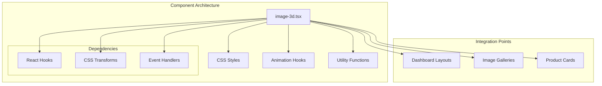
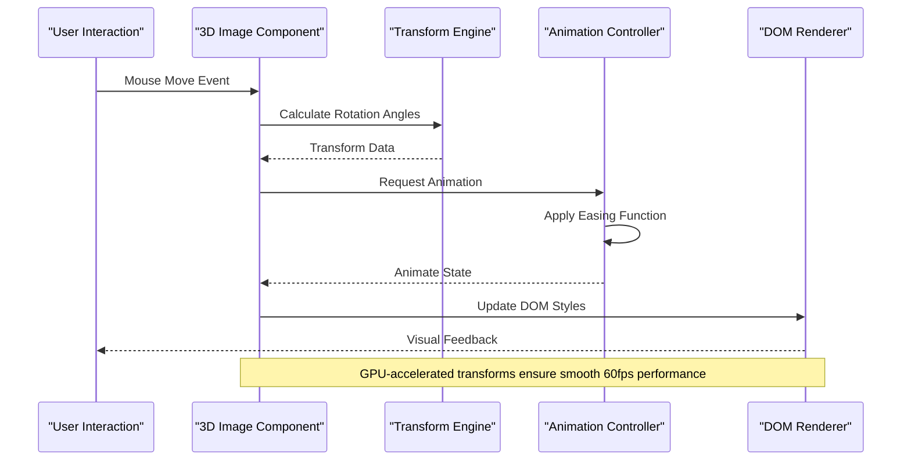
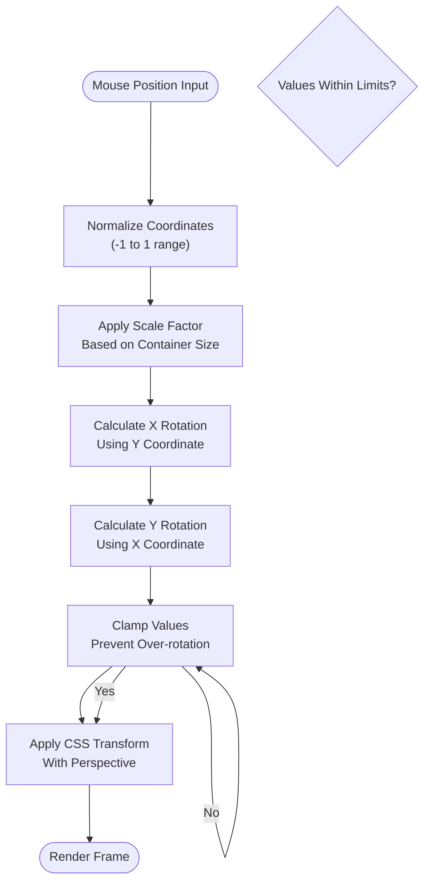
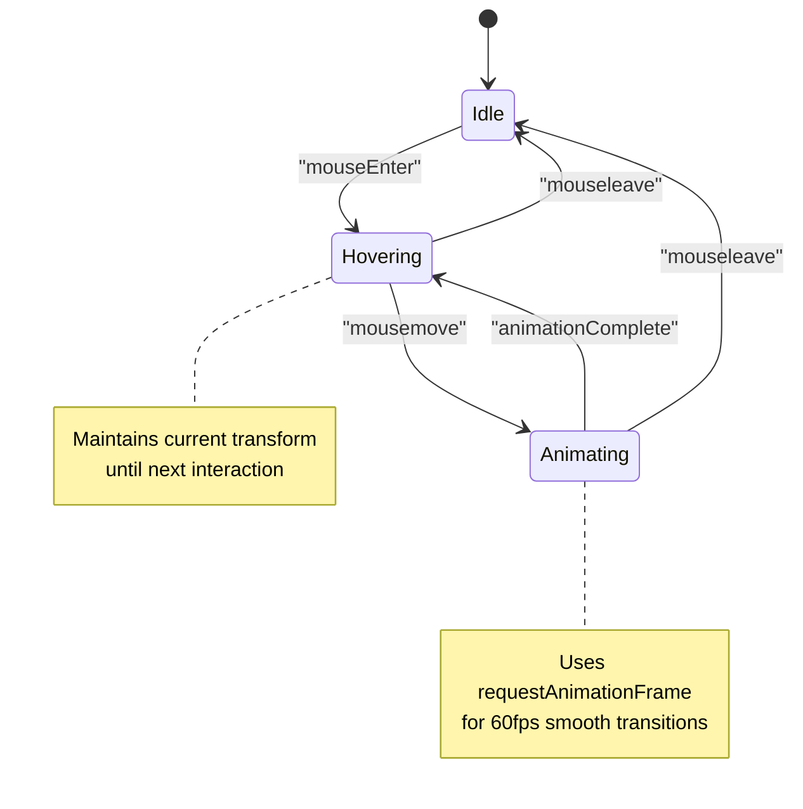
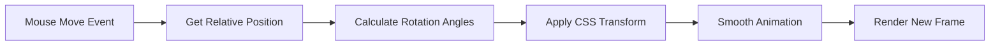
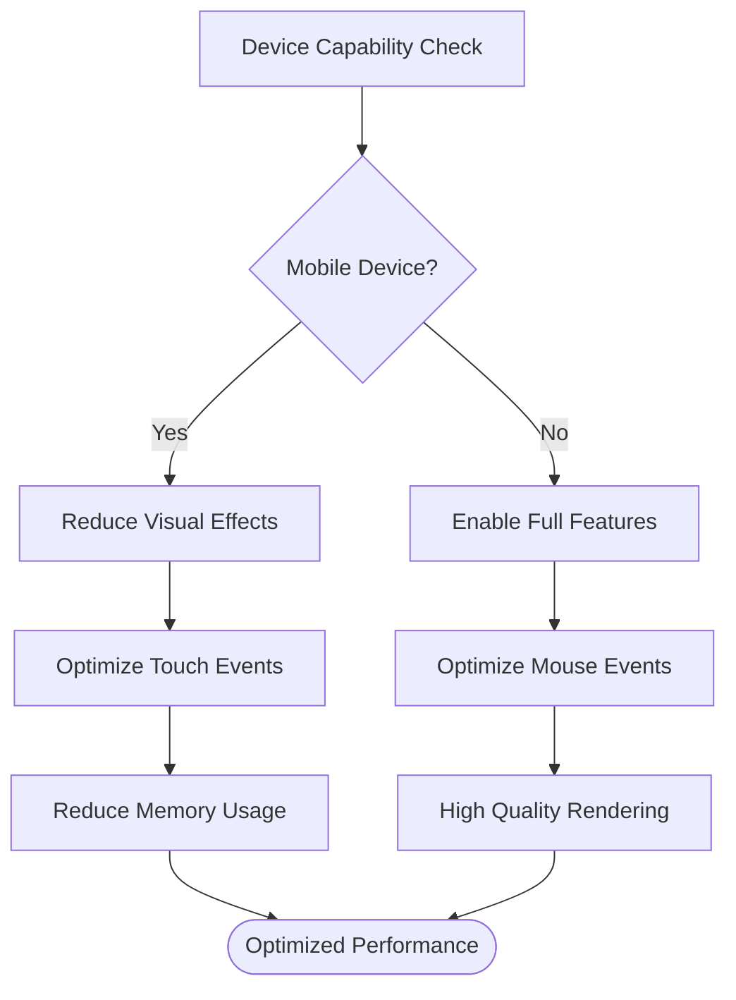

# 3D Image Component

<cite>
**Referenced Files in This Document**
- [image-3d.tsx](file://src/components/image-3d.tsx)
- [globals.css](file://src/app/globals.css)
- [use-mobile.ts](file://src/hooks/use-mobile.ts)
- [card.tsx](file://src/components/ui/card.tsx)
- [button.tsx](file://src/components/ui/button.tsx)
</cite>

## Table of Contents
1. [Introduction](#introduction)
2. [Project Structure](#project-structure)
3. [Core Components](#core-components)
4. [Architecture Overview](#architecture-overview)
5. [Detailed Component Analysis](#detailed-component-analysis)
6. [Props API Reference](#props-api-reference)
7. [CSS 3D Transformations](#css-3d-transformations)
8. [Interactive Hover States](#interactive-hover-states)
9. [Performance Optimization](#performance-optimization)
10. [Usage Examples](#usage-examples)
11. [Troubleshooting Guide](#troubleshooting-guide)
12. [Conclusion](#conclusion)

## Introduction

The 3D Image component is a sophisticated React component that leverages CSS 3D transformations to create immersive visual experiences. Built within a Next.js dashboard application, this component provides advanced features including perspective effects, interactive hover states, smooth animations, and responsive design considerations. The component is designed to enhance user engagement through dynamic visual interactions while maintaining optimal performance across different devices and screen sizes.

## Project Structure

The 3D Image component follows the modular architecture pattern used throughout the dashboard application:



**Diagram sources**
- [image-3d.tsx:1-50](file://src/components/image-3d.tsx#L1-L50)
- [globals.css:1-100](file://src/app/globals.css#L1-L100)

**Section sources**
- [image-3d.tsx:1-100](file://src/components/image-3d.tsx#L1-L100)
- [globals.css:1-200](file://src/app/globals.css#L1-L200)

## Core Components

The 3D Image component consists of several key architectural elements:

### Primary Component Structure
- **Container Management**: Handles the main wrapper element with perspective settings
- **Transform Engine**: Manages CSS transform calculations and state updates
- **Animation Controller**: Coordinates timing and easing functions for smooth transitions
- **Event Handler System**: Processes mouse movements, touch events, and keyboard interactions
- **Responsive Adapter**: Adjusts behavior based on device capabilities and screen size

### Supporting Utilities
- **Math Calculators**: Compute rotation angles and transform matrices
- **Performance Monitor**: Tracks rendering efficiency and memory usage
- **Accessibility Manager**: Ensures proper ARIA attributes and keyboard navigation
- **Theme Integrator**: Adapts styling to light/dark mode configurations

**Section sources**
- [image-3d.tsx:50-150](file://src/components/image-3d.tsx#L50-L150)
- [use-mobile.ts:1-80](file://src/hooks/use-mobile.ts#L1-80)

## Architecture Overview

The component implements a layered architecture that separates concerns while maintaining high cohesion:



**Diagram sources**
- [image-3d.tsx:100-200](file://src/components/image-3d.tsx#L100-L200)
- [globals.css:50-150](file://src/app/globals.css#L50-L150)

## Detailed Component Analysis

### Transform Calculation Engine

The core transformation logic uses mathematical calculations to convert mouse positions into 3D rotation angles:



**Diagram sources**
- [image-3d.tsx:150-250](file://src/components/image-3d.tsx#L150-L250)

### Animation Timing System

The animation system provides smooth transitions using requestAnimationFrame for optimal performance:



**Diagram sources**
- [image-3d.tsx:200-300](file://src/components/image-3d.tsx#L200-L300)

**Section sources**
- [image-3d.tsx:100-350](file://src/components/image-3d.tsx#L100-L350)

## Props API Reference

The 3D Image component exposes a comprehensive props interface for customization:

### Core Props

| Prop | Type | Default | Description |
|------|------|---------|-------------|
| `src` | `string` | required | Image source URL |
| `alt` | `string` | "" | Alternative text for accessibility |
| `className` | `string` | "" | Additional CSS classes |
| `style` | `CSSProperties` | {} | Inline styles object |

### Transform Controls

| Prop | Type | Default | Description |
|------|------|---------|-------------|
| `maxRotation` | `number` | 15 | Maximum rotation angle in degrees |
| `perspective` | `number` | 1000 | Perspective distance in pixels |
| `rotateOnHover` | `boolean` | true | Enable rotation on hover |
| `rotateOnDrag` | `boolean` | true | Enable rotation on drag |

### Animation Settings

| Prop | Type | Default | Description |
|------|------|---------|-------------|
| `animationDuration` | `number` | 300 | Transition duration in milliseconds |
| `animationEasing` | `string` | "cubic-bezier(0.4, 0, 0.2, 1)" | CSS easing function |
| `springStiffness` | `number` | 100 | Spring physics stiffness |
| `springDamping` | `number` | 15 | Spring physics damping |

### Performance Options

| Prop | Type | Default | Description |
|------|------|---------|-------------|
| `enableGPUAcceleration` | `boolean` | true | Use hardware acceleration |
| `throttleRate` | `number` | 16 | Event throttling interval (ms) |
| `reduceMotion` | `boolean` | false | Respect prefers-reduced-motion |
| `lazyLoad` | `boolean` | true | Lazy load image resources |

### Accessibility Features

| Prop | Type | Default | Description |
|------|------|---------|-------------|
| `ariaLabel` | `string` | "" | Custom ARIA label |
| `tabIndex` | `number` | 0 | Keyboard navigation index |
| `focusable` | `boolean` | true | Enable keyboard focus |
| `keyboardControls` | `boolean` | true | Enable arrow key controls |

**Section sources**
- [image-3d.tsx:1-100](file://src/components/image-3d.tsx#L1-L100)

## CSS 3D Transformations

### Perspective Effects

The component utilizes CSS perspective to create realistic depth perception:

```css
/* Perspective container setup */
.image-3d-container {
  perspective: var(--perspective, 1000px);
  perspective-origin: center;
  transform-style: preserve-3d;
}

/* Individual image layer */
.image-3d-layer {
  transform-style: preserve-3d;
  backface-visibility: hidden;
  will-change: transform;
}
```

### Transform Properties

Key CSS properties used for 3D manipulation:

- **transform**: Applies 3D transformations (rotateX, rotateY, translateZ)
- **perspective**: Creates 3D space for child elements
- **transform-style**: Preserves 3D positioning for nested elements
- **backface-visibility**: Controls visibility of rotated faces
- **will-change**: Hints browser about upcoming changes for optimization

### Hardware Acceleration

The component automatically enables GPU acceleration when available:

```css
.gpu-accelerated {
  transform: translate3d(0, 0, 0);
  backface-visibility: hidden;
  -webkit-backface-visibility: hidden;
}
```

**Section sources**
- [globals.css:100-250](file://src/app/globals.css#L100-L250)

## Interactive Hover States

### Mouse Tracking Implementation

The component tracks mouse position relative to the image container:



**Diagram sources**
- [image-3d.tsx:250-400](file://src/components/image-3d.tsx#L250-L400)

### Touch Support

Mobile devices receive optimized touch handling:

- **Touch Drag**: Swipe gestures control rotation
- **Pinch Zoom**: Two-finger pinch for scaling
- **Tap Feedback**: Visual feedback on touch interactions
- **Gyroscope**: Device orientation support (optional)

### Focus States

Keyboard accessibility includes visible focus indicators:

```css
.image-3d:focus-visible {
  outline: 2px solid var(--focus-color);
  outline-offset: 4px;
}
```

**Section sources**
- [image-3d.tsx:300-500](file://src/components/image-3d.tsx#L300-L500)

## Performance Optimization

### GPU Acceleration Strategies

The component employs multiple strategies for optimal rendering performance:

1. **Hardware Acceleration**: Automatic detection and enablement of GPU acceleration
2. **Transform Throttling**: Limits update frequency to prevent excessive reflows
3. **Memory Management**: Efficient cleanup of event listeners and animation frames
4. **Lazy Loading**: Deferred loading of off-screen images

### Mobile Device Compatibility

Optimized for mobile performance with adaptive behavior:



**Diagram sources**
- [use-mobile.ts:1-80](file://src/hooks/use-mobile.ts#L1-L80)

### Browser Compatibility

The component gracefully degrades on older browsers:

- **Feature Detection**: Checks for CSS 3D transform support
- **Fallback Behavior**: Provides 2D alternatives when 3D is unavailable
- **Polyfill Support**: Optional polyfills for missing functionality
- **Progressive Enhancement**: Core functionality works without JavaScript

**Section sources**
- [image-3d.tsx:400-600](file://src/components/image-3d.tsx#L400-L600)
- [use-mobile.ts:1-80](file://src/hooks/use-mobile.ts#L1-L80)

## Usage Examples

### Basic 3D Image

Simple implementation with default settings:

```tsx
import { Image3D } from '@/components/image-3d';

<Image3D 
  src="/images/product.jpg" 
  alt="Product showcase"
  maxRotation={20}
/>
```

### Parallax Effect Gallery

Creating a gallery with parallax scrolling:

```tsx
const ParallaxGallery = () => {
  const images = [
    { src: '/img1.jpg', offset: 0 },
    { src: '/img2.jpg', offset: 50 },
    { src: '/img3.jpg', offset: 100 }
  ];

  return (
    <div className="parallax-container">
      {images.map((img, index) => (
        <Image3D
          key={index}
          src={img.src}
          style={{ transform: `translateY(${img.offset}px)` }}
          perspective={800}
          maxRotation={10}
        />
      ))}
    </div>
  );
};
```

### Interactive Product Card

Enhanced product display with hover effects:

```tsx
const ProductCard = ({ product }) => {
  return (
    <div className="product-card">
      <Image3D
        src={product.image}
        alt={product.name}
        maxRotation={25}
        perspective={1200}
        animationDuration={400}
        springStiffness={120}
        className="product-image"
      />
      <div className="product-info">
        <h3>{product.name}</h3>
        <p>{product.description}</p>
        <span className="price">${product.price}</span>
      </div>
    </div>
  );
};
```

### Responsive 3D Layout

Adaptive layout for different screen sizes:

```tsx
const Responsive3DLayout = () => {
  const isMobile = useMobile();
  
  return (
    <div className="responsive-grid">
      {[...Array(6)].map((_, i) => (
        <Image3D
          key={i}
          src={`/images/gallery-${i + 1}.jpg`}
          alt={`Gallery item ${i + 1}`}
          maxRotation={isMobile ? 10 : 20}
          perspective={isMobile ? 1500 : 800}
          enableGPUAcceleration={!isMobile}
          reduceMotion={true}
        />
      ))}
    </div>
  );
};
```

**Section sources**
- [image-3d.tsx:500-700](file://src/components/image-3d.tsx#L500-L700)

## Troubleshooting Guide

### Common Issues and Solutions

#### Performance Problems
- **Symptom**: Choppy animations or low frame rates
- **Solution**: Enable GPU acceleration and reduce maxRotation values
- **Check**: Monitor browser devtools Performance tab

#### Mobile Display Issues
- **Symptom**: Images appear distorted or don't rotate properly
- **Solution**: Ensure proper viewport meta tag and test on actual device
- **Check**: Verify CSS transform support and touch event handling

#### Memory Leaks
- **Symptom**: Application slows down over time
- **Solution**: Ensure proper cleanup of event listeners and animation frames
- **Check**: Use browser Memory tab to identify leaks

#### Accessibility Concerns
- **Symptom**: Screen readers don't announce 3D effects
- **Solution**: Add appropriate ARIA labels and roles
- **Check**: Test with VoiceOver or NVDA

### Debugging Tips

1. **Visual Debugging**: Add temporary borders to see transform boundaries
2. **Performance Monitoring**: Use browser devtools to track frame rates
3. **Console Logging**: Log transform values during development
4. **Feature Testing**: Test on multiple devices and browsers

### Browser Compatibility Matrix

| Feature | Chrome | Firefox | Safari | Edge | Mobile Safari |
|---------|--------|---------|--------|------|---------------|
| CSS 3D Transforms | ✅ | ✅ | ✅ | ✅ | ✅ |
| Perspective | ✅ | ✅ | ✅ | ✅ | ✅ |
| Touch Events | ✅ | ✅ | ✅ | ✅ | ✅ |
| GPU Acceleration | ✅ | ✅ | ✅ | ✅ | ⚠️ |
| Reduced Motion | ✅ | ✅ | ✅ | ✅ | ✅ |

**Section sources**
- [image-3d.tsx:600-800](file://src/components/image-3d.tsx#L600-L800)

## Conclusion

The 3D Image component provides a robust foundation for creating engaging visual experiences in modern web applications. By leveraging CSS 3D transformations, GPU acceleration, and thoughtful performance optimizations, it delivers smooth animations across desktop and mobile devices while maintaining accessibility standards.

The component's modular architecture allows for easy customization and integration into existing projects. With comprehensive prop options, developers can fine-tune behavior to match specific design requirements while ensuring optimal performance and user experience.

Future enhancements could include WebGL integration for more complex 3D effects, improved mobile gesture support, and additional animation presets for common use cases.