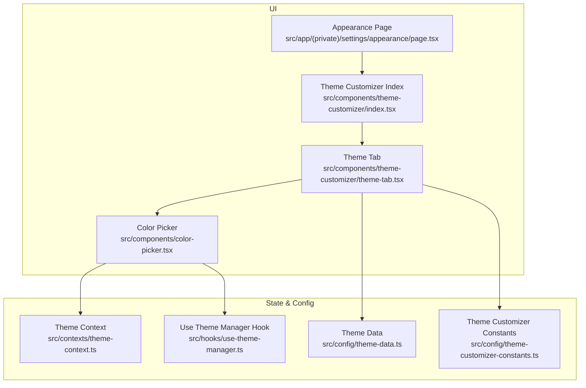
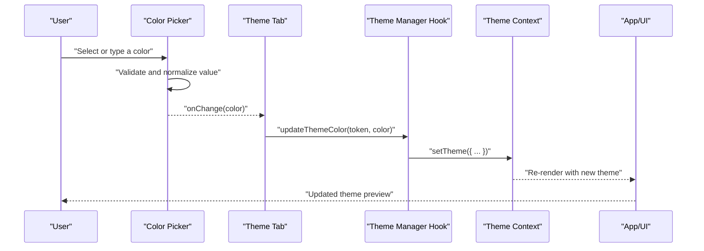
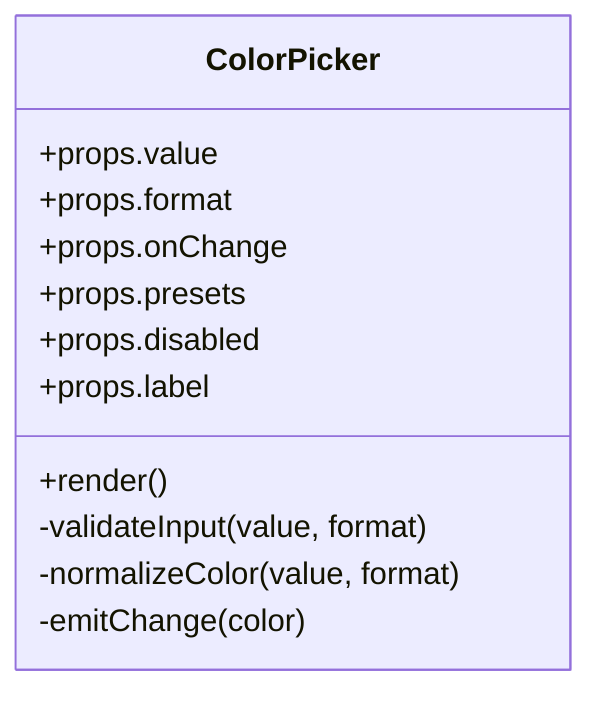
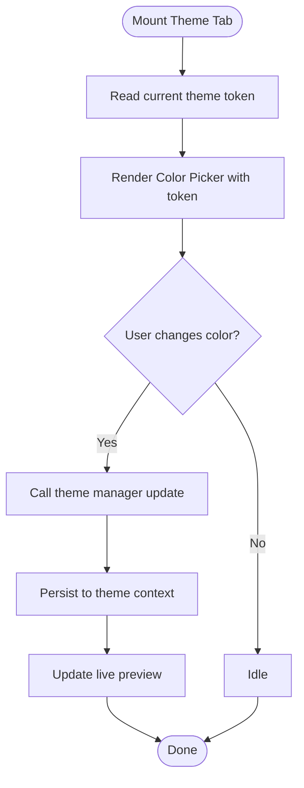
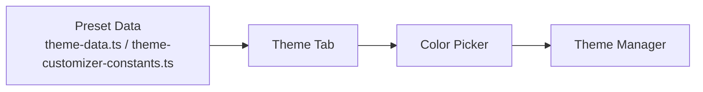
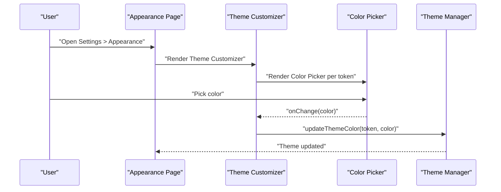
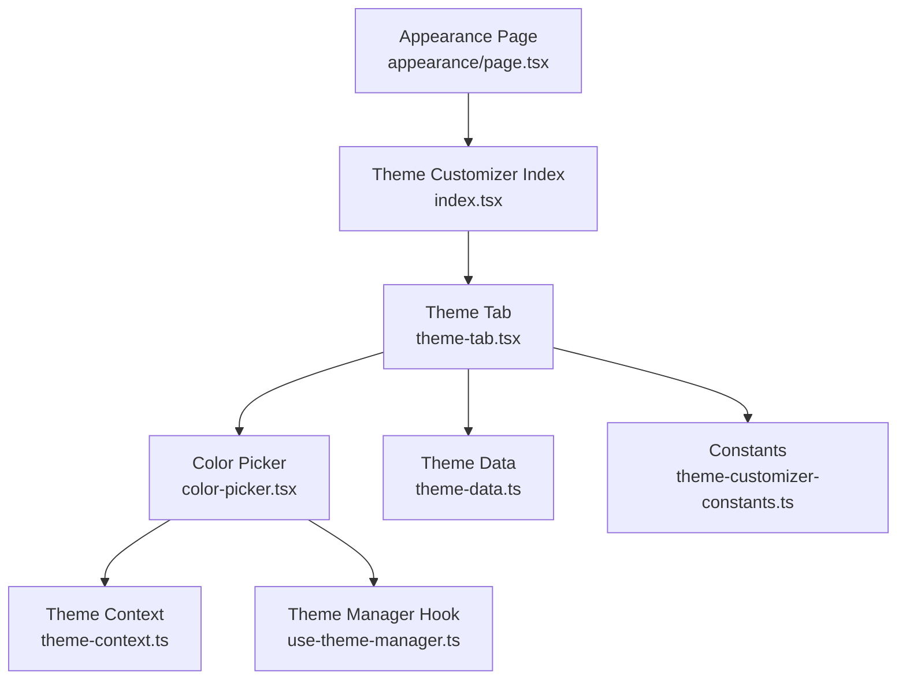

# Color Picker

<cite>
**Referenced Files in This Document**
- [color-picker.tsx](file://src/components/color-picker.tsx)
- [theme-tab.tsx](file://src/components/theme-customizer/theme-tab.tsx)
- [index.tsx](file://src/components/theme-customizer/index.tsx)
- [theme-data.ts](file://src/config/theme-data.ts)
- [theme-customizer-constants.ts](file://src/config/theme-customizer-constants.ts)
- [use-theme-manager.ts](file://src/hooks/use-theme-manager.ts)
- [theme-context.ts](file://src/contexts/theme-context.ts)
- [appearance/page.tsx](file://src/app/(private)/settings/appearance/page.tsx)
</cite>

## Table of Contents
1. [Introduction](#introduction)
2. [Project Structure](#project-structure)
3. [Core Components](#core-components)
4. [Architecture Overview](#architecture-overview)
5. [Detailed Component Analysis](#detailed-component-analysis)
6. [Dependency Analysis](#dependency-analysis)
7. [Performance Considerations](#performance-considerations)
8. [Troubleshooting Guide](#troubleshooting-guide)
9. [Conclusion](#conclusion)
10. [Appendices](#appendices)

## Introduction
This document provides comprehensive documentation for the Color Picker component used across the application’s theme customization features. It explains color selection interfaces, palette management, supported color formats (HEX, RGB, HSL), props and events, integration with the theme system, accessibility considerations, responsive design patterns, performance guidance for large datasets, and cross-browser compatibility notes.

## Project Structure
The Color Picker is implemented as a reusable UI component and integrated into the Theme Customizer to allow users to adjust theme colors. The relevant files include:
- The Color Picker implementation
- Theme customizer tabs and entry points
- Theme data and constants
- Theme context and hooks for state synchronization
- Appearance settings page where the customizer is mounted

**Diagram sources**
- [color-picker.tsx](file://src/components/color-picker.tsx)
- [index.tsx](file://src/components/theme-customizer/index.tsx)
- [theme-tab.tsx](file://src/components/theme-customizer/theme-tab.tsx)
- [appearance/page.tsx](file://src/app/(private)/settings/appearance/page.tsx)
- [theme-context.ts](file://src/contexts/theme-context.ts)
- [use-theme-manager.ts](file://src/hooks/use-theme-manager.ts)
- [theme-data.ts](file://src/config/theme-data.ts)
- [theme-customizer-constants.ts](file://src/config/theme-customizer-constants.ts)

**Section sources**
- [color-picker.tsx](file://src/components/color-picker.tsx)
- [index.tsx](file://src/components/theme-customizer/index.tsx)
- [theme-tab.tsx](file://src/components/theme-customizer/theme-tab.tsx)
- [appearance/page.tsx](file://src/app/(private)/settings/appearance/page.tsx)
- [theme-context.ts](file://src/contexts/theme-context.ts)
- [use-theme-manager.ts](file://src/hooks/use-theme-manager.ts)
- [theme-data.ts](file://src/config/theme-data.ts)
- [theme-customizer-constants.ts](file://src/config/theme-customizer-constants.ts)

## Core Components
- Color Picker: A focused component that renders color selection controls, supports multiple color formats, and emits change events to update the active theme color.
- Theme Customizer: Orchestrates the user experience by mounting the Color Picker within themed panels and persisting changes via the theme manager.

Key responsibilities:
- Present color swatches and input fields for HEX, RGB, and HSL values
- Validate and normalize color inputs
- Emit change events to propagate updates up to the theme layer
- Respect theme tokens and provide accessible labels and keyboard navigation

**Section sources**
- [color-picker.tsx](file://src/components/color-picker.tsx)
- [theme-tab.tsx](file://src/components/theme-customizer/theme-tab.tsx)
- [index.tsx](file://src/components/theme-customizer/index.tsx)

## Architecture Overview
The Color Picker integrates with the theme system through a context and hook-based architecture. Changes flow from the picker to the theme manager, which updates the theme context and re-renders affected components.

**Diagram sources**
- [color-picker.tsx](file://src/components/color-picker.tsx)
- [theme-tab.tsx](file://src/components/theme-customizer/theme-tab.tsx)
- [use-theme-manager.ts](file://src/hooks/use-theme-manager.ts)
- [theme-context.ts](file://src/contexts/theme-context.ts)

## Detailed Component Analysis

### Color Picker Component
Responsibilities:
- Accepts props for current color, format mode, and callbacks
- Renders swatch grid, color wheel/slider (if present), and text inputs for HEX/RGB/HSL
- Normalizes and validates inputs before emitting changes
- Provides accessible labels, roles, and keyboard support

Typical props:
- value: string | number[] representing the current color
- format: "hex" | "rgb" | "hsl" controlling default input presentation
- onChange: callback invoked with normalized color value
- presets: optional array of predefined color swatches
- disabled: boolean to disable interaction
- label: string for accessibility labeling

Events:
- onChange(color): triggered on any valid color change; accepts normalized color suitable for downstream consumers

Validation and normalization:
- Ensures HEX strings are valid and normalized
- Validates RGB ranges and clamps out-of-range values
- Validates HSL hue saturation lightness bounds
- Emits consistent format to avoid downstream parsing errors

Accessibility:
- Semantic roles for interactive elements
- ARIA attributes for live regions when appropriate
- Keyboard navigation for swatches and inputs
- Sufficient contrast for focus indicators

Responsive behavior:
- Adapts swatch grid density based on viewport width
- Collapses input rows on small screens
- Uses flexible layout to maintain usability on mobile

Integration with theme:
- Consumes theme tokens to render previews
- Updates theme state via provided hooks/context

**Section sources**
- [color-picker.tsx](file://src/components/color-picker.tsx)

#### Class-like structure overview

**Diagram sources**
- [color-picker.tsx](file://src/components/color-picker.tsx)

### Theme Integration
The Theme Tab mounts the Color Picker and wires it to the theme manager. It reads current theme values and persists updates.

**Diagram sources**
- [theme-tab.tsx](file://src/components/theme-customizer/theme-tab.tsx)
- [use-theme-manager.ts](file://src/hooks/use-theme-manager.ts)
- [theme-context.ts](file://src/contexts/theme-context.ts)

**Section sources**
- [theme-tab.tsx](file://src/components/theme-customizer/theme-tab.tsx)
- [use-theme-manager.ts](file://src/hooks/use-theme-manager.ts)
- [theme-context.ts](file://src/contexts/theme-context.ts)

### Palette Management
Palette configuration is centralized in theme data and constants. The Theme Tab can load preset palettes and expose them as selectable swatches within the Color Picker.

- Preset definitions: stored in theme data and constants
- Swatch rendering: driven by palette arrays
- Selection flow: clicking a swatch triggers an immediate color change event

**Diagram sources**
- [theme-data.ts](file://src/config/theme-data.ts)
- [theme-customizer-constants.ts](file://src/config/theme-customizer-constants.ts)
- [theme-tab.tsx](file://src/components/theme-customizer/theme-tab.tsx)
- [color-picker.tsx](file://src/components/color-picker.tsx)
- [use-theme-manager.ts](file://src/hooks/use-theme-manager.ts)

**Section sources**
- [theme-data.ts](file://src/config/theme-data.ts)
- [theme-customizer-constants.ts](file://src/config/theme-customizer-constants.ts)
- [theme-tab.tsx](file://src/components/theme-customizer/theme-tab.tsx)
- [color-picker.tsx](file://src/components/color-picker.tsx)

### Usage Example: Integrating the Color Picker in Settings
The Appearance page mounts the Theme Customizer, which includes the Color Picker. Users can adjust theme colors directly from this page.

**Diagram sources**
- [appearance/page.tsx](file://src/app/(private)/settings/appearance/page.tsx)
- [index.tsx](file://src/components/theme-customizer/index.tsx)
- [theme-tab.tsx](file://src/components/theme-customizer/theme-tab.tsx)
- [color-picker.tsx](file://src/components/color-picker.tsx)
- [use-theme-manager.ts](file://src/hooks/use-theme-manager.ts)

**Section sources**
- [appearance/page.tsx](file://src/app/(private)/settings/appearance/page.tsx)
- [index.tsx](file://src/components/theme-customizer/index.tsx)
- [theme-tab.tsx](file://src/components/theme-customizer/theme-tab.tsx)
- [color-picker.tsx](file://src/components/color-picker.tsx)
- [use-theme-manager.ts](file://src/hooks/use-theme-manager.ts)

## Dependency Analysis
The Color Picker depends on theme-related modules for state synchronization and rendering. The following diagram shows key dependencies:

**Diagram sources**
- [color-picker.tsx](file://src/components/color-picker.tsx)
- [theme-context.ts](file://src/contexts/theme-context.ts)
- [use-theme-manager.ts](file://src/hooks/use-theme-manager.ts)
- [theme-tab.tsx](file://src/components/theme-customizer/theme-tab.tsx)
- [theme-data.ts](file://src/config/theme-data.ts)
- [theme-customizer-constants.ts](file://src/config/theme-customizer-constants.ts)
- [appearance/page.tsx](file://src/app/(private)/settings/appearance/page.tsx)
- [index.tsx](file://src/components/theme-customizer/index.tsx)

**Section sources**
- [color-picker.tsx](file://src/components/color-picker.tsx)
- [theme-context.ts](file://src/contexts/theme-context.ts)
- [use-theme-manager.ts](file://src/hooks/use-theme-manager.ts)
- [theme-tab.tsx](file://src/components/theme-customizer/theme-tab.tsx)
- [theme-data.ts](file://src/config/theme-data.ts)
- [theme-customizer-constants.ts](file://src/config/theme-customizer-constants.ts)
- [appearance/page.tsx](file://src/app/(private)/settings/appearance/page.tsx)
- [index.tsx](file://src/components/theme-customizer/index.tsx)

## Performance Considerations
- Large palette datasets:
  - Virtualize or paginate swatch lists to reduce DOM size
  - Debounce rapid input changes to minimize re-renders
  - Memoize expensive computations such as color conversions
- Rendering optimization:
  - Use stable references for callbacks and config objects
  - Avoid unnecessary re-renders by splitting components and using memoization
- Memory usage:
  - Limit the number of simultaneously rendered swatches
  - Reuse computed color values instead of recalculating on each render

[No sources needed since this section provides general guidance]

## Troubleshooting Guide
Common issues and resolutions:
- Invalid color input:
  - Ensure validation logic rejects malformed HEX/RGB/HSL values
  - Normalize inputs to canonical forms before emitting changes
- No theme update after selection:
  - Verify onChange is wired correctly to the theme manager
  - Confirm the theme context receives the updated token
- Accessibility problems:
  - Check that all interactive elements have proper labels and roles
  - Ensure keyboard navigation works for swatches and inputs
- Cross-browser inconsistencies:
  - Test color parsing and display across browsers
  - Normalize color formats consistently to avoid browser-specific quirks

**Section sources**
- [color-picker.tsx](file://src/components/color-picker.tsx)
- [theme-tab.tsx](file://src/components/theme-customizer/theme-tab.tsx)
- [use-theme-manager.ts](file://src/hooks/use-theme-manager.ts)
- [theme-context.ts](file://src/contexts/theme-context.ts)

## Conclusion
The Color Picker provides a robust, accessible interface for selecting and editing colors in HEX, RGB, and HSL formats. Integrated with the theme system, it enables real-time theme customization while maintaining performance and responsiveness. By following the guidelines for props, events, accessibility, and performance, developers can extend and adapt the component to meet diverse use cases.

[No sources needed since this section summarizes without analyzing specific files]

## Appendices

### Props Reference
- value: Current color value (string or array depending on format)
- format: Default input format ("hex", "rgb", "hsl")
- onChange: Callback invoked with normalized color
- presets: Array of predefined color swatches
- disabled: Disables user interaction
- label: Accessible label for the control

**Section sources**
- [color-picker.tsx](file://src/components/color-picker.tsx)

### Event Handling
- onChange(color): Emitted whenever the selected color changes; accepts normalized color suitable for theme updates

**Section sources**
- [color-picker.tsx](file://src/components/color-picker.tsx)

### Accessibility Checklist
- Provide descriptive labels and roles
- Support keyboard navigation and focus management
- Ensure sufficient contrast for focus indicators and text
- Announce changes to assistive technologies when appropriate

**Section sources**
- [color-picker.tsx](file://src/components/color-picker.tsx)

### Responsive Design Patterns
- Adaptive swatch grid density
- Collapsible input sections on small screens
- Flexible layouts to maintain usability across devices

**Section sources**
- [color-picker.tsx](file://src/components/color-picker.tsx)

### Cross-Browser Compatibility Notes
- Normalize color formats consistently
- Validate inputs before applying to CSS variables or styles
- Test color rendering and interactions across major browsers

**Section sources**
- [color-picker.tsx](file://src/components/color-picker.tsx)