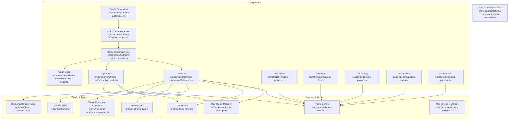
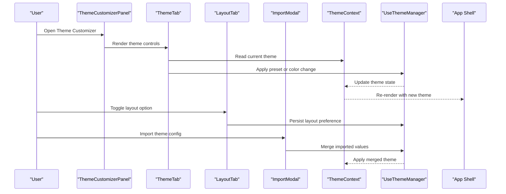
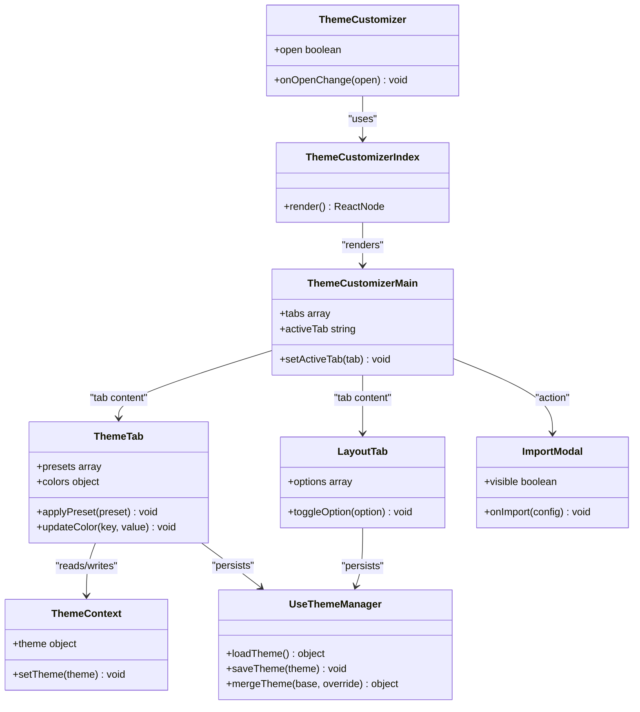
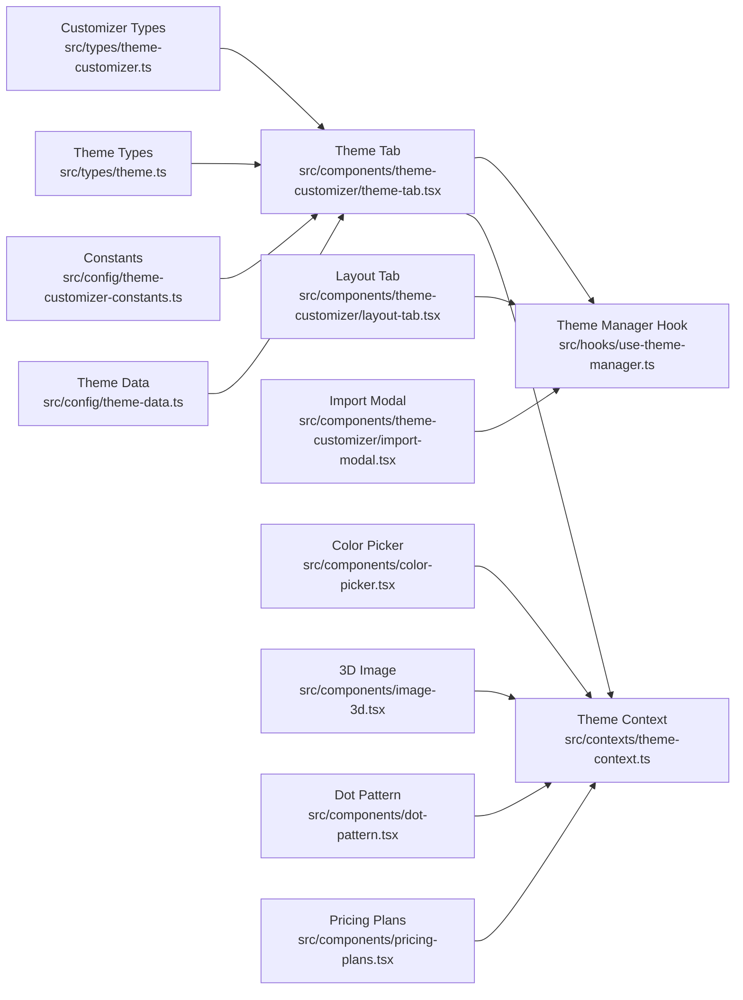

# Custom Components

<cite>
**Referenced Files in This Document**
- [theme-customizer.tsx](file://src/components/theme-customizer.tsx)
- [index.tsx](file://src/components/theme-customizer/index.tsx)
- [main.tsx](file://src/components/theme-customizer/main.tsx)
- [theme-tab.tsx](file://src/components/theme-customizer/theme-tab.tsx)
- [layout-tab.tsx](file://src/components/theme-customizer/layout-tab.tsx)
- [import-modal.tsx](file://src/components/theme-customizer/import-modal.tsx)
- [circular-transition.css](file://src/components/theme-customizer/circular-transition.css)
- [color-picker.tsx](file://src/components/color-picker.tsx)
- [image-3d.tsx](file://src/components/image-3d.tsx)
- [dot-pattern.tsx](file://src/components/dot-pattern.tsx)
- [pricing-plans.tsx](file://src/components/pricing-plans.tsx)
- [auth-provider.tsx](file://src/components/auth-provider.tsx)
- [theme-context.ts](file://src/contexts/theme-context.ts)
- [use-theme-manager.ts](file://src/hooks/use-theme-manager.ts)
- [use-theme.ts](file://src/hooks/use-theme.ts)
- [use-circular-transition.ts](file://src/hooks/use-circular-transition.ts)
- [theme-data.ts](file://src/config/theme-data.ts)
- [theme-customizer-constants.ts](file://src/config/theme-customizer-constants.ts)
- [theme.ts](file://src/types/theme.ts)
- [theme-customizer.ts](file://src/types/theme-customizer.ts)
- [auth.config.ts](file://src/auth.config.ts)
- [auth.ts](file://src/auth.ts)
- [next-auth.d.ts](file://src/types/next-auth.d.ts)
</cite>

## Table of Contents
1. [Introduction](#introduction)
2. [Project Structure](#project-structure)
3. [Core Components](#core-components)
4. [Architecture Overview](#architecture-overview)
5. [Detailed Component Analysis](#detailed-component-analysis)
6. [Dependency Analysis](#dependency-analysis)
7. [Performance Considerations](#performance-considerations)
8. [Troubleshooting Guide](#troubleshooting-guide)
9. [Conclusion](#conclusion)

## Introduction
This document provides comprehensive documentation for custom application-specific components: Theme Customizer, Color Picker, 3D Image, Dot Pattern, Pricing Plans, and Auth Provider. It explains advanced functionality, integration patterns, customization options, and usage examples such as theme switching, color manipulation, 3D transformations, and authentication flows. It also covers performance considerations and browser compatibility guidance.

## Project Structure
The custom components are implemented under src/components with supporting hooks, contexts, configuration, and types. The Theme Customizer is a multi-tab UI that orchestrates theme and layout changes, while other components provide specialized UI features.

**Diagram sources**
- [theme-customizer.tsx:1-200](file://src/components/theme-customizer.tsx#L1-L200)
- [index.tsx:1-200](file://src/components/theme-customizer/index.tsx#L1-L200)
- [main.tsx:1-200](file://src/components/theme-customizer/main.tsx#L1-L200)
- [theme-tab.tsx:1-200](file://src/components/theme-customizer/theme-tab.tsx#L1-L200)
- [layout-tab.tsx:1-200](file://src/components/theme-customizer/layout-tab.tsx#L1-L200)
- [import-modal.tsx:1-200](file://src/components/theme-customizer/import-modal.tsx#L1-L200)
- [circular-transition.css:1-200](file://src/components/theme-customizer/circular-transition.css#L1-L200)
- [color-picker.tsx:1-200](file://src/components/color-picker.tsx#L1-L200)
- [image-3d.tsx:1-200](file://src/components/image-3d.tsx#L1-L200)
- [dot-pattern.tsx:1-200](file://src/components/dot-pattern.tsx#L1-L200)
- [pricing-plans.tsx:1-200](file://src/components/pricing-plans.tsx#L1-L200)
- [auth-provider.tsx:1-200](file://src/components/auth-provider.tsx#L1-L200)
- [theme-context.ts:1-200](file://src/contexts/theme-context.ts#L1-L200)
- [use-theme-manager.ts:1-200](file://src/hooks/use-theme-manager.ts#L1-L200)
- [use-theme.ts:1-200](file://src/hooks/use-theme.ts#L1-L200)
- [use-circular-transition.ts:1-200](file://src/hooks/use-circular-transition.ts#L1-L200)
- [theme-data.ts:1-200](file://src/config/theme-data.ts#L1-L200)
- [theme-customizer-constants.ts:1-200](file://src/config/theme-customizer-constants.ts#L1-L200)
- [theme.ts:1-200](file://src/types/theme.ts#L1-L200)
- [theme-customizer.ts:1-200](file://src/types/theme-customizer.ts#L1-L200)

**Section sources**
- [theme-customizer.tsx:1-200](file://src/components/theme-customizer.tsx#L1-L200)
- [index.tsx:1-200](file://src/components/theme-customizer/index.tsx#L1-L200)
- [main.tsx:1-200](file://src/components/theme-customizer/main.tsx#L1-L200)
- [theme-tab.tsx:1-200](file://src/components/theme-customizer/theme-tab.tsx#L1-L200)
- [layout-tab.tsx:1-200](file://src/components/theme-customizer/layout-tab.tsx#L1-L200)
- [import-modal.tsx:1-200](file://src/components/theme-customizer/import-modal.tsx#L1-L200)
- [circular-transition.css:1-200](file://src/components/theme-customizer/circular-transition.css#L1-L200)
- [color-picker.tsx:1-200](file://src/components/color-picker.tsx#L1-L200)
- [image-3d.tsx:1-200](file://src/components/image-3d.tsx#L1-L200)
- [dot-pattern.tsx:1-200](file://src/components/dot-pattern.tsx#L1-L200)
- [pricing-plans.tsx:1-200](file://src/components/pricing-plans.tsx#L1-L200)
- [auth-provider.tsx:1-200](file://src/components/auth-provider.tsx#L1-L200)
- [theme-context.ts:1-200](file://src/contexts/theme-context.ts#L1-L200)
- [use-theme-manager.ts:1-200](file://src/hooks/use-theme-manager.ts#L1-L200)
- [use-theme.ts:1-200](file://src/hooks/use-theme.ts#L1-L200)
- [use-circular-transition.ts:1-200](file://src/hooks/use-circular-transition.ts#L1-L200)
- [theme-data.ts:1-200](file://src/config/theme-data.ts#L1-L200)
- [theme-customizer-constants.ts:1-200](file://src/config/theme-customizer-constants.ts#L1-L200)
- [theme.ts:1-200](file://src/types/theme.ts#L1-L200)
- [theme-customizer.ts:1-200](file://src/types/theme-customizer.ts#L1-L200)

## Core Components
- Theme Customizer: A multi-tab panel to manage theme presets, colors, typography, and layout settings. It integrates with the theme context and manager to apply changes across the app.
- Color Picker: An interactive component for selecting and manipulating colors, including HSL/RGB conversions and live preview.
- 3D Image: A component that renders images with CSS 3D transforms and perspective, enabling tilt, rotation, and parallax effects.
- Dot Pattern: A lightweight SVG-based dot pattern generator used for backgrounds and decorative elements.
- Pricing Plans: A responsive card grid for displaying pricing tiers with call-to-action actions.
- Auth Provider: A wrapper around NextAuth.js to provide authenticated state and helpers throughout the app.

Key integration points:
- Theme context and hooks power theme switching and persistence.
- Auth provider centralizes authentication state and login/logout flows.
- Components consume shared contexts to stay consistent with global theme and user state.

**Section sources**
- [theme-customizer.tsx:1-200](file://src/components/theme-customizer.tsx#L1-L200)
- [color-picker.tsx:1-200](file://src/components/color-picker.tsx#L1-L200)
- [image-3d.tsx:1-200](file://src/components/image-3d.tsx#L1-L200)
- [dot-pattern.tsx:1-200](file://src/components/dot-pattern.tsx#L1-L200)
- [pricing-plans.tsx:1-200](file://src/components/pricing-plans.tsx#L1-L200)
- [auth-provider.tsx:1-200](file://src/components/auth-provider.tsx#L1-L200)
- [theme-context.ts:1-200](file://src/contexts/theme-context.ts#L1-L200)
- [use-theme-manager.ts:1-200](file://src/hooks/use-theme-manager.ts#L1-L200)
- [use-theme.ts:1-200](file://src/hooks/use-theme.ts#L1-L200)

## Architecture Overview
The Theme Customizer composes multiple subcomponents and relies on shared contexts and hooks to apply theme and layout changes. Authentication is provided via an auth provider that wraps the app and exposes session/user state.

**Diagram sources**
- [theme-customizer.tsx:1-200](file://src/components/theme-customizer.tsx#L1-L200)
- [index.tsx:1-200](file://src/components/theme-customizer/index.tsx#L1-L200)
- [main.tsx:1-200](file://src/components/theme-customizer/main.tsx#L1-L200)
- [theme-tab.tsx:1-200](file://src/components/theme-customizer/theme-tab.tsx#L1-L200)
- [layout-tab.tsx:1-200](file://src/components/theme-customizer/layout-tab.tsx#L1-L200)
- [import-modal.tsx:1-200](file://src/components/theme-customizer/import-modal.tsx#L1-L200)
- [theme-context.ts:1-200](file://src/contexts/theme-context.ts#L1-L200)
- [use-theme-manager.ts:1-200](file://src/hooks/use-theme-manager.ts#L1-L200)

## Detailed Component Analysis

### Theme Customizer
The Theme Customizer is composed of a main panel, tabs for theme and layout, and an import modal. It reads from and writes to the theme context and uses a theme manager hook to persist and apply changes.

**Diagram sources**
- [theme-customizer.tsx:1-200](file://src/components/theme-customizer.tsx#L1-L200)
- [index.tsx:1-200](file://src/components/theme-customizer/index.tsx#L1-L200)
- [main.tsx:1-200](file://src/components/theme-customizer/main.tsx#L1-L200)
- [theme-tab.tsx:1-200](file://src/components/theme-customizer/theme-tab.tsx#L1-L200)
- [layout-tab.tsx:1-200](file://src/components/theme-customizer/layout-tab.tsx#L1-L200)
- [import-modal.tsx:1-200](file://src/components/theme-customizer/import-modal.tsx#L1-L200)
- [theme-context.ts:1-200](file://src/contexts/theme-context.ts#L1-L200)
- [use-theme-manager.ts:1-200](file://src/hooks/use-theme-manager.ts#L1-L200)

Advanced functionality:
- Preset management: Load predefined themes and merge overrides.
- Color manipulation: Update semantic tokens (primary, secondary, accent) and propagate changes.
- Layout toggles: Switch sidebar density, header style, and other layout flags.
- Import/export: Validate and merge imported JSON configurations into the active theme.

Integration patterns:
- Wrap your app with the theme provider and use the theme context/hook to read and update theme state.
- Place the Theme Customizer behind a settings route or trigger it via a toolbar action.

Examples:
- Theme switching: Select a preset from the Theme tab; changes apply immediately and persist.
- Color manipulation: Adjust primary color; dependent components update via CSS variables or token updates.
- Layout toggle: Change sidebar behavior; persisted to local storage via the theme manager.

**Section sources**
- [theme-customizer.tsx:1-200](file://src/components/theme-customizer.tsx#L1-L200)
- [index.tsx:1-200](file://src/components/theme-customizer/index.tsx#L1-L200)
- [main.tsx:1-200](file://src/components/theme-customizer/main.tsx#L1-L200)
- [theme-tab.tsx:1-200](file://src/components/theme-customizer/theme-tab.tsx#L1-L200)
- [layout-tab.tsx:1-200](file://src/components/theme-customizer/layout-tab.tsx#L1-L200)
- [import-modal.tsx:1-200](file://src/components/theme-customizer/import-modal.tsx#L1-L200)
- [theme-context.ts:1-200](file://src/contexts/theme-context.ts#L1-L200)
- [use-theme-manager.ts:1-200](file://src/hooks/use-theme-manager.ts#L1-L200)
- [theme-data.ts:1-200](file://src/config/theme-data.ts#L1-L200)
- [theme-customizer-constants.ts:1-200](file://src/config/theme-customizer-constants.ts#L1-L200)
- [theme.ts:1-200](file://src/types/theme.ts#L1-L200)
- [theme-customizer.ts:1-200](file://src/types/theme-customizer.ts#L1-L200)

### Color Picker
A reusable color selection component that supports common color formats and live previews. It integrates with the theme system to update tokens when needed.

Key capabilities:
- Input modes: Hex, RGB, HSL.
- Alpha channel support.
- Swatches and recent colors.
- Optional integration with theme tokens for one-click application.

Usage example:
- Embed in settings forms to let users pick brand colors.
- Bind onChange to update theme context or store locally.

**Section sources**
- [color-picker.tsx:1-200](file://src/components/color-picker.tsx#L1-L200)
- [theme-context.ts:1-200](file://src/contexts/theme-context.ts#L1-L200)

### 3D Image
Renders images with CSS 3D transforms and perspective, allowing interactive tilt and rotation based on pointer movement.

Features:
- Perspective depth control.
- Rotation limits and easing.
- Responsive scaling and fallbacks.
- Optional shadow and border styling.

Usage example:
- Showcase product images or hero visuals with subtle motion.
- Combine with theme tokens for dynamic borders and shadows.

**Section sources**
- [image-3d.tsx:1-200](file://src/components/image-3d.tsx#L1-L200)
- [theme-context.ts:1-200](file://src/contexts/theme-context.ts#L1-L200)

### Dot Pattern
Generates a scalable dot pattern using SVG, suitable for backgrounds and overlays.

Capabilities:
- Configurable dot size, spacing, and color.
- Opacity and contrast adjustments.
- Lightweight and GPU-friendly rendering.

Usage example:
- Apply as a background layer behind cards or sections.
- Pair with theme tokens to match light/dark modes.

**Section sources**
- [dot-pattern.tsx:1-200](file://src/components/dot-pattern.tsx#L1-L200)
- [theme-context.ts:1-200](file://src/contexts/theme-context.ts#L1-L200)

### Pricing Plans
Displays pricing tiers in a responsive grid with clear calls to action.

Highlights:
- Tiered plan cards with feature lists.
- Highlighted recommended plan.
- Action buttons integrated with navigation or modals.

Usage example:
- Integrate with routing to navigate to checkout or sign-up flows.
- Style with theme tokens for consistency.

**Section sources**
- [pricing-plans.tsx:1-200](file://src/components/pricing-plans.tsx#L1-L200)
- [theme-context.ts:1-200](file://src/contexts/theme-context.ts#L1-L200)

### Auth Provider
Wraps the application with NextAuth.js to provide authentication state and helpers.

Responsibilities:
- Initialize providers and session handling.
- Expose signIn, signOut, and session access.
- Protect routes and render protected UI.

Authentication flow:
- Client triggers signIn via UI.
- Provider handles redirect or callback.
- Session becomes available to components via context.

Integration patterns:
- Wrap the root layout with the auth provider.
- Use session data to conditionally render UI and guard routes.

**Section sources**
- [auth-provider.tsx:1-200](file://src/components/auth-provider.tsx#L1-L200)
- [auth.config.ts:1-200](file://src/auth.config.ts#L1-L200)
- [auth.ts:1-200](file://src/auth.ts#L1-L200)
- [next-auth.d.ts:1-200](file://src/types/next-auth.d.ts#L1-L200)

## Dependency Analysis
The Theme Customizer depends on theme data, constants, and type definitions. It communicates with the theme context and manager to apply and persist changes. Other components consume the theme context for consistent styling.

**Diagram sources**
- [theme-data.ts:1-200](file://src/config/theme-data.ts#L1-L200)
- [theme-customizer-constants.ts:1-200](file://src/config/theme-customizer-constants.ts#L1-L200)
- [theme.ts:1-200](file://src/types/theme.ts#L1-L200)
- [theme-customizer.ts:1-200](file://src/types/theme-customizer.ts#L1-L200)
- [theme-tab.tsx:1-200](file://src/components/theme-customizer/theme-tab.tsx#L1-L200)
- [layout-tab.tsx:1-200](file://src/components/theme-customizer/layout-tab.tsx#L1-L200)
- [import-modal.tsx:1-200](file://src/components/theme-customizer/import-modal.tsx#L1-L200)
- [theme-context.ts:1-200](file://src/contexts/theme-context.ts#L1-L200)
- [use-theme-manager.ts:1-200](file://src/hooks/use-theme-manager.ts#L1-L200)
- [color-picker.tsx:1-200](file://src/components/color-picker.tsx#L1-L200)
- [image-3d.tsx:1-200](file://src/components/image-3d.tsx#L1-L200)
- [dot-pattern.tsx:1-200](file://src/components/dot-pattern.tsx#L1-L200)
- [pricing-plans.tsx:1-200](file://src/components/pricing-plans.tsx#L1-L200)

**Section sources**
- [theme-data.ts:1-200](file://src/config/theme-data.ts#L1-L200)
- [theme-customizer-constants.ts:1-200](file://src/config/theme-customizer-constants.ts#L1-L200)
- [theme.ts:1-200](file://src/types/theme.ts#L1-L200)
- [theme-customizer.ts:1-200](file://src/types/theme-customizer.ts#L1-L200)
- [theme-tab.tsx:1-200](file://src/components/theme-customizer/theme-tab.tsx#L1-L200)
- [layout-tab.tsx:1-200](file://src/components/theme-customizer/layout-tab.tsx#L1-L200)
- [import-modal.tsx:1-200](file://src/components/theme-customizer/import-modal.tsx#L1-L200)
- [theme-context.ts:1-200](file://src/contexts/theme-context.ts#L1-L200)
- [use-theme-manager.ts:1-200](file://src/hooks/use-theme-manager.ts#L1-L200)
- [color-picker.tsx:1-200](file://src/components/color-picker.tsx#L1-L200)
- [image-3d.tsx:1-200](file://src/components/image-3d.tsx#L1-L200)
- [dot-pattern.tsx:1-200](file://src/components/dot-pattern.tsx#L1-L200)
- [pricing-plans.tsx:1-200](file://src/components/pricing-plans.tsx#L1-L200)

## Performance Considerations
- Theme updates: Batch theme changes and avoid excessive re-renders by memoizing derived values and using stable references for callbacks.
- Color picker: Debounce heavy computations if performing format conversions frequently; limit swatch history size.
- 3D Image: Use requestAnimationFrame for smooth pointer-driven transforms; throttle event listeners; prefer transform and opacity for GPU acceleration.
- Dot Pattern: Prefer SVG over large canvas operations; keep dot count reasonable for mobile devices.
- Pricing Plans: Lazy-load heavy assets and consider virtualization if rendering many plans.
- Auth Provider: Minimize session checks in hot paths; cache session state where appropriate; handle loading states to prevent layout shifts.

[No sources needed since this section provides general guidance]

## Troubleshooting Guide
Common issues and resolutions:
- Theme not applying: Ensure the theme provider wraps the app and that the theme context is consumed correctly. Verify persistence logic in the theme manager.
- Colors not updating: Confirm that color changes propagate to CSS variables or tokens and that consumers subscribe to context updates.
- 3D transforms jittery: Check event listener throttling and ensure transforms are applied via CSS properties that are GPU-accelerated.
- Dot pattern performance: Reduce dot density or switch to a static image for low-end devices.
- Auth state inconsistent: Verify NextAuth configuration and that the provider is mounted at the correct level in the component tree.

**Section sources**
- [theme-context.ts:1-200](file://src/contexts/theme-context.ts#L1-L200)
- [use-theme-manager.ts:1-200](file://src/hooks/use-theme-manager.ts#L1-L200)
- [auth-provider.tsx:1-200](file://src/components/auth-provider.tsx#L1-L200)
- [auth.config.ts:1-200](file://src/auth.config.ts#L1-L200)
- [auth.ts:1-200](file://src/auth.ts#L1-L200)

## Conclusion
These custom components provide a robust foundation for theming, visual enhancements, and authentication. By leveraging shared contexts and hooks, they maintain consistency and enable powerful customization. Follow the integration patterns and performance tips to deliver a smooth user experience across browsers and devices.

[No sources needed since this section summarizes without analyzing specific files]