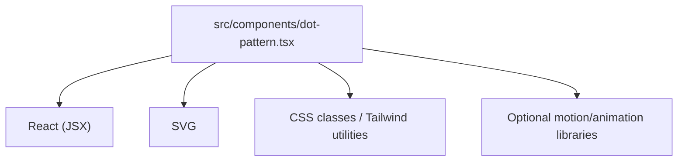
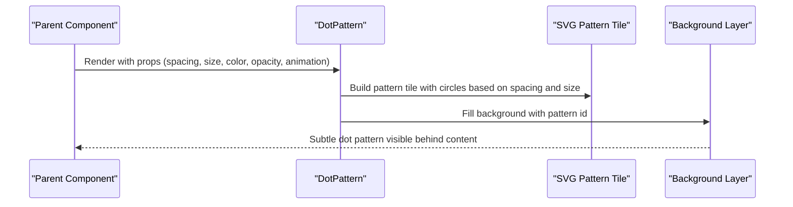
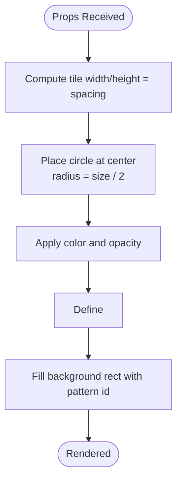
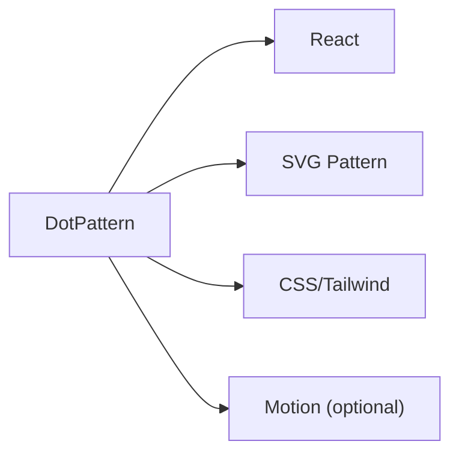

# Dot Pattern Background

<cite>
**Referenced Files in This Document**
- [dot-pattern.tsx](file://src/components/dot-pattern.tsx)
</cite>

## Table of Contents
1. [Introduction](#introduction)
2. [Project Structure](#project-structure)
3. [Core Components](#core-components)
4. [Architecture Overview](#architecture-overview)
5. [Detailed Component Analysis](#detailed-component-analysis)
6. [Dependency Analysis](#dependency-analysis)
7. [Performance Considerations](#performance-considerations)
8. [Troubleshooting Guide](#troubleshooting-guide)
9. [Conclusion](#conclusion)
10. [Appendices](#appendices)

## Introduction
This document explains the Dot Pattern background component, focusing on how it generates SVG-based dot patterns and how to control density, spacing, size, opacity, color, and animation. It also provides practical examples for creating subtle backgrounds, animated patterns, and responsive designs, along with performance guidance for large screens and memory optimization.

## Project Structure
The Dot Pattern background is implemented as a single React component located under the shared UI components directory. It can be imported and used anywhere in the application where a patterned background is desired.

[No sources needed since this diagram shows conceptual structure]

## Core Components
- Dot Pattern Background: Renders an SVG pattern tile that repeats across the viewport or container. The pattern consists of circles arranged in a grid defined by spacing and size parameters. Colors are configurable via props, and opacity controls the visual intensity. Animation effects can be applied through CSS or motion libraries.

Key responsibilities:
- Generate a small, reusable SVG pattern tile
- Apply the pattern as a background fill for a full-screen or container-sized element
- Expose props for spacing, dot size, color, opacity, and animation behavior
- Ensure efficient rendering by leveraging native SVG pattern repetition

**Section sources**
- [dot-pattern.tsx](file://src/components/dot-pattern.tsx)

## Architecture Overview
At a high level, the component composes an SVG pattern definition and applies it to a background layer. The pattern tile contains one or more circle elements whose positions and radii are derived from spacing and size props. The background layer fills its parent container using the pattern’s id.

[No sources needed since this diagram shows conceptual workflow]

## Detailed Component Analysis

### Props API
The following props are available to customize the dot pattern. Use these to control density, appearance, and motion.

- spacing
  - Description: Horizontal and vertical distance between dots. Smaller values increase density; larger values reduce it.
  - Typical range: 8–64 px depending on design needs.
- size
  - Description: Radius or diameter of each dot. Larger values make dots more prominent.
  - Typical range: 1–6 px for subtle textures.
- color
  - Description: Fill color of the dots. Accepts standard CSS color tokens.
- opacity
  - Description: Opacity of the dots. Lower values create subtler backgrounds.
  - Typical range: 0.05–0.3 for delicate textures.
- animation
  - Description: Controls animation behavior. Options may include none, pulse, drift, or custom class names.
- className
  - Description: Additional CSS classes to apply to the root wrapper for layout and styling.
- style
  - Description: Inline styles for fine-grained control (e.g., width, height).

Usage tips:
- For subtle backgrounds, use small size, moderate spacing, and low opacity.
- For animated patterns, prefer lightweight animations like slow drift or gentle pulsing.

**Section sources**
- [dot-pattern.tsx](file://src/components/dot-pattern.tsx)

### SVG-Based Pattern Generation
The component constructs an SVG pattern tile sized to the spacing value and places a circle at the center of the tile. The browser repeats this tile automatically to cover the entire background area.

- Pattern tile dimensions equal the spacing value.
- Circle radius equals half the size prop.
- Color and opacity are applied to the circle.
- The pattern is referenced by the background layer.

**Section sources**
- [dot-pattern.tsx](file://src/components/dot-pattern.tsx)

### Animation Effects
Animation can be achieved through:
- CSS keyframes applied via className
- Motion library integration if present in the project
- Transform-based animations (translate, scale) for better performance

Recommendations:
- Prefer transform and opacity changes for smooth, GPU-accelerated animations.
- Keep animation durations long (e.g., 8–20 seconds) for subtle movement.
- Avoid heavy filters or complex paths inside the pattern tile.

**Section sources**
- [dot-pattern.tsx](file://src/components/dot-pattern.tsx)

### Examples

#### Subtle Background
- Use small size (e.g., 1–2 px), moderate spacing (e.g., 24–32 px), and low opacity (e.g., 0.08–0.15).
- Choose a neutral or theme-matching color.
- No animation or very slow drift.

#### Animated Pattern
- Add a slow translate or rotate effect to the pattern tile or background layer.
- Keep animation duration long and easing linear for seamless looping.
- Maintain low opacity to avoid distracting the user.

#### Responsive Design
- Adjust spacing and size based on screen width using media queries or responsive hooks.
- On smaller screens, increase spacing slightly and reduce size to keep the texture light.
- Ensure the background covers the full viewport or container without overflow.

[No sources needed since this section provides general usage guidance]

## Dependency Analysis
The component primarily depends on:
- React for rendering
- SVG for pattern generation
- CSS/Tailwind for styling and optional animation classes
- Optional motion libraries if integrated for advanced animations

[No sources needed since this diagram shows conceptual dependencies]

**Section sources**
- [dot-pattern.tsx](file://src/components/dot-pattern.tsx)

## Performance Considerations
- Pattern tile size: Keep the tile minimal. One circle per tile is optimal.
- Density vs. performance: Higher density (smaller spacing) increases the number of repeated tiles. Balance visual goals with device capabilities.
- Animation cost: Prefer transform and opacity animations; avoid expensive filters or blur within the pattern.
- Large screens: On very large viewports, consider reducing dot size and increasing spacing to maintain subtlety and performance.
- Memory usage: Reuse a single pattern instance per page when possible. Avoid dynamically recreating patterns on every render.
- Rendering optimization:
  - Use memoization for static configurations.
  - Debounce or throttle prop changes that affect pattern geometry.
  - Avoid unnecessary re-renders by stabilizing props and using stable references.

[No sources needed since this section provides general guidance]

## Troubleshooting Guide
Common issues and resolutions:
- Dots not visible
  - Check color contrast against the background.
  - Increase opacity or adjust color brightness.
- Pattern looks too dense or too sparse
  - Tune spacing and size props together.
  - Test on multiple screen sizes.
- Animation feels choppy
  - Switch to transform-based animations.
  - Reduce complexity and ensure hardware acceleration.
- High CPU/GPU usage on large screens
  - Reduce density (increase spacing) and dot size.
  - Limit animation scope to essential properties.

**Section sources**
- [dot-pattern.tsx](file://src/components/dot-pattern.tsx)

## Conclusion
The Dot Pattern background component offers a flexible, performant way to add textured backgrounds using SVG patterns. By adjusting spacing, size, color, opacity, and animation, you can achieve subtle, engaging visuals that remain efficient across devices. Follow the performance guidelines and troubleshooting tips to ensure a smooth user experience.

[No sources needed since this section summarizes without analyzing specific files]

## Appendices

### Quick Reference: Props Summary
- spacing: Grid spacing between dots
- size: Dot radius or diameter
- color: Dot fill color
- opacity: Dot transparency
- animation: Animation mode or class name
- className: Additional CSS classes
- style: Inline styles for layout

[No sources needed since this section provides general reference]