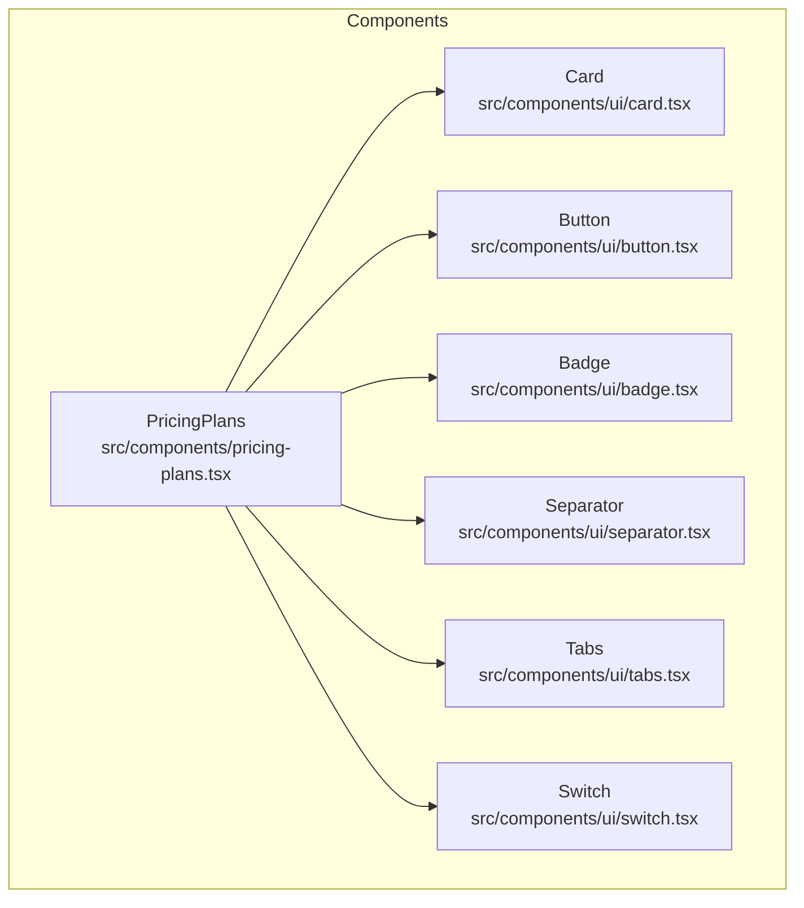
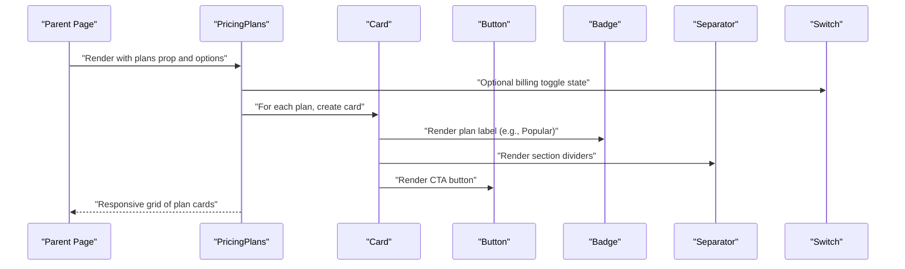
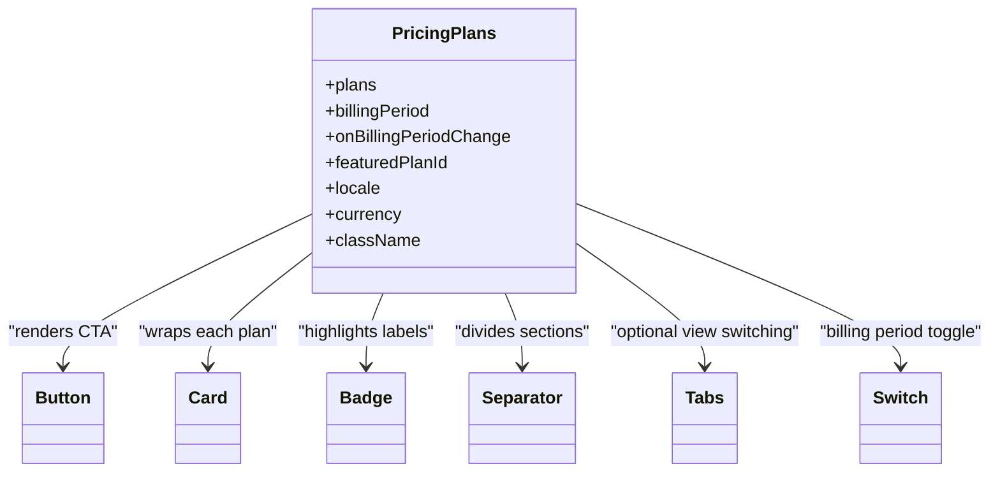

# Pricing Plans Display

<cite>
**Referenced Files in This Document**
- [pricing-plans.tsx](file://src/components/pricing-plans.tsx)
- [button.tsx](file://src/components/ui/button.tsx)
- [card.tsx](file://src/components/ui/card.tsx)
- [badge.tsx](file://src/components/ui/badge.tsx)
- [separator.tsx](file://src/components/ui/separator.tsx)
- [tabs.tsx](file://src/components/ui/tabs.tsx)
- [switch.tsx](file://src/components/ui/switch.tsx)
</cite>

## Table of Contents
1. [Introduction](#introduction)
2. [Project Structure](#project-structure)
3. [Core Components](#core-components)
4. [Architecture Overview](#architecture-overview)
5. [Detailed Component Analysis](#detailed-component-analysis)
6. [Dependency Analysis](#dependency-analysis)
7. [Performance Considerations](#performance-considerations)
8. [Troubleshooting Guide](#troubleshooting-guide)
9. [Conclusion](#conclusion)
10. [Appendices](#appendices)

## Introduction
This document provides comprehensive documentation for the Pricing Plans component, focusing on plan comparison layouts, feature highlighting, and pricing display formats. It explains props for plan data structure, styling options, responsive behavior, and includes examples for subscription tiers, feature lists, and call-to-action buttons. Accessibility compliance, SEO considerations, and conversion optimization techniques are also covered to help you implement a high-quality pricing experience.

## Project Structure
The Pricing Plans component is implemented as a single React component file located under the shared components directory. It composes several UI primitives from the project’s UI library to render cards, badges, separators, tabs, switches, and buttons.

**Diagram sources**
- [pricing-plans.tsx](file://src/components/pricing-plans.tsx)
- [button.tsx](file://src/components/ui/button.tsx)
- [card.tsx](file://src/components/ui/card.tsx)
- [badge.tsx](file://src/components/ui/badge.tsx)
- [separator.tsx](file://src/components/ui/separator.tsx)
- [tabs.tsx](file://src/components/ui/tabs.tsx)
- [switch.tsx](file://src/components/ui/switch.tsx)

**Section sources**
- [pricing-plans.tsx](file://src/components/pricing-plans.tsx)
- [button.tsx](file://src/components/ui/button.tsx)
- [card.tsx](file://src/components/ui/card.tsx)
- [badge.tsx](file://src/components/ui/badge.tsx)
- [separator.tsx](file://src/components/ui/separator.tsx)
- [tabs.tsx](file://src/components/ui/tabs.tsx)
- [switch.tsx](file://src/components/ui/switch.tsx)

## Core Components
- PricingPlans: The main component that renders a set of pricing plans with optional billing period toggling (monthly/yearly), plan cards, feature lists, and call-to-action buttons.
- Button: Used for primary actions such as “Get Started” or “Subscribe.”
- Card: Provides the container for each plan card with consistent spacing and elevation.
- Badge: Highlights special labels like “Popular,” “New,” or “Limited.”
- Separator: Divides sections within a plan card (e.g., between features and pricing).
- Tabs: Optional control to switch between different categories or views if used by the parent page.
- Switch: Toggles billing period (monthly vs yearly) when applicable.

Key responsibilities:
- Accepts structured plan data via props.
- Renders a responsive grid of plan cards.
- Displays pricing with currency formatting and optional billing frequency.
- Highlights key features and differences across plans.
- Provides accessible CTA buttons and keyboard navigation.

**Section sources**
- [pricing-plans.tsx](file://src/components/pricing-plans.tsx)
- [button.tsx](file://src/components/ui/button.tsx)
- [card.tsx](file://src/components/ui/card.tsx)
- [badge.tsx](file://src/components/ui/badge.tsx)
- [separator.tsx](file://src/components/ui/separator.tsx)
- [tabs.tsx](file://src/components/ui/tabs.tsx)
- [switch.tsx](file://src/components/ui/switch.tsx)

## Architecture Overview
At a high level, PricingPlans consumes typed plan data and renders a layout composed of cards and supporting UI elements. It may integrate with a billing toggle (monthly/yearly) and supports optional tabs for categorizing plans.

**Diagram sources**
- [pricing-plans.tsx](file://src/components/pricing-plans.tsx)
- [button.tsx](file://src/components/ui/button.tsx)
- [card.tsx](file://src/components/ui/card.tsx)
- [badge.tsx](file://src/components/ui/badge.tsx)
- [separator.tsx](file://src/components/ui/separator.tsx)
- [switch.tsx](file://src/components/ui/switch.tsx)

## Detailed Component Analysis

### Props and Data Model
Typical props include:
- plans: Array of plan objects representing subscription tiers.
- billingPeriod: Current billing cycle (monthly/yearly).
- onBillingPeriodChange: Handler to update billing period.
- featuredPlanId: Identifier for the highlighted plan.
- locale/currency: Formatting options for price display.
- className/style: Styling overrides for layout and theme integration.

Plan object shape (representative):
- id: Unique identifier for the plan.
- name: Human-readable plan title.
- description: Short description of the plan.
- monthlyPrice/yearlyPrice: Numeric values for pricing.
- currency: Currency code (e.g., USD).
- features: List of feature strings or objects with label and availability flags.
- badge: Optional text for highlights (e.g., “Popular”).
- ctaLabel: Call-to-action button text.
- href/action: Navigation or action handler for the CTA.

Styling options:
- Layout variants: grid density, gap sizes, max widths.
- Theme tokens: colors, typography, spacing via CSS variables or Tailwind classes.
- Responsive breakpoints: mobile-first stacking, tablet two-column, desktop three-column.

Accessibility attributes:
- aria-label for CTAs and controls.
- role="list"/role="listitem" for plan lists.
- Keyboard focus management for tabs and switches.
- Sufficient color contrast for badges and text.

SEO considerations:
- Semantic headings (H2/H3) for plan titles.
- Structured data (JSON-LD) for offers where appropriate.
- Descriptive alt text for any images/icons.
- Avoid hidden content that hides critical pricing info.

Conversion optimization:
- Prominent CTA placement and consistent labeling.
- Highlight popular plan visually without misleading users.
- Clear feature comparisons and checkmarks for included features.
- Use microcopy that reduces friction (“Start free trial,” “No credit card required”).

Examples:
- Subscription tiers: Render multiple plans with distinct names and prices.
- Feature lists: Show included/excluded features with icons or checkmarks.
- CTA buttons: Primary action per plan with clear intent.

**Section sources**
- [pricing-plans.tsx](file://src/components/pricing-plans.tsx)
- [button.tsx](file://src/components/ui/button.tsx)
- [card.tsx](file://src/components/ui/card.tsx)
- [badge.tsx](file://src/components/ui/badge.tsx)
- [separator.tsx](file://src/components/ui/separator.tsx)
- [switch.tsx](file://src/components/ui/switch.tsx)

### Plan Comparison Layouts
- Grid-based layout: Cards align in rows with equal height for easy scanning.
- Sticky header: Optional sticky plan headers for long feature lists.
- Visual hierarchy: Larger fonts for plan names and prices; subdued descriptions.
- Emphasis: Featured plan uses elevated card style and accent color.

Responsive behavior:
- Mobile: Single column stack.
- Tablet: Two columns.
- Desktop: Three or more columns depending on screen width.

**Section sources**
- [pricing-plans.tsx](file://src/components/pricing-plans.tsx)
- [card.tsx](file://src/components/ui/card.tsx)

### Feature Highlighting
- Feature items: Each feature rendered as a list item with an icon indicating inclusion/exclusion.
- Grouping: Features grouped by category (e.g., “Storage,” “Users,” “Support”) using separators and headings.
- Badges: Special tags for new or limited-time features.

Accessibility:
- Use aria-hidden for decorative icons.
- Ensure feature text is readable and not purely conveyed by color.

**Section sources**
- [pricing-plans.tsx](file://src/components/pricing-plans.tsx)
- [badge.tsx](file://src/components/ui/badge.tsx)
- [separator.tsx](file://src/components/ui/separator.tsx)

### Pricing Display Formats
- Price rendering: Currency symbol, amount, and billing period (per month/per year).
- Discounts: Show original vs discounted price when applicable.
- Trial periods: Indicate free trial length clearly near the price.

Internationalization:
- Locale-aware number formatting.
- Localized currency symbols and decimal separators.

**Section sources**
- [pricing-plans.tsx](file://src/components/pricing-plans.tsx)

### Billing Period Toggle
- Switch control: Monthly vs Yearly toggle updates displayed prices.
- Savings indicator: Optional text showing savings percentage for yearly billing.
- State management: Controlled by parent or internal state with proper accessibility attributes.

**Section sources**
- [pricing-plans.tsx](file://src/components/pricing-plans.tsx)
- [switch.tsx](file://src/components/ui/switch.tsx)

### Call-to-Action Buttons
- Primary action per plan: Consistent button styling and clear labels.
- Focus states: Visible focus rings for keyboard navigation.
- Disabled states: Handle unavailable plans gracefully.

**Section sources**
- [pricing-plans.tsx](file://src/components/pricing-plans.tsx)
- [button.tsx](file://src/components/ui/button.tsx)

### Tabs Integration (Optional)
- Category tabs: If plans are categorized (e.g., “Teams,” “Enterprise”), use tabs to switch views.
- Keyboard support: Arrow keys navigate tabs; Enter/Space activates selection.
- ARIA roles: Proper tab/tabpanel roles and aria-selected states.

**Section sources**
- [pricing-plans.tsx](file://src/components/pricing-plans.tsx)
- [tabs.tsx](file://src/components/ui/tabs.tsx)

## Dependency Analysis
The PricingPlans component depends on several UI primitives. Understanding these relationships helps with customization and maintenance.

**Diagram sources**
- [pricing-plans.tsx](file://src/components/pricing-plans.tsx)
- [button.tsx](file://src/components/ui/button.tsx)
- [card.tsx](file://src/components/ui/card.tsx)
- [badge.tsx](file://src/components/ui/badge.tsx)
- [separator.tsx](file://src/components/ui/separator.tsx)
- [tabs.tsx](file://src/components/ui/tabs.tsx)
- [switch.tsx](file://src/components/ui/switch.tsx)

**Section sources**
- [pricing-plans.tsx](file://src/components/pricing-plans.tsx)
- [button.tsx](file://src/components/ui/button.tsx)
- [card.tsx](file://src/components/ui/card.tsx)
- [badge.tsx](file://src/components/ui/badge.tsx)
- [separator.tsx](file://src/components/ui/separator.tsx)
- [tabs.tsx](file://src/components/ui/tabs.tsx)
- [switch.tsx](file://src/components/ui/switch.tsx)

## Performance Considerations
- Memoization: Memoize expensive computations like price formatting and feature filtering.
- Virtualization: For very large feature lists, consider virtual scrolling.
- Lazy loading: Defer non-critical assets (icons/images) until needed.
- CSS efficiency: Prefer utility classes and avoid heavy inline styles.
- Bundle size: Keep dependencies minimal; tree-shake unused UI components.

[No sources needed since this section provides general guidance]

## Troubleshooting Guide
Common issues and resolutions:
- Incorrect price formatting: Verify locale and currency props; ensure numeric values are numbers, not strings.
- Missing CTA actions: Confirm href or onClick handlers are provided for each plan.
- Poor contrast: Check badge and text colors against background; adjust theme tokens if necessary.
- Keyboard navigation problems: Ensure tabs and switch have correct ARIA roles and focus management.
- Responsive misalignment: Inspect grid breakpoints and container widths; adjust className or CSS variables.

**Section sources**
- [pricing-plans.tsx](file://src/components/pricing-plans.tsx)
- [button.tsx](file://src/components/ui/button.tsx)
- [card.tsx](file://src/components/ui/card.tsx)
- [badge.tsx](file://src/components/ui/badge.tsx)
- [tabs.tsx](file://src/components/ui/tabs.tsx)
- [switch.tsx](file://src/components/ui/switch.tsx)

## Conclusion
The Pricing Plans component provides a flexible, accessible, and conversion-focused way to present subscription tiers. By leveraging structured props, semantic markup, and responsive design, it delivers a clear comparison experience. Follow the accessibility, SEO, and performance recommendations to maximize usability and search visibility while optimizing conversions.

[No sources needed since this section summarizes without analyzing specific files]

## Appendices

### Example Usage Patterns
- Displaying subscription tiers: Pass an array of plan objects with unique IDs, names, and prices.
- Feature lists: Include feature arrays with labels and availability indicators.
- CTA buttons: Provide clear labels and navigation or action handlers.

[No sources needed since this section doesn't analyze specific files]