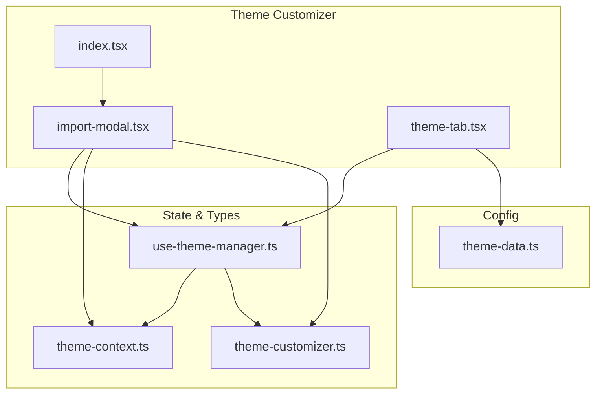
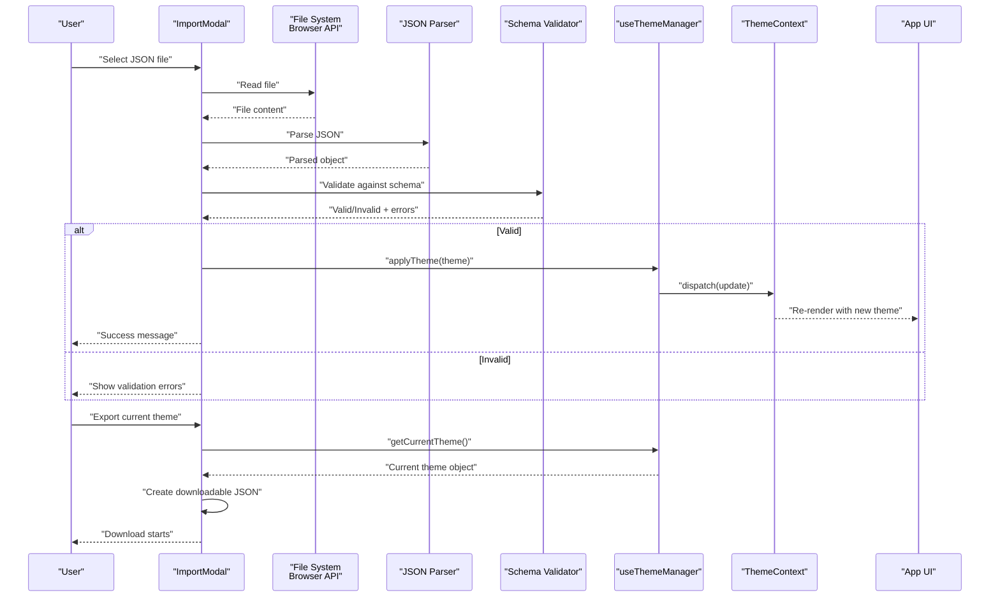
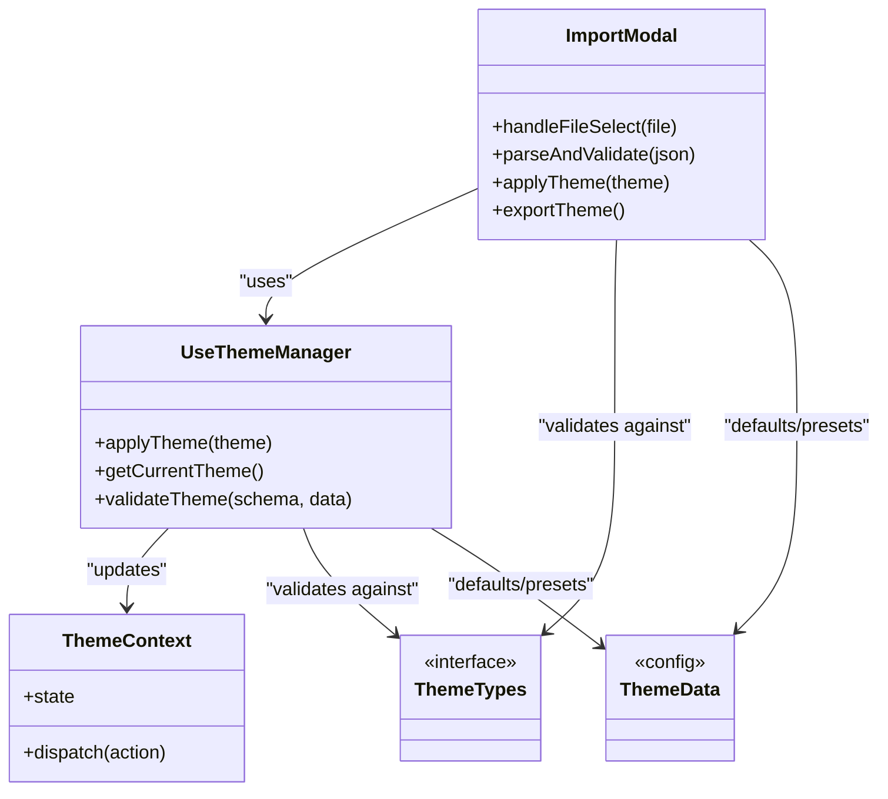
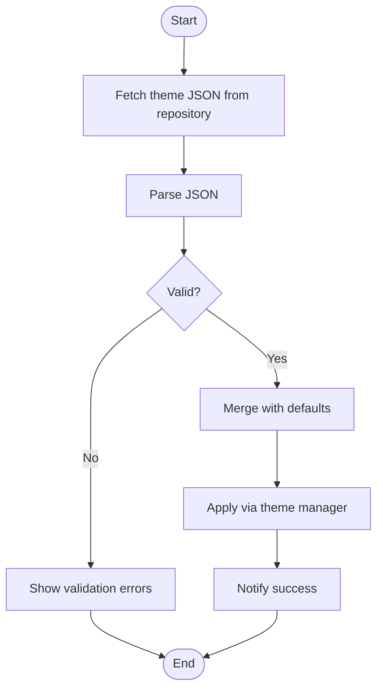

# Import/Export Modal

<cite>
**Referenced Files in This Document**
- [import-modal.tsx](file://src/components/theme-customizer/import-modal.tsx)
- [index.tsx](file://src/components/theme-customizer/index.tsx)
- [theme-tab.tsx](file://src/components/theme-customizer/theme-tab.tsx)
- [use-theme-manager.ts](file://src/hooks/use-theme-manager.ts)
- [theme-context.ts](file://src/contexts/theme-context.ts)
- [theme-customizer.ts](file://src/types/theme-customizer.ts)
- [theme-data.ts](file://src/config/theme-data.ts)
</cite>

## Table of Contents
1. [Introduction](#introduction)
2. [Project Structure](#project-structure)
3. [Core Components](#core-components)
4. [Architecture Overview](#architecture-overview)
5. [Detailed Component Analysis](#detailed-component-analysis)
6. [Dependency Analysis](#dependency-analysis)
7. [Performance Considerations](#performance-considerations)
8. [Troubleshooting Guide](#troubleshooting-guide)
9. [Conclusion](#conclusion)
10. [Appendices](#appendices)

## Introduction
This document explains the Import/Export modal component that enables theme sharing and backup functionality. It covers how users can import custom themes from JSON files, export their current theme configuration, and share themes with team members. It also documents the supported theme format, validation rules, error handling, and security considerations for file uploads. Finally, it provides examples of creating shareable theme packages and integrating with external theme repositories.

## Project Structure
The Import/Export modal is part of the Theme Customizer feature. The key files involved are:
- The modal implementation and UI logic
- The theme manager hook that persists and applies theme changes
- Context providers and types that define the theme shape and operations
- Configuration constants and presets used during import/export

**Diagram sources**
- [import-modal.tsx](file://src/components/theme-customizer/import-modal.tsx)
- [index.tsx](file://src/components/theme-customizer/index.tsx)
- [theme-tab.tsx](file://src/components/theme-customizer/theme-tab.tsx)
- [use-theme-manager.ts](file://src/hooks/use-theme-manager.ts)
- [theme-context.ts](file://src/contexts/theme-context.ts)
- [theme-customizer.ts](file://src/types/theme-customizer.ts)
- [theme-data.ts](file://src/config/theme-data.ts)

**Section sources**
- [import-modal.tsx](file://src/components/theme-customizer/import-modal.tsx)
- [index.tsx](file://src/components/theme-customizer/index.tsx)
- [theme-tab.tsx](file://src/components/theme-customizer/theme-tab.tsx)
- [use-theme-manager.ts](file://src/hooks/use-theme-manager.ts)
- [theme-context.ts](file://src/contexts/theme-context.ts)
- [theme-customizer.ts](file://src/types/theme-customizer.ts)
- [theme-data.ts](file://src/config/theme-data.ts)

## Core Components
- Import/Export Modal: Provides a user interface to select a JSON file for import, preview and validate the theme structure, apply changes, and export the current theme as a downloadable JSON file.
- Theme Manager Hook: Encapsulates reading, validating, applying, and persisting theme configurations. It exposes functions to import and export themes and emits updates to the context.
- Theme Context: Holds the active theme state and dispatches actions to update the theme across the application.
- Types and Config: Define the schema for theme objects, default values, and preset mappings used during import/export.

Key responsibilities:
- File selection and parsing (client-side only)
- Schema validation against the theme type definition
- Applying validated themes via the theme manager
- Exporting the current theme as a JSON file
- Providing clear user feedback on success or errors

**Section sources**
- [import-modal.tsx](file://src/components/theme-customizer/import-modal.tsx)
- [use-theme-manager.ts](file://src/hooks/use-theme-manager.ts)
- [theme-context.ts](file://src/contexts/theme-context.ts)
- [theme-customizer.ts](file://src/types/theme-customizer.ts)
- [theme-data.ts](file://src/config/theme-data.ts)

## Architecture Overview
The Import/Export modal integrates with the theme system through a hook and context. The flow is client-side: users choose a JSON file, the modal parses and validates it, then delegates to the theme manager to apply the new configuration. For export, the modal requests the current theme from the manager and triggers a download.

**Diagram sources**
- [import-modal.tsx](file://src/components/theme-customizer/import-modal.tsx)
- [use-theme-manager.ts](file://src/hooks/use-theme-manager.ts)
- [theme-context.ts](file://src/contexts/theme-context.ts)

## Detailed Component Analysis

### Import/Export Modal
Responsibilities:
- Render a dialog with an upload area and an export button
- Handle file selection, parse JSON, and display validation results
- Call the theme manager to apply imported themes
- Trigger export by requesting the current theme and downloading it as JSON

User interactions:
- Choose a JSON file from disk
- Review validation messages before applying
- Confirm import if prompted
- Export current theme to a file

Error handling:
- Display friendly messages for invalid JSON, missing fields, or unexpected types
- Prevent applying invalid themes
- Provide actionable guidance (e.g., “Ensure required keys exist”)

Security considerations:
- All processing occurs in the browser; no server upload is performed
- Validate and sanitize inputs strictly according to the schema
- Avoid executing arbitrary code from imported files

Integration points:
- Uses the theme manager hook to apply and retrieve themes
- Consumes the theme context for reactive updates
- Leverages utility functions for file downloads and formatting

**Section sources**
- [import-modal.tsx](file://src/components/theme-customizer/import-modal.tsx)

### Theme Manager Hook
Responsibilities:
- Maintain the active theme state and persistence
- Expose functions to import and export themes
- Validate incoming theme data against the defined schema
- Dispatch updates to the theme context

Data flow:
- On import: receives a validated theme object, merges/applies it, persists changes, and notifies subscribers
- On export: returns the current theme snapshot for serialization

Validation strategy:
- Enforce required keys and value types
- Normalize optional fields to defaults when absent
- Return structured errors for UI presentation

**Section sources**
- [use-theme-manager.ts](file://src/hooks/use-theme-manager.ts)

### Theme Context
Responsibilities:
- Hold the global theme state
- Provide methods to update the theme
- Notify consumers of changes for re-renders

Relationships:
- Consumed by the theme manager hook
- Used by UI components to reflect theme changes

**Section sources**
- [theme-context.ts](file://src/contexts/theme-context.ts)

### Types and Configuration
Types:
- Define the shape of a theme object, including colors, typography, layout options, and any metadata needed for sharing

Configuration:
- Provide default theme values and preset mappings
- Support merging partial themes with defaults during import

Usage:
- Validation relies on these types to ensure correctness
- Export serializes the current state conforming to these types

**Section sources**
- [theme-customizer.ts](file://src/types/theme-customizer.ts)
- [theme-data.ts](file://src/config/theme-data.ts)

### Integration Points
- The modal is embedded within the theme customizer entry point and can be triggered from the theme tab UI.
- The theme tab may provide quick access to import/export actions and show status feedback.

**Section sources**
- [index.tsx](file://src/components/theme-customizer/index.tsx)
- [theme-tab.tsx](file://src/components/theme-customizer/theme-tab.tsx)

## Dependency Analysis
The following diagram shows how the Import/Export modal depends on the theme management layer and related types.

**Diagram sources**
- [import-modal.tsx](file://src/components/theme-customizer/import-modal.tsx)
- [use-theme-manager.ts](file://src/hooks/use-theme-manager.ts)
- [theme-context.ts](file://src/contexts/theme-context.ts)
- [theme-customizer.ts](file://src/types/theme-customizer.ts)
- [theme-data.ts](file://src/config/theme-data.ts)

**Section sources**
- [import-modal.tsx](file://src/components/theme-customizer/import-modal.tsx)
- [use-theme-manager.ts](file://src/hooks/use-theme-manager.ts)
- [theme-context.ts](file://src/contexts/theme-context.ts)
- [theme-customizer.ts](file://src/types/theme-customizer.ts)
- [theme-data.ts](file://src/config/theme-data.ts)

## Performance Considerations
- Keep imports small: prefer minimal theme payloads to reduce parsing and validation overhead.
- Debounce repeated imports if users attempt multiple rapid selections.
- Avoid unnecessary re-renders by batching updates in the theme manager.
- Use efficient JSON serialization for exports; avoid deep cloning unless necessary.

[No sources needed since this section provides general guidance]

## Troubleshooting Guide
Common issues and resolutions:
- Invalid JSON: Ensure the file is well-formed JSON without trailing commas or comments.
- Missing required fields: Check the schema-defined required keys and add them with valid values.
- Unexpected types: Verify that color values, numbers, booleans, and arrays match expected formats.
- Partial themes not applied: Confirm that partial themes are merged correctly with defaults.
- Export fails: Ensure the current theme is available and serializable.

Operational tips:
- Inspect validation error messages returned by the validator.
- Log the parsed object before validation to confirm structure.
- Test with known-good sample themes to isolate environment-specific issues.

**Section sources**
- [import-modal.tsx](file://src/components/theme-customizer/import-modal.tsx)
- [use-theme-manager.ts](file://src/hooks/use-theme-manager.ts)

## Conclusion
The Import/Export modal provides a safe, client-side mechanism for importing and exporting theme configurations. By enforcing strict validation and leveraging the theme manager and context, it ensures consistent application behavior while enabling easy sharing and backup of themes. Following the recommended practices and troubleshooting steps will help maintain reliability and security.

[No sources needed since this section summarizes without analyzing specific files]

## Appendices

### Supported Theme Format
A shareable theme package should be a JSON object conforming to the theme type definition. Typical elements include:
- Colors: primary, secondary, background, foreground, accents
- Typography: font families, sizes, weights
- Layout: spacing, radii, shadows
- Metadata: name, version, author, description

Guidelines:
- Include all required keys; omit optional keys if you want defaults to apply
- Use standard color formats and numeric units where applicable
- Keep the payload concise for faster imports

[No sources needed since this section describes conceptual format]

### Validation Rules
- Required keys must be present
- Value types must match the schema (string, number, boolean, array, object)
- Enumerated values must be within allowed sets
- Nested structures must follow the defined hierarchy

If validation fails, the modal displays descriptive errors and prevents applying the theme.

**Section sources**
- [theme-customizer.ts](file://src/types/theme-customizer.ts)
- [use-theme-manager.ts](file://src/hooks/use-theme-manager.ts)

### Error Handling
- Parse errors: indicate malformed JSON
- Schema errors: list missing or invalid fields
- Apply errors: report failures when updating the theme context
- Export errors: notify when serialization or download initiation fails

Provide actionable guidance and allow users to retry after corrections.

**Section sources**
- [import-modal.tsx](file://src/components/theme-customizer/import-modal.tsx)

### Security Considerations
- Client-only processing: do not upload theme files to servers
- Strict validation: reject anything that does not match the schema
- No code execution: treat imported files as pure data
- Sanitize strings: strip dangerous characters if rendering untrusted content
- Limit file size: enforce maximum payload size to prevent abuse

[No sources needed since this section provides general guidance]

### Creating Shareable Theme Packages
Steps:
- Prepare a JSON file matching the theme schema
- Include metadata such as name, version, and description
- Test import locally to verify compatibility
- Distribute via email, shared drives, or a repository

Example workflow:
- Author a theme using the theme editor
- Export the current theme to a JSON file
- Add metadata and commit to a version-controlled repository
- Share the link or artifact with teammates

[No sources needed since this section provides general guidance]

### Integrating with External Theme Repositories
Conceptual integration patterns:
- Fetch theme JSON from a remote endpoint
- Validate and merge with defaults before applying
- Cache popular themes locally for performance
- Provide a curated list of approved themes for team use

[No sources needed since this diagram shows conceptual workflow, not actual code structure]