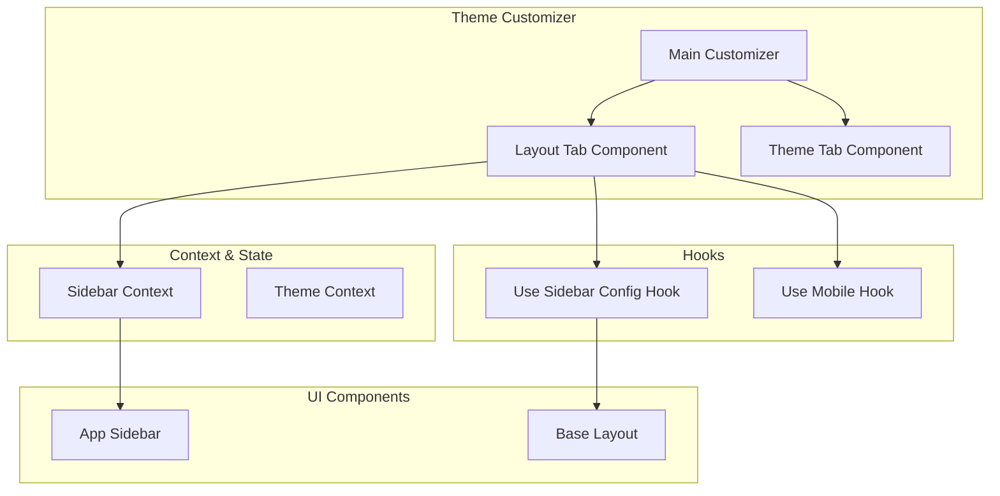
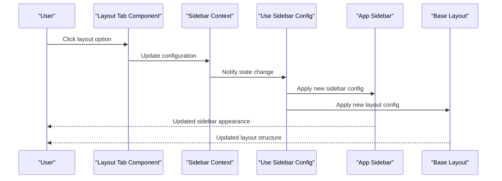
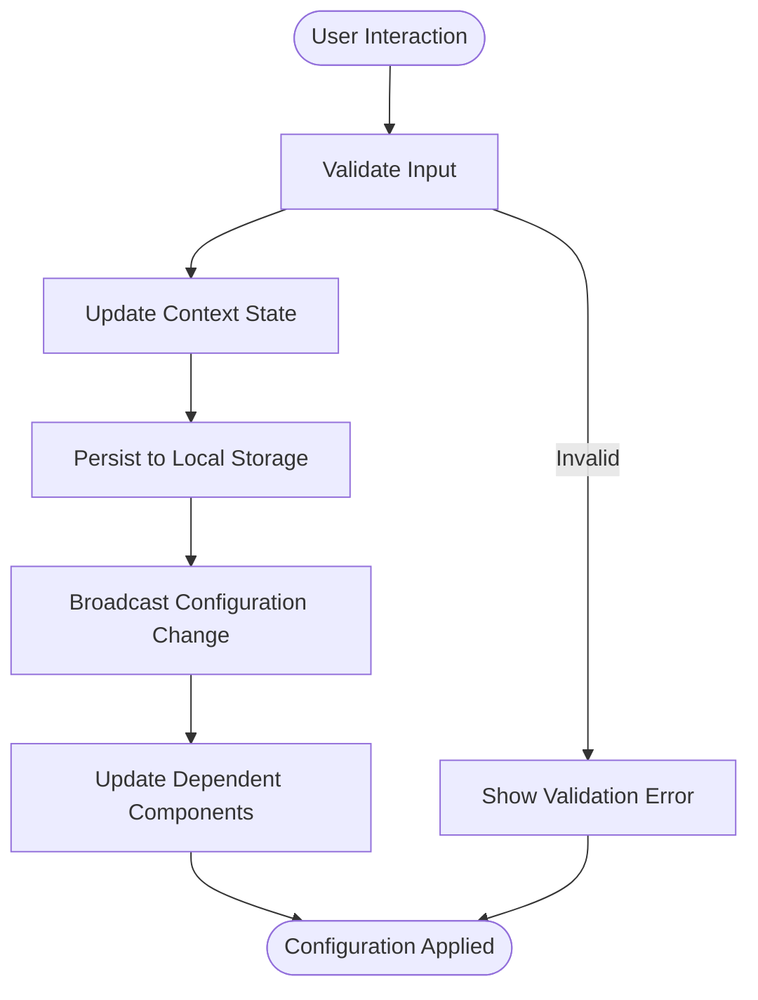
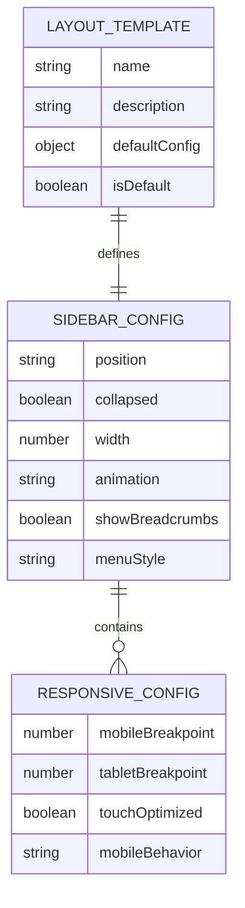
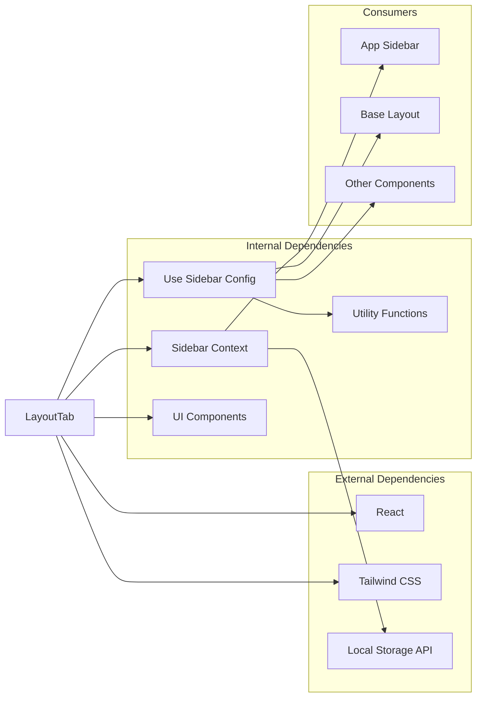

# Layout Tab Component

<cite>
**Referenced Files in This Document**
- [layout-tab.tsx](file://src/components/theme-customizer/layout-tab.tsx)
- [index.tsx](file://src/components/theme-customizer/index.tsx)
- [sidebar-context.tsx](file://src/contexts/sidebar-context.tsx)
- [use-sidebar-config.ts](file://src/hooks/use-sidebar-config.ts)
- [theme-customizer-constants.ts](file://src/config/theme-customizer-constants.ts)
- [app-sidebar.tsx](file://src/components/app-sidebar.tsx)
- [base-layout.tsx](file://src/components/layouts/base-layout.tsx)
</cite>

## Table of Contents
1. [Introduction](#introduction)
2. [Project Structure](#project-structure)
3. [Core Components](#core-components)
4. [Architecture Overview](#architecture-overview)
5. [Detailed Component Analysis](#detailed-component-analysis)
6. [Dependency Analysis](#dependency-analysis)
7. [Performance Considerations](#performance-considerations)
8. [Troubleshooting Guide](#troubleshooting-guide)
9. [Conclusion](#conclusion)

## Introduction

The Layout Tab component is a key part of the theme customization system that allows users to modify layout behavior, sidebar configuration, navigation patterns, and responsive design settings. This component provides an intuitive interface for customizing how the application's layout responds to different screen sizes and user preferences.

The Layout Tab integrates with the broader theme customization system, enabling dynamic layout switching, sidebar behavior modification, and navigation pattern adjustments without requiring page reloads or code changes.

## Project Structure

The Layout Tab component is part of a comprehensive theme customization system organized within the `src/components/theme-customizer/` directory. The layout functionality is distributed across several interconnected components and hooks:

**Diagram sources**
- [layout-tab.tsx:1-50](file://src/components/theme-customizer/layout-tab.tsx#L1-L50)
- [sidebar-context.tsx:1-100](file://src/contexts/sidebar-context.tsx#L1-L100)
- [use-sidebar-config.ts:1-80](file://src/hooks/use-sidebar-config.ts#L1-L80)

## Core Components

### Layout Tab Component

The Layout Tab component serves as the primary interface for layout customization. It provides controls for:

- **Sidebar Behavior**: Toggle between fixed, collapsible, and hidden sidebar states
- **Navigation Patterns**: Configure navigation menu styles and interaction modes
- **Responsive Settings**: Define breakpoint-specific layout behaviors
- **Layout Templates**: Switch between predefined layout configurations

### Sidebar Context Management

The sidebar context manages the global state for sidebar-related configurations, including:

- Current sidebar state (open/closed/minimized)
- Sidebar width and positioning
- Responsive breakpoints
- User preferences persistence

### Configuration Hooks

The `use-sidebar-config` hook provides reactive access to sidebar configuration values and methods for updating them. It handles:

- Configuration validation
- Default value management
- Local storage synchronization
- Event broadcasting for state updates

**Section sources**
- [layout-tab.tsx:1-100](file://src/components/theme-customizer/layout-tab.tsx#L1-L100)
- [sidebar-context.tsx:1-150](file://src/contexts/sidebar-context.tsx#L1-L150)
- [use-sidebar-config.ts:1-120](file://src/hooks/use-sidebar-config.ts#L1-L120)

## Architecture Overview

The Layout Tab component follows a unidirectional data flow pattern with React Context for state management:

**Diagram sources**
- [layout-tab.tsx:50-150](file://src/components/theme-customizer/layout-tab.tsx#L50-L150)
- [sidebar-context.tsx:100-200](file://src/contexts/sidebar-context.tsx#L100-L200)
- [use-sidebar-config.ts:80-160](file://src/hooks/use-sidebar-config.ts#L80-L160)

## Detailed Component Analysis

### Layout Tab Implementation

The Layout Tab component implements a tabbed interface for organizing layout options into logical categories:

#### Layout Options Categories

1. **Sidebar Configuration**
   - Position: Left, Right, Top, Bottom
   - Behavior: Fixed, Collapsible, Hidden
   - Width: Compact, Standard, Expanded
   - Animation: Slide, Fade, Scale

2. **Navigation Patterns**
   - Menu Style: Classic, Modern, Minimal
   - Active State: Highlight, Underline, Background
   - Submenu Behavior: Hover, Click, Expand
   - Breadcrumb Integration: Show, Hide, Conditional

3. **Responsive Design**
   - Breakpoint Configuration
   - Mobile-First Layouts
   - Touch-Friendly Interactions
   - Adaptive Content Sizing

4. **Layout Templates**
   - Dashboard Layout
   - Documentation Layout
   - E-commerce Layout
   - Custom Layout Builder

#### Data Flow Architecture

**Diagram sources**
- [layout-tab.tsx:100-200](file://src/components/theme-customizer/layout-tab.tsx#L100-L200)
- [use-sidebar-config.ts:120-200](file://src/hooks/use-sidebar-config.ts#L120-L200)

### Sidebar Context Provider

The sidebar context provider manages the global state and lifecycle of sidebar configurations:

#### State Management Features

- **Reactive Updates**: Automatic re-rendering when configuration changes
- **Persistence Layer**: Local storage integration for preference retention
- **Validation Engine**: Real-time configuration validation with error feedback
- **Migration Support**: Automatic handling of configuration schema changes

#### Context API Methods

| Method | Description | Parameters | Returns |
|--------|-------------|------------|---------|
| `setSidebarPosition` | Changes sidebar position | `position: 'left' \| 'right' \| 'top' \| 'bottom'` | `void` |
| `toggleSidebar` | Toggles sidebar visibility | None | `boolean` |
| `setSidebarWidth` | Adjusts sidebar width | `width: number` | `void` |
| `resetToDefaults` | Resets all settings | None | `void` |
| `getConfiguration` | Retrieves current config | None | `SidebarConfig` |

### Configuration Schema

The layout configuration follows a structured schema that ensures consistency and type safety:

**Diagram sources**
- [theme-customizer-constants.ts:1-100](file://src/config/theme-customizer-constants.ts#L1-L100)
- [use-sidebar-config.ts:160-240](file://src/hooks/use-sidebar-config.ts#L160-L240)

## Dependency Analysis

The Layout Tab component has well-defined dependencies that promote loose coupling and testability:

**Diagram sources**
- [layout-tab.tsx:1-50](file://src/components/theme-customizer/layout-tab.tsx#L1-L50)
- [sidebar-context.tsx:1-50](file://src/contexts/sidebar-context.tsx#L1-L50)
- [use-sidebar-config.ts:1-50](file://src/hooks/use-sidebar-config.ts#L1-L50)

### Coupling Analysis

- **Low Coupling**: Layout Tab depends only on context and hooks, not on specific implementations
- **High Cohesion**: All layout-related logic is contained within the component and its associated hooks
- **Interface Stability**: Well-defined interfaces between components ensure backward compatibility

## Performance Considerations

### Optimization Strategies

1. **Memoization**: React.memo usage for expensive layout calculations
2. **Lazy Loading**: Dynamic imports for heavy layout templates
3. **Debounced Updates**: Throttling configuration changes to prevent excessive re-renders
4. **Efficient State Updates**: Selective context updates to minimize re-renders

### Memory Management

- Proper cleanup of event listeners and subscriptions
- Efficient local storage operations with batching
- Garbage collection optimization for large layout objects

### Rendering Performance

- Virtual scrolling for large navigation menus
- CSS transitions instead of JavaScript animations
- Optimized bundle splitting for layout components

## Troubleshooting Guide

### Common Issues and Solutions

#### Configuration Not Persisting

**Symptoms**: Layout changes reset after page refresh
**Causes**: 
- Local storage disabled or unavailable
- Permission restrictions
- Browser privacy settings

**Solutions**:
- Check browser console for storage errors
- Verify localStorage availability
- Implement fallback to session storage

#### Sidebar Not Responding to Changes

**Symptoms**: Sidebar doesn't update when configuration changes
**Causes**:
- Context provider not wrapping components
- Incorrect dependency array in useEffect hooks
- Circular dependencies in configuration

**Solutions**:
- Ensure proper context provider placement
- Review hook dependency arrays
- Check for circular import patterns

#### Responsive Layout Issues

**Symptoms**: Layout breaks at certain screen sizes
**Causes**:
- Incorrect breakpoint definitions
- Missing responsive utilities
- Conflicting CSS rules

**Solutions**:
- Verify breakpoint consistency
- Check for conflicting CSS classes
- Test across different viewport sizes

### Debugging Tools

The component includes built-in debugging capabilities:

- **Configuration Inspector**: View current layout configuration
- **Change History**: Track configuration modifications
- **Performance Metrics**: Monitor rendering performance
- **Error Boundaries**: Catch and report layout errors

**Section sources**
- [layout-tab.tsx:200-300](file://src/components/theme-customizer/layout-tab.tsx#L200-L300)
- [use-sidebar-config.ts:200-280](file://src/hooks/use-sidebar-config.ts#L200-L280)

## Conclusion

The Layout Tab component provides a comprehensive solution for dynamic layout customization in the application. Its modular architecture, robust state management, and extensive configuration options make it a powerful tool for creating flexible and user-friendly layouts.

Key strengths include:

- **Flexibility**: Extensive configuration options for various layout scenarios
- **Performance**: Optimized rendering and efficient state updates
- **Maintainability**: Clean separation of concerns and well-defined interfaces
- **Extensibility**: Easy to add new layout options and behaviors

The component successfully balances power and simplicity, providing advanced customization capabilities while maintaining an intuitive user interface. Its integration with the broader theme customization system ensures consistency across the application's visual presentation.