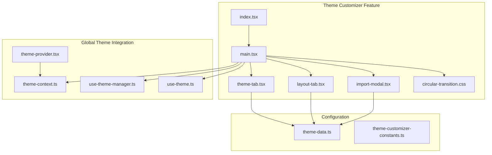
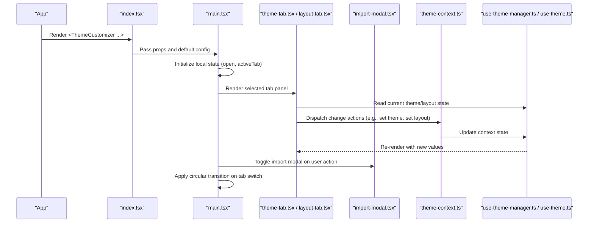
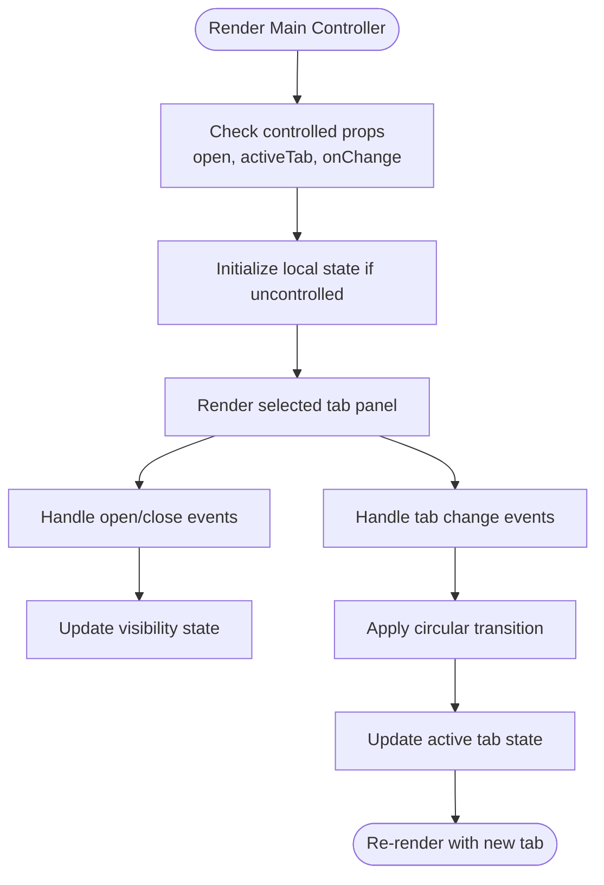
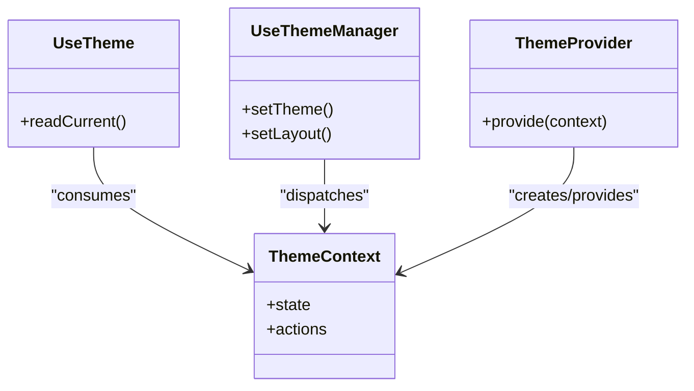
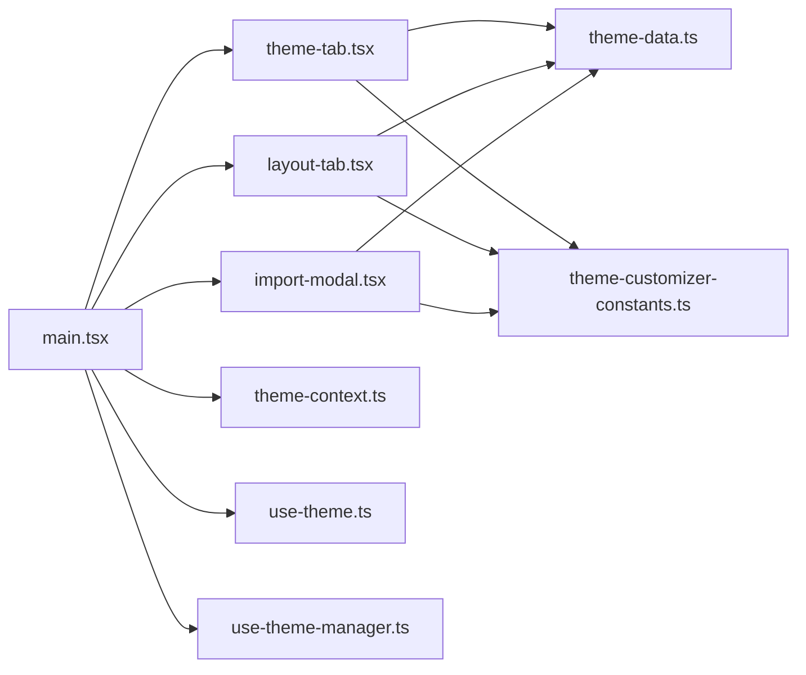

# Theme Customizer Main Controller

<cite>
**Referenced Files in This Document**
- [main.tsx](file://src/components/theme-customizer/main.tsx)
- [index.tsx](file://src/components/theme-customizer/index.tsx)
- [theme-tab.tsx](file://src/components/theme-customizer/theme-tab.tsx)
- [layout-tab.tsx](file://src/components/theme-customizer/layout-tab.tsx)
- [import-modal.tsx](file://src/components/theme-customizer/import-modal.tsx)
- [circular-transition.css](file://src/components/theme-customizer/circular-transition.css)
- [theme-context.ts](file://src/contexts/theme-context.ts)
- [use-theme-manager.ts](file://src/hooks/use-theme-manager.ts)
- [use-theme.ts](file://src/hooks/use-theme.ts)
- [theme-data.ts](file://src/config/theme-data.ts)
- [theme-customizer-constants.ts](file://src/config/theme-customizer-constants.ts)
- [theme-customizer.tsx](file://src/components/theme-customizer.tsx)
- [theme-provider.tsx](file://src/components/theme-provider.tsx)
</cite>

## Table of Contents
1. [Introduction](#introduction)
2. [Project Structure](#project-structure)
3. [Core Components](#core-components)
4. [Architecture Overview](#architecture-overview)
5. [Detailed Component Analysis](#detailed-component-analysis)
6. [Dependency Analysis](#dependency-analysis)
7. [Performance Considerations](#performance-considerations)
8. [Troubleshooting Guide](#troubleshooting-guide)
9. [Conclusion](#conclusion)

## Introduction
This document explains the Theme Customizer main controller component and how it orchestrates theme customization across tabs (Theme and Layout), manages state, handles user interactions, and integrates with the global theme context. It also covers programmatic control patterns, event handling mechanisms, and performance considerations for smooth theme switching.

## Project Structure
The Theme Customizer is implemented as a cohesive feature under src/components/theme-customizer with supporting hooks, contexts, and configuration:

- Feature entry and orchestration:
  - Main controller: src/components/theme-customizer/main.tsx
  - Public API wrapper: src/components/theme-customizer/index.tsx
  - Tab panels: src/components/theme-customizer/theme-tab.tsx, src/components/theme-customizer/layout-tab.tsx
  - Import modal: src/components/theme-customizer/import-modal.tsx
  - Transition styles: src/components/theme-customizer/circular-transition.css
- Global integration:
  - Context provider and consumer hooks: src/contexts/theme-context.ts, src/hooks/use-theme.ts, src/hooks/use-theme-manager.ts
  - App-level provider: src/components/theme-provider.tsx
- Configuration:
  - Presets and data: src/config/theme-data.ts, src/config/theme-customizer-constants.ts
- Optional app-level UI:
  - Standalone customizer trigger: src/components/theme-customizer.tsx

**Diagram sources**
- [main.tsx](file://src/components/theme-customizer/main.tsx)
- [index.tsx](file://src/components/theme-customizer/index.tsx)
- [theme-tab.tsx](file://src/components/theme-customizer/theme-tab.tsx)
- [layout-tab.tsx](file://src/components/theme-customizer/layout-tab.tsx)
- [import-modal.tsx](file://src/components/theme-customizer/import-modal.tsx)
- [circular-transition.css](file://src/components/theme-customizer/circular-transition.css)
- [theme-context.ts](file://src/contexts/theme-context.ts)
- [use-theme-manager.ts](file://src/hooks/use-theme-manager.ts)
- [use-theme.ts](file://src/hooks/use-theme.ts)
- [theme-provider.tsx](file://src/components/theme-provider.tsx)
- [theme-data.ts](file://src/config/theme-data.ts)
- [theme-customizer-constants.ts](file://src/config/theme-customizer-constants.ts)

**Section sources**
- [main.tsx](file://src/components/theme-customizer/main.tsx)
- [index.tsx](file://src/components/theme-customizer/index.tsx)
- [theme-tab.tsx](file://src/components/theme-customizer/theme-tab.tsx)
- [layout-tab.tsx](file://src/components/theme-customizer/layout-tab.tsx)
- [import-modal.tsx](file://src/components/theme-customizer/import-modal.tsx)
- [circular-transition.css](file://src/components/theme-customizer/circular-transition.css)
- [theme-context.ts](file://src/contexts/theme-context.ts)
- [use-theme-manager.ts](file://src/hooks/use-theme-manager.ts)
- [use-theme.ts](file://src/hooks/use-theme.ts)
- [theme-provider.tsx](file://src/components/theme-provider.tsx)
- [theme-data.ts](file://src/config/theme-data.ts)
- [theme-customizer-constants.ts](file://src/config/theme-customizer-constants.ts)

## Core Components
- Main controller (main.tsx): Orchestrates tab state (Theme/Layout), exposes props to open/close or programmatically set active tab, coordinates with import modal, and applies transitions.
- Public API wrapper (index.tsx): Provides a stable export surface and default configuration for consumers.
- Theme tab (theme-tab.tsx): Renders theme selection controls and delegates changes to the theme manager/context.
- Layout tab (layout-tab.tsx): Renders layout options and delegates changes to the theme manager/context.
- Import modal (import-modal.tsx): Handles importing/exporting theme configurations.
- Circular transition (circular-transition.css): Defines visual transition effects used when switching tabs.

Key responsibilities:
- Maintain local tab state and controlled props for external control.
- Bridge UI events to the global theme context via hooks.
- Manage modal visibility and lifecycle.
- Apply consistent transitions between tabs.

**Section sources**
- [main.tsx](file://src/components/theme-customizer/main.tsx)
- [index.tsx](file://src/components/theme-customizer/index.tsx)
- [theme-tab.tsx](file://src/components/theme-customizer/theme-tab.tsx)
- [layout-tab.tsx](file://src/components/theme-customizer/layout-tab.tsx)
- [import-modal.tsx](file://src/components/theme-customizer/import-modal.tsx)
- [circular-transition.css](file://src/components/theme-customizer/circular-transition.css)

## Architecture Overview
The main controller sits at the center of the Theme Customizer feature. It composes tab panels, manages local UI state, and communicates with the global theme system through context and hooks. The public API wrapper simplifies consumption by providing defaults and a clean interface.

**Diagram sources**
- [index.tsx](file://src/components/theme-customizer/index.tsx)
- [main.tsx](file://src/components/theme-customizer/main.tsx)
- [theme-tab.tsx](file://src/components/theme-customizer/theme-tab.tsx)
- [layout-tab.tsx](file://src/components/theme-customizer/layout-tab.tsx)
- [import-modal.tsx](file://src/components/theme-customizer/import-modal.tsx)
- [theme-context.ts](file://src/contexts/theme-context.ts)
- [use-theme-manager.ts](file://src/hooks/use-theme-manager.ts)
- [use-theme.ts](file://src/hooks/use-theme.ts)

## Detailed Component Analysis

### Main Controller (main.tsx)
Responsibilities:
- Props interface:
  - Controlled open/close state and handler.
  - Active tab control and setter.
  - Optional callbacks for lifecycle events.
  - Styling and transition flags.
- Local state management:
  - Tracks whether the customizer is visible.
  - Tracks which tab is active (Theme vs Layout).
- Event handling:
  - Open/close toggles.
  - Tab change handlers that may trigger transitions.
  - Import modal visibility control.
- Integration:
  - Consumes theme context/hooks to read and apply theme/layout changes.
  - Delegates rendering to tab components and modal.

State flow:
- External props can fully control visibility and active tab.
- Internal handlers update local state and propagate changes to child components.
- Transitions are applied based on tab changes.

**Diagram sources**
- [main.tsx](file://src/components/theme-customizer/main.tsx)
- [circular-transition.css](file://src/components/theme-customizer/circular-transition.css)

**Section sources**
- [main.tsx](file://src/components/theme-customizer/main.tsx)
- [circular-transition.css](file://src/components/theme-customizer/circular-transition.css)

### Public API Wrapper (index.tsx)
Responsibilities:
- Exposes a simplified component interface.
- Provides default props for common usage.
- Ensures consistent behavior across the app.

Usage pattern:
- Consumers import from this file to get a ready-to-use Theme Customizer with sensible defaults.

**Section sources**
- [index.tsx](file://src/components/theme-customizer/index.tsx)

### Theme Tab (theme-tab.tsx)
Responsibilities:
- Displays available themes/presets.
- Subscribes to current theme via hooks/context.
- Emits change events to update the global theme.

Integration points:
- Reads/writes theme state using use-theme and use-theme-manager.
- Uses configuration constants and preset data.

**Section sources**
- [theme-tab.tsx](file://src/components/theme-customizer/theme-tab.tsx)
- [use-theme.ts](file://src/hooks/use-theme.ts)
- [use-theme-manager.ts](file://src/hooks/use-theme-manager.ts)
- [theme-data.ts](file://src/config/theme-data.ts)
- [theme-customizer-constants.ts](file://src/config/theme-customizer-constants.ts)

### Layout Tab (layout-tab.tsx)
Responsibilities:
- Displays layout options.
- Subscribes to current layout via hooks/context.
- Emits change events to update the global layout.

Integration points:
- Reads/writes layout state using use-theme and use-theme-manager.
- Uses configuration constants and preset data.

**Section sources**
- [layout-tab.tsx](file://src/components/theme-customizer/layout-tab.tsx)
- [use-theme.ts](file://src/hooks/use-theme.ts)
- [use-theme-manager.ts](file://src/hooks/use-theme-manager.ts)
- [theme-data.ts](file://src/config/theme-data.ts)
- [theme-customizer-constants.ts](file://src/config/theme-customizer-constants.ts)

### Import Modal (import-modal.tsx)
Responsibilities:
- Presents an interface to import/export theme configurations.
- Integrates with theme data and constants.
- Communicates results back to the main controller for applying changes.

**Section sources**
- [import-modal.tsx](file://src/components/theme-customizer/import-modal.tsx)
- [theme-data.ts](file://src/config/theme-data.ts)
- [theme-customizer-constants.ts](file://src/config/theme-customizer-constants.ts)

### Global Theme Integration
- Context (theme-context.ts): Centralizes theme and layout state and actions.
- Hooks:
  - use-theme.ts: Lightweight accessors for reading current theme/layout.
  - use-theme-manager.ts: Actions and utilities for updating theme/layout.
- Provider (theme-provider.tsx): Supplies context to the app tree.

**Diagram sources**
- [theme-context.ts](file://src/contexts/theme-context.ts)
- [use-theme.ts](file://src/hooks/use-theme.ts)
- [use-theme-manager.ts](file://src/hooks/use-theme-manager.ts)
- [theme-provider.tsx](file://src/components/theme-provider.tsx)

**Section sources**
- [theme-context.ts](file://src/contexts/theme-context.ts)
- [use-theme.ts](file://src/hooks/use-theme.ts)
- [use-theme-manager.ts](file://src/hooks/use-theme-manager.ts)
- [theme-provider.tsx](file://src/components/theme-provider.tsx)

## Dependency Analysis
The main controller depends on:
- Tab components for rendering specific customization panels.
- Import modal for advanced configuration workflows.
- Global theme context and hooks for state synchronization.
- Configuration files for presets and constants.

**Diagram sources**
- [main.tsx](file://src/components/theme-customizer/main.tsx)
- [theme-tab.tsx](file://src/components/theme-customizer/theme-tab.tsx)
- [layout-tab.tsx](file://src/components/theme-customizer/layout-tab.tsx)
- [import-modal.tsx](file://src/components/theme-customizer/import-modal.tsx)
- [theme-context.ts](file://src/contexts/theme-context.ts)
- [use-theme.ts](file://src/hooks/use-theme.ts)
- [use-theme-manager.ts](file://src/hooks/use-theme-manager.ts)
- [theme-data.ts](file://src/config/theme-data.ts)
- [theme-customizer-constants.ts](file://src/config/theme-customizer-constants.ts)

**Section sources**
- [main.tsx](file://src/components/theme-customizer/main.tsx)
- [theme-tab.tsx](file://src/components/theme-customizer/theme-tab.tsx)
- [layout-tab.tsx](file://src/components/theme-customizer/layout-tab.tsx)
- [import-modal.tsx](file://src/components/theme-customizer/import-modal.tsx)
- [theme-context.ts](file://src/contexts/theme-context.ts)
- [use-theme.ts](file://src/hooks/use-theme.ts)
- [use-theme-manager.ts](file://src/hooks/use-theme-manager.ts)
- [theme-data.ts](file://src/config/theme-data.ts)
- [theme-customizer-constants.ts](file://src/config/theme-customizer-constants.ts)

## Performance Considerations
- Prefer controlled props for open and activeTab to avoid unnecessary re-renders and to keep UI predictable.
- Memoize expensive computations in tab panels where possible.
- Batch theme/layout updates to minimize context churn during rapid changes.
- Use CSS transitions sparingly; ensure they are GPU-accelerated and short to maintain smoothness.
- Avoid heavy operations inside render paths; defer to event handlers or effects.
- Keep preset data and constants static to prevent recomputation.

[No sources needed since this section provides general guidance]

## Troubleshooting Guide
Common issues and resolutions:
- Theme not updating:
  - Ensure the provider wraps the application tree and that hooks are called within a valid context scope.
  - Verify that change actions are dispatched correctly from tab components.
- Tab state desynchronization:
  - If using controlled activeTab, confirm that the parent updates the prop on change.
  - For uncontrolled mode, check internal state setters and event handlers.
- Import/export failures:
  - Validate imported payloads against expected schema and constants.
  - Confirm that the modal’s success callback applies changes to the context.

**Section sources**
- [theme-provider.tsx](file://src/components/theme-provider.tsx)
- [theme-context.ts](file://src/contexts/theme-context.ts)
- [use-theme-manager.ts](file://src/hooks/use-theme-manager.ts)
- [import-modal.tsx](file://src/components/theme-customizer/import-modal.tsx)

## Conclusion
The Theme Customizer main controller centralizes UI state and orchestrates interactions between tabs, modal, and the global theme system. By leveraging controlled props, clear event handling, and robust context integration, it delivers a responsive and extensible customization experience. Following the recommended patterns and performance practices ensures smooth theme switching and maintainable code.

[No sources needed since this section summarizes without analyzing specific files]