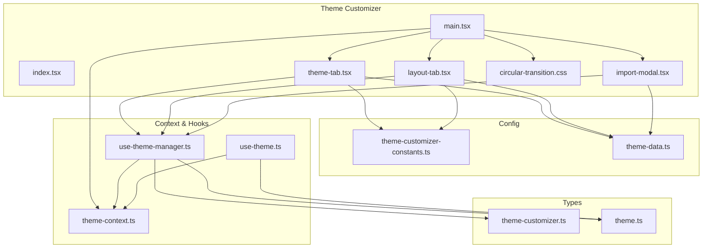
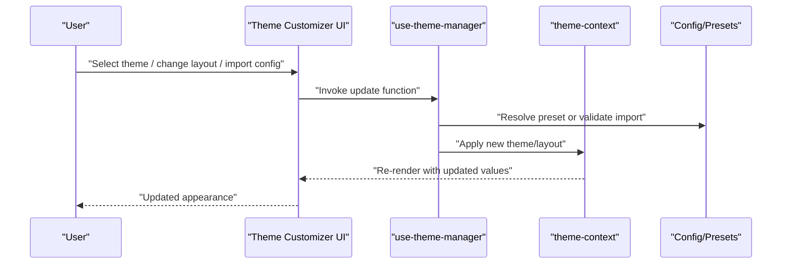
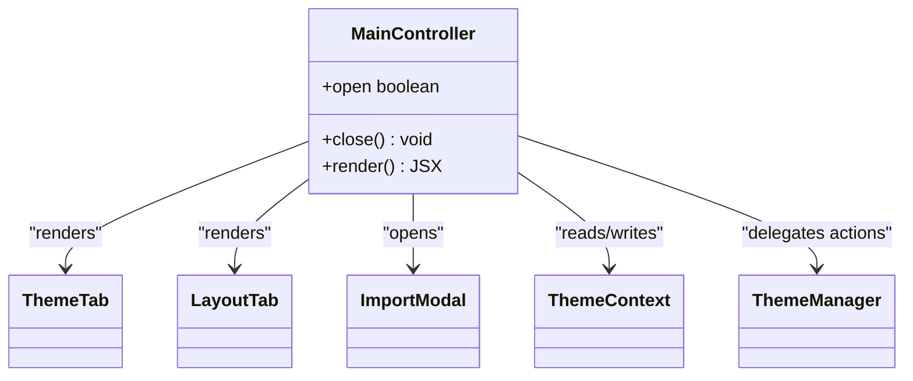
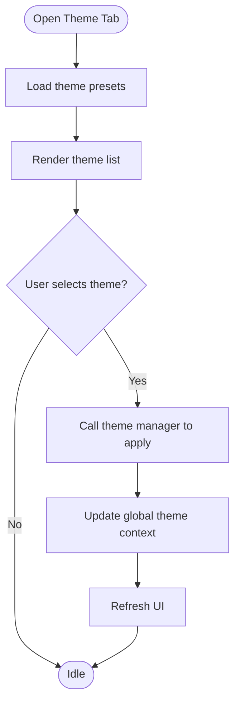
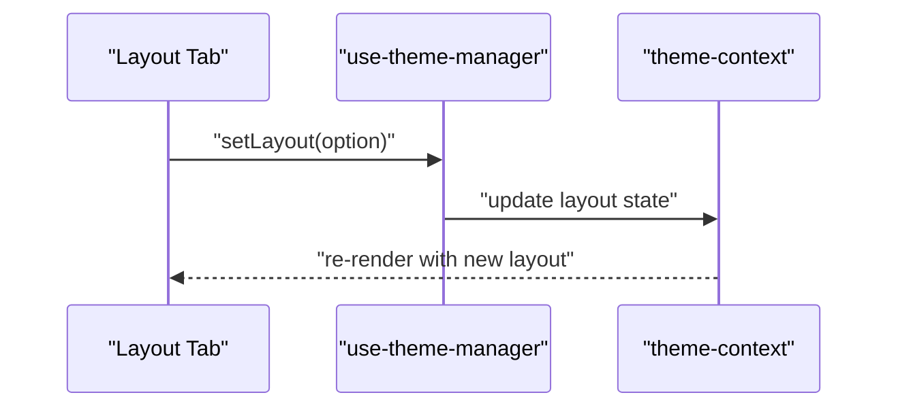
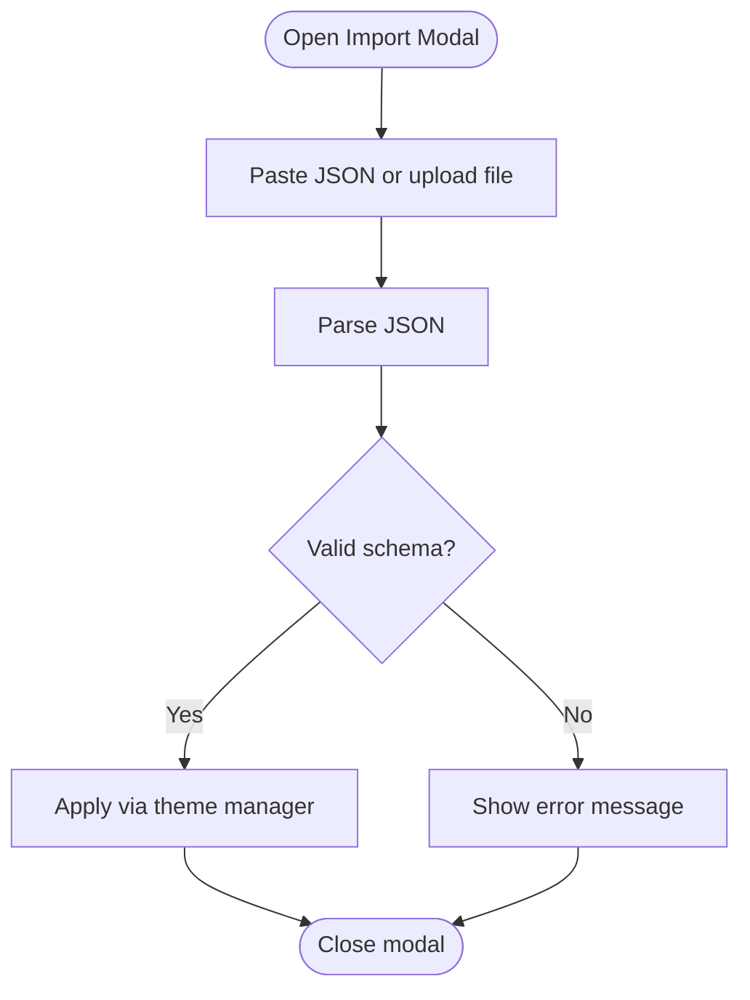
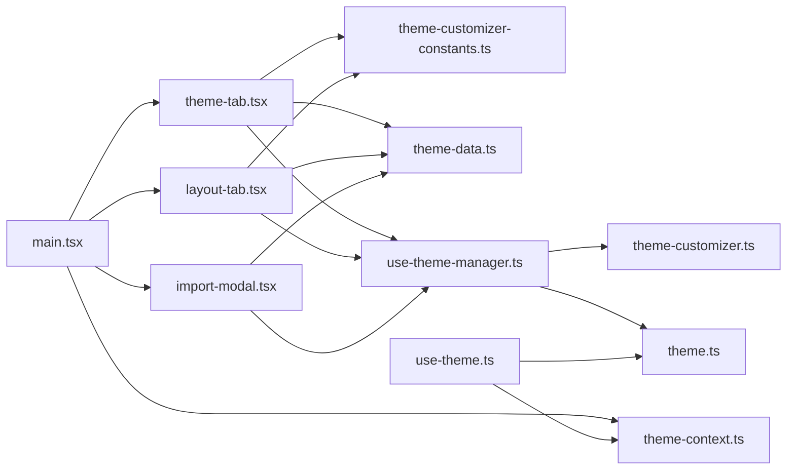

# Theme Customizer

<cite>
**Referenced Files in This Document**
- [src/components/theme-customizer/main.tsx](file://src/components/theme-customizer/main.tsx)
- [src/components/theme-customizer/index.tsx](file://src/components/theme-customizer/index.tsx)
- [src/components/theme-customizer/theme-tab.tsx](file://src/components/theme-customizer/theme-tab.tsx)
- [src/components/theme-customizer/layout-tab.tsx](file://src/components/theme-customizer/layout-tab.tsx)
- [src/components/theme-customizer/import-modal.tsx](file://src/components/theme-customizer/import-modal.tsx)
- [src/components/theme-customizer/circular-transition.css](file://src/components/theme-customizer/circular-transition.css)
- [src/config/theme-customizer-constants.ts](file://src/config/theme-customizer-constants.ts)
- [src/config/theme-data.ts](file://src/config/theme-data.ts)
- [src/contexts/theme-context.ts](file://src/contexts/theme-context.ts)
- [src/hooks/use-theme-manager.ts](file://src/hooks/use-theme-manager.ts)
- [src/hooks/use-theme.ts](file://src/hooks/use-theme.ts)
- [src/types/theme-customizer.ts](file://src/types/theme-customizer.ts)
- [src/types/theme.ts](file://src/types/theme.ts)
</cite>

## Table of Contents
1. [Introduction](#introduction)
2. [Project Structure](#project-structure)
3. [Core Components](#core-components)
4. [Architecture Overview](#architecture-overview)
5. [Detailed Component Analysis](#detailed-component-analysis)
6. [Dependency Analysis](#dependency-analysis)
7. [Performance Considerations](#performance-considerations)
8. [Troubleshooting Guide](#troubleshooting-guide)
9. [Conclusion](#conclusion)
10. [Appendices](#appendices)

## Introduction
This document explains the Theme Customizer component system, focusing on how users customize themes and layouts through a dedicated interface. It covers theme switching, layout options, and import/export functionality. The documentation also details the component architecture (main controller, theme tab, layout tab, and import modal), provides examples for programmatic theme changes and custom theme creation, and discusses integration with the global theme context. Finally, it addresses performance optimization strategies for smooth theme switching and browser compatibility considerations.

## Project Structure
The Theme Customizer is implemented as a cohesive set of components and supporting modules:
- UI components: main controller, tabs for theme and layout, and an import modal
- Configuration: constants and preset data for themes and layouts
- Context and hooks: global state management and reusable logic for theme operations
- Types: shared TypeScript definitions for theme and customizer structures

**Diagram sources**
- [src/components/theme-customizer/main.tsx](file://src/components/theme-customizer/main.tsx)
- [src/components/theme-customizer/index.tsx](file://src/components/theme-customizer/index.tsx)
- [src/components/theme-customizer/theme-tab.tsx](file://src/components/theme-customizer/theme-tab.tsx)
- [src/components/theme-customizer/layout-tab.tsx](file://src/components/theme-customizer/layout-tab.tsx)
- [src/components/theme-customizer/import-modal.tsx](file://src/components/theme-customizer/import-modal.tsx)
- [src/components/theme-customizer/circular-transition.css](file://src/components/theme-customizer/circular-transition.css)
- [src/config/theme-customizer-constants.ts](file://src/config/theme-customizer-constants.ts)
- [src/config/theme-data.ts](file://src/config/theme-data.ts)
- [src/contexts/theme-context.ts](file://src/contexts/theme-context.ts)
- [src/hooks/use-theme-manager.ts](file://src/hooks/use-theme-manager.ts)
- [src/hooks/use-theme.ts](file://src/hooks/use-theme.ts)
- [src/types/theme-customizer.ts](file://src/types/theme-customizer.ts)
- [src/types/theme.ts](file://src/types/theme.ts)

**Section sources**
- [src/components/theme-customizer/main.tsx](file://src/components/theme-customizer/main.tsx)
- [src/components/theme-customizer/index.tsx](file://src/components/theme-customizer/index.tsx)
- [src/components/theme-customizer/theme-tab.tsx](file://src/components/theme-customizer/theme-tab.tsx)
- [src/components/theme-customizer/layout-tab.tsx](file://src/components/theme-customizer/layout-tab.tsx)
- [src/components/theme-customizer/import-modal.tsx](file://src/components/theme-customizer/import-modal.tsx)
- [src/components/theme-customizer/circular-transition.css](file://src/components/theme-customizer/circular-transition.css)
- [src/config/theme-customizer-constants.ts](file://src/config/theme-customizer-constants.ts)
- [src/config/theme-data.ts](file://src/config/theme-data.ts)
- [src/contexts/theme-context.ts](file://src/contexts/theme-context.ts)
- [src/hooks/use-theme-manager.ts](file://src/hooks/use-theme-manager.ts)
- [src/hooks/use-theme.ts](file://src/hooks/use-theme.ts)
- [src/types/theme-customizer.ts](file://src/types/theme-customizer.ts)
- [src/types/theme.ts](file://src/types/theme.ts)

## Core Components
- Main Controller (main.tsx): Orchestrates the Theme Customizer UI, manages open/close state, and composes the Theme Tab, Layout Tab, and Import Modal. It integrates with the global theme context to apply changes across the app.
- Theme Tab (theme-tab.tsx): Presents available themes, allows selection, and triggers theme updates via the theme manager hook.
- Layout Tab (layout-tab.tsx): Provides layout options (e.g., sidebar behavior, content width) and applies them using the theme manager.
- Import Modal (import-modal.tsx): Enables importing themes or configurations from JSON, validates input, and applies the imported configuration.
- Circular Transition Styles (circular-transition.css): Defines transition animations used during theme switches for a smoother user experience.

Key responsibilities:
- State coordination between UI and global context
- Validation and persistence of theme/layout settings
- Smooth transitions and accessibility-friendly interactions

**Section sources**
- [src/components/theme-customizer/main.tsx](file://src/components/theme-customizer/main.tsx)
- [src/components/theme-customizer/theme-tab.tsx](file://src/components/theme-customizer/theme-tab.tsx)
- [src/components/theme-customizer/layout-tab.tsx](file://src/components/theme-customizer/layout-tab.tsx)
- [src/components/theme-customizer/import-modal.tsx](file://src/components/theme-customizer/import-modal.tsx)
- [src/components/theme-customizer/circular-transition.css](file://src/components/theme-customizer/circular-transition.css)

## Architecture Overview
The Theme Customizer follows a clear separation of concerns:
- UI layer: Tabs and modals render user controls
- Logic layer: use-theme-manager encapsulates theme operations and persistence
- Global state: theme-context exposes current theme and setters
- Configuration: constants and presets define available options
- Types: ensure type safety across the system

**Diagram sources**
- [src/components/theme-customizer/main.tsx](file://src/components/theme-customizer/main.tsx)
- [src/components/theme-customizer/theme-tab.tsx](file://src/components/theme-customizer/theme-tab.tsx)
- [src/components/theme-customizer/layout-tab.tsx](file://src/components/theme-customizer/layout-tab.tsx)
- [src/components/theme-customizer/import-modal.tsx](file://src/components/theme-customizer/import-modal.tsx)
- [src/hooks/use-theme-manager.ts](file://src/hooks/use-theme-manager.ts)
- [src/contexts/theme-context.ts](file://src/contexts/theme-context.ts)
- [src/config/theme-customizer-constants.ts](file://src/config/theme-customizer-constants.ts)
- [src/config/theme-data.ts](file://src/config/theme-data.ts)

## Detailed Component Analysis

### Main Controller (main.tsx)
Responsibilities:
- Manage visibility of the customizer panel
- Compose child components (tabs and modal)
- Provide props derived from global theme context
- Coordinate actions like opening the import modal

Integration points:
- Reads/writes theme state via theme-context
- Uses use-theme-manager for side effects (persistence, validation)

**Diagram sources**
- [src/components/theme-customizer/main.tsx](file://src/components/theme-customizer/main.tsx)
- [src/contexts/theme-context.ts](file://src/contexts/theme-context.ts)
- [src/hooks/use-theme-manager.ts](file://src/hooks/use-theme-manager.ts)

**Section sources**
- [src/components/theme-customizer/main.tsx](file://src/components/theme-customizer/main.tsx)
- [src/contexts/theme-context.ts](file://src/contexts/theme-context.ts)
- [src/hooks/use-theme-manager.ts](file://src/hooks/use-theme-manager.ts)

### Theme Tab (theme-tab.tsx)
Responsibilities:
- Display available themes from configuration
- Handle selection and trigger theme updates
- Reflect current active theme

Data flow:
- Reads presets/constants
- Calls theme manager to apply selected theme
- Updates UI based on context

**Diagram sources**
- [src/components/theme-customizer/theme-tab.tsx](file://src/components/theme-customizer/theme-tab.tsx)
- [src/config/theme-customizer-constants.ts](file://src/config/theme-customizer-constants.ts)
- [src/config/theme-data.ts](file://src/config/theme-data.ts)
- [src/hooks/use-theme-manager.ts](file://src/hooks/use-theme-manager.ts)
- [src/contexts/theme-context.ts](file://src/contexts/theme-context.ts)

**Section sources**
- [src/components/theme-customizer/theme-tab.tsx](file://src/components/theme-customizer/theme-tab.tsx)
- [src/config/theme-customizer-constants.ts](file://src/config/theme-customizer-constants.ts)
- [src/config/theme-data.ts](file://src/config/theme-data.ts)
- [src/hooks/use-theme-manager.ts](file://src/hooks/use-theme-manager.ts)
- [src/contexts/theme-context.ts](file://src/contexts/theme-context.ts)

### Layout Tab (layout-tab.tsx)
Responsibilities:
- Present layout options (e.g., sidebar mode, content width)
- Apply layout changes via theme manager
- Persist user preferences

**Diagram sources**
- [src/components/theme-customizer/layout-tab.tsx](file://src/components/theme-customizer/layout-tab.tsx)
- [src/hooks/use-theme-manager.ts](file://src/hooks/use-theme-manager.ts)
- [src/contexts/theme-context.ts](file://src/contexts/theme-context.ts)

**Section sources**
- [src/components/theme-customizer/layout-tab.tsx](file://src/components/theme-customizer/layout-tab.tsx)
- [src/hooks/use-theme-manager.ts](file://src/hooks/use-theme-manager.ts)
- [src/contexts/theme-context.ts](file://src/contexts/theme-context.ts)

### Import Modal (import-modal.tsx)
Responsibilities:
- Accept JSON payload (theme or layout configuration)
- Validate structure against types
- Apply validated configuration via theme manager
- Show success/error feedback

**Diagram sources**
- [src/components/theme-customizer/import-modal.tsx](file://src/components/theme-customizer/import-modal.tsx)
- [src/types/theme-customizer.ts](file://src/types/theme-customizer.ts)
- [src/hooks/use-theme-manager.ts](file://src/hooks/use-theme-manager.ts)

**Section sources**
- [src/components/theme-customizer/import-modal.tsx](file://src/components/theme-customizer/import-modal.tsx)
- [src/types/theme-customizer.ts](file://src/types/theme-customizer.ts)
- [src/hooks/use-theme-manager.ts](file://src/hooks/use-theme-manager.ts)

### Circular Transition Styles (circular-transition.css)
Purpose:
- Define CSS transitions for theme switching to provide visual continuity
- Ensure consistent animation timing and easing across browsers

Usage:
- Applied by theme switch logic to animate color and layout changes

**Section sources**
- [src/components/theme-customizer/circular-transition.css](file://src/components/theme-customizer/circular-transition.css)

## Dependency Analysis
The Theme Customizer depends on configuration, context, hooks, and types to operate cohesively.

**Diagram sources**
- [src/components/theme-customizer/main.tsx](file://src/components/theme-customizer/main.tsx)
- [src/components/theme-customizer/theme-tab.tsx](file://src/components/theme-customizer/theme-tab.tsx)
- [src/components/theme-customizer/layout-tab.tsx](file://src/components/theme-customizer/layout-tab.tsx)
- [src/components/theme-customizer/import-modal.tsx](file://src/components/theme-customizer/import-modal.tsx)
- [src/config/theme-customizer-constants.ts](file://src/config/theme-customizer-constants.ts)
- [src/config/theme-data.ts](file://src/config/theme-data.ts)
- [src/contexts/theme-context.ts](file://src/contexts/theme-context.ts)
- [src/hooks/use-theme-manager.ts](file://src/hooks/use-theme-manager.ts)
- [src/hooks/use-theme.ts](file://src/hooks/use-theme.ts)
- [src/types/theme-customizer.ts](file://src/types/theme-customizer.ts)
- [src/types/theme.ts](file://src/types/theme.ts)

**Section sources**
- [src/components/theme-customizer/main.tsx](file://src/components/theme-customizer/main.tsx)
- [src/components/theme-customizer/theme-tab.tsx](file://src/components/theme-customizer/theme-tab.tsx)
- [src/components/theme-customizer/layout-tab.tsx](file://src/components/theme-customizer/layout-tab.tsx)
- [src/components/theme-customizer/import-modal.tsx](file://src/components/theme-customizer/import-modal.tsx)
- [src/config/theme-customizer-constants.ts](file://src/config/theme-customizer-constants.ts)
- [src/config/theme-data.ts](file://src/config/theme-data.ts)
- [src/contexts/theme-context.ts](file://src/contexts/theme-context.ts)
- [src/hooks/use-theme-manager.ts](file://src/hooks/use-theme-manager.ts)
- [src/hooks/use-theme.ts](file://src/hooks/use-theme.ts)
- [src/types/theme-customizer.ts](file://src/types/theme-customizer.ts)
- [src/types/theme.ts](file://src/types/theme.ts)

## Performance Considerations
- Minimize re-renders:
  - Memoize expensive computations in theme-tab and layout-tab
  - Avoid unnecessary state updates; batch related changes
- Efficient theme application:
  - Prefer targeted updates via theme-context rather than full app reloads
  - Use CSS transitions defined in circular-transition.css to avoid heavy JS animations
- Persistence strategy:
  - Debounce writes to storage when applying multiple changes rapidly
- Memory usage:
  - Avoid retaining large imported payloads after applying; clean up references
- Browser compatibility:
  - Ensure CSS transitions are supported; provide fallbacks if needed
  - Test localStorage/sessionStorage availability and handle errors gracefully

[No sources needed since this section provides general guidance]

## Troubleshooting Guide
Common issues and resolutions:
- Theme not applied:
  - Verify that theme-context is correctly initialized and accessible
  - Check that use-theme-manager calls the appropriate setter functions
- Import fails:
  - Validate JSON structure against theme-customizer types
  - Confirm required fields exist and match expected formats
- Layout changes not persisting:
  - Ensure persistence logic in use-theme-manager is invoked and storage APIs are available
- Visual glitches during switch:
  - Inspect circular-transition.css for conflicts
  - Confirm no heavy synchronous work blocks the main thread during theme updates

**Section sources**
- [src/components/theme-customizer/import-modal.tsx](file://src/components/theme-customizer/import-modal.tsx)
- [src/hooks/use-theme-manager.ts](file://src/hooks/use-theme-manager.ts)
- [src/contexts/theme-context.ts](file://src/contexts/theme-context.ts)
- [src/components/theme-customizer/circular-transition.css](file://src/components/theme-customizer/circular-transition.css)

## Conclusion
The Theme Customizer provides a robust, modular system for managing themes and layouts. Its architecture separates UI, logic, and configuration while leveraging a global context for consistent application-wide updates. With careful attention to performance and browser compatibility, the system delivers a smooth customization experience.

[No sources needed since this section summarizes without analyzing specific files]

## Appendices

### Programmatic Theme Changes
- Use the theme manager hook to apply a theme programmatically
- Read current theme via the theme hook for conditional logic
- Example pattern:
  - Call the manager’s update function with a target theme identifier
  - Optionally persist the change immediately

**Section sources**
- [src/hooks/use-theme-manager.ts](file://src/hooks/use-theme-manager.ts)
- [src/hooks/use-theme.ts](file://src/hooks/use-theme.ts)
- [src/contexts/theme-context.ts](file://src/contexts/theme-context.ts)

### Creating a Custom Theme
- Define a new theme object conforming to the theme types
- Add it to the configuration (presets or constants)
- Reference the new theme in the theme tab or apply it programmatically

**Section sources**
- [src/types/theme.ts](file://src/types/theme.ts)
- [src/config/theme-data.ts](file://src/config/theme-data.ts)
- [src/config/theme-customizer-constants.ts](file://src/config/theme-customizer-constants.ts)

### Integration with Global Theme Context
- Wrap your application with the theme provider to expose context
- Consume the theme context in components to read/write theme state
- Ensure the customizer reads and writes through the same context instance

**Section sources**
- [src/contexts/theme-context.ts](file://src/contexts/theme-context.ts)
- [src/hooks/use-theme.ts](file://src/hooks/use-theme.ts)