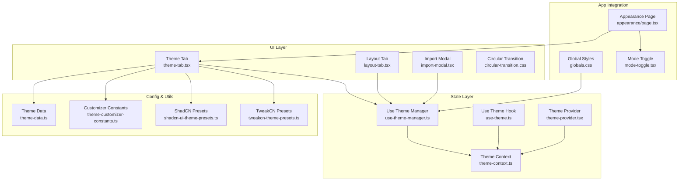
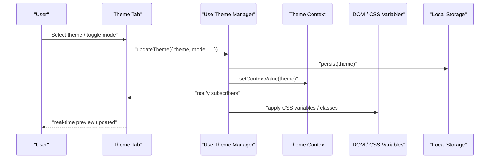
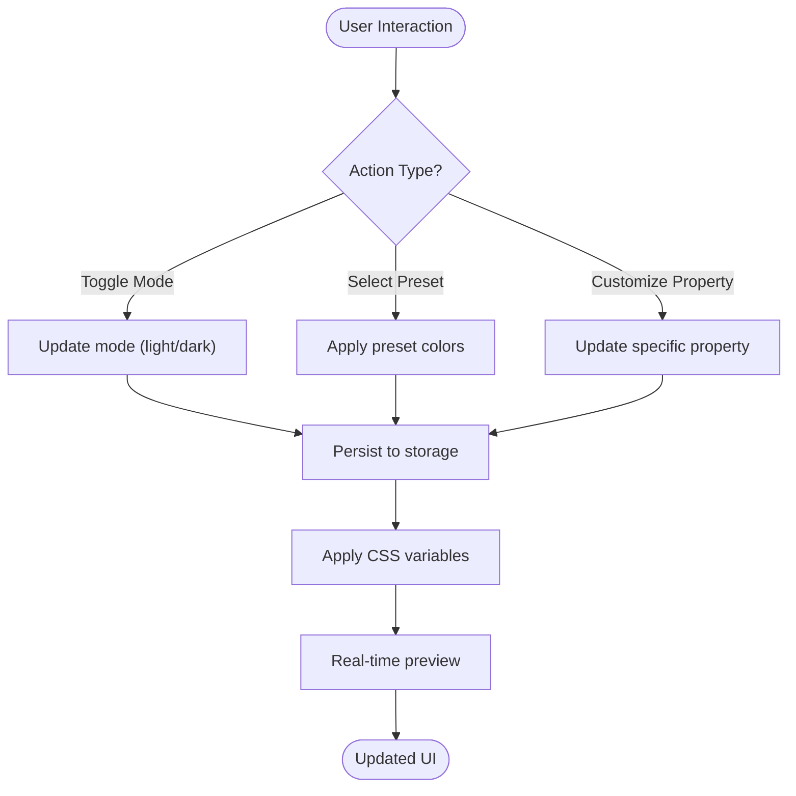
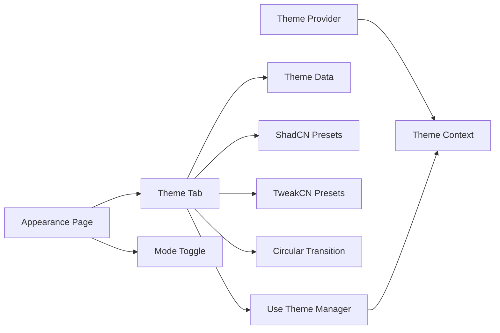

# Theme Tab Component

<cite>
**Referenced Files in This Document**
- [theme-tab.tsx](file://src/components/theme-customizer/theme-tab.tsx)
- [index.tsx](file://src/components/theme-customizer/index.tsx)
- [main.tsx](file://src/components/theme-customizer/main.tsx)
- [layout-tab.tsx](file://src/components/theme-customizer/layout-tab.tsx)
- [import-modal.tsx](file://src/components/theme-customizer/import-modal.tsx)
- [circular-transition.css](file://src/components/theme-customizer/circular-transition.css)
- [use-theme-manager.ts](file://src/hooks/use-theme-manager.ts)
- [use-theme.ts](file://src/hooks/use-theme.ts)
- [theme-context.ts](file://src/contexts/theme-context.ts)
- [theme-provider.tsx](file://src/components/theme-provider.tsx)
- [mode-toggle.tsx](file://src/components/mode-toggle.tsx)
- [theme-data.ts](file://src/config/theme-data.ts)
- [theme-customizer-constants.ts](file://src/config/theme-customizer-constants.ts)
- [shadcn-ui-theme-presets.ts](file://src/utils/shadcn-ui-theme-presets.ts)
- [tweakcn-theme-presets.ts](file://src/utils/tweakcn-theme-presets.ts)
- [appearance/page.tsx](file://src/app/(private)/settings/appearance/page.tsx)
- [globals.css](file://src/app/globals.css)
</cite>

## Table of Contents
1. [Introduction](#introduction)
2. [Project Structure](#project-structure)
3. [Core Components](#core-components)
4. [Architecture Overview](#architecture-overview)
5. [Detailed Component Analysis](#detailed-component-analysis)
6. [Dependency Analysis](#dependency-analysis)
7. [Performance Considerations](#performance-considerations)
8. [Troubleshooting Guide](#troubleshooting-guide)
9. [Conclusion](#conclusion)
10. [Appendices](#appendices)

## Introduction
This document explains the Theme Tab component that powers theme selection and customization across the application. It covers how users switch between light/dark modes, select color presets, customize theme properties, and preview changes in real time. It also documents available theme options, color palette configuration, adding custom themes, extending configurations, and persisting preferences across sessions.

## Project Structure
The Theme Tab feature is implemented as a cohesive set of components, hooks, contexts, and configuration files:
- UI layer: Theme Tab and related tabs (Layout, Import), plus a circular transition effect for smooth theme switching.
- State layer: Theme context and hooks to manage current theme, mode, and persistence.
- Configuration: Preset themes, constants, and data models.
- Integration: Appearance settings page and global CSS variables.

**Diagram sources**
- [theme-tab.tsx](file://src/components/theme-customizer/theme-tab.tsx)
- [layout-tab.tsx](file://src/components/theme-customizer/layout-tab.tsx)
- [import-modal.tsx](file://src/components/theme-customizer/import-modal.tsx)
- [circular-transition.css](file://src/components/theme-customizer/circular-transition.css)
- [use-theme-manager.ts](file://src/hooks/use-theme-manager.ts)
- [use-theme.ts](file://src/hooks/use-theme.ts)
- [theme-context.ts](file://src/contexts/theme-context.ts)
- [theme-provider.tsx](file://src/components/theme-provider.tsx)
- [theme-data.ts](file://src/config/theme-data.ts)
- [theme-customizer-constants.ts](file://src/config/theme-customizer-constants.ts)
- [shadcn-ui-theme-presets.ts](file://src/utils/shadcn-ui-theme-presets.ts)
- [tweakcn-theme-presets.ts](file://src/utils/tweakcn-theme-presets.ts)
- [appearance/page.tsx](file://src/app/(private)/settings/appearance/page.tsx)
- [globals.css](file://src/app/globals.css)
- [mode-toggle.tsx](file://src/components/mode-toggle.tsx)

**Section sources**
- [theme-tab.tsx](file://src/components/theme-customizer/theme-tab.tsx)
- [index.tsx](file://src/components/theme-customizer/index.tsx)
- [main.tsx](file://src/components/theme-customizer/main.tsx)
- [layout-tab.tsx](file://src/components/theme-customizer/layout-tab.tsx)
- [import-modal.tsx](file://src/components/theme-customizer/import-modal.tsx)
- [circular-transition.css](file://src/components/theme-customizer/circular-transition.css)
- [use-theme-manager.ts](file://src/hooks/use-theme-manager.ts)
- [use-theme.ts](file://src/hooks/use-theme.ts)
- [theme-context.ts](file://src/contexts/theme-context.ts)
- [theme-provider.tsx](file://src/components/theme-provider.tsx)
- [mode-toggle.tsx](file://src/components/mode-toggle.tsx)
- [theme-data.ts](file://src/config/theme-data.ts)
- [theme-customizer-constants.ts](file://src/config/theme-customizer-constants.ts)
- [shadcn-ui-theme-presets.ts](file://src/utils/shadcn-ui-theme-presets.ts)
- [tweakcn-theme-presets.ts](file://src/utils/tweakcn-theme-presets.ts)
- [appearance/page.tsx](file://src/app/(private)/settings/appearance/page.tsx)
- [globals.css](file://src/app/globals.css)

## Core Components
- Theme Tab: Primary interface for selecting themes, toggling light/dark mode, choosing color presets, and adjusting theme properties with live preview.
- Layout Tab: Controls layout-related theme aspects such as sidebar behavior and content density.
- Import Modal: Allows importing/exporting or applying external theme configurations.
- Circular Transition: Provides a smooth visual transition when theme changes are applied.

Key responsibilities:
- Read and write theme state via the theme manager hook.
- Apply CSS variables and class toggles for immediate visual feedback.
- Persist user preferences across sessions using local storage.
- Integrate with preset collections and custom overrides.

**Section sources**
- [theme-tab.tsx](file://src/components/theme-customizer/theme-tab.tsx)
- [layout-tab.tsx](file://src/components/theme-customizer/layout-tab.tsx)
- [import-modal.tsx](file://src/components/theme-customizer/import-modal.tsx)
- [circular-transition.css](file://src/components/theme-customizer/circular-transition.css)

## Architecture Overview
The Theme Tab integrates with a provider-based architecture:
- Theme Provider initializes the theme context and applies initial values from persisted storage.
- Use Theme Manager centralizes logic for reading/writing theme state, handling persistence, and notifying subscribers.
- Use Theme Hook exposes reactive theme state and actions to components.
- Global CSS variables define the design tokens consumed by the app.

**Diagram sources**
- [theme-tab.tsx](file://src/components/theme-customizer/theme-tab.tsx)
- [use-theme-manager.ts](file://src/hooks/use-theme-manager.ts)
- [theme-context.ts](file://src/contexts/theme-context.ts)
- [globals.css](file://src/app/globals.css)

## Detailed Component Analysis

### Theme Tab
Responsibilities:
- Present theme presets and allow selection.
- Provide light/dark mode toggle.
- Expose controls for customizing theme properties (e.g., primary color, radius).
- Show real-time preview by updating CSS variables immediately.

Behavior highlights:
- On change, calls the theme manager to update state and persist.
- Applies transitions via the circular transition utility for smooth updates.
- Integrates with preset collections for quick theme application.

**Diagram sources**
- [theme-tab.tsx](file://src/components/theme-customizer/theme-tab.tsx)
- [use-theme-manager.ts](file://src/hooks/use-theme-manager.ts)
- [circular-transition.css](file://src/components/theme-customizer/circular-transition.css)

**Section sources**
- [theme-tab.tsx](file://src/components/theme-customizer/theme-tab.tsx)
- [use-theme-manager.ts](file://src/hooks/use-theme-manager.ts)
- [circular-transition.css](file://src/components/theme-customizer/circular-transition.css)

### Layout Tab
Responsibilities:
- Adjust layout-related theme options such as sidebar visibility and content density.
- Coordinate with the theme manager to apply layout-specific CSS variables.

Integration:
- Uses the same theme context and persistence mechanism as the Theme Tab.

**Section sources**
- [layout-tab.tsx](file://src/components/theme-customizer/layout-tab.tsx)
- [use-theme-manager.ts](file://src/hooks/use-theme-manager.ts)

### Import Modal
Responsibilities:
- Allow importing theme configurations from JSON or other formats.
- Validate imported data and merge with existing theme state.
- Trigger re-application of theme variables and persistence.

Validation and safety:
- Ensures only recognized keys are applied.
- Falls back gracefully on invalid inputs.

**Section sources**
- [import-modal.tsx](file://src/components/theme-customizer/import-modal.tsx)
- [use-theme-manager.ts](file://src/hooks/use-theme-manager.ts)

### Circular Transition
Purpose:
- Provides a smooth visual transition when theme changes occur, improving perceived performance and UX.

Implementation notes:
- Applied during theme updates to avoid jarring flashes.
- Controlled via CSS classes toggled by the theme manager.

**Section sources**
- [circular-transition.css](file://src/components/theme-customizer/circular-transition.css)
- [use-theme-manager.ts](file://src/hooks/use-theme-manager.ts)

## Dependency Analysis
High-level dependencies:
- Theme Tab depends on:
  - use-theme-manager for state and persistence.
  - theme-data and preset utilities for available options.
  - circular-transition for visual effects.
- Theme Provider sets up the context and initial values.
- Appearance page composes Theme Tab and Mode Toggle.

**Diagram sources**
- [theme-tab.tsx](file://src/components/theme-customizer/theme-tab.tsx)
- [use-theme-manager.ts](file://src/hooks/use-theme-manager.ts)
- [theme-data.ts](file://src/config/theme-data.ts)
- [shadcn-ui-theme-presets.ts](file://src/utils/shadcn-ui-theme-presets.ts)
- [tweakcn-theme-presets.ts](file://src/utils/tweakcn-theme-presets.ts)
- [circular-transition.css](file://src/components/theme-customizer/circular-transition.css)
- [appearance/page.tsx](file://src/app/(private)/settings/appearance/page.tsx)
- [mode-toggle.tsx](file://src/components/mode-toggle.tsx)
- [theme-provider.tsx](file://src/components/theme-provider.tsx)
- [theme-context.ts](file://src/contexts/theme-context.ts)

**Section sources**
- [theme-tab.tsx](file://src/components/theme-customizer/theme-tab.tsx)
- [use-theme-manager.ts](file://src/hooks/use-theme-manager.ts)
- [theme-data.ts](file://src/config/theme-data.ts)
- [shadcn-ui-theme-presets.ts](file://src/utils/shadcn-ui-theme-presets.ts)
- [tweakcn-theme-presets.ts](file://src/utils/tweakcn-theme-presets.ts)
- [circular-transition.css](file://src/components/theme-customizer/circular-transition.css)
- [appearance/page.tsx](file://src/app/(private)/settings/appearance/page.tsx)
- [mode-toggle.tsx](file://src/components/mode-toggle.tsx)
- [theme-provider.tsx](file://src/components/theme-provider.tsx)
- [theme-context.ts](file://src/contexts/theme-context.ts)

## Performance Considerations
- Real-time preview: Updates are batched at the theme manager level to minimize re-renders.
- CSS variable application: Prefer updating CSS variables over heavy DOM mutations for fast feedback.
- Transitions: Keep transition durations short to balance smoothness and responsiveness.
- Persistence: Debounce writes to local storage if frequent updates occur.

[No sources needed since this section provides general guidance]

## Troubleshooting Guide
Common issues and resolutions:
- Theme not persisting:
  - Verify local storage access and key names used by the theme manager.
  - Ensure the theme provider initializes from storage before first render.
- No visual changes after selection:
  - Confirm CSS variables are correctly mapped and applied to the root element.
  - Check that the circular transition does not mask updates due to long durations.
- Invalid import:
  - Validate imported schema against expected keys; ignore unknown fields safely.
- Light/Dark toggle flicker:
  - Ensure the mode toggle updates both CSS variables and any required class toggles atomically.

**Section sources**
- [use-theme-manager.ts](file://src/hooks/use-theme-manager.ts)
- [theme-provider.tsx](file://src/components/theme-provider.tsx)
- [globals.css](file://src/app/globals.css)
- [circular-transition.css](file://src/components/theme-customizer/circular-transition.css)
- [mode-toggle.tsx](file://src/components/mode-toggle.tsx)

## Conclusion
The Theme Tab component offers a robust, extensible system for theme selection and customization. It leverages a provider-based architecture, centralized state management, and real-time CSS variable updates to deliver a smooth user experience. With built-in persistence, preset support, and import capabilities, it enables both quick theming and deep customization.

[No sources needed since this section summarizes without analyzing specific files]

## Appendices

### Available Theme Options
- Modes: Light and Dark.
- Color presets: Curated palettes from ShadCN and TweakCN collections.
- Customizable properties: Primary/accent colors, border radius, and other design tokens exposed via the theme manager.

**Section sources**
- [theme-data.ts](file://src/config/theme-data.ts)
- [shadcn-ui-theme-presets.ts](file://src/utils/shadcn-ui-theme-presets.ts)
- [tweakcn-theme-presets.ts](file://src/utils/tweakcn-theme-presets.ts)
- [theme-customizer-constants.ts](file://src/config/theme-customizer-constants.ts)

### Adding Custom Themes
Steps:
- Define a new theme object with supported keys.
- Register it in the theme data or presets collection.
- Optionally expose it through the Import Modal for dynamic loading.
- Ensure CSS variables exist for all referenced tokens.

**Section sources**
- [theme-data.ts](file://src/config/theme-data.ts)
- [shadcn-ui-theme-presets.ts](file://src/utils/shadcn-ui-theme-presets.ts)
- [tweakcn-theme-presets.ts](file://src/utils/tweakcn-theme-presets.ts)
- [import-modal.tsx](file://src/components/theme-customizer/import-modal.tsx)

### Extending Theme Configurations
Approach:
- Extend the theme manager’s accepted keys and validation rules.
- Add corresponding CSS variables in global styles.
- Wire UI controls in the Theme Tab to update the new properties.

**Section sources**
- [use-theme-manager.ts](file://src/hooks/use-theme-manager.ts)
- [globals.css](file://src/app/globals.css)
- [theme-tab.tsx](file://src/components/theme-customizer/theme-tab.tsx)

### Handling Theme Persistence Across Sessions
Mechanism:
- The theme manager persists the full theme state to local storage.
- The theme provider reads from storage on initialization and applies the saved theme.
- Changes trigger immediate updates and subsequent persistence.

**Section sources**
- [use-theme-manager.ts](file://src/hooks/use-theme-manager.ts)
- [theme-provider.tsx](file://src/components/theme-provider.tsx)

### Real-Time Preview Functionality
How it works:
- User interactions call the theme manager to update state.
- The manager applies CSS variables to the document root.
- Subscribers (including the Theme Tab) re-render instantly, reflecting changes.

**Section sources**
- [use-theme-manager.ts](file://src/hooks/use-theme-manager.ts)
- [theme-context.ts](file://src/contexts/theme-context.ts)
- [globals.css](file://src/app/globals.css)

### Integration Points
- Appearance Settings Page: Hosts the Theme Tab and Mode Toggle for user-facing configuration.
- Global Styles: Defines CSS variables consumed by the entire application.

**Section sources**
- [appearance/page.tsx](file://src/app/(private)/settings/appearance/page.tsx)
- [mode-toggle.tsx](file://src/components/mode-toggle.tsx)
- [globals.css](file://src/app/globals.css)