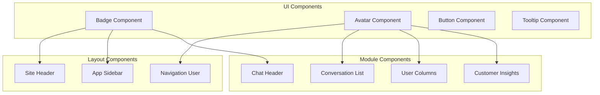
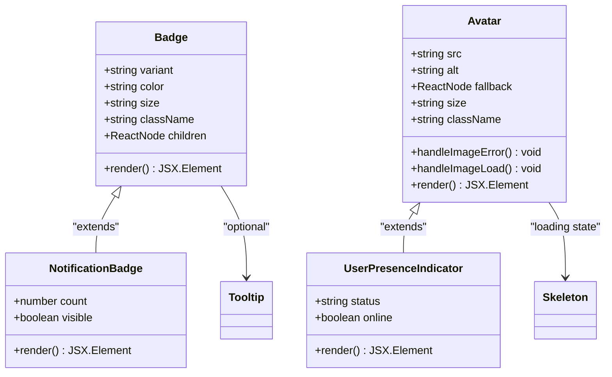
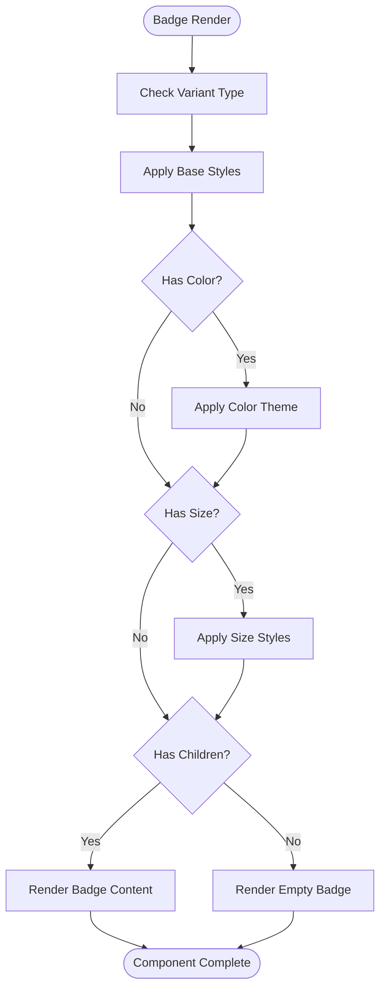
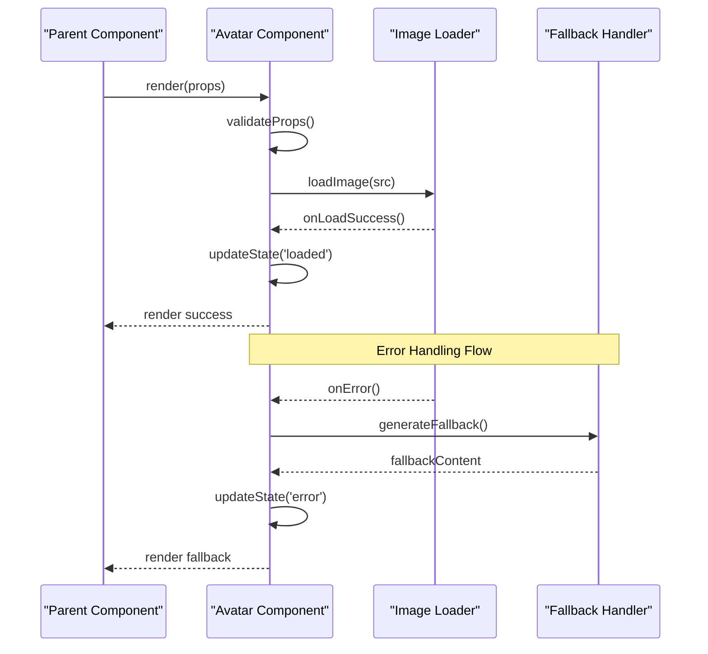
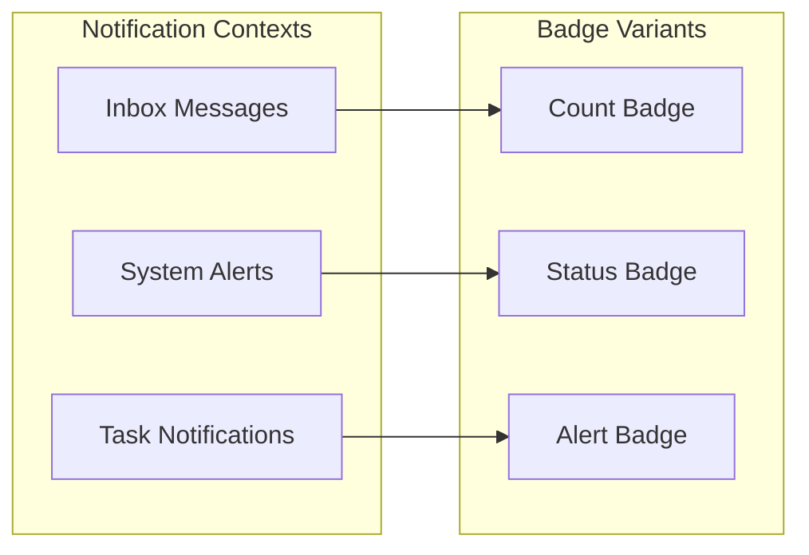
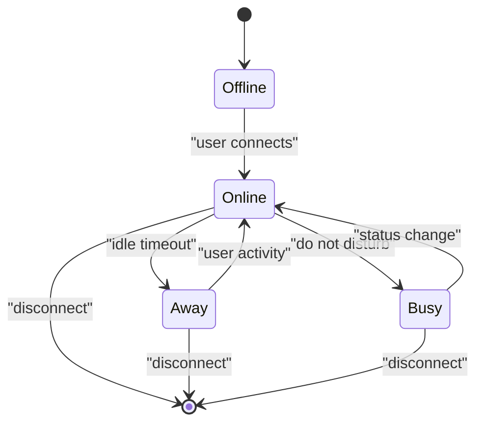

# Badge & Avatar Components

<cite>
**Referenced Files in This Document**
- [badge.tsx](file://src/components/ui/badge.tsx)
- [avatar.tsx](file://src/components/ui/avatar.tsx)
- [site-header.tsx](file://src/components/site-header.tsx)
- [nav-user.tsx](file://src/components/nav-user.tsx)
- [app-sidebar.tsx](file://src/components/app-sidebar.tsx)
- [chat-header.tsx](file://src/modules/chat/components/chat-header.tsx)
- [conversation-list.tsx](file://src/modules/chat/components/conversation-list.tsx)
- [user-columns.tsx](file://src/modules/users/components/user-columns.tsx)
- [customer-insights.tsx](file://src/modules/dashboard-2/components/customer-insights.tsx)
</cite>

## Table of Contents
1. [Introduction](#introduction)
2. [Project Structure](#project-structure)
3. [Core Components](#core-components)
4. [Architecture Overview](#architecture-overview)
5. [Detailed Component Analysis](#detailed-component-analysis)
6. [Usage Examples](#usage-examples)
7. [Accessibility Considerations](#accessibility-considerations)
8. [Internationalization Support](#internationalization-support)
9. [Performance Considerations](#performance-considerations)
10. [Troubleshooting Guide](#troubleshooting-guide)
11. [Conclusion](#conclusion)

## Introduction

The Badge and Avatar components are fundamental UI elements that provide visual indicators and user representation capabilities within the application. These components serve as building blocks for notifications, status indicators, user profiles, and various visual markers throughout the dashboard interface.

Badge components offer flexible styling options for displaying counts, statuses, labels, and other contextual information with support for multiple variants, colors, and sizes. Avatar components handle user profile images with robust fallback mechanisms, loading states, and customization options.

## Project Structure

The Badge and Avatar components follow a modular architecture pattern, organized within the shared UI component library:

**Diagram sources**
- [badge.tsx:1-50](file://src/components/ui/badge.tsx#L1-L50)
- [avatar.tsx:1-50](file://src/components/ui/avatar.tsx#L1-L50)
- [site-header.tsx:1-100](file://src/components/site-header.tsx#L1-L100)
- [nav-user.tsx:1-100](file://src/components/nav-user.tsx#L1-L100)

**Section sources**
- [badge.tsx:1-50](file://src/components/ui/badge.tsx#L1-L50)
- [avatar.tsx:1-50](file://src/components/ui/avatar.tsx#L1-L50)

## Core Components

### Badge Component

The Badge component provides a versatile visual indicator system for displaying counts, statuses, and labels. It supports multiple variants, color schemes, and sizing options to accommodate different use cases throughout the application.

#### Key Features
- Multiple variant types (default, secondary, destructive, outline)
- Flexible color system integration
- Responsive sizing options
- Customizable styling through className props
- Accessibility-compliant markup

#### Props Interface
- `variant`: Controls the badge style variant
- `color`: Specifies the color scheme
- `size`: Defines the badge dimensions
- `className`: Allows custom styling overrides
- `children`: Content to display within the badge

### Avatar Component

The Avatar component handles user profile image display with comprehensive fallback mechanisms and loading state management. It provides a consistent way to represent users across the application.

#### Key Features
- Image loading state handling
- Fallback to initials or default avatar
- Error state management
- Size customization
- Accessible markup with proper ARIA attributes

#### Props Interface
- `src`: Profile image URL
- `alt`: Alternative text for accessibility
- `fallback`: Fallback content when image fails
- `size`: Avatar dimensions
- `className`: Custom styling overrides

**Section sources**
- [badge.tsx:1-100](file://src/components/ui/badge.tsx#L1-L100)
- [avatar.tsx:1-100](file://src/components/ui/avatar.tsx#L1-L100)

## Architecture Overview

The Badge and Avatar components follow a composable architecture pattern that promotes reusability and consistency across the application:

**Diagram sources**
- [badge.tsx:1-150](file://src/components/ui/badge.tsx#L1-L150)
- [avatar.tsx:1-150](file://src/components/ui/avatar.tsx#L1-L150)

## Detailed Component Analysis

### Badge Component Implementation

The Badge component implements a flexible styling system using CSS-in-JS patterns with Tailwind CSS utility classes. The component supports dynamic prop-based styling and maintains accessibility standards.

#### Styling System
- Variant-based styling with predefined themes
- Color system integration with semantic color tokens
- Responsive design considerations
- Dark mode compatibility

#### State Management
- Controlled component pattern
- Event handling for click interactions
- Animation support for state transitions

**Diagram sources**
- [badge.tsx:50-150](file://src/components/ui/badge.tsx#L50-L150)

### Avatar Component Implementation

The Avatar component manages complex image loading states and fallback scenarios while maintaining performance and accessibility standards.

#### Image Loading Pipeline
- Progressive image loading with skeleton placeholders
- Error boundary implementation for failed images
- Automatic fallback to initials generation
- Caching strategies for improved performance

#### Accessibility Features
- Proper ARIA labels and roles
- Keyboard navigation support
- Screen reader optimization
- Focus management

**Diagram sources**
- [avatar.tsx:50-200](file://src/components/ui/avatar.tsx#L50-L200)

**Section sources**
- [badge.tsx:1-200](file://src/components/ui/badge.tsx#L1-L200)
- [avatar.tsx:1-200](file://src/components/ui/avatar.tsx#L1-L200)

## Usage Examples

### Notification Badges

Notification badges are commonly used to display unread message counts, pending actions, or system alerts:

**Diagram sources**
- [site-header.tsx:1-100](file://src/components/site-header.tsx#L1-L100)
- [chat-header.tsx:1-100](file://src/modules/chat/components/chat-header.tsx#L1-L100)

### User Presence Indicators

User presence indicators show real-time availability status in collaborative features:

**Diagram sources**
- [conversation-list.tsx:1-150](file://src/modules/chat/components/conversation-list.tsx#L1-L150)
- [user-columns.tsx:1-150](file://src/modules/users/components/user-columns.tsx#L1-L150)

### Status Indicators

Status indicators provide visual feedback for system states and user actions:

- **Success**: Green indicators for completed actions
- **Warning**: Yellow indicators for attention needed
- **Error**: Red indicators for critical issues
- **Info**: Blue indicators for informational messages

**Section sources**
- [site-header.tsx:1-100](file://src/components/site-header.tsx#L1-L100)
- [chat-header.tsx:1-100](file://src/modules/chat/components/chat-header.tsx#L1-L100)
- [conversation-list.tsx:1-150](file://src/modules/chat/components/conversation-list.tsx#L1-L150)
- [user-columns.tsx:1-150](file://src/modules/users/components/user-columns.tsx#L1-L150)

## Accessibility Considerations

### Badge Accessibility

- **Semantic HTML**: Uses appropriate semantic elements for screen readers
- **ARIA Labels**: Provides descriptive labels for dynamic content
- **Color Contrast**: Ensures sufficient contrast ratios for visibility
- **Keyboard Navigation**: Supports keyboard-only interaction patterns
- **Focus Management**: Maintains logical focus order in complex interfaces

### Avatar Accessibility

- **Alternative Text**: Generates meaningful alt text from user names
- **Loading States**: Announces loading progress to assistive technologies
- **Error States**: Provides clear error messaging for failed images
- **Skip Links**: Includes skip links for long lists of avatars
- **Reduced Motion**: Respects user motion preferences

### Best Practices

1. **Contextual Information**: Always provide sufficient context for badge meanings
2. **Consistent Patterns**: Maintain consistent badge positioning and behavior
3. **Testing**: Test with screen readers and keyboard navigation
4. **Localization**: Ensure text content is properly internationalized
5. **Performance**: Optimize image loading and rendering for better UX

## Internationalization Support

### Badge Localization

- **Dynamic Text**: Supports localized badge content and labels
- **Number Formatting**: Handles locale-specific number formatting for counts
- **Direction Support**: Works correctly with RTL languages
- **Cultural Adaptation**: Adapts to cultural conventions for status indicators

### Avatar Localization

- **Name Processing**: Handles different name formats and character sets
- **Initial Generation**: Creates appropriate initials for various languages
- **Text Direction**: Supports bidirectional text rendering
- **Character Encoding**: Properly handles Unicode characters in names

### Implementation Guidelines

1. **Translation Keys**: Use translation keys instead of hardcoded strings
2. **Pluralization**: Handle plural forms for different languages
3. **Date/Time**: Format dates and times according to user locale
4. **Testing**: Test with multiple locales and character sets

## Performance Considerations

### Optimization Strategies

- **Lazy Loading**: Implement lazy loading for large avatar lists
- **Image Caching**: Utilize browser caching for repeated avatar loads
- **Virtual Scrolling**: Use virtual scrolling for long lists containing many avatars
- **Memory Management**: Clean up event listeners and image references
- **Bundle Splitting**: Code-split components for better initial load performance

### Memory Management

- **Event Listener Cleanup**: Remove event listeners when components unmount
- **Image Reference Cleanup**: Clear image object references to prevent memory leaks
- **State Management**: Use efficient state updates to minimize re-renders
- **Memoization**: Apply memoization for expensive computations

### Rendering Optimization

- **React.memo**: Wrap components with React.memo for pure components
- **Key Prop Optimization**: Use stable keys for list items
- **Conditional Rendering**: Avoid unnecessary re-renders with conditional logic
- **Batch Updates**: Batch state updates for better performance

## Troubleshooting Guide

### Common Issues and Solutions

#### Badge Display Problems

**Issue**: Badge not appearing or showing incorrect styles
- **Solution**: Verify CSS class names and ensure proper import statements
- **Solution**: Check for CSS specificity conflicts
- **Solution**: Validate prop types and required dependencies

**Issue**: Badge positioning issues
- **Solution**: Review parent container positioning context
- **Solution**: Check for conflicting CSS rules
- **Solution**: Verify responsive design breakpoints

#### Avatar Loading Issues

**Issue**: Images failing to load
- **Solution**: Implement proper error boundaries and fallback handlers
- **Solution**: Validate image URLs and CORS settings
- **Solution**: Add retry logic for transient network errors

**Issue**: Poor performance with many avatars
- **Solution**: Implement virtual scrolling for large lists
- **Solution**: Use image optimization and compression
- **Solution**: Apply lazy loading techniques

#### Accessibility Issues

**Issue**: Screen reader not announcing badge content
- **Solution**: Add proper ARIA labels and roles
- **Solution**: Use semantic HTML elements
- **Solution**: Test with actual screen readers

**Issue**: Keyboard navigation problems
- **Solution**: Implement proper focus management
- **Solution**: Add keyboard event handlers
- **Solution**: Test keyboard-only navigation

### Debugging Techniques

1. **Console Logging**: Add strategic logging for state changes
2. **React DevTools**: Inspect component props and state
3. **Network Tab**: Monitor image loading and API calls
4. **Accessibility Inspector**: Test with built-in accessibility tools
5. **Performance Profiler**: Identify performance bottlenecks

**Section sources**
- [badge.tsx:100-200](file://src/components/ui/badge.tsx#L100-L200)
- [avatar.tsx:100-200](file://src/components/ui/avatar.tsx#L100-L200)

## Conclusion

The Badge and Avatar components provide essential building blocks for creating intuitive and accessible user interfaces. By following the guidelines and best practices outlined in this documentation, developers can implement consistent, performant, and accessible components that enhance the overall user experience.

The modular architecture ensures maintainability and scalability, while the comprehensive accessibility support guarantees inclusive design principles. The performance optimizations and troubleshooting guidance help developers create robust implementations that work well in production environments.

Future enhancements may include additional variants, advanced animation support, and expanded internationalization capabilities to meet evolving user needs and design requirements.