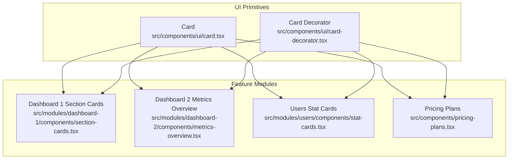
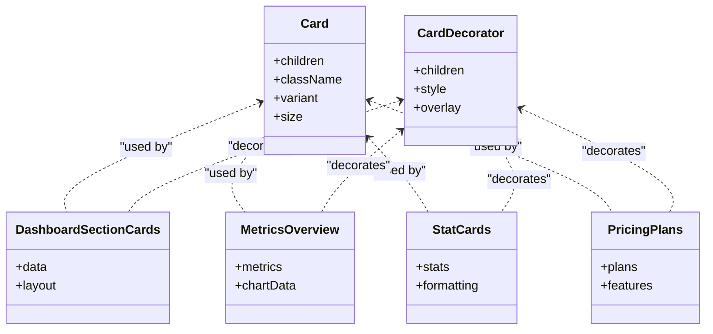
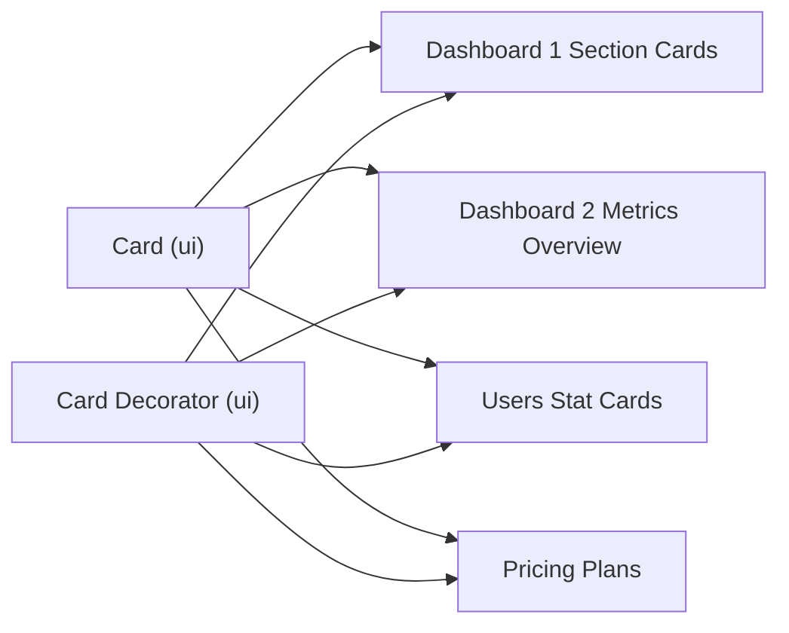

# Card Component

<cite>
**Referenced Files in This Document**
- [card.tsx](file://src/components/ui/card.tsx)
- [card-decorator.tsx](file://src/components/ui/card-decorator.tsx)
- [section-cards.tsx](file://src/modules/dashboard-1/components/section-cards.tsx)
- [metrics-overview.tsx](file://src/modules/dashboard-2/components/metrics-overview.tsx)
- [stat-cards.tsx](file://src/modules/users/components/stat-cards.tsx)
- [pricing-plans.tsx](file://src/components/pricing-plans.tsx)
</cite>

## Table of Contents
1. [Introduction](#introduction)
2. [Project Structure](#project-structure)
3. [Core Components](#core-components)
4. [Architecture Overview](#architecture-overview)
5. [Detailed Component Analysis](#detailed-component-analysis)
6. [Dependency Analysis](#dependency-analysis)
7. [Performance Considerations](#performance-considerations)
8. [Troubleshooting Guide](#troubleshooting-guide)
9. [Conclusion](#conclusion)
10. [Appendices](#appendices)

## Introduction
This document provides comprehensive documentation for the Card component system, including basic card structure, decorators, and layout variations. It explains composition patterns, content organization, styling customization options, and accessibility considerations. Practical examples include dashboard cards, profile cards, and interactive cards with hover effects. Responsive design guidance is included to ensure consistent behavior across devices.

## Project Structure
The Card system is implemented as a small set of reusable UI primitives and is consumed by feature modules (dashboards, users, pricing). The core files are located under the shared UI layer and are composed into higher-level components within module directories.

**Diagram sources**
- [card.tsx](file://src/components/ui/card.tsx)
- [card-decorator.tsx](file://src/components/ui/card-decorator.tsx)
- [section-cards.tsx](file://src/modules/dashboard-1/components/section-cards.tsx)
- [metrics-overview.tsx](file://src/modules/dashboard-2/components/metrics-overview.tsx)
- [stat-cards.tsx](file://src/modules/users/components/stat-cards.tsx)
- [pricing-plans.tsx](file://src/components/pricing-plans.tsx)

**Section sources**
- [card.tsx](file://src/components/ui/card.tsx)
- [card-decorator.tsx](file://src/components/ui/card-decorator.tsx)
- [section-cards.tsx](file://src/modules/dashboard-1/components/section-cards.tsx)
- [metrics-overview.tsx](file://src/modules/dashboard-2/components/metrics-overview.tsx)
- [stat-cards.tsx](file://src/modules/users/components/stat-cards.tsx)
- [pricing-plans.tsx](file://src/components/pricing-plans.tsx)

## Core Components
- Card: A foundational container that groups related content and actions. It provides a consistent surface for titles, descriptions, media, and footers.
- Card Decorator: An optional wrapper or overlay used to add visual decorations (e.g., borders, gradients, badges) around or inside the card without changing its internal structure.

Key responsibilities:
- Provide semantic grouping and accessible landmarks when combined with appropriate roles and labels.
- Offer predictable spacing and typography through consistent class usage.
- Support composable children so features can extend behavior via decorators or custom wrappers.

Usage patterns:
- Basic card: title + description + footer
- Media card: image or chart area + caption
- Interactive card: clickable surface with hover states and focus management
- Decorated card: decorative overlays applied via decorator

**Section sources**
- [card.tsx](file://src/components/ui/card.tsx)
- [card-decorator.tsx](file://src/components/ui/card-decorator.tsx)

## Architecture Overview
The Card system follows a layered architecture:
- Base primitives (Card, Card Decorator) live in the shared UI layer.
- Feature modules compose these primitives into domain-specific cards (dashboard metrics, user stats, pricing plans).
- Styling is centralized via utility classes and theme tokens, enabling consistent appearance and easy customization.

**Diagram sources**
- [card.tsx](file://src/components/ui/card.tsx)
- [card-decorator.tsx](file://src/components/ui/card-decorator.tsx)
- [section-cards.tsx](file://src/modules/dashboard-1/components/section-cards.tsx)
- [metrics-overview.tsx](file://src/modules/dashboard-2/components/metrics-overview.tsx)
- [stat-cards.tsx](file://src/modules/users/components/stat-cards.tsx)
- [pricing-plans.tsx](file://src/components/pricing-plans.tsx)

## Detailed Component Analysis

### Card Primitive
Purpose:
- Provides a consistent container for grouped content.
- Establishes baseline styles for padding, border radius, background, and shadow.
- Supports variants and sizes to adapt to different contexts (compact, spacious, elevated).

Composition:
- Accepts any children; typical sections include header, body, media, and footer.
- Can be wrapped by CardDecorator to apply visual enhancements.

Accessibility:
- Use semantic headings inside the card for hierarchy.
- Ensure interactive elements inside the card are keyboard navigable and have visible focus indicators.
- If the entire card is clickable, consider making it a button-like element with proper role and aria attributes at the application level.

Styling customization:
- Override via className props or theme tokens.
- Prefer utility classes for spacing, color, and typography to maintain consistency.

**Section sources**
- [card.tsx](file://src/components/ui/card.tsx)

### Card Decorator
Purpose:
- Adds non-invasive visual decorations such as borders, gradients, shadows, or overlays.
- Keeps the base Card clean while allowing flexible presentation layers.

Common uses:
- Highlighted cards for primary actions or featured items.
- Status indicators using colored borders or corner accents.
- Hover effects that enhance interactivity cues.

Integration:
- Wrap a Card or specific sections of a Card to scope decoration.
- Combine with variant props on the Card to avoid style conflicts.

**Section sources**
- [card-decorator.tsx](file://src/components/ui/card-decorator.tsx)

### Dashboard Cards (Metrics and Section Cards)
Patterns:
- Metric cards display key numbers with labels and contextual icons or mini-charts.
- Section cards group related data points and may include charts or tables.

Layout variations:
- Grid-based layouts with responsive columns.
- Stacked layout on narrow screens.

Interactivity:
- Hover elevation or subtle scale to indicate clickability.
- Focus-visible outlines for keyboard navigation.

Examples in codebase:
- Dashboard section cards composing multiple metric cards.
- Metrics overview presenting high-level KPIs with supporting visuals.

**Section sources**
- [section-cards.tsx](file://src/modules/dashboard-1/components/section-cards.tsx)
- [metrics-overview.tsx](file://src/modules/dashboard-2/components/metrics-overview.tsx)

### Profile and User Stat Cards
Patterns:
- Compact stat cards summarizing counts or statuses.
- Profile-style cards combining avatar, name, and quick actions.

Content organization:
- Header with avatar and name.
- Body with summary stats or short descriptions.
- Footer with actions (edit, view details).

Accessibility:
- Use descriptive alt text for avatars.
- Ensure action buttons have clear labels and keyboard support.

**Section sources**
- [stat-cards.tsx](file://src/modules/users/components/stat-cards.tsx)

### Pricing Plan Cards
Patterns:
- Three-column plan comparison with highlighted recommended plan.
- Feature lists with checkmarks and call-to-action buttons.

Hover effects:
- Elevated shadow and border accent on hover.
- Clear focus state for keyboard users.

Responsive behavior:
- Stack vertically on small screens.
- Maintain equal heights within rows for readability.

**Section sources**
- [pricing-plans.tsx](file://src/components/pricing-plans.tsx)

### Interactive Cards with Hover Effects
Behavior:
- Visual feedback via shadow, border color, or slight transform.
- Smooth transitions for better perceived performance.

Implementation tips:
- Apply hover styles at the card wrapper or decorator layer.
- Ensure sufficient contrast for hover states.
- Preserve focus styles for keyboard users.

**Section sources**
- [card-decorator.tsx](file://src/components/ui/card-decorator.tsx)
- [pricing-plans.tsx](file://src/components/pricing-plans.tsx)

### Content Organization Patterns
Recommended structure:
- Title: concise and descriptive.
- Description: brief context or summary.
- Media: images, charts, or illustrations where relevant.
- Actions: primary and secondary actions placed consistently.
- Footer: metadata, timestamps, or additional links.

Guidelines:
- Limit content density; use whitespace effectively.
- Group related actions together.
- Keep important information above the fold within the card.

[No sources needed since this section doesn't analyze specific files]

### Styling Customization Options
Approaches:
- Theme tokens for colors, spacing, and typography.
- Utility-first classes for quick overrides.
- Variant props for predefined looks (e.g., outlined, filled, elevated).

Best practices:
- Avoid inline styles; prefer theme-aware classes.
- Centralize brand colors and spacing scales.
- Test both light and dark themes.

[No sources needed since this section doesn't analyze specific files]

### Responsive Design Considerations
Strategies:
- Use grid systems with breakpoints to switch from multi-column to single-column layouts.
- Scale typography and spacing proportionally.
- Ensure touch targets meet minimum size guidelines.

Practical tips:
- Collapse dense content into collapsible sections if necessary.
- Prioritize critical metrics and actions on small screens.

[No sources needed since this section doesn't analyze specific files]

### Accessibility Features
Recommendations:
- Semantic headings and landmarks inside cards.
- Keyboard navigation with visible focus indicators.
- Sufficient color contrast for text and interactive elements.
- Descriptive labels for icons and images.
- For clickable cards, ensure the entire surface is reachable via keyboard and screen readers.

[No sources needed since this section doesn't analyze specific files]

## Dependency Analysis
The Card primitive and decorator are consumed by multiple feature modules. This creates a low-coupling, high-cohesion design where changes to the base components propagate consistently across dashboards and feature pages.

**Diagram sources**
- [card.tsx](file://src/components/ui/card.tsx)
- [card-decorator.tsx](file://src/components/ui/card-decorator.tsx)
- [section-cards.tsx](file://src/modules/dashboard-1/components/section-cards.tsx)
- [metrics-overview.tsx](file://src/modules/dashboard-2/components/metrics-overview.tsx)
- [stat-cards.tsx](file://src/modules/users/components/stat-cards.tsx)
- [pricing-plans.tsx](file://src/components/pricing-plans.tsx)

**Section sources**
- [card.tsx](file://src/components/ui/card.tsx)
- [card-decorator.tsx](file://src/components/ui/card-decorator.tsx)
- [section-cards.tsx](file://src/modules/dashboard-1/components/section-cards.tsx)
- [metrics-overview.tsx](file://src/modules/dashboard-2/components/metrics-overview.tsx)
- [stat-cards.tsx](file://src/modules/users/components/stat-cards.tsx)
- [pricing-plans.tsx](file://src/components/pricing-plans.tsx)

## Performance Considerations
- Minimize re-renders by memoizing expensive card content when necessary.
- Prefer CSS transforms and opacity for hover animations to leverage GPU acceleration.
- Avoid heavy shadows or excessive blur filters on large grids of cards.
- Lazy-load images and charts within cards to improve initial load time.

[No sources needed since this section provides general guidance]

## Troubleshooting Guide
Common issues and resolutions:
- Inconsistent spacing: Verify that all cards use the same spacing tokens and avoid ad-hoc margins.
- Broken hover states: Ensure hover styles do not conflict with focus-visible styles.
- Accessibility failures: Check heading hierarchy, label clarity, and keyboard reachability.
- Layout shifts on small screens: Confirm responsive breakpoints and content prioritization.

[No sources needed since this section provides general guidance]

## Conclusion
The Card system provides a robust foundation for building consistent, accessible, and responsive interfaces. By composing the base Card with optional decorators and following established content organization patterns, teams can create varied card experiences—from dashboard metrics to pricing plans—while maintaining visual coherence and usability across devices.

[No sources needed since this section summarizes without analyzing specific files]

## Appendices

### Example Scenarios
- Dashboard metrics: Use compact metric cards with clear labels and values.
- Profile cards: Combine avatar, name, and quick actions with a clean layout.
- Interactive cards: Add hover elevation and focus outlines for discoverability.

[No sources needed since this section doesn't analyze specific files]