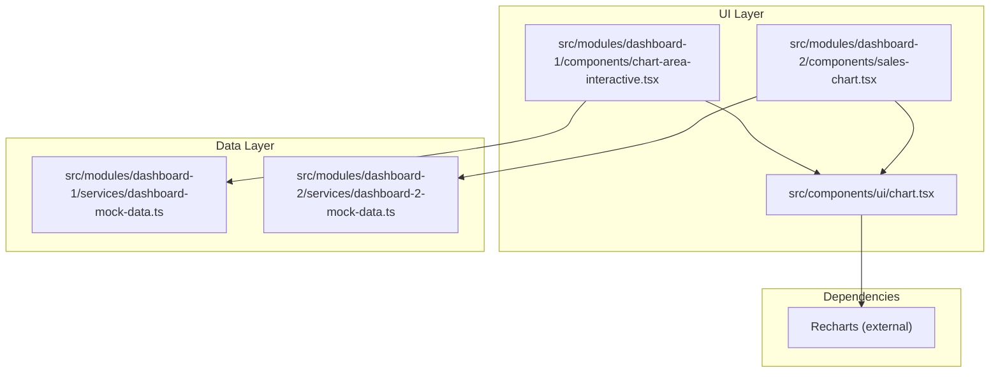
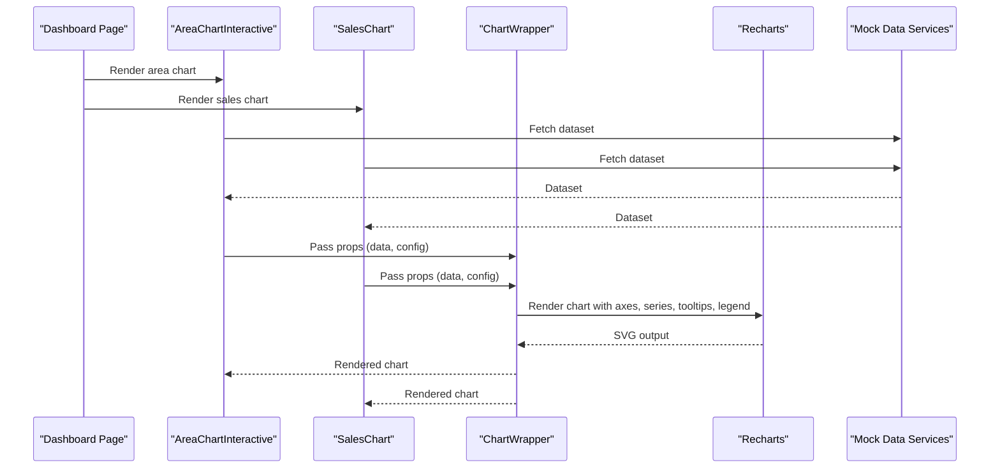
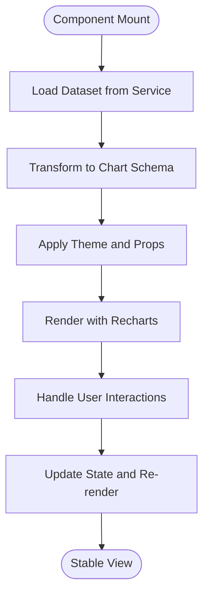
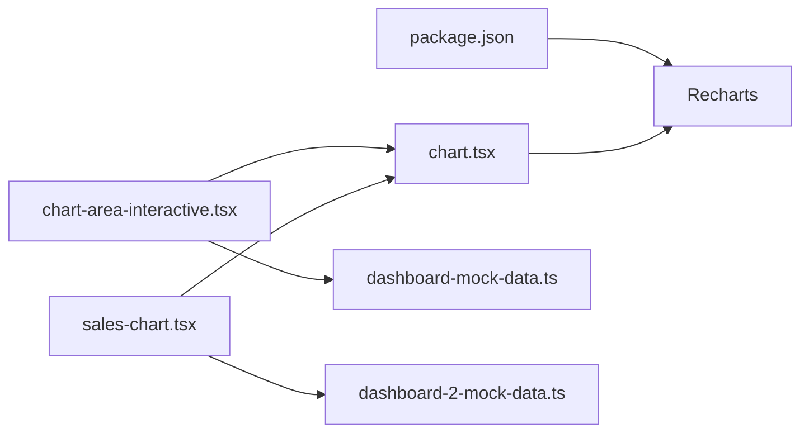

# Chart Component

<cite>
**Referenced Files in This Document**
- [chart.tsx](file://src/components/ui/chart.tsx)
- [chart-area-interactive.tsx](file://src/modules/dashboard-1/components/chart-area-interactive.tsx)
- [sales-chart.tsx](file://src/modules/dashboard-2/components/sales-chart.tsx)
- [dashboard-mock-data.ts](file://src/modules/dashboard-1/services/dashboard-mock-data.ts)
- [dashboard-2-mock-data.ts](file://src/modules/dashboard-2/services/dashboard-2-mock-data.ts)
- [package.json](file://package.json)
</cite>

## Table of Contents
1. [Introduction](#introduction)
2. [Project Structure](#project-structure)
3. [Core Components](#core-components)
4. [Architecture Overview](#architecture-overview)
5. [Detailed Component Analysis](#detailed-component-analysis)
6. [Dependency Analysis](#dependency-analysis)
7. [Performance Considerations](#performance-considerations)
8. [Troubleshooting Guide](#troubleshooting-guide)
9. [Conclusion](#conclusion)

## Introduction
This document provides comprehensive documentation for the Chart component built on Recharts within the project. It covers chart types, data binding patterns, customization options, and interactive features. It also includes examples of area charts, bar charts, line charts, and custom configurations, along with guidance on responsive behavior, animations, performance optimization for large datasets, theming, tooltips, legends, and export functionality.

## Project Structure
The charting implementation is centered around a reusable UI chart wrapper and several dashboard-specific chart components that demonstrate different chart types and usage patterns.

**Diagram sources**
- [chart.tsx](file://src/components/ui/chart.tsx)
- [chart-area-interactive.tsx](file://src/modules/dashboard-1/components/chart-area-interactive.tsx)
- [sales-chart.tsx](file://src/modules/dashboard-2/components/sales-chart.tsx)
- [dashboard-mock-data.ts](file://src/modules/dashboard-1/services/dashboard-mock-data.ts)
- [dashboard-2-mock-data.ts](file://src/modules/dashboard-2/services/dashboard-2-mock-data.ts)

**Section sources**
- [chart.tsx](file://src/components/ui/chart.tsx)
- [chart-area-interactive.tsx](file://src/modules/dashboard-1/components/chart-area-interactive.tsx)
- [sales-chart.tsx](file://src/modules/dashboard-2/components/sales-chart.tsx)
- [dashboard-mock-data.ts](file://src/modules/dashboard-1/services/dashboard-mock-data.ts)
- [dashboard-2-mock-data.ts](file://src/modules/dashboard-2/services/dashboard-2-mock-data.ts)

## Core Components
- Reusable Chart Wrapper: A shared UI component that encapsulates common chart configuration, styling, and behavior to ensure consistency across dashboards.
- Area Chart Example: An interactive area chart demonstrating dynamic data updates, hover interactions, and responsive sizing.
- Sales Chart Example: A composite chart showcasing multiple series, legends, tooltips, and animation settings.

Key responsibilities:
- Data binding: Accepts structured datasets and maps fields to chart axes and series.
- Customization: Provides props for colors, labels, grid lines, axis formatting, and tooltip/legend rendering.
- Interactivity: Supports hover states, selection, and optional click handlers.
- Responsiveness: Adapts to container size changes using standard Recharts responsive primitives.

**Section sources**
- [chart.tsx](file://src/components/ui/chart.tsx)
- [chart-area-interactive.tsx](file://src/modules/dashboard-1/components/chart-area-interactive.tsx)
- [sales-chart.tsx](file://src/modules/dashboard-2/components/sales-chart.tsx)

## Architecture Overview
The chart architecture follows a layered approach:
- Presentation layer: Dashboard components compose the reusable chart wrapper.
- Data layer: Mock services provide typed datasets consumed by chart components.
- Rendering layer: Recharts renders SVG-based charts with configurable axes, series, and interactive elements.

**Diagram sources**
- [chart-area-interactive.tsx](file://src/modules/dashboard-1/components/chart-area-interactive.tsx)
- [sales-chart.tsx](file://src/modules/dashboard-2/components/sales-chart.tsx)
- [chart.tsx](file://src/components/ui/chart.tsx)
- [dashboard-mock-data.ts](file://src/modules/dashboard-1/services/dashboard-mock-data.ts)
- [dashboard-2-mock-data.ts](file://src/modules/dashboard-2/services/dashboard-2-mock-data.ts)

## Detailed Component Analysis

### Reusable Chart Wrapper
Responsibilities:
- Centralizes chart configuration such as dimensions, theme tokens, and default behaviors.
- Normalizes data shapes into Recharts-compatible structures.
- Exposes consistent props for tooltips, legends, animations, and interactivity.

Typical usage pattern:
- Import the wrapper and pass a dataset and configuration object.
- Configure axes, series, and visual styles via props.
- Enable or disable tooltips and legends based on context.

Customization options commonly exposed:
- Colors and palette mapping for series.
- Axis label formatting and tick counts.
- Tooltip content templates and trigger modes.
- Legend position and item click behavior.
- Animation duration and easing.

Responsive behavior:
- Uses responsive containers and adapts width/height based on parent layout.
- Recomputes scales when container size changes.

Animation settings:
- Configurable entry animations for bars, lines, and areas.
- Optional transition effects for hover states.

Export functionality:
- Provides an option to capture the rendered chart as an image or SVG for download.

Theming:
- Integrates with project theme tokens for consistent colors and typography.

**Section sources**
- [chart.tsx](file://src/components/ui/chart.tsx)

### Interactive Area Chart
Features:
- Demonstrates smooth area rendering with hover highlights.
- Shows dynamic data updates and transitions.
- Includes tooltips and legend toggles.

Data binding:
- Maps time-series or categorical data to X-axis and Y-axis values.
- Supports multiple series with distinct color palettes.

Interactivity:
- Hover crosshair and value display.
- Click-to-toggle series visibility via legend.

Responsive design:
- Scales gracefully across breakpoints.

Example references:
- See the area chart component file for prop usage and configuration.

**Section sources**
- [chart-area-interactive.tsx](file://src/modules/dashboard-1/components/chart-area-interactive.tsx)
- [dashboard-mock-data.ts](file://src/modules/dashboard-1/services/dashboard-mock-data.ts)

### Sales Chart (Composite)
Features:
- Combines multiple chart types (e.g., bar and line) to compare metrics.
- Rich tooltips with formatted values and contextual information.
- Animated transitions for data changes.

Data binding:
- Aggregates and transforms raw datasets into series-ready formats.
- Handles missing data points and null values gracefully.

Legend and tooltips:
- Custom legend items with icons and status indicators.
- Tooltip templates showing aggregated summaries.

Animations:
- Staggered entry animations for better visual clarity.

Example references:
- See the sales chart component file for composite configuration.

**Section sources**
- [sales-chart.tsx](file://src/modules/dashboard-2/components/sales-chart.tsx)
- [dashboard-2-mock-data.ts](file://src/modules/dashboard-2/services/dashboard-2-mock-data.ts)

### Conceptual Overview
The following conceptual diagram illustrates how data flows from mock services through chart components to the Recharts renderer.

[No sources needed since this diagram shows conceptual workflow, not actual code structure]

## Dependency Analysis
External dependencies:
- Recharts: Primary charting library providing axes, series, tooltips, legends, and animations.

Internal dependencies:
- Chart wrapper depends on Recharts.
- Dashboard chart components depend on the wrapper and mock data services.

**Diagram sources**
- [package.json](file://package.json)
- [chart.tsx](file://src/components/ui/chart.tsx)
- [chart-area-interactive.tsx](file://src/modules/dashboard-1/components/chart-area-interactive.tsx)
- [sales-chart.tsx](file://src/modules/dashboard-2/components/sales-chart.tsx)
- [dashboard-mock-data.ts](file://src/modules/dashboard-1/services/dashboard-mock-data.ts)
- [dashboard-2-mock-data.ts](file://src/modules/dashboard-2/services/dashboard-2-mock-data.ts)

**Section sources**
- [package.json](file://package.json)
- [chart.tsx](file://src/components/ui/chart.tsx)
- [chart-area-interactive.tsx](file://src/modules/dashboard-1/components/chart-area-interactive.tsx)
- [sales-chart.tsx](file://src/modules/dashboard-2/components/sales-chart.tsx)
- [dashboard-mock-data.ts](file://src/modules/dashboard-1/services/dashboard-mock-data.ts)
- [dashboard-2-mock-data.ts](file://src/modules/dashboard-2/services/dashboard-2-mock-data.ts)

## Performance Considerations
- Data volume: For large datasets, consider sampling or aggregating data before rendering to reduce DOM nodes.
- Memoization: Memoize derived datasets and configuration objects to avoid unnecessary re-renders.
- Animations: Disable or shorten animations when dealing with frequent updates or large series.
- Responsive recomputation: Debounce resize handlers if integrating with custom responsive logic.
- Tooltip complexity: Simplify tooltip content and avoid heavy computations inside tooltip renderers.
- Series count: Limit visible series; use legend toggles to hide inactive series.
- Export operations: Perform exports asynchronously and show loading feedback to keep the UI responsive.

[No sources needed since this section provides general guidance]

## Troubleshooting Guide
Common issues and resolutions:
- Missing data fields: Ensure datasets conform to the expected schema used by the wrapper; add fallbacks for null values.
- Axis misalignment: Verify domain and type settings for axes; adjust ticks and labels for readability.
- Tooltip overlap: Customize tooltip positioning and limit displayed fields to prevent clutter.
- Legend conflicts: Adjust legend placement and item spacing to avoid overlapping with chart content.
- Animation stutter: Reduce animation duration or disable animations for high-frequency updates.
- Export failures: Validate canvas/SVG availability and handle errors gracefully with user feedback.

**Section sources**
- [chart.tsx](file://src/components/ui/chart.tsx)
- [chart-area-interactive.tsx](file://src/modules/dashboard-1/components/chart-area-interactive.tsx)
- [sales-chart.tsx](file://src/modules/dashboard-2/components/sales-chart.tsx)

## Conclusion
The Chart component system leverages a reusable wrapper and specialized dashboard components to deliver consistent, customizable, and interactive visualizations powered by Recharts. By adhering to the documented data binding patterns, customization options, and performance best practices, teams can build scalable charts that remain responsive, accessible, and performant across diverse datasets and screen sizes.