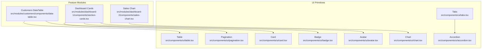
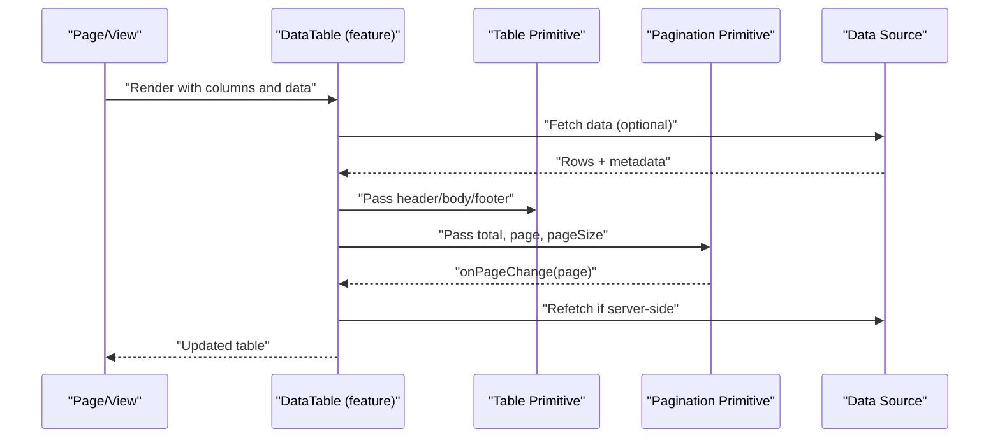
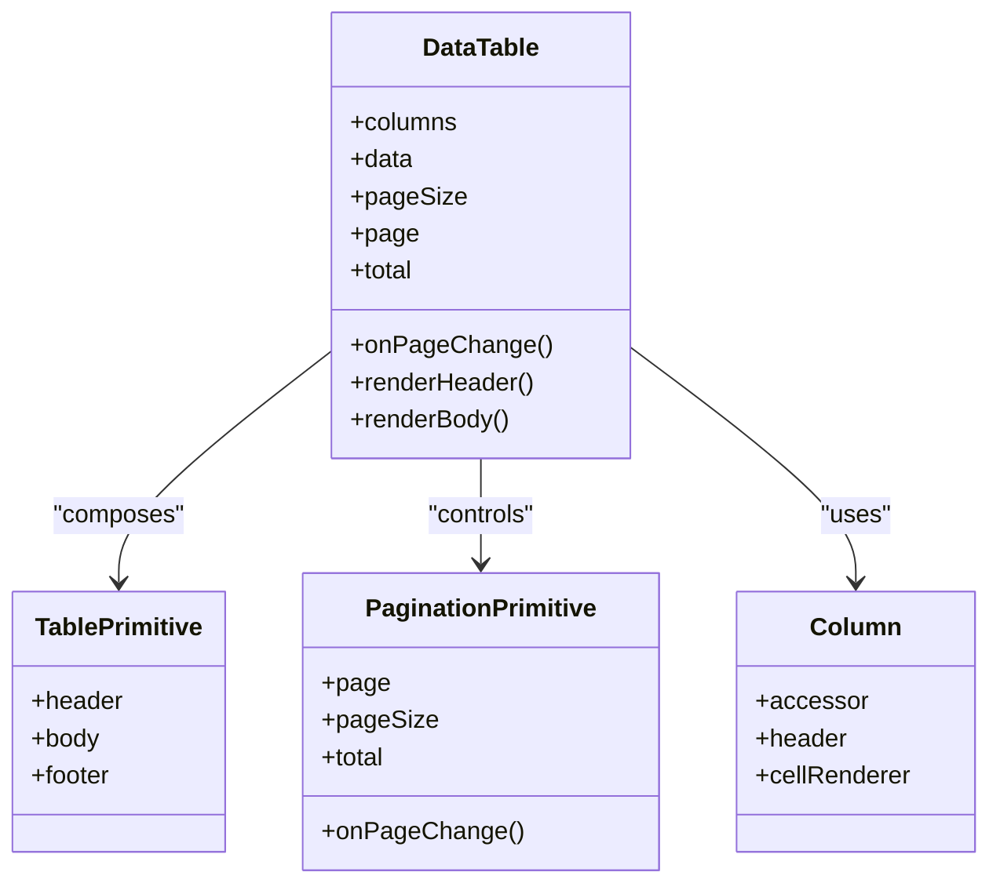
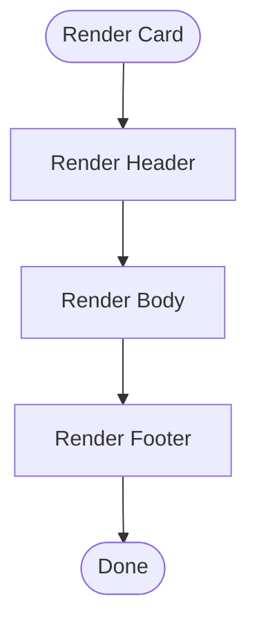
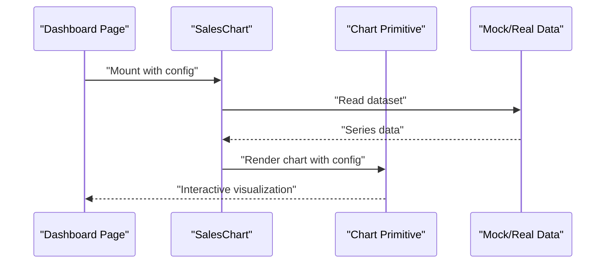
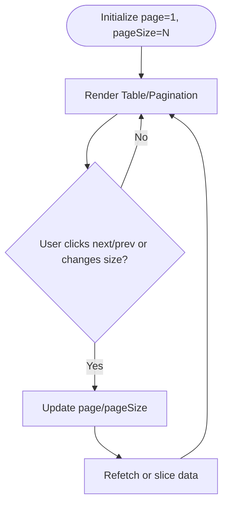
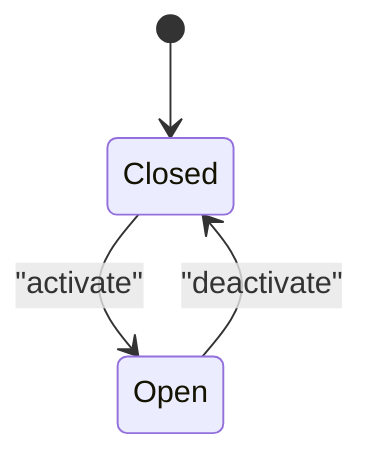
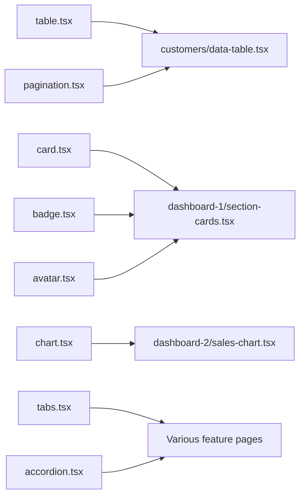

# Data Display Components

<cite>
**Referenced Files in This Document**
- [table.tsx](file://src/components/ui/table.tsx)
- [card.tsx](file://src/components/ui/card.tsx)
- [badge.tsx](file://src/components/ui/badge.tsx)
- [avatar.tsx](file://src/components/ui/avatar.tsx)
- [chart.tsx](file://src/components/ui/chart.tsx)
- [pagination.tsx](file://src/components/ui/pagination.tsx)
- [tabs.tsx](file://src/components/ui/tabs.tsx)
- [accordion.tsx](file://src/components/ui/accordion.tsx)
- [data-table.tsx](file://src/modules/customers/components/data-table.tsx)
- [columns.tsx](file://src/modules/customers/components/columns.tsx)
- [data-table-pagination.tsx](file://src/modules/customers/components/data-table-pagination.tsx)
- [sales-chart.tsx](file://src/modules/dashboard-2/components/sales-chart.tsx)
- [section-cards.tsx](file://src/modules/dashboard-1/components/section-cards.tsx)
</cite>

## Table of Contents
1. [Introduction](#introduction)
2. [Project Structure](#project-structure)
3. [Core Components](#core-components)
4. [Architecture Overview](#architecture-overview)
5. [Detailed Component Analysis](#detailed-component-analysis)
6. [Dependency Analysis](#dependency-analysis)
7. [Performance Considerations](#performance-considerations)
8. [Troubleshooting Guide](#troubleshooting-guide)
9. [Conclusion](#conclusion)
10. [Appendices](#appendices)

## Introduction
This document provides comprehensive documentation for data display components: Table, Card, Badge, Avatar, Chart, Pagination, Tabs, and Accordion. It covers component APIs, data binding patterns, customization options, performance considerations, complex data presentation examples, responsive table implementations, chart configurations, accessibility compliance, and internationalization support. The guidance is grounded in the repository’s UI primitives and their usage across modules such as Customers, Dashboard, and Tasks.

## Project Structure
The data display components are implemented under src/components/ui and consumed by feature modules (e.g., customers, dashboard-1, dashboard-2). Feature-level wrappers compose these primitives to provide rich data experiences like sortable/filterable tables, paginated lists, charts, and grouped content.

**Diagram sources**
- [table.tsx](file://src/components/ui/table.tsx)
- [card.tsx](file://src/components/ui/card.tsx)
- [badge.tsx](file://src/components/ui/badge.tsx)
- [avatar.tsx](file://src/components/ui/avatar.tsx)
- [chart.tsx](file://src/components/ui/chart.tsx)
- [pagination.tsx](file://src/components/ui/pagination.tsx)
- [tabs.tsx](file://src/components/ui/tabs.tsx)
- [accordion.tsx](file://src/components/ui/accordion.tsx)
- [data-table.tsx](file://src/modules/customers/components/data-table.tsx)
- [section-cards.tsx](file://src/modules/dashboard-1/components/section-cards.tsx)
- [sales-chart.tsx](file://src/modules/dashboard-2/components/sales-chart.tsx)

**Section sources**
- [table.tsx](file://src/components/ui/table.tsx)
- [card.tsx](file://src/components/ui/card.tsx)
- [badge.tsx](file://src/components/ui/badge.tsx)
- [avatar.tsx](file://src/components/ui/avatar.tsx)
- [chart.tsx](file://src/components/ui/chart.tsx)
- [pagination.tsx](file://src/components/ui/pagination.tsx)
- [tabs.tsx](file://src/components/ui/tabs.tsx)
- [accordion.tsx](file://src/components/ui/accordion.tsx)
- [data-table.tsx](file://src/modules/customers/components/data-table.tsx)
- [section-cards.tsx](file://src/modules/dashboard-1/components/section-cards.tsx)
- [sales-chart.tsx](file://src/modules/dashboard-2/components/sales-chart.tsx)

## Core Components
Below is a concise overview of each primitive’s purpose and typical usage patterns. For detailed props and behavior, see the referenced files.

- Table
  - Purpose: Semantic HTML-based table with header/body/footer composition.
  - Typical usage: Build feature-specific data tables (sorting, filtering, pagination) by composing this primitive with columns and row renderers.
  - Key aspects: Accessible structure, flexible cell rendering, easy integration with column definitions.
  - Section sources
    - [table.tsx](file://src/components/ui/table.tsx)

- Card
  - Purpose: Container for grouping related content and actions.
  - Typical usage: Dashboard metrics, profile cards, or any bounded content block.
  - Key aspects: Composable sections (header, body, footer), consistent spacing and elevation.
  - Section sources
    - [card.tsx](file://src/components/ui/card.tsx)

- Badge
  - Purpose: Small status or count indicator.
  - Typical usage: Labels like “New”, counts, severity indicators.
  - Key aspects: Variants and sizes; pairs well with rows and list items.
  - Section sources
    - [badge.tsx](file://src/components/ui/badge.tsx)

- Avatar
  - Purpose: User or entity representation with image fallback.
  - Typical usage: Rows, headers, comments, chat participants.
  - Key aspects: Fallback text, sizing variants, optional initials.
  - Section sources
    - [avatar.tsx](file://src/components/ui/avatar.tsx)

- Chart
  - Purpose: Declarative charting primitive for visualizing data.
  - Typical usage: KPI trends, breakdowns, comparisons.
  - Key aspects: Configurable series, axes, tooltips, legends; integrates with module-specific chart pages.
  - Section sources
    - [chart.tsx](file://src/components/ui/chart.tsx)

- Pagination
  - Purpose: Navigation between pages of data.
  - Typical usage: Lists, tables, search results.
  - Key aspects: Page size control, page change callbacks, keyboard navigation.
  - Section sources
    - [pagination.tsx](file://src/components/ui/pagination.tsx)

- Tabs
  - Purpose: Organize content into tabbed panels.
  - Typical usage: Settings pages, multi-view dashboards.
  - Key aspects: Keyboard focus management, controlled/uncontrolled modes.
  - Section sources
    - [tabs.tsx](file://src/components/ui/tabs.tsx)

- Accordion
  - Purpose: Expand/collapse sections of content.
  - Typical usage: FAQs, settings groups, detail summaries.
  - Key aspects: Single or multiple open panels, accessible headings.
  - Section sources
    - [accordion.tsx](file://src/components/ui/accordion.tsx)

## Architecture Overview
The system composes UI primitives into feature-rich displays. Tables combine with pagination and column definitions; dashboards combine cards, badges, avatars, and charts; tabs and accordions organize large content sets.

**Diagram sources**
- [data-table.tsx](file://src/modules/customers/components/data-table.tsx)
- [table.tsx](file://src/components/ui/table.tsx)
- [pagination.tsx](file://src/components/ui/pagination.tsx)

## Detailed Component Analysis

### Table and Data Table Patterns
- Composition model
  - Use the Table primitive to define semantic structure.
  - Feature-level DataTable composes columns, sorting, filtering, and pagination.
- Data binding
  - Columns define field accessors and formatters.
  - Rows are mapped from data arrays; cells can render custom components.
- Responsive behavior
  - Wrap the table in a scroll container on small screens.
  - Hide less important columns at smaller breakpoints.
- Accessibility
  - Provide captions, scope attributes on headers, and aria-sort where applicable.
- Internationalization
  - Localize labels, date/time formats, and number formatting via utilities.

**Diagram sources**
- [data-table.tsx](file://src/modules/customers/components/data-table.tsx)
- [table.tsx](file://src/components/ui/table.tsx)
- [pagination.tsx](file://src/components/ui/pagination.tsx)
- [columns.tsx](file://src/modules/customers/components/columns.tsx)

**Section sources**
- [data-table.tsx](file://src/modules/customers/components/data-table.tsx)
- [table.tsx](file://src/components/ui/table.tsx)
- [pagination.tsx](file://src/components/ui/pagination.tsx)
- [columns.tsx](file://src/modules/customers/components/columns.tsx)

### Card, Badge, and Avatar
- Card
  - Group related information; use header/body/footer slots.
  - Combine with skeleton loaders during async fetches.
- Badge
  - Use semantic variants for status (success, warning, error).
  - Pair with counts and tags.
- Avatar
  - Provide alt text and fallback initials.
  - Size variants for dense layouts.

[No sources needed since this diagram shows conceptual workflow, not actual code structure]

**Section sources**
- [card.tsx](file://src/components/ui/card.tsx)
- [badge.tsx](file://src/components/ui/badge.tsx)
- [avatar.tsx](file://src/components/ui/avatar.tsx)
- [section-cards.tsx](file://src/modules/dashboard-1/components/section-cards.tsx)

### Chart Configuration
- Declarative configuration
  - Define datasets, axes, colors, and tooltips.
  - Switch between chart types as needed.
- Interactivity
  - Tooltips, legends, and crosshairs improve readability.
- Performance
  - Memoize series data; avoid re-renders by stabilizing config objects.
  - Use virtualization for very large datasets when applicable.

**Diagram sources**
- [sales-chart.tsx](file://src/modules/dashboard-2/components/sales-chart.tsx)
- [chart.tsx](file://src/components/ui/chart.tsx)

**Section sources**
- [chart.tsx](file://src/components/ui/chart.tsx)
- [sales-chart.tsx](file://src/modules/dashboard-2/components/sales-chart.tsx)

### Pagination Integration
- Controlled state
  - Manage current page and page size at the parent level.
- Server-side vs client-side
  - Client-side: slice local data.
  - Server-side: trigger refetch on page/pageSize changes.
- Accessibility
  - Ensure buttons have descriptive labels and keyboard support.

**Diagram sources**
- [pagination.tsx](file://src/components/ui/pagination.tsx)
- [data-table-pagination.tsx](file://src/modules/customers/components/data-table-pagination.tsx)

**Section sources**
- [pagination.tsx](file://src/components/ui/pagination.tsx)
- [data-table-pagination.tsx](file://src/modules/customers/components/data-table-pagination.tsx)

### Tabs and Accordion
- Tabs
  - Use for mutually exclusive views within a page.
  - Maintain focus and announce active tab to assistive tech.
- Accordion
  - Use for progressive disclosure and scannable content.
  - Support single or multiple open panels based on UX needs.

[No sources needed since this diagram shows conceptual workflow, not actual code structure]

**Section sources**
- [tabs.tsx](file://src/components/ui/tabs.tsx)
- [accordion.tsx](file://src/components/ui/accordion.tsx)

## Dependency Analysis
- UI primitives are low-coupling building blocks used across modules.
- Feature modules depend on primitives but encapsulate business logic (sorting, filtering, data fetching).
- Charts depend on data services; keep data shape stable to minimize re-renders.

**Diagram sources**
- [table.tsx](file://src/components/ui/table.tsx)
- [pagination.tsx](file://src/components/ui/pagination.tsx)
- [card.tsx](file://src/components/ui/card.tsx)
- [badge.tsx](file://src/components/ui/badge.tsx)
- [avatar.tsx](file://src/components/ui/avatar.tsx)
- [chart.tsx](file://src/components/ui/chart.tsx)
- [tabs.tsx](file://src/components/ui/tabs.tsx)
- [accordion.tsx](file://src/components/ui/accordion.tsx)
- [data-table.tsx](file://src/modules/customers/components/data-table.tsx)
- [section-cards.tsx](file://src/modules/dashboard-1/components/section-cards.tsx)
- [sales-chart.tsx](file://src/modules/dashboard-2/components/sales-chart.tsx)

**Section sources**
- [table.tsx](file://src/components/ui/table.tsx)
- [pagination.tsx](file://src/components/ui/pagination.tsx)
- [card.tsx](file://src/components/ui/card.tsx)
- [badge.tsx](file://src/components/ui/badge.tsx)
- [avatar.tsx](file://src/components/ui/avatar.tsx)
- [chart.tsx](file://src/components/ui/chart.tsx)
- [tabs.tsx](file://src/components/ui/tabs.tsx)
- [accordion.tsx](file://src/components/ui/accordion.tsx)
- [data-table.tsx](file://src/modules/customers/components/data-table.tsx)
- [section-cards.tsx](file://src/modules/dashboard-1/components/section-cards.tsx)
- [sales-chart.tsx](file://src/modules/dashboard-2/components/sales-chart.tsx)

## Performance Considerations
- Tables
  - Virtualize long lists when possible.
  - Stabilize column definitions and cell renderers to prevent unnecessary re-renders.
  - Debounce input-driven filters/search.
- Charts
  - Memoize chart configuration and series data.
  - Avoid heavy computations inside render; precompute aggregates.
- Pagination
  - Prefer server-side pagination for large datasets.
  - Keep page size reasonable for mobile devices.
- Cards/Badges/Avatars
  - Lazy-load images and avatars.
  - Use skeleton placeholders during loading states.
- Tabs/Accordion
  - Defer rendering of inactive panels until activation.

[No sources needed since this section provides general guidance]

## Troubleshooting Guide
- Table issues
  - Misaligned columns: ensure consistent cell widths and proper header/body pairing.
  - Sorting not working: verify accessor functions and stable sort keys.
  - Pagination out of sync: confirm page/pageSize state updates trigger data refresh.
- Chart anomalies
  - Empty or flickering charts: stabilize config objects and memoize data.
  - Tooltip misplacement: check container dimensions and responsive resizing.
- Accessibility gaps
  - Missing labels: add aria-labels and roles where needed.
  - Keyboard traps: ensure focus moves logically through tabs/accordions.
- Internationalization problems
  - Incorrect formats: centralize locale-aware formatting for dates, numbers, and currencies.
  - Hardcoded strings: externalize all user-facing text.

[No sources needed since this section provides general guidance]

## Conclusion
These data display primitives provide a robust foundation for building accessible, performant, and localized interfaces. By composing them thoughtfully—especially in tables, charts, and grouped content—you can deliver high-quality user experiences across devices and locales.

[No sources needed since this section summarizes without analyzing specific files]

## Appendices

### Example Recipes

- Complex data presentation with Table + Pagination
  - Compose columns with custom cell renderers.
  - Integrate pagination for large datasets.
  - Add sorting and filtering at the top of the table.
  - Section sources
    - [data-table.tsx](file://src/modules/customers/components/data-table.tsx)
    - [columns.tsx](file://src/modules/customers/components/columns.tsx)
    - [data-table-pagination.tsx](file://src/modules/customers/components/data-table-pagination.tsx)
    - [table.tsx](file://src/components/ui/table.tsx)
    - [pagination.tsx](file://src/components/ui/pagination.tsx)

- Responsive table implementation
  - Wrap table in a horizontal scroll container on small screens.
  - Hide secondary columns below certain breakpoints.
  - Use sticky headers for better scanning.
  - Section sources
    - [table.tsx](file://src/components/ui/table.tsx)
    - [data-table.tsx](file://src/modules/customers/components/data-table.tsx)

- Chart configuration example
  - Define series, axes, and tooltip options.
  - Memoize configuration to avoid re-renders.
  - Section sources
    - [chart.tsx](file://src/components/ui/chart.tsx)
    - [sales-chart.tsx](file://src/modules/dashboard-2/components/sales-chart.tsx)

- Dashboard card layout
  - Combine Card, Badge, and Avatar for metric cards.
  - Section sources
    - [card.tsx](file://src/components/ui/card.tsx)
    - [badge.tsx](file://src/components/ui/badge.tsx)
    - [avatar.tsx](file://src/components/ui/avatar.tsx)
    - [section-cards.tsx](file://src/modules/dashboard-1/components/section-cards.tsx)

- Tabs and Accordion usage
  - Use Tabs for multi-view sections; Accordion for progressive disclosure.
  - Section sources
    - [tabs.tsx](file://src/components/ui/tabs.tsx)
    - [accordion.tsx](file://src/components/ui/accordion.tsx)