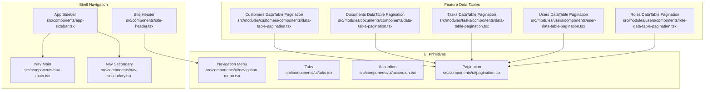
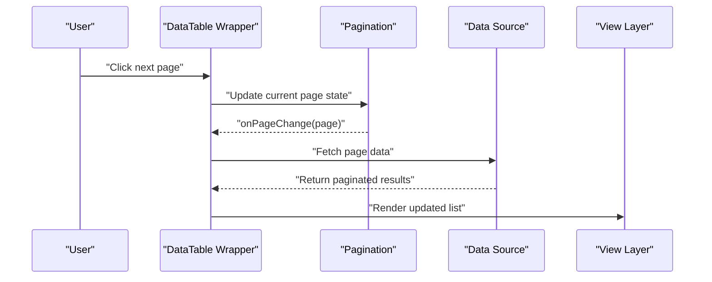
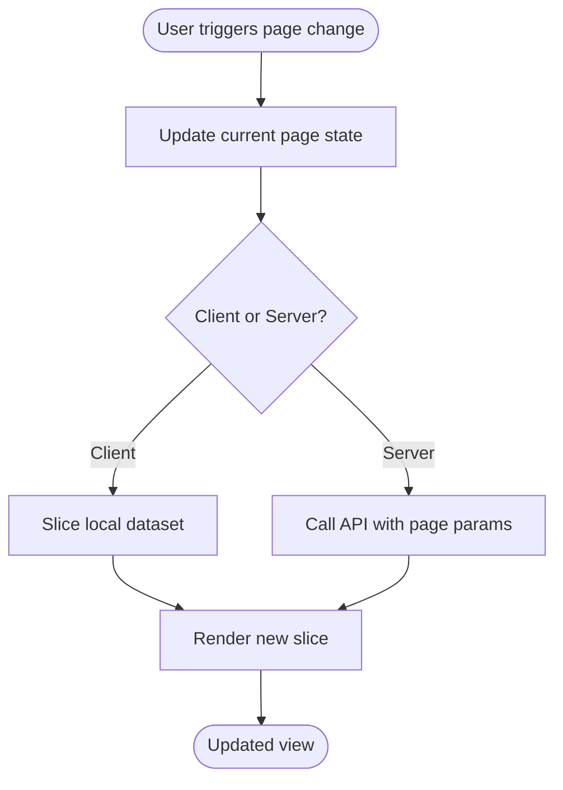
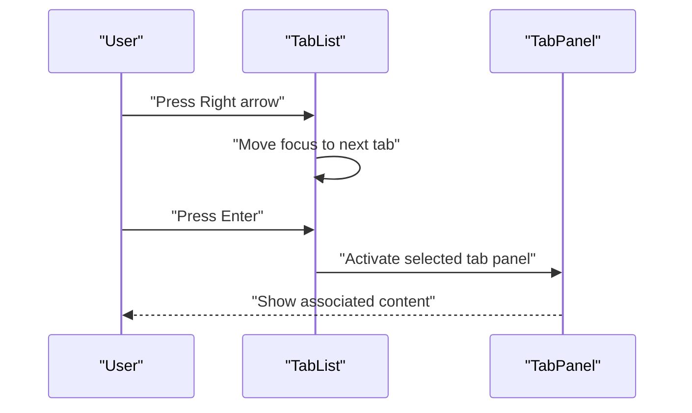
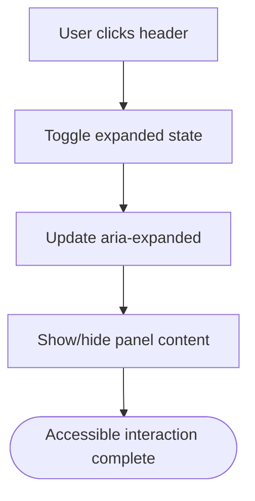
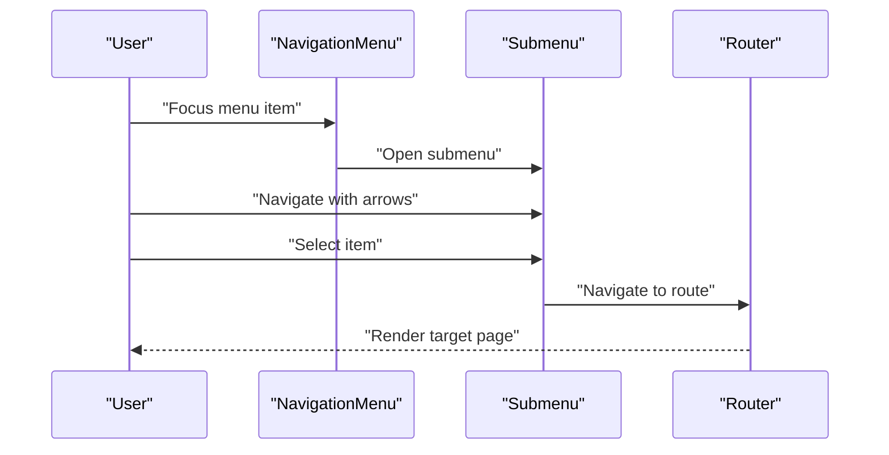
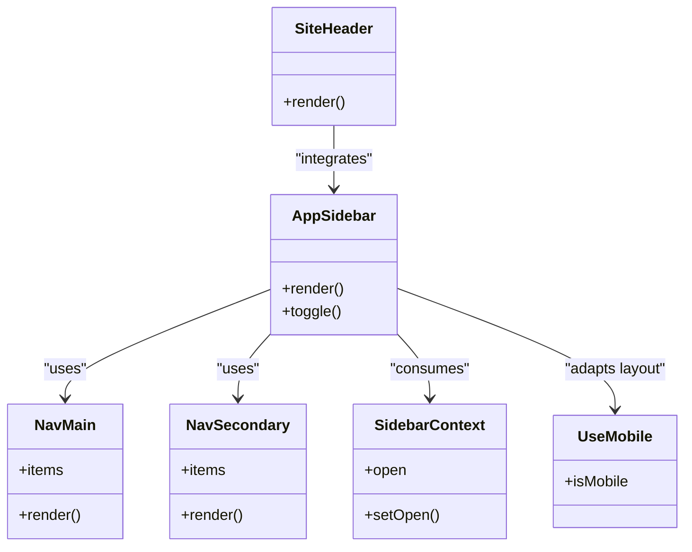
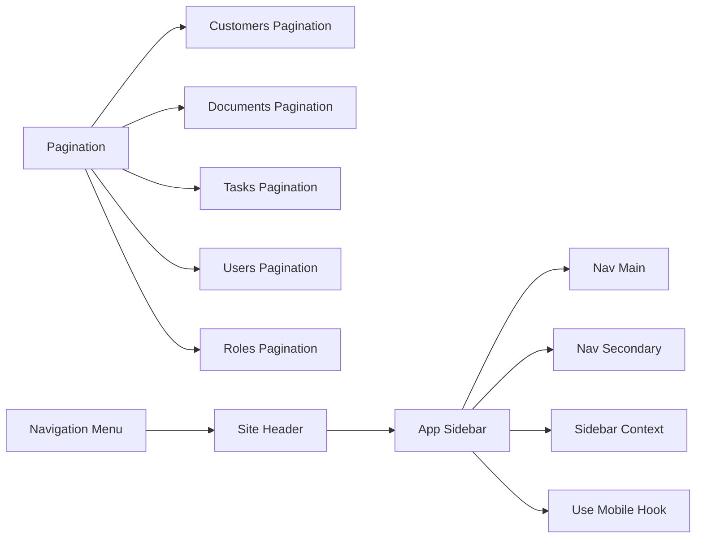

# Navigation Components

<cite>
**Referenced Files in This Document**
- [pagination.tsx](file://src/components/ui/pagination.tsx)
- [tabs.tsx](file://src/components/ui/tabs.tsx)
- [accordion.tsx](file://src/components/ui/accordion.tsx)
- [navigation-menu.tsx](file://src/components/ui/navigation-menu.tsx)
- [data-table-pagination.tsx](file://src/modules/customers/components/data-table-pagination.tsx)
- [data-table-pagination.tsx](file://src/modules/documents/components/data-table-pagination.tsx)
- [data-table-pagination.tsx](file://src/modules/tasks/components/data-table-pagination.tsx)
- [user-data-table-pagination.tsx](file://src/modules/users/components/user-data-table-pagination.tsx)
- [role-data-table-pagination.tsx](file://src/modules/users/components/role-data-table-pagination.tsx)
- [app-sidebar.tsx](file://src/components/app-sidebar.tsx)
- [nav-main.tsx](file://src/components/nav-main.tsx)
- [nav-secondary.tsx](file://src/components/nav-secondary.tsx)
- [site-header.tsx](file://src/components/site-header.tsx)
- [sidebar-context.tsx](file://src/contexts/sidebar-context.tsx)
- [use-mobile.ts](file://src/hooks/use-mobile.ts)
</cite>

## Table of Contents
1. [Introduction](#introduction)
2. [Project Structure](#project-structure)
3. [Core Components](#core-components)
4. [Architecture Overview](#architecture-overview)
5. [Detailed Component Analysis](#detailed-component-analysis)
6. [Dependency Analysis](#dependency-analysis)
7. [Performance Considerations](#performance-considerations)
8. [Troubleshooting Guide](#troubleshooting-guide)
9. [Conclusion](#conclusion)

## Introduction
This document provides comprehensive guidance for navigation-related components: Pagination, Tabs, Accordion, and Navigation Menu. It covers implementation strategies, keyboard navigation, accessibility considerations, and mobile responsiveness. It also includes examples of infinite scroll patterns, tab-based interfaces, collapsible content sections, and hierarchical navigation structures as implemented across the codebase.

## Project Structure
Navigation components are primarily located under src/components/ui and are consumed by feature modules (e.g., customers, documents, tasks, users). The application’s main navigation shell is composed of a sidebar and header that integrate with these UI primitives.

**Diagram sources**
- [pagination.tsx](file://src/components/ui/pagination.tsx)
- [tabs.tsx](file://src/components/ui/tabs.tsx)
- [accordion.tsx](file://src/components/ui/accordion.tsx)
- [navigation-menu.tsx](file://src/components/ui/navigation-menu.tsx)
- [data-table-pagination.tsx](file://src/modules/customers/components/data-table-pagination.tsx)
- [data-table-pagination.tsx](file://src/modules/documents/components/data-table-pagination.tsx)
- [data-table-pagination.tsx](file://src/modules/tasks/components/data-table-pagination.tsx)
- [user-data-table-pagination.tsx](file://src/modules/users/components/user-data-table-pagination.tsx)
- [role-data-table-pagination.tsx](file://src/modules/users/components/role-data-table-pagination.tsx)
- [app-sidebar.tsx](file://src/components/app-sidebar.tsx)
- [nav-main.tsx](file://src/components/nav-main.tsx)
- [nav-secondary.tsx](file://src/components/nav-secondary.tsx)
- [site-header.tsx](file://src/components/site-header.tsx)

**Section sources**
- [pagination.tsx](file://src/components/ui/pagination.tsx)
- [tabs.tsx](file://src/components/ui/tabs.tsx)
- [accordion.tsx](file://src/components/ui/accordion.tsx)
- [navigation-menu.tsx](file://src/components/ui/navigation-menu.tsx)
- [data-table-pagination.tsx](file://src/modules/customers/components/data-table-pagination.tsx)
- [data-table-pagination.tsx](file://src/modules/documents/components/data-table-pagination.tsx)
- [data-table-pagination.tsx](file://src/modules/tasks/components/data-table-pagination.tsx)
- [user-data-table-pagination.tsx](file://src/modules/users/components/user-data-table-pagination.tsx)
- [role-data-table-pagination.tsx](file://src/modules/users/components/role-data-table-pagination.tsx)
- [app-sidebar.tsx](file://src/components/app-sidebar.tsx)
- [nav-main.tsx](file://src/components/nav-main.tsx)
- [nav-secondary.tsx](file://src/components/nav-secondary.tsx)
- [site-header.tsx](file://src/components/site-header.tsx)

## Core Components
- Pagination: Provides page controls for data tables and lists. Feature modules wrap it to implement server-side or client-side pagination flows.
- Tabs: Enables switching between related views within a single screen.
- Accordion: Supports expand/collapse sections for dense information layouts.
- Navigation Menu: Offers top-level site navigation with dropdowns and keyboard support.

These components are designed to be accessible and responsive, with consistent keyboard behavior and ARIA attributes.

**Section sources**
- [pagination.tsx](file://src/components/ui/pagination.tsx)
- [tabs.tsx](file://src/components/ui/tabs.tsx)
- [accordion.tsx](file://src/components/ui/accordion.tsx)
- [navigation-menu.tsx](file://src/components/ui/navigation-menu.tsx)

## Architecture Overview
The navigation architecture composes reusable UI primitives with feature-specific wrappers and shell navigation elements.

**Diagram sources**
- [pagination.tsx](file://src/components/ui/pagination.tsx)
- [data-table-pagination.tsx](file://src/modules/customers/components/data-table-pagination.tsx)
- [data-table-pagination.tsx](file://src/modules/documents/components/data-table-pagination.tsx)
- [data-table-pagination.tsx](file://src/modules/tasks/components/data-table-pagination.tsx)
- [user-data-table-pagination.tsx](file://src/modules/users/components/user-data-table-pagination.tsx)
- [role-data-table-pagination.tsx](file://src/modules/users/components/role-data-table-pagination.tsx)

## Detailed Component Analysis

### Pagination
- Purpose: Navigate through large datasets via discrete pages.
- Typical usage: Wrapped by feature data tables to handle page changes and data fetching.
- Strategies:
  - Client-side pagination: Slice local arrays based on current page and page size.
  - Server-side pagination: Trigger API calls with page parameters when the user navigates.
  - Infinite scroll: Load more items as the user scrolls near the bottom; often combined with a virtualized list for performance.
- Keyboard navigation: Arrow keys or focusable buttons to move between pages; ensure focus management after page changes.
- Accessibility: Use aria-labels for previous/next buttons and current page indicators; announce page changes to assistive technologies.
- Mobile responsiveness: Compact layout with fewer visible page numbers; consider swipe gestures or “Load more” button for infinite scroll.

**Diagram sources**
- [pagination.tsx](file://src/components/ui/pagination.tsx)
- [data-table-pagination.tsx](file://src/modules/customers/components/data-table-pagination.tsx)
- [data-table-pagination.tsx](file://src/modules/documents/components/data-table-pagination.tsx)
- [data-table-pagination.tsx](file://src/modules/tasks/components/data-table-pagination.tsx)
- [user-data-table-pagination.tsx](file://src/modules/users/components/user-data-table-pagination.tsx)
- [role-data-table-pagination.tsx](file://src/modules/users/components/role-data-table-pagination.tsx)

**Section sources**
- [pagination.tsx](file://src/components/ui/pagination.tsx)
- [data-table-pagination.tsx](file://src/modules/customers/components/data-table-pagination.tsx)
- [data-table-pagination.tsx](file://src/modules/documents/components/data-table-pagination.tsx)
- [data-table-pagination.tsx](file://src/modules/tasks/components/data-table-pagination.tsx)
- [user-data-table-pagination.tsx](file://src/modules/users/components/user-data-table-pagination.tsx)
- [role-data-table-pagination.tsx](file://src/modules/users/components/role-data-table-pagination.tsx)

### Tabs
- Purpose: Organize content into switchable panels.
- Behavior: Only one tab panel is active at a time; activation can be triggered by click or keyboard.
- Keyboard navigation: Left/Right arrows to move focus between tabs; Enter/Space to activate; Tab moves focus out of the tab list.
- Accessibility: Proper roles and aria attributes for tablist, tab, and tabpanel; ensure focus management and announcements.
- Mobile responsiveness: Horizontal scrolling or stacked tabs depending on viewport width.

**Diagram sources**
- [tabs.tsx](file://src/components/ui/tabs.tsx)

**Section sources**
- [tabs.tsx](file://src/components/ui/tabs.tsx)

### Accordion
- Purpose: Expand/collapse sections to reveal detailed content while keeping the interface compact.
- Behavior: Single or multiple expansion modes; toggling an item updates its expanded state.
- Keyboard navigation: Arrow keys to navigate between headers; Enter/Space to toggle; Shift+Tab to move focus out.
- Accessibility: Roles for region and button; aria-expanded and aria-controls to link headers to panels.
- Mobile responsiveness: Full-width headers and panels; ensure adequate touch targets.

**Diagram sources**
- [accordion.tsx](file://src/components/ui/accordion.tsx)

**Section sources**
- [accordion.tsx](file://src/components/ui/accordion.tsx)

### Navigation Menu
- Purpose: Provide hierarchical site navigation with dropdowns and keyboard support.
- Behavior: Hover/focus opens submenus; selection navigates to routes.
- Keyboard navigation: Arrow keys to traverse menu items; Escape to close open menus; Tab to enter/exit menus.
- Accessibility: Roles for menubar, menuitem; aria-haspopup and aria-expanded for nested items; focus trapping within open menus.
- Mobile responsiveness: Collapsible menu or drawer-style navigation; ensure touch-friendly interactions.

**Diagram sources**
- [navigation-menu.tsx](file://src/components/ui/navigation-menu.tsx)
- [site-header.tsx](file://src/components/site-header.tsx)

**Section sources**
- [navigation-menu.tsx](file://src/components/ui/navigation-menu.tsx)
- [site-header.tsx](file://src/components/site-header.tsx)

### Shell Navigation (Sidebar and Header)
- App Sidebar: Hierarchical navigation grouped into primary and secondary sections.
- Nav Main and Nav Secondary: Reusable building blocks for structured navigation trees.
- Site Header: Top-level navigation bar integrating the Navigation Menu component.
- Context and Hooks: Sidebar context manages open/close states; useMobile hook adapts layout for small screens.

**Diagram sources**
- [app-sidebar.tsx](file://src/components/app-sidebar.tsx)
- [nav-main.tsx](file://src/components/nav-main.tsx)
- [nav-secondary.tsx](file://src/components/nav-secondary.tsx)
- [site-header.tsx](file://src/components/site-header.tsx)
- [sidebar-context.tsx](file://src/contexts/sidebar-context.tsx)
- [use-mobile.ts](file://src/hooks/use-mobile.ts)

**Section sources**
- [app-sidebar.tsx](file://src/components/app-sidebar.tsx)
- [nav-main.tsx](file://src/components/nav-main.tsx)
- [nav-secondary.tsx](file://src/components/nav-secondary.tsx)
- [site-header.tsx](file://src/components/site-header.tsx)
- [sidebar-context.tsx](file://src/contexts/sidebar-context.tsx)
- [use-mobile.ts](file://src/hooks/use-mobile.ts)

## Dependency Analysis
- UI primitives depend on shared hooks and contexts for state and responsiveness.
- Feature data table pagination components depend on the core Pagination primitive.
- Shell navigation depends on the Navigation Menu primitive and uses context for state.

**Diagram sources**
- [pagination.tsx](file://src/components/ui/pagination.tsx)
- [data-table-pagination.tsx](file://src/modules/customers/components/data-table-pagination.tsx)
- [data-table-pagination.tsx](file://src/modules/documents/components/data-table-pagination.tsx)
- [data-table-pagination.tsx](file://src/modules/tasks/components/data-table-pagination.tsx)
- [user-data-table-pagination.tsx](file://src/modules/users/components/user-data-table-pagination.tsx)
- [role-data-table-pagination.tsx](file://src/modules/users/components/role-data-table-pagination.tsx)
- [navigation-menu.tsx](file://src/components/ui/navigation-menu.tsx)
- [site-header.tsx](file://src/components/site-header.tsx)
- [app-sidebar.tsx](file://src/components/app-sidebar.tsx)
- [nav-main.tsx](file://src/components/nav-main.tsx)
- [nav-secondary.tsx](file://src/components/nav-secondary.tsx)
- [sidebar-context.tsx](file://src/contexts/sidebar-context.tsx)
- [use-mobile.ts](file://src/hooks/use-mobile.ts)

**Section sources**
- [pagination.tsx](file://src/components/ui/pagination.tsx)
- [data-table-pagination.tsx](file://src/modules/customers/components/data-table-pagination.tsx)
- [data-table-pagination.tsx](file://src/modules/documents/components/data-table-pagination.tsx)
- [data-table-pagination.tsx](file://src/modules/tasks/components/data-table-pagination.tsx)
- [user-data-table-pagination.tsx](file://src/modules/users/components/user-data-table-pagination.tsx)
- [role-data-table-pagination.tsx](file://src/modules/users/components/role-data-table-pagination.tsx)
- [navigation-menu.tsx](file://src/components/ui/navigation-menu.tsx)
- [site-header.tsx](file://src/components/site-header.tsx)
- [app-sidebar.tsx](file://src/components/app-sidebar.tsx)
- [nav-main.tsx](file://src/components/nav-main.tsx)
- [nav-secondary.tsx](file://src/components/nav-secondary.tsx)
- [sidebar-context.tsx](file://src/contexts/sidebar-context.tsx)
- [use-mobile.ts](file://src/hooks/use-mobile.ts)

## Performance Considerations
- Pagination: Prefer server-side pagination for large datasets to minimize memory usage and network payload. Debounce rapid page changes if using client-side slicing.
- Infinite Scroll: Implement intersection observers to load chunks incrementally; combine with virtualization for very long lists.
- Tabs: Lazy-load heavy tab content to reduce initial render cost.
- Accordion: Avoid deep nesting; keep panel content lightweight and defer expensive computations until expanded.
- Navigation Menu: Preload critical routes and debounce hover/focus transitions to prevent jank on low-end devices.

[No sources needed since this section provides general guidance]

## Troubleshooting Guide
- Pagination not updating: Ensure the wrapper component correctly handles onPageChange callbacks and refetches data when the page changes.
- Tabs not focusing properly: Verify tablist/tab/tabpanel roles and aria attributes; confirm focus moves to the activated tab and panel content.
- Accordion not announcing state: Check aria-expanded and aria-controls bindings; ensure screen readers receive updates when toggled.
- Navigation Menu keyboard issues: Confirm arrow key traversal and Escape handling; validate focus trapping inside open submenus.
- Mobile layout problems: Use the mobile hook to conditionally render appropriate navigation variants (drawer vs. inline).

**Section sources**
- [pagination.tsx](file://src/components/ui/pagination.tsx)
- [tabs.tsx](file://src/components/ui/tabs.tsx)
- [accordion.tsx](file://src/components/ui/accordion.tsx)
- [navigation-menu.tsx](file://src/components/ui/navigation-menu.tsx)
- [use-mobile.ts](file://src/hooks/use-mobile.ts)

## Conclusion
The navigation components in this project provide a robust foundation for pagination, tabbed interfaces, collapsible sections, and hierarchical menus. By following the strategies outlined here—server-side pagination, lazy loading, proper ARIA attributes, and responsive adaptations—you can build accessible, performant, and user-friendly navigation experiences across desktop and mobile devices.

[No sources needed since this section summarizes without analyzing specific files]