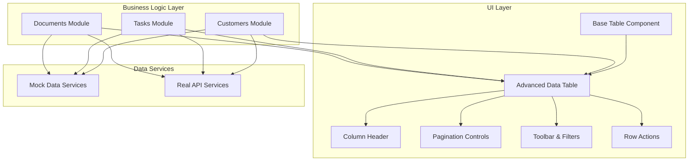
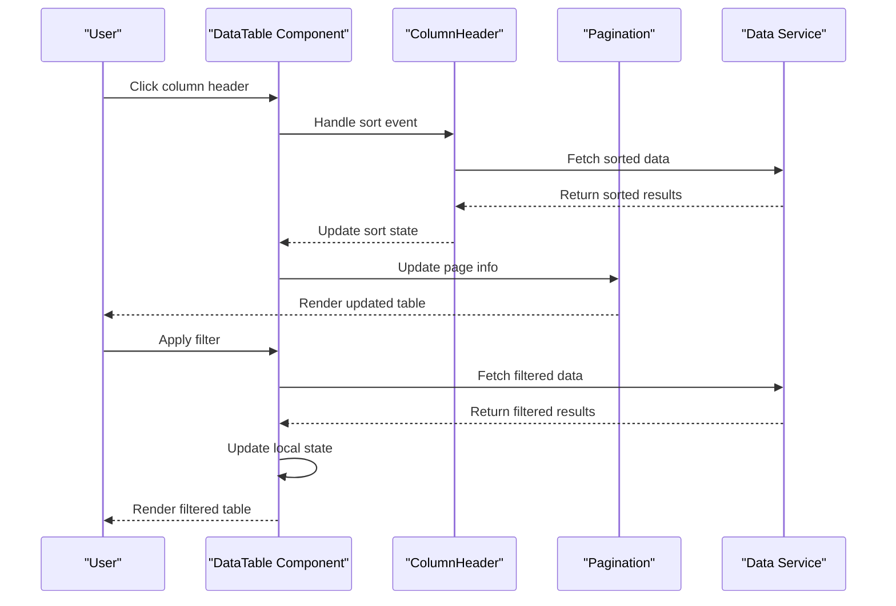
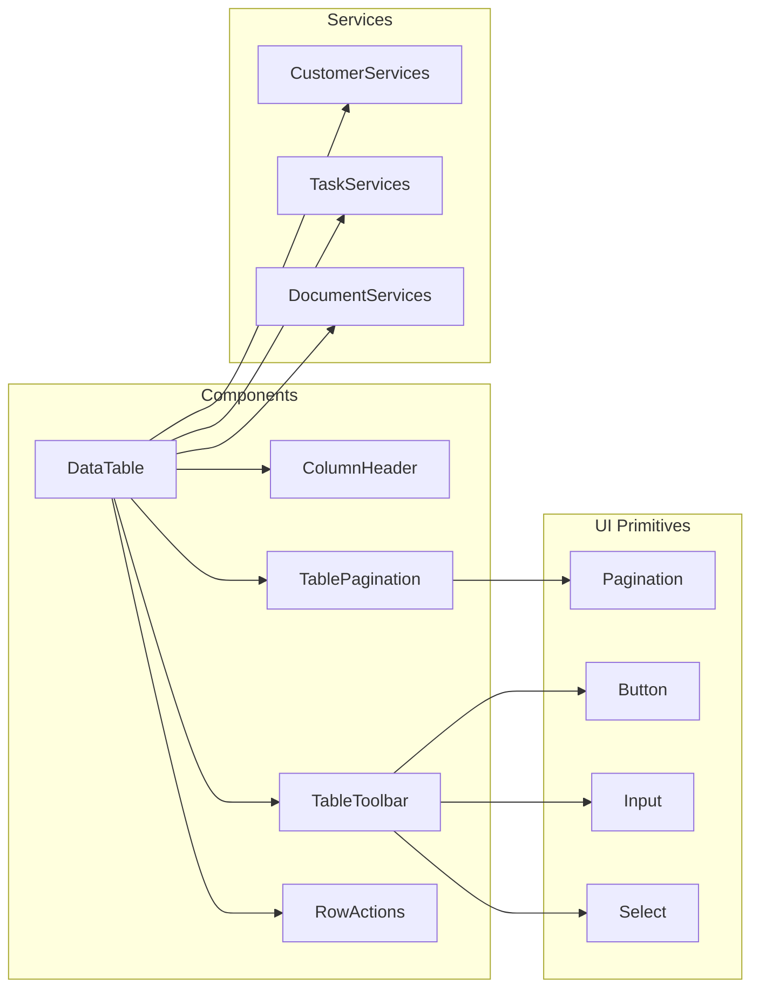

# Table Component

<cite>
**Referenced Files in This Document**
- [table.tsx](file://src/components/ui/table.tsx)
- [data-table.tsx](file://src/modules/customers/components/data-table.tsx)
- [columns.tsx](file://src/modules/customers/components/columns.tsx)
- [data-table-column-header.tsx](file://src/modules/customers/components/data-table-column-header.tsx)
- [data-table-pagination.tsx](file://src/modules/customers/components/data-table-pagination.tsx)
- [data-table-toolbar.tsx](file://src/modules/customers/components/data-table-toolbar.tsx)
- [data-table-row-actions.tsx](file://src/modules/customers/components/data-table-row-actions.tsx)
- [data-table-view-options.tsx](file://src/modules/customers/components/data-table-view-options.tsx)
- [customer-services.ts](file://src/modules/customers/services/customer-services.ts)
- [customer-mock-data.ts](file://src/modules/customers/services/customer-mock-data.ts)
- [data-table.tsx](file://src/modules/tasks/components/data-table.tsx)
- [data-table-faceted-filter.tsx](file://src/modules/tasks/components/data-table-faceted-filter.tsx)
- [task-services.ts](file://src/modules/tasks/services/task-services.ts)
- [data-table.tsx](file://src/modules/documents/components/data-table.tsx)
- [document-services.ts](file://src/modules/documents/services/document-services.ts)
- [pagination.tsx](file://src/components/ui/pagination.tsx)
</cite>

## Table of Contents
1. [Introduction](#introduction)
2. [Project Structure](#project-structure)
3. [Core Components](#core-components)
4. [Architecture Overview](#architecture-overview)
5. [Detailed Component Analysis](#detailed-component-analysis)
6. [Dependency Analysis](#dependency-analysis)
7. [Performance Considerations](#performance-considerations)
8. [Accessibility Compliance](#accessibility-compliance)
9. [Troubleshooting Guide](#troubleshooting-guide)
10. [Conclusion](#conclusion)

## Introduction

The Table Component system provides a comprehensive solution for displaying, managing, and interacting with tabular data in the dashboard application. The system includes both a base table implementation and advanced data table features that support sorting, filtering, pagination, row selection, and dynamic column configuration.

The architecture follows a modular approach where reusable UI components are separated from business logic, enabling consistent data presentation across different modules like customers, tasks, and documents while maintaining flexibility for customization.

## Project Structure

The table component system is organized into two main layers:

**Diagram sources**
- [table.tsx](file://src/components/ui/table.tsx)
- [data-table.tsx](file://src/modules/customers/components/data-table.tsx)
- [data-table.tsx](file://src/modules/tasks/components/data-table.tsx)
- [data-table.tsx](file://src/modules/documents/components/data-table.tsx)

**Section sources**
- [table.tsx](file://src/components/ui/table.tsx)
- [data-table.tsx](file://src/modules/customers/components/data-table.tsx)

## Core Components

### Base Table Implementation

The foundation of the table system consists of a semantic HTML table component built with accessibility in mind. It provides the basic structure for rows, headers, and cells while delegating styling to CSS classes.

Key features include:
- Semantic HTML structure with proper ARIA attributes
- Responsive design capabilities
- Theme integration support
- Keyboard navigation support

### Advanced Data Table Features

The advanced data table extends the base functionality with enterprise-grade features:

#### Sorting
- Multi-column sorting support
- Visual indicators for sort direction
- Customizable sort handlers
- Performance optimization for large datasets

#### Filtering
- Text-based search across columns
- Faceted filtering with predefined options
- Real-time filtering with debouncing
- Filter persistence across page navigation

#### Pagination
- Configurable page sizes
- Jump-to-page functionality
- Total record count display
- Server-side pagination support

#### Row Selection
- Single and multi-row selection
- Select all functionality
- Selection state management
- Bulk actions support

**Section sources**
- [data-table.tsx](file://src/modules/customers/components/data-table.tsx)
- [data-table-column-header.tsx](file://src/modules/customers/components/data-table-column-header.tsx)
- [data-table-pagination.tsx](file://src/modules/customers/components/data-table-pagination.tsx)
- [data-table-toolbar.tsx](file://src/modules/customers/components/data-table-toolbar.tsx)

## Architecture Overview

The table system follows a composition pattern where complex tables are built by combining smaller, focused components:

**Diagram sources**
- [data-table.tsx](file://src/modules/customers/components/data-table.tsx)
- [data-table-column-header.tsx](file://src/modules/customers/components/data-table-column-header.tsx)
- [data-table-pagination.tsx](file://src/modules/customers/components/data-table-pagination.tsx)
- [customer-services.ts](file://src/modules/customers/services/customer-services.ts)

## Detailed Component Analysis

### Customers Data Table Implementation

The customers module demonstrates a complete data table implementation with advanced features:

#### Column Definitions
Columns are defined using a declarative configuration that specifies:
- Column identifiers and display names
- Cell rendering functions
- Sort and filter capabilities
- Width constraints and responsive behavior

#### Data Integration
The table integrates with mock data services that simulate API responses, providing realistic testing scenarios while maintaining the same interface as real services.

#### State Management
Local state manages:
- Current sort configuration
- Active filters
- Selected rows
- Pagination state
- Loading states

**Section sources**
- [data-table.tsx](file://src/modules/customers/components/data-table.tsx)
- [columns.tsx](file://src/modules/customers/components/columns.tsx)
- [customer-services.ts](file://src/modules/customers/services/customer-services.ts)

### Tasks Data Table with Faceted Filtering

The tasks module showcases advanced filtering capabilities through faceted filtering:

#### Faceted Filter Implementation
- Predefined filter options per column
- Multiple value selection within filters
- Real-time filter combination
- Filter reset functionality

#### Complex Data Presentation
- Status badges with color coding
- Priority indicators
- Due date formatting
- Action buttons within cells

**Section sources**
- [data-table.tsx](file://src/modules/tasks/components/data-table.tsx)
- [data-table-faceted-filter.tsx](file://src/modules/tasks/components/data-table-faceted-filter.tsx)
- [task-services.ts](file://src/modules/tasks/services/task-services.ts)

### Documents Data Table with File Operations

The documents module extends table functionality with file-specific operations:

#### File-Specific Features
- File type icons and previews
- Download and delete actions
- File size formatting
- Upload progress indication

#### Enhanced Row Actions
- Context menu for row operations
- Bulk file operations
- Progress tracking for long-running operations

**Section sources**
- [data-table.tsx](file://src/modules/documents/components/data-table.tsx)
- [document-services.ts](file://src/modules/documents/services/document-services.ts)

### Reusable UI Components

#### Column Header Component
Provides consistent sorting controls and column management:
- Sort direction indicators
- Click-to-sort functionality
- Column visibility toggles
- Accessibility labels

#### Pagination Component
Configurable pagination controls:
- Page size selector
- Previous/next navigation
- Direct page jumping
- Total record information

#### Toolbar Component
Centralized control panel for table operations:
- Search input with clear button
- Filter toggles
- View options (column visibility)
- Export functionality

**Section sources**
- [data-table-column-header.tsx](file://src/modules/customers/components/data-table-column-header.tsx)
- [data-table-pagination.tsx](file://src/modules/customers/components/data-table-pagination.tsx)
- [data-table-toolbar.tsx](file://src/modules/customers/components/data-table-toolbar.tsx)
- [pagination.tsx](file://src/components/ui/pagination.tsx)

## Dependency Analysis

The table system maintains loose coupling between components while ensuring clear data flow:

**Diagram sources**
- [data-table.tsx](file://src/modules/customers/components/data-table.tsx)
- [data-table.tsx](file://src/modules/tasks/components/data-table.tsx)
- [data-table.tsx](file://src/modules/documents/components/data-table.tsx)
- [pagination.tsx](file://src/components/ui/pagination.tsx)

**Section sources**
- [data-table.tsx](file://src/modules/customers/components/data-table.tsx)
- [data-table.tsx](file://src/modules/tasks/components/data-table.tsx)
- [data-table.tsx](file://src/modules/documents/components/data-table.tsx)

## Performance Considerations

### Virtual Scrolling for Large Datasets
For tables with thousands of rows, implement virtual scrolling to render only visible rows:
- Windowing technique to limit DOM nodes
- Dynamic row height calculation
- Smooth scrolling performance
- Memory-efficient row recycling

### Optimized Rendering
- Memoize expensive computations
- Use React.memo for pure components
- Implement shouldComponentUpdate optimizations
- Debounce user input events

### Data Loading Strategies
- Lazy loading for initial dataset
- Progressive enhancement for additional data
- Caching strategies for repeated queries
- Error boundaries for failed requests

### Memory Management
- Cleanup event listeners and timers
- Proper disposal of subscriptions
- Avoid memory leaks in async operations
- Efficient array operations for large datasets

## Accessibility Compliance

### Keyboard Navigation
- Tab order follows visual layout
- Arrow key navigation within tables
- Enter/Space activation for interactive elements
- Focus management for dynamic content

### Screen Reader Support
- Proper ARIA labels and descriptions
- Semantic HTML structure
- Live regions for dynamic updates
- Announcements for state changes

### Color Contrast and Visual Indicators
- WCAG 2.1 AA compliance for color contrast
- Non-color dependent status indicators
- Focus indicators for keyboard navigation
- High contrast mode support

### Responsive Design
- Mobile-friendly touch interactions
- Collapsible columns for small screens
- Horizontal scrolling with overflow handling
- Adaptive font sizes and spacing

## Troubleshooting Guide

### Common Issues and Solutions

#### Performance Problems
- **Symptom**: Slow rendering with large datasets
- **Solution**: Implement virtual scrolling or server-side pagination
- **Debug**: Check render times and DOM node count

#### Sorting Not Working
- **Symptom**: Clicking column headers has no effect
- **Solution**: Verify sort handlers are properly bound
- **Debug**: Check console for errors and verify data immutability

#### Filter State Loss
- **Symptom**: Filters reset unexpectedly
- **Solution**: Ensure proper state persistence and URL sync
- **Debug**: Check localStorage and URL parameters

#### Memory Leaks
- **Symptom**: Application slows down over time
- **Solution**: Clean up event listeners and subscriptions
- **Debug**: Use browser dev tools memory profiler

### Debugging Techniques
- Enable development logging for table operations
- Use React DevTools to inspect component state
- Monitor network requests for data fetching
- Profile rendering performance with React Profiler

**Section sources**
- [data-table.tsx](file://src/modules/customers/components/data-table.tsx)
- [data-table.tsx](file://src/modules/tasks/components/data-table.tsx)
- [data-table.tsx](file://src/modules/documents/components/data-table.tsx)

## Conclusion

The Table Component system provides a robust, scalable solution for data presentation needs across the dashboard application. By separating concerns between UI components and business logic, the system achieves high reusability while maintaining flexibility for customization.

Key strengths include:
- Comprehensive feature set covering sorting, filtering, pagination, and selection
- Modular architecture enabling easy extension and customization
- Strong accessibility compliance ensuring inclusive user experiences
- Performance optimizations for handling large datasets
- Consistent design patterns across different modules

The system serves as a foundation for building sophisticated data interfaces while maintaining code quality and user experience standards throughout the application.