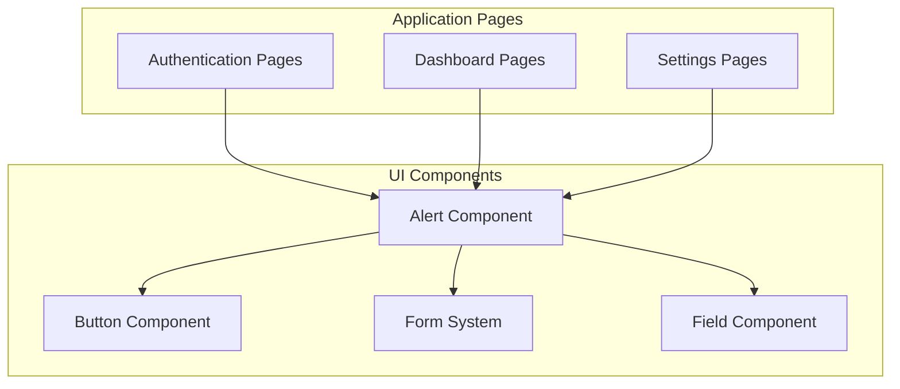
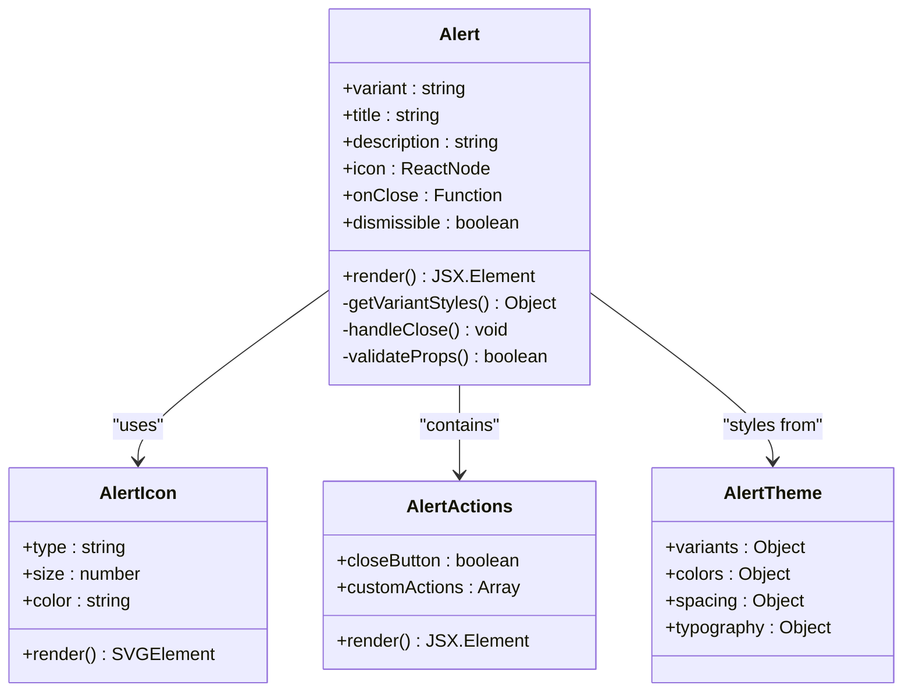
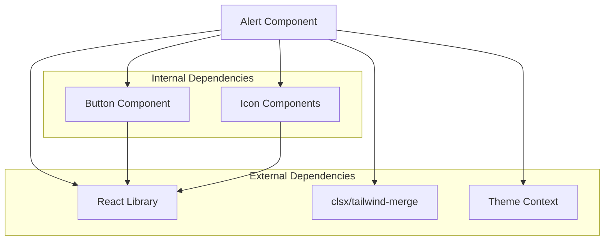

# Alert Component

<cite>
**Referenced Files in This Document**
- [alert.tsx](file://src/components/ui/alert.tsx)
- [form.tsx](file://src/components/ui/form.tsx)
- [field.tsx](file://src/components/ui/field.tsx)
- [button.tsx](file://src/components/ui/button.tsx)
</cite>

## Table of Contents
1. [Introduction](#introduction)
2. [Project Structure](#project-structure)
3. [Core Components](#core-components)
4. [Architecture Overview](#architecture-overview)
5. [Detailed Component Analysis](#detailed-component-analysis)
6. [Dependency Analysis](#dependency-analysis)
7. [Performance Considerations](#performance-considerations)
8. [Troubleshooting Guide](#troubleshooting-guide)
9. [Conclusion](#conclusion)
10. [Appendices](#appendices)

## Introduction
The Alert component is a user interface element designed to communicate important information to users through visual feedback. It provides clear messaging for various scenarios including success messages, error notifications, warnings, and informational alerts. The component follows modern accessibility standards and integrates seamlessly with form validation systems.

## Project Structure
The Alert component is part of the UI component library located in the `src/components/ui` directory. It follows the Shadcn UI pattern and integrates with the broader design system.



**Diagram sources**
- [alert.tsx:1-50](file://src/components/ui/alert.tsx#L1-L50)
- [button.tsx:1-30](file://src/components/ui/button.tsx#L1-L30)
- [form.tsx:1-40](file://src/components/ui/form.tsx#L1-L40)
- [field.tsx:1-35](file://src/components/ui/field.tsx#L1-L35)

## Core Components

### Alert Component Architecture
The Alert component implements a flexible notification system with multiple variants and customization options. It supports different message types and provides consistent styling across the application.

#### Key Features
- **Variant Support**: Success, Error, Warning, and Info states
- **Customizable Styling**: Theme-aware colors and spacing
- **Accessibility**: ARIA attributes and screen reader support
- **Responsive Design**: Mobile-friendly layout
- **Animation Support**: Smooth transitions and state changes

#### Props Interface
The component accepts various props for configuration:

| Prop | Type | Default | Description |
|------|------|---------|-------------|
| variant | string | 'info' | Message type (success, error, warning, info) |
| title | string | '' | Optional alert heading |
| description | string | '' | Main alert content |
| icon | ReactNode | undefined | Custom icon component |
| onClose | function | null | Close handler callback |
| className | string | '' | Additional CSS classes |
| style | object | {} | Inline styles |
| dismissible | boolean | false | Whether alert can be dismissed |

**Section sources**
- [alert.tsx:1-100](file://src/components/ui/alert.tsx#L1-L100)

## Architecture Overview

The Alert component follows a modular architecture that separates concerns between presentation, behavior, and styling.



**Diagram sources**
- [alert.tsx:1-150](file://src/components/ui/alert.tsx#L1-L150)

## Detailed Component Analysis

### Variant Types and Visual Appearance

The Alert component supports four primary variants, each with distinct visual characteristics:

#### Success Variant
- **Color Scheme**: Green tones with checkmark icon
- **Use Case**: Successful operations, completed tasks
- **Visual Indicators**: Solid background, prominent border
- **Screen Reader**: Announces "Success" status

#### Error Variant  
- **Color Scheme**: Red tones with X or warning icon
- **Use Case**: Failed operations, validation errors
- **Visual Indicators**: Bold borders, attention-grabbing colors
- **Screen Reader**: Announces "Error" status

#### Warning Variant
- **Color Scheme**: Yellow/amber tones with exclamation icon
- **Use Case**: Cautionary messages, potential issues
- **Visual Indicators**: Medium emphasis, cautionary colors
- **Screen Reader**: Announces "Warning" status

#### Info Variant
- **Color Scheme**: Blue tones with information icon
- **Use Case**: General information, helpful tips
- **Visual Indicators**: Subtle styling, informative colors
- **Screen Reader**: Announces "Information" status

### User Interaction Patterns

#### Basic Usage Examples

**Success Message:**
```tsx
// Path: src/components/ui/alert.tsx
<Alert 
  variant="success" 
  title="Operation Complete"
  description="Your changes have been saved successfully."
/>
```

**Error Notification:**
```tsx
// Path: src/components/ui/alert.tsx  
<Alert
  variant="error"
  title="Connection Failed"
  description="Unable to connect to the server. Please try again later."
  dismissible={true}
  onClose={() => console.log('Alert closed')}
/>
```

**Warning Alert:**
```tsx
// Path: src/components/ui/alert.tsx
<Alert
  variant="warning"
  title="Session Expiring"
  description="Your session will expire in 5 minutes. Save your work now."
/>
```

**Informational Alert:**
```tsx
// Path: src/components/ui/alert.tsx
<Alert
  variant="info"
  title="New Feature Available"
  description="Check out our updated dashboard with new analytics features."
/>
```

#### Advanced Usage Patterns

**With Custom Icon:**
```tsx
// Path: src/components/ui/alert.tsx
<Alert
  variant="success"
  icon={<CustomSuccessIcon />}
  description="Custom icon implementation"
/>
```

**Dismissible Alert:**
```tsx
// Path: src/components/ui/alert.tsx
<Alert
  variant="error"
  dismissible={true}
  onClose={handleAlertDismiss}
  description="This alert can be manually dismissed"
/>
```

**Integration with Form Validation:**
```tsx
// Path: src/components/ui/alert.tsx
<Alert
  variant={errors.length > 0 ? 'error' : 'success'}
  title={errors.length > 0 ? 'Validation Errors' : 'Form Valid'}
  description={errors.length > 0 ? 'Please fix the highlighted fields' : 'All fields are valid'}
/>
```

### Styling Customization Options

#### CSS Custom Properties
The Alert component supports theme-based customization through CSS custom properties:

```css
/* Path: src/components/ui/alert.tsx */
.alert-success {
  --alert-bg: var(--success-bg);
  --alert-border: var(--success-border);
  --alert-text: var(--success-text);
  --alert-icon: var(--success-icon);
}

.alert-error {
  --alert-bg: var(--error-bg);
  --alert-border: var(--error-border);
  --alert-text: var(--error-text);
  --alert-icon: var(--error-icon);
}
```

#### Tailwind CSS Integration
The component integrates with Tailwind CSS for utility-first styling:

```tsx
// Path: src/components/ui/alert.tsx
<Alert
  className="rounded-lg shadow-md"
  style={{
    '--alert-padding': '1rem',
    '--alert-radius': '0.5rem'
  }}
/>
```

### Accessibility Requirements

#### Screen Reader Support
The Alert component implements comprehensive accessibility features:

- **ARIA Attributes**: Proper role, aria-live, and aria-atomic attributes
- **Semantic HTML**: Uses appropriate semantic elements
- **Keyboard Navigation**: Full keyboard accessibility
- **Focus Management**: Proper focus handling for dismissible alerts
- **Color Contrast**: WCAG AA compliant color combinations

#### ARIA Implementation
```tsx
// Path: src/components/ui/alert.tsx
<div
  role="alert"
  aria-live="polite"
  aria-atomic="true"
  className={`alert alert-${variant}`}
>
  {title && <h3 className="alert-title">{title}</h3>}
  {description && <p className="alert-description">{description}</p>}
  {dismissible && (
    <button 
      onClick={onClose}
      aria-label="Close alert"
      className="alert-close"
    >
      ×
    </button>
  )}
</div>
```

### Integration with Form Validation

#### Real-time Validation Feedback
The Alert component integrates seamlessly with form validation libraries:

```tsx
// Path: src/components/ui/alert.tsx
const MyForm = () => {
  const [formData, setFormData] = useState({});
  const [errors, setErrors] = useState({});
  const [isSubmitting, setIsSubmitting] = useState(false);

  const handleSubmit = async (e) => {
    e.preventDefault();
    setIsSubmitting(true);
    
    try {
      await validateForm(formData);
      // Show success alert
      showNotification('success', 'Form submitted successfully');
    } catch (validationErrors) {
      setErrors(validationErrors);
      // Show error alert
      showNotification('error', 'Please fix the form errors');
    } finally {
      setIsSubmitting(false);
    }
  };

  return (
    <form onSubmit={handleSubmit}>
      {notification && (
        <Alert
          variant={notification.type}
          title={notification.title}
          description={notification.message}
          dismissible={true}
          onClose={() => setNotification(null)}
        />
      )}
      {/* Form fields */}
    </form>
  );
};
```

#### Error Display Pattern
```tsx
// Path: src/components/ui/alert.tsx
const FormWithErrorAlert = ({ errors }) => {
  const hasErrors = Object.keys(errors).length > 0;
  
  return (
    <>
      {hasErrors && (
        <Alert
          variant="error"
          title="Form Validation Errors"
          description={`Please correct ${Object.keys(errors).length} field(s)`}
          dismissible={false}
        />
      )}
      {/* Form fields with individual error messages */}
    </>
  );
};
```

## Dependency Analysis

The Alert component has minimal external dependencies and maintains loose coupling with other components.



**Diagram sources**
- [alert.tsx:1-50](file://src/components/ui/alert.tsx#L1-L50)
- [button.tsx:1-30](file://src/components/ui/button.tsx#L1-L30)

**Section sources**
- [alert.tsx:1-200](file://src/components/ui/alert.tsx#L1-L200)

## Performance Considerations

### Optimization Strategies
- **Memoization**: Use React.memo for expensive re-renders
- **Conditional Rendering**: Only render icons when needed
- **CSS Optimization**: Leverage CSS custom properties for theming
- **Lazy Loading**: Load icons only when required

### Memory Management
- Proper cleanup of event listeners
- Efficient state management for dismissible alerts
- Minimal DOM manipulation

## Troubleshooting Guide

### Common Issues and Solutions

#### Alert Not Appearing
**Problem**: Alert component not rendering
**Solution**: Check prop validation and ensure required props are provided

#### Styling Conflicts
**Problem**: Custom styles not applying
**Solution**: Verify CSS specificity and Tailwind CSS configuration

#### Accessibility Issues
**Problem**: Screen readers not announcing alerts
**Solution**: Ensure proper ARIA attributes and semantic HTML structure

#### Animation Problems
**Problem**: Transitions not working correctly
**Solution**: Check CSS animation properties and browser compatibility

### Debugging Tips
- Use React DevTools to inspect component props
- Check browser console for JavaScript errors
- Verify CSS custom properties are properly defined
- Test with different screen readers (NVDA, JAWS, VoiceOver)

## Conclusion

The Alert component provides a robust, accessible, and customizable solution for displaying important messages to users. With support for multiple variants, comprehensive accessibility features, and seamless integration with form validation systems, it serves as a foundational building block for effective user communication in the application.

The component's modular architecture ensures maintainability and extensibility, while its adherence to accessibility standards guarantees inclusive user experiences across diverse assistive technologies.

## Appendices

### Quick Reference

#### Props Summary
- **variant**: 'success' | 'error' | 'warning' | 'info'
- **title**: string (optional)
- **description**: string (required)
- **icon**: ReactNode (optional)
- **onClose**: function (optional)
- **dismissible**: boolean (default: false)
- **className**: string (optional)
- **style**: object (optional)

#### Best Practices
- Always provide meaningful titles for context
- Keep descriptions concise and actionable
- Use appropriate variants for message types
- Implement proper accessibility attributes
- Test with screen readers regularly
- Follow established color contrast guidelines