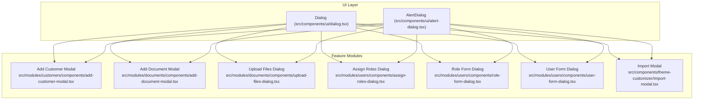
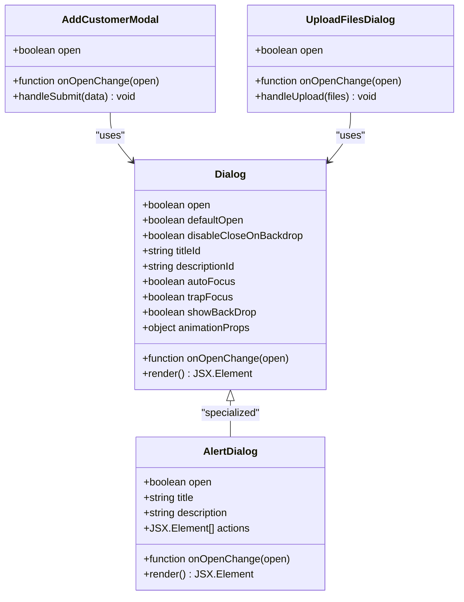
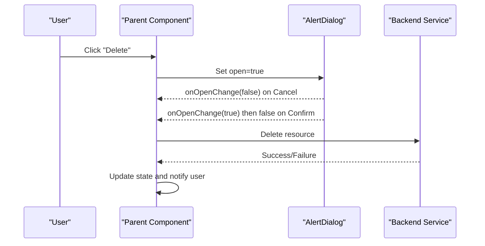
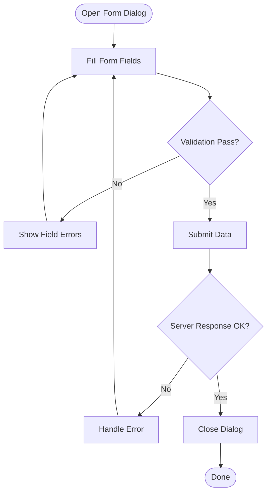
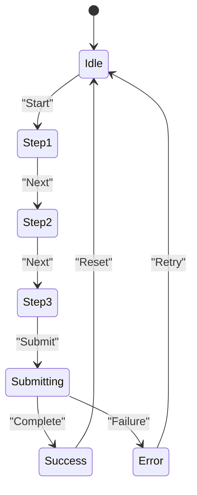
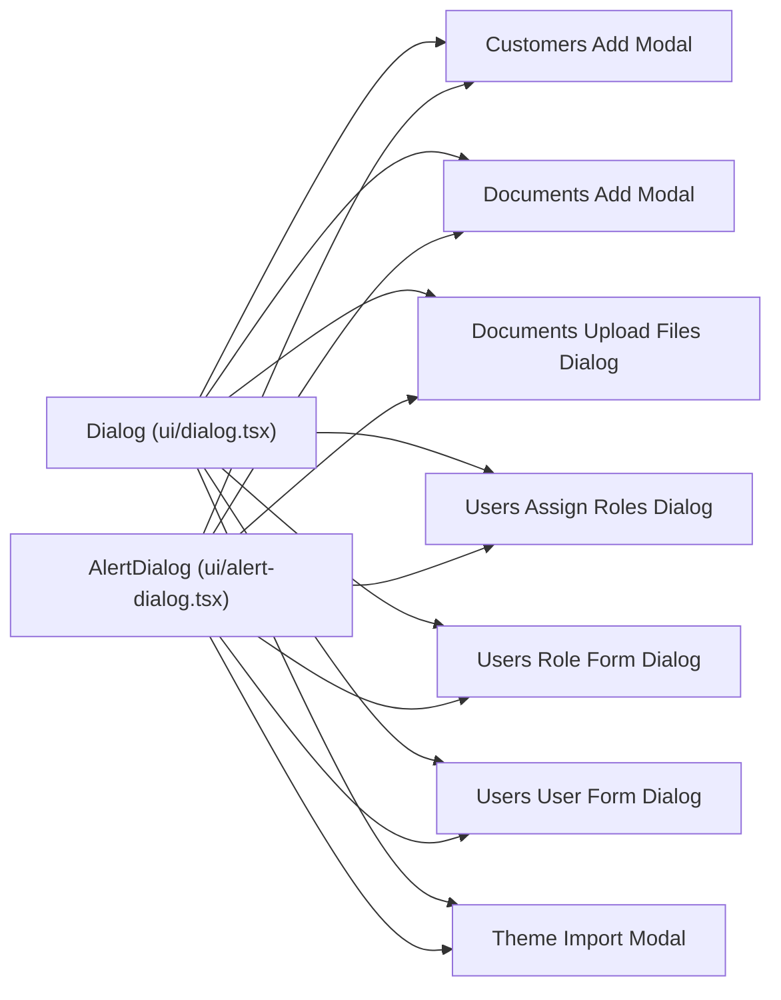

# Dialog Component

<cite>
**Referenced Files in This Document**
- [dialog.tsx](file://src/components/ui/dialog.tsx)
- [alert-dialog.tsx](file://src/components/ui/alert-dialog.tsx)
- [add-customer-modal.tsx](file://src/modules/customers/components/add-customer-modal.tsx)
- [add-document-modal.tsx](file://src/modules/documents/components/add-document-modal.tsx)
- [upload-files-dialog.tsx](file://src/modules/documents/components/upload-files-dialog.tsx)
- [assign-roles-dialog.tsx](file://src/modules/users/components/assign-roles-dialog.tsx)
- [role-form-dialog.tsx](file://src/modules/users/components/role-form-dialog.tsx)
- [user-form-dialog.tsx](file://src/modules/users/components/user-form-dialog.tsx)
- [import-modal.tsx](file://src/components/theme-customizer/import-modal.tsx)
</cite>

## Table of Contents
1. [Introduction](#introduction)
2. [Project Structure](#project-structure)
3. [Core Components](#core-components)
4. [Architecture Overview](#architecture-overview)
5. [Detailed Component Analysis](#detailed-component-analysis)
6. [Dependency Analysis](#dependency-analysis)
7. [Performance Considerations](#performance-considerations)
8. [Troubleshooting Guide](#troubleshooting-guide)
9. [Conclusion](#conclusion)
10. [Appendices](#appendices)

## Introduction
This document provides comprehensive documentation for the Dialog component and its ecosystem within the project. It covers modal management, focus trapping, backdrop handling, keyboard navigation, accessibility (ARIA attributes, focus management, screen reader compatibility), props for control, positioning, and animation settings, as well as practical examples including confirmation dialogs, form dialogs, and complex multi-step dialogs. It also includes guidelines for dialog composition and nested dialog handling.

## Project Structure
The Dialog implementation is located under the UI components directory and is used across multiple modules for various dialog patterns such as confirmations, forms, and uploads. The following diagram shows where the core Dialog lives and how it is consumed by feature-specific dialogs.

**Diagram sources**
- [dialog.tsx](file://src/components/ui/dialog.tsx)
- [alert-dialog.tsx](file://src/components/ui/alert-dialog.tsx)
- [add-customer-modal.tsx](file://src/modules/customers/components/add-customer-modal.tsx)
- [add-document-modal.tsx](file://src/modules/documents/components/add-document-modal.tsx)
- [upload-files-dialog.tsx](file://src/modules/documents/components/upload-files-dialog.tsx)
- [assign-roles-dialog.tsx](file://src/modules/users/components/assign-roles-dialog.tsx)
- [role-form-dialog.tsx](file://src/modules/users/components/role-form-dialog.tsx)
- [user-form-dialog.tsx](file://src/modules/users/components/user-form-dialog.tsx)
- [import-modal.tsx](file://src/components/theme-customizer/import-modal.tsx)

**Section sources**
- [dialog.tsx](file://src/components/ui/dialog.tsx)
- [alert-dialog.tsx](file://src/components/ui/alert-dialog.tsx)
- [add-customer-modal.tsx](file://src/modules/customers/components/add-customer-modal.tsx)
- [add-document-modal.tsx](file://src/modules/documents/components/add-document-modal.tsx)
- [upload-files-dialog.tsx](file://src/modules/documents/components/upload-files-dialog.tsx)
- [assign-roles-dialog.tsx](file://src/modules/users/components/assign-roles-dialog.tsx)
- [role-form-dialog.tsx](file://src/modules/users/components/role-form-dialog.tsx)
- [user-form-dialog.tsx](file://src/modules/users/components/user-form-dialog.tsx)
- [import-modal.tsx](file://src/components/theme-customizer/import-modal.tsx)

## Core Components
- Dialog: A flexible modal primitive that renders a portal-backed overlay with focus management and keyboard support. It exposes props to control visibility, close behavior, backdrop interaction, and animation.
- AlertDialog: A specialized variant designed for confirmations and destructive actions, typically pairing with buttons for Yes/No or Confirm/Cancel flows.

Key responsibilities:
- Modal lifecycle: open/close state, mounting/unmounting, and cleanup.
- Focus management: initial focus on mount, trap focus inside the dialog, restore focus on close.
- Backdrop handling: click-to-close behavior and optional prevent-close scenarios.
- Keyboard navigation: Escape to close, Tab cycling within the dialog.
- Accessibility: appropriate ARIA roles, labels, and descriptions; screen reader announcements when needed.

Typical usage pattern:
- Controlled open state managed by the parent component.
- Close handlers triggered by backdrop clicks, Escape key, or explicit button actions.
- Optional animations controlled via props.

**Section sources**
- [dialog.tsx](file://src/components/ui/dialog.tsx)
- [alert-dialog.tsx](file://src/components/ui/alert-dialog.tsx)

## Architecture Overview
The Dialog architecture follows a clear separation between the base UI primitive and feature-specific implementations. Feature dialogs compose the base Dialog or AlertDialog and add domain logic, forms, and validation.

**Diagram sources**
- [dialog.tsx](file://src/components/ui/dialog.tsx)
- [alert-dialog.tsx](file://src/components/ui/alert-dialog.tsx)
- [add-customer-modal.tsx](file://src/modules/customers/components/add-customer-modal.tsx)
- [upload-files-dialog.tsx](file://src/modules/documents/components/upload-files-dialog.tsx)

## Detailed Component Analysis

### Dialog Primitive
Responsibilities:
- Portal rendering for overlay and content.
- Focus trap to keep Tab within the dialog.
- Keyboard handling for Escape to close.
- Backdrop click handling with configurable behavior.
- Animation hooks integration for entrance/exit transitions.
- ARIA attributes for role, label, and description.

Common props:
- open: boolean controlling visibility.
- onOpenChange: callback invoked when open state changes.
- defaultOpen: uncontrolled initial open state.
- disableCloseOnBackdrop: prevents closing when clicking the backdrop.
- autoFocus: whether to autofocus the first focusable element.
- trapFocus: enables focus trapping inside the dialog.
- showBackDrop: toggles backdrop visibility.
- titleId/descriptionId: IDs for accessible labeling.
- animationProps: configuration for animation timing and easing.

Accessibility:
- Sets aria-modal="true".
- Associates title and description using aria-labelledby and aria-describedby.
- Ensures focus restoration to the trigger element on close.

Keyboard navigation:
- Escape closes the dialog unless prevented by parent logic.
- Tab cycles through focusable elements within the dialog.

Animation:
- Uses animation props to control duration and easing for open/close transitions.

**Section sources**
- [dialog.tsx](file://src/components/ui/dialog.tsx)

### AlertDialog
Purpose:
- Provides a pre-styled confirmation interface with action buttons.
- Encourages clear messaging and safe destructive operations.

Common props:
- open: boolean controlling visibility.
- onOpenChange: callback invoked when open state changes.
- title: string describing the action.
- description: string providing additional context.
- actions: array of JSX elements representing buttons (e.g., Confirm, Cancel).

Behavior:
- Inherits focus trapping and keyboard handling from the base Dialog.
- Typically closes on action button clicks.

**Section sources**
- [alert-dialog.tsx](file://src/components/ui/alert-dialog.tsx)

### Confirmation Dialog Example
Use case:
- Confirm deletion or irreversible actions.

Flow:
- User triggers an action.
- AlertDialog opens with a clear message and two actions.
- On Confirm, perform the operation and close.
- On Cancel, close without side effects.

**Diagram sources**
- [alert-dialog.tsx](file://src/components/ui/alert-dialog.tsx)
- [add-customer-modal.tsx](file://src/modules/customers/components/add-customer-modal.tsx)
- [add-document-modal.tsx](file://src/modules/documents/components/add-document-modal.tsx)

**Section sources**
- [alert-dialog.tsx](file://src/components/ui/alert-dialog.tsx)
- [add-customer-modal.tsx](file://src/modules/customers/components/add-customer-modal.tsx)
- [add-document-modal.tsx](file://src/modules/documents/components/add-document-modal.tsx)

### Form Dialog Example
Use case:
- Create or edit entities (e.g., customer, role, user).

Flow:
- Open dialog with form fields.
- Validate inputs before submission.
- Submit data to backend.
- Close dialog and refresh list if successful.

**Diagram sources**
- [add-customer-modal.tsx](file://src/modules/customers/components/add-customer-modal.tsx)
- [role-form-dialog.tsx](file://src/modules/users/components/role-form-dialog.tsx)
- [user-form-dialog.tsx](file://src/modules/users/components/user-form-dialog.tsx)

**Section sources**
- [add-customer-modal.tsx](file://src/modules/customers/components/add-customer-modal.tsx)
- [role-form-dialog.tsx](file://src/modules/users/components/role-form-dialog.tsx)
- [user-form-dialog.tsx](file://src/modules/users/components/user-form-dialog.tsx)

### Complex Multi-Step Dialog Example
Use case:
- Multi-step workflows like file upload with progress and review steps.

Flow:
- Step 1: Select files.
- Step 2: Configure options.
- Step 3: Review and submit.
- Progress updates and error handling per step.

**Diagram sources**
- [upload-files-dialog.tsx](file://src/modules/documents/components/upload-files-dialog.tsx)

**Section sources**
- [upload-files-dialog.tsx](file://src/modules/documents/components/upload-files-dialog.tsx)

### Nested Dialog Handling
Guidelines:
- Avoid deep nesting; prefer single-level modals when possible.
- If nesting is necessary, ensure each dialog manages its own focus trap and does not interfere with others.
- Use distinct titles and descriptions for each dialog to maintain clarity for screen readers.
- Prevent backdrop interactions from closing outer dialogs unintentionally.

Best practices:
- Keep inner dialogs lightweight and purposeful.
- Ensure proper focus restoration after closing nested dialogs.
- Test keyboard navigation thoroughly across nested layers.

**Section sources**
- [dialog.tsx](file://src/components/ui/dialog.tsx)
- [alert-dialog.tsx](file://src/components/ui/alert-dialog.tsx)

## Dependency Analysis
The Dialog primitive is consumed by multiple feature dialogs. The following diagram illustrates these relationships.

**Diagram sources**
- [dialog.tsx](file://src/components/ui/dialog.tsx)
- [alert-dialog.tsx](file://src/components/ui/alert-dialog.tsx)
- [add-customer-modal.tsx](file://src/modules/customers/components/add-customer-modal.tsx)
- [add-document-modal.tsx](file://src/modules/documents/components/add-document-modal.tsx)
- [upload-files-dialog.tsx](file://src/modules/documents/components/upload-files-dialog.tsx)
- [assign-roles-dialog.tsx](file://src/modules/users/components/assign-roles-dialog.tsx)
- [role-form-dialog.tsx](file://src/modules/users/components/role-form-dialog.tsx)
- [user-form-dialog.tsx](file://src/modules/users/components/user-form-dialog.tsx)
- [import-modal.tsx](file://src/components/theme-customizer/import-modal.tsx)

**Section sources**
- [dialog.tsx](file://src/components/ui/dialog.tsx)
- [alert-dialog.tsx](file://src/components/ui/alert-dialog.tsx)
- [add-customer-modal.tsx](file://src/modules/customers/components/add-customer-modal.tsx)
- [add-document-modal.tsx](file://src/modules/documents/components/add-document-modal.tsx)
- [upload-files-dialog.tsx](file://src/modules/documents/components/upload-files-dialog.tsx)
- [assign-roles-dialog.tsx](file://src/modules/users/components/assign-roles-dialog.tsx)
- [role-form-dialog.tsx](file://src/modules/users/components/role-form-dialog.tsx)
- [user-form-dialog.tsx](file://src/modules/users/components/user-form-dialog.tsx)
- [import-modal.tsx](file://src/components/theme-customizer/import-modal.tsx)

## Performance Considerations
- Minimize re-renders by keeping dialog state local to the parent component and passing stable callbacks.
- Debounce heavy operations triggered by dialog actions (e.g., search or validation).
- Avoid large payloads in dialog content; lazy-load heavy components if necessary.
- Use animation props judiciously to balance UX and performance on low-end devices.

[No sources needed since this section provides general guidance]

## Troubleshooting Guide
Common issues and resolutions:
- Focus not trapped: Ensure trapFocus is enabled and no external focus listeners interfere.
- Escape key not closing: Verify onOpenChange is wired correctly and no preventDefault is blocking Escape.
- Backdrop click not closing: Check disableCloseOnBackdrop prop and parent logic.
- Screen reader not announcing: Provide aria-labelledby and aria-describedby; ensure title and description are present.
- Nested dialog focus conflicts: Limit nesting depth and ensure each dialog restores focus properly.

**Section sources**
- [dialog.tsx](file://src/components/ui/dialog.tsx)
- [alert-dialog.tsx](file://src/components/ui/alert-dialog.tsx)

## Conclusion
The Dialog component provides a robust foundation for building accessible, interactive modals. By leveraging its props for control, focus management, backdrop handling, and animations, developers can implement a wide range of dialog patterns—from simple confirmations to complex multi-step workflows—while maintaining high standards for accessibility and usability.

[No sources needed since this section summarizes without analyzing specific files]

## Appendices

### Props Reference Summary
- Control:
  - open: boolean
  - onOpenChange: function
  - defaultOpen: boolean
- Behavior:
  - disableCloseOnBackdrop: boolean
  - autoFocus: boolean
  - trapFocus: boolean
  - showBackDrop: boolean
- Accessibility:
  - titleId: string
  - descriptionId: string
- Animation:
  - animationProps: object

**Section sources**
- [dialog.tsx](file://src/components/ui/dialog.tsx)

### Usage Examples Index
- Confirmation dialog:
  - [alert-dialog.tsx](file://src/components/ui/alert-dialog.tsx)
  - [add-customer-modal.tsx](file://src/modules/customers/components/add-customer-modal.tsx)
  - [add-document-modal.tsx](file://src/modules/documents/components/add-document-modal.tsx)
- Form dialog:
  - [role-form-dialog.tsx](file://src/modules/users/components/role-form-dialog.tsx)
  - [user-form-dialog.tsx](file://src/modules/users/components/user-form-dialog.tsx)
- Complex multi-step dialog:
  - [upload-files-dialog.tsx](file://src/modules/documents/components/upload-files-dialog.tsx)
- Additional usage:
  - [assign-roles-dialog.tsx](file://src/modules/users/components/assign-roles-dialog.tsx)
  - [import-modal.tsx](file://src/components/theme-customizer/import-modal.tsx)

**Section sources**
- [alert-dialog.tsx](file://src/components/ui/alert-dialog.tsx)
- [add-customer-modal.tsx](file://src/modules/customers/components/add-customer-modal.tsx)
- [add-document-modal.tsx](file://src/modules/documents/components/add-document-modal.tsx)
- [role-form-dialog.tsx](file://src/modules/users/components/role-form-dialog.tsx)
- [user-form-dialog.tsx](file://src/modules/users/components/user-form-dialog.tsx)
- [upload-files-dialog.tsx](file://src/modules/documents/components/upload-files-dialog.tsx)
- [assign-roles-dialog.tsx](file://src/modules/users/components/assign-roles-dialog.tsx)
- [import-modal.tsx](file://src/components/theme-customizer/import-modal.tsx)