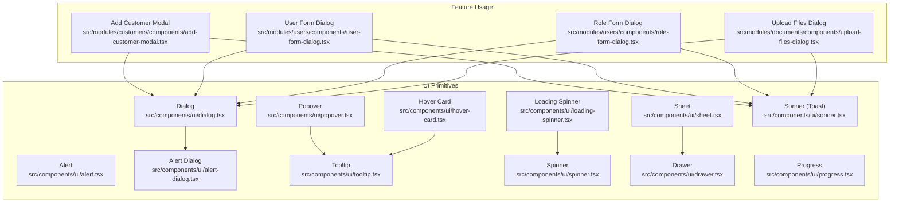
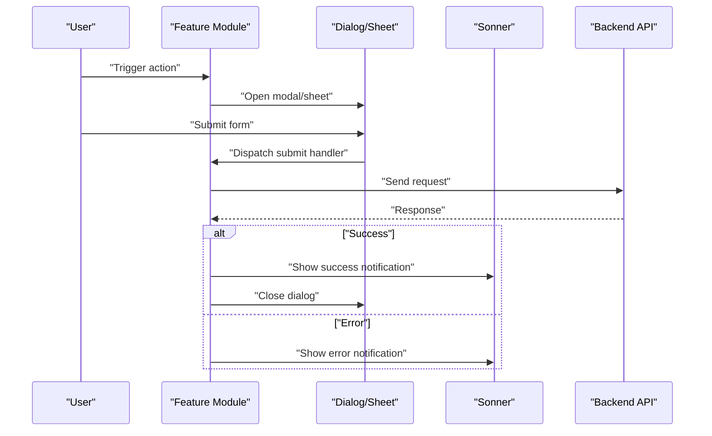
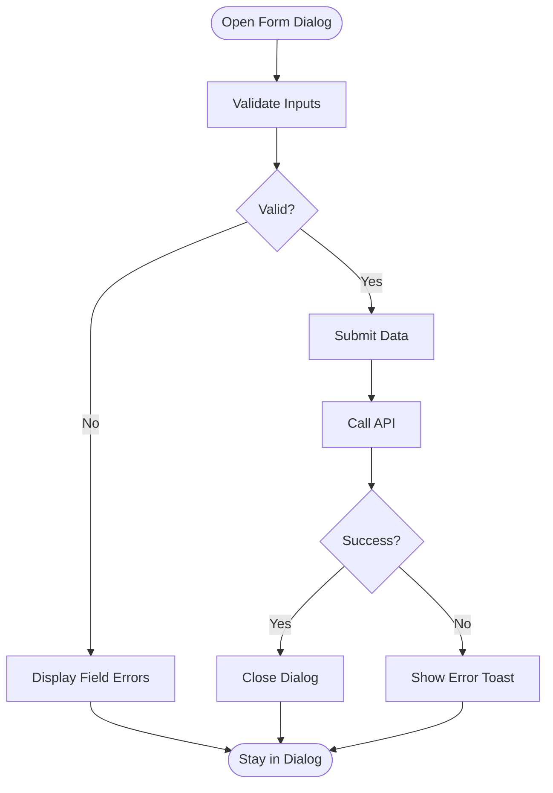
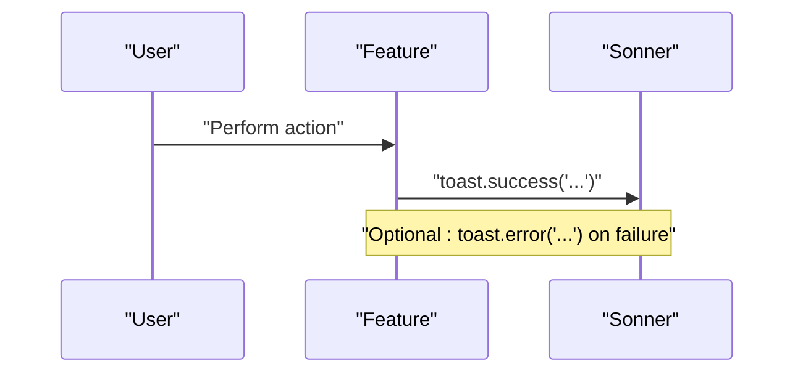
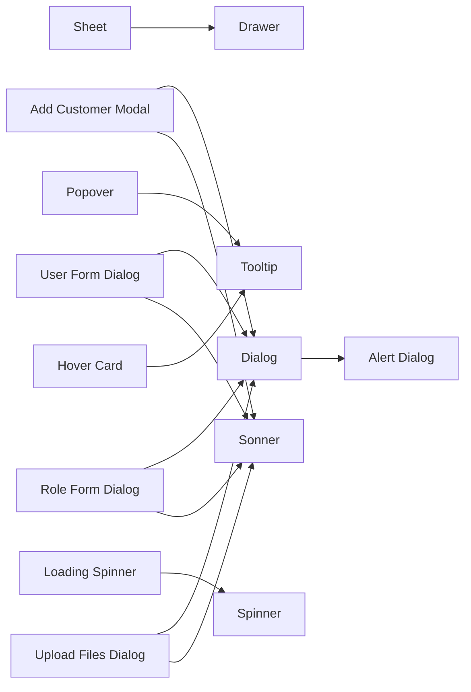

# Feedback Components

<cite>
**Referenced Files in This Document**
- [alert.tsx](file://src/components/ui/alert.tsx)
- [alert-dialog.tsx](file://src/components/ui/alert-dialog.tsx)
- [dialog.tsx](file://src/components/ui/dialog.tsx)
- [sheet.tsx](file://src/components/ui/sheet.tsx)
- [tooltip.tsx](file://src/components/ui/tooltip.tsx)
- [popover.tsx](file://src/components/ui/popover.tsx)
- [hover-card.tsx](file://src/components/ui/hover-card.tsx)
- [loading-spinner.tsx](file://src/components/ui/loading-spinner.tsx)
- [spinner.tsx](file://src/components/ui/spinner.tsx)
- [sonner.tsx](file://src/components/ui/sonner.tsx)
- [drawer.tsx](file://src/components/ui/drawer.tsx)
- [progress.tsx](file://src/components/ui/progress.tsx)
- [add-customer-modal.tsx](file://src/modules/customers/components/add-customer-modal.tsx)
- [user-form-dialog.tsx](file://src/modules/users/components/user-form-dialog.tsx)
- [role-form-dialog.tsx](file://src/modules/users/components/role-form-dialog.tsx)
- [upload-files-dialog.tsx](file://src/modules/documents/components/upload-files-dialog.tsx)
</cite>

## Table of Contents
1. [Introduction](#introduction)
2. [Project Structure](#project-structure)
3. [Core Components](#core-components)
4. [Architecture Overview](#architecture-overview)
5. [Detailed Component Analysis](#detailed-component-analysis)
6. [Dependency Analysis](#dependency-analysis)
7. [Performance Considerations](#performance-considerations)
8. [Troubleshooting Guide](#troubleshooting-guide)
9. [Conclusion](#conclusion)

## Introduction
This document provides comprehensive documentation for feedback components used to communicate status, confirm actions, and guide users through workflows. It covers:
- Alert and Alert Dialog for notifications and confirmations
- Dialog and Sheet for modal and side-panel experiences
- Tooltip, Popover, and Hover Card for contextual information
- Loading Spinner and Progress indicators for loading states
- Toast notifications via the Sonner integration

It also includes user interaction patterns, modal management strategies, accessibility considerations, and practical examples such as form dialogs, confirmation modals, toast notifications, and progress indicators.

## Project Structure
Feedback-related UI primitives live under src/components/ui. Application-level usage appears in feature modules (e.g., customers, users, documents). The following diagram maps key files involved in feedback interactions.

**Diagram sources**
- [alert.tsx](file://src/components/ui/alert.tsx)
- [alert-dialog.tsx](file://src/components/ui/alert-dialog.tsx)
- [dialog.tsx](file://src/components/ui/dialog.tsx)
- [sheet.tsx](file://src/components/ui/sheet.tsx)
- [tooltip.tsx](file://src/components/ui/tooltip.tsx)
- [popover.tsx](file://src/components/ui/popover.tsx)
- [hover-card.tsx](file://src/components/ui/hover-card.tsx)
- [loading-spinner.tsx](file://src/components/ui/loading-spinner.tsx)
- [spinner.tsx](file://src/components/ui/spinner.tsx)
- [sonner.tsx](file://src/components/ui/sonner.tsx)
- [drawer.tsx](file://src/components/ui/drawer.tsx)
- [progress.tsx](file://src/components/ui/progress.tsx)
- [add-customer-modal.tsx](file://src/modules/customers/components/add-customer-modal.tsx)
- [user-form-dialog.tsx](file://src/modules/users/components/user-form-dialog.tsx)
- [role-form-dialog.tsx](file://src/modules/users/components/role-form-dialog.tsx)
- [upload-files-dialog.tsx](file://src/modules/documents/components/upload-files-dialog.tsx)

**Section sources**
- [alert.tsx](file://src/components/ui/alert.tsx)
- [alert-dialog.tsx](file://src/components/ui/alert-dialog.tsx)
- [dialog.tsx](file://src/components/ui/dialog.tsx)
- [sheet.tsx](file://src/components/ui/sheet.tsx)
- [tooltip.tsx](file://src/components/ui/tooltip.tsx)
- [popover.tsx](file://src/components/ui/popover.tsx)
- [hover-card.tsx](file://src/components/ui/hover-card.tsx)
- [loading-spinner.tsx](file://src/components/ui/loading-spinner.tsx)
- [spinner.tsx](file://src/components/ui/spinner.tsx)
- [sonner.tsx](file://src/components/ui/sonner.tsx)
- [drawer.tsx](file://src/components/ui/drawer.tsx)
- [progress.tsx](file://src/components/ui/progress.tsx)
- [add-customer-modal.tsx](file://src/modules/customers/components/add-customer-modal.tsx)
- [user-form-dialog.tsx](file://src/modules/users/components/user-form-dialog.tsx)
- [role-form-dialog.tsx](file://src/modules/users/components/role-form-dialog.tsx)
- [upload-files-dialog.tsx](file://src/modules/documents/components/upload-files-dialog.tsx)

## Core Components
- Alert: Non-blocking messages with semantic roles and clear visual hierarchy. Use for system or contextual notices.
- Alert Dialog: Confirmation flows that require explicit user action before proceeding.
- Dialog: Centered modal for focused tasks, forms, or confirmations.
- Sheet: Side panel for secondary content or multi-step flows; useful on mobile and desktop.
- Tooltip: Short hints shown on hover/focus.
- Popover: Richer floating content triggered by click or focus.
- Hover Card: Contextual preview card on hover.
- Loading Spinner / Spinner: Indeterminate progress indicator for async operations.
- Sonner (Toast): Dismissible notifications for success, error, info, and warning.
- Drawer: Mobile-first bottom sheet variant of Sheet.
- Progress: Determinate progress bar for long-running tasks.

Interaction patterns:
- Focus management: Ensure focus is trapped within modal overlays and returned on close.
- Escape to close: Respect keyboard navigation and dismiss when appropriate.
- Backdrop clicks: Close behavior should be configurable per component.
- Stacking: Avoid overlapping multiple modals unless necessary; prefer sequential flows.

Accessibility highlights:
- Proper ARIA roles and labels for overlays and triggers.
- Screen reader announcements for dynamic content changes.
- Visible focus indicators and logical tab order.

**Section sources**
- [alert.tsx](file://src/components/ui/alert.tsx)
- [alert-dialog.tsx](file://src/components/ui/alert-dialog.tsx)
- [dialog.tsx](file://src/components/ui/dialog.tsx)
- [sheet.tsx](file://src/components/ui/sheet.tsx)
- [tooltip.tsx](file://src/components/ui/tooltip.tsx)
- [popover.tsx](file://src/components/ui/popover.tsx)
- [hover-card.tsx](file://src/components/ui/hover-card.tsx)
- [loading-spinner.tsx](file://src/components/ui/loading-spinner.tsx)
- [spinner.tsx](file://src/components/ui/spinner.tsx)
- [sonner.tsx](file://src/components/ui/sonner.tsx)
- [drawer.tsx](file://src/components/ui/drawer.tsx)
- [progress.tsx](file://src/components/ui/progress.tsx)

## Architecture Overview
The feedback layer composes small, accessible primitives into higher-level UX patterns. Feature modules orchestrate state and data flow while delegating presentation to UI primitives.

**Diagram sources**
- [dialog.tsx](file://src/components/ui/dialog.tsx)
- [sheet.tsx](file://src/components/ui/sheet.tsx)
- [sonner.tsx](file://src/components/ui/sonner.tsx)
- [add-customer-modal.tsx](file://src/modules/customers/components/add-customer-modal.tsx)
- [user-form-dialog.tsx](file://src/modules/users/components/user-form-dialog.tsx)
- [role-form-dialog.tsx](file://src/modules/users/components/role-form-dialog.tsx)
- [upload-files-dialog.tsx](file://src/modules/documents/components/upload-files-dialog.tsx)

## Detailed Component Analysis

### Alert
- Purpose: Display concise, non-blocking messages.
- Interaction: Static display; can include dismissible variants.
- Accessibility: Semantic role and descriptive text ensure screen readers announce context.
- Best practices: Pair with icons for quick scanning; keep copy short and actionable.

**Section sources**
- [alert.tsx](file://src/components/ui/alert.tsx)

### Alert Dialog
- Purpose: Confirm destructive or important actions.
- Interaction: Requires explicit acceptance; prevents accidental actions.
- Accessibility: Focus trap and proper labeling; announce intent to assistive tech.
- Best practices: Provide clear primary and secondary actions; avoid ambiguity.

**Section sources**
- [alert-dialog.tsx](file://src/components/ui/alert-dialog.tsx)

### Dialog
- Purpose: Focused modal for tasks like editing or confirmation.
- Interaction: Triggers open/close; supports backdrop and keyboard handling.
- Accessibility: Focus management, aria attributes, and return focus on close.
- Best practices: Keep dialogs scoped to a single task; avoid nested dialogs.

Usage example: Form dialog
- See [user-form-dialog.tsx](file://src/modules/users/components/user-form-dialog.tsx) for a typical form inside a Dialog.

**Section sources**
- [dialog.tsx](file://src/components/ui/dialog.tsx)
- [user-form-dialog.tsx](file://src/modules/users/components/user-form-dialog.tsx)

### Sheet
- Purpose: Side panel for secondary content or multi-step flows.
- Interaction: Slide-in/out; often used on mobile as a full-screen overlay.
- Accessibility: Similar to Dialog with directional cues and focus management.
- Best practices: Use for related but non-primary content; provide clear close affordance.

Related primitive: Drawer
- See [drawer.tsx](file://src/components/ui/drawer.tsx) for mobile-oriented drawer behavior.

**Section sources**
- [sheet.tsx](file://src/components/ui/sheet.tsx)
- [drawer.tsx](file://src/components/ui/drawer.tsx)

### Tooltip
- Purpose: Provide brief hints on hover/focus.
- Interaction: Lightweight floating label; do not use for critical information.
- Accessibility: Descriptive text and appropriate trigger semantics.
- Best practices: Keep tooltips concise; avoid excessive nesting.

**Section sources**
- [tooltip.tsx](file://src/components/ui/tooltip.tsx)

### Popover
- Purpose: Show richer content than a tooltip, triggered by click/focus.
- Interaction: Floating panel with interactive elements; manage focus and outside clicks.
- Accessibility: Manage focus within popover and restore on close.
- Best practices: Limit size; ensure content remains readable and actionable.

**Section sources**
- [popover.tsx](file://src/components/ui/popover.tsx)

### Hover Card
- Purpose: Preview additional details on hover without navigating away.
- Interaction: Auto-show on hover; auto-hide when pointer leaves.
- Accessibility: Provide meaningful descriptions and keyboard alternatives where possible.
- Best practices: Use for supplementary info; avoid heavy content.

**Section sources**
- [hover-card.tsx](file://src/components/ui/hover-card.tsx)

### Loading Spinner and Progress
- Loading Spinner / Spinner: Indicate indeterminate loading during async operations.
- Progress: Show determinate progress for known-duration tasks.
- Interaction: Render while requests are pending; hide on completion or error.
- Accessibility: Announce loading state changes; avoid blocking focus unnecessarily.

Examples:
- Indeterminate spinner: [loading-spinner.tsx](file://src/components/ui/loading-spinner.tsx), [spinner.tsx](file://src/components/ui/spinner.tsx)
- Determinate progress: [progress.tsx](file://src/components/ui/progress.tsx)

**Section sources**
- [loading-spinner.tsx](file://src/components/ui/loading-spinner.tsx)
- [spinner.tsx](file://src/components/ui/spinner.tsx)
- [progress.tsx](file://src/components/ui/progress.tsx)

### Toast Notifications (Sonner)
- Purpose: Dismissible notifications for success, error, info, and warnings.
- Interaction: Auto-dismiss after timeout; allow manual dismissal.
- Accessibility: Announce new toasts; ensure they do not steal focus from active work.
- Best practices: Keep messages concise and outcome-focused.

Integration points:
- Success/error toasts after form submissions and API calls.
- See usage in feature modules such as [add-customer-modal.tsx](file://src/modules/customers/components/add-customer-modal.tsx), [user-form-dialog.tsx](file://src/modules/users/components/user-form-dialog.tsx), [role-form-dialog.tsx](file://src/modules/users/components/role-form-dialog.tsx), and [upload-files-dialog.tsx](file://src/modules/documents/components/upload-files-dialog.tsx).

**Section sources**
- [sonner.tsx](file://src/components/ui/sonner.tsx)
- [add-customer-modal.tsx](file://src/modules/customers/components/add-customer-modal.tsx)
- [user-form-dialog.tsx](file://src/modules/users/components/user-form-dialog.tsx)
- [role-form-dialog.tsx](file://src/modules/users/components/role-form-dialog.tsx)
- [upload-files-dialog.tsx](file://src/modules/documents/components/upload-files-dialog.tsx)

### Practical Examples

#### Form Dialog
- Pattern: Open Dialog, render form fields, validate inputs, submit via API, show toast, then close.
- Example reference: [user-form-dialog.tsx](file://src/modules/users/components/user-form-dialog.tsx)

**Diagram sources**
- [user-form-dialog.tsx](file://src/modules/users/components/user-form-dialog.tsx)
- [dialog.tsx](file://src/components/ui/dialog.tsx)
- [sonner.tsx](file://src/components/ui/sonner.tsx)

#### Confirmation Modal
- Pattern: Trigger Alert Dialog for destructive actions; require explicit confirmation.
- Example reference: [alert-dialog.tsx](file://src/components/ui/alert-dialog.tsx)

#### Toast Notification Flow
- Pattern: On successful mutation, call toast utility to show success message; on failure, show error.
- Example references:
  - [add-customer-modal.tsx](file://src/modules/customers/components/add-customer-modal.tsx)
  - [role-form-dialog.tsx](file://src/modules/users/components/role-form-dialog.tsx)
  - [upload-files-dialog.tsx](file://src/modules/documents/components/upload-files-dialog.tsx)

**Diagram sources**
- [sonner.tsx](file://src/components/ui/sonner.tsx)
- [add-customer-modal.tsx](file://src/modules/customers/components/add-customer-modal.tsx)
- [role-form-dialog.tsx](file://src/modules/users/components/role-form-dialog.tsx)
- [upload-files-dialog.tsx](file://src/modules/documents/components/upload-files-dialog.tsx)

#### Progress Indicator
- Pattern: Show determinate progress while uploading or processing large datasets.
- Example reference: [progress.tsx](file://src/components/ui/progress.tsx)

**Section sources**
- [alert-dialog.tsx](file://src/components/ui/alert-dialog.tsx)
- [user-form-dialog.tsx](file://src/modules/users/components/user-form-dialog.tsx)
- [add-customer-modal.tsx](file://src/modules/customers/components/add-customer-modal.tsx)
- [role-form-dialog.tsx](file://src/modules/users/components/role-form-dialog.tsx)
- [upload-files-dialog.tsx](file://src/modules/documents/components/upload-files-dialog.tsx)
- [progress.tsx](file://src/components/ui/progress.tsx)

## Dependency Analysis
Feedback components compose lower-level primitives and are consumed by feature modules. The following diagram shows relationships between UI primitives and their usage in features.

**Diagram sources**
- [dialog.tsx](file://src/components/ui/dialog.tsx)
- [alert-dialog.tsx](file://src/components/ui/alert-dialog.tsx)
- [sheet.tsx](file://src/components/ui/sheet.tsx)
- [drawer.tsx](file://src/components/ui/drawer.tsx)
- [popover.tsx](file://src/components/ui/popover.tsx)
- [tooltip.tsx](file://src/components/ui/tooltip.tsx)
- [hover-card.tsx](file://src/components/ui/hover-card.tsx)
- [loading-spinner.tsx](file://src/components/ui/loading-spinner.tsx)
- [spinner.tsx](file://src/components/ui/spinner.tsx)
- [sonner.tsx](file://src/components/ui/sonner.tsx)
- [add-customer-modal.tsx](file://src/modules/customers/components/add-customer-modal.tsx)
- [user-form-dialog.tsx](file://src/modules/users/components/user-form-dialog.tsx)
- [role-form-dialog.tsx](file://src/modules/users/components/role-form-dialog.tsx)
- [upload-files-dialog.tsx](file://src/modules/documents/components/upload-files-dialog.tsx)

**Section sources**
- [dialog.tsx](file://src/components/ui/dialog.tsx)
- [alert-dialog.tsx](file://src/components/ui/alert-dialog.tsx)
- [sheet.tsx](file://src/components/ui/sheet.tsx)
- [drawer.tsx](file://src/components/ui/drawer.tsx)
- [popover.tsx](file://src/components/ui/popover.tsx)
- [tooltip.tsx](file://src/components/ui/tooltip.tsx)
- [hover-card.tsx](file://src/components/ui/hover-card.tsx)
- [loading-spinner.tsx](file://src/components/ui/loading-spinner.tsx)
- [spinner.tsx](file://src/components/ui/spinner.tsx)
- [sonner.tsx](file://src/components/ui/sonner.tsx)
- [add-customer-modal.tsx](file://src/modules/customers/components/add-customer-modal.tsx)
- [user-form-dialog.tsx](file://src/modules/users/components/user-form-dialog.tsx)
- [role-form-dialog.tsx](file://src/modules/users/components/role-form-dialog.tsx)
- [upload-files-dialog.tsx](file://src/modules/documents/components/upload-files-dialog.tsx)

## Performance Considerations
- Lazy rendering: Defer heavy content until overlays open to reduce initial bundle cost.
- Avoid deep nesting: Prefer sequential flows over stacked modals to minimize reflows.
- Debounce interactions: For hover-based components, debounce show/hide to prevent flicker.
- Efficient updates: Coalesce state updates to avoid unnecessary re-renders of overlays.
- Memory management: Clean up event listeners and timers when overlays unmount.

[No sources needed since this section provides general guidance]

## Troubleshooting Guide
Common issues and resolutions:
- Focus not trapped: Ensure focus management is enabled in Dialog/Sheet and that close returns focus to the trigger.
- Keyboard not working: Verify Escape-to-close and Tab cycling behavior; test with screen readers.
- Overlapping overlays: Prevent stacking multiple modals; if required, manage z-index and focus carefully.
- Toasts not announced: Confirm that toasts are configured to announce to assistive technologies without stealing focus.
- Spinner persists: Guard against race conditions; reset loading state on both success and error paths.

**Section sources**
- [dialog.tsx](file://src/components/ui/dialog.tsx)
- [sheet.tsx](file://src/components/ui/sheet.tsx)
- [sonner.tsx](file://src/components/ui/sonner.tsx)
- [loading-spinner.tsx](file://src/components/ui/loading-spinner.tsx)
- [spinner.tsx](file://src/components/ui/spinner.tsx)

## Conclusion
These feedback components provide a cohesive system for communicating status, guiding users, and managing complex interactions. By combining accessible primitives with consistent interaction patterns—such as focus management, keyboard support, and clear messaging—you can deliver reliable, inclusive user experiences across forms, confirmations, notifications, and loading states.

[No sources needed since this section summarizes without analyzing specific files]