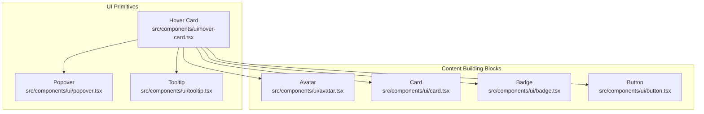
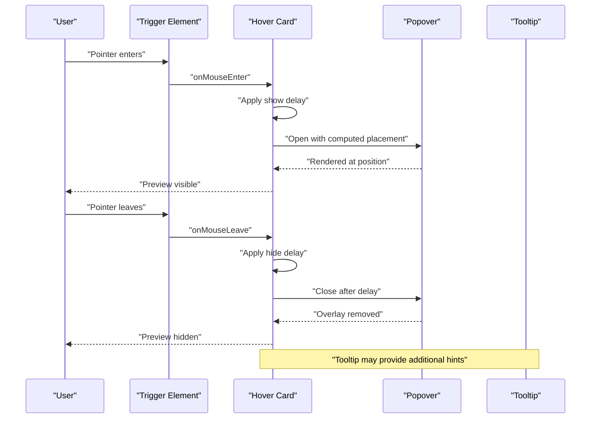
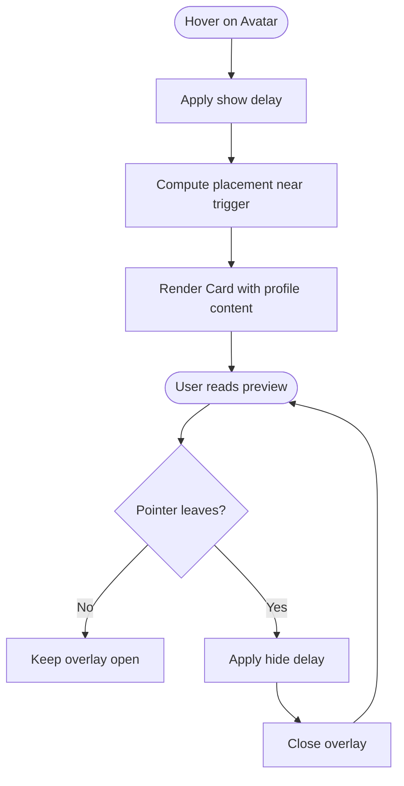
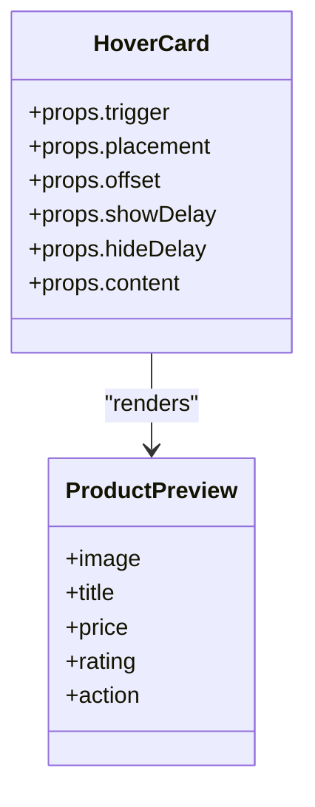
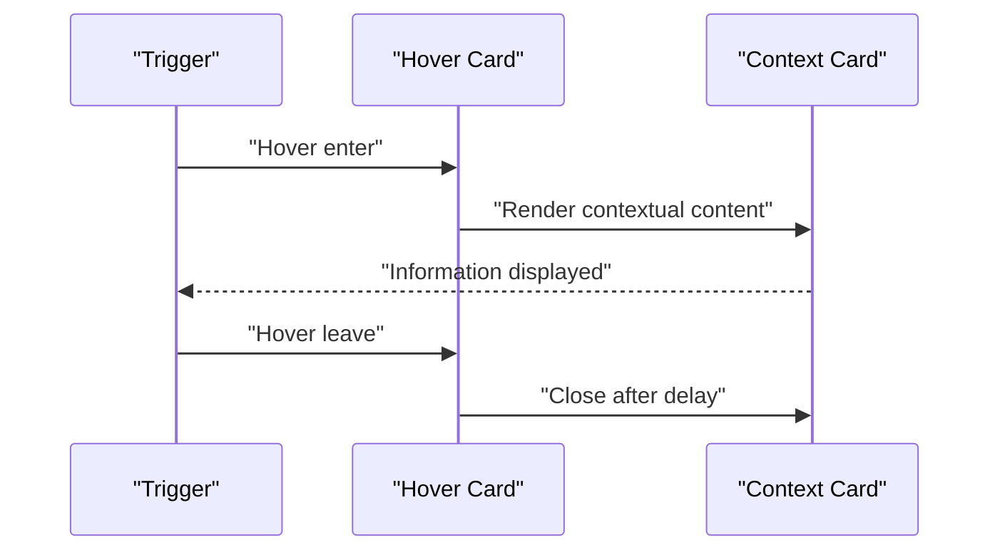
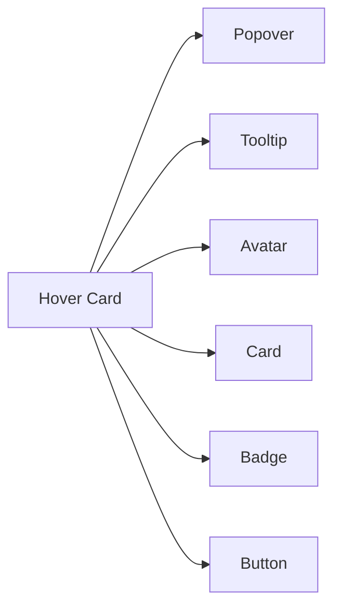

# Hover Card Component

<cite>
**Referenced Files in This Document**
- [hover-card.tsx](file://src/components/ui/hover-card.tsx)
- [popover.tsx](file://src/components/ui/popover.tsx)
- [tooltip.tsx](file://src/components/ui/tooltip.tsx)
- [avatar.tsx](file://src/components/ui/avatar.tsx)
- [card.tsx](file://src/components/ui/card.tsx)
- [badge.tsx](file://src/components/ui/badge.tsx)
- [button.tsx](file://src/components/ui/button.tsx)
</cite>

## Table of Contents
1. [Introduction](#introduction)
2. [Project Structure](#project-structure)
3. [Core Components](#core-components)
4. [Architecture Overview](#architecture-overview)
5. [Detailed Component Analysis](#detailed-component-analysis)
6. [Dependency Analysis](#dependency-analysis)
7. [Performance Considerations](#performance-considerations)
8. [Troubleshooting Guide](#troubleshooting-guide)
9. [Conclusion](#conclusion)
10. [Appendices](#appendices)

## Introduction
This document provides comprehensive documentation for the Hover Card component, focusing on hover-triggered card display, positioning relative to trigger elements, and content preview patterns. It covers usage examples such as user profile previews, product cards, and contextual information displays. The guide also documents props for hover behavior, animation settings, and content customization, along with considerations for hover timing, mouse leave handling, and mobile touch interactions. Accessibility guidelines for keyboard-triggered hover cards and screen reader support are included to ensure inclusive experiences.

## Project Structure
The Hover Card is implemented as a UI primitive within the shared components library. It composes lower-level primitives like Popover and Tooltip to deliver a consistent hover-to-show experience. Related UI building blocks such as Avatar, Card, Badge, and Button are commonly used to construct rich preview content inside the Hover Card.

**Diagram sources**
- [hover-card.tsx](file://src/components/ui/hover-card.tsx)
- [popover.tsx](file://src/components/ui/popover.tsx)
- [tooltip.tsx](file://src/components/ui/tooltip.tsx)
- [avatar.tsx](file://src/components/ui/avatar.tsx)
- [card.tsx](file://src/components/ui/card.tsx)
- [badge.tsx](file://src/components/ui/badge.tsx)
- [button.tsx](file://src/components/ui/button.tsx)

**Section sources**
- [hover-card.tsx](file://src/components/ui/hover-card.tsx)
- [popover.tsx](file://src/components/ui/popover.tsx)
- [tooltip.tsx](file://src/components/ui/tooltip.tsx)
- [avatar.tsx](file://src/components/ui/avatar.tsx)
- [card.tsx](file://src/components/ui/card.tsx)
- [badge.tsx](file://src/components/ui/badge.tsx)
- [button.tsx](file://src/components/ui/button.tsx)

## Core Components
- Hover Card: A lightweight overlay that appears when the user hovers over a trigger element. It supports configurable placement, offset, collision handling, and optional delay before showing or hiding.
- Popover: Provides the underlying floating container and positioning logic used by Hover Card.
- Tooltip: Supplies lightweight hints and can be composed with Hover Card for additional context.
- Content Primitives: Avatar, Card, Badge, and Button are frequently used to compose rich preview content inside the Hover Card.

Key responsibilities:
- Trigger management: Detecting hover enter/leave events and managing visibility state.
- Positioning: Computing placement relative to the trigger while respecting viewport boundaries.
- Timing: Configurable show/hide delays to prevent flicker during rapid pointer movements.
- Accessibility: Ensuring focus and keyboard interaction patterns align with accessible overlay behaviors.

**Section sources**
- [hover-card.tsx](file://src/components/ui/hover-card.tsx)
- [popover.tsx](file://src/components/ui/popover.tsx)
- [tooltip.tsx](file://src/components/ui/tooltip.tsx)
- [avatar.tsx](file://src/components/ui/avatar.tsx)
- [card.tsx](file://src/components/ui/card.tsx)
- [badge.tsx](file://src/components/ui/badge.tsx)
- [button.tsx](file://src/components/ui/button.tsx)

## Architecture Overview
The Hover Card composes Popover for floating behavior and Tooltip for hint-like interactions. It encapsulates hover event handling, timing, and positioning, exposing a simple API for consumers to render arbitrary preview content.

**Diagram sources**
- [hover-card.tsx](file://src/components/ui/hover-card.tsx)
- [popover.tsx](file://src/components/ui/popover.tsx)
- [tooltip.tsx](file://src/components/ui/tooltip.tsx)

## Detailed Component Analysis

### Hover Card Behavior and Props
- Trigger: Any interactive element (e.g., avatar, button, text) can serve as the hover target.
- Placement: Supports common placements around the trigger (top, bottom, left, right) with alignment options.
- Offset: Controls distance between trigger and overlay.
- Collision Handling: Automatically adjusts placement to avoid clipping at viewport edges.
- Delay: Configurable show and hide delays to reduce accidental toggles.
- Animation: Optional fade/scale transitions controlled via CSS classes or style props.
- Content: Accepts any React node; typical content includes profiles, product summaries, or contextual info.
- Mobile Touch: On touch devices, consider tap-to-open behavior or fallback to click since hover semantics differ.

Implementation notes:
- Hover Card leverages Popover’s positioning engine to compute coordinates and handle collisions.
- Tooltip can be used alongside Hover Card to provide concise hints without duplicating layout logic.
- Focus management should ensure that moving focus into the overlay keeps it open and closing occurs appropriately when focus leaves.

**Section sources**
- [hover-card.tsx](file://src/components/ui/hover-card.tsx)
- [popover.tsx](file://src/components/ui/popover.tsx)
- [tooltip.tsx](file://src/components/ui/tooltip.tsx)

### User Profile Preview Example
Use cases:
- Display avatar, name, role, and quick actions when hovering over a team member’s avatar.
- Include status indicators and contact links.

Composition pattern:
- Trigger: Avatar component
- Overlay: Card containing profile details and action buttons
- Enhancements: Badge for status, Button for quick actions

**Diagram sources**
- [hover-card.tsx](file://src/components/ui/hover-card.tsx)
- [avatar.tsx](file://src/components/ui/avatar.tsx)
- [card.tsx](file://src/components/ui/card.tsx)
- [badge.tsx](file://src/components/ui/badge.tsx)
- [button.tsx](file://src/components/ui/button.tsx)

**Section sources**
- [hover-card.tsx](file://src/components/ui/hover-card.tsx)
- [avatar.tsx](file://src/components/ui/avatar.tsx)
- [card.tsx](file://src/components/ui/card.tsx)
- [badge.tsx](file://src/components/ui/badge.tsx)
- [button.tsx](file://src/components/ui/button.tsx)

### Product Card Preview Example
Use cases:
- Show thumbnail, title, price, rating, and add-to-cart action when hovering over a product item.

Composition pattern:
- Trigger: Product row or thumbnail
- Overlay: Card with image, metadata, and primary action
- Enhancements: Badge for sale/discount, Button for quick actions

**Diagram sources**
- [hover-card.tsx](file://src/components/ui/hover-card.tsx)
- [card.tsx](file://src/components/ui/card.tsx)
- [badge.tsx](file://src/components/ui/badge.tsx)
- [button.tsx](file://src/components/ui/button.tsx)

**Section sources**
- [hover-card.tsx](file://src/components/ui/hover-card.tsx)
- [card.tsx](file://src/components/ui/card.tsx)
- [badge.tsx](file://src/components/ui/badge.tsx)
- [button.tsx](file://src/components/ui/button.tsx)

### Contextual Information Display Example
Use cases:
- Provide definitions, tips, or related links when hovering over terms or icons.

Composition pattern:
- Trigger: Icon or inline text
- Overlay: Compact Card with explanatory text and optional links
- Enhancements: Tooltip for short hints, Badge for labels

**Diagram sources**
- [hover-card.tsx](file://src/components/ui/hover-card.tsx)
- [card.tsx](file://src/components/ui/card.tsx)
- [tooltip.tsx](file://src/components/ui/tooltip.tsx)

**Section sources**
- [hover-card.tsx](file://src/components/ui/hover-card.tsx)
- [card.tsx](file://src/components/ui/card.tsx)
- [tooltip.tsx](file://src/components/ui/tooltip.tsx)

### Accessibility Guidelines
Keyboard interaction:
- Ensure the trigger is focusable and responds to Enter/Space to open the overlay when appropriate.
- When focus moves into the overlay, keep it open; close when focus leaves both trigger and overlay.
- Provide a clear way to dismiss the overlay via Escape key.

Screen reader support:
- Use descriptive aria attributes on the trigger and overlay (e.g., aria-haspopup, aria-expanded).
- Announce changes in overlay state if necessary using live regions sparingly.
- Avoid relying solely on color or motion to convey meaning; include text alternatives.

Focus management:
- Move focus to the first actionable element inside the overlay when opened via keyboard.
- Trap focus within the overlay until dismissed.

Mobile considerations:
- Since hover is not available on touch devices, provide an alternative activation method (tap/click).
- Respect reduced motion preferences for animations.

**Section sources**
- [hover-card.tsx](file://src/components/ui/hover-card.tsx)
- [popover.tsx](file://src/components/ui/popover.tsx)
- [tooltip.tsx](file://src/components/ui/tooltip.tsx)

## Dependency Analysis
Hover Card depends on Popover for floating behavior and positioning, and optionally Tooltip for lightweight hints. It composes common UI primitives to build rich content.

**Diagram sources**
- [hover-card.tsx](file://src/components/ui/hover-card.tsx)
- [popover.tsx](file://src/components/ui/popover.tsx)
- [tooltip.tsx](file://src/components/ui/tooltip.tsx)
- [avatar.tsx](file://src/components/ui/avatar.tsx)
- [card.tsx](file://src/components/ui/card.tsx)
- [badge.tsx](file://src/components/ui/badge.tsx)
- [button.tsx](file://src/components/ui/button.tsx)

**Section sources**
- [hover-card.tsx](file://src/components/ui/hover-card.tsx)
- [popover.tsx](file://src/components/ui/popover.tsx)
- [tooltip.tsx](file://src/components/ui/tooltip.tsx)
- [avatar.tsx](file://src/components/ui/avatar.tsx)
- [card.tsx](file://src/components/ui/card.tsx)
- [badge.tsx](file://src/components/ui/badge.tsx)
- [button.tsx](file://src/components/ui/button.tsx)

## Performance Considerations
- Debounce hover events: Apply small show/hide delays to prevent flicker during rapid pointer movements.
- Minimize re-renders: Keep overlay content lightweight; defer heavy computations until the overlay opens.
- Avoid expensive layouts: Prefer static content or lazy-loaded content for large overlays.
- Respect reduced motion: Disable animations when users prefer reduced motion.
- Optimize positioning: Use efficient placement calculations and avoid unnecessary recalculation on scroll.

[No sources needed since this section provides general guidance]

## Troubleshooting Guide
Common issues and resolutions:
- Overlay does not appear on mobile: Implement tap/click fallback for touch devices.
- Flickering on fast mouse movement: Increase show/hide delays slightly.
- Overlay clipped at viewport edges: Verify collision handling and adjust offset/placement.
- Focus escapes overlay: Ensure focus trapping and proper dismissal on Escape.
- Screen readers do not announce state: Add appropriate aria attributes and manage expanded state.

**Section sources**
- [hover-card.tsx](file://src/components/ui/hover-card.tsx)
- [popover.tsx](file://src/components/ui/popover.tsx)
- [tooltip.tsx](file://src/components/ui/tooltip.tsx)

## Conclusion
The Hover Card component offers a flexible, accessible, and performant way to present contextual previews triggered by hover. By composing Popover and Tooltip with familiar UI primitives, it enables rich content patterns such as user profiles, product cards, and contextual information. Proper attention to timing, positioning, accessibility, and mobile interactions ensures a robust user experience across devices and assistive technologies.

[No sources needed since this section summarizes without analyzing specific files]

## Appendices

### Quick Reference: Typical Props and Usage Patterns
- Trigger: Any focusable element
- Placement: top | bottom | left | right (with alignment variants)
- Offset: Number controlling distance from trigger
- Show Delay: Milliseconds before opening
- Hide Delay: Milliseconds before closing
- Content: ReactNode for preview content
- Animation: Enable/disable transitions based on preference

[No sources needed since this section provides general guidance]