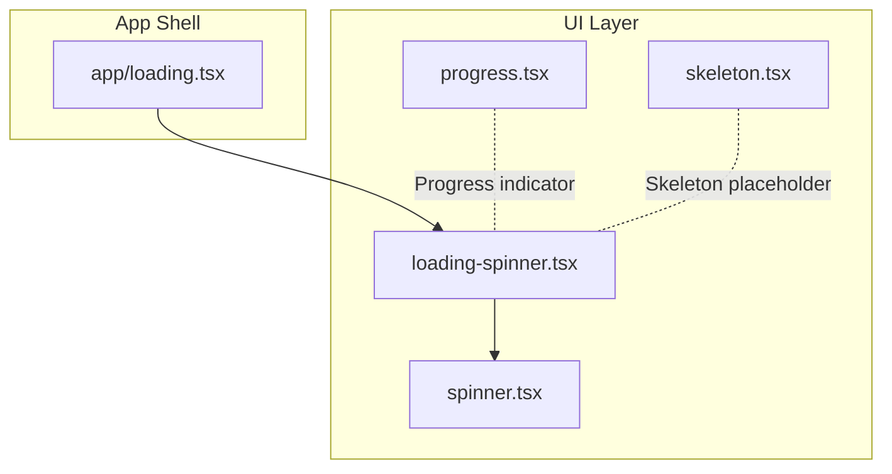
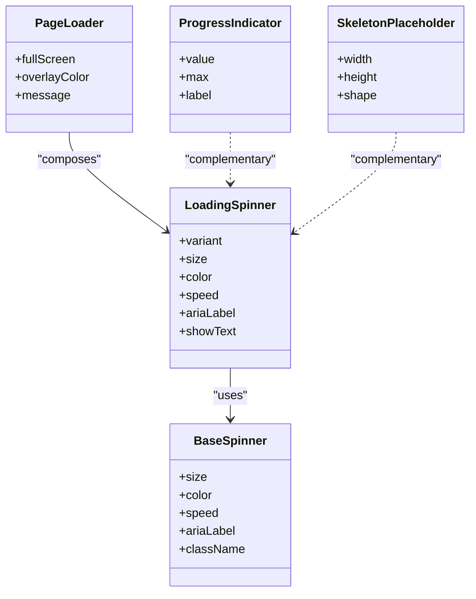
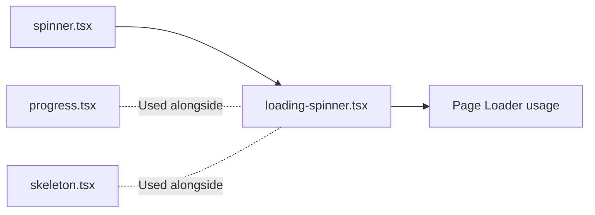

# Loading Spinner Component

<cite>
**Referenced Files in This Document**
- [loading-spinner.tsx](file://src/components/ui/loading-spinner.tsx)
- [spinner.tsx](file://src/components/ui/spinner.tsx)
- [progress.tsx](file://src/components/ui/progress.tsx)
- [skeleton.tsx](file://src/components/ui/skeleton.tsx)
- [loading.tsx](file://src/app/loading.tsx)
</cite>

## Table of Contents
1. [Introduction](#introduction)
2. [Project Structure](#project-structure)
3. [Core Components](#core-components)
4. [Architecture Overview](#architecture-overview)
5. [Detailed Component Analysis](#detailed-component-analysis)
6. [Dependency Analysis](#dependency-analysis)
7. [Performance Considerations](#performance-considerations)
8. [Troubleshooting Guide](#troubleshooting-guide)
9. [Conclusion](#conclusion)
10. [Appendices](#appendices)

## Introduction
This document provides comprehensive documentation for the Loading Spinner component and related loading primitives in the project. It covers spinner variants, animation styles, size options, props for customization (including animation speed and color themes), accessibility guidance with ARIA labels and screen reader announcements, placement guidelines, performance considerations, infinite loading patterns, skeleton loading states, and progressive loading techniques. The goal is to help developers implement consistent, accessible, and performant loading experiences across the application.

## Project Structure
The loading-related UI components are organized under the shared UI layer:
- Inline spinner and page-level loader components live in src/components/ui.
- Progress indicators and skeleton placeholders are also provided as reusable primitives.
- Application-level global loading is implemented via a Next.js route-level loading file.

**Diagram sources**
- [loading-spinner.tsx](file://src/components/ui/loading-spinner.tsx)
- [spinner.tsx](file://src/components/ui/spinner.tsx)
- [progress.tsx](file://src/components/ui/progress.tsx)
- [skeleton.tsx](file://src/components/ui/skeleton.tsx)
- [loading.tsx](file://src/app/loading.tsx)

**Section sources**
- [loading-spinner.tsx](file://src/components/ui/loading-spinner.tsx)
- [spinner.tsx](file://src/components/ui/spinner.tsx)
- [progress.tsx](file://src/components/ui/progress.tsx)
- [skeleton.tsx](file://src/components/ui/skeleton.tsx)
- [loading.tsx](file://src/app/loading.tsx)

## Core Components
- Inline Spinner: Lightweight, inline-only spinner suitable for buttons, small areas, or text flows.
- Page Loader: Full-screen or container-level loader used during navigation or heavy data fetches.
- Progress Indicator: Determinate progress bar for known-duration operations.
- Skeleton Placeholder: Static layout placeholders that mimic content structure while data loads.

These components share common styling tokens (colors, sizes, animation durations) and follow consistent accessibility practices.

**Section sources**
- [loading-spinner.tsx](file://src/components/ui/loading-spinner.tsx)
- [spinner.tsx](file://src/components/ui/spinner.tsx)
- [progress.tsx](file://src/components/ui/progress.tsx)
- [skeleton.tsx](file://src/components/ui/skeleton.tsx)

## Architecture Overview
The loading system is composed of a base spinner primitive and higher-level wrappers:
- Base spinner defines core animation, sizing, and color behavior.
- Loading spinner wraps the base spinner with additional semantics and convenience props.
- Page loader composes the loading spinner within a full-page overlay.
- Progress and skeleton components complement spinners by indicating determinate progress and structural placeholders.

**Diagram sources**
- [spinner.tsx](file://src/components/ui/spinner.tsx)
- [loading-spinner.tsx](file://src/components/ui/loading-spinner.tsx)
- [progress.tsx](file://src/components/ui/progress.tsx)
- [skeleton.tsx](file://src/components/ui/skeleton.tsx)

## Detailed Component Analysis

### Base Spinner
Purpose:
- Renders a rotating ring or dot animation.
- Provides size, color, and speed controls.
- Exposes ARIA attributes for accessibility.

Key props:
- size: Controls visual scale (e.g., small, medium, large).
- color: Accepts theme-aware colors or CSS variables.
- speed: Animation duration control (fast, normal, slow).
- ariaLabel: Screen reader announcement text.
- className: Additional styling hooks.

Animation styles:
- Uses CSS keyframes for rotation or opacity transitions.
- Respects prefers-reduced-motion when available.

Accessibility:
- role="status" and aria-live="polite" for non-intrusive updates.
- aria-label conveys purpose to assistive technologies.

Usage examples:
- Inline inside buttons or small containers.
- As part of larger composite loaders.

**Section sources**
- [spinner.tsx](file://src/components/ui/spinner.tsx)

### Loading Spinner
Purpose:
- Higher-level wrapper around the base spinner.
- Adds variant-specific behaviors (e.g., inline vs. centered).
- Optional text label for context.

Key props:
- variant: Inline, centered, or overlay modes.
- size: Inherits from base spinner.
- color: Theme-aware color selection.
- speed: Animation timing control.
- ariaLabel: Custom screen reader message.
- showText: Toggle visible label alongside spinner.

Common use cases:
- Inline feedback during async actions.
- Centered feedback in modals or cards.

**Section sources**
- [loading-spinner.tsx](file://src/components/ui/loading-spinner.tsx)

### Page Loader
Purpose:
- Displays a full-screen or container-level overlay while content loads.
- Often used during route transitions or initial data fetching.

Key props:
- fullScreen: Whether to cover the entire viewport.
- overlayColor: Background tint behind the spinner.
- message: Optional descriptive text for users.

Integration points:
- Used in app-level loading files for route transitions.
- Can be wrapped around specific sections for partial loading.

**Section sources**
- [loading.tsx](file://src/app/loading.tsx)
- [loading-spinner.tsx](file://src/components/ui/loading-spinner.tsx)

### Progress Indicator
Purpose:
- Shows determinate progress for known-duration tasks.
- Complements spinners by providing quantitative feedback.

Key props:
- value: Current progress amount.
- max: Maximum progress value.
- label: Accessible label describing progress.

When to use:
- File uploads, long-running operations with estimated completion.

**Section sources**
- [progress.tsx](file://src/components/ui/progress.tsx)

### Skeleton Placeholder
Purpose:
- Renders static shapes that mimic content layout.
- Improves perceived performance by reducing layout shifts.

Key props:
- width, height: Dimensions of the skeleton block.
- shape: Rounded, rectangular, or circular forms.

When to use:
- List items, cards, tables, and rich content blocks.

**Section sources**
- [skeleton.tsx](file://src/components/ui/skeleton.tsx)

## Dependency Analysis
- loading-spinner depends on the base spinner for rendering and animation.
- Page loader composes the loading spinner and may apply overlay styles.
- Progress and skeleton components are independent but often used together with spinners to provide richer loading UX.

**Diagram sources**
- [spinner.tsx](file://src/components/ui/spinner.tsx)
- [loading-spinner.tsx](file://src/components/ui/loading-spinner.tsx)
- [progress.tsx](file://src/components/ui/progress.tsx)
- [skeleton.tsx](file://src/components/ui/skeleton.tsx)

**Section sources**
- [spinner.tsx](file://src/components/ui/spinner.tsx)
- [loading-spinner.tsx](file://src/components/ui/loading-spinner.tsx)
- [progress.tsx](file://src/components/ui/progress.tsx)
- [skeleton.tsx](file://src/components/ui/skeleton.tsx)

## Performance Considerations
- Prefer lightweight inline spinners for short-lived interactions; avoid heavy overlays unless necessary.
- Use skeleton placeholders to reduce layout shift and improve perceived performance.
- Respect user motion preferences by honoring reduced motion settings where supported.
- Avoid animating large surfaces; keep animations confined to small elements.
- Debounce frequent state changes to prevent excessive re-renders.
- For infinite lists, combine skeleton placeholders with incremental loading to maintain smooth scrolling.

[No sources needed since this section provides general guidance]

## Troubleshooting Guide
Common issues and resolutions:
- Spinner not visible: Ensure parent container has sufficient contrast and does not override color tokens.
- Animation too fast/slow: Adjust speed prop to match interaction expectations.
- Accessibility warnings: Provide aria-label and ensure aria-live regions are used appropriately.
- Layout shift during load: Replace content with skeleton placeholders before data arrives.
- Overlapping loaders: Use a single page loader for route transitions instead of multiple nested spinners.

**Section sources**
- [loading-spinner.tsx](file://src/components/ui/loading-spinner.tsx)
- [spinner.tsx](file://src/components/ui/spinner.tsx)
- [progress.tsx](file://src/components/ui/progress.tsx)
- [skeleton.tsx](file://src/components/ui/skeleton.tsx)

## Conclusion
The loading spinner system offers flexible, accessible, and performant primitives for indicating loading states. By combining inline spinners, page loaders, progress indicators, and skeleton placeholders, teams can craft consistent user experiences across diverse scenarios. Adhering to the recommended props, accessibility practices, and performance guidelines ensures reliable and inclusive loading feedback.

[No sources needed since this section summarizes without analyzing specific files]

## Appendices

### Props Reference Summary
- Base Spinner
  - size: small | medium | large
  - color: theme token or CSS variable
  - speed: fast | normal | slow
  - ariaLabel: string
  - className: string
- Loading Spinner
  - variant: inline | centered | overlay
  - size: inherits
  - color: inherits
  - speed: inherits
  - ariaLabel: string
  - showText: boolean
- Page Loader
  - fullScreen: boolean
  - overlayColor: string
  - message: string
- Progress Indicator
  - value: number
  - max: number
  - label: string
- Skeleton Placeholder
  - width: number|string
  - height: number|string
  - shape: rounded | rectangle | circle

[No sources needed since this section aggregates previously analyzed props]

### Accessibility Guidelines
- Always include an aria-label describing the loading action.
- Use role="status" and aria-live="polite" for non-blocking updates.
- Provide visible text when appropriate to aid sighted users.
- Honor reduced motion preferences to minimize jarring animations.

[No sources needed since this section provides general guidance]

### Placement and Usage Patterns
- Inline: Place within buttons, tabs, or list item actions.
- Centered: Use in modals, empty states, or card bodies.
- Page-level: Wrap routes or critical sections during navigation or heavy data loads.
- Infinite lists: Combine skeletons with incremental fetches to maintain scroll performance.

[No sources needed since this section provides general guidance]

### Example Scenarios
- Inline spinner in a submit button during form submission.
- Page loader during route transitions using the app-level loading file.
- Progress indicator for file upload with percentage updates.
- Skeleton placeholders for dashboard cards while metrics load.

[No sources needed since this section provides general guidance]