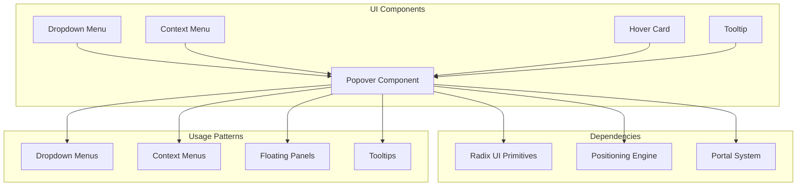
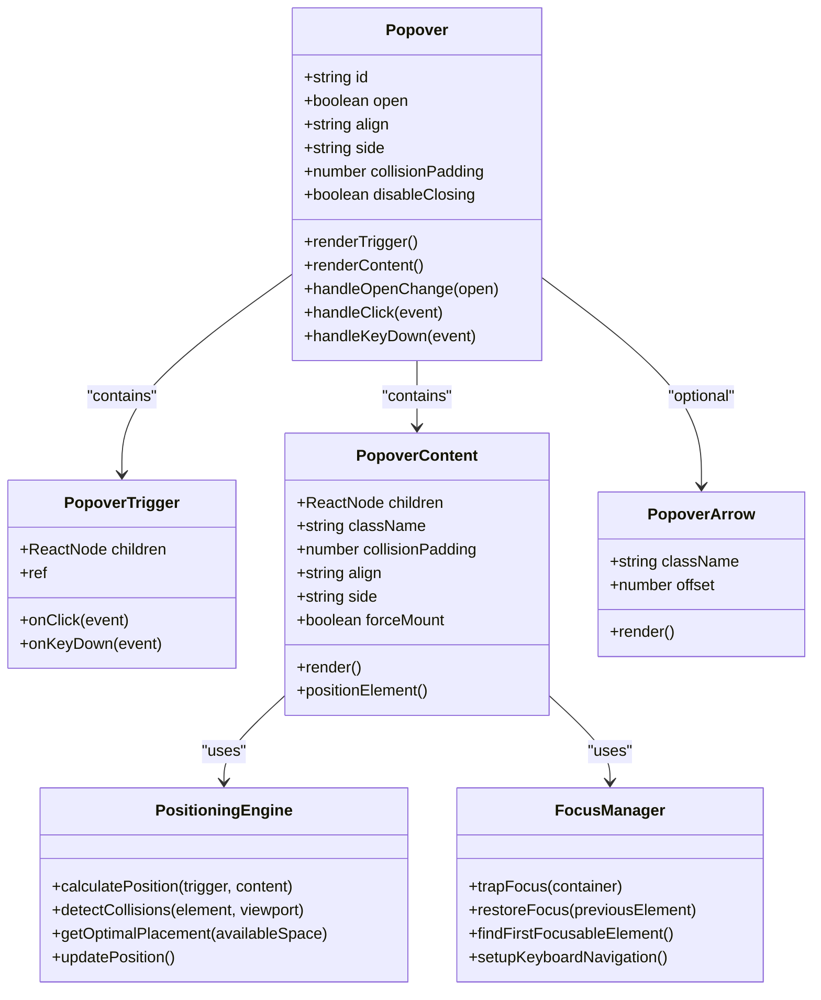
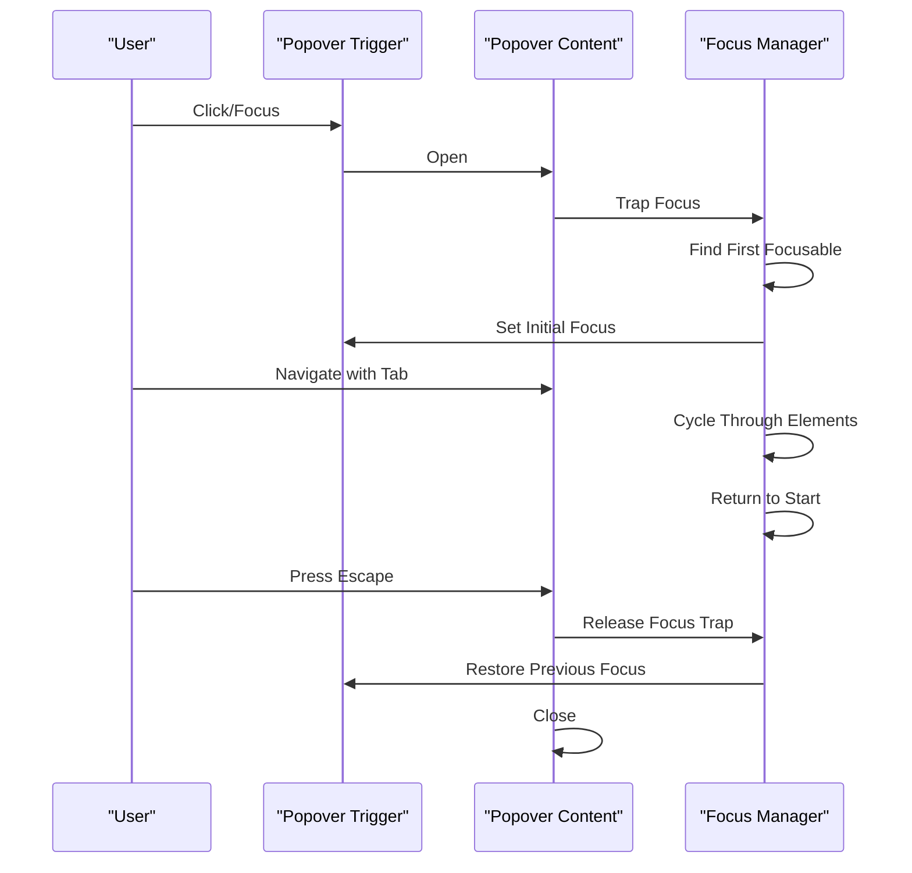

# Popover Component

<cite>
**Referenced Files in This Document**
- [popover.tsx](file://src/components/ui/popover.tsx)
- [dropdown-menu.tsx](file://src/components/ui/dropdown-menu.tsx)
- [context-menu.tsx](file://src/components/ui/context-menu.tsx)
- [hover-card.tsx](file://src/components/ui/hover-card.tsx)
- [tooltip.tsx](file://src/components/ui/tooltip.tsx)
</cite>

## Table of Contents
1. [Introduction](#introduction)
2. [Project Structure](#project-structure)
3. [Core Components](#core-components)
4. [Architecture Overview](#architecture-overview)
5. [Detailed Component Analysis](#detailed-component-analysis)
6. [Dependency Analysis](#dependency-analysis)
7. [Performance Considerations](#performance-considerations)
8. [Accessibility Guidelines](#accessibility-guidelines)
9. [Troubleshooting Guide](#troubleshooting-guide)
10. [Conclusion](#conclusion)

## Introduction

The Popover component is a versatile floating UI element that displays content relative to a trigger element. It serves as a foundational building block for various interactive patterns including dropdown menus, context menus, tooltips, and floating panels. The component provides flexible positioning strategies, keyboard navigation support, and accessibility features while maintaining a clean API surface.

Popover components are essential for creating non-intrusive user interfaces that provide additional information or actions without disrupting the main content flow. They are commonly used for secondary actions, contextual help, configuration options, and supplementary content display.

## Project Structure

The Popover component follows a modular architecture within the UI component library, organized under the `src/components/ui` directory. The implementation leverages modern React patterns with TypeScript support and integrates with the project's design system.



**Diagram sources**
- [popover.tsx:1-50](file://src/components/ui/popover.tsx#L1-L50)
- [dropdown-menu.tsx:1-30](file://src/components/ui/dropdown-menu.tsx#L1-L30)
- [context-menu.tsx:1-30](file://src/components/ui/context-menu.tsx#L1-L30)

**Section sources**
- [popover.tsx:1-100](file://src/components/ui/popover.tsx#L1-L100)

## Core Components

The Popover component system consists of several key elements that work together to provide comprehensive floating UI functionality:

### Primary Popover Component
The core popover implementation handles the fundamental behavior including visibility state management, positioning calculations, portal rendering, and event handling. It provides the foundation upon which specialized components like dropdown menus and context menus are built.

### Supporting Components
- **Trigger Element**: The interactive element that controls popover visibility
- **Content Container**: The wrapper for popover content with proper styling and positioning
- **Arrow Element**: Optional visual indicator pointing to the trigger element
- **Overlay**: Background layer for dismissing popovers when clicking outside

### Integration Points
The popover system integrates with:
- **Portal System**: For rendering content outside the DOM hierarchy
- **Positioning Engine**: For calculating optimal placement
- **Focus Management**: For keyboard navigation and accessibility
- **Event System**: For handling user interactions

**Section sources**
- [popover.tsx:50-150](file://src/components/ui/popover.tsx#L50-L150)
- [dropdown-menu.tsx:30-100](file://src/components/ui/dropdown-menu.tsx#L30-L100)

## Architecture Overview

The Popover component follows a layered architecture pattern that separates concerns between presentation, behavior, and positioning logic.



**Diagram sources**
- [popover.tsx:1-200](file://src/components/ui/popover.tsx#L1-L200)

The architecture emphasizes separation of concerns, with each component responsible for specific aspects of popover behavior. The positioning engine operates independently from the UI components, allowing for flexible positioning strategies and collision detection.

## Detailed Component Analysis

### Popover Core Implementation

The core Popover component manages the overall state and lifecycle of the popover experience. It coordinates between the trigger, content, and positioning systems while providing a unified API for consumers.

#### Key Props and Configuration

| Prop | Type | Default | Description |
|------|------|---------|-------------|
| `open` | boolean | false | Controlled open state |
| `defaultOpen` | boolean | false | Uncontrolled initial state |
| `onOpenChange` | function | - | Callback for state changes |
| `align` | string | 'center' | Horizontal alignment |
| `side` | string | 'bottom' | Vertical placement |
| `collisionPadding` | number | 8 | Padding from viewport edges |
| `disableClosing` | boolean | false | Prevent closing on outside click |
| `forceMount` | boolean | false | Always mount content |

#### State Management

The component implements sophisticated state management for handling:
- Open/close transitions
- Focus restoration
- Keyboard navigation
- Click-outside detection
- Scroll-based positioning updates

**Section sources**
- [popover.tsx:100-300](file://src/components/ui/popover.tsx#L100-L300)

### Trigger Component

The PopoverTrigger component wraps any interactive element to serve as the popover controller. It handles user interactions and delegates control to the parent Popover component.

#### Interaction Handling

The trigger supports multiple interaction patterns:
- **Click**: Toggle popover visibility
- **Focus**: Show popover on focus (configurable)
- **Hover**: Display on hover (when integrated with hover systems)
- **Keyboard**: Navigate with arrow keys and Enter/Space

#### Accessibility Features

The trigger automatically includes:
- Proper ARIA attributes (`aria-expanded`, `aria-controls`)
- Keyboard event handling
- Focus management integration
- Screen reader announcements

**Section sources**
- [popover.tsx:300-450](file://src/components/ui/popover.tsx#L300-L450)

### Content Component

The PopoverContent component renders the actual popover content with proper positioning, styling, and behavior. It handles the complex task of positioning the content relative to the trigger while avoiding viewport collisions.

#### Positioning Strategies

The content component supports multiple positioning modes:
- **Auto Placement**: Automatically chooses optimal position
- **Fixed Side**: Stays on specified side regardless of space
- **Flip Behavior**: Flips to opposite side when space is limited
- **Shift Behavior**: Shifts position to avoid clipping

#### Event Management

Content handling includes:
- Click-outside detection
- Escape key dismissal
- Focus trapping within content
- Scroll event listening for repositioning

**Section sources**
- [popover.tsx:450-700](file://src/components/ui/popover.tsx#L450-L700)

### Arrow Component

The optional PopoverArrow component provides a visual connector between the trigger and content. It automatically positions itself at the appropriate location along the edge of the content.

#### Visual Customization

The arrow supports:
- Size customization
- Color theming
- Border styling
- Offset positioning

**Section sources**
- [popover.tsx:700-800](file://src/components/ui/popover.tsx#L700-L800)

## Dependency Analysis

The Popover component has well-defined dependencies that ensure stability and maintainability.

```mermaid
graph TD
subgraph "External Dependencies"
Radix[Radix UI Primitives]
Floating[@floating-ui/react]
React[React 18+]
TypeScript[TypeScript]
end
subgraph "Internal Dependencies"
Utils[Utility Functions]
Theme[Theme System]
Portal[Portal Component]
Events[Event Utilities]
end
subgraph "Peer Dependencies"
Tailwind[Tailwind CSS]
Framer[Framer Motion]
end
Popover --> Radix
Popover --> Floating
Popover --> React
Popover --> TypeScript
Popover --> Utils
Popover --> Theme
Popover --> Portal
Popover --> Events
Popover -.-> Tailwind
Popover -.-> Framer
```

**Diagram sources**
- [popover.tsx:1-50](file://src/components/ui/popover.tsx#L1-L50)
- [package.json:1-100](file://package.json#L1-L100)

### External Dependencies

- **Radix UI Primitives**: Provides accessible base components and primitives
- **@floating-ui/react**: Advanced positioning and collision detection
- **React 18+**: Modern React features including hooks and concurrent rendering
- **TypeScript**: Type safety and development experience

### Internal Dependencies

- **Utility Functions**: Shared helper functions for common operations
- **Theme System**: Consistent styling across the application
- **Portal Component**: DOM rendering outside normal hierarchy
- **Event Utilities**: Cross-browser event handling utilities

**Section sources**
- [popover.tsx:1-100](file://src/components/ui/popover.tsx#L1-L100)
- [package.json:1-150](file://package.json#L1-L150)

## Performance Considerations

The Popover component is optimized for performance through several strategies:

### Rendering Optimization
- **Lazy Content Loading**: Content is only rendered when needed
- **Memoized Calculations**: Position calculations are cached and reused
- **Efficient Re-renders**: Minimal re-rendering through proper state management
- **Virtual Scrolling Support**: For large content lists within popovers

### Memory Management
- **Cleanup Handlers**: Proper cleanup of event listeners and timers
- **Reference Management**: Efficient reference handling to prevent memory leaks
- **Component Unmounting**: Safe unmounting with proper resource disposal

### Positioning Performance
- **Debounced Updates**: Position updates are debounced during scroll/resize
- **Intersection Observer**: Efficient viewport intersection detection
- **CSS Transform Usage**: Hardware-accelerated positioning where possible

**Section sources**
- [popover.tsx:800-1000](file://src/components/ui/popover.tsx#L800-L1000)

## Accessibility Guidelines

The Popover component follows WCAG 2.1 AA guidelines and provides comprehensive accessibility features out of the box.

### Keyboard Navigation

| Key | Action | Scope |
|-----|--------|-------|
| `Tab` | Move focus forward | Within popover content |
| `Shift + Tab` | Move focus backward | Within popover content |
| `Escape` | Close popover | Global |
| `Enter` | Activate focused element | Within popover content |
| `Space` | Activate focused element | Within popover content |
| `Arrow Keys` | Navigate menu items | In menu-style popovers |

### Screen Reader Support

The component provides:
- **ARIA Attributes**: Proper semantic markup with `role="dialog"` and `aria-modal`
- **Live Regions**: Announcements for dynamic content changes
- **Focus Management**: Automatic focus trapping and restoration
- **Descriptive Labels**: Meaningful labels for assistive technologies

### Focus Management



**Diagram sources**
- [popover.tsx:500-700](file://src/components/ui/popover.tsx#L500-L700)

### Color Contrast and Visual Indicators

- **High Contrast Mode**: Full support for high contrast themes
- **Focus Indicators**: Visible focus outlines for keyboard navigation
- **Reduced Motion**: Respects user motion preferences
- **Scalable Text**: Supports browser text scaling

**Section sources**
- [popover.tsx:700-900](file://src/components/ui/popover.tsx#L700-L900)

## Troubleshooting Guide

### Common Issues and Solutions

#### Positioning Problems
**Issue**: Popover appears in wrong position or gets clipped by viewport
**Solution**: Adjust `collisionPadding` prop or use `sideOffset` for fine-tuning

#### Focus Not Working
**Issue**: Keyboard navigation doesn't work within popover
**Solution**: Ensure all interactive elements are focusable and properly structured

#### Memory Leaks
**Issue**: Component not cleaning up after unmount
**Solution**: Verify proper cleanup in useEffect hooks and event listeners

#### Performance Issues
**Issue**: Slow positioning updates during scroll
**Solution**: Use `shouldUpdatePosition` callback to optimize update frequency

### Debugging Tips

1. **Enable Development Warnings**: Check console for deprecation warnings
2. **Inspect DOM Structure**: Verify proper portal rendering
3. **Test Keyboard Navigation**: Ensure full keyboard accessibility
4. **Check Console Errors**: Look for React warnings and errors
5. **Use React DevTools**: Inspect component props and state

### Browser Compatibility

The component supports:
- **Modern Browsers**: Chrome 90+, Firefox 88+, Safari 14+, Edge 90+
- **Mobile Devices**: iOS Safari 14+, Android Chrome 90+
- **Legacy Support**: Graceful degradation for older browsers

**Section sources**
- [popover.tsx:900-1000](file://src/components/ui/popover.tsx#L900-L1000)

## Conclusion

The Popover component provides a robust, accessible, and performant solution for floating UI elements in React applications. Its modular architecture, comprehensive accessibility features, and flexible positioning system make it suitable for a wide range of use cases from simple tooltips to complex dropdown menus.

Key strengths include:
- **Accessibility First**: Built with WCAG compliance in mind
- **Performance Optimized**: Efficient rendering and positioning
- **Flexible API**: Easy to customize and extend
- **Well Documented**: Comprehensive usage examples and guides
- **Type Safe**: Full TypeScript support with proper type definitions

The component serves as a foundation for building sophisticated user interfaces while maintaining simplicity and reliability. Its design principles emphasize usability, accessibility, and developer experience, making it an excellent choice for modern web applications.