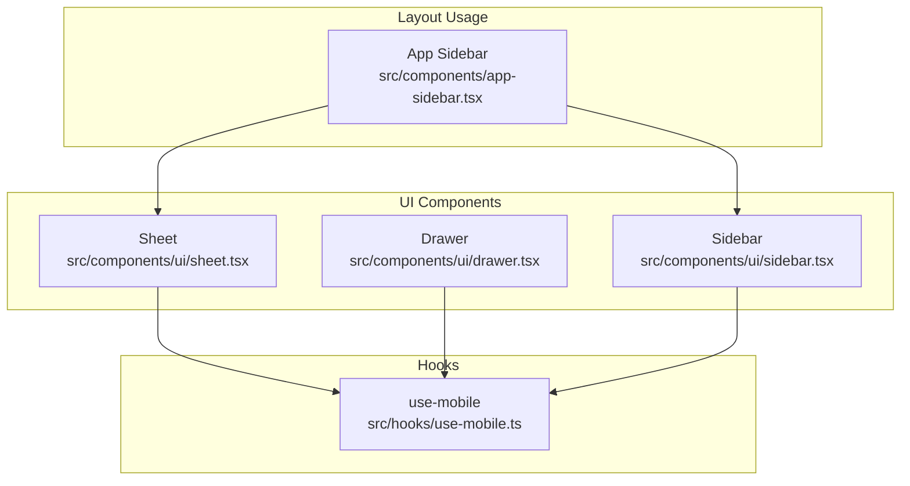
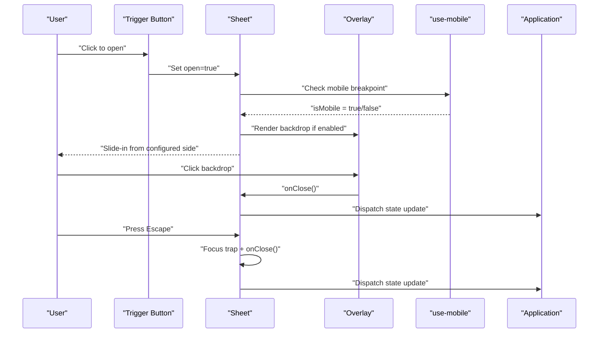
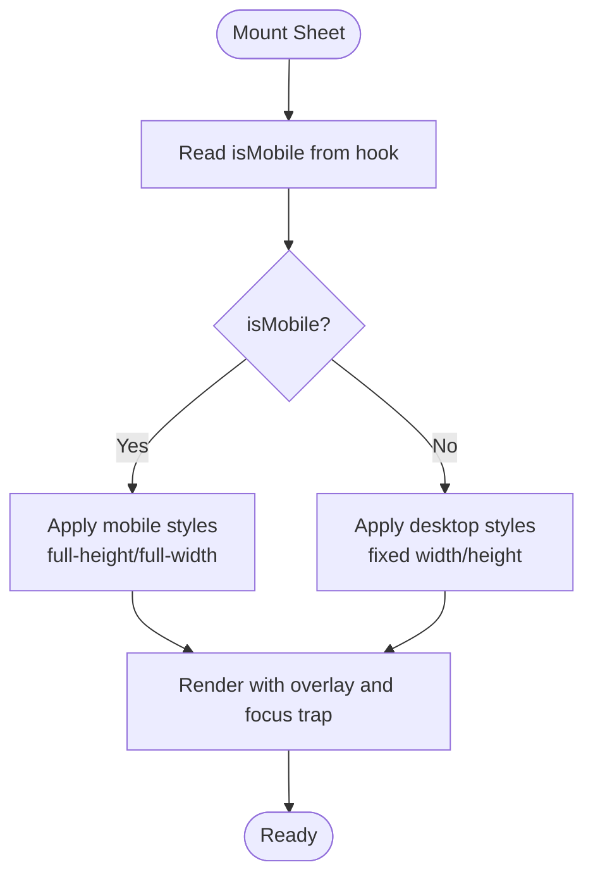
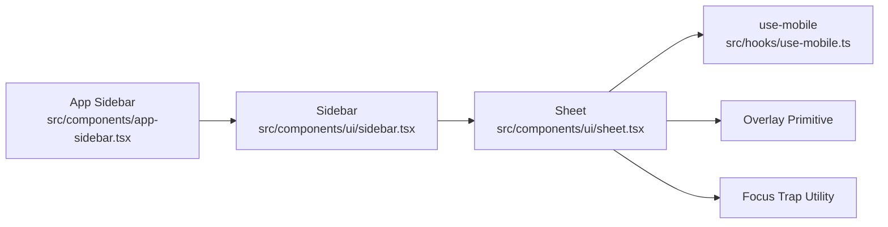

# Sheet Component

<cite>
**Referenced Files in This Document**
- [sheet.tsx](file://src/components/ui/sheet.tsx)
- [drawer.tsx](file://src/components/ui/drawer.tsx)
- [sidebar.tsx](file://src/components/ui/sidebar.tsx)
- [app-sidebar.tsx](file://src/components/app-sidebar.tsx)
- [use-mobile.ts](file://src/hooks/use-mobile.ts)
</cite>

## Table of Contents
1. [Introduction](#introduction)
2. [Project Structure](#project-structure)
3. [Core Components](#core-components)
4. [Architecture Overview](#architecture-overview)
5. [Detailed Component Analysis](#detailed-component-analysis)
6. [Dependency Analysis](#dependency-analysis)
7. [Performance Considerations](#performance-considerations)
8. [Troubleshooting Guide](#troubleshooting-guide)
9. [Conclusion](#conclusion)
10. [Appendices](#appendices)

## Introduction
This document provides comprehensive documentation for the Sheet component, focusing on slide-out panel behavior, positioning options (left, right, top, bottom), and overlay management. It also covers usage patterns such as side panels, drawer menus, and action sheets, along with props for control, animation settings, responsive behavior, touch gestures, swipe-to-dismiss, mobile optimization, and accessibility guidelines for screen readers and keyboard navigation.

## Project Structure
The Sheet implementation is located within the UI components directory and integrates with hooks for responsiveness and layout utilities. Related components include Drawer and Sidebar, which demonstrate common usage patterns.

**Diagram sources**
- [sheet.tsx](file://src/components/ui/sheet.tsx)
- [drawer.tsx](file://src/components/ui/drawer.tsx)
- [sidebar.tsx](file://src/components/ui/sidebar.tsx)
- [app-sidebar.tsx](file://src/components/app-sidebar.tsx)
- [use-mobile.ts](file://src/hooks/use-mobile.ts)

**Section sources**
- [sheet.tsx](file://src/components/ui/sheet.tsx)
- [drawer.tsx](file://src/components/ui/drawer.tsx)
- [sidebar.tsx](file://src/components/ui/sidebar.tsx)
- [app-sidebar.tsx](file://src/components/app-sidebar.tsx)
- [use-mobile.ts](file://src/hooks/use-mobile.ts)

## Core Components
- Sheet: A slide-out panel that can be positioned on left, right, top, or bottom. It manages open/close state, overlays, focus trapping, and animations.
- Drawer: A related component often used for full-height or full-width slides; it may share behaviors like overlay and gesture handling.
- Sidebar: A persistent or collapsible navigation panel that frequently uses Sheet under the hood for mobile views.

Key responsibilities:
- Control visibility via open/controlled state
- Manage overlay backdrop and click-to-close
- Handle keyboard interactions (Escape to close)
- Provide positioning variants (left/right/top/bottom)
- Support responsive behavior (mobile vs desktop)
- Enable swipe-to-dismiss where appropriate

**Section sources**
- [sheet.tsx](file://src/components/ui/sheet.tsx)
- [drawer.tsx](file://src/components/ui/drawer.tsx)
- [sidebar.tsx](file://src/components/ui/sidebar.tsx)

## Architecture Overview
The Sheet component composes lower-level primitives to deliver a consistent slide-out experience across devices. It coordinates with the mobile detection hook to adapt behavior and styling based on viewport size.

**Diagram sources**
- [sheet.tsx](file://src/components/ui/sheet.tsx)
- [use-mobile.ts](file://src/hooks/use-mobile.ts)

## Detailed Component Analysis

### Sheet Behavior and Positioning
- Slide-out directions: left, right, top, bottom
- Overlay: optional backdrop that dims content behind the sheet
- Focus management: traps focus inside the sheet when open; returns focus to trigger on close
- Keyboard support: Escape closes the sheet; Tab navigates within the sheet
- Animation: controlled by CSS transitions/animations tied to open state and direction

Positioning affects:
- Transform origin and translation axis
- Overlay placement and z-index layering
- Touch gesture direction for swipe-to-dismiss

**Section sources**
- [sheet.tsx](file://src/components/ui/sheet.tsx)

### Props for Sheet Control
Common props typically include:
- open: boolean to control visibility
- defaultOpen: initial open state for uncontrolled usage
- onOpenChange: callback invoked when open state changes
- side: one of left, right, top, bottom
- modal: whether to render an overlay and trap focus
- disableOutsidePointerEvents: prevent pointer events outside the sheet
- container: custom root container element
- className/style: customization hooks for styling

These props enable both controlled and uncontrolled usage patterns and allow integration with application state.

**Section sources**
- [sheet.tsx](file://src/components/ui/sheet.tsx)

### Animation Settings
Animation configuration usually includes:
- Duration and easing for slide transitions
- Direction-aware transforms
- Optional spring-like motion for smoother UX
- Respecting prefers-reduced-motion for accessibility

Animations are triggered by changes in open state and side prop.

**Section sources**
- [sheet.tsx](file://src/components/ui/sheet.tsx)

### Responsive Behavior
- Mobile-first approach: detect small screens using a breakpoint hook
- On mobile, prefer full-height or full-width slides depending on side
- On desktop, constrain width/height and position relative to viewport edges
- Use the mobile hook to toggle between drawer-like and panel-like behavior

**Diagram sources**
- [use-mobile.ts](file://src/hooks/use-mobile.ts)
- [sheet.tsx](file://src/components/ui/sheet.tsx)

**Section sources**
- [use-mobile.ts](file://src/hooks/use-mobile.ts)
- [sheet.tsx](file://src/components/ui/sheet.tsx)

### Touch Gestures and Swipe-to-Dismiss
- Gesture detection: track pointer/touch start, move, and end
- Thresholds: define minimum distance and velocity to dismiss
- Axis alignment: only respond to swipes aligned with the slide direction
- Momentum: optionally apply inertia for natural feel
- Accessibility: ensure gestures do not interfere with keyboard/screen reader users

Implementation considerations:
- Prevent default scrolling while dragging
- Debounce rapid gestures
- Cancel gestures on scroll or orientation change

**Section sources**
- [sheet.tsx](file://src/components/ui/sheet.tsx)

### Overlay Management
- Backdrop rendering: conditionally render overlay when modal is true
- Click-to-close: clicking the backdrop triggers onClose
- Z-index layering: ensure overlay sits below sheet but above app content
- Pointer events: disable pointer events outside the sheet when modal is active

**Section sources**
- [sheet.tsx](file://src/components/ui/sheet.tsx)

### Examples and Usage Patterns

#### Side Panels
Use case: contextual information or filters that slide in from left or right without blocking entire content.

Guidelines:
- Set side to left or right
- Keep width moderate for readability
- Ensure clear call-to-action buttons inside the panel

**Section sources**
- [sheet.tsx](file://src/components/ui/sheet.tsx)

#### Drawer Menus
Use case: primary navigation on mobile, sliding from the left or right.

Guidelines:
- Prefer full-height on mobile
- Include navigation links and user actions
- Close on item selection or backdrop click

**Section sources**
- [app-sidebar.tsx](file://src/components/app-sidebar.tsx)
- [sidebar.tsx](file://src/components/ui/sidebar.tsx)
- [sheet.tsx](file://src/components/ui/sheet.tsx)

#### Action Sheets
Use case: confirm destructive actions or present quick choices at the bottom of the screen.

Guidelines:
- Set side to bottom
- Keep height minimal and content concise
- Highlight destructive actions distinctly

**Section sources**
- [sheet.tsx](file://src/components/ui/sheet.tsx)

### Accessibility Guidelines
- Screen readers:
  - Use aria-modal="true" when modal is active
  - Announce open/close state changes to assistive technologies
  - Provide descriptive labels for triggers and actions
- Keyboard navigation:
  - Trap focus within the sheet while open
  - Return focus to the trigger on close
  - Allow Escape to close
  - Ensure logical tab order inside the sheet
- Reduced motion:
  - Respect prefers-reduced-motion to disable animations
- Color contrast:
  - Maintain sufficient contrast for text and interactive elements

**Section sources**
- [sheet.tsx](file://src/components/ui/sheet.tsx)

## Dependency Analysis
The Sheet component depends on:
- Mobile detection hook for responsive behavior
- Potentially shared UI primitives for overlay and focus management
- Layout utilities for positioning and z-index layering

**Diagram sources**
- [sheet.tsx](file://src/components/ui/sheet.tsx)
- [sidebar.tsx](file://src/components/ui/sidebar.tsx)
- [app-sidebar.tsx](file://src/components/app-sidebar.tsx)
- [use-mobile.ts](file://src/hooks/use-mobile.ts)

**Section sources**
- [sheet.tsx](file://src/components/ui/sheet.tsx)
- [sidebar.tsx](file://src/components/ui/sidebar.tsx)
- [app-sidebar.tsx](file://src/components/app-sidebar.tsx)
- [use-mobile.ts](file://src/hooks/use-mobile.ts)

## Performance Considerations
- Avoid re-rendering large subtrees by memoizing sheet content
- Defer heavy computations until the sheet opens
- Use CSS transforms and opacity for smooth animations
- Limit DOM nodes inside the sheet for better performance on low-end devices
- Optimize images and assets loaded within the sheet

[No sources needed since this section provides general guidance]

## Troubleshooting Guide
Common issues and resolutions:
- Sheet does not close on Escape:
  - Verify focus trap and keydown listener are attached
  - Ensure modal mode is enabled
- Overlay not clickable:
  - Check z-index stacking context
  - Confirm pointer-events are not disabled globally
- Swipe-to-dismiss conflicts with scrolling:
  - Adjust thresholds and axis detection
  - Prevent default scroll during drag
- Focus lost after closing:
  - Ensure focus return to trigger element
- Animations stutter on mobile:
  - Reduce complexity of sheet content
  - Disable animations for reduced motion preference

**Section sources**
- [sheet.tsx](file://src/components/ui/sheet.tsx)

## Conclusion
The Sheet component offers a flexible, accessible, and performant solution for slide-out panels across devices. By leveraging positioning options, overlay management, responsive behavior, and robust accessibility features, it supports a wide range of interaction patterns including side panels, drawer menus, and action sheets. Proper use of props, animation settings, and gesture handling ensures a consistent user experience tailored to both mobile and desktop contexts.

[No sources needed since this section summarizes without analyzing specific files]

## Appendices

### Quick Reference: Typical Props
- open: boolean
- defaultOpen: boolean
- onOpenChange: function
- side: enum (left | right | top | bottom)
- modal: boolean
- disableOutsidePointerEvents: boolean
- container: element reference
- className/style: string/object

**Section sources**
- [sheet.tsx](file://src/components/ui/sheet.tsx)