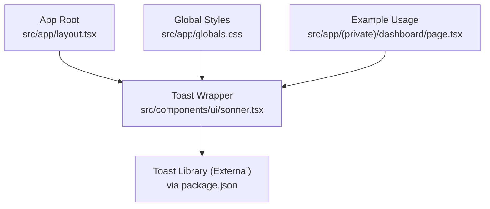
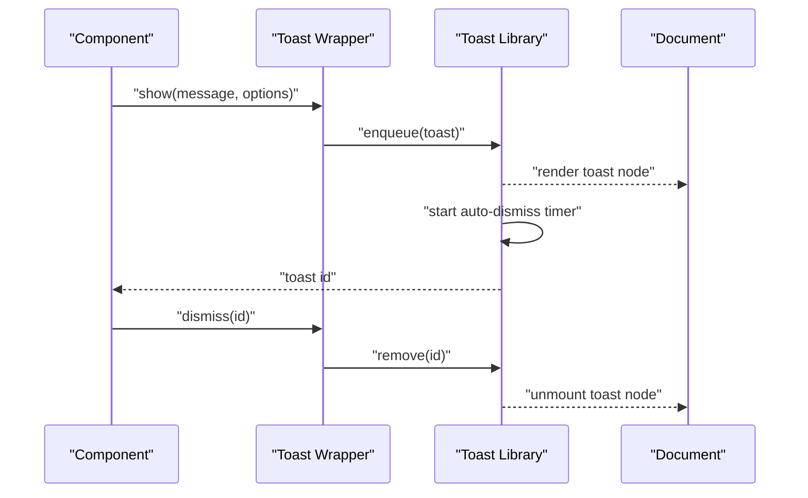
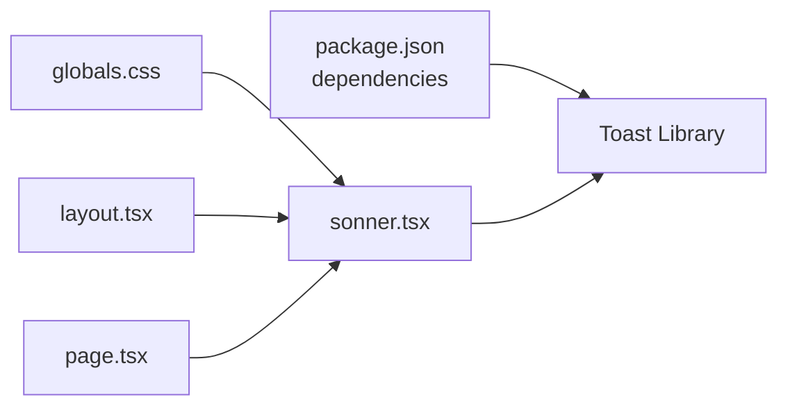

# Toast Component

<cite>
**Referenced Files in This Document**
- [sonner.tsx](file://src/components/ui/sonner.tsx)
- [package.json](file://package.json)
- [globals.css](file://src/app/globals.css)
- [layout.tsx](file://src/app/layout.tsx)
- [page.tsx](file://src/app/(private)/dashboard/page.tsx)
</cite>

## Table of Contents
1. [Introduction](#introduction)
2. [Project Structure](#project-structure)
3. [Core Components](#core-components)
4. [Architecture Overview](#architecture-overview)
5. [Detailed Component Analysis](#detailed-component-analysis)
6. [Dependency Analysis](#dependency-analysis)
7. [Performance Considerations](#performance-considerations)
8. [Troubleshooting Guide](#troubleshooting-guide)
9. [Conclusion](#conclusion)
10. [Appendices](#appendices)

## Introduction
This document explains the Toast notification system used across the application. It covers how to create toasts, control positioning and stacking, configure auto-dismiss behavior, and manage queues. It also provides examples for success toasts, error notifications, loading indicators, and custom content, along with programmatic API usage, duration settings, action buttons, z-index handling, mobile responsiveness, accessibility guidelines, and internationalization support.

The project integrates a toast library via a UI wrapper component and uses global styles and layout configuration to ensure consistent rendering and behavior.

## Project Structure
The toast implementation is centered around a thin UI wrapper that exposes the underlying toast library’s API. The wrapper is included at the application root so toasts can be triggered from anywhere in the app. Global CSS provides base styling, while the root layout ensures the toast container is mounted early.

**Diagram sources**
- [layout.tsx](file://src/app/layout.tsx)
- [sonner.tsx](file://src/components/ui/sonner.tsx)
- [package.json](file://package.json)
- [globals.css](file://src/app/globals.css)
- [page.tsx](file://src/app/(private)/dashboard/page.tsx)

**Section sources**
- [sonner.tsx](file://src/components/ui/sonner.tsx)
- [package.json](file://package.json)
- [globals.css](file://src/app/globals.css)
- [layout.tsx](file://src/app/layout.tsx)
- [page.tsx](file://src/app/(private)/dashboard/page.tsx)

## Core Components
- Toast Wrapper: A small component that mounts the toast provider and exposes methods such as show, error, loading, and dismiss. It centralizes default options like position, duration, and stacking behavior.
- Global Styles: Base CSS rules that define toast container placement, stacking order, spacing, and responsive adjustments.
- App Layout Integration: Ensures the toast provider is present at the top of the React tree so all components can trigger toasts.

Key responsibilities:
- Provide a single import point for toast APIs.
- Configure defaults for positioning and auto-dismiss.
- Ensure proper z-index and stacking context.
- Support mobile-friendly layouts and accessible markup.

**Section sources**
- [sonner.tsx](file://src/components/ui/sonner.tsx)
- [globals.css](file://src/app/globals.css)
- [layout.tsx](file://src/app/layout.tsx)

## Architecture Overview
The toast architecture follows a simple pattern:
- The app layout mounts the toast provider once.
- Any component calls the toast API to enqueue a notification.
- The toast library manages queueing, stacking, animations, and auto-dismiss timers.
- Global styles control visual presentation and responsive behavior.

**Diagram sources**
- [sonner.tsx](file://src/components/ui/sonner.tsx)
- [package.json](file://package.json)

## Detailed Component Analysis

### Toast Wrapper Implementation
The wrapper encapsulates the toast library and exposes a concise API surface. It typically:
- Imports the toast library functions.
- Exposes convenience methods for common scenarios (success, error, loading).
- Applies default options (position, duration, stacking).
- Provides a method to programmatically dismiss specific or all toasts.

Typical usage patterns:
- Show a success toast after an operation completes.
- Show an error toast when an operation fails.
- Show a loading toast during async work and dismiss it on completion.
- Show a toast with an action button that triggers a callback.

Programmatic control:
- Create: call the primary show function with message and options.
- Dismiss: call dismiss with a specific id or clear all.
- Update: some libraries allow updating existing toasts by id.

Duration and auto-dismiss:
- Set a duration per toast; if omitted, use the configured default.
- Auto-dismiss starts when the toast appears and pauses on hover/focus if supported.

Positioning and stacking:
- Choose a position (e.g., top-right, bottom-left).
- Manage stacking via max visible count and gap between items.
- Control z-index to ensure toasts appear above overlays and modals.

Action buttons:
- Include an action label and handler within the toast options.
- Handle user interaction without preventing auto-dismiss unless required.

Accessibility:
- Use semantic roles and aria attributes provided by the library.
- Ensure focus management and keyboard navigation are preserved.
- Announce changes to screen readers via live regions where applicable.

Internationalization:
- Pass localized strings into the toast message or action labels.
- Avoid hardcoding text; prefer i18n keys resolved at runtime.

Mobile responsiveness:
- Adjust position and width for smaller screens.
- Ensure touch targets for actions meet minimum size requirements.
- Reduce animation complexity on low-power devices if needed.

Queue management:
- The library enqueues toasts and renders them in order.
- Limit concurrent toasts to avoid clutter.
- Consider grouping related messages to reduce noise.

Z-index handling:
- Ensure the toast container has a high enough z-index to overlay dialogs and drawers.
- Verify no parent elements override stacking contexts unexpectedly.

Examples:
- Success toast: display a confirmation message after saving data.
- Error notification: show details about a failed request.
- Loading indicator: show a transient “processing” message.
- Custom content: embed a short form or link inside the toast.

**Section sources**
- [sonner.tsx](file://src/components/ui/sonner.tsx)
- [package.json](file://package.json)

### Global Styles and Positioning
Global styles define:
- Container placement (top/bottom, left/right).
- Spacing and margins for stacked toasts.
- Max width and responsive breakpoints.
- Z-index layering relative to other UI elements.
- Animation durations and easing for entrance/exit.

Best practices:
- Keep styles minimal and rely on the library’s built-in classes.
- Override only what is necessary for brand consistency.
- Test across viewports to confirm readability and usability.

**Section sources**
- [globals.css](file://src/app/globals.css)

### App Layout Integration
The root layout includes the toast provider so that any component can invoke toasts without additional setup. This guarantees:
- Single source of truth for toast configuration.
- Consistent z-index and stacking context.
- Early availability of the toast API throughout the app.

**Section sources**
- [layout.tsx](file://src/app/layout.tsx)

### Example Usage in Pages
Pages demonstrate practical usage:
- Trigger toasts on user actions (form submissions, toggles).
- Combine toasts with async flows (loading then success/error).
- Use action buttons for quick follow-ups (undo, retry).

**Section sources**
- [page.tsx](file://src/app/(private)/dashboard/page.tsx)

## Dependency Analysis
The toast system depends on:
- The toast library declared in package dependencies.
- The wrapper component that imports and re-exports the API.
- Global styles that influence appearance and layout.
- The app layout that mounts the provider.

**Diagram sources**
- [package.json](file://package.json)
- [sonner.tsx](file://src/components/ui/sonner.tsx)
- [globals.css](file://src/app/globals.css)
- [layout.tsx](file://src/app/layout.tsx)
- [page.tsx](file://src/app/(private)/dashboard/page.tsx)

**Section sources**
- [package.json](file://package.json)
- [sonner.tsx](file://src/components/ui/sonner.tsx)
- [globals.css](file://src/app/globals.css)
- [layout.tsx](file://src/app/layout.tsx)
- [page.tsx](file://src/app/(private)/dashboard/page.tsx)

## Performance Considerations
- Prefer short-lived toasts for transient feedback; reserve longer durations for important information.
- Limit the number of simultaneous toasts to reduce DOM churn.
- Avoid heavy custom content inside toasts; keep them lightweight.
- Debounce rapid successive toasts when possible to prevent flooding.
- Use stable ids for toasts that may be updated rather than recreated.

[No sources needed since this section provides general guidance]

## Troubleshooting Guide
Common issues and resolutions:
- Toasts not appearing: verify the toast provider is mounted in the root layout and that the wrapper is imported correctly.
- Incorrect stacking or z-index conflicts: check global styles and ensure no parent containers override stacking contexts.
- Auto-dismiss not working: confirm duration is set and not overridden by hover/focus behaviors.
- Action buttons not responding: ensure event handlers are passed correctly and not prevented by parent listeners.
- Mobile layout problems: adjust width and position via global styles or wrapper options for small screens.
- Accessibility concerns: validate that aria attributes and live region announcements are present and readable by assistive technologies.

**Section sources**
- [sonner.tsx](file://src/components/ui/sonner.tsx)
- [globals.css](file://src/app/globals.css)
- [layout.tsx](file://src/app/layout.tsx)

## Conclusion
The toast system provides a streamlined way to deliver timely feedback to users. By centralizing configuration in a wrapper component, leveraging global styles for consistent presentation, and integrating at the app root, the system remains easy to use and maintain. Follow the guidelines for accessibility, internationalization, and mobile responsiveness to ensure a robust experience across devices and languages.

[No sources needed since this section summarizes without analyzing specific files]

## Appendices

### API Quick Reference
- Show a toast: call the main show function with message and options.
- Dismiss a toast: call dismiss with a specific id or clear all.
- Duration: set per-toast or rely on defaults.
- Position: choose from available positions.
- Stacking: configure max visible and gaps.
- Actions: include an action label and handler.
- Custom content: pass rich content when appropriate.

[No sources needed since this section provides general guidance]